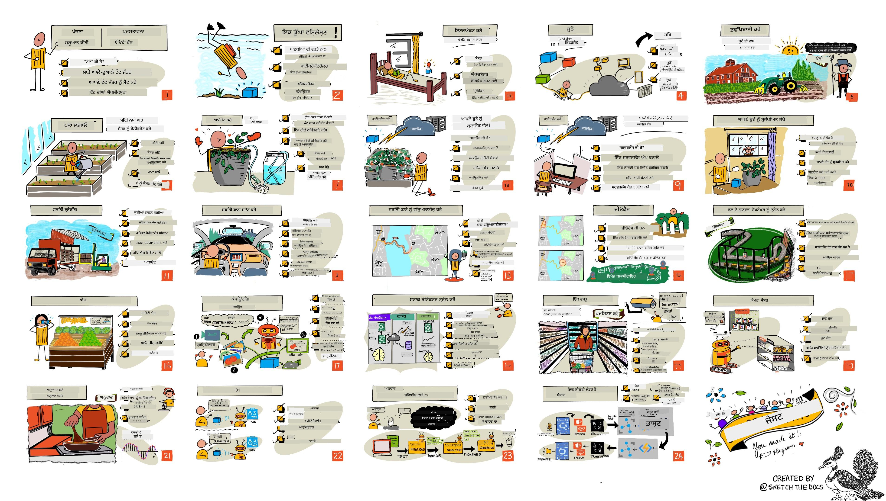

<!--
CO_OP_TRANSLATOR_METADATA:
{
  "original_hash": "6c354ec3487e4f6cfafbe44557996cd9",
  "translation_date": "2026-01-06T03:45:02+00:00",
  "source_file": "README.md",
  "language_code": "pa"
}
-->
[](https://github.com/microsoft/IoT-For-Beginners/blob/master/LICENSE)
[](https://GitHub.com/microsoft/IoT-For-Beginners/graphs/contributors/)
[](https://GitHub.com/microsoft/IoT-For-Beginners/issues/)
[](https://GitHub.com/microsoft/IoT-For-Beginners/pulls/)
[](http://makeapullrequest.com)

[](https://GitHub.com/microsoft/IoT-For-Beginners/watchers/)
[](https://GitHub.com/microsoft/IoT-For-Beginners/network/)
[](https://GitHub.com/microsoft/IoT-For-Beginners/stargazers/)

### ਐਜ਼ੂਰ ਏਆਈ ਫਾਊਂਡਰੀ ਕਮਿਊਨਿਟੀ ਵਿੱਚ ਸ਼ਾਮਲ ਹੋਵੋ

ਜੇ ਤੁਸੀਂ ਫਸ ਜਾਂਦੇ ਹੋ ਜਾਂ AI ਐਪਸ ਬਣਾਉਣ ਬਾਰੇ ਕੋਈ ਸਵਾਲ ਹੈ। MCP ਬਾਰੇ ਚਰਚਾਵਾਂ ਵਿੱਚ ਸਾਥੀ ਸਿੱਖਿਅਕਾਂ ਅਤੇ ਤਜਰਬੇਕਾਰ ਵਿਕਾਸਕਾਰਾਂ ਨਾਲ ਸ਼ਾਮਲ ਹੋਵੋ। ਇਹ ਇੱਕ ਸਹਾਇਕ ਕਮਿਊਨਿਟੀ ਹੈ ਜਿੱਥੇ ਸਵਾਲਾਂ ਦਾ ਸਵਾਗਤ ਹੈ ਅਤੇ ਗਿਆਨ ਮੁਫ਼ਤ ਸਾਂਝਾ ਕੀਤਾ ਜਾਂਦਾ ਹੈ।

[](https://discord.gg/nTYy5BXMWG)

ਜੇ ਤੁਹਾਡੇ ਕੋਲ ਉਤਪਾਦ ਫੀਡਬੈਕ ਜਾਂ ਗਲਤੀਆਂ ਹਨ ਤਾਂ ਬਣਾਉਂਦੇ ਸਮੇਂ ਵੇਖੋ:

[](https://aka.ms/foundry/forum)

ਸ਼ੁਰੂਆਤ ਕਰਨ ਲਈ ਇਹ ਕਦਮ ਅਪਣਾਓ:
1. **ਰਿਪੋਜ਼ਿਟਰੀ ਫੋਰਕ ਕਰੋ**: ਕਲਿੱਕ ਕਰੋ [](https://GitHub.com/microsoft/IoT-For-Beginners/fork)
2. **ਰਿਪੋਜ਼ਿਟਰੀ ਕਲੋਨ ਕਰੋ**:   `git clone https://github.com/microsoft/IoT-For-Beginners.git`
3. [**ਮਾਇਕਰੋਸੋਟ ਫਾਊਂਡਰੀ ਡਿਸਕੋਰਡ ਨਾਲ ਸ਼ਾਮਲ ਹੋਵੋ ਅਤੇ ਮਾਹਰਾਂ ਅਤੇ ਹੋਰ ਵਿਕਾਸਕਾਰਾਂ ਨੂੰ ਮਿਲੋ**](https://discord.com/invite/ByRwuEEgH4)


### 🌐 ਬਹੁ-ਭਾਸ਼ਾ ਸਹਾਇਤਾ

#### GitHub ਇਕਸ਼ਨ ਰਾਹੀਂ ਸਹਾਇਤਾਵਾਂ (ਆਟੋਮੈਟਿਡ ਅਤੇ ਸਦਾ ਅਪ-ਟੂ-ਡੇਟ)

<!-- CO-OP TRANSLATOR LANGUAGES TABLE START -->
[Arabic](../ar/README.md) | [Bengali](../bn/README.md) | [Bulgarian](../bg/README.md) | [Burmese (Myanmar)](../my/README.md) | [Chinese (Simplified)](../zh/README.md) | [Chinese (Traditional, Hong Kong)](../hk/README.md) | [Chinese (Traditional, Macau)](../mo/README.md) | [Chinese (Traditional, Taiwan)](../tw/README.md) | [Croatian](../hr/README.md) | [Czech](../cs/README.md) | [Danish](../da/README.md) | [Dutch](../nl/README.md) | [Estonian](../et/README.md) | [Finnish](../fi/README.md) | [French](../fr/README.md) | [German](../de/README.md) | [Greek](../el/README.md) | [Hebrew](../he/README.md) | [Hindi](../hi/README.md) | [Hungarian](../hu/README.md) | [Indonesian](../id/README.md) | [Italian](../it/README.md) | [Japanese](../ja/README.md) | [Kannada](../kn/README.md) | [Korean](../ko/README.md) | [Lithuanian](../lt/README.md) | [Malay](../ms/README.md) | [Malayalam](../ml/README.md) | [Marathi](../mr/README.md) | [Nepali](../ne/README.md) | [Nigerian Pidgin](../pcm/README.md) | [Norwegian](../no/README.md) | [Persian (Farsi)](../fa/README.md) | [Polish](../pl/README.md) | [Portuguese (Brazil)](../br/README.md) | [Portuguese (Portugal)](../pt/README.md) | [Punjabi (Gurmukhi)](./README.md) | [Romanian](../ro/README.md) | [Russian](../ru/README.md) | [Serbian (Cyrillic)](../sr/README.md) | [Slovak](../sk/README.md) | [Slovenian](../sl/README.md) | [Spanish](../es/README.md) | [Swahili](../sw/README.md) | [Swedish](../sv/README.md) | [Tagalog (Filipino)](../tl/README.md) | [Tamil](../ta/README.md) | [Telugu](../te/README.md) | [Thai](../th/README.md) | [Turkish](../tr/README.md) | [Ukrainian](../uk/README.md) | [Urdu](../ur/README.md) | [Vietnamese](../vi/README.md)

> **ਕੀ ਤੁਸੀਂ ਲੋਕਲੀ ਕਲੋਨ ਕਰਨਾ ਪਸੰਦ ਕਰਦੇ ਹੋ?**

> ਇਸ ਰਿਪੋਜ਼ਿਟਰੀ ਵਿੱਚ 50+ ਭਾਸ਼ਾਈ ਅਨੁਵਾਦ ਸ਼ਾਮਲ ਹਨ ਜੋ ਡਾਊਨਲੋਡ ਆਕਾਰ ਨੂੰ ਬਹੁਤ ਵਧਾਉਂਦੇ ਹਨ। ਬਿਨਾਂ ਅਨੁਵਾਦ ਸਾਥੇ ਕਲੋਨ ਕਰਨ ਲਈ, ਸਪਾਰਸ ਚੈਕਆਉਟ ਦੀ ਵਰਤੋਂ ਕਰੋ:
> ```bash
> git clone --filter=blob:none --sparse https://github.com/microsoft/IoT-For-Beginners.git
> cd IoT-For-Beginners
> git sparse-checkout set --no-cone '/*' '!translations' '!translated_images'
> ```
> ਇਹ ਤੁਹਾਨੂੰ ਕੋਰਸ ਪੂਰਾ ਕਰਨ ਲਈ ਜ਼ਰੂਰੀ ਸਾਰੀ ਚੀਜ਼ਾਂ ਬਹੁਤ ਤੇਜ਼ ਡਾਊਨਲੋਡ ਨਾਲ ਦਿੰਦਾ ਹੈ।
<!-- CO-OP TRANSLATOR LANGUAGES TABLE END -->

# ਨਵਾਂ শੁਰੂਆਤੀ ਲਈ IoT - ਇੱਕ ਕੋਰਸ

ਮਾਈਕਰੋਸੋਫਟ ਦੇ ਐਜ਼ੂਰ ਕਲਾਉਡ ਐਡਵੋਕੇਟਸ ਖੁਸ਼ ਹਨ ਕਿ ਉਹ IoT ਬੁਨਿਆਦੀ ਜਾਣਕਾਰੀ ਬਾਰੇ 12 ਹਫ਼ਤੇ, 24 ਪਾਠਾਂ ਵਾਲਾ ਕੋਰਸ ਮੁਹੱਈਆ ਕਰ ਰਹੇ ਹਨ। ਹਰ ਪਾਠ ਵਿੱਚ ਪਹਿਲਾਂ ਅਤੇ ਬਾਅਦ ਵਿੱਚ ਕਵੀਜ਼, ਪਾਠ ਪੂਰਾ ਕਰਨ ਲਈ ਲਿਖਤੀ ਹਦਾਇਤਾਂ, ਹੱਲ, ਕੰਮ ਅਤੇ ਹੋਰ ਵੀ ਸ਼ਾਮਲ ਹਨ। ਸਾਡੀ ਪ੍ਰੋਜੈਕਟ-ਅਧਾਰਿਤ ਪੇਡਾਗੋਗੀ ਤੁਹਾਨੂੰ ਬਣਾਉਂਦੇ ਸਮੇਂ ਸਿੱਖਣ ਦਿੰਦੀ ਹੈ, ਜੋ ਵਧੀਆ ਤਰੀਕਾ ਹੈ ਨਵੀਂਆਂ ਕੁਸ਼ਲਤਾਵਾਂ ਨੂੰ ਲਗਾਤਾਰ ਸਿੱਖਣ ਲਈ।

ਇਹ ਪ੍ਰੋਜੈਕਟ ਖੇਤੀ ਤੋਂ стол ਤਕ ਖਾਣੇ ਦੀ ਯਾਤਰਾ ਨੂੰ ਕਵਰ ਕਰਦੇ ਹਨ। ਇਸ ਵਿੱਚ ਖੇਤੀਬਾੜੀ, ਲੋਜਿਸਟਿਕਸ, ਮਨੂਫੈਕਚਰਿੰਗ, ਰੀਟੇਲ ਅਤੇ ਖਪਤਕਾਰ ਸ਼ਾਮਲ ਹਨ - ਸਾਰੇ IoT ਡਿਵਾਈਸਾਂ ਲਈ ਲੋਕਪ੍ਰਿਯ ਉਦਯੋਗ ਖੇਤਰ ਹਨ।



> ਸਕੇਚਨੋਟ [ਨਿਤਯਾ ਨਰਸਿੰਘ](https://github.com/nitya) ਵੱਲੋਂ। ਵੱਡੇ ਆਕਾਰ ਲਈ ਚਿੱਤਰ 'ਤੇ ਕਲਿੱਕ ਕਰੋ।

**ਸਾਡੇ ਲੇਖਕਾਂ ਦਾ ਦਿਲੋਂ ਧੰਨਵਾਦ [ਜੇਨ ਫਾਕਸ](https://github.com/jenfoxbot), [ਜੇਨ ਲੂਪਰ](https://github.com/jlooper), [ਜਿਮ ਬੈਨਟ](https://github.com/jimbobbennett), ਅਤੇ ਸਾਡੇ ਸਕੇਚਨੋਟ ਕਲਾਕਾਰ [ਨਿਤਯਾ ਨਰਸਿੰਘ](https://github.com/nitya) ਨੂੰ।**

**ਸਾਡੇ [Microsoft Learn Student Ambassadors](https://studentambassadors.microsoft.com?WT.mc_id=academic-17441-jabenn) ਦੀ ਟੀਮ ਨੂੰ ਵੀ ਧੰਨਵਾਦ ਜਿਹੜੇ ਇਸ ਕੋਰਸ ਦੀ ਸਮੀਖਿਆ ਅਤੇ ਅਨੁਵਾਦ ਕਰ ਰਹੇ ਹਨ - [ਆਦਿਤਿਆ ਗਰਗ](https://github.com/AdityaGarg00), [ਅਨੁਰਾਗ ਸ਼ਰਮਾ](https://github.com/Anurag-0-1-A), [ਅਰਪਿਤਾ ਦਾਸ](https://github.com/Arpiiitaaa), [ਅਰਯਨ ਜੈਨ](https://www.linkedin.com/in/aryan-jain-47a4a1145/), [ਭਵੇਸ਼ ਸੁਨੇਜਾ](https://github.com/EliteWarrior315), [ਫੈਥ ਹੁੰਜਾ](https://faithhunja.github.io/), [ਲਤੀਫਾਹ ਬੇਲੋ](https://www.linkedin.com/in/lateefah-bello/), [ਮਨਵੀ ਝਾ](https://github.com/Severus-Matthew), [ਮਿਰੇਲ ਤਾਨ](https://www.linkedin.com/in/mireille-tan-a4834819a/), [ਮੋਹੱਮਦ ਇਫ਼ਤਖੇਰ (ਇਫਤੂ) ਇਬਨੇ ਜਲਾਲ](https://github.com/Iftu119), [ਮੋਹੱਮਦ ਜੁਲਫਿਕਾਰ](https://github.com/mohzulfikar), [ਪ੍ਰਿਅਂਸ਼ੁ ਸ੍ਰਿਵਾਸਤਵ](https://www.linkedin.com/in/priyanshu-srivastav-b067241ba), [ਥਨਮਈ ਗੋਡੁਚੇਰੂਵੁ](https://github.com/innovation-platform), ਅਤੇ [ਜ਼ੀਨਾ ਕਾਮੇਲ](https://www.linkedin.com/in/zina-kamel/)).**

ਟੀਮ ਨਾਲ ਮਿਲੋ!

[](https://youtu.be/-wippUJRi5k)

**ਗਿਫ਼ ਦੇ ਮੋਹਿਤ ਜੈਸਲ** (https://linkedin.com/in/mohitjaisal)

> 🎥 ਪ੍ਰੋਜੈਕਟ ਬਾਰੇ ਵੀਡੀਓ ਲਈ ਉੱਪਰ ਦਿੱਤੇ ਚਿੱਤਰ 'ਤੇ ਕਲਿੱਕ ਕਰੋ!

> **ਅਧਿਆਪਕਾਂ**, ਅਸੀਂ ਇਸ ਕੋਰਸ ਨੂੰ ਵਰਤਣ ਲਈ ਕੁਝ ਸੁਝਾਅ ਸ਼ਾਮਲ ਕੀਤੇ ਹਨ [for-teachers.md](for-teachers.md) ਵਿੱਚ। ਜੇ ਤੁਸੀਂ ਆਪਣੇ ਪਾਠਾਬਲੀ ਬਣਾਉਣਾ ਚਾਹੁੰਦੇ ਹੋ ਤਾਂ ਅਸੀਂ ਇੱਕ [ਪਾਠ ਟੈਂਪਲੇਟ](lesson-template/README.md) ਵੀ ਦਿੱਤਾ ਹੈ।

> **[ਵਿਦਿਆਰਥੀ](https://aka.ms/student-page)**, ਇਸ ਕੋਰਸ ਨੂੰ ਖੁਦ ਵਰਤਣ ਲਈ ਸਾਰਾ ਰਿਪੋ ਫੋਰਕ ਕਰੋ ਅਤੇ ਆਪਣੇ ਆਪ ਅਭਿਆਸ ਪੂਰੇ ਕਰੋ, ਪਹਿਲਾਂ ਕਵੀਜ਼ ਦੇ ਕੇ, ਫਿਰ ਲੈਕਚਰ ਪੜ੍ਹ ਕੇ ਅਤੇ ਹੋਰ ਕਿਰਿਆਵਾਂ ਪੂਰੀਆਂ ਕਰੋ। ਹੱਲ ਦੀ ਕੋਡ ਕਾਪੀ ਕਰਨ ਦੀ ਬਜਾਏ ਪਾਠ ਨੂੰ ਸਮਝ ਕੇ ਪ੍ਰੋਜੈਕਟ ਬਨਾਉਣ ਦੀ ਕੋਸ਼ਿਸ਼ ਕਰੋ; ਇਹ ਕੋਡ ਹਰੇਕ ਪ੍ਰੋਜੈਕਟ-ਕੇਂਦਰਿਤ ਪਾਠ ਵਿੱਚ /solutions ਫੋਲਡਰ ਵਿੱਚ ਉਪਲਬਧ ਹੈ। ਇੱਕ ਹੋਰ ਵਿਚਾਰ ਇਹ ਹੈ ਕਿ ਦੋਸਤਾਂ ਨਾਲ ਸਟਡੀ ਗਰੁੱਪ ਬਣਾਓ ਅਤੇ ਸਮੱਗਰੀ ਨੂੰ ਮਿਲ ਕੇ ਸਮਝੋ। ਵਧੇਰੇ ਅਧਿਐਨ ਲਈ, ਅਸੀਂ [Microsoft Learn](https://docs.microsoft.com/users/jimbobbennett/collections/ke2ehd351jopwr?WT.mc_id=academic-17441-jabenn) ਦੀ ਸਿਫ਼ਾਰਿਸ਼ ਕਰਦੇ ਹਾਂ।

ਇਸ ਕੋਰਸ ਦਾ ਵੀਡੀਓ ਜਾਇਜ਼ਾ ਦੇਖੋ:

[](https://youtube.com/watch?v=bccEMm8gRuc "ਪ੍ਰੋਮੋ ਵੀਡੀਓ")

> 🎥 ਪ੍ਰੋਜੈਕਟ ਬਾਰੇ ਵੀਡੀਓ ਲਈ ਉੱਪਰ ਦਿੱਤੇ ਚਿੱਤਰ 'ਤੇ ਕਲਿੱਕ ਕਰੋ!

## ਪੇਡਾਗੋਗੀ

ਅਸੀਂ ਇਸ ਕੋਰਸ ਦੇ ਰੂਪ ਵਿੱਚ ਦੋ ਪੈਡਾਗੋਜੀਕਲ ਨੀਤੀਵਾਂ ਚੁਣੀਆਂ ਹਨ: ਇਹ ਪ੍ਰੋਜੈਕਟ-ਅਧਾਰਿਤ ਹੋਣੀ ਚਾਹੀਦੀ ਹੈ ਅਤੇ ਇਸ ਵਿੱਚ ਮੁੜ-ਮੁੜ ਕਵੀਜ਼ ਸ਼ਾਮਲ ਹੋਣ। ਇਸ ਸੀਰੀਜ਼ ਦੇ ਅੰਤ ਵਿੱਚ, ਵਿਦਿਆਰਥੀਆਂ ਨੇ ਇੱਕ ਪੌਧਾ ਨਿਗਰਾਨੀ ਅਤੇ ਪਾਣੀ دینے ਵਾਲਾ ਸਿਸਟਮ, ਇੱਕ ਵਾਹਨ ਟਰੈਕਰ, ਖਾਦ ਦੀ ਜਾਂਚ ਕਰਨ ਵਾਲਾ ਸਮਾਰਟ ਫੈਕਟਰੀ ਸੈੱਟਅਪ ਅਤੇ ਇੱਕ ਵੌਇਸ-ਕੰਟਰੋਲ ਕੂਕਿੰਗ ਟਾਈਮਰ ਬਣਾਇਆ ਹੋਵੇਗਾ ਅਤੇ ਉਹਨਾਂ ਨੇ ਇੰਟਰਨੈੱਟ ਆਫ਼ ਥਿੰਗਜ਼ ਦੇ ਬੁਨਿਆਦੀ ਮੂਲ ਸਿੱਖੇ ਹਨ ਜਿਵੇਂ ਡਿਵਾਈਸ ਕੋਡ ਲਿਖਣਾ, ਕਲਾਉਡ ਨਾਲ ਜੁੜਨਾ, ਟੈਲੀਮੇਟਰੀ ਦਾ ਵਿਸ਼ਲੇਸ਼ਣ ਅਤੇ ਏਜ 'ਤੇ AI ਚਲਾਉਣਾ।

ਇਸ ਗੱਲ ਨੂੰ ਯਕੀਨੀ ਬਨਾਉਣ ਨਾਲ ਕਿ ਸਮੱਗਰੀ ਪ੍ਰੋਜੈਕਟਾਂ ਨਾਲ ਮਿਲਦੀ ਹੈ, ਵਿਦਿਆਰਥੀਆਂ ਲਈ ਇਹ ਪ੍ਰਕਿਰਿਆ ਹੋਰ ਦਿਲਚਸਪ ਬਣਦੀ ਹੈ ਅਤੇ ਧਾਰਨਾ ਦੀ ਧਾਰਨਾ ਵਧਦੀ ਹੈ।

ਜਦੋਂ ਇੱਕ ਕਲਾਸ ਤੋਂ ਪਹਿਲਾਂ ਇੱਕ ਹਲਕੀ ਕਵੀਜ਼ ਵਿਦਿਆਰਥੀ ਨੂੰ ਵੀਸ਼ਾ ਸਿੱਖਣ ਲਈ ਤਿਆਰ ਕਰਦਾ ਹੈ, ਤਾਂ ਕਲਾਸ ਤੋਂ ਬਾਅਦ ਦੂਜਾ ਕਵੀਜ਼ ਹੋਰ ਸਟੱਡੀ ਨੂੰ ਯਕੀਨੀ ਬਣਾਉਂਦਾ ਹੈ। ਇਹ ਕੋਰਸ ਲਚਕੀਲਾ ਅਤੇ ਮਨੋਰੰਜਕ ਹੈ ਅਤੇ ਪੂਰਨ ਜਾਂ ਸੰਖੈਪ ਵਿੱਚ ਲਿਆ ਜਾ ਸਕਦਾ ਹੈ। ਪ੍ਰੋਜੈਕਟ ਛੋਟੇ ਹਨ ਅਤੇ 12 ਹਫ਼ਤਿਆਂ ਦੇ ਚੱਕਰ ਦੇ ਅੰਤ ਤੱਕ ਵੱਧ ਜਟਿਲ ਹੋ ਜਾਂਦੇ ਹਨ।

ਹਰ ਪ੍ਰੋਜੈਕਟ ਅਸਲੀ ਦੁਨੀਆ ਦੇ ਹਾਰਡਵੇਅਰ ਤੇ ਆਧਾਰਿਤ ਹੈ ਜੋ ਵਿਦਿਆਰਥੀ ਅਤੇ ਸ਼ੌਕੀਨਾਂ ਲਈ ਉਪਲਬਧ ਹੈ। ਹਰ ਪ੍ਰੋਜੈਕਟ ਖਾਸ ਡੋਮੇਨ ਵਿੱਚ ਦੇਖਦਾ ਹੈ, ਪ੍ਰਭਾਵਸ਼ਾਲੀ ਪਿਛੋਕੜ ਗਿਆਨ ਦਿੰਦਾ ਹੈ। ਇੱਕ ਸਫਲ ਵਿਕਾਸਕਾਰ ਬਣਨ ਲਈ, ਤੁਹਾਨੂੰ ਉਸ ਖੇਤਰ ਨੂੰ ਸਮਝਣਾ ਲਾਜ਼ਮੀ ਹੈ ਜਿੱਥੇ ਤੁਸੀਂ ਸਮੱਸਿਆਵਾਂ ਨੂੰ ਹੱਲ ਕਰ ਰਹੇ ਹੋ। ਇਹ ਪਿਛੋਕੜ ਵਿਦਿਆਰਥੀਆਂ ਨੂੰ ਆਪਣੇ IoT ਸਮਾਧਾਨ ਅਤੇ ਸਿੱਖਣਾਂ ਬਾਰੇ ਸੋਚਣ ਅਤੇ ਉਸ ਤਰ੍ਹਾਂ ਸਮਝਣ ਵਿੱਚ ਮਦਦ ਕਰਦਾ ਹੈ ਜਿਵੇਂ ਉਹ ਇੱਕ ਅਸਲੀ ਸਮੱਸਿਆ ਹੱਲ ਕਰ ਰਹੇ ਹਨ। ਵਿਦਿਆਰਥੀ ਉਹਨਾਂ ਨਤੀਜਿਆਂ ਨੂੰ ਸਮਝਦੇ ਹਨ ਜੋ ਉਹ ਬਣਾ ਰਹੇ ਹਨ ਅਤੇ ਅੰਤਮ ਉਪਭੋਗਤਾ ਦੀ ਕੀਮਤ ਨੂੰ ਸਮਝਦੇ ਹਨ।

## ਹਾਰਡਵੇਅਰ

ਪ੍ਰੋਜੈਕਟਾਂ ਲਈ ਹਮਾਰੇ ਕੋਲ ਦੋ IoT ਹਾਰਡਵੇਅਰ ਚੋਣਾਂ ਹਨ ਜੋ ਨਿੱਜੀ ਪਸੰਦ, ਪ੍ਰੋਗਰਾਮਿੰਗ ਭਾਸ਼ਾ ਦਾ ਗਿਆਨ ਜਾਂ ਪ੍ਰਾਥਮਿਕਤਾ, ਸਿੱਖਣ ਦੇ ਲਕੜਾਂ ਅਤੇ ਉਪਲਬਧਤਾ 'ਤੇ ਨਿਰਭਰ ਕਰਦੀਆਂ ਹਨ। ਅਸੀਂ ਉਹਨਾਂ ਲਈ ਵੀ ਇੱਕ 'ਵਰਚੁਅਲ ਹਾਰਡਵੇਅਰ' ਵਰਜ਼ਨ ਦਿੱਤਾ ਹੈ ਜਿਨ੍ਹਾਂ ਕੋਲ ਹਾਰਡਵੇਅਰ ਦੀ ਪਹੁੰਚ ਨਹੀਂ ਹੈ ਜਾਂ ਜੋ ਖਰੀਦਣ ਤੋਂ ਪਹਿਲਾਂ ਹੋਰ ਸਿੱਖਣਾ ਚਾਹੁੰਦੇ ਹਨ। ਤੁਸੀਂ [hardware page](./hardware.md) 'ਤੇ ਹੋਰ ਪੜ੍ਹ ਸਕਦੇ ਹੋ ਅਤੇ ਸਾਡੀਆਂ ਮਿੱਤਰ ਰਹੀਆਂ Seeed Studio ਤੋਂ ਪੂਰੇ ਕੀਟ ਖਰੀਦਣ ਬਾਰੇ ਲਿੰਕ ਵੀ ਮਿਲੇਗਾ।
> 💁 ਸਾਡੇ [ਕੋਡ ਆਫ ਕੰਡਕਟ](CODE_OF_CONDUCT.md), [ਯੋਗਦਾਨ](CONTRIBUTING.md), ਅਤੇ [ਅਨੁਵਾਦ](TRANSLATIONS.md) ਨਿਰਦੇਸ਼ਾਂ ਨੂੰ ਵੇਖੋ। ਅਸੀਂ ਤੁਹਾਡੇ ਰਚਨਾਤਮਕ ਪ੍ਰਤੀਕਰਮ ਦੀ ਸਰਾਹਨਾ ਕਰਦੇ ਹਾਂ!
>
> 🔧 ਸਮੱਸਿਆਵਾਂ ਆ ਰਹੀਆਂ ਹਨ? ਸਾਡੇ [ਟਰਬਲਸ਼ੂਟਿੰਗ ਗਾਈਡ](TROUBLESHOOTING.md) ਨੂੰ ਦੇਖੋ ਜਿੱਥੇ ਆਮ ਸਮੱਸਿਆਵਾਂ ਦੇ ਹੱਲ ਦਿੱਤੇ ਗਏ ਹਨ।

## ਹਰ ਪਾਠ ਵਿੱਚ ਸ਼ਾਮਿਲ ਹੈ:

- ਸਕੈਚਨੋਟ
- ਵੈकल्पਿਕ ਸਹਾਇਕ ਵੀਡੀਓ
- ਪੂਰਵ-ਪਾਠ ਵਰਮਅੱਪ ਕੁਇਜ਼
- ਲਿਖਤੀ ਪਾਠ
- ਪ੍ਰੋਜੈਕਟ ਅਧਾਰਿਤ ਪਾਠਾਂ ਲਈ, ਪ੍ਰੋਜੈਕਟ ਬਣਾਉਣ ਲਈ ਕਦਮ-ਦਰ-ਕਦਮ ਗਾਈਡਾਂ
- ਗਿਆਨ ਜਾਂਚ
- ਇੱਕ ਚੁਣੌਤੀ
- ਸਹਾਇਕ ਪਾਠਨ
- ਅਸਾਈਨਮੈਂਟ
- [ਪੋਸਟ-ਪਾਠ ਕੁਇਜ਼](https://ff-quizzes.netlify.app/en/)

> **ਕੁਇਜ਼ ਬਾਰੇ ਇੱਕ ਨੋਟ**: ਸਾਰੇ ਕੁਇਜ਼ quiz-app ਫੋਲਡਰ ਵਿੱਚ ਹਨ, ਜਿੱਥੇ ਕੁੱਲ 48 ਕੁਇਜ਼ ਹਨ ਹਰ ਇੱਕ ਵਿੱਚ ਤਿੰਨ ਪ੍ਰਸ਼ਨ ਹਨ। ਇਹ ਪਾਠਾਂ ਦੇ ਵਿਚਕਾਰ ਲਿੰਕ ਕੀਤੇ ਗਏ ਹਨ ਪਰ ਕੁਇਜ਼ ਐਪ ਨੂੰ ਸਥਾਨਕ ਤੌਰ 'ਤੇ ਚਲਾਇਆ ਜਾਂਦਾ ਹੈ ਜਾਂ Azure 'ਤੇ ਡਿਪਲੌਇ ਕੀਤਾ ਜਾ ਸਕਦਾ ਹੈ; `quiz-app` ਫੋਲਡਰ ਵਿੱਚ ਦਿੱਤੀਆਂ ਹਿਦਾਇਤਾਂ ਦੀ ਪਾਲਨਾ ਕਰੋ। ਇਹ ਹਨੇਰੇ-ਹਨੇਰੇ ਸਥਾਨਕਿਕਰਨ ਜਾਰੀ ਹੈ।

## ਪਾਠ

|       |              ਪ੍ਰੋਜੈਕਟ ਦਾ ਨਾਮ               |                        ਸਿੱਖਾਏ ਗਏ ਸੰਕਲਪ                       | ਸਿੱਖਣ ਦੇ ਉਦੇਸ਼                                                                                                                                                     |                                                        ਲਿੰਕ ਕੀਤਾ ਪਾਠ                                                          |
| :---: | :---------------------------------------: | :------------------------------------------------------------: | ----------------------------------------------------------------------------------------------------------------------------------------------------------------- | :--------------------------------------------------------------------------------------------------------------------------: |
|  01   | [ਸ਼ੁਰੂਆਤ](./1-getting-started/README.md) |                         IoT ਦਾ ਪਰਿਚਯ                          | IoT ਦੇ ਬੁਨਿਆਦੀ ਸਿਧਾਂਤ ਅਤੇ IoT ਹੱਲਾਂ ਦੇ ਮੁਢਲੇ ਢਾਂਚੇ ਜਿਵੇਂ ਕਿ ਸੈਂਸਰ ਅਤੇ ਕਲਾਉਡ ਸੇਵਾਵਾਂ ਸਿੱਖੋ ਜਦੋਂ ਤੁਸੀਂ ਆਪਣਾ ਪਹਿਲਾ IoT ਡਿਵਾਈਸ ਸੈੱਟ ਕਰ ਰਹੇ ਹੋ                      |                      [IoT ਦਾ ਪਰਿਚਯ](./1-getting-started/lessons/1-introduction-to-iot/README.md)                        |
|  02   | [ਸ਼ੁਰੂਆਤ](./1-getting-started/README.md) |                       IoT ਵਿੱਚ ਗਹਿਰਾਈ ਨਾਲ ਜਾਣਕਾਰੀ                      | IoT ਪ੍ਰਣਾਲੀ ਦੇ ਅੰਗ, ਮਾਈਕ੍ਰੋਕੰਟਰੋਲਰ ਅਤੇ ਸਿੰਗਲ-ਬੋਰਡ ਕੰਪਿਊਟਰਾਂ ਬਾਰੇ ਵਧੇਰੇ ਜਾਣੋ                                                                             |                        [IoT ਵਿੱਚ ਗਹਿਰਾਈ ਨਾਲ ਜਾਣਕਾਰੀ](./1-getting-started/lessons/2-deeper-dive/README.md)                     |
|  03   | [ਸ਼ੁਰੂਆਤ](./1-getting-started/README.md) | ਸੈਂਸਰ ਅਤੇ ਐਕਚੁਏਟਰ ਨਾਲ ਭੌਤਿਕੀ ਦੁਨੀਆਂ ਨਾਲ ਇੰਟਰਐਕਟ ਕਰੋ  | ਸੈਂਸਰਾਂ ਬਾਰੇ ਜਾਣੋ ਜੋ ਭੌਤਿਕੀ ਦੁਨੀਆਂ ਤੋਂ ਡਾਟਾ ਇਕੱਠਾ ਕਰਦੇ ਹਨ, ਅਤੇ ਐਕਚੁਏਟਰ ਜੋ ਫੀਡਬੈਕ ਭੇਜਦੇ ਹਨ, ਜਦੋਂ ਤੁਸੀਂ ਨਾਈਟਲਾਈਟ ਬਣਾਉਂਦੇ ਹੋ                                                  | [ਸੈਂਸਰ ਅਤੇ ਐਕਚੁਏਟਰ ਨਾਲ ਭੌਤਿਕੀ ਦੁਨੀਆਂ ਨਾਲ ਇੰਟਰਐਕਟ ਕਰੋ](./1-getting-started/lessons/3-sensors-and-actuators/README.md) |
|  04   | [ਸ਼ੁਰੂਆਤ](./1-getting-started/README.md) |                   ਆਪਣਾ ਡਿਵਾਈਸ ਇੰਟਰਨੇਟ ਨਾਲ ਜੁੜੋ                | ਸਿੱਖੋ ਕਿ ਕਿਵੇਂ ਇੱਕ IoT ਡਿਵਾਈਸ ਨੂੰ ਇੰਟਰਨੇਟ ਨਾਲ ਜੋੜਿਆ ਜਾਵੇ ਤਾਂ ਜੋ ਸੁਨੇਹੇ ਭੇਜਣ ਅਤੇ ਪ੍ਰਾਪਤ ਕਰਨ ਲਈ ਆਪਣੀ ਨਾਈਟਲਾਈਟ ਨੂੰ MQTT ਬ੍ਰੋਕਰ ਨਾਲ ਜੋੜਿਆ ਜਾ ਸਕੇ                    |               [ਆਪਣਾ ਡਿਵਾਈਸ ਇੰਟਰਨੇਟ ਨਾਲ ਜੁੜੋ](./1-getting-started/lessons/4-connect-internet/README.md)                |
|  05   |            [ਫਾਰਮ](./2-farm/README.md)            |                      ਪੌਦੇ ਦੀ ਵਾਧੂ ਦੀ ਭਵਿੱਖਬਾਣੀ                    | ਸਿੱਖੋ ਕਿ ਕਿਸ ਤਰ੍ਹਾਂ IoT ਡਿਵਾਈਸ ਦੁਆਰਾ ਕੈਪਚਰ ਕੀਤੇ ਤਾਪਮਾਨ ਡਾਟਾ ਦੀ ਵਰਤੋਂ ਕਰਕੇ ਪੌਦੇ ਦੀ ਵਾਧੂ ਕੀਤੀ ਜਾਵੇ                                                                |                          [ਪੌਦੇ ਦੀ ਵਾਧੂ ਦੀ ਭਵਿੱਖਬਾਣੀ](./2-farm/lessons/1-predict-plant-growth/README.md)                           |
|  06   |            [ਫਾਰਮ](./2-farm/README.md)            |                     ਮਿੱਟੀ ਦੀ ਨਮੀ ਦਾ ਪਤਾ ਲਗਾਓ                     | ਸਿੱਖੋ ਕਿ ਕਿਵੇਂ ਮਿੱਟੀ ਦੀ ਨਮੀ ਦਾ ਪਤਾ ਲਗਾਇਆ ਜਾਵੇ ਅਤੇ ਇੱਕ ਮਿੱਟੀ ਦੀ ਨਮੀ ਸੈਂਸਰ ਨੂੰ ਕੈਲੀਬਰੇਟ ਕੀਤਾ ਜਾਵੇ                                                                         |                          [ਮਿੱਟੀ ਦੀ ਨਮੀ ਦਾ ਪਤਾ ਲਗਾਓ](./2-farm/lessons/2-detect-soil-moisture/README.md)                           |
|  07   |            [ਫਾਰਮ](./2-farm/README.md)            |                   ਪੌਦਿਆਂ ਨੂੰ ਆਪਣੇ ਆਪ ਪਾਣੀ ਦੇਣਾ                   | ਸਿੱਖੋ ਕਿ ਕਿਵੇਂ ਇੱਕ ਰੀਲੇ ਅਤੇ MQTT ਦੀ ਵਰਤੋਂ ਕਰਕੇ ਪਾਣੀ ਦੇਣਾ ਆਟੋਮੈਟਿਕ ਅਤੇ ਸਮੇਂ ਤੇ ਕੀਤਾ ਜਾਵੇ                                                                            |                      [ਆਟੋਮੈਟਿਕ ਪੌਦਿਆਂ ਨੂੰ ਪਾਣੀ ਦੇਣਾ](./2-farm/lessons/3-automated-plant-watering/README.md)                       |
|  08   |            [ਫਾਰਮ](./2-farm/README.md)            |           ਆਪਣੇ ਪੌਦੇ ਨੂੰ ਕਲਾਉਡ ਵਿੱਚ ਮਾਈਗਰੇਟ ਕਰੋ                   | ਕਲਾਉਡ ਅਤੇ ਕਲਾਉਡ-ਹੋਸਟ ਕੀਤੀਆਂ IoT ਸੇਵਾਵਾਂ ਬਾਰੇ ਜਾਣੋ ਅਤੇ ਆਪਣੇ ਪੌਦੇ ਨੂੰ ਇਹਨਾਂ ਵਿਚੋਂ ਕਿਸੇ ਇੱਕ ਨਾਲ ਜੁੜਨ ਬਾਰੇ ਸਿੱਖੋ ਨਾ ਕਿ ਪਬਲਿਕ MQTT ਬ੍ਰੋਕਰ ਨਾਲ                                |               [ਆਪਣੇ ਪੌਦੇ ਨੂੰ ਕਲਾਉਡ ਵਿੱਚ ਮਾਈਗਰੇਟ ਕਰੋ](./2-farm/lessons/4-migrate-your-plant-to-the-cloud/README.md)                |
|  09   |            [ਫਾਰਮ](./2-farm/README.md)            |          ਆਪਣੀ ਐਪਲੀਕੇਸ਼ਨ ਲਾਜ਼ਿਕ ਨੂੰ ਕਲਾਉਡ ਵਿੱਚ ਮਾਈਗਰੇਟ ਕਰੋ         | ਸਿੱਖੋ ਕਿ ਕਿਵੇਂ ਤੁਸੀਂ ਐਪਲੀਕੇਸ਼ਨ ਲਾਜ਼ਿਕ ਲਿਖ ਸਕਦੇ ਹੋ ਜੋ ਕਲਾਉਡ ਵਿੱਚ IoT ਸੁਨੇਹਿਆਂ ਨੂੰ ਜਵਾਬ ਦਿੰਦਾ ਹੈ                                                                          |         [ਐਪਲੀਕੇਸ਼ਨ ਲਾਜ਼ਿਕ ਨੂੰ ਕਲਾਉਡ ਵਿੱਚ ਮਾਈਗਰੇਟ ਕਰੋ](./2-farm/lessons/5-migrate-application-to-the-cloud/README.md)         |
|  10   |            [ਫਾਰਮ](./2-farm/README.md)            |                  ਆਪਣੇ ਪੌਦੇ ਨੂੰ ਸੁਰੱਖਿਅਤ ਰੱਖੋ                     | IoT ਨਾਲ ਸੁਰੱਖਿਆ ਬਾਰੇ ਜਾਣੋ ਅਤੇ ਕਿਵੇਂ ਆਪਣੇ ਪੌਦੇ ਨੂੰ ਚਾਵੀਆਂ ਅਤੇ ਸਰਟੀਫਿਕੇਟਾਂ ਨਾਲ ਸੁਰੱਖਿਅਤ ਰੱਖਣਾ ਸਿੱਖੋ                                                                       |                        [ਆਪਣੇ ਪੌਦੇ ਨੂੰ ਸੁਰੱਖਿਅਤ ਰੱਖੋ](./2-farm/lessons/6-keep-your-plant-secure/README.md)                         |
|  11   |       [ਟ੍ਰਾਂਸਪੋਰਟ](./3-transport/README.md)       |                      ਸਥਿਤੀ ਟਰੈਕਿੰਗ                      | IoT ਡਿਵਾਈਸਾਂ ਲਈ GPS ਸਥਿਤੀ ਟਰੈਕਿੰਗ ਬਾਰੇ ਜਾਣੋ                                                                                                                        |                           [ਸਥਿਤੀ ਟਰੈਕਿੰਗ](./3-transport/lessons/1-location-tracking/README.md)                           |
|  12   |       [ਟ੍ਰਾਂਸਪੋਰਟ](./3-transport/README.md)       |                     ਸਥਿਤੀ ਡਾਟਾ ਸਟੋਰ ਕਰੋ                     | ਸਿੱਖੋ ਕਿ ਕਿਵੇਂ IoT ਡਾਟਾ ਨੂੰ ਸਟੋਰ ਕੀਤਾ ਜਾਵੇ ਤਾਂ ਜੋ ਬਾਅਦ ਵਿੱਚ ਇਸਦੀ ਦ੍ਰਿਸ਼ਟੀਕਰਨ ਜਾਂ ਵਿਸ਼ਲੇਸ਼ਣ ਕੀਤੀ ਜਾ ਸਕੇ                                                                |                         [ਸਥਿਤੀ ਡਾਟਾ ਸਟੋਰ ਕਰੋ](./3-transport/lessons/2-store-location-data/README.md)                         |
|  13   |       [ਟ੍ਰਾਂਸਪੋਰਟ](./3-transport/README.md)       |                   ਸਥਿਤੀ ਡਾਟਾ ਦਾ ਦ੍ਰਿਸ਼ਟੀਕਰਨ                   | ਸਿੱਖੋ ਕਿ ਸਥਿਤੀ ਡਾਟਾ ਨੂੰ ਨਕਸ਼ੇ 'ਤੇ ਕਿਵੇਂ ਦਿਖਾਇਆ ਜਾਂਦਾ ਹੈ, ਅਤੇ ਨਕਸ਼ੇ ਕਿਵੇਂ 3D ਅਸਲ ਦੁਨੀਆਂ ਨੂੰ 2-ਡਾਇਮੈਂਸ਼ਨ ਵਿੱਚ ਦਰਸਾਉਂਦੇ ਹਨ                                             |                     [ਸਥਿਤੀ ਡਾਟਾ ਦਾ ਦ੍ਰਿਸ਼ਟੀਕਰਨ](./3-transport/lessons/3-visualize-location-data/README.md)                     |
|  14   |       [ਟ੍ਰਾਂਸਪੋਰਟ](./3-transport/README.md)       |                          ਜਿਓਫੈਂਸਿਸ                          | ਜਿਓਫੈਂਸਿਜ ਬਾਰੇ ਜਾਣੋ, ਅਤੇ ਕਿਵੇਂ ਉਹ ਸਪਲਾਈ ਚੇਨ ਵਿੱਚ ਵਾਹਨਾਂ ਨੂੰ ਖ਼ਬਰਦਾਰ ਕਰ ਸਕਦੇ ਹਨ ਜਦੋਂ ਉਹ ਆਪਣੇ ਮੰਜਿਲ ਦੇ ਨੇੜੇ ਹੁੰਦੇ ਹਨ                                                   |                                   [ਜਿਓਫੈਂਸਿਸ](./3-transport/lessons/4-geofences/README.md)                                   |
|  15   |   [ਮੈਨੂਫੈਕਚਰਿੰਗ](./4-manufacturing/README.md)   |                ਫਲਾਂ ਦੀ ਗੁਣਵੱਤਾ ਡਿਟੈਕਟਰ ਨੂੰ ਟਰੇਨ ਕਰੋ                | ਕਲਾਉਡ ਵਿੱਚ ਇਕ ਚਿੱਤਰ ਵਰਗੀਕਰਨ ਵਾਲੇ ਮਾਡਲ ਨੂੰ ਟਰੇਨ ਕਰਨ ਬਾਰੇ ਜਾਣੋ ਜੋ ਫਲਾਂ ਦੀ ਗੁਣਵੱਤਾ ਦਾ ਪਤਾ ਲੱਗਾ ਸਕੇ                                                                    |                 [ਫਲ ਗੁਣਵੱਤਾ ਡਿਟੈਕਟਰ ਟਰੇਨ ਕਰੋ](./4-manufacturing/lessons/1-train-fruit-detector/README.md)                 |
|  16   |   [ਮੈਨੂਫੈਕਚਰਿੰਗ](./4-manufacturing/README.md)   |            IoT ਡਿਵਾਈਸ ਤੋਂ ਫਲਾਂ ਦੀ ਗੁਣਵੱਤਾ ਚੈੱਕ ਕਰੋ            | ਆਪਣੇ ਫਲ ਗੁਣਵੱਤਾ ਡਿਟੈੱਕਟਰ ਨੂੰ ਇੱਕ IoT ਡਿਵਾਈਸ ਤੋ ਵਰਤਣ ਬਾਰੇ ਜਾਣੋ                                                                                                      |           [IoT ਡਿਵਾਈਸ ਤੋਂ ਫਲਾਂ ਦੀ ਗੁਣਵੱਤਾ ਚੈੱਕ ਕਰੋ](./4-manufacturing/lessons/2-check-fruit-from-device/README.md)            |
|  17   |   [ਮੈਨੂਫੈਕਚਰਿੰਗ](./4-manufacturing/README.md)   |               ਆਪਣਾ ਫਲ ਡਿਟੈਕਟਰ ਕਿਨਾਰੇ 'ਤੇ ਚਲਾਓ                | ਜਾਣੋ ਕਿ ਕਿਵੇਂ ਤੁਸੀਂ ਆਪਣੇ ਫਲ ਡਿਟੈਕਟਰ ਨੂੰ IoT ਡਿਵਾਈਸ 'ਤੇ ਐਜ ਤੇ ਚਲਾਉਂਦੇ ਹੋ                                                                                            |             [ਆਪਣਾ ਫਲ ਡਿਟੈਕਟਰ ਕਿਨਾਰੇ 'ਤੇ ਚਲਾਓ](./4-manufacturing/lessons/3-run-fruit-detector-edge/README.md)             |
|  18   |   [ਮੈਨੂਫੈਕਚਰਿੰਗ](./4-manufacturing/README.md)   |          ਸੈਂਸਰ ਤੋਂ ਫਲ ਗੁਣਵੱਤਾ ਡਿਟੈਕਸ਼ਨ ਨੂੰ ਟ੍ਰਿਗਰ ਕਰੋ           | ਸੈਂਸਰ ਤੋਂ ਫਲ ਗੁਣਵੱਤਾ ਡਿਟੈਕਸ਼ਨ ਨੂੰ ਟ੍ਰਿਗਰ ਕਰਨ ਬਾਰੇ ਜਾਣੋ                                                                                                              |        [ਸੈਂਸਰ ਤੋਂ ਫਲ ਗੁਣਵੱਤਾ ਡਿਟੈਕਸ਼ਨ ਟ੍ਰਿਗਰ ਕਰੋ](./4-manufacturing/lessons/4-trigger-fruit-detector/README.md)         |
|  19   |          [ਰਿਟੇਲ](./5-retail/README.md)          |                   ਸਟਾਕ ਡਿਟੈਕਟਰ ਨੂੰ ਟਰੇਨ ਕਰੋ                   | ਸਿੱਖੋ ਕਿ ਕਿਵੇਂ ਆਬਜੇਕਟ ਡਿਟੈਕਸ਼ਨ ਦੀ ਵਰਤੋਂ ਕਰਕੇ ਸਟਾਕ ਡਿਟੈਕਟਰ ਨੂੰ ਟਰੇਨ ਕਰਕੇ ਦੁਕਾਨ ਵਿੱਚ ਸਟਾਕ ਦੀ ਗਿਣਤੀ ਕੀਤੀ ਜਾਵੇ                                                          |                        [ਸਟਾਕ ਡਿਟੈਕਟਰ ਟਰੇਨ ਕਰੋ](./5-retail/lessons/1-train-stock-detector/README.md)                         |
|  20   |          [ਰਿਟੇਲ](./5-retail/README.md)          |               IoT ਡਿਵਾਈਸ ਤੋਂ ਸਟਾਕ ਚੈੱਕ ਕਰੋ                   | ਸਿੱਖੋ ਕਿ ਕਿਵੇਂ IoT ਡਿਵਾਈਸ ਤੋਂ ਸਟਾਕ ਦੀ ਚੈੱਕਿੰਗ ਆਬਜੇਕਟ ਡਿਟੈਕਸ਼ਨ ਮਾਡਲ ਦੀ ਵਰਤੋਂ ਕਰਕੇ ਕੀਤੀ ਜਾਵੇ                                                                      |                     [IoT ਡਿਵਾਈਸ ਤੋਂ ਸਟਾਕ ਚੈੱਕ ਕਰੋ](./5-retail/lessons/2-check-stock-device/README.md)                      |
|  21   |        [ਖਪਤਕਾਰ](./6-consumer/README.md)        |               IoT ਡਿਵਾਈਸ ਨਾਲ ਭਾਸ਼ਣ ਮਾਨਤਾ ਕਰੋ                | ਸਿੱਖੋ ਕਿ IoT ਡਿਵਾਈਸ ਤੋਂ ਭਾਸ਼ਣ ਨੂੰ ਕਿਵੇਂ ਮਾਨਤਾ ਮਿਲਦੀ ਹੈ ਤਾਂ ਜੋ ਇੱਕ ਸਮਾਰਟ ਟਾਈਮਰ ਬਣਾਇਆ ਜਾ ਸਕੇ                                                                         |                  [IoT ਡਿਵਾਈਸ ਨਾਲ ਭਾਸ਼ਣ ਮਾਨਤਾ ਕਰੋ](./6-consumer/lessons/1-speech-recognition/README.md)                  |
|  22   |        [ਖਪਤਕਾਰ](./6-consumer/README.md)        |                      ਭਾਸ਼ਾ ਸਮਝੋ                      | ਸਿੱਖੋ ਕਿ IoT ਡਿਵਾਈਸ ਨਾਲ ਗੱਲ ਕੀਤੀ ਗਈਆਂ ਵਾਕਾਂ ਨੂੰ ਕਿਵੇਂ ਸਮਝਿਆ ਜਾਵੇ                                                                                                |                        [ਭਾਸ਼ਾ ਸਮਝੋ](./6-consumer/lessons/2-language-understanding/README.md)                        |
|  23   |        [ਖਪਤਕਾਰ](./6-consumer/README.md)        |            ਟਾਈਮਰ ਸੈੱਟ ਕਰੋ ਅਤੇ ਬੋਲੀ ਗਈ ਪ੍ਰਤੀਕ੍ਰਿਆ ਦਿਓ            | ਸਿੱਖੋ ਕਿ IoT ਡਿਵਾਈਸ 'ਤੇ ਟਾਈਮਰ ਕਿਵੇਂ ਸੈੱਟ ਕੀਤਾ ਜਾਵੇ ਅਤੇ ਟਾਈਮਰ ਸੈੱਟ ਹੋਣ ਤੇ ਅਤੇ ਖਤਮ ਹੋਣ ਤੇ ਬੋਲੀ ਗਈ ਪ੍ਰਤੀਕ੍ਰਿਆ ਕਿਵੇਂ ਦਿੱਤੀ ਜਾਵੇ                                    |                 [ਟਾਈਮਰ ਸੈੱਟ ਕਰੋ ਅਤੇ ਬੋਲੀ ਗਈ ਪ੍ਰਤੀਕ੍ਰਿਆ ਦਿਓ](./6-consumer/lessons/3-spoken-feedback/README.md)                  |
|  24   |        [ਖਪਤਕਾਰ](./6-consumer/README.md)        |                  ਕਈ ਭਾਸ਼ਾਵਾਂ ਦਾ ਸਮਰਥਨ ਕਰੋ                   | ਸਿੱਖੋ ਕਿ ਕਿਵੇਂ ਕਈ ਭਾਸ਼ਾਵਾਂ ਦਾ ਸਮਰਥਨ ਕੀਤਾ ਜਾਵੇ, ਜਿਵੇਂ ਕਿ ਗੱਲ ਕਰਨ ਵਾਲੀਆਂ ਅਤੇ ਤੁਹਾਡੇ ਸਮਾਰਟ ਟਾਈਮਰ ਤੋਂ ਉੱਤਰ                                                                     |                   [ਕਈ ਭਾਸ਼ਾਵਾਂ ਦਾ ਸਮਰਥਨ ਕਰੋ](./6-consumer/lessons/4-multiple-language-support/README.md)                   |

## ਆਫਲਾਈਨ ਪਹੁੰਚ

ਤੁਸੀਂ ਇਸ ਦਸਤਾਵੇਜ਼ ਨੂੰ ਆਫਲਾਈਨ [Docsify](https://docsify.js.org/#/) ਦੀ ਵਰਤੋਂ ਕਰਕੇ ਚਲਾ ਸਕਦੇ ਹੋ। ਇਸ ਰਿਪੋ ਨੂੰ ਫੋਰਕ ਕਰੋ, ਆਪਣੀ ਲੋਕਲ ਮਸ਼ੀਨ ਤੇ [Docsify ਇੰਸਟਾਲ ਕਰੋ](https://docsify.js.org/#/quickstart), ਅਤੇ ਫਿਰ ਇਸ ਰਿਪੋ ਦੇ ਰੂਟ ਫੋਲਡਰ ਵਿੱਚ `docsify serve` ਟਾਈਪ ਕਰੋ। ਵੈਬਸਾਈਟ ਤੁਹਾਡੇ ਲੋਕਲਹੋਸਟ 'ਤੇ ਪੋਰਟ 3000 ਤੇ ਸਰਵ ਹੋਵੇਗੀ: `localhost:3000`।

## ਕੁਇਜ਼

ਇਸ ਇੰਟਰਐਕਟਿਵ ਕੁਇਜ਼ ਨੂੰ ਹੋਸਟ ਕਰਨ ਲਈ ਕਮਿਊਨਿਟੀ ਦਾ ਧੰਨਵਾਦ ਜੋ ਹਰ ਚੈਪਟਰ 'ਤੇ ਤੁਹਾਡੇ ਗਿਆਨ ਦੀ ਜਾਂਚ ਕਰਦਾ ਹੈ। ਤੁਸੀਂ ਆਪਣਾ ਗਿਆਨ [ਇਥੇ](https://ff-quizzes.netlify.app/en/) ਜਾਂਚ ਸਕਦੇ ਹੋ। 

### PDF

ਤੁਸੀਂ ਇਸ ਸਮੱਗਰੀ ਦਾ PDF ਜਨਰੇਟ ਕਰ ਸਕਦੇ ਹੋ ਜੇਕਰ ਤੁਹਾਨੂੰ ਆਫਲਾਈਨ ਪਹੁੰਚ ਦੀ ਲੋੜ ਹੋਵੇ। ਇਹ ਕਰਨ ਲਈ, ਯਕੀਨੀ ਬਣਾਓ ਕਿ ਤੁਹਾਡੇ ਕੋਲ [npm ਇੰਸਟਾਲ ਹੈ](https://docs.npmjs.com/downloading-and-installing-node-js-and-npm) ਅਤੇ ਇਸ ਰਿਪੋ ਦੇ ਰੂਟ ਫੋਲਡਰ ਵਿੱਚ ਹੇਠਾਂ ਦਿੱਤੇ ਹੁਕਮ ਚਲਾਓ:

```sh
npm i
npm run convert
```

### ਸਲਾਈਡਾਂ

ਕੁਝ ਪਾਠਾਂ ਲਈ ਸਲਾਈਡ ਡੈੱਕ [slides](../../slides) ਫੋਲਡਰ ਵਿੱਚ ਹਨ।

## ਹੋਰ ਕੋਰਸ

ਸਾਡੀ ਟੀਮ ਹੋਰ ਕੋਰਸ ਵੀ ਤਿਆਰ ਕਰਦੀ ਹੈ! ਵੇਖੋ:

<!-- CO-OP TRANSLATOR OTHER COURSES START -->
### LangChain
[](https://aka.ms/langchain4j-for-beginners)
[](https://aka.ms/langchainjs-for-beginners?WT.mc_id=m365-94501-dwahlin)

---

### Azure / Edge / MCP / Agents
[](https://github.com/microsoft/AZD-for-beginners?WT.mc_id=academic-105485-koreyst)
[](https://github.com/microsoft/edgeai-for-beginners?WT.mc_id=academic-105485-koreyst)
[](https://github.com/microsoft/mcp-for-beginners?WT.mc_id=academic-105485-koreyst)
[](https://github.com/microsoft/ai-agents-for-beginners?WT.mc_id=academic-105485-koreyst)

---
 
### ਜਨਰੇਟਿਵ AI ਸੀਰੀਜ਼
[](https://github.com/microsoft/generative-ai-for-beginners?WT.mc_id=academic-105485-koreyst)
[-9333EA?style=for-the-badge&labelColor=E5E7EB&color=9333EA)](https://github.com/microsoft/Generative-AI-for-beginners-dotnet?WT.mc_id=academic-105485-koreyst)
[-C084FC?style=for-the-badge&labelColor=E5E7EB&color=C084FC)](https://github.com/microsoft/generative-ai-for-beginners-java?WT.mc_id=academic-105485-koreyst)
[-E879F9?style=for-the-badge&labelColor=E5E7EB&color=E879F9)](https://github.com/microsoft/generative-ai-with-javascript?WT.mc_id=academic-105485-koreyst)

---
 
### ਮੁੱਖ ਸਿੱਖਿਆ
[](https://aka.ms/ml-beginners?WT.mc_id=academic-105485-koreyst)
[](https://aka.ms/datascience-beginners?WT.mc_id=academic-105485-koreyst)
[](https://aka.ms/ai-beginners?WT.mc_id=academic-105485-koreyst)
[](https://github.com/microsoft/Security-101?WT.mc_id=academic-96948-sayoung)
[](https://aka.ms/webdev-beginners?WT.mc_id=academic-105485-koreyst)
[](https://aka.ms/iot-beginners?WT.mc_id=academic-105485-koreyst)
[](https://github.com/microsoft/xr-development-for-beginners?WT.mc_id=academic-105485-koreyst)

---
 
### ਕੋਪਾਇਲਟ ਸੀਰੀਜ਼
[](https://aka.ms/GitHubCopilotAI?WT.mc_id=academic-105485-koreyst)
[](https://github.com/microsoft/mastering-github-copilot-for-dotnet-csharp-developers?WT.mc_id=academic-105485-koreyst)
[](https://github.com/microsoft/CopilotAdventures?WT.mc_id=academic-105485-koreyst)
<!-- CO-OP TRANSLATOR OTHER COURSES END -->

## ਚਿੱਤਰ ਅਧਿਕਾਰ

ਤੁਸੀਂ ਇਸ ਪਾਠਕ੍ਰਮ ਵਿੱਚ ਵਰਤੇ ਗਏ ਚਿੱਤਰਾਂ ਦੇ ਸਾਰੇ ਅਧਿਕਾਰ ਜਿੱਥੇ ਲੋੜੀਂਦੇ ਹਨ, [Attributions](./attributions.md) 'ਚ ਲੱਭ ਸਕਦੇ ਹੋ।

---

<!-- CO-OP TRANSLATOR DISCLAIMER START -->
**ਇਖਤਿਆਰੀ ਬਿਆਨ**:  
ਇਸ ਦਸਤਾਵੇਜ਼ ਦਾ ਅਨੁਵਾਦ ਏਆਈ ਅਨੁਵਾਦ ਸੇਵਾ [Co-op Translator](https://github.com/Azure/co-op-translator) ਦੀ ਵਰਤੋਂ ਨਾਲ ਕੀਤਾ ਗਿਆ ਹੈ। ਜਦੋਂ ਕਿ ਅਸੀਂ ਸਹੀਤ ਲਈ ਕੋਸ਼ਿਸ਼ ਕਰਦੇ ਹਾਂ, ਕਿਰਪਾ ਕਰਕੇ ਧਿਆਨ ਰੱਖੋ ਕਿ ਆਟੋਮੇਟਿਕ ਅਨੁਵਾਦਾਂ ਵਿੱਚ ਗਲਤੀਆਂ ਜਾਂ ਅਸਮਰਥਤਾਵਾਂ ਹੋ ਸਕਦੀਆਂ ਹਨ। ਮੂਲ ਦਸਤਾਵੇਜ਼ ਆਪਣੇ ਮੂਲ ਭਾਸ਼ਾ ਵਿੱਚ ਪ੍ਰਮਾਣਿਕ ਸਰੋਤ ਸਮਝਿਆ ਜਾਣਾ ਚਾਹੀਦਾ ਹੈ। ਮਹੱਤਵਪੂਰਣ ਜਾਣਕਾਰੀ ਲਈ, ਪੇਸ਼ੇਵਰ ਮਨੁੱਖੀ ਅਨੁਵਾਦ ਦੀ ਸਿਫ਼ਾਰਸ਼ ਕੀਤੀ ਜਾਂਦੀ ਹੈ। ਅਸੀਂ ਇਸ ਅਨੁਵਾਦ ਦੇ ਉਪਯੋਗ ਨਾਲ ਹੋਣ ਵਾਲੀਆਂ ਕਿਸੇ ਵੀ ਗਲਤਫਹਿਮੀਆਂ ਜਾਂ ਗਲਤ ਵਿਆਖਿਆਵਾਂ ਲਈ ਜ਼ਿੰਮੇਵਾਰ ਨਹੀਂ ਹਾਂ।
<!-- CO-OP TRANSLATOR DISCLAIMER END -->