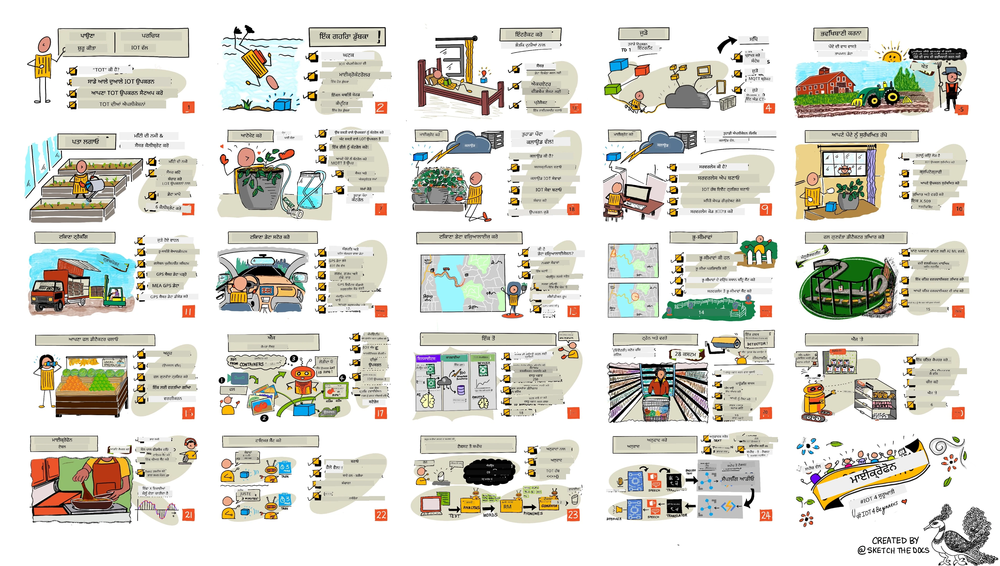

[](https://github.com/microsoft/IoT-For-Beginners/blob/master/LICENSE)
[](https://GitHub.com/microsoft/IoT-For-Beginners/graphs/contributors/)
[](https://GitHub.com/microsoft/IoT-For-Beginners/issues/)
[](https://GitHub.com/microsoft/IoT-For-Beginners/pulls/)
[](http://makeapullrequest.com)

[](https://GitHub.com/microsoft/IoT-For-Beginners/watchers/)
[](https://GitHub.com/microsoft/IoT-For-Beginners/network/)
[](https://GitHub.com/microsoft/IoT-For-Beginners/stargazers/)

### ਅਜ਼ੂਰੇ ਏਆਈ ਫਾਉਂਡਰੀ ਕਮਿਊਨਿਟੀ ਵਿੱਚ ਸ਼ਾਮਿਲ ਹੋਵੋ

ਜੇ ਤੁਸੀਂ ਫਸ ਜਾਂਦੇ ਹੋ ਜਾਂ ਐਆਈ ਐਪ ਬਣਾਉਣ ਬਾਰੇ ਕੋਈ ਪ੍ਰਸ਼ਨ ਹੈ, ਤਾਂ ਸਿਖਣ ਵਾਲਿਆਂ ਅਤੇ ਤਜਰਬੇਕਾਰ ਡਿਵੈਲਪਰਾਂ ਦੇ ਨਾਲ MCP ਬਾਰੇ ਚਰਚਾ ਕਰਨ ਲਈ ਜੁੜੋ। ਇਹ ਇੱਕ ਸਹਾਇਕ ਕਮਿਊਨਿਟੀ ਹੈ ਜਿੱਥੇ ਪ੍ਰਸ਼ਨਾਂ ਦਾ ਸਵਾਗਤ ਹੈ ਅਤੇ ਗਿਆਨ ਖੁੱਲ੍ਹੇ ਦਿਲ ਨਾਲ ਸਾਂਝਾ ਕੀਤਾ ਜਾਂਦਾ ਹੈ।

[](https://discord.gg/nTYy5BXMWG)

ਜੇ ਤੁਹਾਡੇ ਕੋਲ ਉਤਪਾਦੀ ਫੀਡਬੈਕ ਜਾਂ ਗਲਤੀਆਂ ਹਨ ਤਾਂ ਇਨ੍ਹਾਂ ਨੂੰ ਬਣਾਉਂਦੇ ਦਰਮਿਆਨ ਵੇਖੋ:

[](https://aka.ms/foundry/forum)

ਇਨ੍ਹਾਂ ਸਰੋਤਾਂ ਨੂੰ ਵਰਤਣ ਲਈ ਇਹ ਕਦਮ ਅਪਨਾਓ:
1. **ਰਿਪੋਜ਼ਟਰੀ ਨੂੰ ਫੋਰਕ ਕਰੋ**: ਕਲਿੱਕ ਕਰੋ [](https://GitHub.com/microsoft/IoT-For-Beginners/fork)
2. **ਰਿਪੋਜ਼ਟਰੀ ਕਲੋਨ ਕਰੋ**: `git clone https://github.com/microsoft/IoT-For-Beginners.git`
3. [**ਮਾਈਕ੍ਰੋਸੌਫਟ ਫਾਉਂਡਰੀ ਡਿਸਕੋਰਡ ਵਿੱਚ ਸ਼ਾਮਿਲ ਹੋਵੋ ਅਤੇ ਮਾਹਰਾਂ ਅਤੇ ਹੋਰ ਵਿਕਾਸਕਾਰਾਂ ਨਾਲ ਮਿਲੋ**](https://discord.com/invite/ByRwuEEgH4)


### 🌐 ਬਹੁਭਾਸ਼ੀ ਸਹਾਇਤਾ

#### GitHub ਐਕਸ਼ਨ ਰਾਹੀਂ ਸਮਰਥਿਤ (ਸਵਚਾਲਿਤ ਅਤੇ ਹਮੇਸ਼ਾ ਅਪ-ਟੂ-ਡੇਟ)

<!-- CO-OP TRANSLATOR LANGUAGES TABLE START -->
[Arabic](../ar/README.md) | [Bengali](../bn/README.md) | [Bulgarian](../bg/README.md) | [Burmese (Myanmar)](../my/README.md) | [Chinese (Simplified)](../zh-CN/README.md) | [Chinese (Traditional, Hong Kong)](../zh-HK/README.md) | [Chinese (Traditional, Macau)](../zh-MO/README.md) | [Chinese (Traditional, Taiwan)](../zh-TW/README.md) | [Croatian](../hr/README.md) | [Czech](../cs/README.md) | [Danish](../da/README.md) | [Dutch](../nl/README.md) | [Estonian](../et/README.md) | [Finnish](../fi/README.md) | [French](../fr/README.md) | [German](../de/README.md) | [Greek](../el/README.md) | [Hebrew](../he/README.md) | [Hindi](../hi/README.md) | [Hungarian](../hu/README.md) | [Indonesian](../id/README.md) | [Italian](../it/README.md) | [Japanese](../ja/README.md) | [Kannada](../kn/README.md) | [Khmer](../km/README.md) | [Korean](../ko/README.md) | [Lithuanian](../lt/README.md) | [Malay](../ms/README.md) | [Malayalam](../ml/README.md) | [Marathi](../mr/README.md) | [Nepali](../ne/README.md) | [Nigerian Pidgin](../pcm/README.md) | [Norwegian](../no/README.md) | [Persian (Farsi)](../fa/README.md) | [Polish](../pl/README.md) | [Portuguese (Brazil)](../pt-BR/README.md) | [Portuguese (Portugal)](../pt-PT/README.md) | [Punjabi (Gurmukhi)](./README.md) | [Romanian](../ro/README.md) | [Russian](../ru/README.md) | [Serbian (Cyrillic)](../sr/README.md) | [Slovak](../sk/README.md) | [Slovenian](../sl/README.md) | [Spanish](../es/README.md) | [Swahili](../sw/README.md) | [Swedish](../sv/README.md) | [Tagalog (Filipino)](../tl/README.md) | [Tamil](../ta/README.md) | [Telugu](../te/README.md) | [Thai](../th/README.md) | [Turkish](../tr/README.md) | [Ukrainian](../uk/README.md) | [Urdu](../ur/README.md) | [Vietnamese](../vi/README.md)

> **ਸਥਾਨਕ ਤੌਰ 'ਤੇ ਕਲੋਨ ਕਰਨਾ ਪਸੰਦ ਕਰੋ?**
>
> ਇਹ ਰਿਪੋਜ਼ਟਰੀ ਵਿੱਚ 50+ ਭਾਸ਼ਾਈ ਅਨੁਵਾਦ ਹਨ ਜੋ ਡਾਊਨਲੋਡ ਦਾ ਆਕਾਰ ਕਾਫੀ ਵਧਾ ਦਿੰਦੇ ਹਨ। ਅਨੁਵਾਦਾਂ ਤੋਂ ਬਿਨਾਂ ਕਲੋਨ ਕਰਨ ਲਈ ਸਪਾਰਸ ਚੈਕਆਊਟ ਵਰਤੋਂ:
>
> **Bash / macOS / Linux:**
> ```bash
> git clone --filter=blob:none --sparse https://github.com/microsoft/IoT-For-Beginners.git
> cd IoT-For-Beginners
> git sparse-checkout set --no-cone '/*' '!translations' '!translated_images'
> ```
>
> **CMD (Windows):**
> ```cmd
> git clone --filter=blob:none --sparse https://github.com/microsoft/IoT-For-Beginners.git
> cd IoT-For-Beginners
> git sparse-checkout set --no-cone "/*" "!translations" "!translated_images"
> ```
>
> ਇਹ ਤੁਹਾਨੂੰ ਤੁਰੰਤ ਡਾਊਨਲੋਡ ਦੇ ਨਾਲ ਕੋਰਸ ਪੂਰਾ ਕਰਨ ਲਈ ਸਾਰਾ ਕੁਝ ਦਿੰਦਾ ਹੈ।
<!-- CO-OP TRANSLATOR LANGUAGES TABLE END -->

# ਸ਼ੁਰੂਆਤੀ ਲਈ IoT - ਇੱਕ ਕਰੀਕੁਲਮ

ਮਾਈਕ੍ਰੋਸੌਫਟ ਦੇ ਅਜ਼ੂਰੇ ਕਲਾਉਡ ਐਡਵੋਕੇਟ ਖੁਸ਼ ਹਨ ਕਿ ਉਹ 12 ਹਫਤਿਆਂ ਅਤੇ 24 ਪਾਠਾਂ ਵਾਲਾ ਕਰੀਕੁਲਮ ਪ੍ਰਦਾਨ ਕਰ ਰਹੇ ਹਨ ਜੋ ਕਿ IoT ਦੇ ਮੁਲਭੂਤ ਢਾਂਚੇ ਬਾਰੇ ਹੈ। ਹਰ ਪਾਠ ਵਿੱਚ ਅੱਗੇ-ਪਿੱਛੇ ਕੁਇਜ਼, ਲਿਖਤੀ ਹਦਾਇਤਾਂ, ਹੱਲ, ਅਸਾਇਨਮੈਂਟ ਅਤੇ ਹੋਰ ਸ਼ਾਮਿਲ ਹਨ। ਅਸੀਂ ਪ੍ਰੋਜੈਕਟ-ਆਧਾਰਿਤ ਸਿਖਲਾਈ ਦੇ ਇੱਕ ਢਾਂਚੇ ਦੀ ਵਰਤੋਂ ਕਰਦੇ ਹਾਂ ਜਿਸ ਨਾਲ ਤੁਸੀਂ ਬਣਾਉਂਦੇ ਸਮੇਂ ਸਿੱਖਦੇ ਹੋ, ਜਿਸ ਨਾਲ ਨਵੀਆਂ ਸਿੱਖਣੀਆਂ ਚੰਗੀ ਤਰ੍ਹਾਂ ਠਹਿੜਦੀਆਂ ਹਨ।

ਇਹ 프로젝트 ਖਾਣੇ ਨੂੰ ਖੇਤ ਤੋਂ ਮੇਜ਼ ਤੱਕ ਲਿਜਾਣ ਦੀ ਯਾਤਰਾ ਨੂੰ ਦਿਖਾਉਂਦੇ ਹਨ, ਜਿਸ ਵਿੱਚ ਖੇਤੀ, ਲਾਜਿਸਟਿਕਸ, ਉਤਪਾਦਨ, ਰਿਟੇਲ ਅਤੇ ਗਾਹਕ ਸ਼ਾਮਿਲ ਹਨ - ਇਹ ਸਭ IoT ਉਪਕਰਨਾਂ ਲਈ ਪ੍ਰਸਿੱਧ ਉਦਯੋਗ ਖੇਤਰ ਹਨ।



> ਸਕੈਚਨੋਟ [ਨਿਤਿਆ ਨਰਸਿਮਹਨ](https://github.com/nitya) ਦੁਆਰਾ ਬਣਾਇਆ। ਵੱਡੀ ਵਰਜ਼ਨ ਦੇਖਣ ਲਈ ਚਿੱਤਰ 'ਤੇ ਕਲਿੱਕ ਕਰੋ।

**ਸਾਡੇ ਲੇਖਕਾਂ [ਜੇਨ ਫਾਕਸ](https://github.com/jenfoxbot), [ਜੇਨ ਲੂਪਰ](https://github.com/jlooper), [ਜਿਮ ਬੈਨੇਟ](https://github.com/jimbobbennett), ਅਤੇ ਸਕੈਚਨੋਟ ਕਲਾਕਾਰ [ਨਿਤਿਆ ਨਰਸਿਮਹਨ](https://github.com/nitya) ਦਾ ਦਿਲੋਂ ਧੰਨਵਾਦ।**

**ਸਾਡੇ [ਮਾਈਕ੍ਰੋਸੌਫਟ ਲਰਨ ਸਟੂਡੈਂਟ ਐਂਬੈਸਡਰਜ਼](https://studentambassadors.microsoft.com?WT.mc_id=academic-17441-jabenn) ਦੀ ਟੀਮ ਦਾ ਵੀ ਧੰਨਵਾਦ ਜਿਨ੍ਹਾਂ ਨੇ ਇਸ ਕਰੀਕੁਲਮ ਦੀ ਸਮੀਖਿਆ ਅਤੇ ਅਨੁਵਾਦ ਕੀਤਾ - [ਅਦਿਤਿਆ ਗਾਰਗ](https://github.com/AdityaGarg00), [ਅਨੁਰਾਗ ਸ਼ਰਮਾ](https://github.com/Anurag-0-1-A), [ਅਰਪਿਤਾ ਦਾਸ](https://github.com/Arpiiitaaa), [ਆਰਯਨ ਜੈਨ](https://www.linkedin.com/in/aryan-jain-47a4a1145/), [ਭਵੇਸ਼ ਸੁਨੇਜਾ](https://github.com/EliteWarrior315), [ਫੇਥ ਹੁੰਜਾ](https://faithhunja.github.io/), [ਲਤੀਫਾ ਬੇਲੋ](https://www.linkedin.com/in/lateefah-bello/), [ਮਾਂਵੀ ਝਾ](https://github.com/Severus-Matthew), [ਮੀਰੇਇਲ ਟੈਨ](https://www.linkedin.com/in/mireille-tan-a4834819a/), [ਮੋਹਮਦ ਇਫਤਖੇਰ (ਇਫਤੂ) ਏਬਨੇ ਜਲਾਲ](https://github.com/Iftu119), [ਮੋਹਮਦ ਜੁਲਫਿਕਾਰ](https://github.com/mohzulfikar), [ਪ੍ਰਿਯੰਸ਼ੁ ਸ੍ਰਿਵਸਤਵ](https://www.linkedin.com/in/priyanshu-srivastav-b067241ba), [ਥਨਮਈ ਗੌਡੂਚੇਰੂਵ](https://github.com/innovation-platform), ਅਤੇ [ਜ਼ੀਨਾ ਕਾਮੇਲ](https://www.linkedin.com/in/zina-kamel/)।**

ਟੀਮ ਨਾਲ ਮਿਲੋ!

[](https://youtu.be/-wippUJRi5k)

**ਗਿਫ਼ [ਮੋਹਿਤ ਜੈਸਲ](https://linkedin.com/in/mohitjaisal) ਦੁਆਰਾ**

> 🎥 ਪ੍ਰੋਜੈਕਟ ਬਾਰੇ ਵੀਡੀਓ ਦੇਖਣ ਲਈ ਉੱਪਰ ਦਿੱਤੇ ਚਿੱਤਰ 'ਤੇ ਕਲਿੱਕ ਕਰੋ!

> **ਅਧਿਆਪਕਾਂ ਲਈ**, ਅਸੀਂ [ਕੁਝ ਸੁਝਾਵ ਸ਼ਾਮਿਲ ਕੀਤੇ ਹਨ](for-teachers.md) ਕਿ ਇਸ ਕਰੀਕੁਲਮ ਨੂੰ ਕਿਵੇਂ ਵਰਤਨਾ ਹੈ। ਜੇ ਤੁਸੀਂ ਆਪਣੇ ਪਾਠ ਬਣਾਉਣਾ ਚਾਹੁੰਦੇ ਹੋ ਤਾਂ ਅਸੀਂ [ਪਾਠ ਟੈਂਪਲੇਟ](lesson-template/README.md) ਵੀ ਦਿੱਤਾ ਹੈ।

> **ਵਿਦਿਆਰਥੀ**, ਇਸ ਕਰੀਕੁਲਮ ਦਾ ਆਪਣੇ ਆਪ ਵਰਤੋਂ ਕਰਨ ਲਈ, ਪੂਰੀ ਰਿਪੋ ਨੂੰ ਫੋਰਕ ਕਰੋ ਅਤੇ ਅਪਣੇ ਆਪ ਕੁਇਜ਼, ਲੇਕਚਰ ਪੜ੍ਹੋ ਅਤੇ ਆਗਲੇ ਕਦਮ ਪੂਰੇ ਕਰੋ। ਕੋਡ ਦੇ ਕਾਪੀ ਕਰਨ ਦੀ ਥਾਂ, ਪ੍ਰੋਜੈਕਟ ਨੂੰ ਸਮਝ ਕੇ ਬਣਾਉ। ਹੱਲ /solutions ਫੋਲਡਰ ਵਿੱਚ ਹਰ ਪਾਜੈਕਟ-ਕੇਂਦਰਿਤ ਪਾਠ ਲਈ ਉਪਲਬਧ ਹਨ। ਹੋਰ ਖਿਆਲ ਇਹ ਵੀ ਹੈ ਕਿ ਦੋਸਤਾਂ ਨਾਲ ਇੱਕ ਅਧਿਐਨ ਸਮੂਹ ਬਣਾਓ ਅਤੇ ਅਮਲ ਨਾਲ ਸਿੱਖੋ। ਹੋਰ ਸਿੱਖਣ ਲਈ, ਅਸੀਂ [Microsoft Learn](https://docs.microsoft.com/users/jimbobbennett/collections/ke2ehd351jopwr?WT.mc_id=academic-17441-jabenn) ਦੀ ਸਿਫਾਰਿਸ਼ ਕਰਦੇ ਹਾਂ।

ਇਸ ਕੋਰਸ ਦੀ ਵੀਡੀਓ ਓਵਰਵਿਊ ਦੇਖੋ:

[](https://youtube.com/watch?v=bccEMm8gRuc "ਪ੍ਰੋਮੋ ਵੀਡੀਓ")

> 🎥 ਪ੍ਰੋਜੈਕਟ ਬਾਰੇ ਵੀਡੀਓ ਦੇਖਣ ਲਈ ਉੱਪਰ ਦਿੱਤੇ ਚਿੱਤਰ 'ਤੇ ਕਲਿੱਕ ਕਰੋ!

## ਪੇਡਾਗੋਜੀ

ਅਸੀਂ ਇਸ ਕਰੀਕੁਲਮ ਦੀ ਰਚਨਾ ਦੌਰਾਨ ਦੋ ਸਿਖਲਾਈ ਦੇ ਸਿਧਾਂਤ ਚੁਣੇ ਹਨ: ਇਹ ਪ੍ਰੋਜੈਕਟ-ਆਧਾਰਿਤ ਹੋਵੇ ਅਤੇ ਇਸ ਵਿੱਚ ਬਾਰ-ਬਾਰ ਕੁਇਜ਼ ਸ਼ਾਮਿਲ ਹੋਣ। ਇਸ ਸਿਰੀਜ਼ ਦੇ ਅੰਤ ਤੱਕ ਵਿਦਿਆਰਥੀ ਪੌਦੇ ਦੀ ਨਿਗਰਾਨੀ ਅਤੇ ਸਿੰਚਾਈ ਸਿਸਟਮ, ਵਾਹਨ ਟਰੇਕਰ, ਸਮਾਰਟ ਫੈਕਟਰੀ ਜੋ ਖਾਣ-ਪੀਣ ਨੂੰ ਟਰੈਕ ਕਰਦੀ ਹੈ ਅਤੇ ਵੋਇਸ-ਕੰਟਰੋਲਡ ਕੂਕਿੰਗ ਟਾਈਮਰ ਬਣਾਊਂਦੇ ਹਨ। ਉਹ IoT ਦੇ ਮੁਢਲੇ ਧਾਰਣਾਂ ਨੂੰ ਸਮਝ ਲੈਂਦੇ ਹਨ, ਜਿਵੇਂ ਕਿ ਡਿਵਾਈਸ ਕੋਡ ਲਿਖਣਾ, ਕਲਾਉਡ ਨਾਲ ਕਨੈਕਸ਼ਨ ਕਰਨਾ, ਟੈਲੀਮੇਟਰੀ ਦਾ ਵਿਸ਼ਲੇਸ਼ਣ ਕਰਨਾ ਅਤੇ ਕੋਨੇ ਉੱਤੇ AI ਚਲਾਉਣਾ।

ਪ੍ਰੋਜੈਕਟਾਂ ਨਾਲ ਸਬੰਧਿਤ ਸਮਗਰੀ ਨਾਲ ਸਿੱਖਣ ਨੂੰ ਰੁਚਿਕਰ ਅਤੇ ਗਹਿਰਾਈ ਵਾਲਾ ਬਣਾਇਆ ਜਾਂਦਾ ਹੈ ਜੋ ਕਿ ਸਮਝ ਨੂੰ ਵਧਾਉਂਦੀ ਹੈ।

ਇਸ ਤੋਂ ਇਲਾਵਾ, ਇੱਕ ਕਲਾਸ ਤੋਂ ਪਹਿਲਾਂ ਇੱਕ ਹਲਕੀ ਕੁਇਜ਼ ਸਿੱਖਿਆ ਲਈ ਮਨ ਦਾ ਦਿਸ਼ਾ ਨਿਰਧਾਰਤ ਕਰਦੀ ਹੈ, ਅਤੇ ਕਲਾਸ ਮਗਰੋਂ ਇਕ ਦੂਜੀ ਕੁਇਜ਼ ਯਾਦਦਾਸ਼ਤ ਦਾ ਬਹਿਤਰ ਸੁਨਿਸ਼ਚਿਤ ਕਰਦੀ ਹੈ। ਇਹ ਕਰੀਕੁਲਮ ਲਚਕੀਲਾ ਅਤੇ ਮਨੋਰੰਜਕ ਹੈ ਅਤੇ ਇਸਨੂੰ ਪੂਰੀ ਤਰ੍ਹਾਂ ਜਾਂ ਅੰਸ਼ਿਕ ਤੌਰ 'ਤੇ ਲਿਆ ਜਾ ਸਕਦਾ ਹੈ। ਪ੍ਰੋਜੈਕਟ ਛੋਟੇ ਅਤੇ ਅਸਾਨ ਤੋਂ ਸ਼ੁਰੂ ਹੁੰਦੇ ਹਨ ਅਤੇ 12 ਹਫ਼ਤਿਆਂ ਦੇ ਅੰਤ ਤੱਕ ਬਹੁਤ ਔਖੇ ਹੋ ਜਾਂਦੇ ਹਨ।

ਹਰ ਪ੍ਰੋਜੈਕਟ ਵਿਦਿਆਰਥੀਆਂ ਅਤੇ ਸ਼ੌਕੀਨਾਂ ਲਈ ਉਪਲਬਧ ਅਸਲੀ-ਦੁਨੀਆ ਵਾਲੇ ਹਾਰਡਵੇਅਰ ਉੱਤੇ ਆਧਾਰਿਤ ਹੈ। ਹਰ ਪ੍ਰੋਜੈਕਟ ਖਾਸ ਪ੍ਰੋਜੈਕਟ ਖੇਤਰ ਵਿੱਚ ਰੂਹਾਨੀ ਜਾਣਕਾਰੀ ਦਿੰਦਾ ਹੈ। ਕਾਮਯਾਬ ਵਿਕਾਸਕਾਰ ਬਣਨ ਲਈ ਇਹ ਜਰੂਰੀ ਹੈ ਕਿ ਤੁਸੀਂ ਉਹ ਖੇਤਰ ਸਮਝੋ ਜਿਸ ਵਿੱਚ ਤੁਸੀਂ ਸਮੱਸਿਆਵਾਂ ਦਾ ਹੱਲ ਕਰ ਰਹੇ ਹੋ, ਇਸ ਤਰ੍ਹਾਂ ਦੀ ਜਾਣਕਾਰੀ ਵਿਦਿਆਰਥੀਆਂ ਨੂੰ ਆਪਣੇ IoT ਹੱਲਾਂ ਨੂੰ ਸਾਂਝਾ ਕਰਨ ਅਤੇ ਸਿੱਖਣ ਦੀ ਸੰਦੇਸ਼ ਵਿੱਚ ਵਿਚਾਰ ਕਰਨ ਲਈ ਸਹਾਇਕ ਹੁੰਦੀ ਹੈ। ਵਿਦਿਆਰਥੀ ਉਹ ਹੱਲਾਂ ਕਿਉਂ ਬਣਾਉਂਦੇ ਹਨ ਸਮਝਦੇ ਹਨ ਅਤੇ ਅੰਤ ਵਰਤੇ ਵਾਲੇ ਦੀ ਕਦਰ ਕਰਦੇ ਹਨ।

## ਹਾਰਡਵੇਅਰ
ਅਸੀਂ ਪ੍ਰੋਜੈਕਟਾਂ ਲਈ ਆਪਣੀ ਨਿੱਜੀ ਪਸੰਦ, ਪ੍ਰੋਗ੍ਰਾਮਿੰਗ ਭਾਸ਼ਾ ਗਿਆਨ ਜਾਂ ਪਸੰਦਾਂ, ਸਿੱਖਣ ਦੇ ਲਕਸ਼ ਅਤੇ ਉਪਲਬਧਤਾ ਦੇ ਆਧਾਰ 'ਤੇ ਵਰਤੋਂ ਲਈ ਆਈਓਟੀ ਹਾਰਡਵੇਅਰ ਦੇ ਦੋ ਚੋਣਾਂ ਰੱਖਦੇ ਹਾਂ। ਅਸੀਂ ਉਹਨਾਂ ਲਈ ਵੀ ਇੱਕ 'ਵਰਚੁਅਲ ਹਾਰਡਵੇਅਰ' ਵਰਜਨ ਮੁਹੱਈਆ ਕੀਤਾ ਹੈ ਜਿਨ੍ਹਾਂ ਕੋਲ ਹਾਰਡਵੇਅਰ ਦੀ ਪਹੁੰਚ ਨਹੀਂ ਹੈ, ਜਾਂ ਜੋ ਖ਼ਰੀਦਣ ਦੀ ਪੂਰੀ ਤੈਯਾਰੀ ਤੋਂ ਪਹਿਲਾਂ ਹੋਰ ਸਿੱਖਣਾ ਚਾਹੁੰਦੇ ਹਨ। ਤੁਸੀਂ ਹੋਰ ਪੜ੍ਹ ਸਕਦੇ ਹੋ ਅਤੇ ਇੱਕ 'ਖਰੀਦਾਰੀ ਸੂਚੀ' ਦੇਖ ਸਕਦੇ ਹੋ [hardware page](./hardware.md) 'ਤੇ, ਜਿਸ ਵਿੱਚ ਸਾਡੇ ਦੋਸਤ Seeed Studio ਤੋਂ ਪੂਰੇ ਕਿਟ ਖਰੀਦਣ ਲਈ ਲਿੰਕ ਵੀ ਸ਼ਾਮਲ ਹਨ।

> 💁 ਸਾਡਾ [Code of Conduct](CODE_OF_CONDUCT.md), [Contributing](CONTRIBUTING.md), ਅਤੇ [Translations](..) ਨਿਯਮਾਂ ਨੂੰ ਵੇਖੋ। ਅਸੀਂ ਤੁਹਾਡੀ ਰਚਨਾਤਮਕ ਫੀਡਬੈਕ ਦਾ ਸਵਾਗਤ ਕਰਦੇ ਹਾਂ!
>
> 🔧 ਸਮੱਸਿਆਵਾਂ ਆ ਰਹੀਆਂ ਹਨ? ਸਧਾਰਨ ਸਮੱਸਿਆਵਾਂ ਦੇ ਹੱਲ ਲਈ ਸਾਡਾ [Troubleshooting Guide](TROUBLESHOOTING.md) ਵੇਖੋ।

## ਹਰ ਪਾਠ ਵਿੱਚ ਸ਼ਾਮਲ ਹਨ:

- ਸਕੈਚਨੋਟ
- ਵਿਕਲਪਿਕ ਸਹਾਇਕ ਵੀਡੀਓ
- ਪਾਠ ਤੋਂ ਪਹਿਲਾਂ ਵਾਰਮਅਪ ਕੁਇਜ਼
- ਲਿਖਤੀ ਪਾਠ
- ਪ੍ਰੋਜੈਕਟ-ਆਧਾਰਿਤ ਪਾਠਾਂ ਲਈ, ਪ੍ਰੋਜੈਕਟ ਬਣਾਉਣ ਲਈ ਕਦਮ ਬਦ ਕਦਮ ਗਾਈਡ
- ਗਿਆਨ ਦੇ ਜਾਂਚ
- ਇੱਕ ਚੁਣੌਤੀ
- ਸਹਾਇਕ ਪੜ੍ਹਾਈ
- ਅਸਾਈਨਮੈਂਟ
- [ਪਾਠ ਮਗਰੋਂ ਕੁਇਜ਼](https://ff-quizzes.netlify.app/en/)

> **ਕੁਇਜ਼ਾਂ ਬਾਰੇ ਨੋਟ**: ਸਾਰੇ ਕੁਇਜ਼ quiz-app ਫੋਲਡਰ ਵਿੱਚ ਹਨ, ਜਿਸ ਵਿੱਚ ਕੁੱਲ 48 ਕੁਇਜ਼ ਹਨ ਅਤੇ ਹਰ ਇੱਕ ਵਿੱਚ ਤਿੰਨ ਪ੍ਰਸ਼ਨ ਹਨ। ਇਹ ਪਾਠਾਂ ਵਿੱਚ ਲਿੰਕ ਕੀਤੇ ਗਏ ਹਨ ਪਰ ਕੁਇਜ਼ ਐਪ ਨੂੰ ਸਥਾਨਕ ਤੌਰ 'ਤੇ ਚਲਾਇਆ ਜਾ ਸਕਦਾ ਹੈ ਜਾਂ Azure 'ਤੇ ਡਿਪਲੌਇ ਕੀਤਾ ਜਾ ਸਕਦਾ ਹੈ; ਹਦਾਇਤਾਂ ਲਈ `quiz-app` ਫੋਲਡਰ ਦੇ ਨਿਰਦੇਸ਼ਾਂ ਨੂੰ ਫਾਲੋ ਕਰੋ। ਇਹ ਹੌਲੀ-ਹੌਲੀ ਸਥਾਨਕ ਭਾਸ਼ਾਵਾਂ ਵਿੱਚ ਤਬਦੀਲ ਕੀਤੇ ਜਾ ਰਹੇ ਹਨ।

## ਪਾਠ

|       |              ਪ੍ਰੋਜੈਕਟ ਦਾ ਨਾਮ               |                      ਸਿੱਖਾਏ ਗਏ ਸੰਕਲਪ                       | ਸਿੱਖਣ ਦੇ ਉਦੇਸ਼                                                                                                                                                      |                                                       ਲਿੰਕ ਕੀਤਾ ਗਿਆ ਪਾਠ                                                        |
| :---: | :------------------------------------: | :---------------------------------------------------------: | ----------------------------------------------------------------------------------------------------------------------------------------------------------------- | :--------------------------------------------------------------------------------------------------------------------------: |
|  01   | [Getting started](./1-getting-started/README.md) |                     ਆਈਓਟੀ ਦਾ ਪਰਚਾਰ                     | ਆਈਓਟੀ ਦੇ ਮੂਲ ਸਿਧਾਂਤ ਅਤੇ ਆਈਓਟੀ ਸਮਾਧਾਨਾਂ ਦੇ ਮੁੱਖ ਭਾਗਾਂ ਜਿਵੇਂ ਕਿ ਸెనਸਰ ਅਤੇ ਕਲਾਉਡ ਸੇਵਾਵਾਂ ਬਾਰੇ ਸਿੱਖੋ ਜਦੋਂ ਤੁਸੀਂ ਆਪਣਾ ਪਹਿਲਾ ਆਈਓਟੀ ਡਿਵਾਈਸ ਸੈਟ ਕਰ ਰਹੇ ਹੋ |                      [Introduction to IoT](./1-getting-started/lessons/1-introduction-to-iot/README.md)                      |
|  02   | [Getting started](./1-getting-started/README.md) |                   ਆਈਓਟੀ ਵਿੱਚ ਵਧੀਕ ਡੂੰਘਾਈ                   | ਆਈਓਟੀ ਸਿਸਟਮ ਦੇ ਭਾਗਾਂ, ਸਾਥ ਹੀ ਮਾਈਕ੍ਰੋਕਂਟਰੋਲਰਾਂ ਅਤੇ ਸਿੰਗਲ-ਬੋਰਡ ਕੰਪਿਊਟਰਾਂ ਬਾਰੇ ਹੋਰ ਜਾਣਕਾਰੀ ਪ੍ਰਾਪਤ ਕਰੋ                                                          |                        [A deeper dive into IoT](./1-getting-started/lessons/2-deeper-dive/README.md)                         |
|  03   | [Getting started](./1-getting-started/README.md) | ਸੈਨਸਰਾਂ ਅਤੇ ਐਕਚੁਏਟਰਾਂ ਰਾਹੀਂ ਭੌਤਿਕ ਸੰਸਾਰ ਨਾਲ ਇੰਤਰੈਕਟ ਕਰੋ | ਫਿਜੀਕਲ ਸੰਸਾਰ ਤੋਂ ਡੇਟਾ ਇਕੱਠਾ ਕਰਨ ਲਈ ਸੈਨਸਰਾਂ ਅਤੇ ਫੀਡਬੈਕ ਭੇਜਣ ਲਈ ਐਕਚੁਏਟਰਾਂ ਬਾਰੇ ਸਿੱਖੋ ਜਾਂਜਦੋਂ ਤੁਸੀਂ ਇੱਕ ਨਾਈਟਲਾਈਟ ਬਣਾਉਂਦੇ ਹੋ                                    | [Interact with the physical world with sensors and actuators](./1-getting-started/lessons/3-sensors-and-actuators/README.md) |
|  04   | [Getting started](./1-getting-started/README.md) |              ਆਪਣੇ ਡਿਵਾਈਸ ਨੂੰ ਇੰਟਰਨੈੱਟ ਨਾਲ ਜੋੜੋ              | ਇੱਕ ਆਈਓਟੀ ਡਿਵਾਈਸ ਨੂੰ ਇੰਟਰਨੈੱਟ ਨਾਲ ਕਿਵੇਂ ਜੋੜਨਾ ਹੈ ਜੋ ਸੁਨੇਹੇ ਭੇਜਣ ਅਤੇ ਪ੍ਰਾਪਤ ਕਰਨ ਲਈ MQTT ਬ੍ਰੋਕਰ ਨਾਲ ਆਪਣੇ ਨਾਈਟਲਾਈਟ ਨੂੰ ਕਨੈਕਟ ਕਰਦਾ ਹੈ ਬਾਰੇ ਜਾਨੋ                           |               [Connect your device to the Internet](./1-getting-started/lessons/4-connect-internet/README.md)                |
|  05   |            [Farm](./2-farm/README.md)            |                     ਪੌਧੇ ਦੀ ਵ੍ਰਿਧੀ ਦੀ ਪੇਸ਼ਕਸ਼                     | ਆਈਓਟੀ ਡਿਵਾਈਸ ਦੁਆਰਾ ਸੰਭਾਲੀ ਗਈ ਤਾਪਮਾਨ ਜਾਣਕਾਰੀ ਦੀ ਵਰਤੋਂ ਕਰਕੇ ਪੌਧੇ ਦੀ ਵਾਧ ਦਾ ਅਨੁਮਾਨ ਲਾਉਣਾ ਸਿੱਖੋ                                                        |                          [Predict plant growth](./2-farm/lessons/1-predict-plant-growth/README.md)                           |
|  06   |            [Farm](./2-farm/README.md)            |                     ਮਿੱਟੀ ਦੀ ਨਮੀ ਦਾ ਪਤਾ ਲਗਾਉਣਾ                     | ਮਿੱਟੀ ਦੀ ਨਮੀ ਦੀ ਪਹਚਾਣ ਅਤੇ ਮਿੱਟੀ ਦੀ ਨਮੀ ਟੈਸਟ ਕਰਨ ਵਾਲੇ ਸੈਨਸਰ ਨੂੰ ਕੈਲਿਬਰੇਟ ਕਰਨਾ ਸਿੱਖੋ                                                  |                          [Detect soil moisture](./2-farm/lessons/2-detect-soil-moisture/README.md)                           |
|  07   |            [Farm](./2-farm/README.md)            |                   ਸੁਚਾਲਿਤ ਪੌਧੇ ਨੂੰ ਪਾਣੀ ਦੇਣਾ                   | ਰਿਲੇ ਅਤੇ MQTT ਦੀ ਵਰਤੋਂ ਕਰਕੇ ਪਾਣੀ ਦੇਣ ਦੀ ਕਾਰਵਾਈ ਅਤੇ ਸਮਾਂ ਬੰਨ੍ਹਨਾ ਸਿੱਖੋ                                                                     |                      [Automated plant watering](./2-farm/lessons/3-automated-plant-watering/README.md)                       |
|  08   |            [Farm](./2-farm/README.md)            |               ਆਪਣੇ ਪੌਧੇ ਨੂੰ ਕਲਾਉਡ ਵਿੱਚ ਮਾਈਗ੍ਰੇਟ ਕਰੋ               | ਕਲਾਉਡ ਅਤੇ ਕਲਾਉਡ-ਹੋਸਟ ਆਈਓਟੀ ਸੇਵਾਵਾਂ ਬਾਰੇ ਜਾਣੋ ਅਤੇ ਪਬਲਿਕ MQTT ਬ੍ਰੋਕਰ ਦੀ ਥਾਂ ਆਪਣੇ ਪੌਧੇ ਨੂੰ ਇਨ੍ਹਾਂ ਵਿੱਚੋਂ ਕਿਸੇ ਨਾਲ ਜੋੜਨਾ ਸਿੱਖੋ                                     |               [Migrate your plant to the cloud](./2-farm/lessons/4-migrate-your-plant-to-the-cloud/README.md)                |
|  09   |            [Farm](./2-farm/README.md)            |         ਆਪਣੀ ਐਪਲੀਕੇਸ਼ਨ ਲਾਜਿਕ ਨੂੰ ਕਲਾਉਡ ਵਿੱਚ ਮਾਈਗ੍ਰੇਟ ਕਰੋ         | ਆਈਓਟੀ ਸੁਨੇਹਿਆਂ ਨੂੰ ਜਵਾਬ ਦੇਣ ਵਾਲੀ ਕਲਾਉਡ ਵਿੱਚ ਐਪਲੀਕੇਸ਼ਨ ਲਾਜਿਕ ਲਿਖਣ ਬਾਰੇ ਜਾਣੋ                                                        |         [Migrate your application logic to the cloud](./2-farm/lessons/5-migrate-application-to-the-cloud/README.md)         |
|  10   |            [Farm](./2-farm/README.md)            |                   ਆਪਣੇ ਪੌਧੇ ਨੂੰ ਸੁਰੱਖਿਅਤ ਰੱਖੋ                    | ਆਈਓਟੀ ਸੁਰੱਖਿਆ ਬਾਰੇ ਸਿੱਖੋ ਅਤੇ ਭੇਜਨ ਅਤੇ ਸਰਟੀਫਿਕੇਟਾਂ ਨਾਲ ਆਪਣੇ ਪੌਧੇ ਨੂੰ ਸੁਰੱਖਿਅਤ ਰੱਖੋ                                                    |                        [Keep your plant secure](./2-farm/lessons/6-keep-your-plant-secure/README.md)                         |
|  11   |       [Transport](./3-transport/README.md)       |                      ਸਥਾਨ ਟ੍ਰੈਕਿੰਗ                      | ਆਈਓਟੀ ਡਿਵਾਈਸਾਂ ਲਈ GPS ਸਥਾਨ ਟ੍ਰੈਕਿੰਗ ਬਾਰੇ ਜਾਣੋ                                                                                                   |                           [Location tracking](./3-transport/lessons/1-location-tracking/README.md)                           |
|  12   |       [Transport](./3-transport/README.md)       |                     ਸਥਾਨ ਡੇਟਾ ਸਟੋਰ ਕਰਨਾ                     | ਆਈਓਟੀ ਡੇਟਾ ਨੂੰ ਸਟੋਰ ਕਰਨ ਬਾਰੇ ਜਾਣੋ ਤਾਂ ਕਿ ਬਾਅਦ ਵਿੱਚ ਇਸ ਨੂੰ ਵਿਜੁਅਲਾਈਜ਼ ਜਾਂ ਵਿਸ਼ਲੇਸ਼ਣ ਕੀਤਾ ਜਾ ਸਕੇ                                                  |                         [Store location data](./3-transport/lessons/2-store-location-data/README.md)                         |
|  13   |       [Transport](./3-transport/README.md)       |                   ਸਥਾਨ ਡੇਟਾ ਨੂੰ ਵਿਜੁਅਲਾਈਜ਼ ਕਰਨਾ                   | ਨਕਸ਼ੇ 'ਤੇ ਸਥਾਨ ਡੇਟਾ ਨੂੰ ਵਿਜੁਅਲਾਈਜ਼ ਕਰਨ ਅਤੇ ਨਕਸ਼ਿਆਂ ਵੱਲੋਂ ਅਸਲੀ 3D ਦੁਨੀਆ ਨੂੰ 2-ਆਯਾਮਾਂ ਵਿੱਚ ਦਿਖਾਉਣ ਬਾਰੇ ਜਾਣੋ                                            |                     [Visualize location data](./3-transport/lessons/3-visualize-location-data/README.md)                     |
|  14   |       [Transport](./3-transport/README.md)       |                          ਜੀਓਫੈਂਸ                          | ਜੀਓਫੈਂਸ ਬਾਰੇ ਜਾਣੋ, ਅਤੇ ਇਹ ਕਿਵੇਂ ਸਪਲਾਈ ਚੇਨ ਵਿੱਚ ਵਾਹਨਾਂ ਨੂੰ ਉਹਨਾਂ ਦੀ ਮੰਜ਼ਿਲ ਦੇ ਨੇੜੇ ਹੋਣ 'ਤੇ ਅਲਰਟ ਕਰਨ ਲਈ ਵਰਤੀ ਜਾ ਸਕਦੀ ਹੈ                              |                                   [Geofences](./3-transport/lessons/4-geofences/README.md)                                   |
|  15   |   [Manufacturing](./4-manufacturing/README.md)   |               ਫਲ ਦੀ ਗੁਣਵੱਤਾ ਦਾ ਡਿਟੈਕਟਰ ਸਿਖਲਾਈ ਕਰੋ                | ਕਲਾਉਡ ਵਿੱਚ ਇੱਕ ਇਮੇਜ ਕਲਾਸੀਫਾਇਰ ਨੂੰ ਟ੍ਰੇਨ ਕਰਨ ਬਾਰੇ ਜਾਣੋ ਜੋ ਫਲ ਦੀ ਗੁਣਵੱਤਾ ਨੂੰ ਪਹਚਾਨਦਾ ਹੈ                                                        |                 [Train a fruit quality detector](./4-manufacturing/lessons/1-train-fruit-detector/README.md)                 |
|  16   |   [Manufacturing](./4-manufacturing/README.md)   |           ਆਈਓਟੀ ਡਿਵਾਈਸ ਤੋਂ ਫਲ ਦੀ ਗੁਣਵੱਤਾ ਦੀ ਜਾਂਚ ਕਰੋ            | ਆਪਣੇ ਫਲ ਦੀ ਗੁਣਵੱਤਾ ਡਿਟੈਕਟਰ ਨੂੰ ਆਈਓਟੀ ਡਿਵਾਈਸ ਤੋਂ ਵਰਤਣ ਬਾਰੇ ਜਾਣੋ                                                                          |           [Check fruit quality from an IoT device](./4-manufacturing/lessons/2-check-fruit-from-device/README.md)            |
|  17   |   [Manufacturing](./4-manufacturing/README.md)   |             ਆਪਣੇ ਫਲ ਡਿਟੈਕਟਰ ਨੂੰ ਏਜ 'ਤੇ ਚਲਾਓ             | ਆਪਣੇ ਫਲ ਡਿਟੈਕਟਰ ਨੂੰ ਏਜ 'ਤੇ ਇੱਕ ਆਈਓਟੀ ਡਿਵਾਈਸ 'ਤੇ ਚਲਾਉਣ ਬਾਰੇ ਜਾਣੋ                                                                         |             [Run your fruit detector on the edge](./4-manufacturing/lessons/3-run-fruit-detector-edge/README.md)             |
|  18   |   [Manufacturing](./4-manufacturing/README.md)   |        ਸੈਨਸਰ ਤੋਂ ਫਲ ਦੀ ਗੁਣਵੱਤਾ ਦੀ ਜਾਂਚ ਨੂੰ ਟ੍ਰਿਗਰ ਕਰੋ        | ਇੱਕ ਸੈਨਸਰ ਤੋਂ ਫਲ ਦੀ ਗੁਣਵੱਤਾ ਦੀ ਜਾਂਚ ਟ੍ਰਿਗਰ ਕਰਨ ਬਾਰੇ ਜਾਣੋ                                                                                         |        [Trigger fruit quality detection from a sensor](./4-manufacturing/lessons/4-trigger-fruit-detector/README.md)         |
|  19   |          [Retail](./5-retail/README.md)          |                   ਸਟਾਕ ਡਿਟੈਕਟਰ ਸਿਖਲਾਈ ਕਰੋ                    | ਕਿਵੇਂ ਵਸਤੂ ਪਹਚਾਣ ਦੁਆਰਾ ਇੱਕ ਸਟਾਕ ਡਿਟੈਕਟਰ ਨੂੰ ਸਿਖਲਾਈ ਦੇ ਕੇ ਦੁਕਾਨ ਵਿੱਚ ਸਟਾਕ ਦੀ ਗਿਣਤੀ ਕਰਨੀ ਹੈ                                                      |                        [Train a stock detector](./5-retail/lessons/1-train-stock-detector/README.md)                         |
|  20   |          [Retail](./5-retail/README.md)          |               ਆਈਓਟੀ ਡਿਵਾਈਸ ਤੋਂ ਸਟਾਕ ਦੀ ਜਾਂਚ ਕਰੋ                | ਕਿਵੇਂ ਆਈਓਟੀ ਡਿਵਾਈਸ ਤੋਂ ਉਬਜੈਕਟ ਡਿਟੈਕਸ਼ਨ ਮਾਡਲ ਦੀ ਵਰਤੋਂ ਕਰਕੇ ਸਟਾਕ ਦੀ ਜਾਂਚ ਕਰਨੀ ਹੈ                                                                  |                     [Check stock from an IoT device](./5-retail/lessons/2-check-stock-device/README.md)                      |
|  21   |        [Consumer](./6-consumer/README.md)        |             ਆਈਓਟੀ ਡਿਵਾਈਸ ਨਾਲ ਭਾਸ਼ਣ ਪਹਚਾਣ             | ਆਈਓਟੀ ਡਿਵਾਈਸ ਤੋਂ ਭਾਸ਼ਣ ਪਹਚਾਣ ਕੇ ਸਿਆਣਾ ਟਾਈਮਰ ਬਣਾਉਣ ਬਾਰੇ ਸਿੱਖੋ                                                                             |                  [Recognize speech with an IoT device](./6-consumer/lessons/1-speech-recognition/README.md)                  |
|  22   |        [Consumer](./6-consumer/README.md)        |                     ਭਾਸ਼ਾ ਸਮਝੋ                     | ਆਈਓਟੀ ਡਿਵਾਈਸ ਨੂੰ ਕਹੇ ਗਏ ਵਾਕਾਂ ਨੂੰ ਸਮਝਣ ਬਾਰੇ ਸਿੱਖੋ                                                                                            |                        [Understand language](./6-consumer/lessons/2-language-understanding/README.md)                        |
|  23   |        [Consumer](./6-consumer/README.md)        |           ਟਾਈਮਰ ਸੈੱਟ ਕਰੋ ਅਤੇ ਬੋਲੇ ਗਏ ਫੀਡਬੈਕ ਦਿਓ           | ਆਈਓਟੀ ਡਿਵਾਈਸ 'ਤੇ ਟਾਈਮਰ ਸੈੱਟ ਕਰਨ ਅਤੇ ਟਾਈਮਰ ਸੈੱਟ ਤੇ ਫਿਨਿਸ਼ ਹੋਣ 'ਤੇ ਸਪੋਕਨ ਫੀਡਬੈਕ ਦੇਣ ਬਾਰੇ ਸਿੱਖੋ                                                  |                 [Set a timer and provide spoken feedback](./6-consumer/lessons/3-spoken-feedback/README.md)                  |
|  24   |        [Consumer](./6-consumer/README.md)        |                 ਕਈ ਭਾਸ਼ਾਵਾਂ ਦਾ ਸਮਰਥਨ ਕਰੋ                  | ਕਿਵੇਂ ਕਈ ਭਾਸ਼ਾਵਾਂ ਨੂੰ ਸਮਰਥਨ ਕਰਨਾ ਜਿਵੇਂ ਦੋਹਾਂ ਨੂੰ ਬੋਲੀ ਜਾਣੀ ਅਤੇ ਤੁਹਾਡੇ ਸਿਆਣੇ ਟਾਈਮਰ ਤੋਂ ਜਵਾਬ ਮਿਲਣ                                                            |                   [Support multiple languages](./6-consumer/lessons/4-multiple-language-support/README.md)                   |

## ਆਫਲਾਈਨ ਪਹੁੰਚ

ਤੁਸੀਂ [Docsify](https://docsify.js.org/#/) ਦੀ ਵਰਤੋਂ ਕਰਕੇ ਇਹ ਦਸਤਾਵੇਜ਼ ਆਫਲਾਈਨ ਚਲਾ ਸਕਦੇ ਹੋ। ਇਸ ਰੀਪੋ ਨੂੰ ਫੋਰਕ ਕਰੋ, ਆਪਣੇ ਸਥਾਨਕ ਮਸ਼ੀਨ 'ਤੇ [Docsify ਇੰਸਟਾਲ ਕਰੋ](https://docsify.js.org/#/quickstart), ਅਤੇ ਫਿਰ ਇਸ ਰੀਪੋ ਦੇ ਰੂਟ ਫੋਲਡਰ ਵਿੱਚ ਟਾਇਪ ਕਰੋ `docsify serve`। ਵੈਬਸਾਈਟ ਤੁਹਾਡੇ ਲੋਕੇਲਹੋਸਟ 'ਤੇ ਪੋਰਟ 3000 'ਤੇ ਸਰਵ ਹੋਏਗੀ: `localhost:3000`।

## ਕੁਇਜ਼

ਹਰ ਅਧਿਆਇ ਵਿੱਚ ਤੁਹਾਡੇ ਗਿਆਨ ਦੀ ਪਰੀਖਿਆ ਕਰਨ ਵਾਲੇ ਇੰਟਰਐਕਟਿਵ ਕੁਇਜ਼ ਦੀ ਮੇਜ਼ਬਾਨੀ ਕਰਨ ਲਈ ਕਮੇਊਨਿਟੀ ਦਾ ਧੰਨਵਾਦ। ਤੁਸੀਂ ਆਪਣਾ ਗਿਆਨ [ਇੱਥੇ ਪਰਖ ਸਕਦੇ ਹੋ](https://ff-quizzes.netlify.app/en/)

### PDF

ਜੇ ਲੋੜ ਹੋਵੇ ਤਾਂ ਤੁਸੀਂ ਆਫਲਾਈਨ ਪਹੁੰਚ ਲਈ ਇਸ ਸਮੱਗਰੀ ਦੀ PDF ਬਣਾਉਣ ਦੇ ਯੋਗ ਹੋ। ਇਹ ਕਰਨ ਲਈ, ਯਕੀਨੀ ਬਣਾਓ ਕਿ ਤੁਹਾਡੇ ਕੋਲ [npm ਇੰਸਟਾਲਡ ਹੈ](https://docs.npmjs.com/downloading-and-installing-node-js-and-npm) ਅਤੇ ਇਸ ਰੀਪੋ ਦੇ ਰੂਟ ਫੋਲਡਰ ਵਿੱਚ ਹੇਠਾਂ ਦਿੱਤੇ ਕਮਾਂਡ ਚਲਾਓ:

```sh
npm i
npm run convert
```

### ਸਲਾਈਡ

ਕੁਝ ਪਾਠਾਂ ਲਈ [slides](../../slides) ਫੋਲਡਰ ਵਿੱਚ ਸਲਾਈਡ ਡੈਕ ਹਨ।

## ਹੋਰ ਸਿੱਲੇਬਸ

ਸਾਡੀ ਟੀਮ ਹੋਰ ਸਿੱਲੇਬਸ ਵੀ ਤਿਆਰ ਕਰਦੀ ਹੈ! ਚੈੱਕ ਕਰੋ:

<!-- CO-OP TRANSLATOR OTHER COURSES START -->
### LangChain
[](https://aka.ms/langchain4j-for-beginners)
[](https://aka.ms/langchainjs-for-beginners?WT.mc_id=m365-94501-dwahlin)
[](https://github.com/microsoft/langchain-for-beginners?WT.mc_id=m365-94501-dwahlin)
---

### Azure / Edge / MCP / Agents
[](https://github.com/microsoft/AZD-for-beginners?WT.mc_id=academic-105485-koreyst)
[](https://github.com/microsoft/edgeai-for-beginners?WT.mc_id=academic-105485-koreyst)
[](https://github.com/microsoft/mcp-for-beginners?WT.mc_id=academic-105485-koreyst)
[](https://github.com/microsoft/ai-agents-for-beginners?WT.mc_id=academic-105485-koreyst)

---
 
### ਜਨਰੇਟਿਵ ਏਆਈ ਸਿਰੀਜ਼
[](https://github.com/microsoft/generative-ai-for-beginners?WT.mc_id=academic-105485-koreyst)
[-9333EA?style=for-the-badge&labelColor=E5E7EB&color=9333EA)](https://github.com/microsoft/Generative-AI-for-beginners-dotnet?WT.mc_id=academic-105485-koreyst)
[-C084FC?style=for-the-badge&labelColor=E5E7EB&color=C084FC)](https://github.com/microsoft/generative-ai-for-beginners-java?WT.mc_id=academic-105485-koreyst)
[-E879F9?style=for-the-badge&labelColor=E5E7EB&color=E879F9)](https://github.com/microsoft/generative-ai-with-javascript?WT.mc_id=academic-105485-koreyst)

---
 
### ਕੋਰ ਸਿੱਖਿਆ
[](https://aka.ms/ml-beginners?WT.mc_id=academic-105485-koreyst)
[](https://aka.ms/datascience-beginners?WT.mc_id=academic-105485-koreyst)
[](https://aka.ms/ai-beginners?WT.mc_id=academic-105485-koreyst)
[](https://github.com/microsoft/Security-101?WT.mc_id=academic-96948-sayoung)
[](https://aka.ms/webdev-beginners?WT.mc_id=academic-105485-koreyst)
[](https://aka.ms/iot-beginners?WT.mc_id=academic-105485-koreyst)
[](https://github.com/microsoft/xr-development-for-beginners?WT.mc_id=academic-105485-koreyst)

---
 
### ਕੋਪਾਇਲਟ ਸਿਰੀਜ਼
[](https://aka.ms/GitHubCopilotAI?WT.mc_id=academic-105485-koreyst)
[](https://github.com/microsoft/mastering-github-copilot-for-dotnet-csharp-developers?WT.mc_id=academic-105485-koreyst)
[](https://github.com/microsoft/CopilotAdventures?WT.mc_id=academic-105485-koreyst)
<!-- CO-OP TRANSLATOR OTHER COURSES END -->

## ਚਿੱਤਰ ਸਰੋਤ

ਤੁਸੀਂ ਇਸ ਕ੍ਰਿਕੁਲਮ ਵਿੱਚ ਜਿੱਥੇ ਜਰੂਰਤ ਹੋਏ ਚਿੱਤਰਾਂ ਲਈ ਸਾਰੀਆਂ ਸਰੋਤਾਂ ਨੂੰ [Attributions](./attributions.md) ਵਿੱਚ ਲੱਭ ਸਕਦੇ ਹੋ।

---

<!-- CO-OP TRANSLATOR DISCLAIMER START -->
**ਡਿਸਕਲੇਮਰ**:  
ਇਹ ਦਸਤਾਵੇਜ਼ ਏਆਈ ਅਨੁਵਾਦ ਸੇਵਾ [Co-op Translator](https://github.com/Azure/co-op-translator) ਦੀ ਵਰਤੋਂ ਕਰਕੇ ਅਨੁਵਾਦਿਤ ਕੀਤਾ ਗਿਆ ਹੈ। ਜਦੋਂ ਕਿ ਅਸੀਂ ਸਹੀਤਾ ਲਈ ਕੋਸ਼ਿਸ਼ ਕਰਦੇ ਹਾਂ, ਕਿਰਪਾ ਕਰਕੇ ਜਾਣੋ ਕਿ ਸਵਚਾਲਿਤ ਅਨੁਵਾਦਾਂ ਵਿੱਚਆਂ ਗਲਤੀਆਂ ਜਾਂ ਅਸਮਰਥਤਾਵਾਂ ਹੋ ਸਕਦੀਆਂ ਹਨ। ਮੂਲ ਦਸਤਾਵੇਜ਼ ਆਪਣੀ ਮੂਲ ਭਾਸ਼ਾ ਵਿੱਚ ਹੀ ਅਧਿਕਾਰਕ ਸਰੋਤ ਮੰਨਿਆ ਜਾਣਾ ਚਾਹੀਦਾ ਹੈ। ਮੁੱਖ ਜਾਣਕਾਰੀ ਲਈ, ਪੇਸ਼ੇਵਰ ਮਨੁੱਖੀ ਅਨੁਵਾਦ ਦੀ ਸਿਫਾਰਸ਼ ਕੀਤੀ ਜਾਂਦੀ ਹੈ। ਅਸੀਂ ਇਸ ਅਨੁਵਾਦ ਦੀ ਵਰਤੋਂ ਕਰਕੇ ਜਾਣਮਾਨ ਜਾਂ ਗਲਤਫ਼ਹਮੀਆਂ ਲਈ ਜ਼ਿੰਮੇਵਾਰ ਨਹੀਂ ਹਾਂ।
<!-- CO-OP TRANSLATOR DISCLAIMER END -->