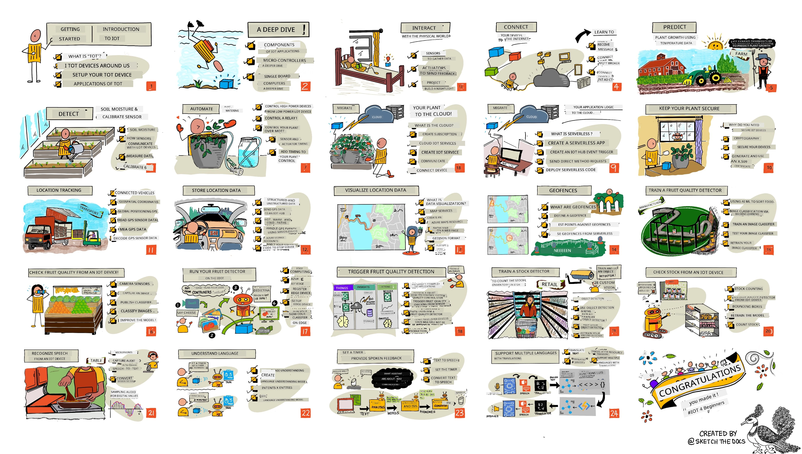

### Join di Azure AI Foundry Community

If you jam koma or get any question about how to build AI apps. Join other learners and beta developers wey sabi plenty inside tori about MCP. Na support community wey dey where questions dey welcome and knowledge dey shared freely.

If you get product feedback or you jam error while you dey build come visit:

Follow these steps to start to use these resources:
1. **Fork di Repository**: Click [](https://GitHub.com/microsoft/IoT-For-Beginners/fork)
2. **Clone di Repository**: `git clone https://github.com/microsoft/IoT-For-Beginners.git`
3. [**Join The Microsot Foundry Discord and meet experts and fellow developers**](https://discord.com/invite/ByRwuEEgH4)


### 🌐 Multi-Language Support

#### Supported via GitHub Action (Automated & Always Up-to-Date)

> **You prefer Clone for your own machine?**
>
> This repository get over 50 language translations wey dey make the download big. If you want clone without translations, use sparse checkout:
>
> **Bash / macOS / Linux:**
> ```bash
> git clone --filter=blob:none --sparse https://github.com/microsoft/IoT-For-Beginners.git
> cd IoT-For-Beginners
> git sparse-checkout set --no-cone '/*' '!translations' '!translated_images'
> ```
>
> **CMD (Windows):**
> ```cmd
> git clone --filter=blob:none --sparse https://github.com/microsoft/IoT-For-Beginners.git
> cd IoT-For-Beginners
> git sparse-checkout set --no-cone "/*" "!translations" "!translated_images"
> ```
>
> This one go give you everything wey you need to finish the course but e go download faster.

# IoT for Beginners - Curriculum

Azure Cloud Advocates for Microsoft happy to offer 12-week, 24-lesson curriculum wey dey about IoT basics. Each lesson get quiz before and after, written instructions to fit finish di lesson, solution, assignment and more. Our project-base way to teach go make you learn as you dey build, na beta way to make new skills go stick.

Di projects cover how food dey waka from farm reach table. This one include farming, logistics, manufacturing, retail and consumer - all na popular industry areas for IoT devices.



> Sketchnote by [Nitya Narasimhan](https://github.com/nitya). Click di picture for bigger version.

**Big thank you to our authors [Jen Fox](https://github.com/jenfoxbot), [Jen Looper](https://github.com/jlooper), [Jim Bennett](https://github.com/jimbobbennett), and our sketchnote artist [Nitya Narasimhan](https://github.com/nitya).**

**More thanks go our team of [Microsoft Learn Student Ambassadors](https://studentambassadors.microsoft.com?WT.mc_id=academic-17441-jabenn) wey don dey review and translate this curriculum - [Aditya Garg](https://github.com/AdityaGarg00), [Anurag Sharma](https://github.com/Anurag-0-1-A), [Arpita Das](https://github.com/Arpiiitaaa), [Aryan Jain](https://www.linkedin.com/in/aryan-jain-47a4a1145/), [Bhavesh Suneja](https://github.com/EliteWarrior315), [Faith Hunja](https://faithhunja.github.io/), [Lateefah Bello](https://www.linkedin.com/in/lateefah-bello/), [Manvi Jha](https://github.com/Severus-Matthew), [Mireille Tan](https://www.linkedin.com/in/mireille-tan-a4834819a/), [Mohammad Iftekher (Iftu) Ebne Jalal](https://github.com/Iftu119), [Mohammad Zulfikar](https://github.com/mohzulfikar), [Priyanshu Srivastav](https://www.linkedin.com/in/priyanshu-srivastav-b067241ba), [Thanmai Gowducheruvu](https://github.com/innovation-platform), and [Zina Kamel](https://www.linkedin.com/in/zina-kamel/).**

Meet di team!

[](https://youtu.be/-wippUJRi5k)

**Gif by** [Mohit Jaisal](https://linkedin.com/in/mohitjaisal)

> 🎥 Click di image up for video about di project!

> **Teachers**, we don [include some suggestions](for-teachers.md) on how to use this curriculum. If you want create your own lessons, we still include a [lesson template](lesson-template/README.md).

> **[Students](https://aka.ms/student-page)**, if you want use this curriculum by yourself, fork the whole repo and finish the exercises by yourself, start with the quiz before lecture, read the lecture and do the rest activities. Try to create the projects by understanding the lessons instead of just copying the solution code; dat code dey available inside the /solutions folder for each project-based lesson. Another idea na to form study group with your friends and go through the content together. For further studies, we recommend [Microsoft Learn](https://docs.microsoft.com/users/jimbobbennett/collections/ke2ehd351jopwr?WT.mc_id=academic-17441-jabenn).

To watch video to understand this course, check this video:

[](https://youtube.com/watch?v=bccEMm8gRuc "Promo video")

> 🎥 Click di picture up for video about di project!

## Pedagogy

We choose two main principles while building this curriculum: to make am project-based and to make quiz plenty. By the end of this series, students go don build plant monitoring and watering system, vehicle tracker, smart factory setup to track and check food, and voice-controlled cooking timer, plus learn the basics of Internet of Things including how to write device code, how to connect to cloud, analyze telemetry and run AI on the edge.

By making sure the content relate to projects, the process go dey more interesting for students and dem go remember di things well.

Also, low-stakes quiz before class dey set intention for student to learn di topic, meanwhile the second quiz after class dey ensure say dem remember more. This curriculum na flexible and fun one wey fit either complete full or part of am. Di projects start small and dey get harder as di 12-weeks pass.

Each project dey based on real-world hardware wey students and hobbyists fit get. Each project dey talk about the project domain, give better knowledge background. To be beta developer, e good to understand the area where you dey solve problems, this background knowledge go make students think better about their IoT solutions and learn for the kind real-world problem dem fit meet as IoT developer. Students go sabi di 'why' of the solutions wey dem dey build, and go get appreciation for di end user.

## Hardware
We get two kain IoT hardware we fit use for the projects based on wetin person like, programming language wey person sabi or like, learning goals and how e dey available. We self don put one 'virtual hardware' version for those wey no get hardware or wey wan learn more before dem buy. You fit read more and find one 'shopping list' for the [hardware page](./hardware.md), wey get links to buy complete kits from our friends for Seeed Studio.

> 💁 Find our [Code of Conduct](CODE_OF_CONDUCT.md), [Contributing](CONTRIBUTING.md), and [Translations](..) guidelines. We dey welcome your constructive feedback!
>
> 🔧 You get wahala? Check our [Troubleshooting Guide](TROUBLESHOOTING.md) for solutions to common problems.

## Each lesson get:

- sketchnote
- optional supplemental video
- pre-lesson warmup quiz
- written lesson
- for project-based lessons, step-by-step guides on how to build the project
- knowledge checks
- one challenge
- supplemental reading
- assignment
- [post-lesson quiz](https://ff-quizzes.netlify.app/en/)

> **One note about quizzes**: All quizzes dey inside the quiz-app folder, them get 48 total quizzes of three questions each. Lessons go link to dem but you fit run the quiz app locally or deploy am to Azure; follow the instruction inside the `quiz-app` folder. Them dey slowly dey localize dem.

## Lessons

|       |              Project Name              |                       Concepts Taught                       | Learning Objectives                                                                                                                                                 |                                                        Linked Lesson                                                         |
| :---: | :------------------------------------: | :---------------------------------------------------------: | ------------------------------------------------------------------------------------------------------------------------------------------------------------------- | :--------------------------------------------------------------------------------------------------------------------------: |
|  01   | [Getting started](./1-getting-started/README.md) |                     Introduction to IoT                     | Learn the basic principles of IoT and the basic building blocks of IoT solutions like sensors and cloud services as you dey set up your first IoT device            |                      [Introduction to IoT](./1-getting-started/lessons/1-introduction-to-iot/README.md)                      |
|  02   | [Getting started](./1-getting-started/README.md) |                   A deeper dive into IoT                    | Learn more about the components of IoT system, plus microcontrollers and single-board computers                                                                      |                        [A deeper dive into IoT](./1-getting-started/lessons/2-deeper-dive/README.md)                         |
|  03   | [Getting started](./1-getting-started/README.md) | Interact with the physical world with sensors and actuators | Learn about sensors wey fit gather data from the physical world, plus actuators wey go send feedback, as you build one nightlight                                  | [Interact with the physical world with sensors and actuators](./1-getting-started/lessons/3-sensors-and-actuators/README.md) |
|  04   | [Getting started](./1-getting-started/README.md) |             Connect your device to the Internet             | Learn how to connect IoT device to the Internet to send and receive messages by connecting your nightlight to MQTT broker                                            |               [Connect your device to the Internet](./1-getting-started/lessons/4-connect-internet/README.md)                |
|  05   |            [Farm](./2-farm/README.md)            |                    Predict plant growth                     | Learn how to predict plant growth using temperature data wey IoT device gather                                                                                       |                          [Predict plant growth](./2-farm/lessons/1-predict-plant-growth/README.md)                           |
|  06   |            [Farm](./2-farm/README.md)            |                    Detect soil moisture                     | Learn how to detect soil moisture plus calibrate soil moisture sensor                                                                                                |                          [Detect soil moisture](./2-farm/lessons/2-detect-soil-moisture/README.md)                           |
|  07   |            [Farm](./2-farm/README.md)            |                  Automated plant watering                   | Learn how to automate and time watering with relay and MQTT                                                                                                         |                      [Automated plant watering](./2-farm/lessons/3-automated-plant-watering/README.md)                       |
|  08   |            [Farm](./2-farm/README.md)            |               Migrate your plant to the cloud               | Learn about cloud and cloud-hosted IoT services plus how to connect your plant to one of these instead of public MQTT broker                                          |               [Migrate your plant to the cloud](./2-farm/lessons/4-migrate-your-plant-to-the-cloud/README.md)                |
|  09   |            [Farm](./2-farm/README.md)            |         Migrate your application logic to the cloud         | Learn how you fit write application logic for cloud wey dey respond to IoT messages                                                                                  |         [Migrate your application logic to the cloud](./2-farm/lessons/5-migrate-application-to-the-cloud/README.md)         |
|  10   |            [Farm](./2-farm/README.md)            |                   Keep your plant secure                    | Learn about IoT security and how to protect your plant with keys and certificates                                                                                     |                        [Keep your plant secure](./2-farm/lessons/6-keep-your-plant-secure/README.md)                         |
|  11   |       [Transport](./3-transport/README.md)       |                      Location tracking                      | Learn about GPS location tracking for IoT devices                                                                                                                   |                           [Location tracking](./3-transport/lessons/1-location-tracking/README.md)                           |
|  12   |       [Transport](./3-transport/README.md)       |                     Store location data                     | Learn how to store IoT data for later visualizing or analyzing                                                                                                      |                         [Store location data](./3-transport/lessons/2-store-location-data/README.md)                         |
|  13   |       [Transport](./3-transport/README.md)       |                   Visualize location data                   | Learn how to visualize location data on map and how maps dey represent the real 3D world in 2 dimensions                                                             |                     [Visualize location data](./3-transport/lessons/3-visualize-location-data/README.md)                     |
|  14   |       [Transport](./3-transport/README.md)       |                          Geofences                          | Learn about geofences and how dem fit alert when vehicles inside supply chain dey near their destination                                                             |                                   [Geofences](./3-transport/lessons/4-geofences/README.md)                                   |
|  15   |   [Manufacturing](./4-manufacturing/README.md)   |               Train a fruit quality detector                | Learn about how to train image classifier for cloud to detect fruit quality                                                                                           |                 [Train a fruit quality detector](./4-manufacturing/lessons/1-train-fruit-detector/README.md)                 |
|  16   |   [Manufacturing](./4-manufacturing/README.md)   |           Check fruit quality from an IoT device            | Learn how to use your fruit quality detector from IoT device                                                                                                        |           [Check fruit quality from an IoT device](./4-manufacturing/lessons/2-check-fruit-from-device/README.md)            |
|  17   |   [Manufacturing](./4-manufacturing/README.md)   |             Run your fruit detector on the edge             | Learn about running your fruit detector on IoT device on the edge                                                                                                   |             [Run your fruit detector on the edge](./4-manufacturing/lessons/3-run-fruit-detector-edge/README.md)             |
|  18   |   [Manufacturing](./4-manufacturing/README.md)   |        Trigger fruit quality detection from a sensor        | Learn about how to trigger fruit quality detection from sensor                                                                                                      |        [Trigger fruit quality detection from a sensor](./4-manufacturing/lessons/4-trigger-fruit-detector/README.md)         |
|  19   |          [Retail](./5-retail/README.md)          |                   Train a stock detector                    | Learn how to use object detection to train stock detector to count stock inside shop                                                                                 |                        [Train a stock detector](./5-retail/lessons/1-train-stock-detector/README.md)                         |
|  20   |          [Retail](./5-retail/README.md)          |               Check stock from an IoT device                | Learn how to check stock from IoT device using object detection model                                                                                                |                     [Check stock from an IoT device](./5-retail/lessons/2-check-stock-device/README.md)                      |
|  21   |        [Consumer](./6-consumer/README.md)        |             Recognize speech with an IoT device             | Learn how to recognize speech from IoT device to build smart timer                                                                                                  |                  [Recognize speech with an IoT device](./6-consumer/lessons/1-speech-recognition/README.md)                  |
|  22   |        [Consumer](./6-consumer/README.md)        |                     Understand language                     | Learn how to understand sentences wey person talk to IoT device                                                                                                     |                        [Understand language](./6-consumer/lessons/2-language-understanding/README.md)                        |
|  23   |        [Consumer](./6-consumer/README.md)        |           Set a timer and provide spoken feedback           | Learn how to set timer for IoT device and give spoken feedback on when timer start and finish                                                                        |                 [Set a timer and provide spoken feedback](./6-consumer/lessons/3-spoken-feedback/README.md)                  |
|  24   |        [Consumer](./6-consumer/README.md)        |                 Support multiple languages                  | Learn how to support many languages, both for talking to and response from your smart timer                                                                          |                   [Support multiple languages](./6-consumer/lessons/4-multiple-language-support/README.md)                   |

## Offline access

You fit run this document offline by using [Docsify](https://docsify.js.org/#/). Fork this repo, [install Docsify](https://docsify.js.org/#/quickstart) for your local machine, then for the root folder of this repo, type `docsify serve`. The website go dey on port 3000 for your localhost: `localhost:3000`.

## Quiz

Thanks to community wey host this interactive quiz wey dey test your knowledge for each chapters. You fit test your knowledge [here](https://ff-quizzes.netlify.app/en/) 

### PDF

You fit generate PDF of this content for offline access if you need am. To do this, make sure say you get [npm installed](https://docs.npmjs.com/downloading-and-installing-node-js-and-npm) and run these commands for the root folder of this repo:

```sh
npm i
npm run convert
```

### Slides

Some lessons get slide decks for the [slides](../../slides) folder.


## Other Curricula

Our team dey make other curricula! Check am out:

<!-- CO-OP TRANSLATOR OTHER COURSES START -->
### LangChain
[](https://aka.ms/langchain4j-for-beginners)
[](https://aka.ms/langchainjs-for-beginners?WT.mc_id=m365-94501-dwahlin)
[](https://github.com/microsoft/langchain-for-beginners?WT.mc_id=m365-94501-dwahlin)
---

### Azure / Edge / MCP / Agents
[](https://github.com/microsoft/AZD-for-beginners?WT.mc_id=academic-105485-koreyst)
[](https://github.com/microsoft/edgeai-for-beginners?WT.mc_id=academic-105485-koreyst)
[](https://github.com/microsoft/mcp-for-beginners?WT.mc_id=academic-105485-koreyst)
[](https://github.com/microsoft/ai-agents-for-beginners?WT.mc_id=academic-105485-koreyst)

---
 
### Generative AI Series
[](https://github.com/microsoft/generative-ai-for-beginners?WT.mc_id=academic-105485-koreyst)
[-9333EA?style=for-the-badge&labelColor=E5E7EB&color=9333EA)](https://github.com/microsoft/Generative-AI-for-beginners-dotnet?WT.mc_id=academic-105485-koreyst)
[-C084FC?style=for-the-badge&labelColor=E5E7EB&color=C084FC)](https://github.com/microsoft/generative-ai-for-beginners-java?WT.mc_id=academic-105485-koreyst)
[-E879F9?style=for-the-badge&labelColor=E5E7EB&color=E879F9)](https://github.com/microsoft/generative-ai-with-javascript?WT.mc_id=academic-105485-koreyst)

---
 
### Core Learning
[](https://aka.ms/ml-beginners?WT.mc_id=academic-105485-koreyst)
[](https://aka.ms/datascience-beginners?WT.mc_id=academic-105485-koreyst)
[](https://aka.ms/ai-beginners?WT.mc_id=academic-105485-koreyst)
[](https://github.com/microsoft/Security-101?WT.mc_id=academic-96948-sayoung)
[](https://aka.ms/webdev-beginners?WT.mc_id=academic-105485-koreyst)
[](https://aka.ms/iot-beginners?WT.mc_id=academic-105485-koreyst)
[](https://github.com/microsoft/xr-development-for-beginners?WT.mc_id=academic-105485-koreyst)

---
 
### Copilot Series
[](https://aka.ms/GitHubCopilotAI?WT.mc_id=academic-105485-koreyst)
[](https://github.com/microsoft/mastering-github-copilot-for-dotnet-csharp-developers?WT.mc_id=academic-105485-koreyst)
[](https://github.com/microsoft/CopilotAdventures?WT.mc_id=academic-105485-koreyst)
<!-- CO-OP TRANSLATOR OTHER COURSES END -->

## Image attributions

You fit find all the attributions for the images wey dem use inside dis curriculum where e dey needed for the [Attributions](./attributions.md).

---

<!-- CO-OP TRANSLATOR DISCLAIMER START -->
**Disclaimer**:  
Dis document don translate wit AI translation service [Co-op Translator](https://github.com/Azure/co-op-translator). Even tho we dey try make everything correct, abeg sabi say automated translation fit get error or mistake. Di original document wey e dey for im own language na di main correct source. For important information, na professional human translation you suppose use. We no go responsible if person mistake or no understand well because of dis translation.
<!-- CO-OP TRANSLATOR DISCLAIMER END -->