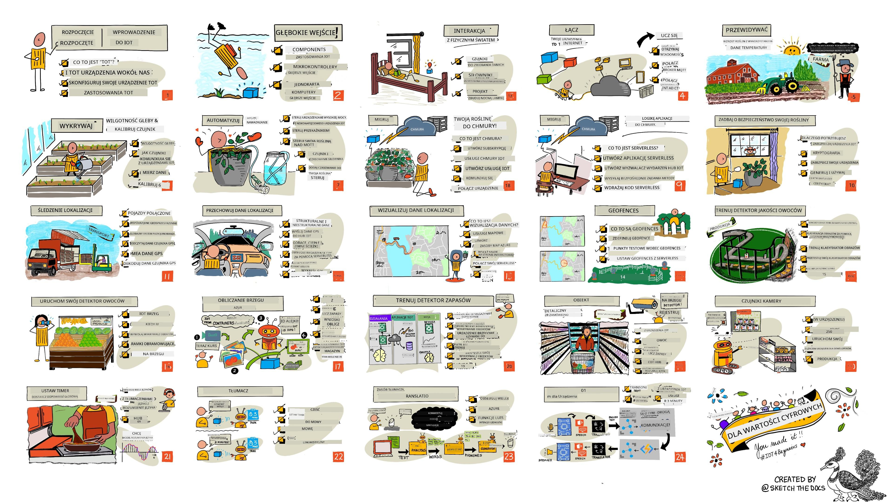

<!--
CO_OP_TRANSLATOR_METADATA:
{
  "original_hash": "6c354ec3487e4f6cfafbe44557996cd9",
  "translation_date": "2026-01-06T03:49:41+00:00",
  "source_file": "README.md",
  "language_code": "pl"
}
-->
[](https://github.com/microsoft/IoT-For-Beginners/blob/master/LICENSE)
[](https://GitHub.com/microsoft/IoT-For-Beginners/graphs/contributors/)
[](https://GitHub.com/microsoft/IoT-For-Beginners/issues/)
[](https://GitHub.com/microsoft/IoT-For-Beginners/pulls/)
[](http://makeapullrequest.com)

[](https://GitHub.com/microsoft/IoT-For-Beginners/watchers/)
[](https://GitHub.com/microsoft/IoT-For-Beginners/network/)
[](https://GitHub.com/microsoft/IoT-For-Beginners/stargazers/)

### Dołącz do społeczności Azure AI Foundry 

Jeśli utkniesz lub masz pytania dotyczące tworzenia aplikacji AI. Dołącz do innych uczących się i doświadczonych programistów w dyskusjach na temat MCP. To wspierająca społeczność, w której pytania są mile widziane, a wiedza jest swobodnie dzielona.

[](https://discord.gg/nTYy5BXMWG)

Jeśli masz uwagi dotyczące produktu lub napotkasz błędy podczas tworzenia, odwiedź:

[](https://aka.ms/foundry/forum)

Postępuj zgodnie z następującymi krokami, aby rozpocząć korzystanie z tych zasobów:
1. **Rozgałęź repozytorium**: Kliknij [](https://GitHub.com/microsoft/IoT-For-Beginners/fork)
2. **Sklonuj repozytorium**:   `git clone https://github.com/microsoft/IoT-For-Beginners.git`
3. [**Dołącz do Microsot Foundry Discord i spotkaj ekspertów oraz innych programistów**](https://discord.com/invite/ByRwuEEgH4)


### 🌐 Wielojęzyczne wsparcie

#### Wspierane przez GitHub Action (Automatyczne i Zawsze Aktualne)

<!-- CO-OP TRANSLATOR LANGUAGES TABLE START -->
[Arabski](../ar/README.md) | [Bengalski](../bn/README.md) | [Bułgarski](../bg/README.md) | [Birmański (Myanmar)](../my/README.md) | [Chiński (Uproszczony)](../zh/README.md) | [Chiński (Tradycyjny, Hongkong)](../hk/README.md) | [Chiński (Tradycyjny, Makau)](../mo/README.md) | [Chiński (Tradycyjny, Tajwan)](../tw/README.md) | [Chorwacki](../hr/README.md) | [Czeski](../cs/README.md) | [Duński](../da/README.md) | [Holenderski](../nl/README.md) | [Estoński](../et/README.md) | [Fiński](../fi/README.md) | [Francuski](../fr/README.md) | [Niemiecki](../de/README.md) | [Grecki](../el/README.md) | [Hebrajski](../he/README.md) | [Hindi](../hi/README.md) | [Węgierski](../hu/README.md) | [Indonezyjski](../id/README.md) | [Włoski](../it/README.md) | [Japoński](../ja/README.md) | [Kannada](../kn/README.md) | [Koreański](../ko/README.md) | [Litewski](../lt/README.md) | [Malajski](../ms/README.md) | [Malajalam](../ml/README.md) | [Marathi](../mr/README.md) | [Nepalski](../ne/README.md) | [Pidgin Nigeryjski](../pcm/README.md) | [Norweski](../no/README.md) | [Perski (Farsi)](../fa/README.md) | [Polski](./README.md) | [Portugalski (Brazylia)](../br/README.md) | [Portugalski (Portugalia)](../pt/README.md) | [Pendżabski (Gurmukhi)](../pa/README.md) | [Rumuński](../ro/README.md) | [Rosyjski](../ru/README.md) | [Serbski (Cyryllica)](../sr/README.md) | [Słowacki](../sk/README.md) | [Słoweński](../sl/README.md) | [Hiszpański](../es/README.md) | [Suahili](../sw/README.md) | [Szwedzki](../sv/README.md) | [Tagalog (Filipiński)](../tl/README.md) | [Tamilski](../ta/README.md) | [Telugu](../te/README.md) | [Tajski](../th/README.md) | [Turecki](../tr/README.md) | [Ukraiński](../uk/README.md) | [Urdu](../ur/README.md) | [Wietnamski](../vi/README.md)

> **Wolisz klonować lokalnie?**

> To repozytorium zawiera ponad 50 tłumaczeń językowych, co znacznie zwiększa rozmiar pobierania. Aby sklonować bez tłumaczeń, użyj sparse checkout:
> ```bash
> git clone --filter=blob:none --sparse https://github.com/microsoft/IoT-For-Beginners.git
> cd IoT-For-Beginners
> git sparse-checkout set --no-cone '/*' '!translations' '!translated_images'
> ```
> Dzięki temu otrzymasz wszystko, czego potrzebujesz, aby ukończyć kurs z dużo szybszym pobieraniem.
<!-- CO-OP TRANSLATOR LANGUAGES TABLE END -->

# IoT dla początkujących - Program nauczania

Zespół Azure Cloud Advocates w Microsoft z przyjemnością oferuje 12-tygodniowy, 24-lekcyjny program nauczania poświęcony podstawom IoT. Każda lekcja zawiera quizy przed i po lekcji, pisemne instrukcje do wykonania lekcji, rozwiązanie, zadanie i więcej. Nasza oparta na projektach metodyka nauczania umożliwia naukę poprzez budowanie, co jest sprawdzonym sposobem na trwałe przyswajanie nowych umiejętności.

Projekty obejmują drogę jedzenia od farmy do stołu. Obejmuje to rolnictwo, logistykę, produkcję, handel detaliczny i konsumencki - wszystkie popularne obszary przemysłu dla urządzeń IoT.



> Sketchnote autorstwa [Nitya Narasimhan](https://github.com/nitya). Kliknij obraz, aby zobaczyć powiększenie.

**Serdeczne podziękowania dla naszych autorów [Jen Fox](https://github.com/jenfoxbot), [Jen Looper](https://github.com/jlooper), [Jim Bennett](https://github.com/jimbobbennett) oraz naszej artystki sketchnote [Nitya Narasimhan](https://github.com/nitya).**

**Podziękowania również dla naszego zespołu [Microsoft Learn Student Ambassadors](https://studentambassadors.microsoft.com?WT.mc_id=academic-17441-jabenn), którzy recenzowali i tłumaczyli ten program nauczania - [Aditya Garg](https://github.com/AdityaGarg00), [Anurag Sharma](https://github.com/Anurag-0-1-A), [Arpita Das](https://github.com/Arpiiitaaa), [Aryan Jain](https://www.linkedin.com/in/aryan-jain-47a4a1145/), [Bhavesh Suneja](https://github.com/EliteWarrior315), [Faith Hunja](https://faithhunja.github.io/), [Lateefah Bello](https://www.linkedin.com/in/lateefah-bello/), [Manvi Jha](https://github.com/Severus-Matthew), [Mireille Tan](https://www.linkedin.com/in/mireille-tan-a4834819a/), [Mohammad Iftekher (Iftu) Ebne Jalal](https://github.com/Iftu119), [Mohammad Zulfikar](https://github.com/mohzulfikar), [Priyanshu Srivastav](https://www.linkedin.com/in/priyanshu-srivastav-b067241ba), [Thanmai Gowducheruvu](https://github.com/innovation-platform) oraz [Zina Kamel](https://www.linkedin.com/in/zina-kamel/).**

Poznaj zespół!

[](https://youtu.be/-wippUJRi5k)

**Gif autorstwa** [Mohit Jaisal](https://linkedin.com/in/mohitjaisal)

> 🎥 Kliknij obraz powyżej, aby obejrzeć film o projekcie!

> **Nauczyciele**, dołączyliśmy [kilka sugestii](for-teachers.md) dotyczących korzystania z tego programu nauczania. Jeśli chcesz stworzyć własne lekcje, dołączyliśmy również [szablon lekcji](lesson-template/README.md).

> **[Studenci](https://aka.ms/student-page)**, aby korzystać z tego programu samodzielnie, rozgałęź całe repozytorium i wykonuj ćwiczenia samodzielnie, zaczynając od quizu przed wykładem, następnie czytając wykład i wykonując resztę zadań. Staraj się tworzyć projekty, rozumiejąc lekcje, zamiast kopiować kod rozwiązań; jednak kod ten jest dostępny w folderach /solutions w każdej lekcji zorientowanej na projekt. Innym pomysłem jest utworzenie grupy naukowej z przyjaciółmi i wspólne przechodzenie przez materiał. Dla dalszej nauki polecamy [Microsoft Learn](https://docs.microsoft.com/users/jimbobbennett/collections/ke2ehd351jopwr?WT.mc_id=academic-17441-jabenn).

Aby zobaczyć przegląd wideo tego kursu, obejrzyj ten film:

[](https://youtube.com/watch?v=bccEMm8gRuc "Promo video")

> 🎥 Kliknij obraz powyżej, aby obejrzeć film o projekcie!

## Metodyka nauczania

Wybraliśmy dwie zasady pedagogiczne podczas tworzenia tego programu nauczania: upewnienie się, że jest oparty na projektach i że zawiera częste quizy. Pod koniec tej serii studenci zbudują system monitorowania i podlewania roślin, lokalizator pojazdów, inteligentną fabrykę do śledzenia i kontroli żywności oraz głosowy timer do gotowania, a także poznają podstawy Internetu Rzeczy, w tym jak pisać kod dla urządzeń, łączyć się z chmurą, analizować telemetrię i uruchamiać AI na urządzeniach brzegowych.

Zapewnienie, że treść jest powiązana z projektami, sprawia, że proces jest bardziej angażujący dla studentów, a utrwalenie koncepcji zostanie wzmocnione.

Ponadto quiz o niskiej presji przed zajęciami ustawia zamiar ucznia na naukę tematu, natomiast drugi quiz po zajęciach zapewnia dalsze utrwalenie. Program ten został zaprojektowany tak, aby był elastyczny i zabawny, można go realizować w całości lub częściowo. Projekty zaczynają się od małych i stają się coraz bardziej złożone pod koniec 12-tygodniowego cyklu.

Każdy projekt opiera się na rzeczywistym sprzęcie dostępnym dla studentów i hobbystów. Każdy projekt analizuje konkretną dziedzinę projektu, dostarczając odpowiednią wiedzę tła. Aby być skutecznym deweloperem, warto znać dziedzinę, w której rozwiązujesz problemy; dostarczanie tej wiedzy pozwala studentom myśleć o swoich rozwiązaniach IoT i naukach w kontekście rodzaju rzeczywistego problemu, który mogą być poproszeni rozwiązać jako programista IoT. Studenci uczą się „dlaczego” rozwiązań, które budują, i zyskują docenienie końcowego użytkownika.

## Sprzęt

Mamy dwa wybory sprzętu IoT do wykorzystania w projektach, w zależności od osobistych preferencji, znajomości języka programowania, celów nauki i dostępności. Udostępniliśmy też wersję „wirtualnego sprzętu” dla tych, którzy nie mają dostępu do sprzętu lub chcą się nauczyć więcej przed podjęciem decyzji o zakupie. Możesz przeczytać więcej i znaleźć „listę zakupów” na [stronie sprzętu](./hardware.md), włączając linki do zakupu kompletnych zestawów od naszych przyjaciół ze Seeed Studio.
> 💁 Znajdź nasze [Zasady Postępowania](CODE_OF_CONDUCT.md), wytyczne dotyczące [Współtworzenia](CONTRIBUTING.md) oraz [Tłumaczeń](TRANSLATIONS.md). Czekamy na Twoją konstruktywną opinię!
>
> 🔧 Masz problemy? Sprawdź nasz [Przewodnik rozwiązywania problemów](TROUBLESHOOTING.md) z rozwiązaniami najczęstszych problemów.

## Każda lekcja zawiera:

- notatkę sketchnote
- opcjonalne dodatkowe wideo
- quiz rozgrzewający przed lekcją
- lekcję w formie pisemnej
- dla lekcji projektowych, przewodniki krok po kroku jak zbudować projekt
- sprawdzenie wiedzy
- wyzwanie
- dodatkowe materiały do czytania
- zadanie
- [quiz po lekcji](https://ff-quizzes.netlify.app/en/)

> **Uwaga o quizach**: Wszystkie quizy znajdują się w folderze quiz-app, jest ich łącznie 48, każdy z trzema pytaniami. Są one powiązane z lekcjami, ale aplikację quizową można uruchomić lokalnie lub wdrożyć na Azure; postępuj zgodnie z instrukcjami w folderze `quiz-app`. Są one stopniowo lokalizowane.

## Lekcje

|       |              Nazwa projektu              |                       Przekazywane koncepcje                       | Cele nauki                                                                                                                                                 |                                                        Powiązana lekcja                                                         |
| :---: | :------------------------------------: | :---------------------------------------------------------: | ------------------------------------------------------------------------------------------------------------------------------------------------------------------- | :--------------------------------------------------------------------------------------------------------------------------: |
|  01   | [Getting started](./1-getting-started/README.md) |                     Wprowadzenie do IoT                     | Poznaj podstawowe zasady IoT oraz podstawowe elementy rozwiązań IoT takie jak czujniki i usługi w chmurze podczas konfigurowania pierwszego urządzenia IoT |                      [Introduction to IoT](./1-getting-started/lessons/1-introduction-to-iot/README.md)                      |
|  02   | [Getting started](./1-getting-started/README.md) |                   Głębsze zanurzenie w IoT                    | Dowiedz się więcej o komponentach systemu IoT, a także o mikrokontrolerach i komputerach jednopłytkowych                                                            |                        [A deeper dive into IoT](./1-getting-started/lessons/2-deeper-dive/README.md)                         |
|  03   | [Getting started](./1-getting-started/README.md) | Interakcja ze światem fizycznym za pomocą czujników i siłowników | Poznaj czujniki do zbierania danych ze świata fizycznego oraz siłowniki do wysyłania informacji zwrotnej, podczas budowania lampki nocnej                                           | [Interact with the physical world with sensors and actuators](./1-getting-started/lessons/3-sensors-and-actuators/README.md) |
|  04   | [Getting started](./1-getting-started/README.md) |             Połącz swoje urządzenie z Internetem             | Naucz się łączyć urządzenie IoT z Internetem, aby wysyłać i odbierać wiadomości, podłączając swoją lampkę nocną do brokera MQTT                               |               [Connect your device to the Internet](./1-getting-started/lessons/4-connect-internet/README.md)                |
|  05   |            [Farm](./2-farm/README.md)            |                    Przewidywanie wzrostu roślin                     | Naucz się przewidywać wzrost roślin na podstawie danych o temperaturze zbieranych przez urządzenie IoT                                                                                  |                          [Predict plant growth](./2-farm/lessons/1-predict-plant-growth/README.md)                           |
|  06   |            [Farm](./2-farm/README.md)            |                    Wykrywanie wilgotności gleby                     | Naucz się wykrywać wilgotność gleby oraz kalibrować czujnik wilgotności gleby                                                                                              |                          [Detect soil moisture](./2-farm/lessons/2-detect-soil-moisture/README.md)                           |
|  07   |            [Farm](./2-farm/README.md)            |                  Automatyczne podlewanie roślin                   | Naucz się automatyzować i harmonogramować podlewanie za pomocą przekaźnika i MQTT                                                                                                      |                      [Automated plant watering](./2-farm/lessons/3-automated-plant-watering/README.md)                       |
|  08   |            [Farm](./2-farm/README.md)            |               Migracja rośliny do chmury               | Poznaj chmurę i usługi IoT hostowane w chmurze oraz jak podłączyć swoją roślinę do którejś z nich zamiast do publicznego brokera MQTT                                   |               [Migrate your plant to the cloud](./2-farm/lessons/4-migrate-your-plant-to-the-cloud/README.md)                |
|  09   |            [Farm](./2-farm/README.md)            |         Migracja logiki aplikacji do chmury         | Dowiedz się, jak pisać logikę aplikacji w chmurze, która reaguje na wiadomości IoT                                                                          |         [Migrate your application logic to the cloud](./2-farm/lessons/5-migrate-application-to-the-cloud/README.md)         |
|  10   |            [Farm](./2-farm/README.md)            |                   Zabezpiecz swoją roślinę                    | Naucz się o bezpieczeństwie w IoT i jak chronić swoją roślinę za pomocą kluczy i certyfikatów                                                                          |                        [Keep your plant secure](./2-farm/lessons/6-keep-your-plant-secure/README.md)                         |
|  11   |       [Transport](./3-transport/README.md)       |                      Lokalizacja                      | Poznaj śledzenie lokalizacji za pomocą GPS dla urządzeń IoT                                                                                                                   |                           [Location tracking](./3-transport/lessons/1-location-tracking/README.md)                           |
|  12   |       [Transport](./3-transport/README.md)       |                     Przechowywanie danych o lokalizacji                     | Naucz się, jak przechowywać dane IoT do późniejszej wizualizacji lub analizy                                                                                                      |                         [Store location data](./3-transport/lessons/2-store-location-data/README.md)                         |
|  13   |       [Transport](./3-transport/README.md)       |                   Wizualizacja danych o lokalizacji                   | Poznaj wizualizację danych o lokalizacji na mapie oraz jak mapy reprezentują rzeczywisty świat 3D w 2 wymiarach                                                            |                     [Visualize location data](./3-transport/lessons/3-visualize-location-data/README.md)                     |
|  14   |       [Transport](./3-transport/README.md)       |                          Geostrefy                          | Dowiedz się o geostrefach i jak mogą być używane do alarmowania, gdy pojazdy w łańcuchu dostaw zbliżają się do celu                                           |                                   [Geofences](./3-transport/lessons/4-geofences/README.md)                                   |
|  15   |   [Manufacturing](./4-manufacturing/README.md)   |               Trenowanie detektora jakości owoców                | Poznaj trenowanie klasyfikatora obrazów w chmurze do wykrywania jakości owoców                                                                                       |                 [Train a fruit quality detector](./4-manufacturing/lessons/1-train-fruit-detector/README.md)                 |
|  16   |   [Manufacturing](./4-manufacturing/README.md)   |           Sprawdzanie jakości owoców z urządzenia IoT            | Dowiedz się o używaniu detektora jakości owoców z urządzenia IoT                                                                                                    |           [Check fruit quality from an IoT device](./4-manufacturing/lessons/2-check-fruit-from-device/README.md)            |
|  17   |   [Manufacturing](./4-manufacturing/README.md)   |             Uruchamianie detektora owoców na krawędzi             | Dowiedz się o uruchamianiu detektora owoców na urządzeniu IoT na krawędzi                                                                                                |             [Run your fruit detector on the edge](./4-manufacturing/lessons/3-run-fruit-detector-edge/README.md)             |
|  18   |   [Manufacturing](./4-manufacturing/README.md)   |        Wyzwalanie wykrywania jakości owoców z czujnika        | Poznaj wyzwalanie wykrywania jakości owoców z czujnika                                                                                                        |        [Trigger fruit quality detection from a sensor](./4-manufacturing/lessons/4-trigger-fruit-detector/README.md)         |
|  19   |          [Retail](./5-retail/README.md)          |                   Trenowanie detektora zapasów                    | Naucz się używać wykrywania obiektów do trenowania detektora zapasów do liczenia zapasów w sklepie                                                                                |                        [Train a stock detector](./5-retail/lessons/1-train-stock-detector/README.md)                         |
|  20   |          [Retail](./5-retail/README.md)          |               Sprawdzanie zapasów z urządzenia IoT                | Dowiedz się jak sprawdzać zapasy z urządzenia IoT używając modelu wykrywania obiektów                                                                                         |                     [Check stock from an IoT device](./5-retail/lessons/2-check-stock-device/README.md)                      |
|  21   |        [Consumer](./6-consumer/README.md)        |             Rozpoznawanie mowy z urządzenia IoT             | Naucz się rozpoznawać mowę z urządzenia IoT, aby zbudować inteligentny timer                                                                                             |                  [Recognize speech with an IoT device](./6-consumer/lessons/1-speech-recognition/README.md)                  |
|  22   |        [Consumer](./6-consumer/README.md)        |                     Rozumienie języka                     | Naucz się rozumieć zdania wypowiadane do urządzenia IoT                                                                                                           |                        [Understand language](./6-consumer/lessons/2-language-understanding/README.md)                        |
|  23   |        [Consumer](./6-consumer/README.md)        |           Ustawianie timera i udzielanie mówionej informacji zwrotnej           | Naucz się ustawiać timer na urządzeniu IoT i udzielać mówionej informacji zwrotnej, kiedy timer został ustawiony i kiedy się kończy                                                    |                 [Set a timer and provide spoken feedback](./6-consumer/lessons/3-spoken-feedback/README.md)                  |
|  24   |        [Consumer](./6-consumer/README.md)        |                 Obsługa wielu języków                  | Dowiedz się jak obsługiwać wiele języków, zarówno podczas mówienia do urządzenia, jak i w odpowiedziach twojego inteligentnego timera                                                               |                   [Support multiple languages](./6-consumer/lessons/4-multiple-language-support/README.md)                   |

## Dostęp offline

Możesz uruchomić tę dokumentację offline za pomocą [Docsify](https://docsify.js.org/#/). Sklonuj to repozytorium, [zainstaluj Docsify](https://docsify.js.org/#/quickstart) na swoim komputerze, a następnie w głównym folderze tego repozytorium wpisz `docsify serve`. Strona będzie serwowana na porcie 3000 na Twoim localhost: `localhost:3000`.

## Quiz

Dziękujemy społeczności za udostępnienie interaktywnego quizu, który sprawdza Twoją wiedzę z każdego rozdziału. Sprawdź swoją wiedzę [tutaj](https://ff-quizzes.netlify.app/en/) 

### PDF

Możesz wygenerować PDF z tej treści, aby mieć dostęp offline jeśli potrzebujesz. Aby to zrobić, upewnij się, że masz [zainstalowany npm](https://docs.npmjs.com/downloading-and-installing-node-js-and-npm) i uruchom następujące polecenia w głównym folderze tego repozytorium:

```sh
npm i
npm run convert
```

### Slajdy

Dostępne są zestawy slajdów do niektórych lekcji w folderze [slides](../../slides).


## Inne Programy nauczania

Nasz zespół tworzy także inne programy nauczania! Sprawdź:

<!-- CO-OP TRANSLATOR OTHER COURSES START -->
### LangChain
[](https://aka.ms/langchain4j-for-beginners)
[](https://aka.ms/langchainjs-for-beginners?WT.mc_id=m365-94501-dwahlin)

---

### Azure / Edge / MCP / Agenci
[](https://github.com/microsoft/AZD-for-beginners?WT.mc_id=academic-105485-koreyst)
[](https://github.com/microsoft/edgeai-for-beginners?WT.mc_id=academic-105485-koreyst)
[](https://github.com/microsoft/mcp-for-beginners?WT.mc_id=academic-105485-koreyst)
[](https://github.com/microsoft/ai-agents-for-beginners?WT.mc_id=academic-105485-koreyst)

---
 
### Seria Generatywnej Sztucznej Inteligencji
[](https://github.com/microsoft/generative-ai-for-beginners?WT.mc_id=academic-105485-koreyst)
[-9333EA?style=for-the-badge&labelColor=E5E7EB&color=9333EA)](https://github.com/microsoft/Generative-AI-for-beginners-dotnet?WT.mc_id=academic-105485-koreyst)
[-C084FC?style=for-the-badge&labelColor=E5E7EB&color=C084FC)](https://github.com/microsoft/generative-ai-for-beginners-java?WT.mc_id=academic-105485-koreyst)
[-E879F9?style=for-the-badge&labelColor=E5E7EB&color=E879F9)](https://github.com/microsoft/generative-ai-with-javascript?WT.mc_id=academic-105485-koreyst)

---
 
### Podstawowe materiały do nauki
[](https://aka.ms/ml-beginners?WT.mc_id=academic-105485-koreyst)
[](https://aka.ms/datascience-beginners?WT.mc_id=academic-105485-koreyst)
[](https://aka.ms/ai-beginners?WT.mc_id=academic-105485-koreyst)
[](https://github.com/microsoft/Security-101?WT.mc_id=academic-96948-sayoung)
[](https://aka.ms/webdev-beginners?WT.mc_id=academic-105485-koreyst)
[](https://aka.ms/iot-beginners?WT.mc_id=academic-105485-koreyst)
[](https://github.com/microsoft/xr-development-for-beginners?WT.mc_id=academic-105485-koreyst)

---
 
### Seria Copilot
[](https://aka.ms/GitHubCopilotAI?WT.mc_id=academic-105485-koreyst)
[](https://github.com/microsoft/mastering-github-copilot-for-dotnet-csharp-developers?WT.mc_id=academic-105485-koreyst)
[](https://github.com/microsoft/CopilotAdventures?WT.mc_id=academic-105485-koreyst)
<!-- CO-OP TRANSLATOR OTHER COURSES END -->

## Przypisy do obrazów

Wszystkie przypisy do obrazów użytych w tym programie nauczania, tam gdzie to wymagane, znajdziesz w pliku [Attributions](./attributions.md).

---

<!-- CO-OP TRANSLATOR DISCLAIMER START -->
**Zastrzeżenie**:
Niniejszy dokument został przetłumaczony za pomocą usługi tłumaczenia AI [Co-op Translator](https://github.com/Azure/co-op-translator). Chociaż dokładamy starań, aby tłumaczenie było jak najbardziej precyzyjne, prosimy pamiętać, że automatyczne tłumaczenia mogą zawierać błędy lub nieścisłości. Oryginalny dokument w jego języku źródłowym powinien być traktowany jako źródło wiarygodne. W przypadku informacji krytycznych zaleca się skorzystanie z profesjonalnego tłumaczenia wykonanego przez człowieka. Nie ponosimy odpowiedzialności za ewentualne nieporozumienia lub błędne interpretacje wynikające z korzystania z tego tłumaczenia.
<!-- CO-OP TRANSLATOR DISCLAIMER END -->