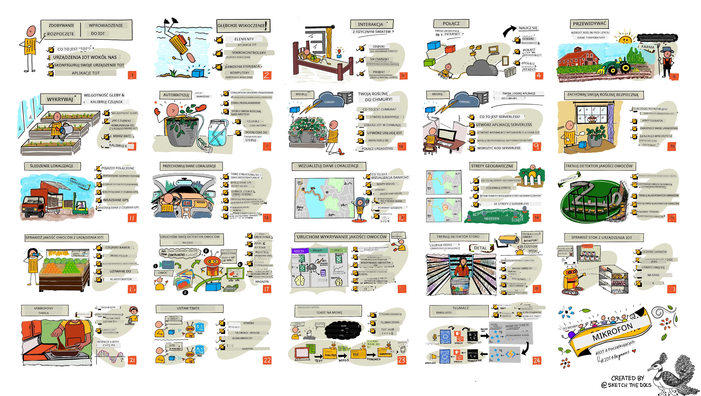

[](https://github.com/microsoft/IoT-For-Beginners/blob/master/LICENSE)
[](https://GitHub.com/microsoft/IoT-For-Beginners/graphs/contributors/)
[](https://GitHub.com/microsoft/IoT-For-Beginners/issues/)
[](https://GitHub.com/microsoft/IoT-For-Beginners/pulls/)
[](http://makeapullrequest.com)

[](https://GitHub.com/microsoft/IoT-For-Beginners/watchers/)
[](https://GitHub.com/microsoft/IoT-For-Beginners/network/)
[](https://GitHub.com/microsoft/IoT-For-Beginners/stargazers/)

### Dołącz do Społeczności Azure AI Foundry

Jeśli utkniesz lub masz pytania dotyczące tworzenia aplikacji AI. Dołącz do innych uczących się i doświadczonych deweloperów, aby uczestniczyć w dyskusjach na temat MCP. To wspierająca społeczność, gdzie pytania są mile widziane, a wiedza jest swobodnie dzielona.

[](https://discord.gg/nTYy5BXMWG)

Jeśli masz uwagi dotyczące produktu lub napotkasz błędy podczas budowania, odwiedź:

[](https://aka.ms/foundry/forum)

Wykonaj te kroki, aby rozpocząć korzystanie z tych zasobów:
1. **Utwórz fork repozytorium**: Kliknij [](https://GitHub.com/microsoft/IoT-For-Beginners/fork)
2. **Sklonuj repozytorium**:   `git clone https://github.com/microsoft/IoT-For-Beginners.git`
3. [**Dołącz do Discord Microsoft Foundry i spotkaj ekspertów oraz innych programistów**](https://discord.com/invite/ByRwuEEgH4)


### 🌐 Wsparcie wielojęzyczne

#### Obsługiwane przez GitHub Action (zautomatyzowane i zawsze aktualne)

<!-- CO-OP TRANSLATOR LANGUAGES TABLE START -->
[Arabic](../ar/README.md) | [Bengali](../bn/README.md) | [Bulgarian](../bg/README.md) | [Burmese (Myanmar)](../my/README.md) | [Chinese (Simplified)](../zh-CN/README.md) | [Chinese (Traditional, Hong Kong)](../zh-HK/README.md) | [Chinese (Traditional, Macau)](../zh-MO/README.md) | [Chinese (Traditional, Taiwan)](../zh-TW/README.md) | [Croatian](../hr/README.md) | [Czech](../cs/README.md) | [Danish](../da/README.md) | [Dutch](../nl/README.md) | [Estonian](../et/README.md) | [Finnish](../fi/README.md) | [French](../fr/README.md) | [German](../de/README.md) | [Greek](../el/README.md) | [Hebrew](../he/README.md) | [Hindi](../hi/README.md) | [Hungarian](../hu/README.md) | [Indonesian](../id/README.md) | [Italian](../it/README.md) | [Japanese](../ja/README.md) | [Kannada](../kn/README.md) | [Khmer](../km/README.md) | [Korean](../ko/README.md) | [Lithuanian](../lt/README.md) | [Malay](../ms/README.md) | [Malayalam](../ml/README.md) | [Marathi](../mr/README.md) | [Nepali](../ne/README.md) | [Nigerian Pidgin](../pcm/README.md) | [Norwegian](../no/README.md) | [Persian (Farsi)](../fa/README.md) | [Polish](./README.md) | [Portuguese (Brazil)](../pt-BR/README.md) | [Portuguese (Portugal)](../pt-PT/README.md) | [Punjabi (Gurmukhi)](../pa/README.md) | [Romanian](../ro/README.md) | [Russian](../ru/README.md) | [Serbian (Cyrillic)](../sr/README.md) | [Slovak](../sk/README.md) | [Slovenian](../sl/README.md) | [Spanish](../es/README.md) | [Swahili](../sw/README.md) | [Swedish](../sv/README.md) | [Tagalog (Filipino)](../tl/README.md) | [Tamil](../ta/README.md) | [Telugu](../te/README.md) | [Thai](../th/README.md) | [Turkish](../tr/README.md) | [Ukrainian](../uk/README.md) | [Urdu](../ur/README.md) | [Vietnamese](../vi/README.md)

> **Wolisz sklonować lokalnie?**
>
> To repozytorium zawiera ponad 50 tłumaczeń językowych, co znacząco zwiększa rozmiar pobieranego pliku. Aby sklonować bez tłumaczeń, użyj sparse checkout:
>
> **Bash / macOS / Linux:**
> ```bash
> git clone --filter=blob:none --sparse https://github.com/microsoft/IoT-For-Beginners.git
> cd IoT-For-Beginners
> git sparse-checkout set --no-cone '/*' '!translations' '!translated_images'
> ```
>
> **CMD (Windows):**
> ```cmd
> git clone --filter=blob:none --sparse https://github.com/microsoft/IoT-For-Beginners.git
> cd IoT-For-Beginners
> git sparse-checkout set --no-cone "/*" "!translations" "!translated_images"
> ```
>
> To zapewnia wszystko, czego potrzebujesz, aby ukończyć kurs, z dużo szybszym pobieraniem.
<!-- CO-OP TRANSLATOR LANGUAGES TABLE END -->

# IoT dla początkujących - Program nauczania

Advocaci Azure Cloud w Microsoft z przyjemnością oferują 12-tygodniowy kurs składający się z 24 lekcji poświęconych podstawom IoT. Każda lekcja zawiera quizy przed i po lekcji, pisemne instrukcje do wykonania lekcji, rozwiązanie, zadanie i więcej. Nasza pedagogika oparta na projektach pozwala uczyć się podczas budowania, co jest sprawdzonym sposobem na trwałe przyswajanie nowych umiejętności.

Projekty obejmują drogę jedzenia od farmy do stołu. Dotyczy to rolnictwa, logistyki, produkcji, handlu detalicznego i konsumenta - wszystkie te obszary są popularne pod względem zastosowań IoT.



> Sketchnote autorstwa [Nitya Narasimhan](https://github.com/nitya). Kliknij obraz, aby zobaczyć większą wersję.

**Serdeczne podziękowania dla naszych autorów [Jen Fox](https://github.com/jenfoxbot), [Jen Looper](https://github.com/jlooper), [Jim Bennett](https://github.com/jimbobbennett) oraz naszego artysty sketchnote [Nitya Narasimhan](https://github.com/nitya).**

**Podziękowania również dla naszego zespołu [Microsoft Learn Student Ambassadors](https://studentambassadors.microsoft.com?WT.mc_id=academic-17441-jabenn), którzy recenzowali i tłumaczyli ten program - [Aditya Garg](https://github.com/AdityaGarg00), [Anurag Sharma](https://github.com/Anurag-0-1-A), [Arpita Das](https://github.com/Arpiiitaaa), [Aryan Jain](https://www.linkedin.com/in/aryan-jain-47a4a1145/), [Bhavesh Suneja](https://github.com/EliteWarrior315), [Faith Hunja](https://faithhunja.github.io/), [Lateefah Bello](https://www.linkedin.com/in/lateefah-bello/), [Manvi Jha](https://github.com/Severus-Matthew), [Mireille Tan](https://www.linkedin.com/in/mireille-tan-a4834819a/), [Mohammad Iftekher (Iftu) Ebne Jalal](https://github.com/Iftu119), [Mohammad Zulfikar](https://github.com/mohzulfikar), [Priyanshu Srivastav](https://www.linkedin.com/in/priyanshu-srivastav-b067241ba), [Thanmai Gowducheruvu](https://github.com/innovation-platform) oraz [Zina Kamel](https://www.linkedin.com/in/zina-kamel/).**

Poznaj zespół!

[](https://youtu.be/-wippUJRi5k)

**Gif autorstwa** [Mohit Jaisal](https://linkedin.com/in/mohitjaisal)

> 🎥 Kliknij powyższy obraz, aby obejrzeć wideo o projekcie!

> **Nauczyciele**, dołączyliśmy [kilka sugestii](for-teachers.md) jak korzystać z tego programu nauczania. Jeśli chcesz tworzyć własne lekcje, dołączyliśmy również [szablon lekcji](lesson-template/README.md).

> **[Studenci](https://aka.ms/student-page)**, aby korzystać z tego programu samodzielnie, zrób fork całego repozytorium i wykonuj zadania samodzielnie, zaczynając od quizu przed wykładem, czytając wykład i wykonując pozostałe aktywności. Staraj się tworzyć projekty, rozumiejąc lekcje, zamiast kopiować kod rozwiązania; jednak kod jest dostępny w folderach /solutions w każdej lekcji zorientowanej na projekt. Innym pomysłem jest założenie grupy naukowej z przyjaciółmi i wspólne przechodzenie przez materiały. Do dalszej nauki polecamy [Microsoft Learn](https://docs.microsoft.com/users/jimbobbennett/collections/ke2ehd351jopwr?WT.mc_id=academic-17441-jabenn).

Aby zobaczyć przegląd tego kursu, zobacz to wideo:

[](https://youtube.com/watch?v=bccEMm8gRuc "Promo video")

> 🎥 Kliknij powyższy obraz, aby obejrzeć wideo o projekcie!

## Pedagogika

Wybraliśmy dwie zasady pedagogiczne podczas tworzenia tego programu: zapewnienie, że jest oparty na projektach oraz że zawiera częste quizy. Na koniec tej serii studenci stworzą system monitorowania i nawadniania roślin, lokalizator pojazdu, inteligentną fabrykę do śledzenia i kontroli żywności oraz głosowo sterowany timer do gotowania, a także poznają podstawy Internetu Rzeczy, w tym jak pisać kod dla urządzeń, łączyć się z chmurą, analizować telemetrię i uruchamiać AI na brzegu sieci.

Dopasowanie treści do projektów sprawia, że proces jest bardziej angażujący dla uczniów, a zapamiętywanie koncepcji zostanie zwiększone.

Dodatkowo, quiz o niskim ryzyku przed zajęciami ustawia intencję ucznia na naukę tematu, a drugi quiz po zajęciach zapewnia dalsze utrwalenie wiedzy. Ten program został zaprojektowany tak, aby był elastyczny i przyjemny, i można go realizować w całości lub częściowo. Projekty zaczynają się od małych i stają się coraz bardziej złożone do końca 12-tygodniowego cyklu.

Każdy projekt opiera się na rzeczywistym sprzęcie dostępnym dla uczniów i hobbystów. Każdy projekt bada konkretną dziedzinę, dostarczając odpowiedniej wiedzy wstępnej. Aby być skutecznym programistą, warto rozumieć dziedzinę, w której rozwiązujesz problemy; dostarczanie tej wiedzy pozwala uczniom myśleć o ich rozwiązaniach IoT i naukach w kontekście rzeczywistego problemu, który mogą być poproszeni rozwiązać jako deweloper IoT. Studenci uczą się 'dlaczego' rozwiązań, które tworzą, i zyskują zrozumienie dla końcowego użytkownika.

## Sprzęt
Mamy do wyboru dwa rodzaje sprzętu IoT do wykorzystania w projektach, w zależności od osobistych preferencji, znajomości języków programowania, celów edukacyjnych i dostępności. Udostępniliśmy także wersję 'wirtualnego sprzętu' dla tych, którzy nie mają dostępu do sprzętu lub chcą nauczyć się więcej przed podjęciem decyzji o zakupie. Więcej informacji oraz 'listę zakupów' można znaleźć na [stronie sprzętu](./hardware.md), wraz z linkami do zakupu kompletnych zestawów od naszych przyjaciół z Seeed Studio.

> 💁 Znajdź nasze wytyczne dotyczące [Kodeksu Postępowania](CODE_OF_CONDUCT.md), [Wkładu](CONTRIBUTING.md) oraz [Tłumaczeń](..). Zachęcamy do konstruktywnej opinii!
>
> 🔧 Masz problemy? Sprawdź nasz [Przewodnik Rozwiązywania Problemów](TROUBLESHOOTING.md) z rozwiązaniami typowych problemów.

## Każda lekcja zawiera:

- notatkę wizualną
- opcjonalne wideo uzupełniające
- quiz rozgrzewkowy przed lekcją
- lekcję pisemną
- w projektach: przewodniki krok po kroku, jak zbudować projekt
- sprawdziany wiedzy
- wyzwanie
- dodatkowe materiały do czytania
- zadanie
- [quiz po lekcji](https://ff-quizzes.netlify.app/en/)

> **Uwaga o quizach**: Wszystkie quizy znajdują się w folderze quiz-app, jest ich 48, każdy z trzema pytaniami. Linki do nich znajdziesz w lekcjach, ale aplikację quizową można uruchomić lokalnie lub wdrożyć na Azure; postępuj zgodnie z instrukcją w folderze `quiz-app`. Quizy są stopniowo lokalizowane.

## Lekcje

|       |              Nazwa projektu              |                       Nauczane koncepcje                       | Cele nauki                                                                                                                                                         |                                                        Powiązana lekcja                                                         |
| :---: | :------------------------------------: | :-------------------------------------------------------------: | ----------------------------------------------------------------------------------------------------------------------------------------------------------------- | :------------------------------------------------------------------------------------------------------------------------------: |
|  01   | [Pierwsze kroki](./1-getting-started/README.md) |                     Wprowadzenie do IoT                        | Naucz się podstawowych zasad IoT i elementów składowych rozwiązań IoT, takich jak czujniki i usługi w chmurze, podczas konfigurowania pierwszego urządzenia IoT   |                      [Wprowadzenie do IoT](./1-getting-started/lessons/1-introduction-to-iot/README.md)                      |
|  02   | [Pierwsze kroki](./1-getting-started/README.md) |                   Dogłębne wprowadzenie do IoT                 | Dowiedz się więcej o komponentach systemu IoT, a także o mikrokontrolerach i komputerach jednopłytkowych                                                           |                        [Dogłębne wprowadzenie do IoT](./1-getting-started/lessons/2-deeper-dive/README.md)                         |
|  03   | [Pierwsze kroki](./1-getting-started/README.md) | Interakcja ze światem fizycznym za pomocą czujników i aktuatorów | Poznaj czujniki do zbierania danych ze świata fizycznego oraz aktuatory do przekazywania informacji zwrotnej, tworząc lampkę nocną                              | [Interakcja ze światem fizycznym za pomocą czujników i aktuatorów](./1-getting-started/lessons/3-sensors-and-actuators/README.md) |
|  04   | [Pierwsze kroki](./1-getting-started/README.md) |             Podłącz urządzenie do Internetu                    | Dowiedz się, jak podłączyć urządzenie IoT do Internetu, aby wysyłać i odbierać wiadomości, łącząc lampkę nocną z brokerem MQTT                                    |               [Podłącz urządzenie do Internetu](./1-getting-started/lessons/4-connect-internet/README.md)                |
|  05   |            [Farm](./2-farm/README.md)            |                    Przewidywanie wzrostu roślin                 | Naucz się przewidywać wzrost roślin korzystając z danych o temperaturze zbieranych przez urządzenie IoT                                                         |                          [Przewidywanie wzrostu roślin](./2-farm/lessons/1-predict-plant-growth/README.md)                           |
|  06   |            [Farm](./2-farm/README.md)            |                    Wykrywanie wilgotności gleby                | Naucz się wykrywać wilgotność gleby i kalibrować czujnik wilgotności gleby                                                                                        |                          [Wykrywanie wilgotności gleby](./2-farm/lessons/2-detect-soil-moisture/README.md)                           |
|  07   |            [Farm](./2-farm/README.md)            |                  Automatyczne podlewanie roślin                | Naucz się automatyzować i harmonogramować podlewanie przy użyciu przekaźnika i MQTT                                                                               |                      [Automatyczne podlewanie roślin](./2-farm/lessons/3-automated-plant-watering/README.md)                       |
|  08   |            [Farm](./2-farm/README.md)            |               Migracja roślin do chmury                        | Dowiedz się o chmurze i usługach IoT hostowanych w chmurze oraz jak podłączyć roślinę do jednej z nich zamiast do publicznego brokera MQTT                       |               [Migracja roślin do chmury](./2-farm/lessons/4-migrate-your-plant-to-the-cloud/README.md)                |
|  09   |            [Farm](./2-farm/README.md)            |         Migracja logiki aplikacji do chmury                    | Dowiedz się, jak pisać logikę aplikacji w chmurze reagującą na wiadomości IoT                                                                                    |         [Migracja logiki aplikacji do chmury](./2-farm/lessons/5-migrate-application-to-the-cloud/README.md)         |
|  10   |            [Farm](./2-farm/README.md)            |                   Zabezpieczenie rośliny                       | Dowiedz się o bezpieczeństwie IoT i jak zabezpieczyć swoją roślinę za pomocą kluczy i certyfikatów                                                               |                        [Zabezpieczenie rośliny](./2-farm/lessons/6-keep-your-plant-secure/README.md)                         |
|  11   |       [Transport](./3-transport/README.md)       |                      Śledzenie lokalizacji                     | Dowiedz się o śledzeniu lokalizacji GPS dla urządzeń IoT                                                                                                         |                           [Śledzenie lokalizacji](./3-transport/lessons/1-location-tracking/README.md)                           |
|  12   |       [Transport](./3-transport/README.md)       |                     Przechowywanie danych lokalizacji          | Naucz się przechowywać dane IoT do późniejszej wizualizacji lub analizy                                                                                           |                         [Przechowywanie danych lokalizacji](./3-transport/lessons/2-store-location-data/README.md)                         |
|  13   |       [Transport](./3-transport/README.md)       |                   Wizualizacja danych lokalizacji              | Dowiedz się o wizualizacji danych lokalizacji na mapie oraz jak mapy przedstawiają rzeczywisty świat 3D w 2 wymiarach                                             |                     [Wizualizacja danych lokalizacji](./3-transport/lessons/3-visualize-location-data/README.md)                     |
|  14   |       [Transport](./3-transport/README.md)       |                          Geostrefy                              | Dowiedz się o geostrefach i jak mogą być używane do powiadamiania, gdy pojazdy w łańcuchu dostaw są blisko ich celu                                            |                                   [Geostrefy](./3-transport/lessons/4-geofences/README.md)                                   |
|  15   |   [Produkcja](./4-manufacturing/README.md)       |               Trening detektora jakości owoców                 | Dowiedz się, jak trenować klasyfikator obrazów w chmurze do wykrywania jakości owoców                                                                            |                 [Trening detektora jakości owoców](./4-manufacturing/lessons/1-train-fruit-detector/README.md)                 |
|  16   |   [Produkcja](./4-manufacturing/README.md)       |           Sprawdzanie jakości owoców z urządzenia IoT          | Dowiedz się, jak korzystać z detektora jakości owoców za pomocą urządzenia IoT                                                                                   |           [Sprawdzanie jakości owoców z urządzenia IoT](./4-manufacturing/lessons/2-check-fruit-from-device/README.md)            |
|  17   |   [Produkcja](./4-manufacturing/README.md)       |             Uruchamianie detektora owoców na krawędzi          | Dowiedz się, jak uruchomić detektor owoców na urządzeniu IoT na brzegu sieci                                                                                      |             [Uruchamianie detektora owoców na krawędzi](./4-manufacturing/lessons/3-run-fruit-detector-edge/README.md)             |
|  18   |   [Produkcja](./4-manufacturing/README.md)       |        Wyzwalanie detekcji jakości owoców z czujnika            | Dowiedz się, jak wyzwalać detekcję jakości owoców z użyciem czujnika                                                                                             |        [Wyzwalanie detekcji jakości owoców z czujnika](./4-manufacturing/lessons/4-trigger-fruit-detector/README.md)         |
|  19   |          [Retail](./5-retail/README.md)          |                   Trening detektora zapasów                     | Naucz się używać detekcji obiektów do trenowania detektora zapasów do liczenia towarów w sklepie                                                                |                        [Trening detektora zapasów](./5-retail/lessons/1-train-stock-detector/README.md)                         |
|  20   |          [Retail](./5-retail/README.md)          |               Sprawdzanie zapasów z urządzenia IoT              | Dowiedz się, jak sprawdzać zapasy za pomocą urządzenia IoT korzystającego z modelu detekcji obiektów                                                             |                     [Sprawdzanie zapasów z urządzenia IoT](./5-retail/lessons/2-check-stock-device/README.md)                      |
|  21   |        [Konsument](./6-consumer/README.md)       |             Rozpoznawanie mowy z urządzenia IoT                 | Naucz się rozpoznawać mowę z urządzenia IoT, aby zbudować inteligentny timer                                                                                     |                  [Rozpoznawanie mowy z urządzenia IoT](./6-consumer/lessons/1-speech-recognition/README.md)                  |
|  22   |        [Konsument](./6-consumer/README.md)       |                     Rozumienie języka                           | Dowiedz się, jak rozumieć zdania wypowiadane do urządzenia IoT                                                                                                  |                        [Rozumienie języka](./6-consumer/lessons/2-language-understanding/README.md)                        |
|  23   |        [Konsument](./6-consumer/README.md)       |           Ustawianie timera i podawanie informacji ustnie      | Naucz się ustawiać timer na urządzeniu IoT i podawać ustne informacje zwrotne, kiedy timer jest ustawiony i kończy działanie                                     |                 [Ustawianie timera i podawanie informacji ustnie](./6-consumer/lessons/3-spoken-feedback/README.md)                  |
|  24   |        [Konsument](./6-consumer/README.md)       |                 Obsługa wielu języków                            | Dowiedz się, jak obsługiwać wiele języków, zarówno w kontekście mówienia do urządzenia, jak i odpowiedzi ze strony twojego inteligentnego timera               |                   [Obsługa wielu języków](./6-consumer/lessons/4-multiple-language-support/README.md)                   |

## Dostęp offline

Możesz uruchomić tę dokumentację offline korzystając z [Docsify](https://docsify.js.org/#/). Sklonuj to repozytorium, [zainstaluj Docsify](https://docsify.js.org/#/quickstart) na swoim komputerze, a następnie w katalogu głównym tego repozytorium wpisz `docsify serve`. Strona zostanie udostępniona na porcie 3000 lokalnie: `localhost:3000`.

## Quiz

Dzięki społeczności za udostępnienie interaktywnego quizu sprawdzającego wiedzę z każdego rozdziału. Możesz sprawdzić swoją wiedzę [tutaj](https://ff-quizzes.netlify.app/en/)

### PDF

Możesz wygenerować PDF z tą zawartością do użytku offline, jeśli zajdzie taka potrzeba. Aby to zrobić, upewnij się, że masz [zainstalowany npm](https://docs.npmjs.com/downloading-and-installing-node-js-and-npm) i uruchom następujące polecenia w katalogu głównym tego repozytorium:

```sh
npm i
npm run convert
```

### Slajdy

Dla niektórych lekcji dostępne są prezentacje w folderze [slides](../../slides).


## Inne kursy

Nasz zespół tworzy inne kursy! Sprawdź:

<!-- CO-OP TRANSLATOR OTHER COURSES START -->
### LangChain  
[](https://aka.ms/langchain4j-for-beginners)  
[](https://aka.ms/langchainjs-for-beginners?WT.mc_id=m365-94501-dwahlin)  
[](https://github.com/microsoft/langchain-for-beginners?WT.mc_id=m365-94501-dwahlin)  
---

### Azure / Edge / MCP / Agenci  
[](https://github.com/microsoft/AZD-for-beginners?WT.mc_id=academic-105485-koreyst)
[](https://github.com/microsoft/edgeai-for-beginners?WT.mc_id=academic-105485-koreyst)
[](https://github.com/microsoft/mcp-for-beginners?WT.mc_id=academic-105485-koreyst)
[](https://github.com/microsoft/ai-agents-for-beginners?WT.mc_id=academic-105485-koreyst)

---
 
### Seria Generatywnej AI
[](https://github.com/microsoft/generative-ai-for-beginners?WT.mc_id=academic-105485-koreyst)
[-9333EA?style=for-the-badge&labelColor=E5E7EB&color=9333EA)](https://github.com/microsoft/Generative-AI-for-beginners-dotnet?WT.mc_id=academic-105485-koreyst)
[-C084FC?style=for-the-badge&labelColor=E5E7EB&color=C084FC)](https://github.com/microsoft/generative-ai-for-beginners-java?WT.mc_id=academic-105485-koreyst)
[-E879F9?style=for-the-badge&labelColor=E5E7EB&color=E879F9)](https://github.com/microsoft/generative-ai-with-javascript?WT.mc_id=academic-105485-koreyst)

---
 
### Podstawy nauki
[](https://aka.ms/ml-beginners?WT.mc_id=academic-105485-koreyst)
[](https://aka.ms/datascience-beginners?WT.mc_id=academic-105485-koreyst)
[](https://aka.ms/ai-beginners?WT.mc_id=academic-105485-koreyst)
[](https://github.com/microsoft/Security-101?WT.mc_id=academic-96948-sayoung)
[](https://aka.ms/webdev-beginners?WT.mc_id=academic-105485-koreyst)
[](https://aka.ms/iot-beginners?WT.mc_id=academic-105485-koreyst)
[](https://github.com/microsoft/xr-development-for-beginners?WT.mc_id=academic-105485-koreyst)

---
 
### Seria Copilot
[](https://aka.ms/GitHubCopilotAI?WT.mc_id=academic-105485-koreyst)
[](https://github.com/microsoft/mastering-github-copilot-for-dotnet-csharp-developers?WT.mc_id=academic-105485-koreyst)
[](https://github.com/microsoft/CopilotAdventures?WT.mc_id=academic-105485-koreyst)
<!-- CO-OP TRANSLATOR OTHER COURSES END -->

## Podziękowania za obrazy

Wszystkie podziękowania dla obrazów użytych w tym programie nauczania, tam gdzie jest to wymagane, znajdziesz w [Podziękowania](./attributions.md).

---

<!-- CO-OP TRANSLATOR DISCLAIMER START -->
**Disclaimer**:
Ten dokument został przetłumaczony przy użyciu usługi tłumaczenia AI [Co-op Translator](https://github.com/Azure/co-op-translator). Chociaż dokładamy wszelkich starań, aby zapewnić poprawność, prosimy pamiętać, że automatyczne tłumaczenia mogą zawierać błędy lub nieścisłości. Oryginalny dokument w języku źródłowym powinien być uważany za źródło autorytatywne. W przypadku informacji krytycznych zalecane jest skorzystanie z profesjonalnego tłumaczenia wykonanego przez człowieka. Nie ponosimy odpowiedzialności za wszelkie nieporozumienia lub błędne interpretacje wynikające z korzystania z tego tłumaczenia.
<!-- CO-OP TRANSLATOR DISCLAIMER END -->