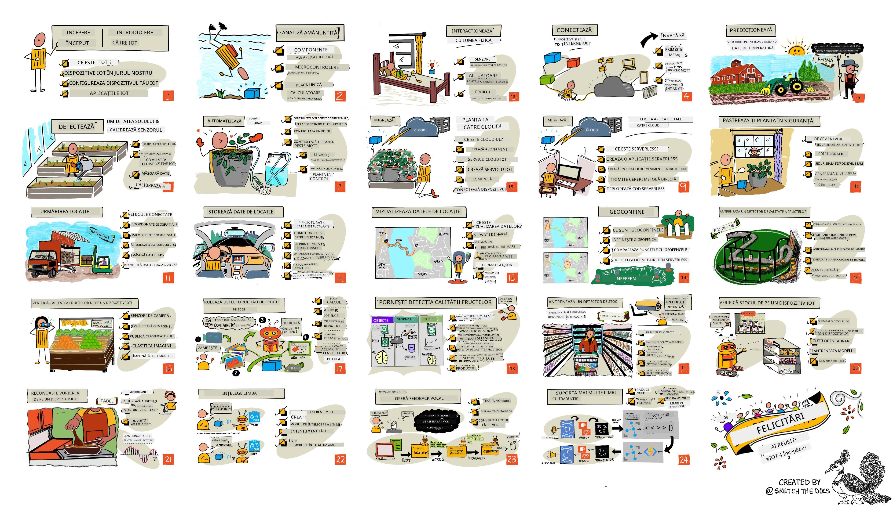

<!--
CO_OP_TRANSLATOR_METADATA:
{
  "original_hash": "6c354ec3487e4f6cfafbe44557996cd9",
  "translation_date": "2026-01-06T15:43:13+00:00",
  "source_file": "README.md",
  "language_code": "ro"
}
-->
[](https://github.com/microsoft/IoT-For-Beginners/blob/master/LICENSE)
[](https://GitHub.com/microsoft/IoT-For-Beginners/graphs/contributors/)
[](https://GitHub.com/microsoft/IoT-For-Beginners/issues/)
[](https://GitHub.com/microsoft/IoT-For-Beginners/pulls/)
[](http://makeapullrequest.com)

[](https://GitHub.com/microsoft/IoT-For-Beginners/watchers/)
[](https://GitHub.com/microsoft/IoT-For-Beginners/network/)
[](https://GitHub.com/microsoft/IoT-For-Beginners/stargazers/)

### Alăturați-vă Comunității Azure AI Foundry

Dacă întâmpinați dificultăți sau aveți întrebări despre construirea aplicațiilor AI. Alăturați-vă altor cursanți și dezvoltatori experimentați în discuții despre MCP. Este o comunitate prietenoasă în care întrebările sunt binevenite și cunoștințele sunt împărtășite liber.

[](https://discord.gg/nTYy5BXMWG)

Dacă aveți feedback despre produs sau erori în timpul construirii, vizitați:

[](https://aka.ms/foundry/forum)

Urmați acești pași pentru a începe să folosiți aceste resurse:
1. **Faceți fork la Repository**: Click [](https://GitHub.com/microsoft/IoT-For-Beginners/fork)
2. **Clonați Repository-ul**:   `git clone https://github.com/microsoft/IoT-For-Beginners.git`
3. [**Alăturați-vă Microsot Foundry Discord și întâlniți experți și alți dezvoltatori**](https://discord.com/invite/ByRwuEEgH4)


### 🌐 Suport Multilingv

#### Suportat prin GitHub Action (Automatizat & Întotdeauna Actualizat)

<!-- CO-OP TRANSLATOR LANGUAGES TABLE START -->
[Arabic](../ar/README.md) | [Bengali](../bn/README.md) | [Bulgarian](../bg/README.md) | [Burmese (Myanmar)](../my/README.md) | [Chinese (Simplified)](../zh/README.md) | [Chinese (Traditional, Hong Kong)](../hk/README.md) | [Chinese (Traditional, Macau)](../mo/README.md) | [Chinese (Traditional, Taiwan)](../tw/README.md) | [Croatian](../hr/README.md) | [Czech](../cs/README.md) | [Danish](../da/README.md) | [Dutch](../nl/README.md) | [Estonian](../et/README.md) | [Finnish](../fi/README.md) | [French](../fr/README.md) | [German](../de/README.md) | [Greek](../el/README.md) | [Hebrew](../he/README.md) | [Hindi](../hi/README.md) | [Hungarian](../hu/README.md) | [Indonesian](../id/README.md) | [Italian](../it/README.md) | [Japanese](../ja/README.md) | [Kannada](../kn/README.md) | [Korean](../ko/README.md) | [Lithuanian](../lt/README.md) | [Malay](../ms/README.md) | [Malayalam](../ml/README.md) | [Marathi](../mr/README.md) | [Nepali](../ne/README.md) | [Nigerian Pidgin](../pcm/README.md) | [Norwegian](../no/README.md) | [Persian (Farsi)](../fa/README.md) | [Polish](../pl/README.md) | [Portuguese (Brazil)](../br/README.md) | [Portuguese (Portugal)](../pt/README.md) | [Punjabi (Gurmukhi)](../pa/README.md) | [Romanian](./README.md) | [Russian](../ru/README.md) | [Serbian (Cyrillic)](../sr/README.md) | [Slovak](../sk/README.md) | [Slovenian](../sl/README.md) | [Spanish](../es/README.md) | [Swahili](../sw/README.md) | [Swedish](../sv/README.md) | [Tagalog (Filipino)](../tl/README.md) | [Tamil](../ta/README.md) | [Telugu](../te/README.md) | [Thai](../th/README.md) | [Turkish](../tr/README.md) | [Ukrainian](../uk/README.md) | [Urdu](../ur/README.md) | [Vietnamese](../vi/README.md)

> **Preferi să Clonezi Local?**

> Acest repository include peste 50 de traduceri de limbi, ceea ce crește semnificativ dimensiunea descărcării. Pentru a clona fără traduceri, folosește sparse checkout:
> ```bash
> git clone --filter=blob:none --sparse https://github.com/microsoft/IoT-For-Beginners.git
> cd IoT-For-Beginners
> git sparse-checkout set --no-cone '/*' '!translations' '!translated_images'
> ```
> Aceasta îți oferă tot ce ai nevoie pentru a finaliza cursul cu o descărcare mult mai rapidă.
<!-- CO-OP TRANSLATOR LANGUAGES TABLE END -->

# IoT pentru Începători - Un Curriculum

Advocații Azure Cloud de la Microsoft sunt încântați să ofere un curriculum de 12 săptămâni, 24 de lecții, despre bazele IoT. Fiecare lecție include chestionare înainte și după lecție, instrucțiuni scrise pentru finalizarea lecției, o soluție, o sarcină și multe altele. Pedagogia noastră bazată pe proiect permite să înveți în timp ce construiești, o metodă dovedită pentru ca abilitățile noi să rămână.

Proiectele acoperă călătoria alimentului de la fermă la masă. Aceasta include agricultură, logistică, fabricație, retail și consumator - toate domenii populare pentru dispozitive IoT.



> Schiță realizată de [Nitya Narasimhan](https://github.com/nitya). Click pe imagine pentru o versiune mai mare.

**Mulțumiri călduroase autorilor noștri [Jen Fox](https://github.com/jenfoxbot), [Jen Looper](https://github.com/jlooper), [Jim Bennett](https://github.com/jimbobbennett) și artistului nostru de schițe [Nitya Narasimhan](https://github.com/nitya).**

**Mulțumiri, de asemenea, echipei noastre de [Ambasadori Studenți Microsoft Learn](https://studentambassadors.microsoft.com?WT.mc_id=academic-17441-jabenn) care au revizuit și tradus acest curriculum - [Aditya Garg](https://github.com/AdityaGarg00), [Anurag Sharma](https://github.com/Anurag-0-1-A), [Arpita Das](https://github.com/Arpiiitaaa), [Aryan Jain](https://www.linkedin.com/in/aryan-jain-47a4a1145/), [Bhavesh Suneja](https://github.com/EliteWarrior315), [Faith Hunja](https://faithhunja.github.io/), [Lateefah Bello](https://www.linkedin.com/in/lateefah-bello/), [Manvi Jha](https://github.com/Severus-Matthew), [Mireille Tan](https://www.linkedin.com/in/mireille-tan-a4834819a/), [Mohammad Iftekher (Iftu) Ebne Jalal](https://github.com/Iftu119), [Mohammad Zulfikar](https://github.com/mohzulfikar), [Priyanshu Srivastav](https://www.linkedin.com/in/priyanshu-srivastav-b067241ba), [Thanmai Gowducheruvu](https://github.com/innovation-platform), și [Zina Kamel](https://www.linkedin.com/in/zina-kamel/).**

Faceți cunoștință cu echipa!

[](https://youtu.be/-wippUJRi5k)

**Gif realizat de** [Mohit Jaisal](https://linkedin.com/in/mohitjaisal)

> 🎥 Click pe imaginea de mai sus pentru un videoclip despre proiect!

> **Profesori**, am [inclus câteva sugestii](for-teachers.md) despre cum să folosiți acest curriculum. Dacă doriți să creați propriile lecții, am inclus de asemenea un [șablon de lecție](lesson-template/README.md).

> **[Studenți](https://aka.ms/student-page)**, pentru a folosi acest curriculum pe cont propriu, faceți fork la întregul repo și finalizați exercițiile pe cont propriu, începând cu un chestionar pre-lectură, apoi citiți lecția și finalizați restul activităților. Încercați să creați proiectele înțelegând lecțiile, mai degrabă decât copierea codului soluției; totuși codul este disponibil în folderele /solutions din fiecare lecție orientată pe proiect. O altă idee ar fi să formați un grup de studiu cu prietenii și să parcurgeți conținutul împreună. Pentru o învățare suplimentară, recomandăm [Microsoft Learn](https://docs.microsoft.com/users/jimbobbennett/collections/ke2ehd351jopwr?WT.mc_id=academic-17441-jabenn).

Pentru o prezentare video a acestui curs, vizionați acest videoclip:

[](https://youtube.com/watch?v=bccEMm8gRuc "Promo video")

> 🎥 Click pe imaginea de mai sus pentru un videoclip despre proiect!

## Pedagogie

Am ales două principii pedagogice în construirea acestui curriculum: să fie bazat pe proiecte și să includă chestionare frecvente. La finalul acestei serii, studenții vor fi construit un sistem de monitorizare și udare a plantelor, un tracker de vehicule, o configurație de fabrică inteligentă pentru urmărirea și verificarea alimentelor și un cronometru de gătit controlat prin voce, și vor fi învățat bazele Internet of Things, inclusiv cum să scrie cod pentru dispozitive, să se conecteze la cloud, să analizeze telemetria și să ruleze AI la margine.

Prin asigurarea faptului că conținutul este aliniat cu proiectele, procesul devine mai captivant pentru studenți iar reținerea conceptelor va fi îmbunătățită.

În plus, un chestionar cu miză redusă înaintea unei ore setează intenția studentului spre învățarea unui subiect, în timp ce un al doilea chestionar după curs asigură o mai bună reținere. Acest curriculum a fost proiectat să fie flexibil și distractiv și poate fi parcurs integral sau parțial. Proiectele încep mici și devin din ce în ce mai complexe spre finalul ciclului de 12 săptămâni.

Fiecare proiect se bazează pe hardware real accesibil studenților și pasionaților. Fiecare proiect analizează domeniul specific, oferind cunoștințe de fundal relevante. Pentru a fi un dezvoltator de succes, este util să înțelegi domeniul în care rezolvi probleme, oferind aceste cunoștințe de fundal permite studenților să gândească soluțiile IoT și învățăturile în contextul tipului de problemă reală pe care ar putea fi chemați să o rezolve ca dezvoltatori IoT. Studenții învață „de ce”-ul soluțiilor pe care le construiesc și obțin o apreciere a utilizatorului final.

## Hardware

Avem două opțiuni de hardware IoT pentru a folosi în proiecte, în funcție de preferințele personale, cunoștințele limbajului de programare, obiectivele de învățare și disponibilitate. Am oferit, de asemenea, o versiune de „hardware virtual” pentru cei care nu au acces la hardware sau doresc să învețe mai mult înainte de a achiziționa unul. Puteți citi mai multe și găsi o „listă de cumpărături” pe [pagina hardware](./hardware.md), inclusiv linkuri pentru a cumpăra kituri complete de la prietenii noștri de la Seeed Studio.
> 💁 Găsiți [Codul nostru de conduită](CODE_OF_CONDUCT.md), [Contribuții](CONTRIBUTING.md) și ghidurile de [Traducere](TRANSLATIONS.md). Apreciem feedback-ul dumneavoastră constructiv!
>
> 🔧 Aveți probleme? Consultați [Ghidul de depanare](TROUBLESHOOTING.md) pentru soluții la probleme comune.

## Fiecare lecție include:

- sketchnote
- videoclip suplimentar opțional
- quiz de încălzire înaintea lecției
- lecția scrisă
- pentru lecțiile bazate pe proiect, ghiduri pas cu pas pentru construirea proiectului
- verificări de cunoștințe
- o provocare
- lectură suplimentară
- temă
- [quiz post-lectie](https://ff-quizzes.netlify.app/en/)

> **O notă despre quiz-uri**: Toate quiz-urile sunt conținute în folderul quiz-app, pentru un total de 48 de quiz-uri cu câte trei întrebări fiecare. Ele sunt legate din interiorul lecțiilor, dar aplicația quiz poate fi rulată local sau poate fi implementată pe Azure; urmați instrucțiunile din folderul `quiz-app`. Ele sunt localizate treptat.

## Lecții

|       |              Numele Proiectului               |                       Concepte Predate                        | Obiective de Învățare                                                                                                                                               |                                                        Lecția Legată                                                         |
| :---: | :-------------------------------------------: | :------------------------------------------------------------: | ----------------------------------------------------------------------------------------------------------------------------------------------------------------- | :----------------------------------------------------------------------------------------------------------------------------: |
|  01   | [Începem](./1-getting-started/README.md)      |                     Introducere în IoT                         | Învățați principiile de bază ale IoT și elementele fundamentale ale soluțiilor IoT precum senzori și servicii cloud în timp ce configurați primul dispozitiv IoT   |                      [Introducere în IoT](./1-getting-started/lessons/1-introduction-to-iot/README.md)                         |
|  02   | [Începem](./1-getting-started/README.md)      |                   O privire mai adâncă asupra IoT              | Aflați mai multe despre componentele unui sistem IoT, precum microcontrolerele și computerele cu placă unică                                                      |                        [O privire mai adâncă asupra IoT](./1-getting-started/lessons/2-deeper-dive/README.md)                  |
|  03   | [Începem](./1-getting-started/README.md)      |    Interacțiunea cu lumea fizică prin senzori și actuatori    | Aflați despre senzori pentru colectarea datelor din lumea fizică și actuatori pentru a trimite feedback, în timp ce construiți o lampă de veghe                    | [Interacționați cu lumea fizică prin senzori și actuatori](./1-getting-started/lessons/3-sensors-and-actuators/README.md)    |
|  04   | [Începem](./1-getting-started/README.md)      |                Conectați dispozitivul la Internet              | Aflați cum să conectați un dispozitiv IoT la Internet pentru a trimite și a primi mesaje conectând lampa de veghe la un broker MQTT                               |                [Conectați dispozitivul la Internet](./1-getting-started/lessons/4-connect-internet/README.md)                 |
|  05   |            [Fermă](./2-farm/README.md)         |                    Preziceți creșterea plantei                 | Învățați cum să preziceți creșterea unei plante folosind date de temperatură capturate de un dispozitiv IoT                                                      |                          [Preziceți creșterea plantei](./2-farm/lessons/1-predict-plant-growth/README.md)                   |
|  06   |            [Fermă](./2-farm/README.md)         |                    Detectați umiditatea solului                | Aflați cum să detectați umiditatea solului și să calibrați un senzor de umiditate a solului                                                                        |                          [Detectați umiditatea solului](./2-farm/lessons/2-detect-soil-moisture/README.md)                   |
|  07   |            [Fermă](./2-farm/README.md)         |                 Udarea automată a plantelor                    | Aflați cum să automatizați și să programați udarea folosind un releu și MQTT                                                                                       |                     [Udarea automată a plantelor](./2-farm/lessons/3-automated-plant-watering/README.md)                      |
|  08   |            [Fermă](./2-farm/README.md)         |                Migrați planta în cloud                          | Aflați despre cloud și serviciile IoT găzduite în cloud și cum să conectați planta la unul dintre acestea în loc de un broker MQTT public                         |               [Migrați planta în cloud](./2-farm/lessons/4-migrate-your-plant-to-the-cloud/README.md)                         |
|  09   |            [Fermă](./2-farm/README.md)         |         Migrați logica aplicației în cloud                      | Aflați cum puteți scrie logica aplicației în cloud care răspunde la mesaje IoT                                                                                    |        [Migrați logica aplicației în cloud](./2-farm/lessons/5-migrate-application-to-the-cloud/README.md)                   |
|  10   |            [Fermă](./2-farm/README.md)         |                   Asigurați-vă planta                           | Aflați despre securitatea în IoT și cum să vă asigurați planta cu chei și certificate                                                                             |                        [Asigurați-vă planta](./2-farm/lessons/6-keep-your-plant-secure/README.md)                            |
|  11   |       [Transport](./3-transport/README.md)     |                      Monitorizare locație                         | Aflați despre monitorizarea locației prin GPS pentru dispozitive IoT                                                                                              |                           [Monitorizare locație](./3-transport/lessons/1-location-tracking/README.md)                         |
|  12   |       [Transport](./3-transport/README.md)     |                     Stocare date de locație                     | Aflați cum să stocați date IoT pentru a fi vizualizate sau analizate mai târziu                                                                                    |                         [Stocare date de locație](./3-transport/lessons/2-store-location-data/README.md)                      |
|  13   |       [Transport](./3-transport/README.md)     |                   Vizualizarea datelor de locație               | Aflați despre vizualizarea datelor de locație pe o hartă și despre cum hărțile reprezintă lumea reală 3D în 2 dimensiuni                                          |                     [Vizualizarea datelor de locație](./3-transport/lessons/3-visualize-location-data/README.md)              |
|  14   |       [Transport](./3-transport/README.md)     |                          Geofence-uri                           | Aflați despre geofence-uri și cum pot fi folosite pentru a alerta când vehiculele din lanțul de aprovizionare se apropie de destinația lor                       |                                  [Geofence-uri](./3-transport/lessons/4-geofences/README.md)                                  |
|  15   |   [Producție](./4-manufacturing/README.md)      |               Antrenați un detector de calitate a fructelor    | Aflați cum să antrenați un clasificator de imagini în cloud pentru detectarea calității fructelor                                                                 |                [Antrenați un detector de calitate a fructelor](./4-manufacturing/lessons/1-train-fruit-detector/README.md)   |
|  16   |   [Producție](./4-manufacturing/README.md)      |         Verificați calitatea fructelor cu un dispozitiv IoT    | Aflați cum să folosiți detectorul de calitate a fructelor de pe un dispozitiv IoT                                                                                 |         [Verificați calitatea fructelor cu un dispozitiv IoT](./4-manufacturing/lessons/2-check-fruit-from-device/README.md) |
|  17   |   [Producție](./4-manufacturing/README.md)      |             Rulați detectorul de fructe la margine              | Aflați despre rularea detectorului de fructe pe un dispozitiv IoT la margine                                                                                      |             [Rulați detectorul de fructe la margine](./4-manufacturing/lessons/3-run-fruit-detector-edge/README.md)         |
|  18   |   [Producție](./4-manufacturing/README.md)      |        Declanșați detectarea calității fructelor de la un senzor | Aflați despre declanșarea detectării calității fructelor de la un senzor                                                                                          |         [Declanșați detectarea calității fructelor de la un senzor](./4-manufacturing/lessons/4-trigger-fruit-detector/README.md) |
|  19   |          [Retail](./5-retail/README.md)          |                   Antrenați un detector de stoc                  | Aflați cum să folosiți detectarea obiectelor pentru a antrena un detector de stoc pentru numărarea stocurilor într-un magazin                                   |                        [Antrenați un detector de stoc](./5-retail/lessons/1-train-stock-detector/README.md)                  |
|  20   |          [Retail](./5-retail/README.md)          |               Verificați stocul cu un dispozitiv IoT             | Aflați cum să verificați stocul de pe un dispozitiv IoT folosind un model de detectare a obiectelor                                                               |                    [Verificați stocul cu un dispozitiv IoT](./5-retail/lessons/2-check-stock-device/README.md)              |
|  21   |        [Consumator](./6-consumer/README.md)      |             Recunoașteți vorbirea cu un dispozitiv IoT           | Aflați cum să recunoașteți vorbirea de la un dispozitiv IoT pentru a construi un cronometru inteligent                                                           |                  [Recunoașteți vorbirea cu un dispozitiv IoT](./6-consumer/lessons/1-speech-recognition/README.md)            |
|  22   |        [Consumator](./6-consumer/README.md)      |                     Înțelegeți limbajul                           | Aflați cum să înțelegeți propozițiile rostite către un dispozitiv IoT                                                                                             |                        [Înțelegeți limbajul](./6-consumer/lessons/2-language-understanding/README.md)                        |
|  23   |        [Consumator](./6-consumer/README.md)      |           Setarea unui cronometru și feedback vocal              | Aflați cum să setați un cronometru pe un dispozitiv IoT și să oferiți feedback vocal despre când cronometrul este setat și când se încheie                      |                 [Setați un cronometru și oferiți feedback vocal](./6-consumer/lessons/3-spoken-feedback/README.md)            |
|  24   |        [Consumator](./6-consumer/README.md)      |                 Suport pentru multiple limbi                      | Aflați cum să suportați mai multe limbi, atât cele rostite către dispozitiv, cât și răspunsurile de la cronometru                                                |                   [Suport pentru multiple limbi](./6-consumer/lessons/4-multiple-language-support/README.md)                |

## Acces offline

Puteți rula această documentație offline folosind [Docsify](https://docsify.js.org/#/). Dați fork acestui repo, [instalați Docsify](https://docsify.js.org/#/quickstart) pe calculatorul local și apoi în folderul rădăcină al acestui repo tastați `docsify serve`. Site-ul va fi servit pe portul 3000 pe localhost: `localhost:3000`.

## Quiz

Mulțumim comunității pentru găzduirea quiz-ului interactiv care testează cunoștințele dumneavoastră pentru fiecare capitol. Vă puteți testa cunoștințele [aici](https://ff-quizzes.netlify.app/en/)

### PDF

Puteți genera un PDF cu acest conținut pentru acces offline dacă este necesar. Pentru a face acest lucru, asigurați-vă că aveți [npm instalat](https://docs.npmjs.com/downloading-and-installing-node-js-and-npm) și rulați următoarele comenzi în folderul rădăcină al acestui repo:

```sh
npm i
npm run convert
```

### Diaporame

Există diaporame pentru unele dintre lecții în folderul [slides](../../slides).


## Alte curriculumuri

Echipa noastră produce și alte curriculumuri! Consultați:

<!-- CO-OP TRANSLATOR OTHER COURSES START -->
### LangChain
[](https://aka.ms/langchain4j-for-beginners)
[](https://aka.ms/langchainjs-for-beginners?WT.mc_id=m365-94501-dwahlin)

---

### Azure / Edge / MCP / Agenți
[](https://github.com/microsoft/AZD-for-beginners?WT.mc_id=academic-105485-koreyst)
[](https://github.com/microsoft/edgeai-for-beginners?WT.mc_id=academic-105485-koreyst)
[](https://github.com/microsoft/mcp-for-beginners?WT.mc_id=academic-105485-koreyst)
[](https://github.com/microsoft/ai-agents-for-beginners?WT.mc_id=academic-105485-koreyst)

---
 
### Seria AI Generativ
[](https://github.com/microsoft/generative-ai-for-beginners?WT.mc_id=academic-105485-koreyst)
[-9333EA?style=for-the-badge&labelColor=E5E7EB&color=9333EA)](https://github.com/microsoft/Generative-AI-for-beginners-dotnet?WT.mc_id=academic-105485-koreyst)
[-C084FC?style=for-the-badge&labelColor=E5E7EB&color=C084FC)](https://github.com/microsoft/generative-ai-for-beginners-java?WT.mc_id=academic-105485-koreyst)
[-E879F9?style=for-the-badge&labelColor=E5E7EB&color=E879F9)](https://github.com/microsoft/generative-ai-with-javascript?WT.mc_id=academic-105485-koreyst)

---
 
### Învațare de bază
[](https://aka.ms/ml-beginners?WT.mc_id=academic-105485-koreyst)
[](https://aka.ms/datascience-beginners?WT.mc_id=academic-105485-koreyst)
[](https://aka.ms/ai-beginners?WT.mc_id=academic-105485-koreyst)
[](https://github.com/microsoft/Security-101?WT.mc_id=academic-96948-sayoung)
[](https://aka.ms/webdev-beginners?WT.mc_id=academic-105485-koreyst)
[](https://aka.ms/iot-beginners?WT.mc_id=academic-105485-koreyst)
[](https://github.com/microsoft/xr-development-for-beginners?WT.mc_id=academic-105485-koreyst)

---
 
### Seria Copilot
[](https://aka.ms/GitHubCopilotAI?WT.mc_id=academic-105485-koreyst)
[](https://github.com/microsoft/mastering-github-copilot-for-dotnet-csharp-developers?WT.mc_id=academic-105485-koreyst)
[](https://github.com/microsoft/CopilotAdventures?WT.mc_id=academic-105485-koreyst)
<!-- CO-OP TRANSLATOR OTHER COURSES END -->

## Atribuții imagini

Puteți găsi toate atribuțiile pentru imaginile utilizate în acest curriculum, acolo unde este necesar, în fișierul [Attributions](./attributions.md).

---

<!-- CO-OP TRANSLATOR DISCLAIMER START -->
**Declinarea responsabilității**:
Acest document a fost tradus folosind serviciul de traducere automată AI [Co-op Translator](https://github.com/Azure/co-op-translator). Deși ne străduim pentru acuratețe, vă rugăm să rețineți că traducerile realizate automat pot conține erori sau inexactități. Documentul original în limba sa nativă trebuie considerat sursa autoritară. Pentru informații critice, se recomandă traducerea profesională realizată de un specialist uman. Nu ne asumăm nicio responsabilitate pentru eventualele neînțelegeri sau interpretări greșite rezultate din utilizarea acestei traduceri.
<!-- CO-OP TRANSLATOR DISCLAIMER END -->