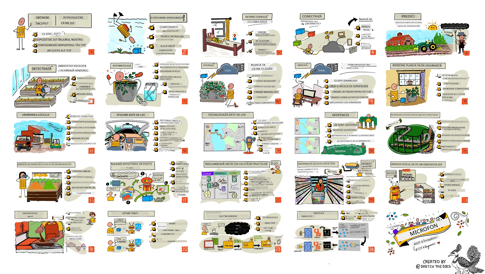

[](https://github.com/microsoft/IoT-For-Beginners/blob/master/LICENSE)
[](https://GitHub.com/microsoft/IoT-For-Beginners/graphs/contributors/)
[](https://GitHub.com/microsoft/IoT-For-Beginners/issues/)
[](https://GitHub.com/microsoft/IoT-For-Beginners/pulls/)
[](http://makeapullrequest.com)

[](https://GitHub.com/microsoft/IoT-For-Beginners/watchers/)
[](https://GitHub.com/microsoft/IoT-For-Beginners/network/)
[](https://GitHub.com/microsoft/IoT-For-Beginners/stargazers/)

### Alăturați-vă Comunității Azure AI Foundry

Dacă întâmpinați dificultăți sau aveți întrebări despre construirea aplicațiilor AI. Alăturați-vă altor cursanți și dezvoltatori experimentați în discuțiile despre MCP. Este o comunitate suportivă unde întrebările sunt binevenite și cunoștințele sunt împărtășite liber.

[](https://discord.gg/nTYy5BXMWG)

Dacă aveți feedback despre produs sau erori în timpul construirii, vizitați:

[](https://aka.ms/foundry/forum)

Urmăriți acești pași pentru a începe să folosiți aceste resurse:
1. **Fork UI Repozitorului**: Click [](https://GitHub.com/microsoft/IoT-For-Beginners/fork)
2. **Clonați Repozitorul**:   `git clone https://github.com/microsoft/IoT-For-Beginners.git`
3. [**Alăturați-vă Discord Microsoft Foundry și întâlniți experți și alți dezvoltatori**](https://discord.com/invite/ByRwuEEgH4)


### 🌐 Suport Multilingv

#### Suportat prin GitHub Action (Automat și Întotdeauna Actualizat)

<!-- CO-OP TRANSLATOR LANGUAGES TABLE START -->
[Arabic](../ar/README.md) | [Bengali](../bn/README.md) | [Bulgarian](../bg/README.md) | [Burmese (Myanmar)](../my/README.md) | [Chinese (Simplified)](../zh-CN/README.md) | [Chinese (Traditional, Hong Kong)](../zh-HK/README.md) | [Chinese (Traditional, Macau)](../zh-MO/README.md) | [Chinese (Traditional, Taiwan)](../zh-TW/README.md) | [Croatian](../hr/README.md) | [Czech](../cs/README.md) | [Danish](../da/README.md) | [Dutch](../nl/README.md) | [Estonian](../et/README.md) | [Finnish](../fi/README.md) | [French](../fr/README.md) | [German](../de/README.md) | [Greek](../el/README.md) | [Hebrew](../he/README.md) | [Hindi](../hi/README.md) | [Hungarian](../hu/README.md) | [Indonesian](../id/README.md) | [Italian](../it/README.md) | [Japanese](../ja/README.md) | [Kannada](../kn/README.md) | [Khmer](../km/README.md) | [Korean](../ko/README.md) | [Lithuanian](../lt/README.md) | [Malay](../ms/README.md) | [Malayalam](../ml/README.md) | [Marathi](../mr/README.md) | [Nepali](../ne/README.md) | [Nigerian Pidgin](../pcm/README.md) | [Norwegian](../no/README.md) | [Persian (Farsi)](../fa/README.md) | [Polish](../pl/README.md) | [Portuguese (Brazil)](../pt-BR/README.md) | [Portuguese (Portugal)](../pt-PT/README.md) | [Punjabi (Gurmukhi)](../pa/README.md) | [Romanian](./README.md) | [Russian](../ru/README.md) | [Serbian (Cyrillic)](../sr/README.md) | [Slovak](../sk/README.md) | [Slovenian](../sl/README.md) | [Spanish](../es/README.md) | [Swahili](../sw/README.md) | [Swedish](../sv/README.md) | [Tagalog (Filipino)](../tl/README.md) | [Tamil](../ta/README.md) | [Telugu](../te/README.md) | [Thai](../th/README.md) | [Turkish](../tr/README.md) | [Ukrainian](../uk/README.md) | [Urdu](../ur/README.md) | [Vietnamese](../vi/README.md)

> **Preferi să clonezi local?**
>
> Acest depozit include peste 50 de traduceri care cresc semnificativ dimensiunea descărcării. Pentru a clona fără traduceri, folosește sparse checkout:
>
> **Bash / macOS / Linux:**
> ```bash
> git clone --filter=blob:none --sparse https://github.com/microsoft/IoT-For-Beginners.git
> cd IoT-For-Beginners
> git sparse-checkout set --no-cone '/*' '!translations' '!translated_images'
> ```
>
> **CMD (Windows):**
> ```cmd
> git clone --filter=blob:none --sparse https://github.com/microsoft/IoT-For-Beginners.git
> cd IoT-For-Beginners
> git sparse-checkout set --no-cone "/*" "!translations" "!translated_images"
> ```
>
> Așa ai tot ce îți trebuie pentru a finaliza cursul cu o descărcare mult mai rapidă.
<!-- CO-OP TRANSLATOR LANGUAGES TABLE END -->

# IoT pentru Începători - Un Curriculum

Avocații Azure Cloud de la Microsoft sunt încântați să ofere un curriculum de 12 săptămâni, 24 de lecții, care tratează bazele IoT. Fiecare lecție include chestionare înainte și după lecție, instrucțiuni scrise pentru finalizarea lecției, o soluție, un temă și altele. Pedagogia noastră bazată pe proiecte vă permite să învățați în timp ce construiți, o metodă dovedită de a fixa noile competențe.

Proiectele acoperă călătoria alimentelor de la fermă la masă. Aceasta include agricultură, logistică, fabricație, retail și consumator - toate domenii populare pentru dispozitive IoT.



> Schiță de [Nitya Narasimhan](https://github.com/nitya). Faceți click pe imagine pentru o versiune mai mare.

**Mulțumiri călduroase autorilor noștri [Jen Fox](https://github.com/jenfoxbot), [Jen Looper](https://github.com/jlooper), [Jim Bennett](https://github.com/jimbobbennett), și artistului nostru de schițe [Nitya Narasimhan](https://github.com/nitya).**

**Mulțumim și echipei noastre de [Microsoft Learn Student Ambassadors](https://studentambassadors.microsoft.com?WT.mc_id=academic-17441-jabenn) care au revizuit și tradus acest curriculum - [Aditya Garg](https://github.com/AdityaGarg00), [Anurag Sharma](https://github.com/Anurag-0-1-A), [Arpita Das](https://github.com/Arpiiitaaa), [Aryan Jain](https://www.linkedin.com/in/aryan-jain-47a4a1145/), [Bhavesh Suneja](https://github.com/EliteWarrior315), [Faith Hunja](https://faithhunja.github.io/), [Lateefah Bello](https://www.linkedin.com/in/lateefah-bello/), [Manvi Jha](https://github.com/Severus-Matthew), [Mireille Tan](https://www.linkedin.com/in/mireille-tan-a4834819a/), [Mohammad Iftekher (Iftu) Ebne Jalal](https://github.com/Iftu119), [Mohammad Zulfikar](https://github.com/mohzulfikar), [Priyanshu Srivastav](https://www.linkedin.com/in/priyanshu-srivastav-b067241ba), [Thanmai Gowducheruvu](https://github.com/innovation-platform), și [Zina Kamel](https://www.linkedin.com/in/zina-kamel/).**

Cunoașteți echipa!

[](https://youtu.be/-wippUJRi5k)

**Gif de** [Mohit Jaisal](https://linkedin.com/in/mohitjaisal)

> 🎥 Faceți click pe imaginea de mai sus pentru un video despre proiect!

> **Profesori**, am inclus [câteva sugestii](for-teachers.md) despre cum să utilizați acest curriculum. Dacă doriți să creați propriile lecții, am inclus și un [șablon de lecție](lesson-template/README.md).

> **[Studenți](https://aka.ms/student-page)**, pentru a folosi acest curriculum pe cont propriu, faceți fork la întregul repo și finalizați exercițiile singuri, începând cu un chestionar pre-lectură, apoi citind lecția și finalizând restul activităților. Încercați să creați proiectele înțelegând lecțiile, nu doar copind codul soluției; totuși codul este disponibil în folderele /solutions din fiecare lecție orientată pe proiect. O altă idee ar fi să formați un grup de studiu cu prietenii și să parcurgeți conținutul împreună. Pentru studiu suplimentar, recomandăm [Microsoft Learn](https://docs.microsoft.com/users/jimbobbennett/collections/ke2ehd351jopwr?WT.mc_id=academic-17441-jabenn).

Pentru o prezentare video a acestui curs, urmăriți acest video:

[](https://youtube.com/watch?v=bccEMm8gRuc "Video promoțional")

> 🎥 Faceți click pe imaginea de mai sus pentru un video despre proiect!

## Pedagogie

Am ales două principii pedagogice în construirea acestui curriculum: asigurarea faptului că este bazat pe proiecte și că include chestionare frecvente. La finalul acestei serii, studenții vor fi construit un sistem de monitorizare și udare a plantelor, un tracker de vehicule, o configurație pentru fabrică inteligentă pentru a urmări și verifica alimentele, un cronometru de gătit controlat vocal, și vor fi învățat bazele Internetului Lucrurilor, inclusiv cum să scrie cod pentru dispozitive, să se conecteze la cloud, să analizeze telemetria și să ruleze AI la margine.

Asigurând alinierea conținutului cu proiectele, procesul devine mai atractiv pentru studenți și reținerea conceptelor este îmbunătățită.

În plus, un chestionar cu miză scăzută înainte de clasă stabilește intenția studentului spre învățarea unui subiect, în timp ce un al doilea chestionar după clasă asigură o retenție suplimentară. Acest curriculum a fost conceput să fie flexibil și distractiv și poate fi urmat integral sau parțial. Proiectele încep mici și devin din ce în ce mai complexe până la sfârșitul ciclului de 12 săptămâni.

Fiecare proiect se bazează pe hardware real disponibil studenților și pasionaților. Fiecare proiect analizează domeniul specific al proiectului, oferind cunoștințe de fond relevante. Pentru a fi un dezvoltator de succes, ajută să înțelegi domeniul în care rezolvi probleme, oferind aceste cunoștințe de fond permite studenților să gândească despre soluțiile IoT și învățăturile lor în contextul tipului de problemă reală pe care ar putea fi rugați să o rezolve ca dezvoltatori IoT. Studenții învață „de ce”-ul soluțiilor pe care le construiesc și capătă o apreciere pentru utilizatorul final.

## Hardware
Avem două opțiuni de hardware IoT pentru a folosi în proiecte, în funcție de preferințele personale, cunoștințele sau preferințele legate de limbajul de programare, obiectivele de învățare și disponibilitate. De asemenea, am oferit o versiune de „hardware virtual” pentru cei care nu au acces la hardware sau doresc să învețe mai mult înainte de a face o achiziție. Puteți citi mai multe și găsi o „listă de cumpărături” pe [pagina de hardware](./hardware.md), inclusiv linkuri pentru a cumpăra kituri complete de la prietenii noștri de la Seeed Studio.

> 💁 Găsiți [Codul nostru de conduită](CODE_OF_CONDUCT.md), [Ghidul de contribuție](CONTRIBUTING.md) și [Ghidul de traduceri](..). Vă așteptăm cu feedback constructiv!
>
> 🔧 Aveți probleme? Consultați [Ghidul de depanare](TROUBLESHOOTING.md) pentru soluții la probleme comune.

## Fiecare lecție include:

- schița lecției (sketchnote)
- video suplimentar opțional
- quiz de încălzire înainte de lecție
- lecția scrisă
- pentru lecțiile bazate pe proiecte, ghiduri pas cu pas pentru construirea proiectului
- verificări de cunoștințe
- o provocare
- lecturi suplimentare
- temă
- [quiz după lecție](https://ff-quizzes.netlify.app/en/)

> **O notă despre quizuri**: Toate quizurile sunt conținute în dosarul quiz-app, pentru 48 de quizuri în total, fiecare cu trei întrebări. Ele sunt legate din lecții, dar aplicația de quiz poate fi rulată local sau implementată în Azure; urmați instrucțiunile din dosarul `quiz-app`. Sunt treptat localizate.

## Lecții

|       |              Numele Proiectului              |                       Concepte Predate                       | Obiective de Învățare                                                                                                                                                 |                                                        Lecția Legată                                                         |
| :---: | :------------------------------------: | :---------------------------------------------------------: | ------------------------------------------------------------------------------------------------------------------------------------------------------------------- | :--------------------------------------------------------------------------------------------------------------------------: |
|  01   | [Începutul](./1-getting-started/README.md) |                     Introducere în IoT                     | Învață principiile de bază ale IoT și componentele fundamentale ale soluțiilor IoT, cum ar fi senzori și servicii cloud, în timp ce configurezi primul tău dispozitiv IoT |                      [Introducere în IoT](./1-getting-started/lessons/1-introduction-to-iot/README.md)                      |
|  02   | [Începutul](./1-getting-started/README.md) |                   O privire mai profundă în IoT                    | Află mai multe despre componentele unui sistem IoT, precum și despre microcontrolere și computere cu o singură placă                                                            |                        [O privire mai profundă în IoT](./1-getting-started/lessons/2-deeper-dive/README.md)                         |
|  03   | [Începutul](./1-getting-started/README.md) | Interacțiune cu lumea fizică folosind senzori și actuatori | Învață despre senzorii care adună date din lumea fizică și actuatorii care furnizează feedback, în timp ce construiești o veioză de noapte                                           | [Interacțiune cu lumea fizică folosind senzori și actuatori](./1-getting-started/lessons/3-sensors-and-actuators/README.md) |
|  04   | [Începutul](./1-getting-started/README.md) |             Conectează dispozitivul la Internet             | Învață cum să conectezi un dispozitiv IoT la Internet pentru a trimite și primi mesaje prin conectarea veiozei tale la un broker MQTT                               |               [Conectează dispozitivul la Internet](./1-getting-started/lessons/4-connect-internet/README.md)                |
|  05   |            [Fermă](./2-farm/README.md)            |                    Prezicerea creșterii plantelor                     | Învață cum să prevezi creșterea plantelor folosind datele de temperatură capturate de un dispozitiv IoT                                                                                  |                          [Prezicerea creșterii plantelor](./2-farm/lessons/1-predict-plant-growth/README.md)                           |
|  06   |            [Fermă](./2-farm/README.md)            |                    Detectarea umidității solului                     | Învață cum să detectezi umiditatea solului și să calibrezi un senzor de umiditate a solului                                                                                              |                          [Detectarea umidității solului](./2-farm/lessons/2-detect-soil-moisture/README.md)                           |
|  07   |            [Fermă](./2-farm/README.md)            |                  Udat automatizat al plantelor                   | Învață cum să automatizezi și să cronometrezi udarea folosind un releu și MQTT                                                                                                      |                      [Udat automatizat al plantelor](./2-farm/lessons/3-automated-plant-watering/README.md)                       |
|  08   |            [Fermă](./2-farm/README.md)            |               Migrează planta ta către cloud               | Învață despre cloud și serviciile IoT găzduite în cloud și cum să-ți conectezi planta la unul dintre acestea în loc de un broker MQTT public                                   |               [Migrează planta ta către cloud](./2-farm/lessons/4-migrate-your-plant-to-the-cloud/README.md)                |
|  09   |            [Fermă](./2-farm/README.md)            |         Migrează logica aplicației tale către cloud         | Învață cum poți scrie logica aplicației în cloud care răspunde la mesaje IoT                                                                          |         [Migrează logica aplicației tale către cloud](./2-farm/lessons/5-migrate-application-to-the-cloud/README.md)         |
|  10   |            [Fermă](./2-farm/README.md)            |                   Păstrează-ți planta în siguranță                    | Învață despre securitate în IoT și cum să-ți păstrezi planta în siguranță folosind chei și certificate                                                                          |                        [Păstrează-ți planta în siguranță](./2-farm/lessons/6-keep-your-plant-secure/README.md)                         |
|  11   |       [Transport](./3-transport/README.md)       |                      Urmărirea locației                      | Învață despre urmărirea locației GPS pentru dispozitive IoT                                                                                                                   |                           [Urmărirea locației](./3-transport/lessons/1-location-tracking/README.md)                           |
|  12   |       [Transport](./3-transport/README.md)       |                     Stocarea datelor de locație                     | Învață cum să stochezi date IoT pentru a fi vizualizate sau analizate ulterior                                                                                                      |                         [Stocarea datelor de locație](./3-transport/lessons/2-store-location-data/README.md)                         |
|  13   |       [Transport](./3-transport/README.md)       |                   Vizualizarea datelor de locație                   | Învață despre vizualizarea datelor de locație pe o hartă și modul în care hărțile reprezintă lumea reală 3D în două dimensiuni                                                            |                     [Vizualizarea datelor de locație](./3-transport/lessons/3-visualize-location-data/README.md)                     |
|  14   |       [Transport](./3-transport/README.md)       |                          Geofence-uri                          | Învață despre geofence-uri și cum pot fi folosite pentru a alerta când vehiculele din lanțul de aprovizionare sunt aproape de destinația lor                                           |                                   [Geofence-uri](./3-transport/lessons/4-geofences/README.md)                                   |
|  15   |   [Producție](./4-manufacturing/README.md)   |               Antrenează un detector de calitate a fructelor                | Învață despre antrenarea unui clasificator de imagini în cloud pentru a detecta calitatea fructelor                                                                                       |                 [Antrenează un detector de calitate a fructelor](./4-manufacturing/lessons/1-train-fruit-detector/README.md)                 |
|  16   |   [Producție](./4-manufacturing/README.md)   |           Verifică calitatea fructelor de pe un dispozitiv IoT            | Învață despre utilizarea detectorului tău de calitate a fructelor de pe un dispozitiv IoT                                                                                                    |           [Verifică calitatea fructelor de pe un dispozitiv IoT](./4-manufacturing/lessons/2-check-fruit-from-device/README.md)            |
|  17   |   [Producție](./4-manufacturing/README.md)   |             Rulează detectorul de fructe pe edge             | Învață despre rularea detectorului de fructe pe un dispozitiv IoT pe edge                                                                                                |             [Rulează detectorul de fructe pe edge](./4-manufacturing/lessons/3-run-fruit-detector-edge/README.md)             |
|  18   |   [Producție](./4-manufacturing/README.md)   |        Pornește detectarea calității fructului de la un senzor        | Învață despre declanșarea detectării calității fructelor de la un senzor                                                                                                        |        [Pornește detectarea calității fructului de la un senzor](./4-manufacturing/lessons/4-trigger-fruit-detector/README.md)         |
|  19   |          [Retail](./5-retail/README.md)          |                   Antrenează un detector de stoc                    | Învață cum să folosești detectarea obiectelor pentru a antrena un detector de stoc pentru numărarea stocului într-un magazin                                                                                |                        [Antrenează un detector de stoc](./5-retail/lessons/1-train-stock-detector/README.md)                         |
|  20   |          [Retail](./5-retail/README.md)          |               Verifică stocul de pe un dispozitiv IoT                | Învață cum să verifici stocul de pe un dispozitiv IoT folosind un model de detectare a obiectelor                                                                                         |                     [Verifică stocul de pe un dispozitiv IoT](./5-retail/lessons/2-check-stock-device/README.md)                      |
|  21   |        [Consumator](./6-consumer/README.md)        |             Recunoaște vorbirea cu un dispozitiv IoT             | Învață cum să recunoști vorbirea de pe un dispozitiv IoT pentru a construi un cronometru inteligent                                                                                             |                  [Recunoaște vorbirea cu un dispozitiv IoT](./6-consumer/lessons/1-speech-recognition/README.md)                  |
|  22   |        [Consumator](./6-consumer/README.md)        |                     Înțelege limbajul                     | Învață cum să înțelegi propozițiile rostite către un dispozitiv IoT                                                                                                           |                        [Înțelege limbajul](./6-consumer/lessons/2-language-understanding/README.md)                        |
|  23   |        [Consumator](./6-consumer/README.md)        |           Setează un cronometru și oferă feedback vocal           | Învață cum să setezi un cronometru pe un dispozitiv IoT și să oferi feedback vocal despre când este setat cronometrul și când se termină                                                    |                 [Setează un cronometru și oferă feedback vocal](./6-consumer/lessons/3-spoken-feedback/README.md)                  |
|  24   |        [Consumator](./6-consumer/README.md)        |                 Suport pentru mai multe limbi                  | Învață cum să susții mai multe limbi, atât în vorbire cât și în răspunsurile cronometrului tău inteligent                                                               |                   [Suport pentru mai multe limbi](./6-consumer/lessons/4-multiple-language-support/README.md)                   |

## Acces offline

Poți rula această documentație offline folosind [Docsify](https://docsify.js.org/#/). Fă un fork acestui repo, [instalează Docsify](https://docsify.js.org/#/quickstart) pe mașina ta locală, apoi în folderul rădăcină al acestui repo, tastează `docsify serve`. Site-ul va fi servit pe portul 3000 pe localhost-ul tău: `localhost:3000`.

## Quiz

Mulțumim comunității pentru găzduirea quizului interactiv care îți testează cunoștințele pentru fiecare capitol. Îți poți testa cunoștințele [aici](https://ff-quizzes.netlify.app/en/)

### PDF

Poți genera un PDF al acestui conținut pentru acces offline, dacă este nevoie. Pentru a face acest lucru, asigură-te că ai [npm instalat](https://docs.npmjs.com/downloading-and-installing-node-js-and-npm) și rulează următoarele comenzi în folderul rădăcină al acestui repo:

```sh
npm i
npm run convert
```

### Slide-uri

Există prezentări pentru unele lecții în folderul [slides](../../slides).

## Alte programe educaționale

Echipa noastră produce și alte programe educaționale! Verifică:

<!-- CO-OP TRANSLATOR OTHER COURSES START -->
### LangChain
[](https://aka.ms/langchain4j-for-beginners)
[](https://aka.ms/langchainjs-for-beginners?WT.mc_id=m365-94501-dwahlin)
[](https://github.com/microsoft/langchain-for-beginners?WT.mc_id=m365-94501-dwahlin)
---

### Azure / Edge / MCP / Agenți
[](https://github.com/microsoft/AZD-for-beginners?WT.mc_id=academic-105485-koreyst)
[](https://github.com/microsoft/edgeai-for-beginners?WT.mc_id=academic-105485-koreyst)
[](https://github.com/microsoft/mcp-for-beginners?WT.mc_id=academic-105485-koreyst)
[](https://github.com/microsoft/ai-agents-for-beginners?WT.mc_id=academic-105485-koreyst)

---
 
### Seria AI Generativ
[](https://github.com/microsoft/generative-ai-for-beginners?WT.mc_id=academic-105485-koreyst)
[-9333EA?style=for-the-badge&labelColor=E5E7EB&color=9333EA)](https://github.com/microsoft/Generative-AI-for-beginners-dotnet?WT.mc_id=academic-105485-koreyst)
[-C084FC?style=for-the-badge&labelColor=E5E7EB&color=C084FC)](https://github.com/microsoft/generative-ai-for-beginners-java?WT.mc_id=academic-105485-koreyst)
[-E879F9?style=for-the-badge&labelColor=E5E7EB&color=E879F9)](https://github.com/microsoft/generative-ai-with-javascript?WT.mc_id=academic-105485-koreyst)

---
 
### Învățare de bază
[](https://aka.ms/ml-beginners?WT.mc_id=academic-105485-koreyst)
[](https://aka.ms/datascience-beginners?WT.mc_id=academic-105485-koreyst)
[](https://aka.ms/ai-beginners?WT.mc_id=academic-105485-koreyst)
[](https://github.com/microsoft/Security-101?WT.mc_id=academic-96948-sayoung)
[](https://aka.ms/webdev-beginners?WT.mc_id=academic-105485-koreyst)
[](https://aka.ms/iot-beginners?WT.mc_id=academic-105485-koreyst)
[](https://github.com/microsoft/xr-development-for-beginners?WT.mc_id=academic-105485-koreyst)

---
 
### Seria Copilot
[](https://aka.ms/GitHubCopilotAI?WT.mc_id=academic-105485-koreyst)
[](https://github.com/microsoft/mastering-github-copilot-for-dotnet-csharp-developers?WT.mc_id=academic-105485-koreyst)
[](https://github.com/microsoft/CopilotAdventures?WT.mc_id=academic-105485-koreyst)
<!-- CO-OP TRANSLATOR OTHER COURSES END -->

## Atribuțiile imaginilor

Puteți găsi toate atribuirile pentru imaginile folosite în acest curriculum unde este necesar în [Atribuții](./attributions.md).

---

<!-- CO-OP TRANSLATOR DISCLAIMER START -->
**Declinare de responsabilitate**:  
Acest document a fost tradus utilizând serviciul de traducere AI [Co-op Translator](https://github.com/Azure/co-op-translator). Deși ne străduim pentru acuratețe, vă rugăm să rețineți că traducerile automate pot conține erori sau inexactități. Documentul original în limba sa nativă trebuie considerat sursa autoritară. Pentru informații critice, se recomandă traducerea profesională realizată de un specialist uman. Nu ne asumăm responsabilitatea pentru niciun fel de neînțelegeri sau interpretări greșite rezultate din utilizarea acestei traduceri.
<!-- CO-OP TRANSLATOR DISCLAIMER END -->