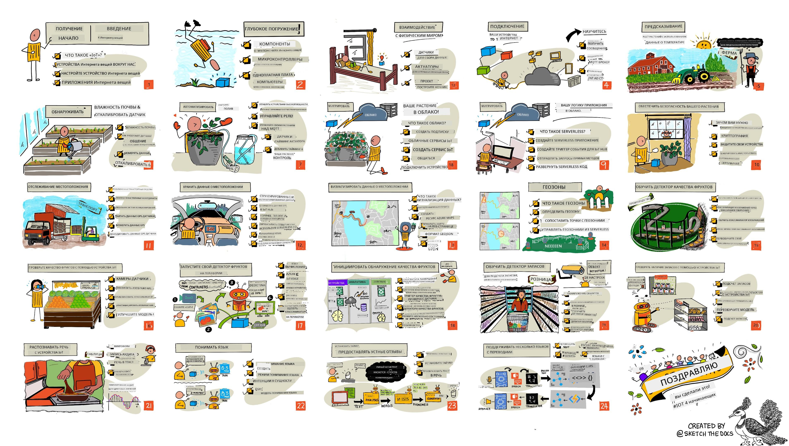

<!--
CO_OP_TRANSLATOR_METADATA:
{
  "original_hash": "6c354ec3487e4f6cfafbe44557996cd9",
  "translation_date": "2026-01-05T12:27:49+00:00",
  "source_file": "README.md",
  "language_code": "ru"
}
-->
[](https://github.com/microsoft/IoT-For-Beginners/blob/master/LICENSE)
[](https://GitHub.com/microsoft/IoT-For-Beginners/graphs/contributors/)
[](https://GitHub.com/microsoft/IoT-For-Beginners/issues/)
[](https://GitHub.com/microsoft/IoT-For-Beginners/pulls/)
[](http://makeapullrequest.com)

[](https://GitHub.com/microsoft/IoT-For-Beginners/watchers/)
[](https://GitHub.com/microsoft/IoT-For-Beginners/network/)
[](https://GitHub.com/microsoft/IoT-For-Beginners/stargazers/)

### Присоединяйтесь к сообществу Azure AI Foundry

Если вы застряли или у вас есть вопросы о создании AI-приложений, присоединяйтесь к другим ученикам и опытным разработчикам для обсуждения MCP. Это поддерживающее сообщество, где приветствуются вопросы и свободно делятся знаниями.

[](https://discord.gg/nTYy5BXMWG)

Если у вас есть отзывы о продукте или ошибки при создании, посетите:

[](https://aka.ms/foundry/forum)

Следуйте этим шагам, чтобы начать работу с этими ресурсами:
1. **Сделайте форк репозитория**: Нажмите [](https://GitHub.com/microsoft/IoT-For-Beginners/fork)
2. **Клонируйте репозиторий**:   `git clone https://github.com/microsoft/IoT-For-Beginners.git`
3. [**Присоединяйтесь к Microsot Foundry Discord, чтобы встретиться с экспертами и другими разработчиками**](https://discord.com/invite/ByRwuEEgH4)


### 🌐 Многоязычная поддержка

#### Поддерживается через GitHub Action (Автоматически и всегда актуально)

<!-- CO-OP TRANSLATOR LANGUAGES TABLE START -->
[Арабский](../ar/README.md) | [Бенгальский](../bn/README.md) | [Болгарский](../bg/README.md) | [Бирманский (Мьянма)](../my/README.md) | [Китайский (упрощенный)](../zh/README.md) | [Китайский (традиционный, Гонконг)](../hk/README.md) | [Китайский (традиционный, Макао)](../mo/README.md) | [Китайский (традиционный, Тайвань)](../tw/README.md) | [Хорватский](../hr/README.md) | [Чешский](../cs/README.md) | [Датский](../da/README.md) | [Нидерландский](../nl/README.md) | [Эстонский](../et/README.md) | [Финский](../fi/README.md) | [Французский](../fr/README.md) | [Немецкий](../de/README.md) | [Греческий](../el/README.md) | [Иврит](../he/README.md) | [Хинди](../hi/README.md) | [Венгерский](../hu/README.md) | [Индонезийский](../id/README.md) | [Итальянский](../it/README.md) | [Японский](../ja/README.md) | [Каннада](../kn/README.md) | [Корейский](../ko/README.md) | [Литовский](../lt/README.md) | [Малайский](../ms/README.md) | [Малаялам](../ml/README.md) | [Маратхи](../mr/README.md) | [Непальский](../ne/README.md) | [Нигерийский пиджин](../pcm/README.md) | [Норвежский](../no/README.md) | [Персидский (фарси)](../fa/README.md) | [Польский](../pl/README.md) | [Португальский (Бразилия)](../br/README.md) | [Португальский (Португалия)](../pt/README.md) | [Панджаби (гурмухи)](../pa/README.md) | [Румынский](../ro/README.md) | [Русский](./README.md) | [Сербский (кириллица)](../sr/README.md) | [Словацкий](../sk/README.md) | [Словенский](../sl/README.md) | [Испанский](../es/README.md) | [Суахили](../sw/README.md) | [Шведский](../sv/README.md) | [Тагалог (филиппинский)](../tl/README.md) | [Тамильский](../ta/README.md) | [Телугу](../te/README.md) | [Тайский](../th/README.md) | [Турецкий](../tr/README.md) | [Украинский](../uk/README.md) | [Урду](../ur/README.md) | [Вьетнамский](../vi/README.md)

> **Предпочитаете клонировать локально?**

> Этот репозиторий включает более 50 переводов, что значительно увеличивает размер загрузки. Чтобы клонировать без переводов, используйте sparse checkout:
> ```bash
> git clone --filter=blob:none --sparse https://github.com/microsoft/IoT-For-Beginners.git
> cd IoT-For-Beginners
> git sparse-checkout set --no-cone '/*' '!translations' '!translated_images'
> ```
> Это даст вам всё необходимое для прохождения курса при гораздо более быстрой загрузке.
<!-- CO-OP TRANSLATOR LANGUAGES TABLE END -->

# IoT для начинающих - Учебная программа

Адвокаты Azure Cloud в Microsoft рады предложить 12-недельную учебную программу из 24 уроков, посвящённых основам Интернета вещей. Каждый урок включает предварительные и итоговые тесты, письменные инструкции для выполнения урока, решение, задание и многое другое. Наша проектно-ориентированная педагогика позволяет вам учиться, создавая — проверенный способ закрепления новых навыков.

Проекты охватывают путь пищи от фермы до стола. Это включает сельское хозяйство, логистику, производство, розничную торговлю и потребителей — все популярные отрасли для устройств IoT.



> Скечнот от [Nitya Narasimhan](https://github.com/nitya). Нажмите на изображение для увеличенного варианта.

**Огромное спасибо нашим авторам [Jen Fox](https://github.com/jenfoxbot), [Jen Looper](https://github.com/jlooper), [Jim Bennett](https://github.com/jimbobbennett) и нашему художнику скечнотов [Nitya Narasimhan](https://github.com/nitya).**

**Также благодарим команду [Microsoft Learn Student Ambassadors](https://studentambassadors.microsoft.com?WT.mc_id=academic-17441-jabenn), которая рецензировала и переводила эту учебную программу — [Aditya Garg](https://github.com/AdityaGarg00), [Anurag Sharma](https://github.com/Anurag-0-1-A), [Arpita Das](https://github.com/Arpiiitaaa), [Aryan Jain](https://www.linkedin.com/in/aryan-jain-47a4a1145/), [Bhavesh Suneja](https://github.com/EliteWarrior315), [Faith Hunja](https://faithhunja.github.io/), [Lateefah Bello](https://www.linkedin.com/in/lateefah-bello/), [Manvi Jha](https://github.com/Severus-Matthew), [Mireille Tan](https://www.linkedin.com/in/mireille-tan-a4834819a/), [Mohammad Iftekher (Iftu) Ebne Jalal](https://github.com/Iftu119), [Mohammad Zulfikar](https://github.com/mohzulfikar), [Priyanshu Srivastav](https://www.linkedin.com/in/priyanshu-srivastav-b067241ba), [Thanmai Gowducheruvu](https://github.com/innovation-platform) и [Zina Kamel](https://www.linkedin.com/in/zina-kamel/).**

Познакомьтесь с командой!

[](https://youtu.be/-wippUJRi5k)

**Gif от** [Mohit Jaisal](https://linkedin.com/in/mohitjaisal)

> 🎥 Нажмите на изображение выше для просмотра видео о проекте!

> **Учителя**, мы включили [некоторые предложения](for-teachers.md) по использованию этой учебной программы. Если вы хотите создавать свои собственные уроки, у нас также есть [шаблон урока](lesson-template/README.md).

> **Студенты** ([https://aka.ms/student-page](https://aka.ms/student-page)), чтобы использовать эту учебную программу самостоятельно, сделайте форк всего репозитория и выполняйте упражнения по порядку, начиная с предварительного теста, затем изучая лекцию и выполняя остальные задания. Старайтесь создавать проекты, понимая уроки, а не просто копируя код решений; однако он доступен в папках /solutions в каждом уроке, ориентированном на проекты. Другой вариант — сформировать учебную группу с друзьями и проходить материал вместе. Для дальнейшего изучения рекомендуем [Microsoft Learn](https://docs.microsoft.com/users/jimbobbennett/collections/ke2ehd351jopwr?WT.mc_id=academic-17441-jabenn).

Для видеопрезентации этого курса смотрите следующее видео:

[](https://youtube.com/watch?v=bccEMm8gRuc "Промо видео")

> 🎥 Нажмите на изображение выше для просмотра видео о проекте!

## Педагогика

При создании этой программы мы выбрали два педагогических принципа: проектно-ориентированный подход и частые тесты. К концу серии студенты создадут систему мониторинга и полива растений, трекер транспорта, умную фабрику для отслеживания и проверки продуктов, а также голосовой таймер для готовки. Они также изучат основы Интернета вещей, включая написание кода для устройств, подключение к облаку, анализ телеметрии и запуск ИИ на периферии.

Обеспечение соответствия контента проектам делает процесс более увлекательным для студентов и улучшает усвоение концепций.

Кроме того, тест с низкой значимостью перед уроком настраивает студента на изучение темы, а второй тест после урока способствует дальнейшему закреплению знаний. Эта программа создана быть гибкой и увлекательной и может быть пройдена целиком или частично. Проекты начинаются с малого и усложняются к концу 12-недельного цикла.

Каждый проект основан на реальном оборудовании, доступном студентам и любителям. Каждый проект рассматривает конкретную область, предоставляя соответствующую фоновую информацию. Чтобы стать успешным разработчиком, полезно понимать область, в которой решаются задачи; это позволяет студентам думать о своих IoT-решениях и учебе в контексте реальных проблем, которые им могут предложить для решения как IoT-разработчикам. Студенты узнают «почему» решений, которые они создают, и получают понимание конечного пользователя.

## Оборудование

Для проектов у нас есть два варианта IoT-оборудования в зависимости от личных предпочтений, знаний языка программирования, целей обучения и доступности. Мы также предоставили версию с «виртуальным оборудованием» для тех, у кого нет доступа к оборудованию или кто хочет узнать больше перед покупкой. Вы можете прочитать подробнее и найти «список покупок» на [странице оборудования](./hardware.md), включая ссылки на покупку полных комплектов у наших друзей из Seeed Studio.
> 💁 Найдите наши [Правила поведения](CODE_OF_CONDUCT.md), [Правила участия](CONTRIBUTING.md) и [Руководство по переводу](TRANSLATIONS.md). Мы приветствуем ваши конструктивные отзывы!
>
> 🔧 Возникли проблемы? Ознакомьтесь с нашим [Руководством по устранению неполадок](TROUBLESHOOTING.md) для решения распространённых проблем.

## Каждый урок включает:

- скетчноут
- дополнительное видео (по желанию)
- разминку-викторину перед уроком
- письменный урок
- для уроков с проектами — пошаговые инструкции по созданию проекта
- проверки знаний
- испытание
- дополнительное чтение
- задание
- [викторину после урока](https://ff-quizzes.netlify.app/en/)

> **Примечание о викторинах**: Все викторины находятся в папке quiz-app, всего 48 викторин с тремя вопросами в каждой. Они связаны из уроков, но приложение для викторин можно запускать локально или размещать в Azure; следуйте инструкциям в папке `quiz-app`. Они постепенно локализуются.

## Уроки

|       |              Название проекта               |                       Изучаемые концепции                       | Цели обучения                                                                                                                                                     |                                                        Связанный урок                                                         |
| :---: | :-----------------------------------------: | :--------------------------------------------------------------: | ---------------------------------------------------------------------------------------------------------------------------------------------------------------- | :--------------------------------------------------------------------------------------------------------------------------: |
|  01   | [Начало работы](./1-getting-started/README.md) |                     Введение в IoT                               | Изучите основные принципы IoT и базовые строительные блоки IoT-решений, такие как датчики и облачные сервисы, одновременно настраивая своё первое IoT-устройство |                      [Введение в IoT](./1-getting-started/lessons/1-introduction-to-iot/README.md)                      |
|  02   | [Начало работы](./1-getting-started/README.md) |                   Глубже о IoT                                  | Узнайте больше о компонентах IoT-системы, а также о микроконтроллерах и одноплатных компьютерах                                                                |                        [Глубже о IoT](./1-getting-started/lessons/2-deeper-dive/README.md)                         |
|  03   | [Начало работы](./1-getting-started/README.md) | Взаимодействие с физическим миром с помощью датчиков и исполнительных устройств | Узнайте о датчиках для сбора данных из физического мира и исполнительных устройствах для отправки обратной связи, одновременно создавая ночник            | [Взаимодействие с физическим миром с помощью датчиков и исполнительных устройств](./1-getting-started/lessons/3-sensors-and-actuators/README.md) |
|  04   | [Начало работы](./1-getting-started/README.md) |             Подключите ваше устройство к Интернету             | Узнайте, как подключить IoT-устройство к Интернету для отправки и получения сообщений, подключив ваш ночник к MQTT-брокеру                                   |               [Подключите ваше устройство к Интернету](./1-getting-started/lessons/4-connect-internet/README.md)                |
|  05   |            [Ферма](./2-farm/README.md)            |                    Прогнозируйте рост растений                   | Узнайте, как прогнозировать рост растений с помощью температурных данных, собранных IoT-устройством                                                            |                          [Прогнозируйте рост растений](./2-farm/lessons/1-predict-plant-growth/README.md)                           |
|  06   |            [Ферма](./2-farm/README.md)            |                    Определение влажности почвы                  | Узнайте, как определять влажность почвы и калибровать датчик влажности почвы                                                                                    |                          [Определение влажности почвы](./2-farm/lessons/2-detect-soil-moisture/README.md)                           |
|  07   |            [Ферма](./2-farm/README.md)            |                  Автоматический полив растений                   | Узнайте, как автоматизировать и таймировать полив с помощью реле и MQTT                                                                                          |                      [Автоматический полив растений](./2-farm/lessons/3-automated-plant-watering/README.md)                       |
|  08   |            [Ферма](./2-farm/README.md)            |               Перенос растения в облако                         | Узнайте об облаке и облачных IoT-сервисах, а также как подключить ваше растение к одному из них вместо публичного MQTT-брокера                                  |               [Перенос растения в облако](./2-farm/lessons/4-migrate-your-plant-to-the-cloud/README.md)                |
|  09   |            [Ферма](./2-farm/README.md)            |         Перенос логики приложения в облако                       | Узнайте, как можно писать логику приложения в облаке, которая реагирует на IoT-сообщения                                                                       |         [Перенос логики приложения в облако](./2-farm/lessons/5-migrate-application-to-the-cloud/README.md)         |
|  10   |            [Ферма](./2-farm/README.md)            |                   Защищайте ваше растение                        | Узнайте о безопасности в IoT и о том, как защитить ваше растение с помощью ключей и сертификатов                                                               |                        [Защищайте ваше растение](./2-farm/lessons/6-keep-your-plant-secure/README.md)                         |
|  11   |       [Транспорт](./3-transport/README.md)       |                      Отслеживание местоположения               | Узнайте о GPS-отслеживании местоположения IoT-устройств                                                                                                         |                           [Отслеживание местоположения](./3-transport/lessons/1-location-tracking/README.md)                           |
|  12   |       [Транспорт](./3-transport/README.md)       |                     Хранение данных о местоположении            | Узнайте, как сохранять данные IoT для последующей визуализации или анализа                                                                                       |                         [Хранение данных о местоположении](./3-transport/lessons/2-store-location-data/README.md)                         |
|  13   |       [Транспорт](./3-transport/README.md)       |                   Визуализация данных о местоположении          | Узнайте о визуализации данных о местоположении на карте и о том, как карты отображают реальный трёхмерный мир в двух измерениях                                |                     [Визуализация данных о местоположении](./3-transport/lessons/3-visualize-location-data/README.md)                     |
|  14   |       [Транспорт](./3-transport/README.md)       |                          Геозоны                                | Узнайте о геозонах и о том, как их можно использовать для оповещений, когда транспортные средства в цепочке поставок приближаются к их пункту назначения       |                                   [Геозоны](./3-transport/lessons/4-geofences/README.md)                                   |
|  15   |   [Производство](./4-manufacturing/README.md)   |               Обучение детектора качества фруктов               | Узнайте об обучении классификатора изображений в облаке для определения качества фруктов                                                                         |                 [Обучение детектора качества фруктов](./4-manufacturing/lessons/1-train-fruit-detector/README.md)                 |
|  16   |   [Производство](./4-manufacturing/README.md)   |           Проверка качества фруктов с помощью IoT-устройства    | Узнайте, как использовать ваш детектор качества фруктов с IoT-устройства                                                                                         |           [Проверка качества фруктов с помощью IoT-устройства](./4-manufacturing/lessons/2-check-fruit-from-device/README.md)            |
|  17   |   [Производство](./4-manufacturing/README.md)   |             Запуск детектора фруктов на периферии              | Узнайте, как запускать ваш детектор фруктов на IoT-устройстве на периферии                                                                                      |             [Запуск детектора фруктов на периферии](./4-manufacturing/lessons/3-run-fruit-detector-edge/README.md)             |
|  18   |   [Производство](./4-manufacturing/README.md)   |        Активация детекции качества фруктов с помощью датчика   | Узнайте, как активировать детекцию качества фруктов с помощью датчика                                                                                           |        [Активация детекции качества фруктов с помощью датчика](./4-manufacturing/lessons/4-trigger-fruit-detector/README.md)         |
|  19   |          [Розница](./5-retail/README.md)          |                   Обучение детектора запасов                     | Узнайте, как использовать обнаружение объектов для обучения детектора запасов для подсчёта товаров в магазине                                                   |                        [Обучение детектора запасов](./5-retail/lessons/1-train-stock-detector/README.md)                         |
|  20   |          [Розница](./5-retail/README.md)          |               Проверка запасов с помощью IoT-устройства         | Узнайте, как проверять запасы с помощью IoT-устройства, используя модель обнаружения объектов                                                                    |                     [Проверка запасов с помощью IoT-устройства](./5-retail/lessons/2-check-stock-device/README.md)                      |
|  21   |        [Потребитель](./6-consumer/README.md)        |             Распознавание речи с помощью IoT-устройства        | Узнайте, как распознавать речь с IoT-устройства для создания умного таймера                                                                                      |                  [Распознавание речи с помощью IoT-устройства](./6-consumer/lessons/1-speech-recognition/README.md)                  |
|  22   |        [Потребитель](./6-consumer/README.md)        |                     Понимание языка                            | Узнайте, как понимать предложения, произнесённые IoT-устройству                                                                                                |                        [Понимание языка](./6-consumer/lessons/2-language-understanding/README.md)                        |
|  23   |        [Потребитель](./6-consumer/README.md)        |           Установка таймера и голосовая обратная связь         | Узнайте, как установить таймер на IoT-устройстве и предоставить голосовую обратную связь, когда таймер установлен и когда он заканчивается                    |                 [Установка таймера и голосовая обратная связь](./6-consumer/lessons/3-spoken-feedback/README.md)                  |
|  24   |        [Потребитель](./6-consumer/README.md)        |                 Поддержка нескольких языков                   | Узнайте, как поддерживать несколько языков, как при обращении к устройству, так и при ответах вашего умного таймера                                             |                   [Поддержка нескольких языков](./6-consumer/lessons/4-multiple-language-support/README.md)                   |

## Офлайн-доступ

Вы можете запускать эту документацию офлайн, используя [Docsify](https://docsify.js.org/#/). Форкните этот репозиторий, установите [Docsify](https://docsify.js.org/#/quickstart) на свой локальный компьютер, а затем в корневой папке этого репозитория введите `docsify serve`. Веб-сайт будет доступен на порту 3000 на вашем локальном хосте: `localhost:3000`.

## Викторина

Благодарим сообщество за размещение интерактивной викторины, которая проверяет ваши знания по каждой главе. Вы можете проверить свои знания [здесь](https://ff-quizzes.netlify.app/en/) 

### PDF

Вы можете сгенерировать PDF этой документации для офлайн-доступа при необходимости. Для этого убедитесь, что у вас установлен [npm](https://docs.npmjs.com/downloading-and-installing-node-js-and-npm) и выполните следующие команды в корневой папке этого репозитория:

```sh
npm i
npm run convert
```

### Слайды

Для некоторых уроков доступны презентации в папке [slides](../../slides).


## Другие учебные программы

Наша команда выпускает другие учебные программы! Ознакомьтесь:

<!-- CO-OP TRANSLATOR OTHER COURSES START -->
### LangChain
[](https://aka.ms/langchain4j-for-beginners)
[](https://aka.ms/langchainjs-for-beginners?WT.mc_id=m365-94501-dwahlin)

---

### Azure / Edge / MCP / Agents
[](https://github.com/microsoft/AZD-for-beginners?WT.mc_id=academic-105485-koreyst)
[](https://github.com/microsoft/edgeai-for-beginners?WT.mc_id=academic-105485-koreyst)
[](https://github.com/microsoft/mcp-for-beginners?WT.mc_id=academic-105485-koreyst)
[](https://github.com/microsoft/ai-agents-for-beginners?WT.mc_id=academic-105485-koreyst)

---
 
### Серия про генеративный ИИ
[](https://github.com/microsoft/generative-ai-for-beginners?WT.mc_id=academic-105485-koreyst)
[-9333EA?style=for-the-badge&labelColor=E5E7EB&color=9333EA)](https://github.com/microsoft/Generative-AI-for-beginners-dotnet?WT.mc_id=academic-105485-koreyst)
[-C084FC?style=for-the-badge&labelColor=E5E7EB&color=C084FC)](https://github.com/microsoft/generative-ai-for-beginners-java?WT.mc_id=academic-105485-koreyst)
[-E879F9?style=for-the-badge&labelColor=E5E7EB&color=E879F9)](https://github.com/microsoft/generative-ai-with-javascript?WT.mc_id=academic-105485-koreyst)

---
 
### Основное обучение
[](https://aka.ms/ml-beginners?WT.mc_id=academic-105485-koreyst)
[](https://aka.ms/datascience-beginners?WT.mc_id=academic-105485-koreyst)
[](https://aka.ms/ai-beginners?WT.mc_id=academic-105485-koreyst)
[](https://github.com/microsoft/Security-101?WT.mc_id=academic-96948-sayoung)
[](https://aka.ms/webdev-beginners?WT.mc_id=academic-105485-koreyst)
[](https://aka.ms/iot-beginners?WT.mc_id=academic-105485-koreyst)
[](https://github.com/microsoft/xr-development-for-beginners?WT.mc_id=academic-105485-koreyst)

---
 
### Серия Copilot
[](https://aka.ms/GitHubCopilotAI?WT.mc_id=academic-105485-koreyst)
[](https://github.com/microsoft/mastering-github-copilot-for-dotnet-csharp-developers?WT.mc_id=academic-105485-koreyst)
[](https://github.com/microsoft/CopilotAdventures?WT.mc_id=academic-105485-koreyst)
<!-- CO-OP TRANSLATOR OTHER COURSES END -->

## Указание авторства изображений

Вы можете найти все указания авторства для изображений, использованных в этой учебной программе, где это требуется, в разделе [Attributions](./attributions.md).

---

<!-- CO-OP TRANSLATOR DISCLAIMER START -->
**Отказ от ответственности**:
Этот документ был переведён с использованием сервиса машинного перевода [Co-op Translator](https://github.com/Azure/co-op-translator). Несмотря на наши усилия по обеспечению точности, имейте в виду, что автоматический перевод может содержать ошибки или неточности. Оригинальный документ на его исходном языке следует считать официальным и авторитетным источником. Для получения критически важной информации рекомендуется обращаться к профессиональному переводу выполненному человеком. Мы не несем ответственности за любые недоразумения или искажения смысла, возникшие в результате использования данного перевода.
<!-- CO-OP TRANSLATOR DISCLAIMER END -->