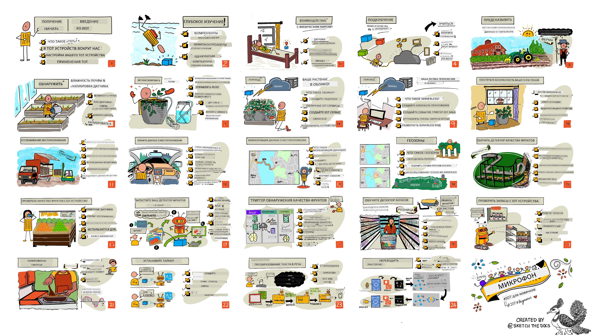

[](https://github.com/microsoft/IoT-For-Beginners/blob/master/LICENSE)
[](https://GitHub.com/microsoft/IoT-For-Beginners/graphs/contributors/)
[](https://GitHub.com/microsoft/IoT-For-Beginners/issues/)
[](https://GitHub.com/microsoft/IoT-For-Beginners/pulls/)
[](http://makeapullrequest.com)

[](https://GitHub.com/microsoft/IoT-For-Beginners/watchers/)
[](https://GitHub.com/microsoft/IoT-For-Beginners/network/)
[](https://GitHub.com/microsoft/IoT-For-Beginners/stargazers/)

### Присоединяйтесь к сообществу Azure AI Foundry

Если у вас возникнут трудности или появятся вопросы по созданию AI-приложений, присоединяйтесь к другим учащимся и опытным разработчикам для обсуждений MCP. Это поддерживающее сообщество, где приветствуются вопросы, а знания свободно делятся.

[](https://discord.gg/nTYy5BXMWG)

Если у вас есть отзывы о продукте или ошибки при разработке, посетите:

[](https://aka.ms/foundry/forum)

Выполните следующие шаги, чтобы начать использовать эти ресурсы:
1. **Форкните репозиторий**: нажмите [](https://GitHub.com/microsoft/IoT-For-Beginners/fork)
2. **Клонируйте репозиторий**: `git clone https://github.com/microsoft/IoT-For-Beginners.git`
3. [**Присоединяйтесь к Discord Microsoft Foundry и встречайтесь с экспертами и другими разработчиками**](https://discord.com/invite/ByRwuEEgH4)


### 🌐 Многоязычная поддержка

#### Поддерживается через GitHub Action (автоматизированно и всегда актуально)

<!-- CO-OP TRANSLATOR LANGUAGES TABLE START -->
[Arabic](../ar/README.md) | [Bengali](../bn/README.md) | [Bulgarian](../bg/README.md) | [Burmese (Myanmar)](../my/README.md) | [Chinese (Simplified)](../zh-CN/README.md) | [Chinese (Traditional, Hong Kong)](../zh-HK/README.md) | [Chinese (Traditional, Macau)](../zh-MO/README.md) | [Chinese (Traditional, Taiwan)](../zh-TW/README.md) | [Croatian](../hr/README.md) | [Czech](../cs/README.md) | [Danish](../da/README.md) | [Dutch](../nl/README.md) | [Estonian](../et/README.md) | [Finnish](../fi/README.md) | [French](../fr/README.md) | [German](../de/README.md) | [Greek](../el/README.md) | [Hebrew](../he/README.md) | [Hindi](../hi/README.md) | [Hungarian](../hu/README.md) | [Indonesian](../id/README.md) | [Italian](../it/README.md) | [Japanese](../ja/README.md) | [Kannada](../kn/README.md) | [Khmer](../km/README.md) | [Korean](../ko/README.md) | [Lithuanian](../lt/README.md) | [Malay](../ms/README.md) | [Malayalam](../ml/README.md) | [Marathi](../mr/README.md) | [Nepali](../ne/README.md) | [Nigerian Pidgin](../pcm/README.md) | [Norwegian](../no/README.md) | [Persian (Farsi)](../fa/README.md) | [Polish](../pl/README.md) | [Portuguese (Brazil)](../pt-BR/README.md) | [Portuguese (Portugal)](../pt-PT/README.md) | [Punjabi (Gurmukhi)](../pa/README.md) | [Romanian](../ro/README.md) | [Russian](./README.md) | [Serbian (Cyrillic)](../sr/README.md) | [Slovak](../sk/README.md) | [Slovenian](../sl/README.md) | [Spanish](../es/README.md) | [Swahili](../sw/README.md) | [Swedish](../sv/README.md) | [Tagalog (Filipino)](../tl/README.md) | [Tamil](../ta/README.md) | [Telugu](../te/README.md) | [Thai](../th/README.md) | [Turkish](../tr/README.md) | [Ukrainian](../uk/README.md) | [Urdu](../ur/README.md) | [Vietnamese](../vi/README.md)

> **Предпочитаете клонировать локально?**
>
> Этот репозиторий включает более 50 языковых переводов, что значительно увеличивает размер загрузки. Чтобы клонировать без переводов, используйте sparse checkout:
>
> **Bash / macOS / Linux:**
> ```bash
> git clone --filter=blob:none --sparse https://github.com/microsoft/IoT-For-Beginners.git
> cd IoT-For-Beginners
> git sparse-checkout set --no-cone '/*' '!translations' '!translated_images'
> ```
>
> **CMD (Windows):**
> ```cmd
> git clone --filter=blob:none --sparse https://github.com/microsoft/IoT-For-Beginners.git
> cd IoT-For-Beginners
> git sparse-checkout set --no-cone "/*" "!translations" "!translated_images"
> ```
>
> Это даст вам все необходимое для прохождения курса с гораздо более быстрой загрузкой.
<!-- CO-OP TRANSLATOR LANGUAGES TABLE END -->

# IoT для начинающих — учебный план

Адвокаты Azure Cloud в Microsoft рады предложить 12-недельный курс из 24 уроков, посвящённый основам IoT. Каждый урок включает викторины до и после занятия, письменные инструкции для выполнения урока, решение, задание и многое другое. Наша проектно-ориентированная методика позволяет учиться во время создания проектов — проверенный способ закрепления новых навыков.

Проекты охватывают путь продуктов питания от фермы к столу. Это включает фермерство, логистику, производство, розничную торговлю и потребителей — все популярные отрасли для устройств IoT.



> Скетчноут от [Nitya Narasimhan](https://github.com/nitya). Нажмите на изображение для увеличения.

**Искренняя благодарность нашим авторам [Jen Fox](https://github.com/jenfoxbot), [Jen Looper](https://github.com/jlooper), [Jim Bennett](https://github.com/jimbobbennett), а также нашему скетчноут-художнику [Nitya Narasimhan](https://github.com/nitya).**

**Спасибо также нашей команде [Microsoft Learn Student Ambassadors](https://studentambassadors.microsoft.com?WT.mc_id=academic-17441-jabenn), которые помогали проверять и переводить этот учебный план — [Aditya Garg](https://github.com/AdityaGarg00), [Anurag Sharma](https://github.com/Anurag-0-1-A), [Arpita Das](https://github.com/Arpiiitaaa), [Aryan Jain](https://www.linkedin.com/in/aryan-jain-47a4a1145/), [Bhavesh Suneja](https://github.com/EliteWarrior315), [Faith Hunja](https://faithhunja.github.io/), [Lateefah Bello](https://www.linkedin.com/in/lateefah-bello/), [Manvi Jha](https://github.com/Severus-Matthew), [Mireille Tan](https://www.linkedin.com/in/mireille-tan-a4834819a/), [Mohammad Iftekher (Iftu) Ebne Jalal](https://github.com/Iftu119), [Mohammad Zulfikar](https://github.com/mohzulfikar), [Priyanshu Srivastav](https://www.linkedin.com/in/priyanshu-srivastav-b067241ba), [Thanmai Gowducheruvu](https://github.com/innovation-platform), и [Zina Kamel](https://www.linkedin.com/in/zina-kamel/).**

Познакомьтесь с командой!

[](https://youtu.be/-wippUJRi5k)

**Gif от** [Mohit Jaisal](https://linkedin.com/in/mohitjaisal)

> 🎥 Нажмите на изображение выше, чтобы посмотреть видео о проекте!

> **Учителя**, мы [включили некоторые рекомендации](for-teachers.md) по использованию этого учебного плана. Если хотите создать свои собственные уроки, у нас есть [шаблон урока](lesson-template/README.md).

> **[Студенты](https://aka.ms/student-page)**, чтобы использовать этот учебный план самостоятельно, сделайте форк всего репозитория и выполняйте упражнения, начиная с викторины до лекции, затем читайте лекцию и выполняйте остальные задания. Старайтесь создавать проекты, понимая уроки, а не копируя код решения; тем не менее он доступен в папках /solutions каждого урока, ориентированного на проекты. Еще одна идея — сформировать учебную группу с друзьями и проходить материал вместе. Для дальнейшего изучения рекомендуем [Microsoft Learn](https://docs.microsoft.com/users/jimbobbennett/collections/ke2ehd351jopwr?WT.mc_id=academic-17441-jabenn).

Для видеообзора этого курса смотрите это видео:

[](https://youtube.com/watch?v=bccEMm8gRuc "Promo video")

> 🎥 Нажмите на изображение выше, чтобы посмотреть видео о проекте!

## Методика обучения

Мы выбрали два педагогических принципа при создании этого курса: обеспечить проектно-ориентированный подход и включить частые викторины. К концу серии студенты создадут систему мониторинга и полива растений, трекер транспортного средства, умную фабрику для отслеживания и проверки продуктов и таймер для готовки с голосовым управлением, а также усвоят основы Интернета вещей, включая написание кода устройств, подключение к облаку, анализ телеметрии и запуск ИИ на периферии.

Обеспечение соответствия контента проектам делает процесс более интересным для студентов и повышает усвоение знаний.

Кроме того, низкозатратная викторина перед занятием настраивает студента на изучение темы, а вторая викторина после занятия обеспечивает закрепление материала. Этот курс разработан так, чтобы быть гибким и увлекательным, и его можно проходить целиком или частично. Проекты начинаются с простого и становятся всё более сложными к концу 12-недельного цикла.

Каждый проект основан на реальном оборудовании, доступном студентам и любителям. Каждый проект рассматривает конкретную предметную область, предоставляя соответствующие базовые знания. Чтобы быть успешным разработчиком, важно понимать область, в которой решаются задачи; предоставление этих знаний позволяет студентам думать об их IoT-решениях и обучении в контексте реальной проблемы, которую IoT-разработчик может решить. Студенты понимают «почему» создаваемых ими решений и ценят конечного пользователя.

## Аппаратное обеспечение
У нас есть два варианта аппаратного обеспечения для Интернета вещей (IoT), которые можно использовать для проектов, в зависимости от личных предпочтений, знаний языков программирования, целей обучения и доступности. Мы также предоставили версию «виртуального оборудования» для тех, у кого нет доступа к реальному оборудованию или кто хочет узнать больше перед покупкой. Вы можете узнать больше и найти «список покупок» на [странице оборудования](./hardware.md), включая ссылки на покупку комплектов от наших друзей из Seeed Studio.

> 💁 Ознакомьтесь с нашими [Правилами поведения](CODE_OF_CONDUCT.md), [Руководством по участию](CONTRIBUTING.md) и [Правилами перевода](..). Мы приветствуем ваши конструктивные отзывы!
>
> 🔧 Возникли проблемы? Ознакомьтесь с нашим [Руководством по устранению неполадок](TROUBLESHOOTING.md) для решения распространённых проблем.

## Каждый урок включает:

- конспект в стиле скетчноут
- дополнительное видео (по желанию)
- разминку-викторину перед уроком
- письменный урок
- для проектных уроков — пошаговые инструкции по созданию проекта
- проверки знаний
- вызов (challenge)
- дополнительное чтение
- задание
- [викторину после урока](https://ff-quizzes.netlify.app/en/)

> **Примечание о викторинах**: Все викторины расположены в папке quiz-app, всего 48 викторин, каждая из трех вопросов. Они связаны внутри уроков, однако приложение викторин может запускаться локально или развертываться в Azure; следуйте инструкциям в папке `quiz-app`. Постепенно они локализуются.

## Уроки

|       |              Название проекта              |                       Изучаемые концепции                       | Цели обучения                                                                                                                                                   |                                                    Связанный урок                                                    |
| :---: | :---------------------------------------: | :--------------------------------------------------------------: | --------------------------------------------------------------------------------------------------------------------------------------------------------------- | :--------------------------------------------------------------------------------------------------------------: |
|  01   | [Начало работы](./1-getting-started/README.md) |                     Введение в Интернет вещей                   | Изучите основные принципы Интернета вещей и основные строительные блоки решений IoT, такие как датчики и облачные сервисы, устанавливая ваше первое IoT-устройство |                     [Введение в IoT](./1-getting-started/lessons/1-introduction-to-iot/README.md)                    |
|  02   | [Начало работы](./1-getting-started/README.md) |                   Глубже в IoT                                  | Узнайте больше о компонентах системы IoT, а также о микроконтроллерах и одноплатных компьютерах                                                                 |                      [Глубже в IoT](./1-getting-started/lessons/2-deeper-dive/README.md)                          |
|  03   | [Начало работы](./1-getting-started/README.md) | Взаимодействие с физическим миром с помощью датчиков и приводов | Узнайте о датчиках для сбора данных из физического мира и исполнителях для обратной связи, создавая ночник                                                      | [Взаимодействие с физическим миром с датчиками и приводами](./1-getting-started/lessons/3-sensors-and-actuators/README.md) |
|  04   | [Начало работы](./1-getting-started/README.md) |             Подключите своё устройство к Интернету             | Узнайте, как подключить устройство IoT к Интернету для отправки и получения сообщений, подключая ваш ночник к MQTT-брокеру                                     |                [Подключите устройство к Интернету](./1-getting-started/lessons/4-connect-internet/README.md)       |
|  05   |            [Ферма](./2-farm/README.md)             |                    Прогноз роста растений                       | Узнайте, как предсказывать рост растений с использованием данных о температуре, собранных устройством IoT                                                     |                          [Прогноз роста растений](./2-farm/lessons/1-predict-plant-growth/README.md)                |
|  06   |            [Ферма](./2-farm/README.md)             |                    Определение влажности почвы                  | Узнайте, как обнаруживать влажность почвы и калибровать датчик влажности                                                                                         |                          [Определение влажности почвы](./2-farm/lessons/2-detect-soil-moisture/README.md)            |
|  07   |            [Ферма](./2-farm/README.md)             |                  Автоматический полив растений                   | Узнайте, как автоматизировать и таймировать полив с помощью реле и MQTT                                                                                          |                      [Автоматический полив растений](./2-farm/lessons/3-automated-plant-watering/README.md)           |
|  08   |            [Ферма](./2-farm/README.md)             |               Перенос вашего растения в облако                  | Узнайте об облаке и облачных сервисах IoT и о том, как подключить ваше растение к одному из них вместо публичного MQTT-брокера                                 |              [Перенос вашего растения в облако](./2-farm/lessons/4-migrate-your-plant-to-the-cloud/README.md)          |
|  09   |            [Ферма](./2-farm/README.md)             |         Перенос логики приложения в облако                       | Узнайте, как писать логику приложения в облаке, которая реагирует на сообщения IoT                                                                              |          [Перенос логики приложения в облако](./2-farm/lessons/5-migrate-application-to-the-cloud/README.md)           |
|  10   |            [Ферма](./2-farm/README.md)             |                   Обеспечьте безопасность растения               | Узнайте о безопасности IoT и как защитить ваше растение с помощью ключей и сертификатов                                                                        |                        [Обеспечьте безопасность растения](./2-farm/lessons/6-keep-your-plant-secure/README.md)         |
|  11   |       [Транспорт](./3-transport/README.md)         |                      Отслеживание местоположения                | Узнайте об отслеживании местоположения GPS для устройств IoT                                                                                                    |                             [Отслеживание местоположения](./3-transport/lessons/1-location-tracking/README.md)          |
|  12   |       [Транспорт](./3-transport/README.md)         |                     Хранение данных о местоположении            | Узнайте, как хранить данные IoT для последующей визуализации или анализа                                                                                        |                         [Хранение данных о местоположении](./3-transport/lessons/2-store-location-data/README.md)       |
|  13   |       [Транспорт](./3-transport/README.md)         |                   Визуализация данных о местоположении          | Узнайте о визуализации данных о местоположении на карте и о том, как карты представляют реальный 3D-мир в 2 измерениях                                         |                      [Визуализация данных о местоположении](./3-transport/lessons/3-visualize-location-data/README.md)   |
|  14   |       [Транспорт](./3-transport/README.md)         |                          Геозоны                                | Узнайте о геозонах и о том, как их использовать для оповещения, когда транспортные средства в цепочке поставок приближаются к месту назначения                 |                                    [Геозоны](./3-transport/lessons/4-geofences/README.md)                            |
|  15   |   [Производство](./4-manufacturing/README.md)       |               Обучение детектора качества фруктов               | Узнайте, как обучить классификатор изображений в облаке для определения качества фруктов                                                                       |                [Обучение детектора качества фруктов](./4-manufacturing/lessons/1-train-fruit-detector/README.md)        |
|  16   |   [Производство](./4-manufacturing/README.md)       |           Проверка качества фруктов с IoT-устройства            | Узнайте, как использовать детектор качества фруктов на устройстве IoT                                                                                          |             [Проверка качества фруктов с IoT-устройства](./4-manufacturing/lessons/2-check-fruit-from-device/README.md)   |
|  17   |   [Производство](./4-manufacturing/README.md)       |             Запуск детектора фруктов на периферии               | Узнайте, как запускать детектор фруктов на устройстве IoT на периферии                                                                                        |               [Запуск детектора фруктов на периферии](./4-manufacturing/lessons/3-run-fruit-detector-edge/README.md)     |
|  18   |   [Производство](./4-manufacturing/README.md)       |        Запуск обнаружения качества фруктов с датчика            | Узнайте, как запускать обнаружение качества фруктов с помощью датчика                                                                                        |                     [Запуск обнаружения качества фруктов с датчика](./4-manufacturing/lessons/4-trigger-fruit-detector/README.md) |
|  19   |          [Розница](./5-retail/README.md)            |                   Обучение детектора запасов                    | Узнайте, как использовать обнаружение объектов для обучения детектора запасов для подсчёта товара в магазине                                                 |                         [Обучение детектора запасов](./5-retail/lessons/1-train-stock-detector/README.md)               |
|  20   |          [Розница](./5-retail/README.md)            |               Проверка запасов с IoT-устройства                 | Узнайте, как проверять запасы с IoT-устройства с использованием модели обнаружения объектов                                                                 |                     [Проверка запасов с IoT-устройства](./5-retail/lessons/2-check-stock-device/README.md)              |
|  21   |        [Потребитель](./6-consumer/README.md)        |             Распознавание речи с IoT-устройства                 | Узнайте, как распознавать речь с IoT-устройства для создания умного таймера                                                                                  |                   [Распознавание речи с IoT-устройства](./6-consumer/lessons/1-speech-recognition/README.md)             |
|  22   |        [Потребитель](./6-consumer/README.md)        |                     Понимание языка                             | Узнайте, как понимать предложения, сказанные IoT-устройству                                                                                                |                          [Понимание языка](./6-consumer/lessons/2-language-understanding/README.md)                      |
|  23   |        [Потребитель](./6-consumer/README.md)        |           Установка таймера и устная обратная связь              | Узнайте, как установить таймер на IoT-устройстве и предоставлять устную обратную связь о начале и конце таймера                                              |                    [Установка таймера и устная обратная связь](./6-consumer/lessons/3-spoken-feedback/README.md)          |
|  24   |        [Потребитель](./6-consumer/README.md)        |                 Поддержка нескольких языков                      | Узнайте, как поддерживать несколько языков, как при обращении, так и в ответах вашего умного таймера                                                        |                     [Поддержка нескольких языков](./6-consumer/lessons/4-multiple-language-support/README.md)            |

## Оффлайн-доступ

Вы можете запускать эту документацию оффлайн с помощью [Docsify](https://docsify.js.org/#/). Форкните этот репозиторий, [установите Docsify](https://docsify.js.org/#/quickstart) на своем локальном компьютере, а затем в корневой папке этого репозитория введите `docsify serve`. Веб-сайт будет доступен на порту 3000 на вашем локальном хосте: `localhost:3000`.

## Викторина

Благодарим сообщество за размещение интерактивной викторины, которая проверяет ваши знания по каждой из глав. Вы можете проверить свои знания [здесь](https://ff-quizzes.netlify.app/en/)

### PDF

Вы можете сгенерировать PDF этой документации для оффлайн-доступа, если это необходимо. Для этого убедитесь, что у вас установлен [npm](https://docs.npmjs.com/downloading-and-installing-node-js-and-npm) и выполните следующие команды в корневой папке этого репозитория:

```sh
npm i
npm run convert
```

### Слайды

Некоторые уроки имеют презентации, которые находятся в папке [slides](../../slides).


## Другие учебные программы

Наша команда также выпускает другие учебные программы! Ознакомьтесь:

<!-- CO-OP TRANSLATOR OTHER COURSES START -->
### LangChain
[](https://aka.ms/langchain4j-for-beginners)
[](https://aka.ms/langchainjs-for-beginners?WT.mc_id=m365-94501-dwahlin)
[](https://github.com/microsoft/langchain-for-beginners?WT.mc_id=m365-94501-dwahlin)
---

### Azure / Edge / MCP / Agents
[](https://github.com/microsoft/AZD-for-beginners?WT.mc_id=academic-105485-koreyst)
[](https://github.com/microsoft/edgeai-for-beginners?WT.mc_id=academic-105485-koreyst)
[](https://github.com/microsoft/mcp-for-beginners?WT.mc_id=academic-105485-koreyst)
[](https://github.com/microsoft/ai-agents-for-beginners?WT.mc_id=academic-105485-koreyst)

---
 
### Серия Генеративного ИИ
[](https://github.com/microsoft/generative-ai-for-beginners?WT.mc_id=academic-105485-koreyst)
[-9333EA?style=for-the-badge&labelColor=E5E7EB&color=9333EA)](https://github.com/microsoft/Generative-AI-for-beginners-dotnet?WT.mc_id=academic-105485-koreyst)
[-C084FC?style=for-the-badge&labelColor=E5E7EB&color=C084FC)](https://github.com/microsoft/generative-ai-for-beginners-java?WT.mc_id=academic-105485-koreyst)
[-E879F9?style=for-the-badge&labelColor=E5E7EB&color=E879F9)](https://github.com/microsoft/generative-ai-with-javascript?WT.mc_id=academic-105485-koreyst)

---
 
### Основное обучение
[](https://aka.ms/ml-beginners?WT.mc_id=academic-105485-koreyst)
[](https://aka.ms/datascience-beginners?WT.mc_id=academic-105485-koreyst)
[](https://aka.ms/ai-beginners?WT.mc_id=academic-105485-koreyst)
[](https://github.com/microsoft/Security-101?WT.mc_id=academic-96948-sayoung)
[](https://aka.ms/webdev-beginners?WT.mc_id=academic-105485-koreyst)
[](https://aka.ms/iot-beginners?WT.mc_id=academic-105485-koreyst)
[](https://github.com/microsoft/xr-development-for-beginners?WT.mc_id=academic-105485-koreyst)

---
 
### Серия Copilot
[](https://aka.ms/GitHubCopilotAI?WT.mc_id=academic-105485-koreyst)
[](https://github.com/microsoft/mastering-github-copilot-for-dotnet-csharp-developers?WT.mc_id=academic-105485-koreyst)
[](https://github.com/microsoft/CopilotAdventures?WT.mc_id=academic-105485-koreyst)
<!-- CO-OP TRANSLATOR OTHER COURSES END -->

## Указание источников изображений

Вы можете найти все указания источников изображений, используемых в этой учебной программе, в разделе [Attributions](./attributions.md).

---

<!-- CO-OP TRANSLATOR DISCLAIMER START -->
**Отказ от ответственности**:
Данный документ был переведен с помощью сервиса автоматического перевода [Co-op Translator](https://github.com/Azure/co-op-translator). Несмотря на наши усилия по обеспечению точности, имейте в виду, что автоматический перевод может содержать ошибки или неточности. Оригинальный документ на его родном языке должен рассматриваться как авторитетный источник. Для важной информации рекомендуется использовать профессиональный перевод, выполненный человеком. Мы не несем ответственности за любые недоразумения или неверные толкования, возникшие в результате использования данного перевода.
<!-- CO-OP TRANSLATOR DISCLAIMER END -->