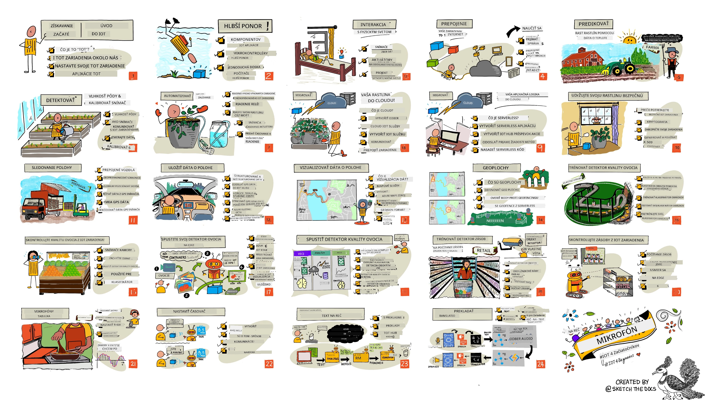

<!--
CO_OP_TRANSLATOR_METADATA:
{
  "original_hash": "6c354ec3487e4f6cfafbe44557996cd9",
  "translation_date": "2026-01-06T15:41:19+00:00",
  "source_file": "README.md",
  "language_code": "sk"
}
-->
[](https://github.com/microsoft/IoT-For-Beginners/blob/master/LICENSE)
[](https://GitHub.com/microsoft/IoT-For-Beginners/graphs/contributors/)
[](https://GitHub.com/microsoft/IoT-For-Beginners/issues/)
[](https://GitHub.com/microsoft/IoT-For-Beginners/pulls/)
[](http://makeapullrequest.com)

[](https://GitHub.com/microsoft/IoT-For-Beginners/watchers/)
[](https://GitHub.com/microsoft/IoT-For-Beginners/network/)
[](https://GitHub.com/microsoft/IoT-For-Beginners/stargazers/)

### Pripojte sa ku komunite Azure AI Foundry

Ak sa zaseknete alebo máte nejaké otázky týkajúce sa tvorby AI aplikácií. Pridajte sa k ďalším študentom a skúseným vývojárom v diskusiách o MCP. Je to podporná komunita, kde sú otázky vítané a vedomosti sa šíria slobodne.

[](https://discord.gg/nTYy5BXMWG)

Ak máte pripomienky k produktu alebo narazíte na chyby počas vývoja, navštívte:

[](https://aka.ms/foundry/forum)

Postupujte podľa týchto krokov, ako začať využívať tieto zdroje:
1. **Vytvorte Fork úložiska**: Kliknite na [](https://GitHub.com/microsoft/IoT-For-Beginners/fork)
2. **Naklonujte úložisko**:   `git clone https://github.com/microsoft/IoT-For-Beginners.git`
3. [**Pridajte sa ku Microsot Foundry Discord, kde stretnete expertov a ďalších vývojárov**](https://discord.com/invite/ByRwuEEgH4)


### 🌐 Podpora viacerých jazykov

#### Podporované cez GitHub Action (automatizované a vždy aktuálne)

<!-- CO-OP TRANSLATOR LANGUAGES TABLE START -->
[Arabic](../ar/README.md) | [Bengali](../bn/README.md) | [Bulgarian](../bg/README.md) | [Burmese (Myanmar)](../my/README.md) | [Chinese (Simplified)](../zh/README.md) | [Chinese (Traditional, Hong Kong)](../hk/README.md) | [Chinese (Traditional, Macau)](../mo/README.md) | [Chinese (Traditional, Taiwan)](../tw/README.md) | [Croatian](../hr/README.md) | [Czech](../cs/README.md) | [Danish](../da/README.md) | [Dutch](../nl/README.md) | [Estonian](../et/README.md) | [Finnish](../fi/README.md) | [French](../fr/README.md) | [German](../de/README.md) | [Greek](../el/README.md) | [Hebrew](../he/README.md) | [Hindi](../hi/README.md) | [Hungarian](../hu/README.md) | [Indonesian](../id/README.md) | [Italian](../it/README.md) | [Japanese](../ja/README.md) | [Kannada](../kn/README.md) | [Korean](../ko/README.md) | [Lithuanian](../lt/README.md) | [Malay](../ms/README.md) | [Malayalam](../ml/README.md) | [Marathi](../mr/README.md) | [Nepali](../ne/README.md) | [Nigerian Pidgin](../pcm/README.md) | [Norwegian](../no/README.md) | [Persian (Farsi)](../fa/README.md) | [Polish](../pl/README.md) | [Portuguese (Brazil)](../br/README.md) | [Portuguese (Portugal)](../pt/README.md) | [Punjabi (Gurmukhi)](../pa/README.md) | [Romanian](../ro/README.md) | [Russian](../ru/README.md) | [Serbian (Cyrillic)](../sr/README.md) | [Slovak](./README.md) | [Slovenian](../sl/README.md) | [Spanish](../es/README.md) | [Swahili](../sw/README.md) | [Swedish](../sv/README.md) | [Tagalog (Filipino)](../tl/README.md) | [Tamil](../ta/README.md) | [Telugu](../te/README.md) | [Thai](../th/README.md) | [Turkish](../tr/README.md) | [Ukrainian](../uk/README.md) | [Urdu](../ur/README.md) | [Vietnamese](../vi/README.md)

> **Uprednostňujete lokálne klonovanie?**

> Toto repo obsahuje viac než 50 jazykových prekladov, čo výrazne zvyšuje veľkosť na stiahnutie. Ak chcete klonovať bez prekladov, použite sparse checkout:
> ```bash
> git clone --filter=blob:none --sparse https://github.com/microsoft/IoT-For-Beginners.git
> cd IoT-For-Beginners
> git sparse-checkout set --no-cone '/*' '!translations' '!translated_images'
> ```
> Toto vám poskytne všetko potrebné na dokončenie kurzu s oveľa rýchlejším sťahovaním.
<!-- CO-OP TRANSLATOR LANGUAGES TABLE END -->

# IoT pre Začiatočníkov - Kurikulum

Azure Cloud Advocates v Microsoft s potešením ponúkajú 12-týždňový kurz s 24 lekciami o základoch IoT. Každá lekcia obsahuje kvíz pred a po lekcii, písomné inštrukcie na dokončenie lekcie, riešenie, zadanie a ďalšie. Naša projektovo orientovaná pedagogika umožňuje učiť sa pri budovaní, čo je overený spôsob, ako si nové poznatky „uložiť“.

Projekty pokrývajú cestu potravín od farmy po stôl. Zahŕňa to poľnohospodárstvo, logistiku, výrobu, maloobchod a spotrebiteľa - všetky populárne odvetvia pre IoT zariadenia.



> Skicár vytvorený [Nitya Narasimhan](https://github.com/nitya). Kliknite na obrázok pre väčšiu verziu.

**Veľká vďaka našim autorom [Jen Fox](https://github.com/jenfoxbot), [Jen Looper](https://github.com/jlooper), [Jim Bennett](https://github.com/jimbobbennett) a nášmu ilustrátorovi [Nitya Narasimhan](https://github.com/nitya).**

**Ďakujeme tiež nášmu tímu [Microsoft Learn Student Ambassadors](https://studentambassadors.microsoft.com?WT.mc_id=academic-17441-jabenn), ktorí prehliadajú a prekladajú toto kurikulum - [Aditya Garg](https://github.com/AdityaGarg00), [Anurag Sharma](https://github.com/Anurag-0-1-A), [Arpita Das](https://github.com/Arpiiitaaa), [Aryan Jain](https://www.linkedin.com/in/aryan-jain-47a4a1145/), [Bhavesh Suneja](https://github.com/EliteWarrior315), [Faith Hunja](https://faithhunja.github.io/), [Lateefah Bello](https://www.linkedin.com/in/lateefah-bello/), [Manvi Jha](https://github.com/Severus-Matthew), [Mireille Tan](https://www.linkedin.com/in/mireille-tan-a4834819a/), [Mohammad Iftekher (Iftu) Ebne Jalal](https://github.com/Iftu119), [Mohammad Zulfikar](https://github.com/mohzulfikar), [Priyanshu Srivastav](https://www.linkedin.com/in/priyanshu-srivastav-b067241ba), [Thanmai Gowducheruvu](https://github.com/innovation-platform), a [Zina Kamel](https://www.linkedin.com/in/zina-kamel/).**

Spoznajte tím!

[](https://youtu.be/-wippUJRi5k)

**Gif od** [Mohit Jaisal](https://linkedin.com/in/mohitjaisal)

> 🎥 Kliknite na obrázok vyššie pre video o projekte!

> **Učitelia**, pripravili sme [niekoľko odporúčaní](for-teachers.md) ako používať toto kurikulum. Ak chcete vytvoriť vlastné lekcie, máme aj [šablónu lekcie](lesson-template/README.md).

> **Študenti** [https://aka.ms/student-page], aby ste toto kurikulum mohli používať samostatne, vytvorte fork celého repozitára a dokončujte cvičenia sami, začínajúc kvízom pred lekciou, potom si prečítajte lekciu a dokončite zvyšok aktivít. Snažte sa projekty vytvárať porozumením lekcií namiesto kopírovania riešení; kód riešení je však dostupný v priečinkoch /solutions v každej projektovo orientovanej lekcii. Ďalšou možnosťou je vytvoriť študijnú skupinu s priateľmi a prejsť obsah spoločne. Pre ďalšie štúdium odporúčame [Microsoft Learn](https://docs.microsoft.com/users/jimbobbennett/collections/ke2ehd351jopwr?WT.mc_id=academic-17441-jabenn).

Pre video prehľad tohto kurzu pozrite toto video:

[](https://youtube.com/watch?v=bccEMm8gRuc "Promo video")

> 🎥 Kliknite na obrázok vyššie pre video o projekte!

## Pedagogika

Zvolili sme dva pedagogické princípy pri tvorbe tohto kurikula: zabezpečiť, aby bol založený na projektoch a aby obsahoval časté kvízy. Na konci tejto série študenti vybudujú systém na monitorovanie a zavlažovanie rastlín, sledovač vozidiel, inteligentnú továreň na sledovanie a kontrolu potravín a kuchynský časovač ovládaný hlasom, a naučia sa základy Internetu vecí vrátane písania kódu pre zariadenia, pripojenia k cloudu, analýzy telemetrie a spúšťanie AI na edge zariadeniach.

Zaradením obsahu do projektov je proces zaujímavejší a koncepty sa lepšie udržia v pamäti.

Navyše, nízkorizikový kvíz pred prednáškou nastavuje študentovi zámer naučiť sa danú tému, zatiaľ čo druhý kvíz po prednáške zabezpečuje ešte lepšie zafixovanie vedomostí. Toto kurikulum bolo navrhnuté flexibilne a zábavne a môžete ho absolvovať celé alebo čiastočne. Projekty začínajú malé a na konci 12-týždňového cyklu sa stávajú čoraz komplexnejšími.

Každý projekt je založený na skutočnom hardvéri dostupnom študentom a nadšencom. Každý projekt sa zameriava na konkrétnu projektovú doménu a poskytuje relevantné základné vedomosti. Aby ste boli úspešným vývojárom, pomáha pochopiť doménu, kde riešite problémy, a tieto základné vedomosti umožňujú študentom premýšľať o svojich IoT riešeniach a poznatkoch v kontexte reálnych problémov, ktoré môžu ako IoT vývojári riešiť. Študenti sa naučia „prečo“ riešení, ktoré budujú, a získajú ocenenie koncového používateľa.

## Hardvér

Máme na výber dva typy IoT hardvéru pre projekty podľa osobných preferencií, znalostí programovacích jazykov, cieľov učenia sa a dostupnosti. Poskytli sme tiež „virtuálnu hardvérovú“ verziu pre tých, ktorí nemajú prístup k zariadeniam alebo chcú vedieť viac pred kúpou. Viac informácií a zoznam potrebného hardvéru nájdete na [stránke hardvéru](./hardware.md), vrátane odkazov na kompletné sady od našich priateľov zo Seeed Studio.
> 💁 Nájdite náš [Kódex správania](CODE_OF_CONDUCT.md), [Príspevky](CONTRIBUTING.md) a [Prekladateľské](TRANSLATIONS.md) usmernenia. Vašu konštruktívnu spätnú väzbu vítame!
>
> 🔧 Máte problémy? Prezrite si náš [Sprievodca riešením problémov](TROUBLESHOOTING.md) pre riešenia bežných problémov.

## Každá lekcia obsahuje:

- náčrt sketchnote
- voliteľné doplňujúce video
- predbežný rozcvičovací kvíz pred lekciou
- písanú lekciu
- pri lekciách založených na projekte krok za krokom návody, ako projekt vybudovať
- kontrolu vedomostí
- výzvu
- doplňujúce čítanie
- zadanie
- [kvíz po lekcii](https://ff-quizzes.netlify.app/en/)

> **Poznámka o kvízoch**: Všetky kvízy sú uložené v priečinku quiz-app, celkovo je tam 48 kvízov po tri otázky. Sú prepojené v lekciách, ale aplikáciu kvízu je možné spustiť lokálne alebo nasadiť na Azure; postupujte podľa inštrukcií v priečinku `quiz-app`. Postupne prebieha ich lokalizácia.

## Lekcie

|       |              Názov projektu              |                          Preberané koncepty                          | Vzdelávacie ciele                                                                                                                                                  |                                                        Prepojená lekcia                                                          |
| :---: | :------------------------------------: | :------------------------------------------------------------------: | ----------------------------------------------------------------------------------------------------------------------------------------------------------------- | :--------------------------------------------------------------------------------------------------------------------------: |
|  01   | [Začíname](./1-getting-started/README.md) |                     Úvod do IoT                     | Naučte sa základné princípy IoT a základné stavebné bloky IoT riešení, ako sú senzory a cloudové služby, zatiaľ čo nastavujete prvé IoT zariadenie |                      [Úvod do IoT](./1-getting-started/lessons/1-introduction-to-iot/README.md)                      |
|  02   | [Začíname](./1-getting-started/README.md) |               Hlbší pohľad na IoT               | Dozviete sa viac o komponentoch IoT systému, ako aj o mikrokontroléroch a jednodeskových počítačoch                                                       |                        [Hlbší pohľad na IoT](./1-getting-started/lessons/2-deeper-dive/README.md)                         |
|  03   | [Začíname](./1-getting-started/README.md) | Interakcia s fyzickým svetom cez senzory a aktuátory | Dozviete sa o snímačoch na zber dát z fyzického sveta a aktuátoroch na spätnú väzbu, zatiaľ čo staviate nočné svetlo                                           | [Interakcia s fyzickým svetom cez senzory a aktuátory](./1-getting-started/lessons/3-sensors-and-actuators/README.md) |
|  04   | [Začíname](./1-getting-started/README.md) |         Pripojte svoje zariadenie na internet         | Naučte sa, ako pripojiť IoT zariadenie na internet na odosielanie a prijímanie správ pripojením nočného svetla k MQTT brokeru                               |               [Pripojte svoje zariadenie na internet](./1-getting-started/lessons/4-connect-internet/README.md)                |
|  05   |            [Farma](./2-farm/README.md)            |                    Predpoveď rastu rastlín                     | Naučte sa predpovedať rast rastlín pomocou teplotných údajov zachytených IoT zariadením                                                                                  |                          [Predpoveď rastu rastlín](./2-farm/lessons/1-predict-plant-growth/README.md)                           |
|  06   |            [Farma](./2-farm/README.md)            |                    Detekcia vlhkosti pôdy                     | Naučte sa detekovať vlhkosť pôdy a kalibrovať senzor vlhkosti pôdy                                                                                              |                          [Detekcia vlhkosti pôdy](./2-farm/lessons/2-detect-soil-moisture/README.md)                           |
|  07   |            [Farma](./2-farm/README.md)            |                  Automatické zavlažovanie rastlín                   | Naučte sa automatizovať a načasovať zalievanie pomocou relé a MQTT                                                                                                      |                      [Automatické zavlažovanie rastlín](./2-farm/lessons/3-automated-plant-watering/README.md)                       |
|  08   |            [Farma](./2-farm/README.md)            |               Migrácia rastliny do cloudu               | Naučte sa o cloude a cloud-hostovaných IoT službách a ako pripojiť rastlinu k niektorej z nich namiesto verejného MQTT brokeru                                   |               [Migrácia rastliny do cloudu](./2-farm/lessons/4-migrate-your-plant-to-the-cloud/README.md)                |
|  09   |            [Farma](./2-farm/README.md)            |         Migrácia aplikačnej logiky do cloudu         | Naučte sa, ako písať aplikačnú logiku v cloude, ktorá reaguje na IoT správy                                                                          |         [Migrácia aplikačnej logiky do cloudu](./2-farm/lessons/5-migrate-application-to-the-cloud/README.md)         |
|  10   |            [Farma](./2-farm/README.md)            |                   Zabezpečenie rastliny                    | Naučte sa o bezpečnosti v IoT a ako zabezpečiť rastlinu pomocou kľúčov a certifikátov                                                                          |                        [Zabezpečenie rastliny](./2-farm/lessons/6-keep-your-plant-secure/README.md)                         |
|  11   |       [Doprava](./3-transport/README.md)       |                      Sledovanie polohy                      | Naučte sa sledovanie polohy GPS pre IoT zariadenia                                                                                                                   |                           [Sledovanie polohy](./3-transport/lessons/1-location-tracking/README.md)                           |
|  12   |       [Doprava](./3-transport/README.md)       |                     Ukladanie polohových dát                     | Naučte sa ukladať IoT dáta pre neskoršiu vizualizáciu alebo analýzu                                                                                                      |                         [Ukladanie polohových dát](./3-transport/lessons/2-store-location-data/README.md)                         |
|  13   |       [Doprava](./3-transport/README.md)       |                   Vizualizácia polohových dát                   | Dozviete sa o vizualizácii polohy na mape a ako mapy zobrazujú skutočný 3D svet v dvoch rozmeroch                                                            |                     [Vizualizácia polohových dát](./3-transport/lessons/3-visualize-location-data/README.md)                     |
|  14   |       [Doprava](./3-transport/README.md)       |                          Geoploty                          | Dozviete sa o geoplochoch a ako sa používajú na upozornenie, keď sú vozidlá v dodávateľskom reťazci blízko svojho cieľa                                           |                                   [Geoploty](./3-transport/lessons/4-geofences/README.md)                                   |
|  15   |   [Výroba](./4-manufacturing/README.md)   |               Tréning detektora kvality ovocia                | Naučte sa trénovať klasifikátor obrázkov v cloude na detekciu kvality ovocia                                                                                       |                 [Tréning detektora kvality ovocia](./4-manufacturing/lessons/1-train-fruit-detector/README.md)                 |
|  16   |   [Výroba](./4-manufacturing/README.md)   |           Kontrola kvality ovocia z IoT zariadenia            | Naučte sa používať detektor kvality ovocia na IoT zariadení                                                                                                    |           [Kontrola kvality ovocia z IoT zariadenia](./4-manufacturing/lessons/2-check-fruit-from-device/README.md)            |
|  17   |   [Výroba](./4-manufacturing/README.md)   |             Spustenie detektora ovocia na edge zariadení             | Naučte sa spustiť detektor ovocia na IoT zariadení na edge                                                                                                                                |             [Spustenie detektora ovocia na edge zariadení](./4-manufacturing/lessons/3-run-fruit-detector-edge/README.md)             |
|  18   |   [Výroba](./4-manufacturing/README.md)   |        Spustenie detekcie kvality ovocia zo senzora        | Naučte sa spúšťať detekciu kvality ovocia zo senzora                                                                                                        |        [Spustenie detekcie kvality ovocia zo senzora](./4-manufacturing/lessons/4-trigger-fruit-detector/README.md)         |
|  19   |          [Maloobchod](./5-retail/README.md)          |                   Tréning detektora zásob                    | Naučte sa používať detekciu objektov na trénovanie detektora zásob na počítanie zásob v obchode                                                                                |                        [Tréning detektora zásob](./5-retail/lessons/1-train-stock-detector/README.md)                         |
|  20   |          [Maloobchod](./5-retail/README.md)          |               Kontrola zásob z IoT zariadenia                | Naučte sa kontrolovať zásoby z IoT zariadenia pomocou modelu na detekciu objektov                                                                                         |                     [Kontrola zásob z IoT zariadenia](./5-retail/lessons/2-check-stock-device/README.md)                      |
|  21   |        [Spotrebiteľ](./6-consumer/README.md)        |             Rozpoznávanie reči s IoT zariadením             | Naučte sa rozpoznávať reč z IoT zariadenia na zostavenie inteligentného časovača                                                                                             |                  [Rozpoznávanie reči s IoT zariadením](./6-consumer/lessons/1-speech-recognition/README.md)                  |
|  22   |        [Spotrebiteľ](./6-consumer/README.md)        |                     Porozumenie jazyka                     | Naučte sa porozumieť vetám hovoreným k IoT zariadeniu                                                                                                           |                        [Porozumenie jazyka](./6-consumer/lessons/2-language-understanding/README.md)                        |
|  23   |        [Spotrebiteľ](./6-consumer/README.md)        |           Nastavenie časovača a poskytovanie hovorených odpovedí           | Naučte sa nastaviť časovač na IoT zariadení a dodať hovorenú spätnú väzbu o nastavení časovača a jeho skončení                                                    |                 [Nastavenie časovača a poskytovanie hovorených odpovedí](./6-consumer/lessons/3-spoken-feedback/README.md)                  |
|  24   |        [Spotrebiteľ](./6-consumer/README.md)        |                 Podpora viacerých jazykov                  | Naučte sa podporovať viaceré jazyky, ako hovorené vstupy, tak aj odpovede vášho inteligentného časovača                                                               |                   [Podpora viacerých jazykov](./6-consumer/lessons/4-multiple-language-support/README.md)                   |

## Offline prístup

Túto dokumentáciu môžete používať offline pomocou [Docsify](https://docsify.js.org/#/). Vytvorte si fork tohto repozitára, [nainštalujte Docsify](https://docsify.js.org/#/quickstart) na svoj lokálny počítač a potom v koreňovom priečinku tohto repozitára zadajte príkaz `docsify serve`. Webová stránka bude spustená na porte 3000 na vašom localhoste: `localhost:3000`.

## Kvíz

Ďakujeme komunite za hosťovanie interaktívneho kvízu, ktorý testuje vaše vedomosti z jednotlivých kapitol. Otestujte si svoje vedomosti [tu](https://ff-quizzes.netlify.app/en/)

### PDF

V prípade potreby môžete vygenerovať PDF tohto obsahu pre offline použitie. Uistite sa, že máte nainštalovaný [npm](https://docs.npmjs.com/downloading-and-installing-node-js-and-npm) a v koreňovom priečinku tohto repozitára spustite nasledujúce príkazy:

```sh
npm i
npm run convert
```

### Prezentácie

K niektorým lekciám sú k dispozícii prezentácie v priečinku [slides](../../slides).


## Ďalšie kurikulumy

Náš tím produkuje aj ďalšie kurikulumy! Pozrite si:

<!-- CO-OP TRANSLATOR OTHER COURSES START -->
### LangChain
[](https://aka.ms/langchain4j-for-beginners)
[](https://aka.ms/langchainjs-for-beginners?WT.mc_id=m365-94501-dwahlin)

---

### Azure / Edge / MCP / Agents
[](https://github.com/microsoft/AZD-for-beginners?WT.mc_id=academic-105485-koreyst)
[](https://github.com/microsoft/edgeai-for-beginners?WT.mc_id=academic-105485-koreyst)
[](https://github.com/microsoft/mcp-for-beginners?WT.mc_id=academic-105485-koreyst)
[](https://github.com/microsoft/ai-agents-for-beginners?WT.mc_id=academic-105485-koreyst)

---
 
### Séria Generatívnej AI
[](https://github.com/microsoft/generative-ai-for-beginners?WT.mc_id=academic-105485-koreyst)
[-9333EA?style=for-the-badge&labelColor=E5E7EB&color=9333EA)](https://github.com/microsoft/Generative-AI-for-beginners-dotnet?WT.mc_id=academic-105485-koreyst)
[-C084FC?style=for-the-badge&labelColor=E5E7EB&color=C084FC)](https://github.com/microsoft/generative-ai-for-beginners-java?WT.mc_id=academic-105485-koreyst)
[-E879F9?style=for-the-badge&labelColor=E5E7EB&color=E879F9)](https://github.com/microsoft/generative-ai-with-javascript?WT.mc_id=academic-105485-koreyst)

---
 
### Základné učenie
[](https://aka.ms/ml-beginners?WT.mc_id=academic-105485-koreyst)
[](https://aka.ms/datascience-beginners?WT.mc_id=academic-105485-koreyst)
[](https://aka.ms/ai-beginners?WT.mc_id=academic-105485-koreyst)
[](https://github.com/microsoft/Security-101?WT.mc_id=academic-96948-sayoung)
[](https://aka.ms/webdev-beginners?WT.mc_id=academic-105485-koreyst)
[](https://aka.ms/iot-beginners?WT.mc_id=academic-105485-koreyst)
[](https://github.com/microsoft/xr-development-for-beginners?WT.mc_id=academic-105485-koreyst)

---
 
### Séria Copilot
[](https://aka.ms/GitHubCopilotAI?WT.mc_id=academic-105485-koreyst)
[](https://github.com/microsoft/mastering-github-copilot-for-dotnet-csharp-developers?WT.mc_id=academic-105485-koreyst)
[](https://github.com/microsoft/CopilotAdventures?WT.mc_id=academic-105485-koreyst)
<!-- CO-OP TRANSLATOR OTHER COURSES END -->

## Pripísanie obrázkov

Všetky pripísania k obrázkom použitým v tomto učebnom pláne nájdete tam, kde je to potrebné, v [Pripísaniach](./attributions.md).

---

<!-- CO-OP TRANSLATOR DISCLAIMER START -->
**Vyhlásenie o zodpovednosti**:
Tento dokument bol preložený pomocou AI prekladateľskej služby [Co-op Translator](https://github.com/Azure/co-op-translator). Aj keď usilovne usilujeme o presnosť, prosím majte na pamäti, že automatické preklady môžu obsahovať chyby alebo nepresnosti. Pôvodný dokument v jeho rodnom jazyku by mal byť považovaný za autoritatívny zdroj. Pre kritické informácie sa odporúča profesionálny ľudský preklad. Nie sme zodpovední za akékoľvek nedorozumenia alebo nesprávne interpretácie vyplývajúce z použitia tohto prekladu.
<!-- CO-OP TRANSLATOR DISCLAIMER END -->