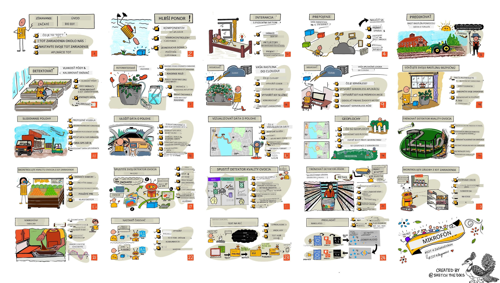

[](https://github.com/microsoft/IoT-For-Beginners/blob/master/LICENSE)
[](https://GitHub.com/microsoft/IoT-For-Beginners/graphs/contributors/)
[](https://GitHub.com/microsoft/IoT-For-Beginners/issues/)
[](https://GitHub.com/microsoft/IoT-For-Beginners/pulls/)
[](http://makeapullrequest.com)

[](https://GitHub.com/microsoft/IoT-For-Beginners/watchers/)
[](https://GitHub.com/microsoft/IoT-For-Beginners/network/)
[](https://GitHub.com/microsoft/IoT-For-Beginners/stargazers/)

### Pridajte sa ku komunite Azure AI Foundry

Ak sa zaseknete alebo máte akékoľvek otázky týkajúce sa vytvárania AI aplikácií, pripojte sa k ostatným študentom a skúseným vývojárom v diskusiách o MCP. Je to podporujúca komunita, kde sú otázky vítané a vedomosti sa šíria slobodne.

[](https://discord.gg/nTYy5BXMWG)

Ak máte spätnú väzbu k produktu alebo chyby počas vývoja, navštívte:

[](https://aka.ms/foundry/forum)

Postupujte podľa týchto krokov, aby ste začali využívať tieto zdroje:
1. **Vytvorte si Fork repozitára**: Kliknite [](https://GitHub.com/microsoft/IoT-For-Beginners/fork)
2. **Naklonujte repozitár**: `git clone https://github.com/microsoft/IoT-For-Beginners.git`
3. [**Pripojte sa na Microsoft Foundry Discord a stretnite sa s odborníkmi a kolegami vývojármi**](https://discord.com/invite/ByRwuEEgH4)


### 🌐 Podpora viacerých jazykov

#### Podporované cez GitHub Action (automatizované a vždy aktuálne)

<!-- CO-OP TRANSLATOR LANGUAGES TABLE START -->
[Arabčina](../ar/README.md) | [Bengálčina](../bn/README.md) | [Bulharčina](../bg/README.md) | [Barmčina (Myanmar)](../my/README.md) | [Čínština (zjednodušená)](../zh-CN/README.md) | [Čínština (tradičná, Hong Kong)](../zh-HK/README.md) | [Čínština (tradičná, Macau)](../zh-MO/README.md) | [Čínština (tradičná, Taiwan)](../zh-TW/README.md) | [Chorvátčina](../hr/README.md) | [Čeština](../cs/README.md) | [Dánčina](../da/README.md) | [Holandčina](../nl/README.md) | [Estónčina](../et/README.md) | [Fínčina](../fi/README.md) | [Francúzština](../fr/README.md) | [Nemčina](../de/README.md) | [Gréčtina](../el/README.md) | [Hebrejčina](../he/README.md) | [Hindi](../hi/README.md) | [Maďarčina](../hu/README.md) | [Indonézština](../id/README.md) | [Taliančina](../it/README.md) | [Japončina](../ja/README.md) | [Kannadčina](../kn/README.md) | [Khmerčina](../km/README.md) | [Kórejčina](../ko/README.md) | [Litovčina](../lt/README.md) | [Malajčina](../ms/README.md) | [Malayalam](../ml/README.md) | [Maratí](../mr/README.md) | [Nepálčina](../ne/README.md) | [Nigerijský pidžin](../pcm/README.md) | [Nórčina](../no/README.md) | [Perzština (Farsi)](../fa/README.md) | [Poľština](../pl/README.md) | [Portugalčina (Brazília)](../pt-BR/README.md) | [Portugalčina (Portugalsko)](../pt-PT/README.md) | [Pandžábčina (Gurmukhi)](../pa/README.md) | [Rumunčina](../ro/README.md) | [Ruština](../ru/README.md) | [Srbčina (cyrilika)](../sr/README.md) | [Slovenčina](./README.md) | [Slovinčina](../sl/README.md) | [Španielčina](../es/README.md) | [Swahilčina](../sw/README.md) | [Švédčina](../sv/README.md) | [Tagalog (filipínčina)](../tl/README.md) | [Tamilčina](../ta/README.md) | [Telugčina](../te/README.md) | [Thajčina](../th/README.md) | [Turečtina](../tr/README.md) | [Ukrajinčina](../uk/README.md) | [Urdčina](../ur/README.md) | [Vietnamčina](../vi/README.md)

> **Preferujete klonovanie lokálne?**
>
> Tento repozitár obsahuje viac ako 50 jazykových prekladov, čo výrazne zvyšuje veľkosť na stiahnutie. Ak chcete klonovať bez prekladov, použite sparse checkout:
>
> **Bash / macOS / Linux:**
> ```bash
> git clone --filter=blob:none --sparse https://github.com/microsoft/IoT-For-Beginners.git
> cd IoT-For-Beginners
> git sparse-checkout set --no-cone '/*' '!translations' '!translated_images'
> ```
>
> **CMD (Windows):**
> ```cmd
> git clone --filter=blob:none --sparse https://github.com/microsoft/IoT-For-Beginners.git
> cd IoT-For-Beginners
> git sparse-checkout set --no-cone "/*" "!translations" "!translated_images"
> ```
>
> Toto vám poskytne všetko potrebné na dokončenie kurzu s oveľa rýchlejším sťahovaním.
<!-- CO-OP TRANSLATOR LANGUAGES TABLE END -->

# IoT pre začiatočníkov - učebný plán

Advokáti Azure Cloud v Microsoft s potešením ponúkajú 12-týždňový, 24-lekciový učebný plán o základoch IoT. Každá lekcia obsahuje kvízy pred a po lekcii, písomné pokyny na dokončenie lekcie, riešenie, zadanie a viac. Naša projektovo orientovaná pedagogika vám umožní učiť sa počas tvorby, čo je overený spôsob, ako si nové zručnosti udržať.

Projekty pokrývajú cestu potravín od farmy až po stôl. Zahŕňa to poľnohospodárstvo, logistiku, výrobu, maloobchod a spotrebiteľa - všetky populárne oblasti priemyslu pre IoT zariadenia.



> Sketchnote od [Nitya Narasimhan](https://github.com/nitya). Kliknite na obrázok pre väčšiu verziu.

**Srdcové poďakovanie našim autorom [Jen Fox](https://github.com/jenfoxbot), [Jen Looper](https://github.com/jlooper), [Jim Bennett](https://github.com/jimbobbennett) a nášmu sketchnote umelcovi [Nitya Narasimhan](https://github.com/nitya).**

**Ďakujeme tiež nášmu tímu [Microsoft Learn Student Ambassadors](https://studentambassadors.microsoft.com?WT.mc_id=academic-17441-jabenn), ktorí recenzovali a prekladali tento učebný plán - [Aditya Garg](https://github.com/AdityaGarg00), [Anurag Sharma](https://github.com/Anurag-0-1-A), [Arpita Das](https://github.com/Arpiiitaaa), [Aryan Jain](https://www.linkedin.com/in/aryan-jain-47a4a1145/), [Bhavesh Suneja](https://github.com/EliteWarrior315), [Faith Hunja](https://faithhunja.github.io/), [Lateefah Bello](https://www.linkedin.com/in/lateefah-bello/), [Manvi Jha](https://github.com/Severus-Matthew), [Mireille Tan](https://www.linkedin.com/in/mireille-tan-a4834819a/), [Mohammad Iftekher (Iftu) Ebne Jalal](https://github.com/Iftu119), [Mohammad Zulfikar](https://github.com/mohzulfikar), [Priyanshu Srivastav](https://www.linkedin.com/in/priyanshu-srivastav-b067241ba), [Thanmai Gowducheruvu](https://github.com/innovation-platform), a [Zina Kamel](https://www.linkedin.com/in/zina-kamel/).**

Spoznajte tím!

[](https://youtu.be/-wippUJRi5k)

**Gif od** [Mohit Jaisal](https://linkedin.com/in/mohitjaisal)

> 🎥 Kliknite na obrázok vyššie pre video o projekte!

> **Učitelia**, priložili sme [niekoľko návrhov](for-teachers.md), ako tento učebný plán používať. Ak chcete vytvoriť vlastné lekcie, našli sme tiež [šablónu lekcie](lesson-template/README.md).

> **Študenti** [https://aka.ms/student-page], na používanie tohto učebného plánu sami si vytvorte fork celého repozitára a dokončite cvičenia sami, začínajúc prednáškovým kvízom, následným prečítaním prednášky a dokončením ostatných aktivít. Pokúste sa vytvárať projekty porozumením lekcií namiesto kopírovania kódu riešenia; tento kód je však k dispozícii v priečinkoch /solutions v každej projektovo orientovanej lekcii. Ďalšou myšlienkou je vytvoriť študijnú skupinu s priateľmi a prejsť obsah spolu. Na ďalšie štúdium odporúčame [Microsoft Learn](https://docs.microsoft.com/users/jimbobbennett/collections/ke2ehd351jopwr?WT.mc_id=academic-17441-jabenn).

Pre video prehľad tohto kurzu pozrite si toto video:

[](https://youtube.com/watch?v=bccEMm8gRuc "Promo video")

> 🎥 Kliknite na obrázok vyššie pre video o projekte!

## Pedagogika

Pri tvorbe tohto učebného plánu sme zvolili dve pedagogické zásady: zabezpečiť, aby bol projektovo orientovaný a obsahoval časté kvízy. Po skončení tejto série si študenti vytvoria systém na monitorovanie a zalievanie rastlín, sledovanie vozidiel, inteligentnú továreň na sledovanie a kontrolu potravín a hlasom ovládaný časovač varenia, zároveň sa naučia základy internetu vecí vrátane písania kódu zariadenia, pripojenia ku cloudu, analýzy telemetrie a spúšťania AI na okraji siete.

Zabezpečením, že obsah je zosúladený s projektmi, sa proces pre študentov stáva zaujímavejším a udržanie konceptov bude podporené.

Okrem toho kvíz s nízkym rizikom pred hodinou nastavia študentovi zámer učiť sa o danom téme, zatiaľ čo druhý kvíz po hodine zabezpečuje ďalšie udržanie vedomostí. Tento učebný plán bol navrhnutý tak, aby bol flexibilný a zábavný a možno ho absolvovať celý alebo čiastočne. Projekty začínajú jednoducho a postupne sa komplikujú v priebehu 12-týždňového cyklu.

Každý projekt je založený na hardvéri, ktorý je dostupný študentom a nadšencom. Každý projekt sa zameriava na konkrétnu oblasť projektu, poskytujúc relevantné základné vedomosti. Aby bol vývojár úspešný, pomáha mu porozumieť oblastiam, v ktorých rieši problémy, a poskytnutie týchto základných vedomostí umožňuje študentom premýšľať o svojich IoT riešeniach a naučiť sa ich v kontexte konkrétnych reálnych problémov, ktoré môžu byť IoT vývojárom zadané vyriešiť. Študenti si osvoja "prečo" riešení, ktoré vytvárajú, a získajú pochopenie konečného používateľa.

## Hardvér
Máme na výber dva druhy IoT hardvéru, ktoré môžeme použiť na projekty v závislosti od osobných preferencií, znalostí alebo preferovaného programovacieho jazyka, učebných cieľov a dostupnosti. Pre tých, ktorí nemajú prístup k hardvéru alebo sa chcú naučiť viac pred kúpou, sme tiež poskytli verziu „virtuálneho hardvéru“. Viac si môžete prečítať a nájsť „nákupný zoznam“ na [stránke hardvéru](./hardware.md), vrátane odkazov na kúpu kompletných sád od našich priateľov zo Seeed Studio.

> 💁 Nájdite náš [Kodex správania](CODE_OF_CONDUCT.md), [Príspevky](CONTRIBUTING.md) a pokyny k [Prekladom](..). Radi prijmeme vaše konštruktívne pripomienky!
>
> 🔧 Máte problémy? Pozrite si náš [Sprievodca riešením problémov](TROUBLESHOOTING.md) pre riešenia bežných problémov.

## Každá lekcia obsahuje:

- sketchnote
- nepovinné doplnkové video
- krátky kvíz pred lekciou na rozohriatie
- písomnú lekciu
- pre lekcie založené na projektoch krok za krokom návody, ako projekt zostaviť
- kontroly vedomostí
- výzvu
- doplnkové čítanie
- zadanie
- [kvíz po lekcii](https://ff-quizzes.netlify.app/en/)

> **Poznámka o kvízoch**: Všetky kvízy sa nachádzajú v priečinku quiz-app, celkovo 48 kvízov po troch otázkach. Sú prepojené z lekcií, ale quiz aplikáciu je možné spustiť lokálne alebo nasadiť do Azure; riadte sa návodom v priečinku `quiz-app`. Postupne sa lokalizujú.

## Lekcie

|       |              Názov projektu              |                       Učené koncepty                       | Učebné ciele                                                                                                                                                     |                                                        Prepojená lekcia                                                         |
| :---: | :------------------------------------: | :---------------------------------------------------------: | ----------------------------------------------------------------------------------------------------------------------------------------------------------------- | :-----------------------------------------------------------------------------------------------------------------------------: |
|  01   | [Začíname](./1-getting-started/README.md) |                     Úvod do IoT                     | Naučte sa základné princípy IoT a základné stavebné kamene IoT riešení ako senzory a cloudové služby, kým si nastavujete svoje prvé IoT zariadenie                   |                      [Úvod do IoT](./1-getting-started/lessons/1-introduction-to-iot/README.md)                      |
|  02   | [Začíname](./1-getting-started/README.md) |                   Hlbší pohľad na IoT                    | Naučte sa viac o súčastiach IoT systému, ako aj o mikrokontroléroch a jednodoskových počítačoch                                                                       |                        [Hlbší pohľad na IoT](./1-getting-started/lessons/2-deeper-dive/README.md)                         |
|  03   | [Začíname](./1-getting-started/README.md) | Interakcia s fyzickým svetom pomocou senzorov a aktuátorov | Spoznajte senzory na zber údajov z fyzického sveta a aktuátory na spätnú väzbu, kým staviate nočné svetlo                                                            | [Interakcia s fyzickým svetom pomocou senzorov a aktuátorov](./1-getting-started/lessons/3-sensors-and-actuators/README.md) |
|  04   | [Začíname](./1-getting-started/README.md) |             Pripojenie zariadenia na internet             | Naučte sa, ako pripojiť IoT zariadenie na internet na odosielanie a príjem správ pripojením nočného svetla k MQTT brokeru                                            |               [Pripojenie zariadenia na internet](./1-getting-started/lessons/4-connect-internet/README.md)                |
|  05   |            [Farma](./2-farm/README.md)            |                    Predpovedanie rastu rastlín                     | Naučte sa predpovedať rast rastlín pomocou teplotných údajov zachytených IoT zariadením                                                                              |                          [Predpovedanie rastu rastlín](./2-farm/lessons/1-predict-plant-growth/README.md)                           |
|  06   |            [Farma](./2-farm/README.md)            |                    Detekcia vlhkosti pôdy                     | Naučte sa detegovať vlhkosť pôdy a kalibrovať senzor vlhkosti pôdy                                                                                                 |                          [Detekcia vlhkosti pôdy](./2-farm/lessons/2-detect-soil-moisture/README.md)                           |
|  07   |            [Farma](./2-farm/README.md)            |                  Automatické zalievanie rastlín                   | Naučte sa automatizovať a načasovať zalievanie pomocou relé a MQTT                                                                                                  |                      [Automatické zalievanie rastlín](./2-farm/lessons/3-automated-plant-watering/README.md)                       |
|  08   |            [Farma](./2-farm/README.md)            |               Migrácia rastliny do cloudu               | Spoznajte cloud a cloud-hostované IoT služby a ako pripojiť svoju rastlinu k jednej z týchto služieb namiesto verejného MQTT brokeru                                   |               [Migrácia rastliny do cloudu](./2-farm/lessons/4-migrate-your-plant-to-the-cloud/README.md)                |
|  09   |            [Farma](./2-farm/README.md)            |         Migrácia aplikačnej logiky do cloudu         | Naučte sa, ako môžete písať aplikačnú logiku v cloude, ktorá reaguje na IoT správy                                                                                   |         [Migrácia aplikačnej logiky do cloudu](./2-farm/lessons/5-migrate-application-to-the-cloud/README.md)         |
|  10   |            [Farma](./2-farm/README.md)            |                   Zaistenie bezpečnosti vašej rastliny                    | Naučte sa o bezpečnosti v IoT a ako zabezpečiť svoju rastlinu pomocou kľúčov a certifikátov                                                                          |                        [Zaistenie bezpečnosti vašej rastliny](./2-farm/lessons/6-keep-your-plant-secure/README.md)                         |
|  11   |       [Doprava](./3-transport/README.md)       |                      Sledovanie polohy                      | Naučte sa o sledovaní GPS polohy pre IoT zariadenia                                                                                                                |                           [Sledovanie polohy](./3-transport/lessons/1-location-tracking/README.md)                           |
|  12   |       [Doprava](./3-transport/README.md)       |                     Ukladanie údajov o polohe                     | Naučte sa ukladať údaje IoT na následnú vizualizáciu alebo analýzu                                                                                                  |                         [Ukladanie údajov o polohe](./3-transport/lessons/2-store-location-data/README.md)                         |
|  13   |       [Doprava](./3-transport/README.md)       |                   Vizualizácia údajov o polohe                   | Naučte sa o vizualizácii údajov o polohe na mape a o tom, ako mapy reprezentujú reálny 3D svet v 2 rozmeroch                                                         |                     [Vizualizácia údajov o polohe](./3-transport/lessons/3-visualize-location-data/README.md)                     |
|  14   |       [Doprava](./3-transport/README.md)       |                          Geozóny                          | Naučte sa o geozónach a o tom, ako ich možno použiť na upozornenie, keď sú vozidlá v dodávateľskom reťazci blízko svojho cieľa                                     |                                   [Geozóny](./3-transport/lessons/4-geofences/README.md)                                   |
|  15   |   [Výroba](./4-manufacturing/README.md)   |               Tréning detektora kvality ovocia                | Naučte sa trénovať klasifikátor obrázkov v cloude na detekciu kvality ovocia                                                                                       |                 [Tréning detektora kvality ovocia](./4-manufacturing/lessons/1-train-fruit-detector/README.md)                 |
|  16   |   [Výroba](./4-manufacturing/README.md)   |           Kontrola kvality ovocia z IoT zariadenia            | Naučte sa používať svoj detektor kvality ovocia z IoT zariadenia                                                                                                  |           [Kontrola kvality ovocia z IoT zariadenia](./4-manufacturing/lessons/2-check-fruit-from-device/README.md)            |
|  17   |   [Výroba](./4-manufacturing/README.md)   |             Spustenie detektora ovocia na edge zariadení             | Naučte sa spúšťať svoj detektor ovocia na IoT zariadení na edge                                                                                                   |             [Spustenie detektora ovocia na edge zariadení](./4-manufacturing/lessons/3-run-fruit-detector-edge/README.md)             |
|  18   |   [Výroba](./4-manufacturing/README.md)   |        Spustenie detekcie kvality ovocia zo senzora        | Naučte sa spúšťať detekciu kvality ovocia zo senzora                                                                                                              |        [Spustenie detekcie kvality ovocia zo senzora](./4-manufacturing/lessons/4-trigger-fruit-detector/README.md)         |
|  19   |          [Maloobchod](./5-retail/README.md)          |                   Tréning detektora zásob                    | Naučte sa použiť detekciu objektov na trénovanie detektora zásob na sčítanie zásob v obchode                                                                       |                        [Tréning detektora zásob](./5-retail/lessons/1-train-stock-detector/README.md)                         |
|  20   |          [Maloobchod](./5-retail/README.md)          |               Kontrola zásob z IoT zariadenia                | Naučte sa kontrolovať zásoby z IoT zariadenia pomocou modelu detekcie objektov                                                                                     |                     [Kontrola zásob z IoT zariadenia](./5-retail/lessons/2-check-stock-device/README.md)                      |
|  21   |        [Konzument](./6-consumer/README.md)        |             Rozpoznávanie reči s IoT zariadením             | Naučte sa rozpoznávať reč z IoT zariadenia na zostrojenie inteligentného časovača                                                                                   |                  [Rozpoznávanie reči s IoT zariadením](./6-consumer/lessons/1-speech-recognition/README.md)                  |
|  22   |        [Konzument](./6-consumer/README.md)        |                     Porozumenie jazyka                     | Naučte sa rozumieť vetám hovorenej reči IoT zariadením                                                                                                            |                        [Porozumenie jazyka](./6-consumer/lessons/2-language-understanding/README.md)                        |
|  23   |        [Konzument](./6-consumer/README.md)        |           Nastavenie časovača a poskytnutie hovorených spätnej väzby           | Naučte sa nastaviť časovač na IoT zariadení a poskytnúť hovorenú spätnú väzbu, kedy je časovač nastavený a kedy skončí                                               |                 [Nastavenie časovača a poskytnutie hovorených spätnej väzby](./6-consumer/lessons/3-spoken-feedback/README.md)                  |
|  24   |        [Konzument](./6-consumer/README.md)        |                 Podpora viacerých jazykov                  | Naučte sa podporovať viac jazykov, ako v hovorení, tak vo výstupoch vášho inteligentného časovača                                                                     |                   [Podpora viacerých jazykov](./6-consumer/lessons/4-multiple-language-support/README.md)                   |

## Prístup offline

Túto dokumentáciu môžete spustiť offline pomocou [Docsify](https://docsify.js.org/#/). Forknite tento repozitár, [nainštalujte Docsify](https://docsify.js.org/#/quickstart) na svojom počítači a potom v koreňovom priečinku tohto repozitára zadajte `docsify serve`. Webová stránka bude dostupná na porte 3000 na vašom localhoste: `localhost:3000`.

## Kvíz

Vďaka komunite za hosťovanie interaktívneho kvízu, ktorý testuje vaše znalosti v každej kapitole. Vyskúšajte si vedomosti [tu](https://ff-quizzes.netlify.app/en/)

### PDF

Ak potrebujete, môžete si vytvoriť PDF tohto obsahu pre offline použitie. Na to sa uistite, že máte [nainštalovaný npm](https://docs.npmjs.com/downloading-and-installing-node-js-and-npm) a spustite nasledujúce príkazy v koreňovom priečinku tohoto repozitára:

```sh
npm i
npm run convert
```

### Prezentácie

Pre niektoré lekcie sú dostupné prezentácie v priečinku [slides](../../slides).

## Iné kurikuly

Náš tím vytvára ďalšie kurikuly! Pozrite sa na:

<!-- CO-OP TRANSLATOR OTHER COURSES START -->
### LangChain
[](https://aka.ms/langchain4j-for-beginners)
[](https://aka.ms/langchainjs-for-beginners?WT.mc_id=m365-94501-dwahlin)
[](https://github.com/microsoft/langchain-for-beginners?WT.mc_id=m365-94501-dwahlin)
---

### Azure / Edge / MCP / Agenti
[](https://github.com/microsoft/AZD-for-beginners?WT.mc_id=academic-105485-koreyst)
[](https://github.com/microsoft/edgeai-for-beginners?WT.mc_id=academic-105485-koreyst)
[](https://github.com/microsoft/mcp-for-beginners?WT.mc_id=academic-105485-koreyst)
[](https://github.com/microsoft/ai-agents-for-beginners?WT.mc_id=academic-105485-koreyst)

---
 
### Séria Generatívnej AI
[](https://github.com/microsoft/generative-ai-for-beginners?WT.mc_id=academic-105485-koreyst)
[-9333EA?style=for-the-badge&labelColor=E5E7EB&color=9333EA)](https://github.com/microsoft/Generative-AI-for-beginners-dotnet?WT.mc_id=academic-105485-koreyst)
[-C084FC?style=for-the-badge&labelColor=E5E7EB&color=C084FC)](https://github.com/microsoft/generative-ai-for-beginners-java?WT.mc_id=academic-105485-koreyst)
[-E879F9?style=for-the-badge&labelColor=E5E7EB&color=E879F9)](https://github.com/microsoft/generative-ai-with-javascript?WT.mc_id=academic-105485-koreyst)

---
 
### Základné učenie
[](https://aka.ms/ml-beginners?WT.mc_id=academic-105485-koreyst)
[](https://aka.ms/datascience-beginners?WT.mc_id=academic-105485-koreyst)
[](https://aka.ms/ai-beginners?WT.mc_id=academic-105485-koreyst)
[](https://github.com/microsoft/Security-101?WT.mc_id=academic-96948-sayoung)
[](https://aka.ms/webdev-beginners?WT.mc_id=academic-105485-koreyst)
[](https://aka.ms/iot-beginners?WT.mc_id=academic-105485-koreyst)
[](https://github.com/microsoft/xr-development-for-beginners?WT.mc_id=academic-105485-koreyst)

---
 
### Séria Copilot
[](https://aka.ms/GitHubCopilotAI?WT.mc_id=academic-105485-koreyst)
[](https://github.com/microsoft/mastering-github-copilot-for-dotnet-csharp-developers?WT.mc_id=academic-105485-koreyst)
[](https://github.com/microsoft/CopilotAdventures?WT.mc_id=academic-105485-koreyst)
<!-- CO-OP TRANSLATOR OTHER COURSES END -->

## Priradenie obrázkov

Všetky priradenia k obrázkom použitým v tomto učebnom pláne nájdete tam, kde je to potrebné, v [Priradeniach](./attributions.md).

---

<!-- CO-OP TRANSLATOR DISCLAIMER START -->
**Zrieknutie sa zodpovednosti**:
Tento dokument bol preložený pomocou AI prekladateľskej služby [Co-op Translator](https://github.com/Azure/co-op-translator). Hoci sa snažíme o presnosť, vezmite, prosím, na vedomie, že automatizované preklady môžu obsahovať chyby alebo nepresnosti. Pôvodný dokument v jeho natívnom jazyku by mal byť považovaný za autoritatívny zdroj. Pre kritické informácie sa odporúča profesionálny ľudský preklad. Nezodpovedáme za žiadne nedorozumenia alebo nesprávne interpretácie vyplývajúce z použitia tohto prekladu.
<!-- CO-OP TRANSLATOR DISCLAIMER END -->