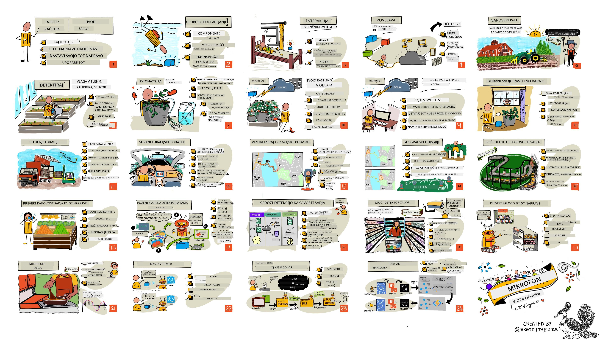

<!--
CO_OP_TRANSLATOR_METADATA:
{
  "original_hash": "6c354ec3487e4f6cfafbe44557996cd9",
  "translation_date": "2026-01-06T21:26:47+00:00",
  "source_file": "README.md",
  "language_code": "sl"
}
-->
[](https://github.com/microsoft/IoT-For-Beginners/blob/master/LICENSE)
[](https://GitHub.com/microsoft/IoT-For-Beginners/graphs/contributors/)
[](https://GitHub.com/microsoft/IoT-For-Beginners/issues/)
[](https://GitHub.com/microsoft/IoT-For-Beginners/pulls/)
[](http://makeapullrequest.com)

[](https://GitHub.com/microsoft/IoT-For-Beginners/watchers/)
[](https://GitHub.com/microsoft/IoT-For-Beginners/network/)
[](https://GitHub.com/microsoft/IoT-For-Beginners/stargazers/)

### Pridružite se skupnosti Azure AI Foundry

Če se zataknete ali imate kakršnakoli vprašanja o gradnji AI aplikacij. Pridružite se sošolcem in izkušenim razvijalcem v razpravah o MCP. To je podporna skupnost, kjer so vprašanja dobrodošla in se znanje prosto deli.

[](https://discord.gg/nTYy5BXMWG)

Če imate povratne informacije o izdelku ali napake med gradnjo, obiščite:

[](https://aka.ms/foundry/forum)

Sledite tem korakom, da začnete uporabljati te vire:
1. **Razvejite repozitorij**: Kliknite [](https://GitHub.com/microsoft/IoT-For-Beginners/fork)
2. **Klonirajte repozitorij**:   `git clone https://github.com/microsoft/IoT-For-Beginners.git`
3. [**Pridružite se Microsoft Foundry Discordu in spoznajte strokovnjake ter druge razvijalce**](https://discord.com/invite/ByRwuEEgH4)


### 🌐 Podpora več jezikov

#### Podprto preko GitHub Action (avtomatizirano in vedno posodobljeno)

<!-- CO-OP TRANSLATOR LANGUAGES TABLE START -->
[Arabic](../ar/README.md) | [Bengali](../bn/README.md) | [Bulgarian](../bg/README.md) | [Burmese (Myanmar)](../my/README.md) | [Chinese (Simplified)](../zh/README.md) | [Chinese (Traditional, Hong Kong)](../hk/README.md) | [Chinese (Traditional, Macau)](../mo/README.md) | [Chinese (Traditional, Taiwan)](../tw/README.md) | [Croatian](../hr/README.md) | [Czech](../cs/README.md) | [Danish](../da/README.md) | [Dutch](../nl/README.md) | [Estonian](../et/README.md) | [Finnish](../fi/README.md) | [French](../fr/README.md) | [German](../de/README.md) | [Greek](../el/README.md) | [Hebrew](../he/README.md) | [Hindi](../hi/README.md) | [Hungarian](../hu/README.md) | [Indonesian](../id/README.md) | [Italian](../it/README.md) | [Japanese](../ja/README.md) | [Kannada](../kn/README.md) | [Korean](../ko/README.md) | [Lithuanian](../lt/README.md) | [Malay](../ms/README.md) | [Malayalam](../ml/README.md) | [Marathi](../mr/README.md) | [Nepali](../ne/README.md) | [Nigerian Pidgin](../pcm/README.md) | [Norwegian](../no/README.md) | [Persian (Farsi)](../fa/README.md) | [Polish](../pl/README.md) | [Portuguese (Brazil)](../br/README.md) | [Portuguese (Portugal)](../pt/README.md) | [Punjabi (Gurmukhi)](../pa/README.md) | [Romanian](../ro/README.md) | [Russian](../ru/README.md) | [Serbian (Cyrillic)](../sr/README.md) | [Slovak](../sk/README.md) | [Slovenian](./README.md) | [Spanish](../es/README.md) | [Swahili](../sw/README.md) | [Swedish](../sv/README.md) | [Tagalog (Filipino)](../tl/README.md) | [Tamil](../ta/README.md) | [Telugu](../te/README.md) | [Thai](../th/README.md) | [Turkish](../tr/README.md) | [Ukrainian](../uk/README.md) | [Urdu](../ur/README.md) | [Vietnamese](../vi/README.md)

> **Raje klonirate lokalno?**

> Ta repozitorij vključuje več kot 50 prevodov jezikov, kar znatno poveča velikost prenosa. Za kloniranje brez prevodov uporabite sparse checkout:
> ```bash
> git clone --filter=blob:none --sparse https://github.com/microsoft/IoT-For-Beginners.git
> cd IoT-For-Beginners
> git sparse-checkout set --no-cone '/*' '!translations' '!translated_images'
> ```
> Tako boste dobili vse, kar potrebujete za dokončanje tečaja, z veliko hitrejšim prenosom.
<!-- CO-OP TRANSLATOR LANGUAGES TABLE END -->

# IoT za začetnike - program usposabljanja

Zagovorniki Azure Cloud pri Microsoftu z veseljem ponujajo 12-tedenski program z 24 lekcijami, ki pokrivajo osnove IoT. Vsaka lekcija vključuje pred- in po-lekcijske kvize, pisna navodila za dokončanje lekcije, rešitev, nalogo in več. Naša pedagogika, usmerjena na projekte, vam omogoča učenje med gradnjo, kar je dokazano učinkovit način za to, da nove veščine 'ostanejo'.

Projekti zajemajo pot hrane od kmetije do mize. To vključuje kmetijstvo, logistiko, proizvodnjo, maloprodajo in potrošnike – vse priljubljena industrijska področja za IoT naprave.



> Sketchnote avtorice [Nitya Narasimhan](https://github.com/nitya). Kliknite sliko za večjo verzijo.

**Iskrena hvala našim avtorjem [Jen Fox](https://github.com/jenfoxbot), [Jen Looper](https://github.com/jlooper), [Jim Bennett](https://github.com/jimbobbennett) ter naši umetnici skic [Nitya Narasimhan](https://github.com/nitya).**

**Hvala tudi naši ekipi [Microsoft Learn Student Ambassadors](https://studentambassadors.microsoft.com?WT.mc_id=academic-17441-jabenn), ki je pregledovala in prevajala ta program – [Aditya Garg](https://github.com/AdityaGarg00), [Anurag Sharma](https://github.com/Anurag-0-1-A), [Arpita Das](https://github.com/Arpiiitaaa), [Aryan Jain](https://www.linkedin.com/in/aryan-jain-47a4a1145/), [Bhavesh Suneja](https://github.com/EliteWarrior315), [Faith Hunja](https://faithhunja.github.io/), [Lateefah Bello](https://www.linkedin.com/in/lateefah-bello/), [Manvi Jha](https://github.com/Severus-Matthew), [Mireille Tan](https://www.linkedin.com/in/mireille-tan-a4834819a/), [Mohammad Iftekher (Iftu) Ebne Jalal](https://github.com/Iftu119), [Mohammad Zulfikar](https://github.com/mohzulfikar), [Priyanshu Srivastav](https://www.linkedin.com/in/priyanshu-srivastav-b067241ba), [Thanmai Gowducheruvu](https://github.com/innovation-platform) in [Zina Kamel](https://www.linkedin.com/in/zina-kamel/).**

Spoznajte ekipo!

[](https://youtu.be/-wippUJRi5k)

**Gif avtorja** [Mohit Jaisal](https://linkedin.com/in/mohitjaisal)

> 🎥 Kliknite zgornjo sliko za video o projektu!

> **Učitelji**, vključili smo nekaj [predlogov](for-teachers.md) o tem, kako uporabljati ta program. Če želite ustvariti lastne lekcije, smo prav tako vključili [predlogo lekcije](lesson-template/README.md).

> **Študenti** [https://aka.ms/student-page](https://aka.ms/student-page), če želite ta program uporabljati samostojno, razvejite celoten repozitorij in samostojno dokončajte naloge, začenši s predpredavanjsko kvizom, nato preberite predavanje in dokončajte ostale aktivnosti. Poskusite ustvarjati projekte tako, da razumete lekcije, namesto da kopirate rešitev kode; ta koda je na voljo v /solutions mapah v vsaki lekciji, usmerjeni na projekte. Druga ideja je oblikovati študijsko skupino s prijatelji in skupaj prebrati vsebine. Za nadaljnje učenje priporočamo [Microsoft Learn](https://docs.microsoft.com/users/jimbobbennett/collections/ke2ehd351jopwr?WT.mc_id=academic-17441-jabenn).

Za video pregled tega tečaja si oglejte ta video:

[](https://youtube.com/watch?v=bccEMm8gRuc "Promocijski video")

> 🎥 Kliknite zgornjo sliko za video o projektu!

## Pedagogika

Za ta program smo izbrali dve pedagoški načeli: zagotoviti, da je usmerjen na projekte in vključuje pogoste kvize. Ob koncu te serije bodo študenti izdelali sistem za spremljanje rastlin in zalivanje, vozilo tracker, pametno tovarno za sledenje in preverjanje hrane ter časovnik za kuhanje na glasovni nadzor, hkrati pa se bodo naučili osnov interneta stvari, vključno s pisanjem kode za naprave, povezovanjem v oblak, analizo telemetrije in izvajanjem umetne inteligence na robu.

S tem, ko zagotovimo, da se vsebine ujemajo s projekti, proces postane za študente bolj zanimiv, zadrževanje konceptov pa se okrepi.

Poleg tega nizko tvegani kviz pred predavanjem usmerja študenta k učenju teme, drugi kviz po predavanju pa zagotavlja dodatno zadrževanje znanja. Ta program je zasnovan tako, da je prilagodljiv in zabaven, ter ga lahko opravite celotnega ali delno. Projekti se začnejo majhni in postajajo vse bolj zapleteni do konca 12-tedenskega cikla.

Vsak projekt temelji na dejanski strojni opremi, ki je na voljo študentom in hobistom. Vsak projekt predstavlja specifično področje projekta in ponuja relevantno ozadje. Za uspešnega razvijalca je koristno razumeti področje, na katerem rešujete probleme; ta ozadja omogočajo študentom, da razmišljajo o svojih IoT rešitvah in učenju v kontekstu realnih problemov, ki jih lahko kot IoT razvijalci srečajo. Študenti razumejo 'zakaj' rešitev, ki jih gradijo, in dobijo spoštovanje do končnega uporabnika.

## Strojna oprema

Za projekte imamo na voljo dve možnosti IoT strojne opreme, odvisno od osebnih preferenc, znanja programskih jezikov, učnih ciljev in razpoložljivosti. Prav tako smo zagotovili 'virtualno strojno opremo' za tiste, ki nimajo dostopa do fizične opreme ali želijo izvedeti več pred nakupom. Več o tem in 'nakupovalni seznam' najdete na [strani o strojni opremi](./hardware.md), vključno s povezavami za nakup kompletov pri naših prijateljih iz Seeed Studio.
> 💁 Najdite naše smernice [Kodeks ravnanja](CODE_OF_CONDUCT.md), [Prispevanje](CONTRIBUTING.md) in [Prevajanje](TRANSLATIONS.md). Veselimo se vaših konstruktivnih povratnih informacij!
>
> 🔧 Imate težave? Oglejte si naš [Vodnik za odpravljanje težav](TROUBLESHOOTING.md) za rešitve pogostih težav.

## Vsaka lekcija vključuje:

- sketchnote
- neobvezni dodatni video
- predhodni kviz za ogrevanje
- pisno lekcijo
- za lekcije, ki temeljijo na projektu, korak za korakom vodiče, kako zgraditi projekt
- preverjanje znanja
- izziv
- dodatno branje
- nalogo
- [kviz po lekciji](https://ff-quizzes.netlify.app/en/)

> **Opomba o kvizih**: Vsi kvizi so shranjeni v mapi quiz-app, skupaj je 48 kvizov s tremi vprašanji vsak. Povezani so znotraj lekcij, vendar se kviz aplikacija lahko poganja lokalno ali pa se namesti na Azure; sledite navodilom v mapi `quiz-app`. Postopoma se izobražujejo tudi v druge jezike.

## Lekcije

|       |              Ime projekta              |                       Pojmi, ki se učijo                       | Cilji učenja                                                                                                                                                      |                                                        Povezana lekcija                                                         |
| :---: | :------------------------------------: | :-------------------------------------------------------------: | ---------------------------------------------------------------------------------------------------------------------------------------------------------------- | :------------------------------------------------------------------------------------------------------------------------------: |
|  01   | [Začetek](./1-getting-started/README.md) |                     Uvod v IoT                                 | Spoznajte osnovna načela IoT in osnovne gradnike IoT rešitev, kot so senzorji in oblačne storitve, medtem ko nastavljate svojo prvo IoT napravo                    |                      [Uvod v IoT](./1-getting-started/lessons/1-introduction-to-iot/README.md)                                    |
|  02   | [Začetek](./1-getting-started/README.md) |                   Poglobljen pogled v IoT                      | Spoznajte več o komponentah IoT sistema, mikrokrmilnikih in enojnih računalnikih                                                                                   |                        [Poglobljen pogled v IoT](./1-getting-started/lessons/2-deeper-dive/README.md)                             |
|  03   | [Začetek](./1-getting-started/README.md) | Interakcija s fizičnim svetom prek senzorjev in aktuatorjev     | Spoznajte senzorje za zbiranje podatkov iz fizičnega sveta in aktuatorje za pošiljanje povratnih informacij, medtem ko izdelujete nočno svetilko               | [Interakcija s fizičnim svetom prek senzorjev in aktuatorjev](./1-getting-started/lessons/3-sensors-and-actuators/README.md)    |
|  04   | [Začetek](./1-getting-started/README.md) |             Povežite svojo napravo z internetom                 | Spoznajte, kako povezati IoT napravo z internetom za pošiljanje in prejemanje sporočil z uporabo povezave nočne svetilke z MQTT strežnikom                      |               [Povežite svojo napravo z internetom](./1-getting-started/lessons/4-connect-internet/README.md)                   |
|  05   |            [Kmetija](./2-farm/README.md)            |                    Napovedovanje rasti rastlin                  | Naučite se napovedovati rast rastlin z uporabo podatkov o temperaturi, zajetih z IoT napravo                                                                      |                          [Napovedovanje rasti rastlin](./2-farm/lessons/1-predict-plant-growth/README.md)                       |
|  06   |            [Kmetija](./2-farm/README.md)            |                    Prepoznavanje vlage v tleh                   | Naučite se zaznati vlago v tleh in kalibrirati senzor vlažnosti tal                                                                                                |                          [Prepoznavanje vlage v tleh](./2-farm/lessons/2-detect-soil-moisture/README.md)                       |
|  07   |            [Kmetija](./2-farm/README.md)            |                  Avtomatizirano zalivanje rastlin               | Naučite se avtomatizirati in časovno uskladiti zalivanje z uporabo releja in MQTT                                                                                |                      [Avtomatizirano zalivanje rastlin](./2-farm/lessons/3-automated-plant-watering/README.md)                 |
|  08   |            [Kmetija](./2-farm/README.md)            |               Migrirajte svojo rastlino v oblak                 | Spoznajte oblak in oblačne IoT storitve ter kako povezati svojo rastlino na eno izmed njih namesto javnega MQTT strežnika                                         |               [Migrirajte svojo rastlino v oblak](./2-farm/lessons/4-migrate-your-plant-to-the-cloud/README.md)               |
|  09   |            [Kmetija](./2-farm/README.md)            |         Prenesite svojo aplikacijsko logiko v oblak             | Spoznajte, kako lahko napišete aplikacijsko logiko v oblaku, ki odgovarja na IoT sporočila                                                                        |         [Prenesite svojo aplikacijsko logiko v oblak](./2-farm/lessons/5-migrate-application-to-the-cloud/README.md)           |
|  10   |            [Kmetija](./2-farm/README.md)            |                   Zaščitite svojo rastlino                       | Spoznajte varnost v IoT in kako zaščititi svojo rastlino s ključi in certifikati                                                                                  |                        [Zaščitite svojo rastlino](./2-farm/lessons/6-keep-your-plant-secure/README.md)                         |
|  11   |       [Transport](./3-transport/README.md)       |                      Sledenje lokaciji                         | Spoznajte sledenje GPS lokacije za IoT naprave                                                                                                                    |                           [Sledenje lokaciji](./3-transport/lessons/1-location-tracking/README.md)                            |
|  12   |       [Transport](./3-transport/README.md)       |                     Shranjevanje lokacijskih podatkov          | Naučite se shranjevati IoT podatke za poznejšo vizualizacijo ali analizo                                                                                          |                         [Shranjevanje lokacijskih podatkov](./3-transport/lessons/2-store-location-data/README.md)             |
|  13   |       [Transport](./3-transport/README.md)       |                   Vizualizacija lokacijskih podatkov           | Spoznajte vizualizacijo lokacijskih podatkov na zemljevidu ter kako zemljevidi predstavljajo resnični 3D svet v 2 dimenzijah                                        |                     [Vizualizacija lokacijskih podatkov](./3-transport/lessons/3-visualize-location-data/README.md)            |
|  14   |       [Transport](./3-transport/README.md)       |                          Geografske ograje                     | Spoznajte geografske ograje in kako se uporabljajo za opozarjanje, ko so vozila v dobavni verigi blizu svoje destinacije                                         |                                   [Geografske ograje](./3-transport/lessons/4-geofences/README.md)                           |
|  15   |   [Proizvodnja](./4-manufacturing/README.md)   |               Usposabljanje zaznavalnika kakovosti sadja       | Spoznajte, kako usposobiti razvrščevalnik slik v oblaku za prepoznavanje kakovosti sadja                                                                          |                 [Usposabljanje zaznavalnika kakovosti sadja](./4-manufacturing/lessons/1-train-fruit-detector/README.md)        |
|  16   |   [Proizvodnja](./4-manufacturing/README.md)   |           Preverjanje kakovosti sadja z IoT napravo            | Spoznajte, kako uporabiti zaznavalnik kakovosti sadja z IoT napravo                                                                                             |           [Preverjanje kakovosti sadja z IoT napravo](./4-manufacturing/lessons/2-check-fruit-from-device/README.md)           |
|  17   |   [Proizvodnja](./4-manufacturing/README.md)   |             Poganjajte zaznavalnik sadja na robu               | Spoznajte, kako poganjati zaznavalnik sadja na IoT napravi na robu                                                                                               |             [Poganjajte zaznavalnik sadja na robu](./4-manufacturing/lessons/3-run-fruit-detector-edge/README.md)             |
|  18   |   [Proizvodnja](./4-manufacturing/README.md)   |        Aktivirajte zaznavanje kakovosti sadja s senzorjem      | Spoznajte, kako sprožiti zaznavanje kakovosti sadja s pomočjo senzorja                                                                                           |        [Aktivirajte zaznavanje kakovosti sadja s senzorjem](./4-manufacturing/lessons/4-trigger-fruit-detector/README.md)      |
|  19   |          [Trgovina](./5-retail/README.md)          |                   Usposabljanje zaznavalnika zaloge             | Naučite se uporabljati zaznavanje objektov za usposabljanje zaznavalnika zaloge za štetje zaloge v trgovini                                                    |                        [Usposabljanje zaznavalnika zaloge](./5-retail/lessons/1-train-stock-detector/README.md)                 |
|  20   |          [Trgovina](./5-retail/README.md)          |               Preverjanje zaloge z IoT napravo                 | Naučite se preverjati zalogo z IoT napravo z uporabo modela za zaznavanje objektov                                                                              |                     [Preverjanje zaloge z IoT napravo](./5-retail/lessons/2-check-stock-device/README.md)                      |
|  21   |        [Potrošnik](./6-consumer/README.md)        |             Prepoznavanje govora z IoT napravo                 | Naučite se prepoznavati govor iz IoT naprave za izdelavo pametnega časovnika                                                                                     |                  [Prepoznavanje govora z IoT napravo](./6-consumer/lessons/1-speech-recognition/README.md)                     |
|  22   |        [Potrošnik](./6-consumer/README.md)        |                     Razumevanje jezika                         | Naučite se razumeti stavke, izgovorjene IoT napravi                                                                                                              |                        [Razumevanje jezika](./6-consumer/lessons/2-language-understanding/README.md)                           |
|  23   |        [Potrošnik](./6-consumer/README.md)        |           Nastavite časovnik in zagotovite glasovno povratno informacijo    | Naučite se nastaviti časovnik na IoT napravi in zagotoviti glasovno povratno informacijo o nastavitvi in poteku časovnika                                      |                 [Nastavite časovnik in zagotovite glasovno povratno informacijo](./6-consumer/lessons/3-spoken-feedback/README.md)          |
|  24   |        [Potrošnik](./6-consumer/README.md)        |                 Podpora za več jezikov                         | Naučite se podpirati več jezikov, tako pri govoru kot pri odzivih vašega pametnega časovnika                                                                      |                   [Podpora za več jezikov](./6-consumer/lessons/4-multiple-language-support/README.md)                         |

## Dostop brez povezave

To dokumentacijo lahko uporabljate brez povezave z uporabo [Docsify](https://docsify.js.org/#/). Razvejajte ta repozitorij, [namestite Docsify](https://docsify.js.org/#/quickstart) na svojo lokalno napravo, nato pa v korenski mapi repozitorija zaženite ukaz `docsify serve`. Spletna stran bo na voljo na vratih 3000 na vašem lokalnem gostitelju: `localhost:3000`.

## Kviz

Hvala skupnosti za gostovanje interaktivnega kviza, ki preverja vaše znanje o vsakem poglavju. Svoje znanje lahko preizkusite [tukaj](https://ff-quizzes.netlify.app/en/).

### PDF

Če želite, lahko ustvarite PDF te vsebine za uporabo brez povezave. Prepričajte se, da imate [nameščen npm](https://docs.npmjs.com/downloading-and-installing-node-js-and-npm) in zaženite naslednje ukaze v korenski mapi tega repozitorija:

```sh
npm i
npm run convert
```

### Predstavitve (slides)

Za nekatere lekcije so na voljo predstavitve v mapi [slides](../../slides).

## Druge učne vsebine

Naša ekipa ustvarja tudi druge učne vsebine! Oglejte si:

<!-- CO-OP TRANSLATOR OTHER COURSES START -->
### LangChain
[](https://aka.ms/langchain4j-for-beginners)
[](https://aka.ms/langchainjs-for-beginners?WT.mc_id=m365-94501-dwahlin)

---

### Azure / Edge / MCP / Agenti
[](https://github.com/microsoft/AZD-for-beginners?WT.mc_id=academic-105485-koreyst)
[](https://github.com/microsoft/edgeai-for-beginners?WT.mc_id=academic-105485-koreyst)
[](https://github.com/microsoft/mcp-for-beginners?WT.mc_id=academic-105485-koreyst)
[](https://github.com/microsoft/ai-agents-for-beginners?WT.mc_id=academic-105485-koreyst)

---
 
### Serija Generativna AI
[](https://github.com/microsoft/generative-ai-for-beginners?WT.mc_id=academic-105485-koreyst)
[-9333EA?style=for-the-badge&labelColor=E5E7EB&color=9333EA)](https://github.com/microsoft/Generative-AI-for-beginners-dotnet?WT.mc_id=academic-105485-koreyst)
[-C084FC?style=for-the-badge&labelColor=E5E7EB&color=C084FC)](https://github.com/microsoft/generative-ai-for-beginners-java?WT.mc_id=academic-105485-koreyst)
[-E879F9?style=for-the-badge&labelColor=E5E7EB&color=E879F9)](https://github.com/microsoft/generative-ai-with-javascript?WT.mc_id=academic-105485-koreyst)

---
 
### Osnove učenja
[](https://aka.ms/ml-beginners?WT.mc_id=academic-105485-koreyst)
[](https://aka.ms/datascience-beginners?WT.mc_id=academic-105485-koreyst)
[](https://aka.ms/ai-beginners?WT.mc_id=academic-105485-koreyst)
[](https://github.com/microsoft/Security-101?WT.mc_id=academic-96948-sayoung)
[](https://aka.ms/webdev-beginners?WT.mc_id=academic-105485-koreyst)
[](https://aka.ms/iot-beginners?WT.mc_id=academic-105485-koreyst)
[](https://github.com/microsoft/xr-development-for-beginners?WT.mc_id=academic-105485-koreyst)

---
 
### Serija Copilot
[](https://aka.ms/GitHubCopilotAI?WT.mc_id=academic-105485-koreyst)
[](https://github.com/microsoft/mastering-github-copilot-for-dotnet-csharp-developers?WT.mc_id=academic-105485-koreyst)
[](https://github.com/microsoft/CopilotAdventures?WT.mc_id=academic-105485-koreyst)
<!-- CO-OP TRANSLATOR OTHER COURSES END -->

## Priznanja za slike

Vse navedbe za slike, uporabljene v tem kurikulumu, kjer je to potrebno, lahko najdete v [Priznanja](./attributions.md).

---

<!-- CO-OP TRANSLATOR DISCLAIMER START -->
**Opozorilo**:
Ta dokument je bil preveden z uporabo storitve za prevajanje z umetno inteligenco [Co-op Translator](https://github.com/Azure/co-op-translator). Čeprav si prizadevamo za natančnost, vas prosimo, da upoštevate, da lahko avtomatizirani prevodi vsebujejo napake ali netočnosti. Izvirni dokument v njegovem izvirnem jeziku velja za avtoritativni vir. Za pomembne informacije priporočamo strokoven prevod s strani človeka. Nismo odgovorni za kakršne koli nesporazume ali napačne razlage, ki bi nastale zaradi uporabe tega prevoda.
<!-- CO-OP TRANSLATOR DISCLAIMER END -->