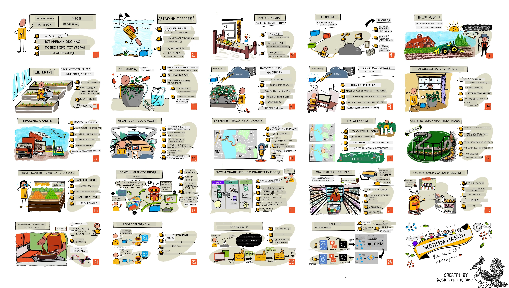

<!--
CO_OP_TRANSLATOR_METADATA:
{
  "original_hash": "6c354ec3487e4f6cfafbe44557996cd9",
  "translation_date": "2026-01-06T21:23:42+00:00",
  "source_file": "README.md",
  "language_code": "sr"
}
-->
[](https://github.com/microsoft/IoT-For-Beginners/blob/master/LICENSE)
[](https://GitHub.com/microsoft/IoT-For-Beginners/graphs/contributors/)
[](https://GitHub.com/microsoft/IoT-For-Beginners/issues/)
[](https://GitHub.com/microsoft/IoT-For-Beginners/pulls/)
[](http://makeapullrequest.com)

[](https://GitHub.com/microsoft/IoT-For-Beginners/watchers/)
[](https://GitHub.com/microsoft/IoT-For-Beginners/network/)
[](https://GitHub.com/microsoft/IoT-For-Beginners/stargazers/)

### Придружите се заједници Azure AI Foundry

Ако заглавите или имате било каква питања о изградњи AI апликација. Придружите се другим ученицима и искусним програмерима у дискусијама о MCP. То је подршка заједница у којој су питања добродошла и знање се слободно дели.

[](https://discord.gg/nTYy5BXMWG)

Ако имате повратне информације о производу или грешке током изградње посјетите:

[](https://aka.ms/foundry/forum)

Пратите ове кораке да бисте започели коришћење ових ресурса:
1. **Направите форк репозиторијума**: Кликните [](https://GitHub.com/microsoft/IoT-For-Beginners/fork)
2. **Клонирајте репозиторијум**:   `git clone https://github.com/microsoft/IoT-For-Beginners.git`
3. [**Придружите се Microsoft Foundry Discord-у и упознајте експерте и друге програмере**](https://discord.com/invite/ByRwuEEgH4)


### 🌐 Подршка за више језика

#### Подржано путем GitHub акције (аутоматски и увек ажурирано)

<!-- CO-OP TRANSLATOR LANGUAGES TABLE START -->
[Arabic](../ar/README.md) | [Bengali](../bn/README.md) | [Bulgarian](../bg/README.md) | [Burmese (Myanmar)](../my/README.md) | [Chinese (Simplified)](../zh/README.md) | [Chinese (Traditional, Hong Kong)](../hk/README.md) | [Chinese (Traditional, Macau)](../mo/README.md) | [Chinese (Traditional, Taiwan)](../tw/README.md) | [Croatian](../hr/README.md) | [Czech](../cs/README.md) | [Danish](../da/README.md) | [Dutch](../nl/README.md) | [Estonian](../et/README.md) | [Finnish](../fi/README.md) | [French](../fr/README.md) | [German](../de/README.md) | [Greek](../el/README.md) | [Hebrew](../he/README.md) | [Hindi](../hi/README.md) | [Hungarian](../hu/README.md) | [Indonesian](../id/README.md) | [Italian](../it/README.md) | [Japanese](../ja/README.md) | [Kannada](../kn/README.md) | [Korean](../ko/README.md) | [Lithuanian](../lt/README.md) | [Malay](../ms/README.md) | [Malayalam](../ml/README.md) | [Marathi](../mr/README.md) | [Nepali](../ne/README.md) | [Nigerian Pidgin](../pcm/README.md) | [Norwegian](../no/README.md) | [Persian (Farsi)](../fa/README.md) | [Polish](../pl/README.md) | [Portuguese (Brazil)](../br/README.md) | [Portuguese (Portugal)](../pt/README.md) | [Punjabi (Gurmukhi)](../pa/README.md) | [Romanian](../ro/README.md) | [Russian](../ru/README.md) | [Serbian (Cyrillic)](./README.md) | [Slovak](../sk/README.md) | [Slovenian](../sl/README.md) | [Spanish](../es/README.md) | [Swahili](../sw/README.md) | [Swedish](../sv/README.md) | [Tagalog (Filipino)](../tl/README.md) | [Tamil](../ta/README.md) | [Telugu](../te/README.md) | [Thai](../th/README.md) | [Turkish](../tr/README.md) | [Ukrainian](../uk/README.md) | [Urdu](../ur/README.md) | [Vietnamese](../vi/README.md)

> **Више волите да клонирате локално?**

> Овај репозиторијум укључује преко 50 превода језика што значајно повећава величину преузимања. Да бисте клонирали без превода, користите sparse checkout:
> ```bash
> git clone --filter=blob:none --sparse https://github.com/microsoft/IoT-For-Beginners.git
> cd IoT-For-Beginners
> git sparse-checkout set --no-cone '/*' '!translations' '!translated_images'
> ```
> Ово вам даје све што вам је потребно да завршите курс уз много брже преузимање.
<!-- CO-OP TRANSLATOR LANGUAGES TABLE END -->

# IoT за почетнике - Наставни план

Azure Cloud Advocates у Microsoft-у са задовољством нуде 12-недељни, 24-лекцијски наставни план који обрађује основе IoT-а. Свако предавање укључује предтест и посттест, писане инструкције за извођење лекције, решење, задатак и још много тога. Наша педагогија заснована на пројектима омогућава вам учење кроз градњу, што је доказан начин да нове вештине "пристану".

Пројекти обухватају пут хране од фарме до стола. То укључује пољопривреду, логистику, производњу, трговину и потрошачку индустрију - све популарна индустријска подручја за IoT уређаје.



> Скетчнот од [Nitya Narasimhan](https://github.com/nitya). Кликните слику за већу верзију.

**Велика захвалност нашим ауторима [Jen Fox](https://github.com/jenfoxbot), [Jen Looper](https://github.com/jlooper), [Jim Bennett](https://github.com/jimbobbennett) и нашем цртачу скетчнота [Nitya Narasimhan](https://github.com/nitya).**

**Хвала и нашем тиму [Microsoft Learn Student Ambassadors](https://studentambassadors.microsoft.com?WT.mc_id=academic-17441-jabenn) који су прегледали и преводили овај наставни план - [Aditya Garg](https://github.com/AdityaGarg00), [Anurag Sharma](https://github.com/Anurag-0-1-A), [Arpita Das](https://github.com/Arpiiitaaa), [Aryan Jain](https://www.linkedin.com/in/aryan-jain-47a4a1145/), [Bhavesh Suneja](https://github.com/EliteWarrior315), [Faith Hunja](https://faithhunja.github.io/), [Lateefah Bello](https://www.linkedin.com/in/lateefah-bello/), [Manvi Jha](https://github.com/Severus-Matthew), [Mireille Tan](https://www.linkedin.com/in/mireille-tan-a4834819a/), [Mohammad Iftekher (Iftu) Ebne Jalal](https://github.com/Iftu119), [Mohammad Zulfikar](https://github.com/mohzulfikar), [Priyanshu Srivastav](https://www.linkedin.com/in/priyanshu-srivastav-b067241ba), [Thanmai Gowducheruvu](https://github.com/innovation-platform) и [Zina Kamel](https://www.linkedin.com/in/zina-kamel/).**

Упознајте тим!

[](https://youtu.be/-wippUJRi5k)

**Гиф од** [Mohit Jaisal](https://linkedin.com/in/mohitjaisal)

> 🎥 Кликните слику изнад за видео о пројекту!

> **Наставници**, укључили смо [неке предлоге](for-teachers.md) како да користите овај наставни план. Ако желите да направите своје лекције, укључили смо и [шаблон лекције](lesson-template/README.md).

> **[Студенти](https://aka.ms/student-page)**, да бисте користили овај наставни план самостално, форкујте цео репо и радите вежбе сами, почевши са квизом пре предавања, затим прочитајте лекцију и завршите остатак активности. Покушајте да креирате пројекте разумејући лекције уместо да копирате код решења; међутим, тај код је доступан у фасциклама /solutions у свакој лекцији оријентисаној на пројекте. Још једна идеја је да формирате студијску групу са пријатељима и прођете кроз материјал заједно. За даље учење препоручујемо [Microsoft Learn](https://docs.microsoft.com/users/jimbobbennett/collections/ke2ehd351jopwr?WT.mc_id=academic-17441-jabenn).

За видео преглед овог курса, погледајте овај видео:

[](https://youtube.com/watch?v=bccEMm8gRuc "Promo video")

> 🎥 Кликните слику изнад за видео о пројекту!

## Педагохија

Изабрали смо два педагошка начела приликом израде овог наставног плана: обезбедити да буде заснован на пројектима и да укључује честе квизове. На крају серије, студенти ће направити систем за праћење и заливање биљака, пратиоца возила, паметну фабрику за праћење и контролу хране, и тајмер за кување који се контролише гласом, и научиће основе Интернета ствари укључујући писање кода за уређаје, повезивање са облаком, анализу телеметрије и извођење AI на ивици.

Обезбеђивањем да садржај буде усклађен са пројектима, процес постаје занимљивији за студенте, а задржавање концепата се побољшава.

Поред тога, квиз са ниским улогом пре часа поставља намеру студента ка учењу одређене теме, док други квиз након часа обезбеђује даље задржавање знања. Овај наставни план дизајниран је да буде флексибилан и забаван и може се пратити у целини или делимично. Пројекти почињу једноставни и све више се компликују до краја 12-недељног циклуса.

Свaki пројекат базиран је на стварном хардверу доступном студентима и хобистима. Свaki пројекат истражује специфичан домен пројекта обезбеђујући релевантно основно знање. Да бисте били успешан програмер, корисно је разумети домен у којем решавате проблеме, а пружање овог основног знања омогућава студентима да размишљају о својим IoT решењима и учењима у контексту врсте стварног проблема који би им могао бити тражен као IoT програмеру. Студенти уче зашто граде решења и добијају увида у крајњег корисника.

## Хардвер

Имамо два избора IoT хардвера за коришћење у пројектима, зависно од личних преференција, знања програмских језика, циљева учења и доступности. Такође смо обезбедили верзију 'виртуалног хардвера' за оне који немају приступ хардверу или желе више да науче пре него што се одлуче на куповину. Можете прочитати више и пронаћи 'списак за куповину' на [hardware page](./hardware.md), укључујући линкове за куповину комплетних комплета од наших пријатеља у Seeed Studio.
> 💁 Пронађите наш [Кодекс понашања](CODE_OF_CONDUCT.md), [Упутства за допринос](CONTRIBUTING.md) и [Преводилачке смернице](TRANSLATIONS.md). Добродошли су ваши конструктивни предлози!
>
> 🔧 Имате проблема? Погледајте наш [Водич за решавање проблема](TROUBLESHOOTING.md) за решења уобичајених проблема.

## Свака лекција обухвата:

- скетчнот
- опционални додатни видео
- квиз за загревање пре лекције
- писану лекцију
- за лекције засноване на пројектима, водич корак по корак како направити пројекат
- провере знања
- изазов
- додатну литературу
- задатак
- [квиз после лекције](https://ff-quizzes.netlify.app/en/)

> **Напомена о квизовима**: Сви квизови се налазе у фасцикли quiz-app, укупно 48 квизова са по три питања. Они су повезани унутар лекција, али апликација за квиз се може покренути локално или распоредити на Azure; пратите упутства у фасцикли `quiz-app`. Квизи се постепено преводе.

## Лекције

|       |              Име пројекта              |                       Премацирани концепти                       | Циљеви учења                                                                                                                                                       |                                                        Повезана лекција                                                         |
| :---: | :------------------------------------: | :--------------------------------------------------------------: | ----------------------------------------------------------------------------------------------------------------------------------------------------------------- | :------------------------------------------------------------------------------------------------------------------------------: |
|  01   | [Започињање](./1-getting-started/README.md) |                     Увод у IoT                     | Научите основне принципе IoT и основне саставне делове IoT решења као што су сензори и облачне услуге док подешавате свој први IoT уређај |                      [Увод у IoT](./1-getting-started/lessons/1-introduction-to-iot/README.md)                      |
|  02   | [Започињање](./1-getting-started/README.md) |                   Детаљнији преглед IoT                    | Сазнајте више о компонентама IoT система, као и о микроконтролерима и рачунарима на једној плочи                                                            |                        [Детаљнији преглед IoT](./1-getting-started/lessons/2-deeper-dive/README.md)                         |
|  03   | [Започињање](./1-getting-started/README.md) | Интеракција са физичким светом помоћу сензора и актуатора | Научите о сензорима за прикупљање података из физичког света и актуаторима за слање повратних информација док правите ноћно светло                                           | [Интеракција са физичким светом помоћу сензора и актуатора](./1-getting-started/lessons/3-sensors-and-actuators/README.md) |
|  04   | [Започињање](./1-getting-started/README.md) |             Повежите свој уређај на Интернет             | Научите како повезати IoT уређај на Интернет за слање и примање порука повезујући своје ноћно светло са MQTT брокером                               |               [Повезите свој уређај на Интернет](./1-getting-started/lessons/4-connect-internet/README.md)                |
|  05   |            [Пољопривреда](./2-farm/README.md)            |                    Прогнозирање раста биљака                     | Научите како да предвидите раст биљака коришћењем података о температури прикупљених IoT уређајем                                                                                  |                          [Прогнозирање раста биљака](./2-farm/lessons/1-predict-plant-growth/README.md)                           |
|  06   |            [Пољопривреда](./2-farm/README.md)            |                    Детекција влаге у земљишту                     | Научите како да детектујете влагу у земљишту и калибрирате сензор влаге у земљишту                                                                                              |                          [Детекција влаге у земљишту](./2-farm/lessons/2-detect-soil-moisture/README.md)                           |
|  07   |            [Пољопривреда](./2-farm/README.md)            |                  Аутоматско заливање биљака                   | Научите како да аутоматизујете и временски подесите заливање користећи релеј и MQTT                                                                                                      |                      [Аутоматско заливање биљака](./2-farm/lessons/3-automated-plant-watering/README.md)                       |
|  08   |            [Пољопривреда](./2-farm/README.md)            |               Миграција биљке у облак               | Научите о облаку и IoT услугама у облаку и како повезати своју биљку са једном од њих уместо са јавним MQTT брокером                                   |               [Миграција биљке у облак](./2-farm/lessons/4-migrate-your-plant-to-the-cloud/README.md)                |
|  09   |            [Пољопривреда](./2-farm/README.md)            |         Миграција логике апликације у облак         | Научите како можете написати логику апликације у облаку која одговара на IoT поруке                                                                          |         [Миграција логике апликације у облак](./2-farm/lessons/5-migrate-application-to-the-cloud/README.md)         |
|  10   |            [Пољопривреда](./2-farm/README.md)            |                   Заштитите своју биљку                    | Научите о безбедности у IoT-у и како да заштитите своју биљку помоћу кључева и сертификата                                                                          |                        [Заштитите своју биљку](./2-farm/lessons/6-keep-your-plant-secure/README.md)                         |
|  11   |       [Транспорт](./3-transport/README.md)       |                      Праћење локације                      | Научите о GPS праћењу локације за IoT уређаје                                                                                                                   |                           [Праћење локације](./3-transport/lessons/1-location-tracking/README.md)                           |
|  12   |       [Транспорт](./3-transport/README.md)       |                     Складиштење података о локацији                     | Научите како да складиштите IoT податке ради касније визуализације или анализе                                                                                                      |                         [Складиштење података о локацији](./3-transport/lessons/2-store-location-data/README.md)                         |
|  13   |       [Транспорт](./3-transport/README.md)       |                   Визуелизација података о локацији                   | Научите о визуализацији података о локацији на мапи и како мапе представљају стварни 3Д свет у 2 димензије                                                            |                     [Визуелизација података о локацији](./3-transport/lessons/3-visualize-location-data/README.md)                     |
|  14   |       [Транспорт](./3-transport/README.md)       |                          Геозоне                          | Научите о геозонама и како могу да се користе за узбуњење када су возила у ланцу снабдевања близу своје дестинације                                           |                                   [Геозоне](./3-transport/lessons/4-geofences/README.md)                                   |
|  15   |   [Производња](./4-manufacturing/README.md)   |               Тренирање детектора квалитета воћа                | Научите о тренирању класификатора слика у облаку за детекцију квалитета воћа                                                                                       |                 [Тренирање детектора квалитета воћа](./4-manufacturing/lessons/1-train-fruit-detector/README.md)                 |
|  16   |   [Производња](./4-manufacturing/README.md)   |           Провера квалитета воћа са IoT уређаја            | Научите о коришћењу детектора квалитета воћа са IoT уређаја                                                                                                    |           [Провера квалитета воћа са IoT уређаја](./4-manufacturing/lessons/2-check-fruit-from-device/README.md)            |
|  17   |   [Производња](./4-manufacturing/README.md)   |             Покретање детектора воћа на ивици             | Научите о покретању детектора воћа на IoT уређају на ивици                                                                                                |             [Покретање детектора воћа на ивици](./4-manufacturing/lessons/3-run-fruit-detector-edge/README.md)             |
|  18   |   [Производња](./4-manufacturing/README.md)   |        Триггеровање детекције квалитета воћа са сензора        | Научите о триггеровању детекције квалитета воћа са сензора                                                                                                        |        [Триггеровање детекције квалитета воћа са сензора](./4-manufacturing/lessons/4-trigger-fruit-detector/README.md)         |
|  19   |          [Малопродаја](./5-retail/README.md)          |                   Тренирање детектора залиха                    | Научите како да користите детекцију објеката за тренинг детектора залиха за бројање залиха у продавници                                                                                |                        [Тренирање детектора залиха](./5-retail/lessons/1-train-stock-detector/README.md)                         |
|  20   |          [Малопродаја](./5-retail/README.md)          |               Провера залиха са IoT уређаја                | Научите како да проверите залихе са IoT уређаја користећи модел за детекцију објеката                                                                                         |                     [Провера залиха са IoT уређаја](./5-retail/lessons/2-check-stock-device/README.md)                      |
|  21   |        [Потрошачки уређаји](./6-consumer/README.md)        |             Препознавање говора са IoT уређаја             | Научите како да препознате говор са IoT уређаја како бисте направили паметни тајмер                                                                                             |                  [Препознавање говора са IoT уређаја](./6-consumer/lessons/1-speech-recognition/README.md)                  |
|  22   |        [Потрошачки уређаји](./6-consumer/README.md)        |                     Разумевање језика                     | Научите како да разумете реченице упућене IoT уређају                                                                                                           |                        [Разумевање језика](./6-consumer/lessons/2-language-understanding/README.md)                        |
|  23   |        [Потрошачки уређаји](./6-consumer/README.md)        |           Поставите тајмер и пружите говорну повратну информацију           | Научите како да поставите тајмер на IoT уређају и да пружите говорну повратну информацију о постављању и завршетку тајмера                                                    |                 [Поставите тајмер и пружите говорну повратну информацију](./6-consumer/lessons/3-spoken-feedback/README.md)                  |
|  24   |        [Потрошачки уређаји](./6-consumer/README.md)        |                 Подршка за више језика                  | Научите како да подржите више језика, како када Вам се говори тако и у одговорима вашег паметног тајмера                                                               |                   [Подршка за више језика](./6-consumer/lessons/4-multiple-language-support/README.md)                   |

## Приступ ван мреже

Можете да покренете ову документацију ван мреже користећи [Docsify](https://docsify.js.org/#/). Форкујте овај репозиторијум, [инсталирајте Docsify](https://docsify.js.org/#/quickstart) на својој локалној машини, затим у коренској фасцикли овог репозиторијума укуцајте `docsify serve`. Вебсајт ће бити доступан на порту 3000 на вашем localhost-у: `localhost:3000`.

## Квиз

Захваљујући заједници која је обезбедила интерактивни квиз за проверу вашег знања о сваком од поглавља. Тестирајте своје знање [овде](https://ff-quizzes.netlify.app/en/) 

### PDF

Можете генерисати PDF ове садржине за приступ ван мреже ако је потребно. Да бисте то урадили, уверите се да имате [инсталиран npm](https://docs.npmjs.com/downloading-and-installing-node-js-and-npm) и покрените следеће команде у коренској фасцикли овог репозиторијума:

```sh
npm i
npm run convert
```

### Плајсдекови

Постоје презентације за неке од лекција у фасцикли [slides](../../slides).

## Други курикулуми

Наш тим производи и друге курикулуме! Погледајте:

<!-- CO-OP TRANSLATOR OTHER COURSES START -->
### LangChain
[](https://aka.ms/langchain4j-for-beginners)
[](https://aka.ms/langchainjs-for-beginners?WT.mc_id=m365-94501-dwahlin)

---

### Azure / Edge / MCP / Agents
[](https://github.com/microsoft/AZD-for-beginners?WT.mc_id=academic-105485-koreyst)
[](https://github.com/microsoft/edgeai-for-beginners?WT.mc_id=academic-105485-koreyst)
[](https://github.com/microsoft/mcp-for-beginners?WT.mc_id=academic-105485-koreyst)
[](https://github.com/microsoft/ai-agents-for-beginners?WT.mc_id=academic-105485-koreyst)

---
 
### Генеративна серија вештачке интелигенције
[](https://github.com/microsoft/generative-ai-for-beginners?WT.mc_id=academic-105485-koreyst)
[-9333EA?style=for-the-badge&labelColor=E5E7EB&color=9333EA)](https://github.com/microsoft/Generative-AI-for-beginners-dotnet?WT.mc_id=academic-105485-koreyst)
[-C084FC?style=for-the-badge&labelColor=E5E7EB&color=C084FC)](https://github.com/microsoft/generative-ai-for-beginners-java?WT.mc_id=academic-105485-koreyst)
[-E879F9?style=for-the-badge&labelColor=E5E7EB&color=E879F9)](https://github.com/microsoft/generative-ai-with-javascript?WT.mc_id=academic-105485-koreyst)

---
 
### Основно учење
[](https://aka.ms/ml-beginners?WT.mc_id=academic-105485-koreyst)
[](https://aka.ms/datascience-beginners?WT.mc_id=academic-105485-koreyst)
[](https://aka.ms/ai-beginners?WT.mc_id=academic-105485-koreyst)
[](https://github.com/microsoft/Security-101?WT.mc_id=academic-96948-sayoung)
[](https://aka.ms/webdev-beginners?WT.mc_id=academic-105485-koreyst)
[](https://aka.ms/iot-beginners?WT.mc_id=academic-105485-koreyst)
[](https://github.com/microsoft/xr-development-for-beginners?WT.mc_id=academic-105485-koreyst)

---
 
### Копилот серија
[](https://aka.ms/GitHubCopilotAI?WT.mc_id=academic-105485-koreyst)
[](https://github.com/microsoft/mastering-github-copilot-for-dotnet-csharp-developers?WT.mc_id=academic-105485-koreyst)
[](https://github.com/microsoft/CopilotAdventures?WT.mc_id=academic-105485-koreyst)
<!-- CO-OP TRANSLATOR OTHER COURSES END -->

## Приписивања слика

Сва приписивања за слике коришћене у овом курикулуму можете пронаћи у [Приписивањима](./attributions.md).

---

<!-- CO-OP TRANSLATOR DISCLAIMER START -->
**Одрицање од одговорности**:
Овај документ је преведен коришћењем услуге за аутоматски превод [Co-op Translator](https://github.com/Azure/co-op-translator). Иако тежимо прецизности, имајте у виду да аутоматски преводи могу садржати грешке или нетачности. Оригинални документ на његовом изворном језику треба сматрати ауторитетом. За критичне информације препоручује се професионални превод од стране људског преводиоца. Нисмо одговорни за било какве неспоразуме или погрешна тумачења која произилазе из употребе овог превода.
<!-- CO-OP TRANSLATOR DISCLAIMER END -->