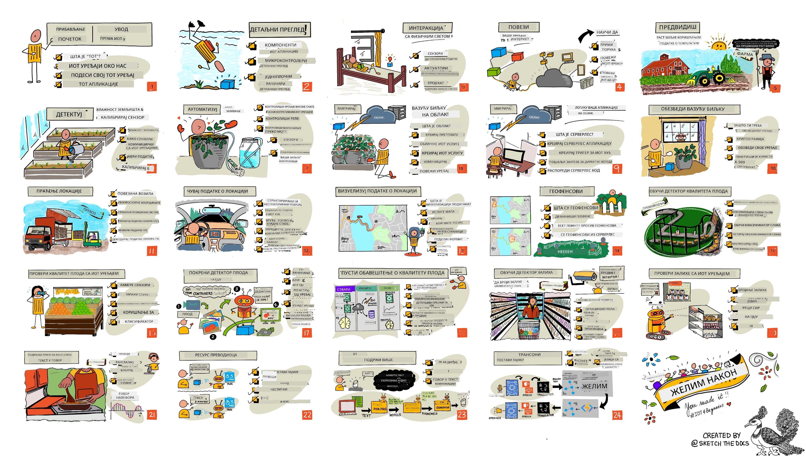

[](https://github.com/microsoft/IoT-For-Beginners/blob/master/LICENSE)
[](https://GitHub.com/microsoft/IoT-For-Beginners/graphs/contributors/)
[](https://GitHub.com/microsoft/IoT-For-Beginners/issues/)
[](https://GitHub.com/microsoft/IoT-For-Beginners/pulls/)
[](http://makeapullrequest.com)

[](https://GitHub.com/microsoft/IoT-For-Beginners/watchers/)
[](https://GitHub.com/microsoft/IoT-For-Beginners/network/)
[](https://GitHub.com/microsoft/IoT-For-Beginners/stargazers/)

### Придружите се заједници Azure AI Foundry

Ако заглавите или имате било каквих питања о изградњи AI апликација. Придружите се другим ученицима и искусним програмерима у дискусијама о MCP. То је подржавајућа заједница у којој су питања добродошла и знање се слободно дели.

[](https://discord.gg/nTYy5BXMWG)

Ако имате повратне информације о производу или грешке током изградње посетите:

[](https://aka.ms/foundry/forum)

Пратите ове кораке за почетак коришћења ових ресурса:
1. **Направите форк Репозиторијума**: Кликните [](https://GitHub.com/microsoft/IoT-For-Beginners/fork)
2. **Клонирајте Репозиторијум**:   `git clone https://github.com/microsoft/IoT-For-Beginners.git`
3. [**Придружите се Microsot Foundry Discord-у и упознајте експерте и колеге програмере**](https://discord.com/invite/ByRwuEEgH4)


### 🌐 Подршка за више језика

#### Подржано преко GitHub Action (Аутоматизовано и увек ажурирано)

<!-- CO-OP TRANSLATOR LANGUAGES TABLE START -->
[Arabic](../ar/README.md) | [Bengali](../bn/README.md) | [Bulgarian](../bg/README.md) | [Burmese (Myanmar)](../my/README.md) | [Chinese (Simplified)](../zh-CN/README.md) | [Chinese (Traditional, Hong Kong)](../zh-HK/README.md) | [Chinese (Traditional, Macau)](../zh-MO/README.md) | [Chinese (Traditional, Taiwan)](../zh-TW/README.md) | [Croatian](../hr/README.md) | [Czech](../cs/README.md) | [Danish](../da/README.md) | [Dutch](../nl/README.md) | [Estonian](../et/README.md) | [Finnish](../fi/README.md) | [French](../fr/README.md) | [German](../de/README.md) | [Greek](../el/README.md) | [Hebrew](../he/README.md) | [Hindi](../hi/README.md) | [Hungarian](../hu/README.md) | [Indonesian](../id/README.md) | [Italian](../it/README.md) | [Japanese](../ja/README.md) | [Kannada](../kn/README.md) | [Khmer](../km/README.md) | [Korean](../ko/README.md) | [Lithuanian](../lt/README.md) | [Malay](../ms/README.md) | [Malayalam](../ml/README.md) | [Marathi](../mr/README.md) | [Nepali](../ne/README.md) | [Nigerian Pidgin](../pcm/README.md) | [Norwegian](../no/README.md) | [Persian (Farsi)](../fa/README.md) | [Polish](../pl/README.md) | [Portuguese (Brazil)](../pt-BR/README.md) | [Portuguese (Portugal)](../pt-PT/README.md) | [Punjabi (Gurmukhi)](../pa/README.md) | [Romanian](../ro/README.md) | [Russian](../ru/README.md) | [Serbian (Cyrillic)](./README.md) | [Slovak](../sk/README.md) | [Slovenian](../sl/README.md) | [Spanish](../es/README.md) | [Swahili](../sw/README.md) | [Swedish](../sv/README.md) | [Tagalog (Filipino)](../tl/README.md) | [Tamil](../ta/README.md) | [Telugu](../te/README.md) | [Thai](../th/README.md) | [Turkish](../tr/README.md) | [Ukrainian](../uk/README.md) | [Urdu](../ur/README.md) | [Vietnamese](../vi/README.md)

> **Више волите локално да клонирате?**
>
> Овај репозиторијум укључује 50+ превода језика што значајно повећава величину преузимања. Да бисте клонирали без превода, користите спарс чек-аут:
>
> **Bash / macOS / Linux:**
> ```bash
> git clone --filter=blob:none --sparse https://github.com/microsoft/IoT-For-Beginners.git
> cd IoT-For-Beginners
> git sparse-checkout set --no-cone '/*' '!translations' '!translated_images'
> ```
>
> **CMD (Windows):**
> ```cmd
> git clone --filter=blob:none --sparse https://github.com/microsoft/IoT-For-Beginners.git
> cd IoT-For-Beginners
> git sparse-checkout set --no-cone "/*" "!translations" "!translated_images"
> ```
>
> Ово вам даје све што је потребно за завршетак курса са много бржим преузимањем.
<!-- CO-OP TRANSLATOR LANGUAGES TABLE END -->

# IoT за почетнике - Наставни план

Azure Cloud заговорници у Microsoft-у са задовољством нуде 12-недељни, 24-лекцијски наставни план о основама IoT-а. Свака лекција укључује квизове пре и после лекције, писана упутства за завршетак лекције, решење, задатак и још много тога. Наша педагогија заснована на пројектима омогућава вам да учите правећи, доказани начин да нове вештине „прикачите“.

Пројекти покривају путовање хране од фарме до стола. Ово обухвата пољопривреду, логистику, производњу, продају и потрошача - све популарне индустријске области за IoT уређаје.



> Скечнот од [Nitya Narasimhan](https://github.com/nitya). Кликните на слику за већу верзију.

**Срдачна захвала нашим ауторима [Jen Fox](https://github.com/jenfoxbot), [Jen Looper](https://github.com/jlooper), [Jim Bennett](https://github.com/jimbobbennett), и нашем уметнику скечнота [Nitya Narasimhan](https://github.com/nitya).**

**Хвала и нашем тиму [Microsoft Learn Student Ambassadors](https://studentambassadors.microsoft.com?WT.mc_id=academic-17441-jabenn) који су прегледали и преводили овај наставни план - [Aditya Garg](https://github.com/AdityaGarg00), [Anurag Sharma](https://github.com/Anurag-0-1-A), [Arpita Das](https://github.com/Arpiiitaaa), [Aryan Jain](https://www.linkedin.com/in/aryan-jain-47a4a1145/), [Bhavesh Suneja](https://github.com/EliteWarrior315), [Faith Hunja](https://faithhunja.github.io/), [Lateefah Bello](https://www.linkedin.com/in/lateefah-bello/), [Manvi Jha](https://github.com/Severus-Matthew), [Mireille Tan](https://www.linkedin.com/in/mireille-tan-a4834819a/), [Mohammad Iftekher (Iftu) Ebne Jalal](https://github.com/Iftu119), [Mohammad Zulfikar](https://github.com/mohzulfikar), [Priyanshu Srivastav](https://www.linkedin.com/in/priyanshu-srivastav-b067241ba), [Thanmai Gowducheruvu](https://github.com/innovation-platform), и [Zina Kamel](https://www.linkedin.com/in/zina-kamel/).**

Упознајте тим!

[](https://youtu.be/-wippUJRi5k)

**Гиф од** [Mohit Jaisal](https://linkedin.com/in/mohitjaisal)

> 🎥 Кликните на слику изнад за видео о пројекту!

> **Наставници**, укључили смо неке [предлоге](for-teachers.md) о томе како користити овај наставни план. Ако желите да направите своје лекције, такође смо укључили [шаблон лекције](lesson-template/README.md).

> **Студенти** ([https://aka.ms/student-page](https://aka.ms/student-page)), да бисте користили овај наставни план сами, направите форк целог репозиторијума и сами завршите вежбе, почевши од квиза пре предавања, затим читањем предавања и завршетком осталих активности. Покушајте да направите пројекте разумејући лекције, а не копирајући решења; ипак, тај код је доступан у фасциклама /solutions у свакој лекцији оријентисаној ка пројекту. Још једна идеја је да формирате студијску групу са пријатељима и прођете кроз садржај заједно. За даљу студију, препоручујемо [Microsoft Learn](https://docs.microsoft.com/users/jimbobbennett/collections/ke2ehd351jopwr?WT.mc_id=academic-17441-jabenn).

За видео преглед овог курса, погледајте овај видео:

[](https://youtube.com/watch?v=bccEMm8gRuc "Промотивни видео")

> 🎥 Кликните на слику изнад за видео о пројекту!

## Педагогија

Изабрали смо два педагошка принципа приликом изградње овог наставног плана: осигурати да је заснован на пројектима и да укључује честе квизове. До краја ове серије, студенти ће направити систем за праћење и заливање биљака, пратиоца возила, паметну фабрику за праћење и контролу хране, као и тајмер за кување управљан гласом, и научиће основе Интернета ствари укључујући како писати код за уређаје, повезати их са облаком, анализирати телеметрију и изводити AI на ивици.

Осигуравањем да садржај одговара пројектима, процес учења постаје занимљивији за студенте, а задржавање концепата ће бити унапређено.

Поред тога, нискозависни квиз пре часа поставља намеру студента ка учењу теме, док други квиз после часа осигурава даље задржавање знања. Овај наставни план је дизајниран да буде флексибилан и забаван и може се узимати у целини или делимично. Пројекти почињу једноставно и постају све сложенији до краја 12-недељног циклуса.

Сваки пројекат базиран је на хардверу доступном студентима и хоби програмерима. Сваки пројекат разматра специфичну област пројекта, пружајући релевантно знање из позадине. Да би неко био успешан програмер, корисно је разумети домен у којем решавате проблеме; пружање овог знања из позадине омогућава студентима да размишљају о својим IoT решењима и учењу у контексту врсте стварног проблема који би могли бити затражени да реше као IoT развојни инжењери. Студенти уче 'зашто' решења која граде и стичу увид у крајњег корисника.

## Хардвер
Имамо два избора за IoT хардвер који се користе за пројекте у зависности од личних преференција, знања програмских језика или преференција, циљева учења и доступности. Такође смо обезбедили верзију 'виртуелног хардвера' за оне који немају приступ хардверу или желе да науче више пре него што се одлуче на куповину. Можете прочитати више и пронаћи 'шопинг листу' на [hardware page](./hardware.md), укључујући линкове за куповину комплетних комплета од наших пријатеља из Seeed Studio.

> 💁 Пронађите наш [Code of Conduct](CODE_OF_CONDUCT.md), [Contributing](CONTRIBUTING.md), и [Translations](..) водиче. Добро примамо вашу конструктивну повратну информацију!
>
> 🔧 Имате проблема? Погледајте наш [Troubleshooting Guide](TROUBLESHOOTING.md) за решења за уобичајене проблеме.

## Свако поглавље садржи:

- скицкнот
- опционални додатни видео
- предквиз загревање
- написану лекцију
- за лекције засноване на пројектима, корак по корак водиче како направити пројекат
- провере знања
- изазов
- додатно читање
- задатак
- [постквиз](https://ff-quizzes.netlify.app/en/)

> **Напомена о квизовима**: Сви квизови се налазе у фасцикли quiz-app, укупно 48 квизова са по три питања. Повезани су изнутра у лекцијама, али quiz апликација може да се покреће локално или да се објави на Azure; пратите упутства из фасцикле `quiz-app`. Квизови се постепено преводе.

## Лекције

|       |              Назив пројекта              |                       Концепти који се уче                      | Циљеви учења                                                                                                                                                       |                                                        Повезана Лекција                                                         |
| :---: | :------------------------------------: | :--------------------------------------------------------------: | ----------------------------------------------------------------------------------------------------------------------------------------------------------------- | :----------------------------------------------------------------------------------------------------------------------------: |
|  01   | [Почетак рада](./1-getting-started/README.md) |                     Увод у IoT                                  | Упознајте основне принципе IoT и основне градивне блокове IoT решења као што су сензори и облачне услуге док подешавате свој први IoT уређај                        |                      [Увод у IoT](./1-getting-started/lessons/1-introduction-to-iot/README.md)                      |
|  02   | [Почетак рада](./1-getting-started/README.md) |                   Детаљнији поглед на IoT                       | Сазнајте више о компонентама IoT система, као и о микроконтролерима и једнотабним рачунарима                                                                        |                        [Детаљнији поглед на IoT](./1-getting-started/lessons/2-deeper-dive/README.md)                         |
|  03   | [Почетак рада](./1-getting-started/README.md) | Интеракција са физичким светом путем сензора и актуатора       | Научите о сензорима за прикупљање података из физичког света и актуаторима за слање повратних информација док правите ноћну лампу                                    | [Интеракција са физичким светом преко сензора и актуатора](./1-getting-started/lessons/3-sensors-and-actuators/README.md) |
|  04   | [Почетак рада](./1-getting-started/README.md) |             Повежите свој уређај на Интернет                      | Сазнајте како да повеже́те IoT уређај на интернет за слање и примање порука повезивањем ноћне лампе на MQTT брокер                                                |               [Повежите свој уређај на Интернет](./1-getting-started/lessons/4-connect-internet/README.md)                |
|  05   |            [Фарма](./2-farm/README.md)            |                    Предвиђање раста биљака                      | Научите како предвидети раст биљака користећи температурне податке које сакупља IoT уређај                                                                         |                          [Предвиђање раста биљака](./2-farm/lessons/1-predict-plant-growth/README.md)                           |
|  06   |            [Фарма](./2-farm/README.md)            |                    Детекција влаге у земљишту                    | Научите како да детектујете влажност земљишта и калибришете сензор за влагу земље                                                                                   |                          [Детекција влаге у земљишту](./2-farm/lessons/2-detect-soil-moisture/README.md)                           |
|  07   |            [Фарма](./2-farm/README.md)            |                  Аутоматизовано заливање биљака                 | Научите како аутоматизовати и временски одредити заливање користећи релеј и MQTT                                                                                   |                      [Аутоматизовано заливање биљака](./2-farm/lessons/3-automated-plant-watering/README.md)                       |
|  08   |            [Фарма](./2-farm/README.md)            |               Мигрирајте своју биљку у облак                     | Сазнајте о облаку и IoT услугама у облаку и како да повежете своју биљку са једним од њих уместо са јавним MQTT брокером                                           |               [Мигрирајте своју биљку у облак](./2-farm/lessons/4-migrate-your-plant-to-the-cloud/README.md)                |
|  09   |            [Фарма](./2-farm/README.md)            |         Мигрирајте вашу логику апликације у облак               | Сазнајте како написати логику апликације у облаку која реагује на IoT поруке                                                                                        |         [Мигрирајте вашу логику апликације у облак](./2-farm/lessons/5-migrate-application-to-the-cloud/README.md)         |
|  10   |            [Фарма](./2-farm/README.md)            |                   Заштитите своју биљку                         | Научите о безбедности IoT и како да заштитите своју биљку користећи кључеве и сертификате                                                                          |                        [Заштитите своју биљку](./2-farm/lessons/6-keep-your-plant-secure/README.md)                         |
|  11   |       [Транспорт](./3-transport/README.md)       |                      Праћење локације                           | Сазнајте о GPS праћењу локације за IoT уређаје                                                                                                                    |                           [Праћење локације](./3-transport/lessons/1-location-tracking/README.md)                           |
|  12   |       [Транспорт](./3-transport/README.md)       |                     Чување података о локацији                  | Научите како сачувати IoT податке да би се касније визуелизовали или анализирали                                                                                  |                         [Чување података о локацији](./3-transport/lessons/2-store-location-data/README.md)                         |
|  13   |       [Транспорт](./3-transport/README.md)       |                   Визуелизација локацијских података            | Научите о приказу локацијских података на мапи и како мапе представљају прави 3D свет у 2 димензије                                                                |                     [Визуелизација локацијских података](./3-transport/lessons/3-visualize-location-data/README.md)                     |
|  14   |       [Транспорт](./3-transport/README.md)       |                          Гео-ограде                              | Сазнајте о гео-оградима и како се могу користити да вам пошаљу упозорење када су возила у ланцу снабдевања близу дестинације                                      |                                   [Гео-ограде](./3-transport/lessons/4-geofences/README.md)                                   |
|  15   |   [Производња](./4-manufacturing/README.md)   |               Тренирај детектор квалитета воћа                  | Сазнајте како да обучите класификатор слика у облаку за детекцију квалитета воћа                                                                                  |                 [Тренирај детектор квалитета воћа](./4-manufacturing/lessons/1-train-fruit-detector/README.md)                 |
|  16   |   [Производња](./4-manufacturing/README.md)   |           Проверавај квалитет воћа помоћу IoT уређаја           | Научите како да користите детектор квалитета воћа са IoT уређаја                                                                                                  |           [Провера квалитета воћа помоћу IoT уређаја](./4-manufacturing/lessons/2-check-fruit-from-device/README.md)            |
|  17   |   [Производња](./4-manufacturing/README.md)   |             Покрени детектор воћа на ивици                    | Научите како да покренете детектор воћа на IoT уређају на ивици                                                                                                  |             [Покрени детектор воћа на ивици](./4-manufacturing/lessons/3-run-fruit-detector-edge/README.md)             |
|  18   |   [Производња](./4-manufacturing/README.md)   |        Покрени детекцију квалитета воћа са сензора             | Научите како покренути детекцију квалитета воћа са сензора                                                                                                        |        [Покрени детекцију квалитета воћа са сензора](./4-manufacturing/lessons/4-trigger-fruit-detector/README.md)         |
|  19   |          [Малопродаја](./5-retail/README.md)          |                   Тренирај детектор залиха                   | Научите како користити детекцију објеката за тренирање детектора залиха за број залиха у продавници                                                                 |                        [Тренирај детектор залиха](./5-retail/lessons/1-train-stock-detector/README.md)                         |
|  20   |          [Малопродаја](./5-retail/README.md)          |               Провера залиха помоћу IoT уређаја                | Научите како да проверите залихе помоћу IoT уређаја користећи модел за детекцију објеката                                                                          |                     [Провера залиха помоћу IoT уређаја](./5-retail/lessons/2-check-stock-device/README.md)                      |
|  21   |        [Потрошачи](./6-consumer/README.md)        |             Препознавање говора помоћу IoT уређаја             | Научите како да препознате говор са IoT уређаја за прављење паметног тајмера                                                                                      |                  [Препознавање говора помоћу IoT уређаја](./6-consumer/lessons/1-speech-recognition/README.md)                  |
|  22   |        [Потрошачи](./6-consumer/README.md)        |                     Разумевање језика                          | Научите како разумети реченице изговорене IoT уређају                                                                                                              |                        [Разумевање језика](./6-consumer/lessons/2-language-understanding/README.md)                        |
|  23   |        [Потрошачи](./6-consumer/README.md)        |           Постављање тајмера и пружање гласовне повратне информације           | Научите како поставити тајмер на IoT уређају и дати гласовну повратну информацију о томе када је тајмер постављен и када се завршава                                |                 [Постављање тајмера и пружање гласовне повратне информације](./6-consumer/lessons/3-spoken-feedback/README.md)                  |
|  24   |        [Потрошачи](./6-consumer/README.md)        |                 Подршка за више језика                         | Научите како подржати више језика, и приликом говора и у одговорима вашег паметног тајмера                                                                          |                   [Подршка за више језика](./6-consumer/lessons/4-multiple-language-support/README.md)                   |

## Оффлине приступ

Ову документацију можете покретати оффлине помоћу [Docsify](https://docsify.js.org/#/). Форкујте овај репо, [инсталирајте Docsify](https://docsify.js.org/#/quickstart) на својој локалној машини, затим у коренској фасцикли овог репозиторијума откуцајте `docsify serve`. Сајт ће бити доступан на порту 3000 на вашем локалном серверу: `localhost:3000`.

## Квиз

Хвала заједници што је организовала интерактивни квиз који тестира ваше знање из сваког поглавља. Испробајте свој ниво знања [овде](https://ff-quizzes.netlify.app/en/) 

### PDF

Можете генерисати PDF овог садржаја за приступ ван мреже ако је потребно. За то, уверите се да имате [npm инсталиран](https://docs.npmjs.com/downloading-and-installing-node-js-and-npm) и покрените следеће команде из коренске фасцикле овог репозиторијума:

```sh
npm i
npm run convert
```

### Презентације

Постоје презентације за неке лекције у фасцикли [slides](../../slides).


## Други програми учења

Наш тим производи и друге програме учења! Погледајте:

<!-- CO-OP TRANSLATOR OTHER COURSES START -->
### LangChain
[](https://aka.ms/langchain4j-for-beginners)
[](https://aka.ms/langchainjs-for-beginners?WT.mc_id=m365-94501-dwahlin)
[](https://github.com/microsoft/langchain-for-beginners?WT.mc_id=m365-94501-dwahlin)
---

### Azure / Edge / MCP / Agents
[](https://github.com/microsoft/AZD-for-beginners?WT.mc_id=academic-105485-koreyst)
[](https://github.com/microsoft/edgeai-for-beginners?WT.mc_id=academic-105485-koreyst)
[](https://github.com/microsoft/mcp-for-beginners?WT.mc_id=academic-105485-koreyst)
[](https://github.com/microsoft/ai-agents-for-beginners?WT.mc_id=academic-105485-koreyst)

---
 
### Сертификована генеративна вештачка интелигенција
[](https://github.com/microsoft/generative-ai-for-beginners?WT.mc_id=academic-105485-koreyst)
[-9333EA?style=for-the-badge&labelColor=E5E7EB&color=9333EA)](https://github.com/microsoft/Generative-AI-for-beginners-dotnet?WT.mc_id=academic-105485-koreyst)
[-C084FC?style=for-the-badge&labelColor=E5E7EB&color=C084FC)](https://github.com/microsoft/generative-ai-for-beginners-java?WT.mc_id=academic-105485-koreyst)
[-E879F9?style=for-the-badge&labelColor=E5E7EB&color=E879F9)](https://github.com/microsoft/generative-ai-with-javascript?WT.mc_id=academic-105485-koreyst)

---
 
### Основно учење
[](https://aka.ms/ml-beginners?WT.mc_id=academic-105485-koreyst)
[](https://aka.ms/datascience-beginners?WT.mc_id=academic-105485-koreyst)
[](https://aka.ms/ai-beginners?WT.mc_id=academic-105485-koreyst)
[](https://github.com/microsoft/Security-101?WT.mc_id=academic-96948-sayoung)
[](https://aka.ms/webdev-beginners?WT.mc_id=academic-105485-koreyst)
[](https://aka.ms/iot-beginners?WT.mc_id=academic-105485-koreyst)
[](https://github.com/microsoft/xr-development-for-beginners?WT.mc_id=academic-105485-koreyst)

---
 
### Сертификована серија Copilot
[](https://aka.ms/GitHubCopilotAI?WT.mc_id=academic-105485-koreyst)
[](https://github.com/microsoft/mastering-github-copilot-for-dotnet-csharp-developers?WT.mc_id=academic-105485-koreyst)
[](https://github.com/microsoft/CopilotAdventures?WT.mc_id=academic-105485-koreyst)
<!-- CO-OP TRANSLATOR OTHER COURSES END -->

## Приписе сликама

Све приписе за слике употребљене у овом курикулуму где је потребно, можете пронаћи у [Attributions](./attributions.md).

---

<!-- CO-OP TRANSLATOR DISCLAIMER START -->
**Одрицање одговорности**:
Овај документ је преведен уз помоћ услуге аутоматског превођења [Co-op Translator](https://github.com/Azure/co-op-translator). Иако се трудимо да превод буде прецизан, имајте на уму да аутоматски преводи могу садржати грешке или нетачности. Оригинални документ на његовом изворном језику треба сматрати ауторитетом. За критичне информације препоручује се професионални људски превод. Нисмо одговорни за било каква неразумевања или погрешна тумачења настала употребом овог превода.
<!-- CO-OP TRANSLATOR DISCLAIMER END -->