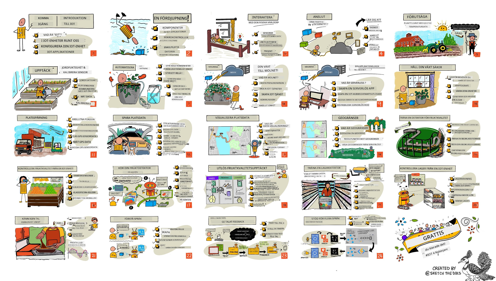

<!--
CO_OP_TRANSLATOR_METADATA:
{
  "original_hash": "6c354ec3487e4f6cfafbe44557996cd9",
  "translation_date": "2026-01-06T06:23:57+00:00",
  "source_file": "README.md",
  "language_code": "sv"
}
-->
[](https://github.com/microsoft/IoT-For-Beginners/blob/master/LICENSE)
[](https://GitHub.com/microsoft/IoT-For-Beginners/graphs/contributors/)
[](https://GitHub.com/microsoft/IoT-For-Beginners/issues/)
[](https://GitHub.com/microsoft/IoT-For-Beginners/pulls/)
[](http://makeapullrequest.com)

[](https://GitHub.com/microsoft/IoT-For-Beginners/watchers/)
[](https://GitHub.com/microsoft/IoT-For-Beginners/network/)
[](https://GitHub.com/microsoft/IoT-For-Beginners/stargazers/)

### Gå med i Azure AI Foundry Community

Om du fastnar eller har frågor om att bygga AI-appar. Gå med bland andra elever och erfarna utvecklare i diskussioner om MCP. Det är en stöttande gemenskap där frågor är välkomna och kunskap delas fritt.

[](https://discord.gg/nTYy5BXMWG)

Om du har produktfeedback eller fel medan du bygger, besök:

[](https://aka.ms/foundry/forum)

Följ dessa steg för att komma igång med dessa resurser:
1. **Fork:a Repositoriet**: Klicka [](https://GitHub.com/microsoft/IoT-For-Beginners/fork)
2. **Klona Repositoriet**: `git clone https://github.com/microsoft/IoT-For-Beginners.git`
3. [**Gå med i Microsoft Foundry Discord och möt experter och andra utvecklare**](https://discord.com/invite/ByRwuEEgH4)


### 🌐 Fler språkstöd

#### Stöds via GitHub Action (Automatiserat & Alltid Uppdaterat)

<!-- CO-OP TRANSLATOR LANGUAGES TABLE START -->
[Arabic](../ar/README.md) | [Bengali](../bn/README.md) | [Bulgarian](../bg/README.md) | [Burmese (Myanmar)](../my/README.md) | [Chinese (Simplified)](../zh/README.md) | [Chinese (Traditional, Hong Kong)](../hk/README.md) | [Chinese (Traditional, Macau)](../mo/README.md) | [Chinese (Traditional, Taiwan)](../tw/README.md) | [Croatian](../hr/README.md) | [Czech](../cs/README.md) | [Danish](../da/README.md) | [Dutch](../nl/README.md) | [Estonian](../et/README.md) | [Finnish](../fi/README.md) | [French](../fr/README.md) | [German](../de/README.md) | [Greek](../el/README.md) | [Hebrew](../he/README.md) | [Hindi](../hi/README.md) | [Hungarian](../hu/README.md) | [Indonesian](../id/README.md) | [Italian](../it/README.md) | [Japanese](../ja/README.md) | [Kannada](../kn/README.md) | [Korean](../ko/README.md) | [Lithuanian](../lt/README.md) | [Malay](../ms/README.md) | [Malayalam](../ml/README.md) | [Marathi](../mr/README.md) | [Nepali](../ne/README.md) | [Nigerian Pidgin](../pcm/README.md) | [Norwegian](../no/README.md) | [Persian (Farsi)](../fa/README.md) | [Polish](../pl/README.md) | [Portuguese (Brazil)](../br/README.md) | [Portuguese (Portugal)](../pt/README.md) | [Punjabi (Gurmukhi)](../pa/README.md) | [Romanian](../ro/README.md) | [Russian](../ru/README.md) | [Serbian (Cyrillic)](../sr/README.md) | [Slovak](../sk/README.md) | [Slovenian](../sl/README.md) | [Spanish](../es/README.md) | [Swahili](../sw/README.md) | [Swedish](./README.md) | [Tagalog (Filipino)](../tl/README.md) | [Tamil](../ta/README.md) | [Telugu](../te/README.md) | [Thai](../th/README.md) | [Turkish](../tr/README.md) | [Ukrainian](../uk/README.md) | [Urdu](../ur/README.md) | [Vietnamese](../vi/README.md)

> **Föredrar att klona lokalt?**

> Detta repository inkluderar 50+ språköversättningar vilket signifikant ökar nedladdningsstorleken. För att klona utan översättningar, använd sparse checkout:
> ```bash
> git clone --filter=blob:none --sparse https://github.com/microsoft/IoT-For-Beginners.git
> cd IoT-For-Beginners
> git sparse-checkout set --no-cone '/*' '!translations' '!translated_images'
> ```
> Detta ger dig allt du behöver för att slutföra kursen med en mycket snabbare nedladdning.
<!-- CO-OP TRANSLATOR LANGUAGES TABLE END -->

# IoT för nybörjare - Ett läroplan

Azure Cloud Advocates på Microsoft är glada att erbjuda en 12-veckors, 24-lektions läroplan som handlar helt om IoT-grunder. Varje lektion inkluderar frågesporter före och efter lektionen, skriftliga instruktioner för att slutföra lektionen, en lösning, en uppgift och mer. Vår projektbaserade pedagogik låter dig lära medan du bygger, ett beprövat sätt för nya färdigheter att "fästa".

Projekten täcker resan för mat från gård till bord. Detta inkluderar jordbruk, logistik, tillverkning, detaljhandel och konsument – alla populära branschområden för IoT-enheter.



> Sketchnote av [Nitya Narasimhan](https://github.com/nitya). Klicka på bilden för en större version.

**Stort tack till våra författare [Jen Fox](https://github.com/jenfoxbot), [Jen Looper](https://github.com/jlooper), [Jim Bennett](https://github.com/jimbobbennett), och vår sketchnotekonstnär [Nitya Narasimhan](https://github.com/nitya).**

**Tack även till vårt team av [Microsoft Learn Student Ambassadors](https://studentambassadors.microsoft.com?WT.mc_id=academic-17441-jabenn) som har granskat och översatt denna läroplan - [Aditya Garg](https://github.com/AdityaGarg00), [Anurag Sharma](https://github.com/Anurag-0-1-A), [Arpita Das](https://github.com/Arpiiitaaa), [Aryan Jain](https://www.linkedin.com/in/aryan-jain-47a4a1145/), [Bhavesh Suneja](https://github.com/EliteWarrior315), [Faith Hunja](https://faithhunja.github.io/), [Lateefah Bello](https://www.linkedin.com/in/lateefah-bello/), [Manvi Jha](https://github.com/Severus-Matthew), [Mireille Tan](https://www.linkedin.com/in/mireille-tan-a4834819a/), [Mohammad Iftekher (Iftu) Ebne Jalal](https://github.com/Iftu119), [Mohammad Zulfikar](https://github.com/mohzulfikar), [Priyanshu Srivastav](https://www.linkedin.com/in/priyanshu-srivastav-b067241ba), [Thanmai Gowducheruvu](https://github.com/innovation-platform), och [Zina Kamel](https://www.linkedin.com/in/zina-kamel/).**

Möt teamet!

[](https://youtu.be/-wippUJRi5k)

**Gif av** [Mohit Jaisal](https://linkedin.com/in/mohitjaisal)

> 🎥 Klicka på bilden ovan för en video om projektet!

> **Lärare**, vi har [inkluderat några förslag](for-teachers.md) på hur man använder denna läroplan. Om du vill skapa egna lektioner har vi också inkluderat en [lektionsmall](lesson-template/README.md).

> **[Studenter](https://aka.ms/student-page)**, för att använda denna läroplan på egen hand, fork:a hela repot och slutför övningarna på egen hand, börja med en frågesport före lektionen, läs sedan lektionen och slutför resterande aktiviteter. Försök skapa projekten genom att förstå lektionerna snarare än att bara kopiera lösningskoden; dock finns den koden tillgänglig i /solutions-mappen i varje projektinriktad lektion. En annan idé är att bilda en studiegrupp med vänner och gå igenom innehållet tillsammans. För vidare studier rekommenderar vi [Microsoft Learn](https://docs.microsoft.com/users/jimbobbennett/collections/ke2ehd351jopwr?WT.mc_id=academic-17441-jabenn).

För en videoöversikt av denna kurs, se denna video:

[](https://youtube.com/watch?v=bccEMm8gRuc "Promo video")

> 🎥 Klicka på bilden ovan för en video om projektet!

## Pedagogik

Vi har valt två pedagogiska principer när vi byggde denna läroplan: att säkerställa att den är projektbaserad och att den inkluderar frekventa frågesporter. Vid slutet av denna serie kommer studenter att ha byggt ett system för växtövervakning och bevattning, en fordons-spårare, en smart fabriksinstallation för att spåra och kontrollera mat samt en röststyrd matlagningstimer, och de kommer att ha lärt sig grunderna i Internet of Things, inklusive hur man skriver enhetskod, ansluter till molnet, analyserar telemetri och kör AI i kanten.

Genom att säkerställa att innehållet stämmer överens med projekten blir processen mer engagerande för studenterna och förståelsen av koncept förstärks.

Dessutom ställer en låginsatsquiz före en lektion studentens intention mot att lära sig ämnet, medan en andra quiz efter lektionen säkerställer ytterligare förståelse. Denna läroplan är designad för att vara flexibel och rolig och kan tas i sin helhet eller delvis. Projekten börjar små och blir gradvis mer komplexa mot slutet av den 12 veckors cykeln.

Varje projekt bygger på verklig hårdvara som är tillgänglig för studenter och hobbyister. Varje projekt tittar på det specifika projektområdet och tillhandahåller relevant bakgrundskunskap. För att bli en framgångsrik utvecklare hjälper det att förstå det område där du löser problem, att tillhandahålla denna bakgrundskunskap låter studenterna tänka på sina IoT-lösningar och lärdomar i kontexten av den typ av verkligt problem som de kan bli ombedda att lösa som IoT-utvecklare. Studenterna lär sig 'varför' till lösningarna de bygger och får uppskattning för slutanvändaren.

## Hårdvara

Vi har två val av IoT-hårdvara att använda för projekten beroende på personlig preferens, programmeringsspråkskunskap eller preferenser, lärandemål och tillgänglighet. Vi har också tillhandahållit en 'virtuell hårdvaruversion' för de som inte har tillgång till hårdvara, eller vill lära sig mer innan de köper. Du kan läsa mer och hitta en 'köplista' på [hårdvarusidan](./hardware.md), inklusive länkar för att köpa kompletta kit från våra vänner på Seeed Studio.
> 💁 Hitta våra riktlinjer för [uppförandekod](CODE_OF_CONDUCT.md), [bidragande](CONTRIBUTING.md) och [översättning](TRANSLATIONS.md). Vi välkomnar din konstruktiva feedback!
>
> 🔧 Har du problem? Kolla in vår [felsökningsguide](TROUBLESHOOTING.md) för lösningar på vanliga problem.

## Varje lektion inkluderar:

- sketchnote
- valfri tilläggsvideo
- förberedande uppvärmningsquiz
- skriftlig lektion
- för projektbaserade lektioner, steg-för-steg guider om hur man bygger projektet
- kunskapskontroller
- en utmaning
- tilläggsläsning
- uppgift
- [quiz efter lektion](https://ff-quizzes.netlify.app/en/)

> **En notering om quiz**: Alla quiz finns i quiz-app mappen, totalt 48 quiz med tre frågor vardera. De länkas in från lektionerna men quiz-appen kan köras lokalt eller distribueras till Azure; följ instruktionerna i `quiz-app` mappen. De håller på att lokaliseras successivt.

## Lektioner

|       |              Projektnamn              |                       Undervisade koncept                       | Läromål                                                                                                                                                           |                                                        Länkad lektion                                                         |
| :---: | :------------------------------------: | :-------------------------------------------------------------: | ---------------------------------------------------------------------------------------------------------------------------------------------------------------- | :----------------------------------------------------------------------------------------------------------------------------: |
|  01   | [Komma igång](./1-getting-started/README.md) |                     Introduktion till IoT                     | Lära dig grundläggande principer för IoT och de grundläggande byggstenarna i IoT-lösningar såsom sensorer och molntjänster när du sätter upp din första IoT-enhet |                      [Introduktion till IoT](./1-getting-started/lessons/1-introduction-to-iot/README.md)                      |
|  02   | [Komma igång](./1-getting-started/README.md) |                   En djupare dykning i IoT                    | Lära dig mer om komponenterna i ett IoT-system, samt mikrokontrollers och enkortsdatorer                                                                           |                        [En djupare dykning i IoT](./1-getting-started/lessons/2-deeper-dive/README.md)                         |
|  03   | [Komma igång](./1-getting-started/README.md) | Interagera med den fysiska världen med sensorer och ställdon | Lära dig om sensorer för att samla in data från den fysiska världen och ställdon för att skicka feedback medan du bygger en nattlampa                             | [Interagera med den fysiska världen med sensorer och ställdon](./1-getting-started/lessons/3-sensors-and-actuators/README.md) |
|  04   | [Komma igång](./1-getting-started/README.md) |             Anslut din enhet till Internetet                   | Lära dig hur man ansluter en IoT-enhet till Internet för att skicka och ta emot meddelanden genom att ansluta din nattlampa till en MQTT-broker                   |               [Anslut din enhet till Internetet](./1-getting-started/lessons/4-connect-internet/README.md)                |
|  05   |            [Gård](./2-farm/README.md)            |                    Förutsäg växttillväxt                      | Lära dig att förutsäga växttillväxt med hjälp av temperaturdata som samlas in av en IoT-enhet                                                                     |                          [Förutsäg växttillväxt](./2-farm/lessons/1-predict-plant-growth/README.md)                           |
|  06   |            [Gård](./2-farm/README.md)            |                    Upptäck markfuktighet                      | Lära dig att upptäcka markfuktighet och kalibrera en markfuktighetssensor                                                                                        |                          [Upptäck markfuktighet](./2-farm/lessons/2-detect-soil-moisture/README.md)                           |
|  07   |            [Gård](./2-farm/README.md)            |                  Automatiserad bevattning                      | Lära dig att automatisera och tidsbestämma bevattning med en relä och MQTT                                                                                        |                      [Automatiserad bevattning](./2-farm/lessons/3-automated-plant-watering/README.md)                       |
|  08   |            [Gård](./2-farm/README.md)            |               Migrera din växt till molnet                    | Lära dig om molnet och molnhostade IoT-tjänster och hur du ansluter din växt till en av dessa istället för en offentlig MQTT-broker                               |               [Migrera din växt till molnet](./2-farm/lessons/4-migrate-your-plant-to-the-cloud/README.md)                |
|  09   |            [Gård](./2-farm/README.md)            |         Migrera din applikationslogik till molnet             | Lära dig hur du kan skriva applikationslogik i molnet som reagerar på IoT-meddelanden                                                                           |         [Migrera din applikationslogik till molnet](./2-farm/lessons/5-migrate-application-to-the-cloud/README.md)         |
|  10   |            [Gård](./2-farm/README.md)            |                   Håll din växt säker                         | Lära dig om säkerhet i IoT och hur man håller din växt säker med nycklar och certifikat                                                                           |                        [Håll din växt säker](./2-farm/lessons/6-keep-your-plant-secure/README.md)                         |
|  11   |       [Transport](./3-transport/README.md)       |                      Spårning av plats                        | Lära dig om GPS-positionering för IoT-enheter                                                                                                                   |                           [Spårning av plats](./3-transport/lessons/1-location-tracking/README.md)                           |
|  12   |       [Transport](./3-transport/README.md)       |                     Spara platsdata                            | Lära dig hur man sparar IoT-data för visualisering eller analys senare                                                                                           |                         [Spara platsdata](./3-transport/lessons/2-store-location-data/README.md)                         |
|  13   |       [Transport](./3-transport/README.md)       |                   Visualisera platsdata                        | Lära dig om att visualisera platsdata på en karta och hur kartor representerar den verkliga 3D-världen i 2 dimensioner                                           |                     [Visualisera platsdata](./3-transport/lessons/3-visualize-location-data/README.md)                     |
|  14   |       [Transport](./3-transport/README.md)       |                          Geofence                             | Lära dig om geofence (geografiska områden) och hur de kan användas för att varna när fordon i leveranskedjan är nära sin destination                           |                                   [Geofence](./3-transport/lessons/4-geofences/README.md)                                   |
|  15   |   [Tillverkning](./4-manufacturing/README.md)   |               Träna en detektor för fruktkvalitet             | Lära dig om att träna en bildklassificerare i molnet för att upptäcka fruktkvalitet                                                                              |                 [Träna en detektor för fruktkvalitet](./4-manufacturing/lessons/1-train-fruit-detector/README.md)                 |
|  16   |   [Tillverkning](./4-manufacturing/README.md)   |           Kontrollera fruktkvalitet från en IoT-enhet         | Lära dig om att använda din fruktkvalitetsdetektor från en IoT-enhet                                                                                            |           [Kontrollera fruktkvalitet från en IoT-enhet](./4-manufacturing/lessons/2-check-fruit-from-device/README.md)            |
|  17   |   [Tillverkning](./4-manufacturing/README.md)   |             Köra din fruktdetektor vid kanten                  | Lära dig om att köra din fruktdetektor på en IoT-enhet vid kanten                                                                                              |             [Köra din fruktdetektor vid kanten](./4-manufacturing/lessons/3-run-fruit-detector-edge/README.md)             |
|  18   |   [Tillverkning](./4-manufacturing/README.md)   |        Trigga fruktkvalitetsdetektering från en sensor        | Lära dig om att trigga fruktkvalitetsdetektering från en sensor                                                                                                 |        [Trigga fruktkvalitetsdetektering från en sensor](./4-manufacturing/lessons/4-trigger-fruit-detector/README.md)         |
|  19   |          [Detaljhandel](./5-retail/README.md)          |                   Träna en lagersensor                        | Lära dig hur man använder objektigenkänning för att träna en lagersensor för att räkna lager i en butik                                                        |                        [Träna en lagersensor](./5-retail/lessons/1-train-stock-detector/README.md)                         |
|  20   |          [Detaljhandel](./5-retail/README.md)          |               Kontrollera lager från en IoT-enhet              | Lära dig hur man kontrollerar lager från en IoT-enhet med en modell för objektigenkänning                                                                     |                     [Kontrollera lager från en IoT-enhet](./5-retail/lessons/2-check-stock-device/README.md)                      |
|  21   |        [Konsument](./6-consumer/README.md)        |             Känner igen tal med en IoT-enhet                  | Lära dig hur man känner igen tal från en IoT-enhet för att bygga en smart timer                                                                                |                  [Känner igen tal med en IoT-enhet](./6-consumer/lessons/1-speech-recognition/README.md)                  |
|  22   |        [Konsument](./6-consumer/README.md)        |                     Förstå språk                               | Lära dig att förstå meningar som sägs till en IoT-enhet                                                                                                         |                        [Förstå språk](./6-consumer/lessons/2-language-understanding/README.md)                        |
|  23   |        [Konsument](./6-consumer/README.md)        |           Ställa in en timer och ge talat feedback             | Lära dig hur man ställer in en timer på en IoT-enhet och ger talad feedback om när timern är inställd och när den är klar                                      |                 [Ställa in en timer och ge talad feedback](./6-consumer/lessons/3-spoken-feedback/README.md)                  |
|  24   |        [Konsument](./6-consumer/README.md)        |                 Stödja flera språk                             | Lära dig hur man stödjer flera språk, både vad gäller när man pratar till apparaten och svaren från din smarta timer                                            |                   [Stödja flera språk](./6-consumer/lessons/4-multiple-language-support/README.md)                   |

## Offline åtkomst

Du kan läsa denna dokumentation offline genom att använda [Docsify](https://docsify.js.org/#/). Forka detta repo, [installera Docsify](https://docsify.js.org/#/quickstart) på din lokala dator, och i rotmappen för detta repo, skriv `docsify serve`. Webbplatsen kommer att serveras på port 3000 på din localhost: `localhost:3000`.

## Quiz

Tack till communityn för att de tillhandahåller det interaktiva quizet som testar din kunskap i varje kapitel. Testa din kunskap [här](https://ff-quizzes.netlify.app/en/) 

### PDF

Du kan skapa en PDF med detta innehåll för offline-åtkomst vid behov. För att göra detta, se till att du har [npm installerat](https://docs.npmjs.com/downloading-and-installing-node-js-and-npm) och kör sedan följande kommandon i rotmappen för detta repo:

```sh
npm i
npm run convert
```

### Presentationer

Det finns presentationsmaterial för några av lektionerna i mappen [slides](../../slides).


## Andra läroplaner

Vårt team producerar andra läroplaner! Kolla in:

<!-- CO-OP TRANSLATOR OTHER COURSES START -->
### LangChain
[](https://aka.ms/langchain4j-for-beginners)
[](https://aka.ms/langchainjs-for-beginners?WT.mc_id=m365-94501-dwahlin)

---

### Azure / Edge / MCP / Agents
[](https://github.com/microsoft/AZD-for-beginners?WT.mc_id=academic-105485-koreyst)
[](https://github.com/microsoft/edgeai-for-beginners?WT.mc_id=academic-105485-koreyst)
[](https://github.com/microsoft/mcp-for-beginners?WT.mc_id=academic-105485-koreyst)
[](https://github.com/microsoft/ai-agents-for-beginners?WT.mc_id=academic-105485-koreyst)

---
 
### Generativ AI-serie
[](https://github.com/microsoft/generative-ai-for-beginners?WT.mc_id=academic-105485-koreyst)
[-9333EA?style=for-the-badge&labelColor=E5E7EB&color=9333EA)](https://github.com/microsoft/Generative-AI-for-beginners-dotnet?WT.mc_id=academic-105485-koreyst)
[-C084FC?style=for-the-badge&labelColor=E5E7EB&color=C084FC)](https://github.com/microsoft/generative-ai-for-beginners-java?WT.mc_id=academic-105485-koreyst)
[-E879F9?style=for-the-badge&labelColor=E5E7EB&color=E879F9)](https://github.com/microsoft/generative-ai-with-javascript?WT.mc_id=academic-105485-koreyst)

---
 
### Kärninlärning
[](https://aka.ms/ml-beginners?WT.mc_id=academic-105485-koreyst)
[](https://aka.ms/datascience-beginners?WT.mc_id=academic-105485-koreyst)
[](https://aka.ms/ai-beginners?WT.mc_id=academic-105485-koreyst)
[](https://github.com/microsoft/Security-101?WT.mc_id=academic-96948-sayoung)
[](https://aka.ms/webdev-beginners?WT.mc_id=academic-105485-koreyst)
[](https://aka.ms/iot-beginners?WT.mc_id=academic-105485-koreyst)
[](https://github.com/microsoft/xr-development-for-beginners?WT.mc_id=academic-105485-koreyst)

---
 
### Copilot-serie
[](https://aka.ms/GitHubCopilotAI?WT.mc_id=academic-105485-koreyst)
[](https://github.com/microsoft/mastering-github-copilot-for-dotnet-csharp-developers?WT.mc_id=academic-105485-koreyst)
[](https://github.com/microsoft/CopilotAdventures?WT.mc_id=academic-105485-koreyst)
<!-- CO-OP TRANSLATOR OTHER COURSES END -->

## Bildkällor

Du kan hitta alla källhänvisningar för bilderna som används i denna kursplan där det krävs i [Attributions](./attributions.md).

---

<!-- CO-OP TRANSLATOR DISCLAIMER START -->
**Ansvarsfriskrivning**:
Detta dokument har översatts med hjälp av AI-översättningstjänsten [Co-op Translator](https://github.com/Azure/co-op-translator). Även om vi strävar efter noggrannhet, vänligen var medveten om att automatiska översättningar kan innehålla fel eller brister. Det ursprungliga dokumentet på dess originals språk bör anses vara den auktoritativa källan. För kritisk information rekommenderas professionell mänsklig översättning. Vi ansvarar inte för några missförstånd eller feltolkningar som uppstår till följd av användningen av denna översättning.
<!-- CO-OP TRANSLATOR DISCLAIMER END -->