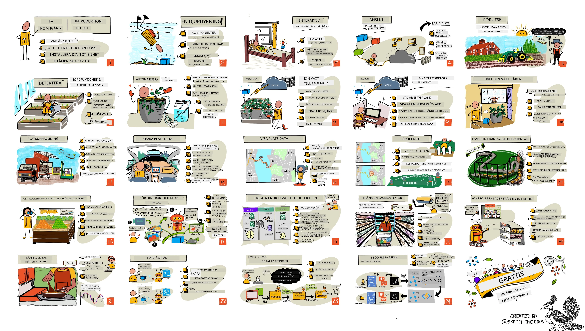

### Gå med i Azure AI Foundry Community

Om du kör fast eller har några frågor om att bygga AI-appar. Gå med i andra elever och erfarna utvecklare i diskussioner om MCP. Det är en stödjande gemenskap där frågor är välkomna och kunskap delas fritt.

Om du har produktfeedback eller fel under byggandet, besök:

Följ dessa steg för att komma igång med att använda dessa resurser:
1. **Fork:a förvaret**: Klicka [](https://GitHub.com/microsoft/IoT-For-Beginners/fork)
2. **Klona förvaret**: `git clone https://github.com/microsoft/IoT-For-Beginners.git`
3. [**Gå med i Microsoft Foundry Discord och träffa experter och andra utvecklare**](https://discord.com/invite/ByRwuEEgH4)

### 🌐 Fler språkstöd

#### Stöds via GitHub Action (Automatiserat & Alltid Uppdaterat)

> **Föredrar du att klona lokalt?**
>
> Det här förvaret inkluderar 50+ språköversättningar vilket avsevärt ökar nedladdningsstorleken. För att klona utan översättningar, använd sparse checkout:
>
> **Bash / macOS / Linux:**
> ```bash
> git clone --filter=blob:none --sparse https://github.com/microsoft/IoT-For-Beginners.git
> cd IoT-For-Beginners
> git sparse-checkout set --no-cone '/*' '!translations' '!translated_images'
> ```
>
> **CMD (Windows):**
> ```cmd
> git clone --filter=blob:none --sparse https://github.com/microsoft/IoT-For-Beginners.git
> cd IoT-For-Beginners
> git sparse-checkout set --no-cone "/*" "!translations" "!translated_images"
> ```
>
> Detta ger dig allt du behöver för att slutföra kursen med en mycket snabbare nedladdning.

# IoT för nybörjare - En läroplan

Azure Cloud Advocates på Microsoft är glada att erbjuda en 12-veckors, 24-lektions läroplan som handlar om grunderna i IoT. Varje lektion inkluderar quiz före och efter lektionen, skriftliga instruktioner för att genomföra lektionen, en lösning, en uppgift och mer. Vår projektbaserade pedagogik gör att du lär dig medan du bygger, ett beprövat sätt för nya färdigheter att "fastna".

Projekten täcker resan för mat från gård till bord. Det inkluderar jordbruk, logistik, tillverkning, detaljhandel och konsument - alla populära branschområden för IoT-enheter.



> Sketchnote av [Nitya Narasimhan](https://github.com/nitya). Klicka på bilden för en större version.

**Stort tack till våra författare [Jen Fox](https://github.com/jenfoxbot), [Jen Looper](https://github.com/jlooper), [Jim Bennett](https://github.com/jimbobbennett) och vår sketchnote-illustratör [Nitya Narasimhan](https://github.com/nitya).**

**Tack också till vårt team av [Microsoft Learn Student Ambassadors](https://studentambassadors.microsoft.com?WT.mc_id=academic-17441-jabenn) som har granskat och översatt denna läroplan - [Aditya Garg](https://github.com/AdityaGarg00), [Anurag Sharma](https://github.com/Anurag-0-1-A), [Arpita Das](https://github.com/Arpiiitaaa), [Aryan Jain](https://www.linkedin.com/in/aryan-jain-47a4a1145/), [Bhavesh Suneja](https://github.com/EliteWarrior315), [Faith Hunja](https://faithhunja.github.io/), [Lateefah Bello](https://www.linkedin.com/in/lateefah-bello/), [Manvi Jha](https://github.com/Severus-Matthew), [Mireille Tan](https://www.linkedin.com/in/mireille-tan-a4834819a/), [Mohammad Iftekher (Iftu) Ebne Jalal](https://github.com/Iftu119), [Mohammad Zulfikar](https://github.com/mohzulfikar), [Priyanshu Srivastav](https://www.linkedin.com/in/priyanshu-srivastav-b067241ba), [Thanmai Gowducheruvu](https://github.com/innovation-platform) och [Zina Kamel](https://www.linkedin.com/in/zina-kamel/).**

Möt teamet!

[](https://youtu.be/-wippUJRi5k)

**Gif av** [Mohit Jaisal](https://linkedin.com/in/mohitjaisal)

> 🎥 Klicka på bilden ovan för en video om projektet!

> **Lärare**, vi har [inkluderat några förslag](for-teachers.md) på hur du kan använda denna läroplan. Om du vill skapa egna lektioner finns även en [lektionmall](lesson-template/README.md).

> **[Studenter](https://aka.ms/student-page)**, för att använda denna läroplan på egen hand, forka hela repot och gör övningarna själva, börja med ett förföreläsningsquiz, läs sedan föreläsningen och genomför resten av aktiviteterna. Försök att skapa projekten genom att förstå lektionerna snarare än att kopiera lösningskoden; dock finns koden tillgänglig i /solutions-mappar i varje projektorienterad lektion. Ett annat alternativ är att bilda en studiegrupp med vänner och arbeta genom innehållet tillsammans. För vidare studier rekommenderar vi [Microsoft Learn](https://docs.microsoft.com/users/jimbobbennett/collections/ke2ehd351jopwr?WT.mc_id=academic-17441-jabenn).

För en videoöverblick av denna kurs, kolla på denna video:

[](https://youtube.com/watch?v=bccEMm8gRuc "Promovideo")

> 🎥 Klicka på bilden ovan för en video om projektet!

## Pedagogik

Vi har valt två pedagogiska principer när vi byggde denna läroplan: att säkerställa att den är projektbaserad och att den innehåller frekventa quiz. I slutet av denna serie kommer studenter ha byggt ett växtövervaknings- och bevattningssystem, ett fordons-spårningssystem, en smart fabriksinstallation för att spåra och kontrollera mat samt en röststyrd matlagningstimer, och ha lärt sig grunderna i sakernas internet inklusive hur man skriver enhetskod, ansluter till molnet, analyserar telemetri och kör AI på kanten.

Genom att se till att innehållet är kopplat till projekt görs processen mer engagerande för studenter och ökar retentionen av koncept.

Dessutom sätter ett lågtrycksquiz före en lektion studentens intention att lära sig ett ämne, medan ett andra quiz efter lektionen säkerställer ytterligare retention. Denna läroplan är designad för att vara flexibel och rolig och kan genomföras i sin helhet eller delvis. Projekten börjar små och blir successivt mer komplexa vid slutet av 12-veckorscykeln.

Varje projekt baseras på verklig hårdvara tillgänglig för studenter och hobbyister. Varje projekt undersöker det specifika projektområdet, vilket ger relevant bakgrundskunskap. För att bli en framgångsrik utvecklare är det hjälpsamt att förstå den domän där du löser problem; att ge denna bakgrundskunskap gör att studenter kan tänka på sina IoT-lösningar och lärdomar i kontexten av den verkliga problemtypen de kan mötas av som IoT-utvecklare. Studenter lär sig "varför" bakom lösningarna de bygger och får uppskattning för slutanvändaren.

## Hårdvara
Vi har två val av IoT-hårdvara att använda för projekten beroende på personliga preferenser, programmeringsspråkskunskaper eller preferenser, lärandemål och tillgänglighet. Vi har också tillhandahållit en 'virtuell hårdvaru'-version för dem som inte har tillgång till hårdvara, eller vill lära sig mer innan de bestämmer sig för ett köp. Du kan läsa mer och hitta en 'inköpslista' på [hårdvarusidan](./hardware.md), inklusive länkar för att köpa kompletta kit från våra vänner på Seeed Studio.

> 💁 Hitta våra riktlinjer för [Code of Conduct](CODE_OF_CONDUCT.md), [Contributing](CONTRIBUTING.md) och [Translations](..). Vi välkomnar din konstruktiva feedback!
>
> 🔧 Problem? Kolla in vår [Felsökningsguide](TROUBLESHOOTING.md) för lösningar på vanliga problem.

## Varje lektion inkluderar:

- sketchnote
- valfri kompletterande video
- quiz som uppvärmning före lektionen
- skriftlig lektion
- för projektbaserade lektioner, steg-för-steg guider för hur man bygger projektet
- kunskapskontroller
- en utmaning
- kompletterande läsning
- uppgift
- [quiz efter lektionen](https://ff-quizzes.netlify.app/en/)

> **En notis om quiz:** Alla quiz finns i quiz-app-mappen, totalt 48 quiz med tre frågor vardera. De länkas från lektionerna men quiz-appen kan köras lokalt eller distribueras till Azure; följ instruktionerna i `quiz-app` mappen. De lokaliseras successivt.

## Lektioner

|       |              Projektnamn              |                       Koncept som lärs                       | Lärandemål                                                                                                                                                             |                                                        Länkad Lektion                                                         |
| :---: | :----------------------------------: | :----------------------------------------------------------: | --------------------------------------------------------------------------------------------------------------------------------------------------------------------- | :----------------------------------------------------------------------------------------------------------------------------: |
|  01   | [Komma igång](./1-getting-started/README.md) |                    Introduktion till IoT                    | Lär dig grunderna i IoT och de grundläggande byggstenarna i IoT-lösningar som sensorer och molntjänster medan du sätter upp din första IoT-enhet                       |                      [Introduktion till IoT](./1-getting-started/lessons/1-introduction-to-iot/README.md)                      |
|  02   | [Komma igång](./1-getting-started/README.md) |                  En djupare titt på IoT                     | Lär dig mer om komponenterna i ett IoT-system, samt mikrokontroller och enkortsdatorer                                                                                  |                        [En djupare titt på IoT](./1-getting-started/lessons/2-deeper-dive/README.md)                         |
|  03   | [Komma igång](./1-getting-started/README.md) | Interagera med den fysiska världen med sensorer och aktuatorer | Lär dig om sensorer för att samla data från den fysiska världen, och aktuatorer för att skicka återkoppling, medan du bygger ett nattljus                              | [Interagera med den fysiska världen med sensorer och aktuatorer](./1-getting-started/lessons/3-sensors-and-actuators/README.md) |
|  04   | [Komma igång](./1-getting-started/README.md) |              Anslut din enhet till Internet                  | Lär dig om hur du ansluter en IoT-enhet till Internet för att skicka och ta emot meddelanden genom att koppla ditt nattljus till en MQTT-broker                        |                [Anslut din enhet till Internet](./1-getting-started/lessons/4-connect-internet/README.md)                     |
|  05   |            [Gård](./2-farm/README.md)             |                   Förutsäga växttillväxt                     | Lär dig hur man förutsäger växttillväxt med hjälp av temperaturdata som samlas in av en IoT-enhet                                                                       |                          [Förutsäga växttillväxt](./2-farm/lessons/1-predict-plant-growth/README.md)                         |
|  06   |            [Gård](./2-farm/README.md)             |                  Upptäcka jordfuktighet                      | Lär dig hur man registrerar jordfuktighet och kalibrerar en jordfuktighetssensor                                                                                        |                          [Upptäcka jordfuktighet](./2-farm/lessons/2-detect-soil-moisture/README.md)                         |
|  07   |            [Gård](./2-farm/README.md)             |                Automatisk bevattning av växter              | Lär dig hur man automatiserar och schemalägger bevattning med en relä och MQTT                                                                                        |                      [Automatisk bevattning av växter](./2-farm/lessons/3-automated-plant-watering/README.md)                |
|  08   |            [Gård](./2-farm/README.md)             |              Migrera din växt till molnet                    | Lär dig om molnet och molnbaserade IoT-tjänster och hur du ansluter din växt till en av dessa istället för en publik MQTT-broker                                        |               [Migrera din växt till molnet](./2-farm/lessons/4-migrate-your-plant-to-the-cloud/README.md)                   |
|  09   |            [Gård](./2-farm/README.md)             |        Migrera din applikationslogik till molnet            | Lär dig hur du kan skriva applikationslogik i molnet som svarar på IoT-meddelanden                                                                                    |          [Migrera din applikationslogik till molnet](./2-farm/lessons/5-migrate-application-to-the-cloud/README.md)          |
|  10   |            [Gård](./2-farm/README.md)             |                   Håll din växt säker                        | Lär dig om säkerhet inom IoT och hur du håller din växt säker med nycklar och certifikat                                                                               |                          [Håll din växt säker](./2-farm/lessons/6-keep-your-plant-secure/README.md)                          |
|  11   |       [Transport](./3-transport/README.md)        |                     Positionsspårning                        | Lär dig om GPS-spårning för IoT-enheter                                                                                                                               |                             [Positionsspårning](./3-transport/lessons/1-location-tracking/README.md)                         |
|  12   |       [Transport](./3-transport/README.md)        |                    Lagra positionsdata                       | Lär dig hur man lagrar IoT-data för att visualiseras eller analyseras senare                                                                                           |                           [Lagra positionsdata](./3-transport/lessons/2-store-location-data/README.md)                         |
|  13   |       [Transport](./3-transport/README.md)        |                   Visualisera positionsdata                  | Lär dig om att visualisera positionsdata på en karta, och hur kartor representerar den verkliga 3D-världen i 2 dimensioner                                             |                       [Visualisera positionsdata](./3-transport/lessons/3-visualize-location-data/README.md)                  |
|  14   |       [Transport](./3-transport/README.md)        |                        Geofence                              | Lär dig om geofence, och hur de kan användas för att larma när fordon i försörjningskedjan närmar sig sin destination                                                |                                      [Geofence](./3-transport/lessons/4-geofences/README.md)                               |
|  15   |   [Tillverkning](./4-manufacturing/README.md)     |                Träna en detektor för fruktkvalitet          | Lär dig om att träna en bildklassificerare i molnet för att upptäcka fruktkvalitet                                                                                    |                 [Träna en fruktdetektor](./4-manufacturing/lessons/1-train-fruit-detector/README.md)                         |
|  16   |   [Tillverkning](./4-manufacturing/README.md)     |             Kontrollera fruktkvalitet från en IoT-enhet     | Lär dig om att använda din fruktkvalitetsdetektor från en IoT-enhet                                                                                                   |              [Kontrollera fruktkvalitet från en IoT-enhet](./4-manufacturing/lessons/2-check-fruit-from-device/README.md)    |
|  17   |   [Tillverkning](./4-manufacturing/README.md)     |             Kör din fruktdetektor på edge                    | Lär dig om att köra din fruktdetektor på en IoT-enhet på edge                                                                                                        |               [Kör din fruktdetektor på edge](./4-manufacturing/lessons/3-run-fruit-detector-edge/README.md)                 |
|  18   |   [Tillverkning](./4-manufacturing/README.md)     |            Trigga fruktkvalitetskontroll från en sensor    | Lär dig om att trigga fruktkvalitetskontroll från en sensor                                                                                                          |             [Trigga fruktkvalitetskontroll från en sensor](./4-manufacturing/lessons/4-trigger-fruit-detector/README.md)     |
|  19   |          [Detaljhandel](./5-retail/README.md)     |                Träna en lagerdetektor                        | Lär dig hur man använder objektdetektering för att träna en lagerdetektor att räkna lager i en butik                                                                  |                       [Träna en lagerdetektor](./5-retail/lessons/1-train-stock-detector/README.md)                          |
|  20   |          [Detaljhandel](./5-retail/README.md)     |             Kontrollera lager från en IoT-enhet             | Lär dig att kontrollera lagret från en IoT-enhet med en objektdetekteringsmodell                                                                                      |                    [Kontrollera lager från en IoT-enhet](./5-retail/lessons/2-check-stock-device/README.md)                  |
|  21   |        [Konsument](./6-consumer/README.md)        |          Känna igen tal med en IoT-enhet                     | Lär dig att känna igen tal från en IoT-enhet för att bygga en smart timer                                                                                             |                    [Känna igen tal med en IoT-enhet](./6-consumer/lessons/1-speech-recognition/README.md)                    |
|  22   |        [Konsument](./6-consumer/README.md)        |                      Förstå språk                            | Lär dig att förstå meningar som talas till en IoT-enhet                                                                                                              |                         [Förstå språk](./6-consumer/lessons/2-language-understanding/README.md)                               |
|  23   |        [Konsument](./6-consumer/README.md)        |            Ställ en timer och ge talad återkoppling          | Lär dig hur man ställer en timer på en IoT-enhet och ger talad återkoppling när timern ställs och när den går ut                                                     |                 [Ställ en timer och ge talad återkoppling](./6-consumer/lessons/3-spoken-feedback/README.md)                  |
|  24   |        [Konsument](./6-consumer/README.md)        |                Stödja flera språk                            | Lär dig att stödja flera språk, både att bli talad till och att svara från din smarta timer                                                                          |                   [Stödja flera språk](./6-consumer/lessons/4-multiple-language-support/README.md)                           |

## Offlineåtkomst

Du kan köra denna dokumentation offline med hjälp av [Docsify](https://docsify.js.org/#/). Forka detta repo, [installera Docsify](https://docsify.js.org/#/quickstart) på din lokala maskin och skriv sedan `docsify serve` i rotmappen för detta repo. Webbplatsen kommer att serveras på port 3000 på din localhost: `localhost:3000`.

## Quiz

Tack till communityn för att ni tillhandahåller det interaktiva quizet som testar dina kunskaper i varje kapitel. Testa dina kunskaper [här](https://ff-quizzes.netlify.app/en/)

### PDF

Du kan generera en PDF av detta innehåll för offlineåtkomst om det behövs. För att göra detta, se till att du har [npm installerat](https://docs.npmjs.com/downloading-and-installing-node-js-and-npm) och kör följande kommandon i rotmappen för detta repo:

```sh
npm i
npm run convert
```

### Bilder

Det finns bildspel för några av lektionerna i [slides](../../slides)-mappen.


## Andra läroplaner

Vårt team producerar andra läroplaner! Kolla in:

<!-- CO-OP TRANSLATOR OTHER COURSES START -->
### LangChain
[](https://aka.ms/langchain4j-for-beginners)
[](https://aka.ms/langchainjs-for-beginners?WT.mc_id=m365-94501-dwahlin)
[](https://github.com/microsoft/langchain-for-beginners?WT.mc_id=m365-94501-dwahlin)
---

### Azure / Edge / MCP / Agents
[](https://github.com/microsoft/AZD-for-beginners?WT.mc_id=academic-105485-koreyst)
[](https://github.com/microsoft/edgeai-for-beginners?WT.mc_id=academic-105485-koreyst)
[](https://github.com/microsoft/mcp-for-beginners?WT.mc_id=academic-105485-koreyst)
[](https://github.com/microsoft/ai-agents-for-beginners?WT.mc_id=academic-105485-koreyst)

---
 
### Generativ AI-serie
[](https://github.com/microsoft/generative-ai-for-beginners?WT.mc_id=academic-105485-koreyst)
[-9333EA?style=for-the-badge&labelColor=E5E7EB&color=9333EA)](https://github.com/microsoft/Generative-AI-for-beginners-dotnet?WT.mc_id=academic-105485-koreyst)
[-C084FC?style=for-the-badge&labelColor=E5E7EB&color=C084FC)](https://github.com/microsoft/generative-ai-for-beginners-java?WT.mc_id=academic-105485-koreyst)
[-E879F9?style=for-the-badge&labelColor=E5E7EB&color=E879F9)](https://github.com/microsoft/generative-ai-with-javascript?WT.mc_id=academic-105485-koreyst)

---
 
### Grundläggande lärande
[](https://aka.ms/ml-beginners?WT.mc_id=academic-105485-koreyst)
[](https://aka.ms/datascience-beginners?WT.mc_id=academic-105485-koreyst)
[](https://aka.ms/ai-beginners?WT.mc_id=academic-105485-koreyst)
[](https://github.com/microsoft/Security-101?WT.mc_id=academic-96948-sayoung)
[](https://aka.ms/webdev-beginners?WT.mc_id=academic-105485-koreyst)
[](https://aka.ms/iot-beginners?WT.mc_id=academic-105485-koreyst)
[](https://github.com/microsoft/xr-development-for-beginners?WT.mc_id=academic-105485-koreyst)

---
 
### Copilot-serie
[](https://aka.ms/GitHubCopilotAI?WT.mc_id=academic-105485-koreyst)
[](https://github.com/microsoft/mastering-github-copilot-for-dotnet-csharp-developers?WT.mc_id=academic-105485-koreyst)
[](https://github.com/microsoft/CopilotAdventures?WT.mc_id=academic-105485-koreyst)
<!-- CO-OP TRANSLATOR OTHER COURSES END -->

## Bildattributioner

Du kan hitta alla attribut för bilderna som används i denna läroplan där det krävs i [Attributions](./attributions.md).

---

<!-- CO-OP TRANSLATOR DISCLAIMER START -->
**Ansvarsfriskrivning**:  
Detta dokument har översatts med hjälp av AI-översättningstjänsten [Co-op Translator](https://github.com/Azure/co-op-translator). Även om vi strävar efter noggrannhet, vänligen var medveten om att automatiska översättningar kan innehålla fel eller brister. Det ursprungliga dokumentet på dess modersmål bör betraktas som den auktoritativa källan. För kritisk information rekommenderas professionell mänsklig översättning. Vi ansvarar inte för några missförstånd eller feltolkningar som uppstår från användningen av denna översättning.
<!-- CO-OP TRANSLATOR DISCLAIMER END -->