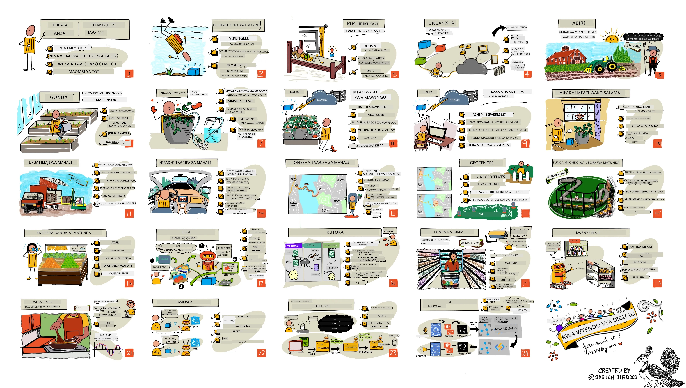

<!--
CO_OP_TRANSLATOR_METADATA:
{
  "original_hash": "6c354ec3487e4f6cfafbe44557996cd9",
  "translation_date": "2026-01-06T15:36:16+00:00",
  "source_file": "README.md",
  "language_code": "sw"
}
-->
[](https://github.com/microsoft/IoT-For-Beginners/blob/master/LICENSE)
[](https://GitHub.com/microsoft/IoT-For-Beginners/graphs/contributors/)
[](https://GitHub.com/microsoft/IoT-For-Beginners/issues/)
[](https://GitHub.com/microsoft/IoT-For-Beginners/pulls/)
[](http://makeapullrequest.com)

[](https://GitHub.com/microsoft/IoT-For-Beginners/watchers/)
[](https://GitHub.com/microsoft/IoT-For-Beginners/network/)
[](https://GitHub.com/microsoft/IoT-For-Beginners/stargazers/)

### Jiunge na Jumuiya ya Azure AI Foundry

Ikiwa unapata shida au una maswali yoyote kuhusu kujenga programu za AI. Jiunge na wanafunzi wenzako na waendelezaji wenye uzoefu katika mijadala kuhusu MCP. Ni jumuiya yenye msaada ambapo maswali yanakaribishwa na maarifa yanashirikiwa kwa uhuru.

[](https://discord.gg/nTYy5BXMWG)

Ikiwa una maoni kuhusu bidhaa au makosa wakati wa kujenga tembelea:

[](https://aka.ms/foundry/forum)

Fuata hatua hizi kuanza kutumia rasilimali hizi:
1. **Tengeneza matawi ya Hazina (Fork the Repository)**: Bonyeza [](https://GitHub.com/microsoft/IoT-For-Beginners/fork)
2. **Nakili Hazina (Clone the Repository)**:   `git clone https://github.com/microsoft/IoT-For-Beginners.git`
3. [**Jiunge na Microsot Foundry Discord na kutana na wataalam na waendelezaji wenza**](https://discord.com/invite/ByRwuEEgH4)


### 🌐 Msaada wa Lugha nyingi

#### Umeungwa mkono kupitia GitHub Action (Moja kwa Moja & Daima Imesasisha)

<!-- CO-OP TRANSLATOR LANGUAGES TABLE START -->
[Kiarabu](../ar/README.md) | [Kibengali](../bn/README.md) | [Kibulgaria](../bg/README.md) | [Kiburma (Myanmar)](../my/README.md) | [Kichina (Rahisi)](../zh/README.md) | [Kichina (Kawaida, Hong Kong)](../hk/README.md) | [Kichina (Kawaida, Makao)](../mo/README.md) | [Kichina (Kawaida, Taiwan)](../tw/README.md) | [Kroeshia](../hr/README.md) | [Kicheki](../cs/README.md) | [Kidenmaki](../da/README.md) | [Kiholanzi](../nl/README.md) | [Kiestonia](../et/README.md) | [Kifini](../fi/README.md) | [Kifaransa](../fr/README.md) | [Kijerumani](../de/README.md) | [Kigiriki](../el/README.md) | [Kiebrania](../he/README.md) | [Kihindi](../hi/README.md) | [Kihungaria](../hu/README.md) | [Kiindonesia](../id/README.md) | [Kiitaliano](../it/README.md) | [Kijapani](../ja/README.md) | [Kikannada](../kn/README.md) | [Kikorea](../ko/README.md) | [Kilithuania](../lt/README.md) | [Kimalay](../ms/README.md) | [Kimalayalam](../ml/README.md) | [Kimarathi](../mr/README.md) | [Kinepali](../ne/README.md) | [Kipidgin cha Nijeria](../pcm/README.md) | [Kinorwe](../no/README.md) | [Kipersia (Farsi)](../fa/README.md) | [Kipolandi](../pl/README.md) | [Kireno (Brazil)](../br/README.md) | [Kireno (Ureno)](../pt/README.md) | [Kipunjabi (Gurmukhi)](../pa/README.md) | [Kiromania](../ro/README.md) | [Kirusi](../ru/README.md) | [Kiserbia (Cyrillic)](../sr/README.md) | [Kislovakia](../sk/README.md) | [Kislovenia](../sl/README.md) | [Kihispania](../es/README.md) | [Kiswahili](./README.md) | [Kiswidi](../sv/README.md) | [Kitagalog (Filipino)](../tl/README.md) | [Kitamili](../ta/README.md) | [Kitelugu](../te/README.md) | [Kithai](../th/README.md) | [Kituruki](../tr/README.md) | [Kiukrinia](../uk/README.md) | [Kiurdu](../ur/README.md) | [Kivietinamu](../vi/README.md)

> **Ungependa Kufanya Clone Kwenye Kompyuta?**

> Hazina hii ina tafsiri za lugha zaidi ya 50 ambazo huongeza ukubwa wa pakizi. Ili kufanya clone bila tafsiri, tumia sparse checkout:
> ```bash
> git clone --filter=blob:none --sparse https://github.com/microsoft/IoT-For-Beginners.git
> cd IoT-For-Beginners
> git sparse-checkout set --no-cone '/*' '!translations' '!translated_images'
> ```
> Hii inakupatia kila kitu unachohitaji kukamilisha kozi katika download ya haraka zaidi.
<!-- CO-OP TRANSLATOR LANGUAGES TABLE END -->

# IoT kwa Waanzilishi - Mtaala

Waharakati wa Azure Cloud Microsoft wana furaha kutoa mtaala wa wiki 12, masomo 24 yote kuhusu msingi wa IoT. Kila somo linajumuisha vipimo kabla na baada ya somo, maelekezo yaliyoandikwa ya kukamilisha somo, suluhisho, kazi na zaidi. Mfumo wetu wa kujifunza unaotegemea miradi unakuwezesha kujifunza huku ukijenga, njia iliyothibitishwa ya stadi mpya kushika.

Miradi inahusu safari ya chakula kutoka shambani hadi mezani. Hii inajumuisha kilimo, usafirishaji, utengenezaji, rejareja na matumizi - yote ni maeneo maarufu ya viwanda kwa vifaa vya IoT.



> Sketchnote na [Nitya Narasimhan](https://github.com/nitya). Bonyeza picha kuona toleo kubwa.

**Asante sana kwa waandishi wetu [Jen Fox](https://github.com/jenfoxbot), [Jen Looper](https://github.com/jlooper), [Jim Bennett](https://github.com/jimbobbennett), na mchora sketchnote wetu [Nitya Narasimhan](https://github.com/nitya).**

**Asante pia kwa timu yetu ya [Wajumbe wa Microsoft Learn Student Ambassadors](https://studentambassadors.microsoft.com?WT.mc_id=academic-17441-jabenn) waliokuwa wakikagua na kutafsiri mtaala huu - [Aditya Garg](https://github.com/AdityaGarg00), [Anurag Sharma](https://github.com/Anurag-0-1-A), [Arpita Das](https://github.com/Arpiiitaaa), [Aryan Jain](https://www.linkedin.com/in/aryan-jain-47a4a1145/), [Bhavesh Suneja](https://github.com/EliteWarrior315), [Faith Hunja](https://faithhunja.github.io/), [Lateefah Bello](https://www.linkedin.com/in/lateefah-bello/), [Manvi Jha](https://github.com/Severus-Matthew), [Mireille Tan](https://www.linkedin.com/in/mireille-tan-a4834819a/), [Mohammad Iftekher (Iftu) Ebne Jalal](https://github.com/Iftu119), [Mohammad Zulfikar](https://github.com/mohzulfikar), [Priyanshu Srivastav](https://www.linkedin.com/in/priyanshu-srivastav-b067241ba), [Thanmai Gowducheruvu](https://github.com/innovation-platform), na [Zina Kamel](https://www.linkedin.com/in/zina-kamel/).**

Kutana na timu!

[](https://youtu.be/-wippUJRi5k)

**Gif na** [Mohit Jaisal](https://linkedin.com/in/mohitjaisal)

> 🎥 Bonyeza picha hapo juu kwa video kuhusu mradi!

> **Walimu**, tumewajumuisha [mapendekezo machache](for-teachers.md) juu ya jinsi ya kutumia mtaala huu. Ikiwa ungependa kuunda masomo yako, pia tumewajumuisha [kiolezo cha somo](lesson-template/README.md).

> **[Wanafunzi](https://aka.ms/student-page)**, ili kutumia mtaala huu peke yako, tengeneza matawi ya hazina yote na kamilisha mazoezi peke yako, ukianza na kipimo kabla ya mihadhara, kisha soma mihadhara na kamilisha shughuli zingine. Jaribu kuunda miradi kwa kuelewa masomo badala ya kunakili msimbo wa suluhisho; hata hivyo msimbo huo upo katika folda za suluhisho katika kila somo la mradi. Wazo jingine ni kuunda kikundi cha kusoma na marafiki na kupitia maudhui pamoja. Kwa mwanafunzi zaidi, tunapendekeza [Microsoft Learn](https://docs.microsoft.com/users/jimbobbennett/collections/ke2ehd351jopwr?WT.mc_id=academic-17441-jabenn).

Kwa muhtasari wa video wa kozi hii, angalia video hii:

[](https://youtube.com/watch?v=bccEMm8gRuc "Video ya promosheni")

> 🎥 Bonyeza picha hapo juu kwa video kuhusu mradi!

## Pedagogia

Tumetumia misingi miwili ya ujifunzaji wakati wa kujenga mtaala huu: kuhakikisha unaolengwa kwa mradi na kuwa na vipimo vya mara kwa mara. Mwisho wa mfululizo huu, wanafunzi watakuwa wamejenga mfumo wa kufuatilia na kumwagilia mimea, kifuatilia magari, usanidi wa kiwanda cha smart kufuatilia na kukagua chakula, na kengele ya kupikia inayodhibitiwa kwa sauti, na watajifunza misingi ya Intaneti ya Vitu ikijumuisha jinsi ya kuandika msimbo wa kifaa, kuungana na wingu, kuchambua telemetry na kuendesha AI kwenye kingo.

Kwa kuhakikisha maudhui yanaendana na miradi, mchakato unakuwa wa kuvutia zaidi kwa wanafunzi na utahifadhiwa kwa mafanikio zaidi.

Aidha, kipimo cha chini kabla ya darasa kinaweka mtazamo wa mwanafunzi kuelekea kujifunza mada, wakati kipimo cha pili baada ya darasa kinahakikisha uhifadhi zaidi. Mtaala huu umeundwa kuwa rahisi na kufurahisha na unaweza kuchukuliwa kwa jumla au sehemu. Miradi huanza midogo na kuongezeka ugumu mwishoni mwa mzunguko wa wiki 12.

Kila mradi umejengwa kuzunguka vifaa halisi vinavyopatikana kwa wanafunzi na wapenda shughuli. Kila mradi huchunguza eneo la mradi mahususi, likitoa maarifa muhimu ya msingi. Kuwa mtaalamu mwema husaidia kuelewa eneo ambalo unatatua matatizo, kutoa maarifa haya ya msingi hutoa fursa kwa wanafunzi kufikiria kuhusu suluhisho na mafunzo yao ya IoT katika muktadha wa aina ya tatizo halisi wanayoweza kuambiwa kutatua kama mtaalamu wa IoT. Wanafunzi hujifunza 'kwa nini' wa suluhisho wanazojenga, na kupata uelewa wa mtumiaji wa mwisho.

## Vifaa

Tuna chaguzi mbili za vifaa vya IoT kutumia kwa miradi kulingana na upendeleo binafsi, maarifa ya lugha ya programu au matakwa, malengo ya kujifunza na upatikanaji. Pia tumetoa toleo la 'vifaa vya mtandaoni' kwa wale wanaosemekana hawana vifaa, au wanataka kujifunza zaidi kabla ya kuamua kununua. Unaweza kusoma zaidi na kupata 'orodha ya ununuzi' kwenye [ukurasa wa vifaa](./hardware.md), ikijumuisha viungo vya kununua vifaa kamili kutoka kwa marafiki wetu wa Seeed Studio.
> 💁 Pata [Kanuni Zetu za Nidhamu](CODE_OF_CONDUCT.md), [Kushiriki](CONTRIBUTING.md), na miongozo ya [Tafsiri](TRANSLATIONS.md). Tunathamini maoni yako yenye kujenga!
>
> 🔧 Unapata matatizo? Angalia [Mwongozo wa Kutatua Matatizo](TROUBLESHOOTING.md) kwa suluhisho la matatizo ya kawaida.

## Kila somo linajumuisha:

- mchoro wa kumbukumbu
- video ya ziada hiari
- jaribio la joto kabla ya somo
- somo la maandishi
- kwa masomo ya mradi, miongozo hatua kwa hatua jinsi ya kujenga mradi
- vikaguzi vya maarifa
- changamoto
- usomaji wa ziada
- kazi
- [jaribio baada ya somo](https://ff-quizzes.netlify.app/en/)

> **Kumbuka kuhusu jaribio**: Jaribio zote ziko kwenye folda ya quiz-app, jumla ya jaribio 48 zenye maswali matatu kila moja. Zimeunganishwa kutoka ndani ya masomo lakini app ya jaribio inaweza kuendeshwa ndani ya kompyuta yako au kusambazwa kwa Azure; fuata maelekezo katika folda ya `quiz-app`. Zinatafutwa kidogo kidogo katika lugha nyingine.

## Masomo

|       |              Jina la Mradi              |                       Mipaka Inayofundishwa                       | Malengo ya Kujifunza                                                                                                                                                 |                                                        Somo Lililounganishwa                                                         |
| :---: | :------------------------------------: | :---------------------------------------------------------: | ------------------------------------------------------------------------------------------------------------------------------------------------------------------- | :--------------------------------------------------------------------------------------------------------------------------: |
|  01   | [Kuanzia](./1-getting-started/README.md) |                     Utangulizi wa IoT                     | Jifunze misingi ya IoT na vipengele vya msingi vya suluhisho za IoT kama sensa na huduma za anga huku ukiwa unapanga kifaa chako cha kwanza cha IoT |                      [Utangulizi wa IoT](./1-getting-started/lessons/1-introduction-to-iot/README.md)                      |
|  02   | [Kuanzia](./1-getting-started/README.md) |                   Kuzama zaidi katika IoT                    | Jifunze zaidi kuhusu vipengele vya mfumo wa IoT, pamoja na microcontrollers na kompyuta za bodi moja                                                            |                        [Kuzama zaidi katika IoT](./1-getting-started/lessons/2-deeper-dive/README.md)                         |
|  03   | [Kuanzia](./1-getting-started/README.md) | Wasiliana na dunia halisi kwa kutumia sensa na vitendo | Jifunze kuhusu sensa za kukusanya data kutoka dunia halisi, na vitendo kutoa mrejesho, huku ukijenga taa ya usiku                                           | [Wasiliana na dunia halisi kwa kutumia sensa na vitendo](./1-getting-started/lessons/3-sensors-and-actuators/README.md) |
|  04   | [Kuanzia](./1-getting-started/README.md) |             Unganisha kifaa chako na Intaneti             | Jifunze jinsi ya kuunganisha kifaa cha IoT na Intaneti kutuma na kupokea ujumbe kwa kuunganisha taa yako ya usiku kwa broker wa MQTT                               |               [Unganisha kifaa chako na Intaneti](./1-getting-started/lessons/4-connect-internet/README.md)                |
|  05   |            [Shamba](./2-farm/README.md)            |                    Kutabiri ukuaji wa mmea                     | Jifunze jinsi ya kutabiri ukuaji wa mmea kwa kutumia data ya joto iliyopatikana na kifaa cha IoT                                                                                  |                          [Tabiri ukuaji wa mmea](./2-farm/lessons/1-predict-plant-growth/README.md)                           |
|  06   |            [Shamba](./2-farm/README.md)            |                    Kugundua unyevu wa udongo                     | Jifunze jinsi ya kugundua unyevu wa udongo na kusanifu sensa ya unyevu wa udongo                                                                                              |                          [Gundua unyevu wa udongo](./2-farm/lessons/2-detect-soil-moisture/README.md)                           |
|  07   |            [Shamba](./2-farm/README.md)            |                  Kumwagilia mimea moja kwa moja                   | Jifunze jinsi ya kuendesha na kupangilia kumwagilia kwa kutumia relai na MQTT                                                                                                      |                      [Kumwagilia mimea moja kwa moja](./2-farm/lessons/3-automated-plant-watering/README.md)                       |
|  08   |            [Shamba](./2-farm/README.md)            |               Hamisha mmea wako angani               | Jifunze kuhusu anga na huduma za IoT zilizo hifadhiwa angani na jinsi ya kuunganisha mmea wako moja ya hizi badala ya broker wa uma MQTT                                   |               [Hamisha mmea wako angani](./2-farm/lessons/4-migrate-your-plant-to-the-cloud/README.md)                |
|  09   |            [Shamba](./2-farm/README.md)            |         Hamisha mantiki ya programu angani         | Jifunze kuhusu jinsi unaweza kuandika mantiki ya programu angani inayojibu ujumbe wa IoT                                                                          |         [Hamisha mantiki ya programu angani](./2-farm/lessons/5-migrate-application-to-the-cloud/README.md)         |
|  10   |            [Shamba](./2-farm/README.md)            |                   Linda mmea wako                    | Jifunze kuhusu usalama wa IoT na jinsi ya kulinda mmea wako na funguo na vyeti                                                                          |                        [Linda mmea wako](./2-farm/lessons/6-keep-your-plant-secure/README.md)                         |
|  11   |       [Usafiri](./3-transport/README.md)       |                      Ufuatiliaji wa eneo                      | Jifunze kuhusu ufuatiliaji wa eneo kwa GPS kwa vifaa vya IoT                                                                                                                   |                           [Ufuatiliaji wa eneo](./3-transport/lessons/1-location-tracking/README.md)                           |
|  12   |       [Usafiri](./3-transport/README.md)       |                     Hifadhi data ya eneo                     | Jifunze jinsi ya kuhifadhi data za IoT kuzichora au kuzichambua baadaye                                                                                                      |                         [Hifadhi data ya eneo](./3-transport/lessons/2-store-location-data/README.md)                         |
|  13   |       [Usafiri](./3-transport/README.md)       |                   Onyesha data ya eneo                   | Jifunze kuhusu kuonyesha data za eneo kwenye ramani, na jinsi ramani zinavyowakilisha dunia halisi ya 3D kwa pande 2                                                            |                     [Onyesha data ya eneo](./3-transport/lessons/3-visualize-location-data/README.md)                     |
|  14   |       [Usafiri](./3-transport/README.md)       |                          Mipaka ya eneo (Geofences)                          | Jifunze kuhusu mipaka ya eneo, na jinsi zinavyoweza kutumika kutoa tahadhari wakati magari katika mnyororo wa usambazaji wako karibu na mahali pao pa mwisho                                           |                                   [Mipaka ya eneo (Geofences)](./3-transport/lessons/4-geofences/README.md)                                   |
|  15   |   [Uzalishaji](./4-manufacturing/README.md)   |               Fanya mafunzo ya kifaa cha ubora wa matunda                | Jifunze kuhusu kufundisha mtambuzi wa picha angani kugundua ubora wa matunda                                                                                       |                 [Fanya mafunzo ya kifaa cha ubora wa matunda](./4-manufacturing/lessons/1-train-fruit-detector/README.md)                 |
|  16   |   [Uzalishaji](./4-manufacturing/README.md)   |           Angalia ubora wa matunda kutoka kifaa cha IoT            | Jifunze kuhusu kutumia kifaa chako cha kugundua ubora wa matunda kutoka kifaa cha IoT                                                                                                    |           [Angalia ubora wa matunda kutoka kifaa cha IoT](./4-manufacturing/lessons/2-check-fruit-from-device/README.md)            |
|  17   |   [Uzalishaji](./4-manufacturing/README.md)   |             Endesha kifaa chako cha kugundua matunda kando ya kivuko             | Jifunze kuhusu kuendesha kifaa chako cha kugundua matunda kando ya kivuko                                                                                                |             [Endesha kifaa chako cha kugundua matunda kando ya kivuko](./4-manufacturing/lessons/3-run-fruit-detector-edge/README.md)             |
|  18   |   [Uzalishaji](./4-manufacturing/README.md)   |        Washa kugundua ubora wa matunda kutoka sensa        | Jifunze kuhusu kuwasha kugundua ubora wa matunda kutoka sensa                                                                                                        |        [Washa kugundua ubora wa matunda kutoka sensa](./4-manufacturing/lessons/4-trigger-fruit-detector/README.md)         |
|  19   |          [Mauzo](./5-retail/README.md)          |                   Fanya mafunzo ya kifaa cha kugundua hisa                    | Jifunze jinsi ya kutumia ugunduzi wa vitu kufundisha kifaa cha kugundua hesabu ya hisa katika duka                                                                                |                        [Fanya mafunzo ya kifaa cha kugundua hisa](./5-retail/lessons/1-train-stock-detector/README.md)                         |
|  20   |          [Mauzo](./5-retail/README.md)          |               Angalia hisa kutoka kifaa cha IoT                | Jifunze jinsi ya kuangalia hisa kutoka kifaa cha IoT kwa kutumia mfano wa ugunduzi vitu                                                                                         |                     [Angalia hisa kutoka kifaa cha IoT](./5-retail/lessons/2-check-stock-device/README.md)                      |
|  21   |        [Mtumiaji](./6-consumer/README.md)        |             Tambua hotuba na kifaa cha IoT             | Jifunze jinsi ya kutambua hotuba kutoka kifaa cha IoT kujenga timer mahiri                                                                                             |                  [Tambua hotuba na kifaa cha IoT](./6-consumer/lessons/1-speech-recognition/README.md)                  |
|  22   |        [Mtumiaji](./6-consumer/README.md)        |                     Elewa lugha                     | Jifunze jinsi ya kuelewa sentensi zinazozungumzwa kwa kifaa cha IoT                                                                                                           |                        [Elewa lugha](./6-consumer/lessons/2-language-understanding/README.md)                        |
|  23   |        [Mtumiaji](./6-consumer/README.md)        |           Weka timer na toa mrejesho wa kinywa           | Jifunze jinsi ya kuweka timer kwenye kifaa cha IoT na kutoa mrejesho wa kinywa wakati timer inapowekwa na inapokamilika                                                    |                 [Weka timer na toa mrejesho wa kinywa](./6-consumer/lessons/3-spoken-feedback/README.md)                  |
|  24   |        [Mtumiaji](./6-consumer/README.md)        |                 Saidia lugha nyingi                  | Jifunze jinsi ya kusaidia lugha nyingi, iwe zinazungumzwa na pia majibu kutoka timer yako mahiri                                                               |                   [Saidia lugha nyingi](./6-consumer/lessons/4-multiple-language-support/README.md)                   |

## Ufikiaji bila mtandao

Unaweza kuendesha nyaraka hii bila mtandao kwa kutumia [Docsify](https://docsify.js.org/#/). Fanya fork ya repo hii, [weka Docsify](https://docsify.js.org/#/quickstart) kwenye kompyuta yako, kisha katika folda ya mzizi ya repo hii, andika `docsify serve`. Tovuti itatolewa kwa bandari 3000 kwenye localhost yako: `localhost:3000`.

## Jaribio

Asante kwa jamii kwa kuandaa jaribio la mwingiliano linalochunguza maarifa yako kwenye kila sura. Jaribu maarifa yako [hapa](https://ff-quizzes.netlify.app/en/) 

### PDF

Unaweza kuzalisha PDF ya maudhui haya kwa ufikiaji bila mtandao ikiwa inahitajika. Ili kufanya hivyo, hakikisha una [npm imewekwa](https://docs.npmjs.com/downloading-and-installing-node-js-and-npm) kisha endesha amri zifuatazo katika folda ya mzizi ya repo hii:

```sh
npm i
npm run convert
```

### Matingo

Kuna moli za slidi kwa baadhi ya masomo katika folda ya [slides](../../slides).


## Mitaala Mengine

Timu yetu hutayarisha mitaala mingine! Angalia:

<!-- CO-OP TRANSLATOR OTHER COURSES START -->
### LangChain
[](https://aka.ms/langchain4j-for-beginners)
[](https://aka.ms/langchainjs-for-beginners?WT.mc_id=m365-94501-dwahlin)

---

### Azure / Edge / MCP / Agents
[](https://github.com/microsoft/AZD-for-beginners?WT.mc_id=academic-105485-koreyst)
[](https://github.com/microsoft/edgeai-for-beginners?WT.mc_id=academic-105485-koreyst)
[](https://github.com/microsoft/mcp-for-beginners?WT.mc_id=academic-105485-koreyst)
[](https://github.com/microsoft/ai-agents-for-beginners?WT.mc_id=academic-105485-koreyst)

---
 
### Mfululizo wa AI Inayozalisha
[](https://github.com/microsoft/generative-ai-for-beginners?WT.mc_id=academic-105485-koreyst)
[-9333EA?style=for-the-badge&labelColor=E5E7EB&color=9333EA)](https://github.com/microsoft/Generative-AI-for-beginners-dotnet?WT.mc_id=academic-105485-koreyst)
[-C084FC?style=for-the-badge&labelColor=E5E7EB&color=C084FC)](https://github.com/microsoft/generative-ai-for-beginners-java?WT.mc_id=academic-105485-koreyst)
[-E879F9?style=for-the-badge&labelColor=E5E7EB&color=E879F9)](https://github.com/microsoft/generative-ai-with-javascript?WT.mc_id=academic-105485-koreyst)

---
 
### Kujifunza Msingi
[](https://aka.ms/ml-beginners?WT.mc_id=academic-105485-koreyst)
[](https://aka.ms/datascience-beginners?WT.mc_id=academic-105485-koreyst)
[](https://aka.ms/ai-beginners?WT.mc_id=academic-105485-koreyst)
[](https://github.com/microsoft/Security-101?WT.mc_id=academic-96948-sayoung)
[](https://aka.ms/webdev-beginners?WT.mc_id=academic-105485-koreyst)
[](https://aka.ms/iot-beginners?WT.mc_id=academic-105485-koreyst)
[](https://github.com/microsoft/xr-development-for-beginners?WT.mc_id=academic-105485-koreyst)

---
 
### Mfululizo wa Copilot
[](https://aka.ms/GitHubCopilotAI?WT.mc_id=academic-105485-koreyst)
[](https://github.com/microsoft/mastering-github-copilot-for-dotnet-csharp-developers?WT.mc_id=academic-105485-koreyst)
[](https://github.com/microsoft/CopilotAdventures?WT.mc_id=academic-105485-koreyst)
<!-- CO-OP TRANSLATOR OTHER COURSES END -->

## Misingi ya Picha

Unaweza kupata misingi yote ya picha zinazotumika katika mtaala huu mahali panapohitajika katika [Misingi](./attributions.md).

---

<!-- CO-OP TRANSLATOR DISCLAIMER START -->
**Kikomo cha Wajibu**:
Nyaraka hii imetafsiriwa kwa kutumia huduma ya tafsiri kwa AI [Co-op Translator](https://github.com/Azure/co-op-translator). Ingawa tunajitahidi kupata usahihi, tafadhali kumbuka kuwa tafsiri za moja kwa moja zinaweza kuwa na makosa au upungufu wa usahihi. Nyaraka ya asili katika lugha yake halisi inapaswa kuzingatiwa kama chanzo cha kuaminika. Kwa habari muhimu, tafsiri ya mtaalamu wa binadamu inapendekezwa. Hatujawajibika kwa kueleweka vibaya au tafsiri potofu zinazotokana na matumizi ya tafsiri hii.
<!-- CO-OP TRANSLATOR DISCLAIMER END -->