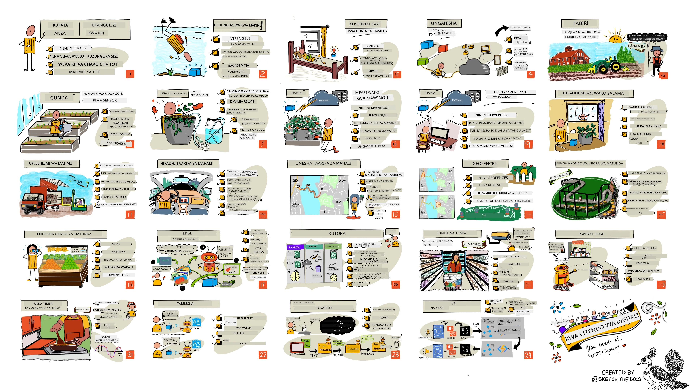

[](https://github.com/microsoft/IoT-For-Beginners/blob/master/LICENSE)
[](https://GitHub.com/microsoft/IoT-For-Beginners/graphs/contributors/)
[](https://GitHub.com/microsoft/IoT-For-Beginners/issues/)
[](https://GitHub.com/microsoft/IoT-For-Beginners/pulls/)
[](http://makeapullrequest.com)

[](https://GitHub.com/microsoft/IoT-For-Beginners/watchers/)
[](https://GitHub.com/microsoft/IoT-For-Beginners/network/)
[](https://GitHub.com/microsoft/IoT-For-Beginners/stargazers/)

### Jiunge na Jumuiya ya Azure AI Foundry

Ikiwa unakumbwa na shida au una maswali yoyote kuhusu ujenzi wa programu za AI. Jiunge na wapenzi wenzako na waendelezaji wenye uzoefu kwenye mijadala kuhusu MCP. Ni jamii inayounga mkono ambapo maswali yanakaribishwa na maarifa yanasambazwa kwa uhuru.

[](https://discord.gg/nTYy5BXMWG)

Ikiwa una maoni kuhusu bidhaa au makosa wakati wa kujenga tembelea:

[](https://aka.ms/foundry/forum)

Fuata hatua hizi ili kuanza kutumia rasilimali hizi:
1. **Fungua Fork ya Repositori**: Bofya [](https://GitHub.com/microsoft/IoT-For-Beginners/fork)
2. **Kokotoa Repositori**:   `git clone https://github.com/microsoft/IoT-For-Beginners.git`
3. [**Jiunge na Discord ya Microsoft Foundry na ukutane na wataalamu na waendelezaji wenzako**](https://discord.com/invite/ByRwuEEgH4)


### 🌐 Msaada wa Lugha Mbalimbali

#### Unaungwa mkono kupitia GitHub Action (Otometi & Daima Imebadilika Kwenye Hali ya Hivi Karibuni)

<!-- CO-OP TRANSLATOR LANGUAGES TABLE START -->
[Arabic](../ar/README.md) | [Bengali](../bn/README.md) | [Bulgarian](../bg/README.md) | [Burmese (Myanmar)](../my/README.md) | [Chinese (Simplified)](../zh-CN/README.md) | [Chinese (Traditional, Hong Kong)](../zh-HK/README.md) | [Chinese (Traditional, Macau)](../zh-MO/README.md) | [Chinese (Traditional, Taiwan)](../zh-TW/README.md) | [Croatian](../hr/README.md) | [Czech](../cs/README.md) | [Danish](../da/README.md) | [Dutch](../nl/README.md) | [Estonian](../et/README.md) | [Finnish](../fi/README.md) | [French](../fr/README.md) | [German](../de/README.md) | [Greek](../el/README.md) | [Hebrew](../he/README.md) | [Hindi](../hi/README.md) | [Hungarian](../hu/README.md) | [Indonesian](../id/README.md) | [Italian](../it/README.md) | [Japanese](../ja/README.md) | [Kannada](../kn/README.md) | [Khmer](../km/README.md) | [Korean](../ko/README.md) | [Lithuanian](../lt/README.md) | [Malay](../ms/README.md) | [Malayalam](../ml/README.md) | [Marathi](../mr/README.md) | [Nepali](../ne/README.md) | [Nigerian Pidgin](../pcm/README.md) | [Norwegian](../no/README.md) | [Persian (Farsi)](../fa/README.md) | [Polish](../pl/README.md) | [Portuguese (Brazil)](../pt-BR/README.md) | [Portuguese (Portugal)](../pt-PT/README.md) | [Punjabi (Gurmukhi)](../pa/README.md) | [Romanian](../ro/README.md) | [Russian](../ru/README.md) | [Serbian (Cyrillic)](../sr/README.md) | [Slovak](../sk/README.md) | [Slovenian](../sl/README.md) | [Spanish](../es/README.md) | [Swahili](./README.md) | [Swedish](../sv/README.md) | [Tagalog (Filipino)](../tl/README.md) | [Tamil](../ta/README.md) | [Telugu](../te/README.md) | [Thai](../th/README.md) | [Turkish](../tr/README.md) | [Ukrainian](../uk/README.md) | [Urdu](../ur/README.md) | [Vietnamese](../vi/README.md)

> **Unapendelea Kutaka Kukokotoa Kwenye Kompyuta Binafsi?**
>
> Repositori hii ina zaidi ya tafsiri 50 za lugha ambazo huongeza kwa kiasi kikubwa ukubwa wa kupakua. Ili kukokotoa bila tafsiri, tumia sparse checkout:
>
> **Bash / macOS / Linux:**
> ```bash
> git clone --filter=blob:none --sparse https://github.com/microsoft/IoT-For-Beginners.git
> cd IoT-For-Beginners
> git sparse-checkout set --no-cone '/*' '!translations' '!translated_images'
> ```
>
> **CMD (Windows):**
> ```cmd
> git clone --filter=blob:none --sparse https://github.com/microsoft/IoT-For-Beginners.git
> cd IoT-For-Beginners
> git sparse-checkout set --no-cone "/*" "!translations" "!translated_images"
> ```
>
> Hii inakupa kila kitu unachohitaji kukamilisha kozi kwa upakuaji wa kasi zaidi.
<!-- CO-OP TRANSLATOR LANGUAGES TABLE END -->

# IoT kwa Waanzilishi - Mtaala

Wataalam wa Azure Cloud Advocates wa Microsoft wanafurahia kutoa mtaala wa wiki 12, masomo 24 kuhusu misingi ya IoT. Kila somo linajumuisha maswali kabla na baada ya somo, maagizo yaliyoandikwa ya kumaliza somo, suluhisho, kazi na zaidi. Mbinu yetu inayojikita kwenye miradi inakuwezesha kujifunza ukiwa unajenga, njia iliyo thibitishwa ya kuimarisha ujuzi mpya.

Miradi inafunika safari ya chakula kutoka shambani hadi meza. Hii inajumuisha kilimo, usafirishaji, uzalishaji, maduka na mtumiaji - maeneo maarufu ya sekta kwa vifaa vya IoT.



> Sketchnote na [Nitya Narasimhan](https://github.com/nitya). Bofya picha kwa toleo kubwa zaidi.

**Shukrani za dhati kwa waandishi wetu [Jen Fox](https://github.com/jenfoxbot), [Jen Looper](https://github.com/jlooper), [Jim Bennett](https://github.com/jimbobbennett), na msanii wetu wa sketchnote [Nitya Narasimhan](https://github.com/nitya).**

**Pia shukrani kwa timu yetu ya [Microsoft Learn Student Ambassadors](https://studentambassadors.microsoft.com?WT.mc_id=academic-17441-jabenn) ambao wamekuwa wakipitia na kutafsiri mtaala huu - [Aditya Garg](https://github.com/AdityaGarg00), [Anurag Sharma](https://github.com/Anurag-0-1-A), [Arpita Das](https://github.com/Arpiiitaaa), [Aryan Jain](https://www.linkedin.com/in/aryan-jain-47a4a1145/), [Bhavesh Suneja](https://github.com/EliteWarrior315), [Faith Hunja](https://faithhunja.github.io/), [Lateefah Bello](https://www.linkedin.com/in/lateefah-bello/), [Manvi Jha](https://github.com/Severus-Matthew), [Mireille Tan](https://www.linkedin.com/in/mireille-tan-a4834819a/), [Mohammad Iftekher (Iftu) Ebne Jalal](https://github.com/Iftu119), [Mohammad Zulfikar](https://github.com/mohzulfikar), [Priyanshu Srivastav](https://www.linkedin.com/in/priyanshu-srivastav-b067241ba), [Thanmai Gowducheruvu](https://github.com/innovation-platform), na [Zina Kamel](https://www.linkedin.com/in/zina-kamel/).**

Kutana na timu!

[](https://youtu.be/-wippUJRi5k)

**Gif iliyo tengenezwa na** [Mohit Jaisal](https://linkedin.com/in/mohitjaisal)

> 🎥 Bofya picha hapo juu kwa video kuhusu mradi!

> **Walimu**, tumeshirikisha [mapendekezo kadhaa](for-teachers.md) juu ya jinsi ya kutumia mtaala huu. Ikiwa ungependa kuunda masomo yako wenyewe, pia tumeshirikisha [kielelezo cha somo](lesson-template/README.md).

> **[Wanafunzi](https://aka.ms/student-page)**, ili kutumia mtaala huu peke yako, fungua fork ya repozitori yote na maliza mazoezi peke yako, kuanzia na mtihani wa kabla ya duru, kisha soma duru na maliza shughuli zote. Jaribu kutengeneza miradi kwa kuelewa masomo badala ya kunakili msimbo wa suluhisho; hata hivyo msimbo huo upo kwenye folda za /solutions kwenye kila somo linalolenga mradi. Wazo jingine ni kuunda kikundi cha masomo na marafiki na kupitia maudhui pamoja. Kwa masomo zaidi, tunaashauri [Microsoft Learn](https://docs.microsoft.com/users/jimbobbennett/collections/ke2ehd351jopwr?WT.mc_id=academic-17441-jabenn).

Kwa muhtasari wa video wa kozi hii, angalia video hii:

[](https://youtube.com/watch?v=bccEMm8gRuc "Promo video")

> 🎥 Bofya picha hapo juu kwa video kuhusu mradi!

## Mbinu ya Kufundisha

Tumekuwa tunazingatia kanuni mbili za kufundisha wakati wa kujenga mtaala huu: kuhakikisha kuwa unajikita kwenye mradi na unajumuisha mitihani mara kwa mara. Mwishoni mwa mfululizo huu, wanafunzi watakuwa wametengeneza mfumo wa kufuatilia mimea na kumwagilia, kifuatilia magari, usanifu wa kiwanda smart wa kufuatilia na kukagua chakula, na kengele ya kupika inayodhibitiwa kwa sauti, na watakuwa wamejifunza misingi ya Internet of Things ikijumuisha jinsi ya kuandika msimbo wa kifaa, kuungana na mawingu, kuchambua telemetry na kuendesha AI pembezoni.

Kwa kuhakikisha kuwa maudhui yanalingana na miradi, mchakato unakuwa wa kuvutia zaidi kwa wanafunzi na kuhifadhi dhana kutazidi kuimarika.

Zaidi ya hayo, mtihani wa hatari ndogo kabla ya darasa unaweka nia ya mwanafunzi kuelekea kujifunza somo, wakati mtihani wa pili baada ya darasa unahakikisha kuhifadhi zaidi. Mtaala huu ulilengwa kuwa rahisi na wa kufurahisha na unaweza kuchukuliwa kwa jumla au sehemu. Miradi inaanza ndogo na kuwa ngumu zaidi mwishoni mwa mzunguko wa wiki 12.

Kila mradi unazingatia vifaa halisi vilivyopo kwa wanafunzi na wapenda burudani. Kila mradi unaangalia eneo maalum la mradi, ukitoa maarifa muhimu ya awali. Ili kuwa msanidi programu mwenye mafanikio ni muhimu kuelewa eneo unalotatua matatizo, kutoa maarifa haya ya awali husaidia wanafunzi kufikiria kuhusu suluhisho na masomo yao ya IoT katika muktadha wa aina ya tatizo halisi katika dunia ambayo wanaweza kuwa wanaombwa kutatua kama msanidi wa IoT. Wanafunzi hujifunza 'kwa nini' ya suluhisho wanazojenga, na kupata fahamu kuhusu mtumiaji wa mwisho.

## Vifaa vya Kielektroniki
Tuna chaguzi mbili za vifaa vya IoT kutumia kwa miradi kulingana na upendeleo wa mtu binafsi, maarifa ya lugha ya programu au mapendeleo, malengo ya kujifunza na upatikanaji. Pia tumetoa toleo la 'vimiliki wa kawaida' kwa wale wasio na upatikanaji wa vifaa, au wanaotaka kujifunza zaidi kabla ya kuamua kununua. Unaweza kusoma zaidi na kupata 'orodha ya ununuzi' kwenye [ukurasa wa vifaa](./hardware.md), ikiwa ni pamoja na viungo vya kununua seti kamili kutoka kwa marafiki zetu wa Seeed Studio.

> 💁 Pata [Kanuni Yetu za Maadili](CODE_OF_CONDUCT.md), [Kushiriki](CONTRIBUTING.md), na miongozo ya [Tafsiri](..). Tunakaribisha maoni yako yenye kujenga!
>
> 🔧 Unakumbwa na matatizo? Angalia [Mwongozo wetu wa Kukarabati](TROUBLESHOOTING.md) kwa suluhisho za matatizo ya kawaida.

## Kila somo linajumuisha:

- mchoro wa muhtasari
- video ya nyongeza ya hiari
- jaribio la kuwasha kabla ya somo
- somo lililoandikwa
- kwa masomo yanayotegemea mradi, miongozo ya hatua kwa hatua jinsi ya kujenga mradi
- ukaguzi wa maarifa
- changamoto
- usomaji wa ziada
- kazi
- [jaribio baada ya somo](https://ff-quizzes.netlify.app/en/)

> **Kumbuka kuhusu jaribio**: Jaribio zote zipo kwenye folda ya quiz-app, kwa jumla ya jaribio 48 za maswali matatu kila moja. Zimeunganishwa kutoka ndani ya masomo lakini programu ya jaribio inaweza kuendeshwa kwa eneo au kuunganishwa Azure; fuata maelekezo kwenye folda ya `quiz-app`. Zinatafsiriwa taratibu.

## Masomo

|       |              Jina la Mradi              |                       Misingi Inayofundishwa                       | Malengo ya Kujifunza                                                                                                                                                 |                                                        Somo Lililounganishwa                                                         |
| :---: | :------------------------------------: | :---------------------------------------------------------: | ------------------------------------------------------------------------------------------------------------------------------------------------------------------- | :--------------------------------------------------------------------------------------------------------------------------: |
|  01   | [Kuanzia](./1-getting-started/README.md) |                     Utangulizi wa IoT                     | Jifunze kanuni za msingi za IoT na vipengele vya msingi vya suluhisho za IoT kama sensor na huduma za wingu wakati unatuza kifaa chako cha kwanza cha IoT |                      [Utangulizi wa IoT](./1-getting-started/lessons/1-introduction-to-iot/README.md)                      |
|  02   | [Kuanzia](./1-getting-started/README.md) |                   Kujifunza kwa kina juu ya IoT                    | Jifunze zaidi kuhusu vipengele vya mfumo wa IoT, pamoja na microcontrollers na kompyuta za bodi moja                                                            |                        [Kujifunza kwa kina juu ya IoT](./1-getting-started/lessons/2-deeper-dive/README.md)                         |
|  03   | [Kuanzia](./1-getting-started/README.md) | Kuingiliana na dunia halisi kwa kutumia sensor na vinyanyua | Jifunze kuhusu sensor za kukusanya data kutoka duniani halisi, na actuators kutuma maoni, wakati unajenga taa ya usiku                                           | [Kuingiliana na dunia halisi kwa kutumia sensor na vinyanyua](./1-getting-started/lessons/3-sensors-and-actuators/README.md) |
|  04   | [Kuanzia](./1-getting-started/README.md) |             Unganisha kifaa chako kwenye Intaneti             | Jifunze jinsi ya kuunganisha kifaa cha IoT kwenye Intaneti kutuma na kupokea ujumbe kwa kuunganisha taa yako ya usiku kwenye broker wa MQTT                               |               [Unganisha kifaa chako kwenye Intaneti](./1-getting-started/lessons/4-connect-internet/README.md)                |
|  05   |            [Shambani](./2-farm/README.md)            |                    Kubashiri ukuaji wa mmea                     | Jifunze jinsi ya kubashiri ukuaji wa mmea kwa kutumia data ya joto inayokusanywa na kifaa cha IoT                                                                                  |                          [Kubashiri ukuaji wa mmea](./2-farm/lessons/1-predict-plant-growth/README.md)                           |
|  06   |            [Shambani](./2-farm/README.md)            |                    Gundua unyevu wa udongo                     | Jifunze jinsi ya kugundua unyevu wa udongo na kurekebisha sensor ya unyevu wa udongo                                                                                              |                          [Gundua unyevu wa udongo](./2-farm/lessons/2-detect-soil-moisture/README.md)                           |
|  07   |            [Shambani](./2-farm/README.md)            |                  Kumwagilia mimea kwa moja kwa moja                   | Jifunze jinsi ya kuendesha na kupanga muda wa kumwagilia kwa kutumia relay na MQTT                                                                                                      |                      [Kumwagilia mimea kwa moja kwa moja](./2-farm/lessons/3-automated-plant-watering/README.md)                       |
|  08   |            [Shambani](./2-farm/README.md)            |               Hamisha mmea wako kwenye wingu               | Jifunze kuhusu wingu na huduma za IoT zinazotegemewa kwenye wingu na jinsi ya kuunganisha mmea wako na moja ya hizi badala ya broker wa MQTT wa umma                                   |               [Hamisha mmea wako kwenye wingu](./2-farm/lessons/4-migrate-your-plant-to-the-cloud/README.md)                |
|  09   |            [Shambani](./2-farm/README.md)            |         Hamisha mantiki ya programu yako kwenye wingu         | Jifunze jinsi unavyoweza kuandika mantiki ya programu kwenye wingu inayojibu ujumbe wa IoT                                                                          |         [Hamisha mantiki ya programu yako kwenye wingu](./2-farm/lessons/5-migrate-application-to-the-cloud/README.md)         |
|  10   |            [Shambani](./2-farm/README.md)            |                   Linda mmea wako                    | Jifunze kuhusu usalama wa IoT na jinsi ya kulinda mmea wako kwa kutumia funguo na vyeti                                                                          |                        [Linda mmea wako](./2-farm/lessons/6-keep-your-plant-secure/README.md)                         |
|  11   |       [Usafiri](./3-transport/README.md)       |                      Ufuatiliaji wa eneo                      | Jifunze kuhusu ufuatiliaji wa eneo la GPS kwa vifaa vya IoT                                                                                                                   |                           [Ufuatiliaji wa eneo](./3-transport/lessons/1-location-tracking/README.md)                           |
|  12   |       [Usafiri](./3-transport/README.md)       |                     Hifadhi data ya eneo                     | Jifunze jinsi ya kuhifadhi data ya IoT kwa ajili ya kuonyesha au kuchambua baadaye                                                                                                      |                         [Hifadhi data ya eneo](./3-transport/lessons/2-store-location-data/README.md)                         |
|  13   |       [Usafiri](./3-transport/README.md)       |                   Onyesha data ya eneo                   | Jifunze kuhusu kuonyesha data ya eneo kwenye ramani, na jinsi ramani zinavyoonyesha dunia halisi ya 3d kwa vipimo viwili                                                            |                     [Onyesha data ya eneo](./3-transport/lessons/3-visualize-location-data/README.md)                     |
|  14   |       [Usafiri](./3-transport/README.md)       |                          Mipaka ya kijiografia                          | Jifunze kuhusu mipaka ya kijiografia, na jinsi inavyoweza kutumiwa kutoa onyo wakati magari kwenye mnyororo wa usambazaji yanapokaribia mahali pao                                           |                                   [Mipaka ya kijiografia](./3-transport/lessons/4-geofences/README.md)                                   |
|  15   |   [Uzalishaji](./4-manufacturing/README.md)   |               Fanya mazoezi ya kugundua ubora wa matunda                | Jifunze kuhusu kufundisha mtambuzi wa picha kwenye wingu kugundua ubora wa matunda                                                                                       |                 [Fanya mazoezi ya kugundua ubora wa matunda](./4-manufacturing/lessons/1-train-fruit-detector/README.md)                 |
|  16   |   [Uzalishaji](./4-manufacturing/README.md)   |           Angalia ubora wa matunda kutoka kifaa cha IoT            | Jifunze kuhusu kutumia ugunduzi wako wa ubora wa matunda kutoka kifaa cha IoT                                                                                                    |           [Angalia ubora wa matunda kutoka kifaa cha IoT](./4-manufacturing/lessons/2-check-fruit-from-device/README.md)            |
|  17   |   [Uzalishaji](./4-manufacturing/README.md)   |             Endesha mtambuzi wako wa matunda pembezoni             | Jifunze kuhusu kuendesha mtambuzi wako wa matunda kwenye kifaa cha IoT pembezoni                                                                                                |             [Endesha mtambuzi wako wa matunda pembezoni](./4-manufacturing/lessons/3-run-fruit-detector-edge/README.md)             |
|  18   |   [Uzalishaji](./4-manufacturing/README.md)   |        chochea kugundua ubora wa matunda kutoka sensor        | Jifunze kuhusu kuchochea kugundua ubora wa matunda kutoka sensor                                                                                                        |        [Chochea kugundua ubora wa matunda kutoka sensor](./4-manufacturing/lessons/4-trigger-fruit-detector/README.md)         |
|  19   |          [Rejareja](./5-retail/README.md)          |                   Fanya mazoezi ya kugundua hisa                    | Jifunze jinsi ya kutumia kugundua vitu kufundisha mtambuzi wa hisa kuhesabu hisa dukani                                                                                |                        [Fanya mazoezi ya kugundua hisa](./5-retail/lessons/1-train-stock-detector/README.md)                         |
|  20   |          [Rejareja](./5-retail/README.md)          |               Angalia hisa kutoka kifaa cha IoT                | Jifunze jinsi ya kuangalia hisa kutoka kifaa cha IoT kwa kutumia mfano wa kugundua vitu                                                                                         |                     [Angalia hisa kutoka kifaa cha IoT](./5-retail/lessons/2-check-stock-device/README.md)                      |
|  21   |        [Mtumiaji](./6-consumer/README.md)        |             Tambua hotuba na kifaa cha IoT             | Jifunze jinsi ya kutambua hotuba kutoka kifaa cha IoT kujenga taimer ya akili                                                                                             |                  [Tambua hotuba na kifaa cha IoT](./6-consumer/lessons/1-speech-recognition/README.md)                  |
|  22   |        [Mtumiaji](./6-consumer/README.md)        |                     Elewa lugha                     | Jifunze jinsi ya kuelewa sentensi zinazozungumzwa kwa kifaa cha IoT                                                                                                           |                        [Elewa lugha](./6-consumer/lessons/2-language-understanding/README.md)                        |
|  23   |        [Mtumiaji](./6-consumer/README.md)        |           Weka taimer na toa maoni ya maneno           | Jifunze jinsi ya kuweka taimer kwenye kifaa cha IoT na kutoa maoni ya maneno kuhusu wakati taimer imewekwa na inapomalizika                                                    |                 [Weka taimer na toa maoni ya maneno](./6-consumer/lessons/3-spoken-feedback/README.md)                  |
|  24   |        [Mtumiaji](./6-consumer/README.md)        |                 Saidia lugha nyingi                  | Jifunze jinsi ya kusaidia lugha nyingi, zikiwemo zinazozungumzwa na majibu kutoka taimer yako ya akili                                                               |                   [Saidia lugha nyingi](./6-consumer/lessons/4-multiple-language-support/README.md)                   |

## Upatikanaji wa Ofline

Unaweza kuendesha hati hii ya maelekezo bila mtandao kwa kutumia [Docsify](https://docsify.js.org/#/). Nakili repo hii, [weka Docsify](https://docsify.js.org/#/quickstart) kwenye mashine yako ya ndani, kisha katika folda kuu ya repo hii, andika `docsify serve`. Tovuti itapatikana kwenye bandari 3000 kwenye localhost yako: `localhost:3000`.

## Jaribio

Asante kwa jamii kwa kuhudumia jaribio la mwingiliano ambalo linakagua maarifa yako kwenye kila sura. Jaribu maarifa yako [hapa](https://ff-quizzes.netlify.app/en/) 

### PDF

Unaweza kutengeneza PDF ya maudhui haya kwa upatikanaji bila mtandao ikiwa inahitajika. Kufanya hivyo, hakikisha umeweka [npm](https://docs.npmjs.com/downloading-and-installing-node-js-and-npm) na endesha amri zifuatazo katika folda kuu ya repo hii:

```sh
npm i
npm run convert
```

### Msururu wa slaidi

Kuna misururu ya slaidi kwa baadhi ya masomo katika folda ya [slides](../../slides).


## Mtaala Mwingine

Timu yetu hutengeneza mtaala mingine! Angalia:

<!-- CO-OP TRANSLATOR OTHER COURSES START -->
### LangChain
[](https://aka.ms/langchain4j-for-beginners)
[](https://aka.ms/langchainjs-for-beginners?WT.mc_id=m365-94501-dwahlin)
[](https://github.com/microsoft/langchain-for-beginners?WT.mc_id=m365-94501-dwahlin)
---

### Azure / Edge / MCP / Majukumu
[](https://github.com/microsoft/AZD-for-beginners?WT.mc_id=academic-105485-koreyst)
[](https://github.com/microsoft/edgeai-for-beginners?WT.mc_id=academic-105485-koreyst)
[](https://github.com/microsoft/mcp-for-beginners?WT.mc_id=academic-105485-koreyst)
[](https://github.com/microsoft/ai-agents-for-beginners?WT.mc_id=academic-105485-koreyst)

---
 
### Mfululizo wa AI Inayotengeneza
[](https://github.com/microsoft/generative-ai-for-beginners?WT.mc_id=academic-105485-koreyst)
[-9333EA?style=for-the-badge&labelColor=E5E7EB&color=9333EA)](https://github.com/microsoft/Generative-AI-for-beginners-dotnet?WT.mc_id=academic-105485-koreyst)
[-C084FC?style=for-the-badge&labelColor=E5E7EB&color=C084FC)](https://github.com/microsoft/generative-ai-for-beginners-java?WT.mc_id=academic-105485-koreyst)
[-E879F9?style=for-the-badge&labelColor=E5E7EB&color=E879F9)](https://github.com/microsoft/generative-ai-with-javascript?WT.mc_id=academic-105485-koreyst)

---
 
### Kujifunza Msingi
[](https://aka.ms/ml-beginners?WT.mc_id=academic-105485-koreyst)
[](https://aka.ms/datascience-beginners?WT.mc_id=academic-105485-koreyst)
[](https://aka.ms/ai-beginners?WT.mc_id=academic-105485-koreyst)
[](https://github.com/microsoft/Security-101?WT.mc_id=academic-96948-sayoung)
[](https://aka.ms/webdev-beginners?WT.mc_id=academic-105485-koreyst)
[](https://aka.ms/iot-beginners?WT.mc_id=academic-105485-koreyst)
[](https://github.com/microsoft/xr-development-for-beginners?WT.mc_id=academic-105485-koreyst)

---
 
### Mfululizo wa Copilot
[](https://aka.ms/GitHubCopilotAI?WT.mc_id=academic-105485-koreyst)
[](https://github.com/microsoft/mastering-github-copilot-for-dotnet-csharp-developers?WT.mc_id=academic-105485-koreyst)
[](https://github.com/microsoft/CopilotAdventures?WT.mc_id=academic-105485-koreyst)
<!-- CO-OP TRANSLATOR OTHER COURSES END -->

## Mikopo ya Picha

Unaweza kupata mikopo yote ya picha zilizotumika katika mtaala huu pale panapohitajika katika [Attributions](./attributions.md).

---

<!-- CO-OP TRANSLATOR DISCLAIMER START -->
**Kumbuka**:  
Hati hii imetafsiriwa kwa kutumia huduma ya tafsiri ya AI [Co-op Translator](https://github.com/Azure/co-op-translator). Ingawa tunajitahidi kwa usahihi, tafadhali fahamu kuwa tafsiri za kiotomatiki zinaweza kuwa na makosa au kasoro. Hati asili kwa lugha yake ya asili inapaswa kuzingatiwa kama chanzo cha mamlaka. Kwa taarifa muhimu, tafsiri ya kitaalamu inayofanywa na binadamu inashauriwa. Hatuna wajibu wowote kwa kutokuelewana au makosa yanayoweza kutokana na matumizi ya tafsiri hii.
<!-- CO-OP TRANSLATOR DISCLAIMER END -->