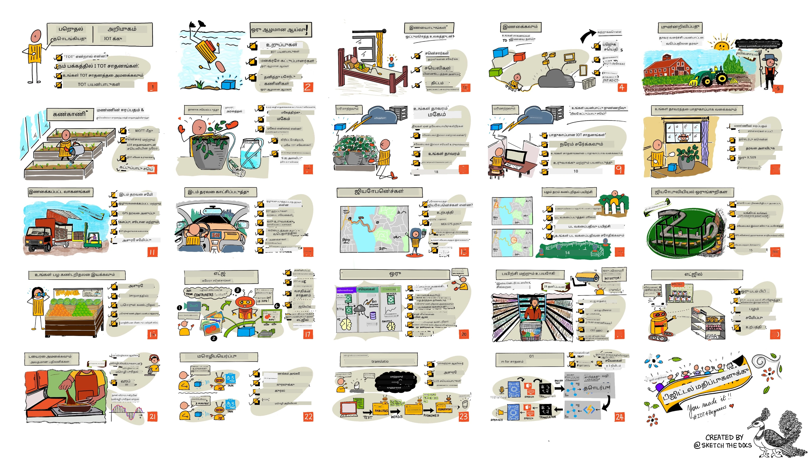

<!--
CO_OP_TRANSLATOR_METADATA:
{
  "original_hash": "6c354ec3487e4f6cfafbe44557996cd9",
  "translation_date": "2026-01-07T00:57:07+00:00",
  "source_file": "README.md",
  "language_code": "ta"
}
-->
### Azure AI Foundry சமூகத்தில் சேருங்கள்

நீங்கள் சிக்கல் அடைந்தால் அல்லது AI பயன்பாடுகளை உருவாக்குவதில் எந்தவொரு கேள்விகளும் இருந்தால், MCP பற்றி விவாதங்களில் இணைந்துள்ள மற்ற கற்றற்பவர்கள் மற்றும் அனுபவ 가진 டெவலப்பர்களுடன் கலந்துரையாடுங்கள். இது கேள்விகளுக்கு வரவேற்பு வைக்கும் மற்றும் அறிவை சுதந்திரமாக பகிரும் ஆதரவு வாய்ந்த ஒரு சமூகமாகும்.

உற்பத்தி கருத்துக்களோ அல்லது பிழைகளின்வளையால் கட்டுமானத்தின் போது, கீழ்காணும் இடத்தைப் பார்த்திடுங்கள்:

இவ்வளவுக்கான வளங்களை பயன்படுத்தத் தொடங்க கீழ்காணும் படிகளை பின்பற்றவும்:
1. **கோப்பகத்தை பங்கிடுங்கள்**: கிளிக் செய்யவும் [](https://GitHub.com/microsoft/IoT-For-Beginners/fork)
2. **கோப்பகத்தை கிளோன் செய்யவும்**:   `git clone https://github.com/microsoft/IoT-For-Beginners.git`
3. [**Microsoft Foundry Discord இல் சேர்ந்து நிபுணர்களுடன் மற்றும் மற்ற டெவலப்பர்களுடன் சந்திக்கவும்**](https://discord.com/invite/ByRwuEEgH4)

### 🌐 பன்மொழி ஆதரவு

#### GitHub செயல்பாட்டின் மூலம் (தானியங்கி & எப்போதும் புதுப்பிக்கப்பட்டது)

> **உள்ளூர் கிளோன் செய்துகொள்ள விரும்புகிறீர்களா?**

> இந்தறுப்பு 50+ மொழி மொழிபெயர்ப்புகளை கொண்டுள்ளது, இது பதிவிறக்கும் அளவை பெரிதும் அதிகரிக்கிறது. மொழிபெயர்ப்புகள் இல்லாமல் கிளோன் செய்ய sparse checkout ஐ பயன்படுத்தவும்:
> ```bash
> git clone --filter=blob:none --sparse https://github.com/microsoft/IoT-For-Beginners.git
> cd IoT-For-Beginners
> git sparse-checkout set --no-cone '/*' '!translations' '!translated_images'
> ```
> இது அடியெடுத்து முறையாக விரைவான பதிவிறக்கத்துடன் இந்தப் பாடத்திட்டத்தை முடிக்க தேவையான அனைத்தையும் நமக்கு வழங்கும்.

# ஆரம்பநிலை IoT - ஒரு பாடத்திட்டம்

Microsoft இன் Azure Cloud Advocates, IoT அடிப்படைகள் பற்றி முழுமையான 12 வார, 24 பாடங்கள் கொண்ட பாடத்திட்டத்தை வழங்க மனமுள்ளது. ஒவ்வொரு பாடத்திலும் முன்னும் பின்னும் வினாக்களும், பாடம் முடிக்க எழுதப்பட்ட வழிமுறையும், தீர்வும், பணிகளும் போன்றவை உள்ளன. நமது திட்டஅடிப்படையிலான கற்றறிதல் முறையில் நீங்கள் கட்டுமானம் செய்து கற்றுக் கொள்ளலாம், இது புதிய திறன்களை நீட்டிப்பதில் சீரான வழியாகும்.

இந்தத் திட்டங்கள் உணவு விவசாயம் முதல் மேசை வரை பயணத்தை அடைகின்றன. இதில் விவசாயம், லாஜிஸ்டிக்ஸ், உற்பத்தி, சில்லறை வியாபாரம் மற்றும் நுகர்வு - அனைத்தும் IoT கருவிகளுக்கான பிரபலமான தொழில் பகுதிகள்.



> [Nitya Narasimhan](https://github.com/nitya) அவர்களின் வடிவமைப்பு. பெரிய பதிப்பை பார்க்க படத்தை கிளிக் செய்யவும்.

**எங்கள் ஆசிரியர்கள் [Jen Fox](https://github.com/jenfoxbot), [Jen Looper](https://github.com/jlooper), [Jim Bennett](https://github.com/jimbobbennett) மற்றும் எங்கள் வடிவமைப்பு கலைஞர் [Nitya Narasimhan](https://github.com/nitya) அவர்களுக்கு மனமார்ந்த நன்றி.**

**மேலும் இந்த பாடத்திட்டத்தை பரிசீலித்து மொழிபெயர்த்த Microsoft Learn மாணவர் தூதர்கள் குழுவுக்கு நன்றி - [Aditya Garg](https://github.com/AdityaGarg00), [Anurag Sharma](https://github.com/Anurag-0-1-A), [Arpita Das](https://github.com/Arpiiitaaa), [Aryan Jain](https://www.linkedin.com/in/aryan-jain-47a4a1145/), [Bhavesh Suneja](https://github.com/EliteWarrior315), [Faith Hunja](https://faithhunja.github.io/), [Lateefah Bello](https://www.linkedin.com/in/lateefah-bello/), [Manvi Jha](https://github.com/Severus-Matthew), [Mireille Tan](https://www.linkedin.com/in/mireille-tan-a4834819a/), [Mohammad Iftekher (Iftu) Ebne Jalal](https://github.com/Iftu119), [Mohammad Zulfikar](https://github.com/mohzulfikar), [Priyanshu Srivastav](https://www.linkedin.com/in/priyanshu-srivastav-b067241ba), [Thanmai Gowducheruvu](https://github.com/innovation-platform), மற்றும் [Zina Kamel](https://www.linkedin.com/in/zina-kamel/).**

தயாரிப்பாளரை சந்திக்கவும்!

[](https://youtu.be/-wippUJRi5k)

**Gif தயாரிப்பாளர்** [Mohit Jaisal](https://linkedin.com/in/mohitjaisal)

> 🎥 இந்த திட்டத்தின் வீடியோவைப் பார்க்க படத்தை கிளிக் செய்யவும்!

> **ஆசிரியர்கள்**, இந்த பாடத்திட்டத்தை எவ்வாறு பயன்படுத்துவது என்பதைப் பற்றிய [சூழலை](for-teachers.md) நாங்கள் இணைத்துள்ளோம். உங்கள் சொந்த பாடங்களை உருவாக்க விரும்பினால், [பாட குறிப்புக்கூறு](lesson-template/README.md)கூட இணைக்கப்பட்டுள்ளது.

> **[மாணவர்கள்](https://aka.ms/student-page)**, இந்த பாடத்திட்டத்தை தனிப்படியாக பயன்படுத்த, முழு ரெப்போக்களையும் பங்கேற்று உங்கள் தனிப்பட்ட முறையில் பயிற்சிகளைச் செய்யவும். முன்னோக்கிப் பதிவெடுக்கவும், பின்னர் பாங் குறிப்புகளை வாசித்து மீதமுள்ள நடவடிக்கைகள் முடிக்கவும். தீர்வு குறியீட்டைக் நகலெடுக்காமல் குழப்பத்தை புரிந்து கொண்டு திட்டங்களை உருவாக்க முயற்சிக்கவும்; அதே குறியீடு /solutions கோப்புறைகளில் கிடைக்கிறது. அல்லது நண்பர்களுடன் படிப்பு குழுவை அமைத்து பொதுவாகச் செயல்படவும். மேலதிக கற்றல் க்காக [Microsoft Learn](https://docs.microsoft.com/users/jimbobbennett/collections/ke2ehd351jopwr?WT.mc_id=academic-17441-jabenn) பரிந்துரைக்கப்படுகிறது.

இந்த பாடநெறியைப் பற்றிய வீடியோ பார்வை கீழே உள்ளது:

[](https://youtube.com/watch?v=bccEMm8gRuc "வீடியோ விளக்கம்")

> 🎥 இந்த திட்டம் பற்றிய வீடியோவைப் பார்க்க படத்தை கிளிக் செய்யவும்!

## கற்றல் முறை

இந்த பாடத்திட்டத்தை உருவாக்கும்போது, இரண்டு கற்றல் முறை கோட்பாடுகள் தேர்ந்தெடுக்கப்பட்டன: திட்ட அடிப்படையாக்கம் மற்றும் அடிக்கடி வினாக்கள். இந்த தொடரின் முடிவில், மாணவர்கள் ஒரு ஆலைத் தாவர கண்காணிப்பு மற்றும் நீர் உறைப்பு அமைப்பு, வாகன கண்காணிப்பான், உணவை கண்டறிந்து பரிசோதிக்கும் ஒரு சுட்டி தொழிற்சாலை அமைப்பும், குரல் கட்டுப்பாட்டுக்கான சமையல் நேரக்கணினியும் உருவாக்கும் மற்றும் IoT அடிப்படைகளை அறிந்து, சாதனக் குறியீடு எழுதுதல், மேகத்துடன் இணைக்கும், தொலைதொடர்பு பகுப்பாய்வு மற்றும் எஜ் AI இயக்கு ஆகியவற்றை கற்றுக்கொள்வர்.

திட்டங்களுடன் இணைக்கப்பட்ட உள்ளடக்கம் மாணவர்களுக்கு ஈடுபாட்டை அதிகரிக்கச் செய்யும் மற்றும் கருத்துக்களை நீடிக்க உதவும்.

மேலும், ஒரு வகுப்புக்கு முன் சிறிய வினாடி வினா மாணவரின் கற்றல் நோக்கத்தை உருவாக்கும், வகுப்பு முடிந்த பின் மேலும் பிடித்து வைத்தல் வினா உண்டு. இந்த பாடத்திட்டம் நெகிழ்வானதும் மகிழ்ச்சியானதும் ஆகும் மற்றும் முழுமையாக அல்லது பகுதி முறையில் தேற்றிக்கொள்ளலாம். 12 வார சுழற்சி முடிவுக்கு திட்டங்கள் சிறியதாக ஆரம்பித்து, அதிகப்படியான சிக்கலுடன் முடியும்.

ஒவ்வொரு திட்டமும் மாணவர்கள் மற்றும் ஆர்வலர்களுக்கு கிடைக்கும் உண்மையான ஹார்ட்வேர் அடிப்படையிலானது. ஒவ்வொரு திட்டமும் குறிப்பிட்ட துறை விவரத்தை ஆராய்ந்து, தொடர்புடைய பின்னணி அறிவை வழங்குகிறது. ஒரு சிறந்த டெவலப்பராக செயல்பட, நீங்கள் எங்கு பிரச்சினைகளை தீர்க்கின்றீர்கள் என்பதைக் கருதியிருக்க வேண்டும், இதன் மூலம் IoT தீர்வுகளையும் கற்றல்களையும் நீங்கள் உருவாக்கும் சூழலில் சொல்ல உதவும். மாணவர்கள் அவர்கள் உருவாக்கும் தீர்வுகளின் 'ஏன்' ன் தகவலையும் கடைசி பயனாளரின் பார்வையையும் புரிந்துகொள்ளக் கற்றுக் கொள்வார்கள்.

## ஹார்ட்வேர்

தனிப்பட்ட விருப்பம், நிரலாக்க மொழி அறிவு அல்லது விருப்பங்கள், கற்றல் நோக்கங்கள் மற்றும் கிடைக்கும் நிலையைக் கருத்தில் கொண்டு திட்டங்களுக்கு இரண்டு வகையான IoT ஹார்ட்வேர் உண்டு. ஹார்ட்வேர் இல்லாதவார்க்கு அல்லது வாங்குவதற்கு முன் மேலும் கற்றுக் கொள்ள விரும்பும் వారికి 'மெய்நிகர் ஹார்ட்வேர்' பதிப்பும் உள்ளது. இதைப் பற்றி மேலும் கேட்கும் மற்றும் முழு தொகுப்புகளை வாங்க Seeed Studio நண்பர்களிடமிருந்து இணைப்புகளுடன் 'ஷாப்பிங் பட்டியல்' ஹார்ட்வேர் பக்கத்தில் உள்ளன.
> 💁 எங்கள் [Code of Conduct](CODE_OF_CONDUCT.md), [Contributing](CONTRIBUTING.md), மற்றும் [Translation](TRANSLATIONS.md) கோரிக்கைகளை காண்க. உங்கள் கட்டுமானமான பதில்களை வரவேற்கின்றோம்!
>
> 🔧 சிக்கல்களா? பொதுவான பிரச்சனைகளுக்கான தீர்வுகளுக்காக எங்கள் [Troubleshooting Guide](TROUBLESHOOTING.md) ஐப் பாருங்கள்.

## ஒவ்வொரு பாடமும் உள்ளடக்கம்:

- சுருக்கப்பட்ட குறிப்பு
- விருப்பமான கூடுதல் வீடியோ
- பாடமுன் உடற்பயிற்சி வினாடி வினா
- எழுத்து பாடம்
- திட்ட அடிப்படையிலான பாடங்களுக்கு, திட்டம் எப்படி உருவாக்குவது என்பதற்கான படி படி வழிகாட்டல்கள்
- அறிவு பரிசோதனை
- ஒரு சவால்
- கூடுதல் வாசிப்பு
- பணிகள்
- [பாடத்துக்குப் பிறகு வினாடி வினா](https://ff-quizzes.netlify.app/en/)

> **வினாடி வினாக்களுக்கு குறிப்பு**: அனைத்து வினாடி வினாக்களும் quiz-app என்ற கோப்பகத்தில் உள்ளன, ஒவ்வொன்றிலும் மூன்று கேள்விகளுடன் மொத்தம் 48 வினாடி வினாக்கள் உள்ளன. அவை பாடங்களுக்குள் இணைக்கப்பட்டுள்ளன, ஆனால் quiz ஆன்டையை உள்ளூர் சுருக்கமாக இயக்கவோ அல்லது Azure இல் வடிகட்டவோ செய்யலாம்; `quiz-app` கோப்பகத்திலுள்ள வழிமுறைகளை பின்பற்றவும். அவை படிப்படியாக மொழி மாற்றப்படுகின்றன.

## பாடங்கள்

|       |              திட்டத்தின் பெயர்              |                       கற்றுத்தரும் கருத்துக்கள்                       | கற்பது குறிக்கோள்கள்                                                                                                                                                 |                                                        இணைக்கப்பட்ட பாடம்                                                         |
| :---: | :------------------------------------: | :---------------------------------------------------------: | ------------------------------------------------------------------------------------------------------------------------------------------------------------------- | :--------------------------------------------------------------------------------------------------------------------------: |
|  01   | [தொடக்கம்](./1-getting-started/README.md) |                     IoT அறிமுகம்                     | உங்கள் முதல் IoT சாதனத்தை அமைக்கும்போது சென்சார் கள் மற்றும் கிளவுஸ் சேவைகள் போன்று IoT அடிப்படைக் கொள்கைகள் மற்றும் அடிப்படைக் கட்டமைப்புகளை கற்றுக்கொள்ளுங்கள் |                      [IoT அறிமுகம்](./1-getting-started/lessons/1-introduction-to-iot/README.md)                      |
|  02   | [தொடக்கம்](./1-getting-started/README.md) |                   IoT இல் ஆழ்ந்த கற்றல்                    | IoT அமைப்பின் கூறுகள், மைக்ரோ கண்ட்ரோலர் மற்றும் ஒற்றை பலகை கணினிகள் பற்றி மேலும் கற்றுக்கொள்ளுங்கள்                                                            |                        [IoT இல் ஆழ்ந்த கற்றல்](./1-getting-started/lessons/2-deeper-dive/README.md)                         |
|  03   | [தொடக்கம்](./1-getting-started/README.md) | சென்சார் மற்றும் செயல்படுத்திகளுடன் இயற்பெயர்க உலகுடன் தொடர்பு கொள்ளுதல் | இயற்பெயர்க உலகத்திலிருந்து தரவை சேகரிக்கும் சென்சார்களின் பற்றி, மற்றும் பின்னூட்டம் அனுப்பும் செயல்படுத்திகளின் பற்றி கற்றுக்கொள்ளுங்கள், மேலும் ஒரு இரவுக்குமிளிர்ச்சி கட்டியிடுங்கள்                                           | [சென்சார் மற்றும் செயல்படுத்திகளுடன் இயற்பெயர்க உலகுடன் தொடர்பு கொள்ளுதல்](./1-getting-started/lessons/3-sensors-and-actuators/README.md) |
|  04   | [தொடக்கம்](./1-getting-started/README.md) |             உங்கள் சாதனத்தை இணையத்துடன் இணைத்தல்             | ஒரு IoT சாதனத்தை இணையத்துடன் இணைத்து செய்தி அனுப்பி பெறுவது எப்படி என்பதை உங்கள் இரவுக்குமிளிர்ச்சியை MQTT பிரேக்கருடன் இணைத்து அறியுங்கள்                               |               [உங்கள் சாதனத்தை இணையத்துடன் இணைத்தல்](./1-getting-started/lessons/4-connect-internet/README.md)                |
|  05   |            [பண்ணை](./2-farm/README.md)            |                    தாவர வளர்ச்சியைக் கணிக்கின்றது                     | ஒரு IoT சாதனத்தால் பிடிக்கப்பட்ட வெப்பநிலை தரவைப் பயன்படுத்தி தாவர வளர்ச்சியைக் கணிக்க முறை கற்றுக்கொள்ளுங்கள்                                                                                  |                          [தாவர வளர்ச்சியைக் கணிக்கச் செய்யல்](./2-farm/lessons/1-predict-plant-growth/README.md)                           |
|  06   |            [பண்ணை](./2-farm/README.md)            |                    மண் ஈரப்பதத்தை கண்டறிதல்                     | மண் ஈரப்பதத்தை கண்டறிந்து மண் ஈரப்பத சென்சாரை கலிபிரேட் செய்வது எப்படி என்பதை கற்றுக்கொள்ளுங்கள்                                                                                              |                          [மண் ஈரப்பதத்தை கண்டறிதல்](./2-farm/lessons/2-detect-soil-moisture/README.md)                           |
|  07   |            [பண்ணை](./2-farm/README.md)            |                  தாவரை தானாக நீர் பாய்ச்சுதல்                   | ஒரு ரிலே மற்றும் MQTT பயன்படுத்தி நீர் பாய்ச்சலை தானாக மற்றும் கால நிரலை அமைக்குவது எப்படி கற்றுக்கொள்ளுங்கள்                                                                                                      |                      [தாவரை தானாக நீர் பாய்ச்சுதல்](./2-farm/lessons/3-automated-plant-watering/README.md)                       |
|  08   |            [பண்ணை](./2-farm/README.md)            |               உங்கள் தாவரத்தை கிளவுட்டுக்கு மாற்றுங்கள்               | கிளவுட் மற்றும் கிளவுட்-பார்வையிடப்பட்ட IoT சேவைகள் பற்றி அறிந்து, பொதுவான MQTT பிரேக்கர் பதிலாக உங்கள் தாவரத்தை இதைத் தொடர்பு செய்ய கற்றுக்கொள்ளுங்கள்                                   |               [உங்கள் தாவரத்தை கிளவுட்டுக்கு மாற்றுங்கள்](./2-farm/lessons/4-migrate-your-plant-to-the-cloud/README.md)                |
|  09   |            [பண்ணை](./2-farm/README.md)            |         உங்கள் பயன்பாட்டு தர்க்கத்தை கிளவுட்டுக்கு மாற்றுங்கள்         | IoT செய்திகளுக்கு பதிலளிக்கும் கிளவுடில் பயன்பாட்டு தர்க்கத்தை நீங்கள் எப்படி எழுதுவது என்பதைக் கற்றுக்கொள்ளுங்கள்                                                                          |         [உங்கள் பயன்பாட்டு தர்க்கத்தை கிளவுட்டுக்கு மாற்றுங்கள்](./2-farm/lessons/5-migrate-application-to-the-cloud/README.md)         |
|  10   |            [பண்ணை](./2-farm/README.md)            |                   உங்கள் தாவரத்தை பாதுகாப்பாக வைத்திருங்கள்                    | IoT பாதுகாப்பு மற்றும் உங்கள் தாவரத்தை சாவிகள் மற்றும் சான்றிதழ்களுடன் பாதுகாப்பது எப்படி என்று கற்றுக்கொள்ளுங்கள்                                                                          |                        [உங்கள் தாவரத்தை பாதுகாப்பாக வைத்திருங்கள்](./2-farm/lessons/6-keep-your-plant-secure/README.md)                         |
|  11   |       [பரிவহন](./3-transport/README.md)       |                      இடம் குறிமுறை                      | IoT சாதனங்களுக்கு GPS இடம் கண்காணிப்பை பற்றி அறியுங்கள்                                                                                                                   |                           [இடம் குறிமுறை](./3-transport/lessons/1-location-tracking/README.md)                           |
|  12   |       [பரிவহন](./3-transport/README.md)       |                     இடம் தரவைச் சேமித்தல்                     | IoT தரவை பின்பு காண்பிக்க அல்லது பகுப்பாய்வு செய்யச் சேமிப்பது எப்படி கற்றுக்கொள்ளுங்கள்                                                                                                      |                         [இடம் தரவைச் சேமித்தல்](./3-transport/lessons/2-store-location-data/README.md)                         |
|  13   |       [பரிவহন](./3-transport/README.md)       |                   இடம் தரவை காட்சிப்படுத்துதல்                   | வரைபடத்திலுள்ள இடம் தரவை காட்சிப்படுத்துவது, மற்றும் வரைபடங்கள் உண்மையான 3D உலகத்தை இரு பரிமாணங்களில் பிரதிபலிப்பது பற்றி கற்றுக்கொள்ளுங்கள்                                                            |                     [இடம் தரவை காட்சிப்படுத்துதல்](./3-transport/lessons/3-visualize-location-data/README.md)                     |
|  14   |       [பரிவহন](./3-transport/README.md)       |                          வணிக எல்லைகள்                          | வணிகவரிசையில் வாகனங்கள் தங்கள் இலக்கை அருகில் இருக்கும்போது எச்சரிக்கை விடுவதற்கான வணிக எல்லைகள் பற்றி கற்றுக்கொள்ளுங்கள்                                           |                                   [வணிக எல்லைகள்](./3-transport/lessons/4-geofences/README.md)                                   |
|  15   |   [உற்பத்தி](./4-manufacturing/README.md)   |               பழக்கடிகாரியை பயிற்றுவித்தல்                | பழக்கடிகாரியின் உருப்படியை கண்டுபிடிக்க கிளவுடில் படம் வகைப்படுத்துநரை பயிற்றுவிக்கும் முறை பற்றி கற்றுக்கொள்ளுங்கள்                                                                                       |                 [பழக்கடிகாரியை பயிற்றுவித்தல்](./4-manufacturing/lessons/1-train-fruit-detector/README.md)                 |
|  16   |   [உற்பத்தி](./4-manufacturing/README.md)   |           IoT சாதனத்திலிருந்து பழக்கடிகாரியின் தரத்தைச் சோதித்தல்            | IoT சாதனத்திலிருந்து உங்கள் பழக்கடிகாரியைப் பயன்படுத்துவதைக் கற்றுக்கொள்ளுங்கள்                                                                                                    |           [IoT சாதனத்திலிருந்து பழக்கடிகாரியின் தரத்தைச் சோதித்தல்](./4-manufacturing/lessons/2-check-fruit-from-device/README.md)            |
|  17   |   [உற்பத்தி](./4-manufacturing/README.md)   |             உங்கள் பழக்கடிகாரியை எட்ஜில் இயக்குதல்             | ஒரு IoT சாதனத்தில் உங்கள் பழக்கடிகாரியை எட்ஜில் இயக்குவது பற்றி கற்றுக்கொள்ளுங்கள்                                                                                                |             [உங்கள் பழக்கடிகாரியை எட்ஜில் இயக்குதல்](./4-manufacturing/lessons/3-run-fruit-detector-edge/README.md)             |
|  18   |   [உற்பத்தி](./4-manufacturing/README.md)   |        சென்சாரில் இருந்து பழக்கடிகாரி தரத்தைக் கண்டறிதல் தூண்டும்        | சென்சாரில் இருந்து பழக்கடிகாரி தரத்தைக் கண்டறிதலை தூண்டுவது பற்றி கற்றுக்கொள்ளுங்கள்                                                                                                        |        [சென்சாரில் இருந்து பழக்கடிகாரி தரத்தைக் கண்டறிதல் தூண்டும்](./4-manufacturing/lessons/4-trigger-fruit-detector/README.md)         |
|  19   |          [சில்லறை விற்பனை](./5-retail/README.md)          |                   பொருள் இருப்பு கண்டறிதல்                    | ஒரு கடையில் இருப்பை எண்ண பொருள் கண்டுபிடிப்பை பயிற்றுவிக்க எப்படி என்பது பற்றி கற்றுக்கொள்ளுங்கள்                                                                                |                        [பொருள் இருப்பு கண்டறிதல்](./5-retail/lessons/1-train-stock-detector/README.md)                         |
|  20   |          [சில்லறை விற்பனை](./5-retail/README.md)          |               IoT சாதனத்திலிருந்து பொருள் இருப்பு சோதித்தல்                | ஒரு பொருள் கண்டுபிடிப்பு மாதிரியைப் பயன்படுத்தி IoT சாதனத்திலிருந்து பொருள் இருப்பைச் சோதிப்பது எப்படி என்பதைக் கற்றுக்கொள்ளுங்கள்                                                                                         |                     [IoT சாதனத்திலிருந்து பொருள் இருப்பு சோதித்தல்](./5-retail/lessons/2-check-stock-device/README.md)                      |
|  21   |        [பொருளாளர்கள்](./6-consumer/README.md)        |             IoT சாதனத்துடன் பேசலை அறிதல்             | ஒரு ச்மார்ட் டைமரை உருவாக்க IoT சாதனத்திலிருந்து பேசலை அடையாளம் காணுவது எப்படி அவற்றைப் பயன்படுத்துவது என்பதைக் கற்றுக்கொள்ளுங்கள்                                                                                             |                  [IoT சாதனத்துடன் பேசலை அறிதல்](./6-consumer/lessons/1-speech-recognition/README.md)                  |
|  22   |        [பொருளாளர்கள்](./6-consumer/README.md)        |                     மொழியைப் புரிந்து கொள்ளுதல்                     | IoT சாதனத்திற்கு பேசப்படும் வாக்கியங்களைப் புரிந்து கொள்ளுவது எப்படி என்பதைக் கற்றுக்கொள்ளுங்கள்                                                                                                           |                        [மொழியைப் புரிந்து கொள்ளுதல்](./6-consumer/lessons/2-language-understanding/README.md)                        |
|  23   |        [பொருளாளர்கள்](./6-consumer/README.md)        |           டைமர் அமைக்கவும் பேசும் பின்னூட்டத்தை அளிக்கவும்           | ஒரு IoT சாதனத்தில் டைமரை அமைத்து, டைமர் அமைக்கப்பட்டபோது மற்றும் முடிந்தபோது பேசும் பின்னூட்டத்தை வழங்குவது எப்படி என்பது பற்றி கற்றுக்கொள்ளுங்கள்                                                    |                 [டைமர் அமைக்கவும் பேசும் பின்னூட்டத்தை அளிக்கவும்](./6-consumer/lessons/3-spoken-feedback/README.md)                  |
|  24   |        [பொருளாளர்கள்](./6-consumer/README.md)        |                 பல மொழிகள் ஆதரவு                  | பேசப்படும் பல மொழிகளுக்கும் உங்கள் ச್ಮார்ட் டைமரை நோக்கி வெளிப்படும் பதில்களுக்கும் ஆதரவாக எப்படி இருக்கும் என்பது பற்றி கற்றுக்கொள்ளுங்கள்                                                               |                   [பல மொழிகள் ஆதரவு](./6-consumer/lessons/4-multiple-language-support/README.md)                   |

## ஆஃபலાઈન அணுகல்

[Docsify](https://docsify.js.org/#/) பயன்படுத்தி நீங்கள் இந்த ஆவணத் தொகுப்பை ஆஃபலினாக இயக்கலாம். இந்த ரெப்போவை ஃபோர்க் செய்யவும், உங்கள் உள்ளூர் கணினியில் [Docsify ஐ நிறுவவும்](https://docsify.js.org/#/quickstart), பிறகு இந்த ரெப்போவின் ரூட் கோப்பகத்தில் `docsify serve` என்று টাইப் செய்யவும். இந்த வலைத்தளம் உங்கள் லோகல்ஹோஸ்ட் 3000 போர்ட்டில் சேவை செய்யப்படும்: `localhost:3000`.

## வினாடி வினா

ஒவ்வொரு அத்தியாயத்திற்கும் உங்கள் அறிவை சோதிக்கும் செயற்கை வினாடி வினாவிற்காக சமூகத்துக்கு நன்றி. நீங்கள் உங்கள் அறிவைப் [இங்கே](https://ff-quizzes.netlify.app/en/) சோதிக்கலாம்

### PDF

ஆஃபலின் அணுகலுக்காக வேண்டுமானால், இந்த உள்ளடக்கத்தின் PDF ஐ உருவாக்கலாம். இதற்காக, [npm நிறுவப்பட்டுள்ளதா](https://docs.npmjs.com/downloading-and-installing-node-js-and-npm) என்பதை உறுதி செய்து, இந்த ரெப்போவின் ரூட் கோப்பகத்தில் பின்வரும் கட்டளைகள் இயக்கவும்:

```sh
npm i
npm run convert
```

### ஸ்லைடுகள்

சில பாடங்களுக்கான ஸ்லைடு தொகுப்புகள் [slides](../../slides) கோப்பகத்தில் உள்ளன.


## பிற பாடத்திட்டங்கள்

எங்கள் குழு பிற பாடத்திட்டங்களையும் உருவாக்குகிறது! பாருங்கள்:

<!-- CO-OP TRANSLATOR OTHER COURSES START -->
### LangChain
[](https://aka.ms/langchain4j-for-beginners)
[](https://aka.ms/langchainjs-for-beginners?WT.mc_id=m365-94501-dwahlin)

---

### Azure / Edge / MCP / Agents
[](https://github.com/microsoft/AZD-for-beginners?WT.mc_id=academic-105485-koreyst)
[](https://github.com/microsoft/edgeai-for-beginners?WT.mc_id=academic-105485-koreyst)
[](https://github.com/microsoft/mcp-for-beginners?WT.mc_id=academic-105485-koreyst)
[](https://github.com/microsoft/ai-agents-for-beginners?WT.mc_id=academic-105485-koreyst)

---
 
### உருவாக்கும் AI தொடர்
[](https://github.com/microsoft/generative-ai-for-beginners?WT.mc_id=academic-105485-koreyst)
[-9333EA?style=for-the-badge&labelColor=E5E7EB&color=9333EA)](https://github.com/microsoft/Generative-AI-for-beginners-dotnet?WT.mc_id=academic-105485-koreyst)
[-C084FC?style=for-the-badge&labelColor=E5E7EB&color=C084FC)](https://github.com/microsoft/generative-ai-for-beginners-java?WT.mc_id=academic-105485-koreyst)
[-E879F9?style=for-the-badge&labelColor=E5E7EB&color=E879F9)](https://github.com/microsoft/generative-ai-with-javascript?WT.mc_id=academic-105485-koreyst)

---
 
### கோர் கற்றல்
[](https://aka.ms/ml-beginners?WT.mc_id=academic-105485-koreyst)
[](https://aka.ms/datascience-beginners?WT.mc_id=academic-105485-koreyst)
[](https://aka.ms/ai-beginners?WT.mc_id=academic-105485-koreyst)
[](https://github.com/microsoft/Security-101?WT.mc_id=academic-96948-sayoung)
[](https://aka.ms/webdev-beginners?WT.mc_id=academic-105485-koreyst)
[](https://aka.ms/iot-beginners?WT.mc_id=academic-105485-koreyst)
[](https://github.com/microsoft/xr-development-for-beginners?WT.mc_id=academic-105485-koreyst)

---
 
### கூட்டணி இயக்கி தொடர்
[](https://aka.ms/GitHubCopilotAI?WT.mc_id=academic-105485-koreyst)
[](https://github.com/microsoft/mastering-github-copilot-for-dotnet-csharp-developers?WT.mc_id=academic-105485-koreyst)
[](https://github.com/microsoft/CopilotAdventures?WT.mc_id=academic-105485-koreyst)
<!-- CO-OP TRANSLATOR OTHER COURSES END -->

## படக் குறியீடுகள்

இந்த பாடத்திட்டத்தில் பயன்படுத்தப்பட்ட அனைத்து படங்களின் உரிமைகள் தேவையான இடங்களில் [Attributions](./attributions.md) இல் காணப்படலாம்.

---

<!-- CO-OP TRANSLATOR DISCLAIMER START -->
**கவனத்துக்குறிப்பு**:
இந்த ஆவணம் AI மொழிபெயர்ப்பு சேவை [Co-op Translator](https://github.com/Azure/co-op-translator) மூலம் மொழிமாற்றம் செய்யப்பட்டுள்ளது. நாங்கள் துல்லியத்திற்காக முயலினாலும், இயந்திர மொழிபெயர்ப்புகளில் பிழைகள் அல்லது தவறுகள் இருக்க வாய்ப்பு உள்ளது என்பதை கவனத்தில் கொள்ளவும். மூல ஆவணம் அதன் இயல்பான (உலோக) மொழியில் அதிகாரப்பூர்வ மூலமாகக் கருதப்பட வேண்டும். முக்கியமான தகவல்களுக்கு, தொழில்நுட்ப மனித மொழிபெயர்ப்பை பரிந்துரைக்கிறோம். இந்த மொழிபெயர்ப்பின் பயன்படுத்துவதால் ஏற்படும் எந்தவொரு தவறறிதல் அல்லது தவறுத் தெளிவுகள் үшін நாங்கள் பொறுப்பில்லை.
<!-- CO-OP TRANSLATOR DISCLAIMER END -->