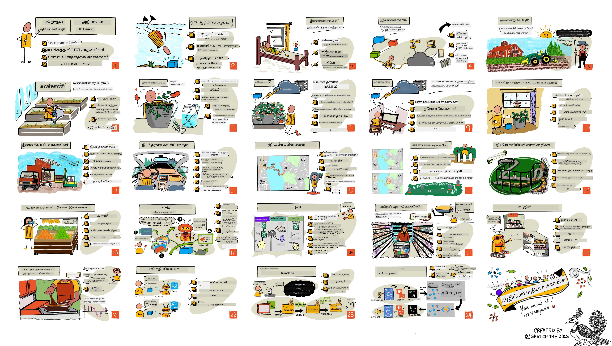

[](https://github.com/microsoft/IoT-For-Beginners/blob/master/LICENSE)
[](https://GitHub.com/microsoft/IoT-For-Beginners/graphs/contributors/)
[](https://GitHub.com/microsoft/IoT-For-Beginners/issues/)
[](https://GitHub.com/microsoft/IoT-For-Beginners/pulls/)
[](http://makeapullrequest.com)

[](https://GitHub.com/microsoft/IoT-For-Beginners/watchers/)
[](https://GitHub.com/microsoft/IoT-For-Beginners/network/)
[](https://GitHub.com/microsoft/IoT-For-Beginners/stargazers/)

### Azure AI Foundry சமூகத்தில் சேருங்கள்

AI செயலிகளை உருவாக்குவதில் நீங்கள் தடைபட்டால் அல்லது ஏதேனும் கேள்விகள் இருந்தால், MCP பற்றிய விவாதங்களில் இன்னும் பயில்கின்றவர்களும் மற்றும் அனுபவமுள்ள டெவலப்பர்களும் இணைந்திடுங்கள். கேள்விகள் வரவேற்கப்படுகின்றன, மற்றும் அறிவு சுதந்திரமாக பகிரப்படுகிற சிறந்த சமூகமாகும்.

[](https://discord.gg/nTYy5BXMWG)

உங்கள் தயாரிப்பு கருத்துக்கள் அல்லது கட்டுமானத்தில் தவறுகள் ஏற்பட்டால் பின்வரும் இடத்திற்கு செல்லவும்:

[](https://aka.ms/foundry/forum)

இந்த வளங்களை பயன்முறை செய்க என பின்வரும் படிகளை பின்பற்றவும்:
1. **ரவாலனை கிளோன் செய்யவும்**: கிளிக் செய்யவும் [](https://GitHub.com/microsoft/IoT-For-Beginners/fork)
2. **ரவாலனை கிளோன் செய்யவும்**:   `git clone https://github.com/microsoft/IoT-For-Beginners.git`
3. [**Microsoft Foundry Discord இல் சேர்ந்து நிபுணர்களையும் மற்ற டெவலப்பர்களையும் சந்தியுங்கள்**](https://discord.com/invite/ByRwuEEgH4)


### 🌐 பன்மொழி ஆதரவு

#### GitHub Action மூலம் ஆதரவு (தானியங்கி மற்றும் எப்போதும் புதுப்பிக்கப்பட்டது)

<!-- CO-OP TRANSLATOR LANGUAGES TABLE START -->
[Arabic](../ar/README.md) | [Bengali](../bn/README.md) | [Bulgarian](../bg/README.md) | [Burmese (Myanmar)](../my/README.md) | [Chinese (Simplified)](../zh-CN/README.md) | [Chinese (Traditional, Hong Kong)](../zh-HK/README.md) | [Chinese (Traditional, Macau)](../zh-MO/README.md) | [Chinese (Traditional, Taiwan)](../zh-TW/README.md) | [Croatian](../hr/README.md) | [Czech](../cs/README.md) | [Danish](../da/README.md) | [Dutch](../nl/README.md) | [Estonian](../et/README.md) | [Finnish](../fi/README.md) | [French](../fr/README.md) | [German](../de/README.md) | [Greek](../el/README.md) | [Hebrew](../he/README.md) | [Hindi](../hi/README.md) | [Hungarian](../hu/README.md) | [Indonesian](../id/README.md) | [Italian](../it/README.md) | [Japanese](../ja/README.md) | [Kannada](../kn/README.md) | [Khmer](../km/README.md) | [Korean](../ko/README.md) | [Lithuanian](../lt/README.md) | [Malay](../ms/README.md) | [Malayalam](../ml/README.md) | [Marathi](../mr/README.md) | [Nepali](../ne/README.md) | [Nigerian Pidgin](../pcm/README.md) | [Norwegian](../no/README.md) | [Persian (Farsi)](../fa/README.md) | [Polish](../pl/README.md) | [Portuguese (Brazil)](../pt-BR/README.md) | [Portuguese (Portugal)](../pt-PT/README.md) | [Punjabi (Gurmukhi)](../pa/README.md) | [Romanian](../ro/README.md) | [Russian](../ru/README.md) | [Serbian (Cyrillic)](../sr/README.md) | [Slovak](../sk/README.md) | [Slovenian](../sl/README.md) | [Spanish](../es/README.md) | [Swahili](../sw/README.md) | [Swedish](../sv/README.md) | [Tagalog (Filipino)](../tl/README.md) | [Tamil](./README.md) | [Telugu](../te/README.md) | [Thai](../th/README.md) | [Turkish](../tr/README.md) | [Ukrainian](../uk/README.md) | [Urdu](../ur/README.md) | [Vietnamese](../vi/README.md)

> **உள்ளூரில் கிளோன் செய்ய விரும்புகிறீர்களா?**
>
> இந்த களஞ்சியம் 50+ மொழி மொழிபெயர்ப்புகளை கொண்டுள்ளது, இது பதிவிறக்க அளவை அதிகரிக்கிறது. மொழிபெயர்ப்புகளின்றி கிளோன் செய்ய sparse checkout ஐப் பயன்படுத்தவும்:
>
> **Bash / macOS / Linux:**
> ```bash
> git clone --filter=blob:none --sparse https://github.com/microsoft/IoT-For-Beginners.git
> cd IoT-For-Beginners
> git sparse-checkout set --no-cone '/*' '!translations' '!translated_images'
> ```
>
> **CMD (Windows):**
> ```cmd
> git clone --filter=blob:none --sparse https://github.com/microsoft/IoT-For-Beginners.git
> cd IoT-For-Beginners
> git sparse-checkout set --no-cone "/*" "!translations" "!translated_images"
> ```
>
> இதனால் தரவிறக்க வேகம் அதிகரித்து, கோர்ஸை முடிக்க தேவையான அனைத்தையும் பெறலாம்.
<!-- CO-OP TRANSLATOR LANGUAGES TABLE END -->

# ஆரம்பิกருக்கான IoT - ஒரு பாடத்திட்டம்

Microsoft இல் Azure Cloud வழிகாட்டிகள் 12 வாரம், 24 பாடங்கள் கொண்ட IoT அடிப்படைகள் பற்றிய பாடத்திட்டத்தை வழங்க மகிழ்ச்சியடைகின்றனர். ஒவ்வொரு பாடமும் முன் மற்றும் பின் பாடத் தேர்வுகள், கையேடு, தீர்வு, பணிமுறை மற்றும் அதிகம் உட்படுகிறது. நமது திட்ட அடிப்படையிலான கற்றல் முறையின் மூலம் நீங்கள் உருவாக்கின போது கற்றுக்கொள்ள முடியும், இது புதிய திறன்கள் 'உட்கார' உதவும் என்பது நிரூபிக்கப்பட்டது.

இந்த திட்டங்கள் உணவு பயிர் முதல் மேஜை வரை பயணத்தை கையாள்கின்றன. இதில் விவசாயம், போக்குவரத்து, உற்பத்தி, விற்பனை மற்றும் நுகர்வோர் ஆகியவை உள்ளன - அனைத்தும் IoT சாதனங்களுக்கான பிரபலமான தொழில்துறை பகுதிகள்.



> [Nitya Narasimhan](https://github.com/nitya) அவர்களின் ஸ்கெட்ச் நோட். படத்தை பெரிய அளவில் பார்க்க கிளிக் செய்யவும்.

**நமது எழுத்தாளர்களான [Jen Fox](https://github.com/jenfoxbot), [Jen Looper](https://github.com/jlooper), [Jim Bennett](https://github.com/jimbobbennett) மற்றும் ஸ்கெட்ச் நோட் கலைஞர் [Nitya Narasimhan](https://github.com/nitya) அவர்களுக்கு மனமுவங்கி நன்றி.**

**மேலும் இக்கற்றல் திட்டத்தை மதிப்பாய்வு செய்து மொழிபெயர்த்த [Microsoft Learn மாணவர் தூதர்கள்](https://studentambassadors.microsoft.com?WT.mc_id=academic-17441-jabenn) [Aditya Garg](https://github.com/AdityaGarg00), [Anurag Sharma](https://github.com/Anurag-0-1-A), [Arpita Das](https://github.com/Arpiiitaaa), [Aryan Jain](https://www.linkedin.com/in/aryan-jain-47a4a1145/), [Bhavesh Suneja](https://github.com/EliteWarrior315), [Faith Hunja](https://faithhunja.github.io/), [Lateefah Bello](https://www.linkedin.com/in/lateefah-bello/), [Manvi Jha](https://github.com/Severus-Matthew), [Mireille Tan](https://www.linkedin.com/in/mireille-tan-a4834819a/), [Mohammad Iftekher (Iftu) Ebne Jalal](https://github.com/Iftu119), [Mohammad Zulfikar](https://github.com/mohzulfikar), [Priyanshu Srivastav](https://www.linkedin.com/in/priyanshu-srivastav-b067241ba), [Thanmai Gowducheruvu](https://github.com/innovation-platform), மற்றும் [Zina Kamel](https://www.linkedin.com/in/zina-kamel/) அவர்களுக்கு நன்றி.**

அணி ஐ சந்தியுங்கள்!

[](https://youtu.be/-wippUJRi5k)

**Gif உருவாக்கியவர்** [Mohit Jaisal](https://linkedin.com/in/mohitjaisal)

> 🎥 மேலுள்ள படத்தை கிளிக் செய்து திட்டத்துக்கான வீடியோவைப் பார்க்கவும்!

> **ஆசிரியர்களுக்கு**, இந்த பாடத்திட்டத்தை எவ்வாறு பயன்படுத்தலாம் என்பதற்கான [செய்திகுறிப்புகளை](for-teachers.md) நாங்கள் சேர்த்துள்ளோம். உங்களுக்கான சொந்த பாடங்களை உருவாக்க இந்த [பாட மாதிரியை](lesson-template/README.md) பயன்படுத்தலாம்.

> **மாணவர்களுக்கு** [https://aka.ms/student-page](https://aka.ms/student-page), இந்த பாடத்திட்டத்தை தனிப்பட்ட முறையில் பயன்படுத்த, முழு களஞ்சியத்தை கிளோன் செய்து முன்னிலை தேர்வுடன் துவக்கம் செய்து பிறகு பேச்சுப்பாடத்தை வாசித்து மீதிய பணிகளை முடிக்கவும். தீர்வு கோடுகளை நகலெடுக்காமல் பாடங்களை புரிந்து கொண்டு திட்டங்களை உருவாக்க முயற்சியுங்கள்; ஆனால் அந்தக் கோடுகள் /solutions கோப்புறைகளில் கிடைக்கின்றன. மேலும் யோசிக்க, நண்பர்களுடன் குழுவாகி உள்ளடக்கத்தை ஒன்றாக ஆய்வு செய்வது நல்லது. மேலதிக படிப்புக்கு, [Microsoft Learn](https://docs.microsoft.com/users/jimbobbennett/collections/ke2ehd351jopwr?WT.mc_id=academic-17441-jabenn) ஐ பரிந்துரைக்கிறோம்.

இந்த பாடத்திட்டத்தின் வீடியோ அறிமுகத்துக்கான வீடியோகை பார்வையிட கீழே க்ளிக் செய்யவும்:

[](https://youtube.com/watch?v=bccEMm8gRuc "Promo video")

> 🎥 மேலுள்ள படத்தை கிளிக் செய்து திட்டத்துக்கான வீடியோவைப் பார்க்கவும்!

## கற்றல் முறை

இந்த பாடத்திட்டத்தை உருவாக்கும் போது நாம் இரண்டு கற்றல் கொள்கைகளைத் தேர்ந்தெடுத்துள்ளோம்: திட்ட அடிப்படையிலானது மற்றும் அடிக்கடி நடைபெறும் தேர்வுகள் அடங்கியது. இந்த தொடரின் முடிவில், மாணவர்கள் செடியின் கண்காணிப்பு மற்றும் நீர்ப்பாசனம், வாகன கண்காணிப்பு, உணவை கண்காணிக்கும் புத்திசாலி தொழிற்சாலை அமைப்பு மற்றும் குரல் கட்டுப்பாட்டில் இயங்கும் சமையல் நேரக் கணக்குப்படுத்தியை உருவாக்கப்படும், மேலும் Internet of Things நற்குணங்களை தெரிந்து, சாதனக் குறியீடு எழுத, மேகத்துடன் இணைப்பு, தொலைநிலை தரவுகளை பகுப்பாய்வு மற்றும் எட்வை AI இயக்கு கற்றுக்கொள்வார்கள்.

பாட உள்ளடக்கம் திட்டங்களுக்கு இணங்க இருப்பதால் மாணவர்களுக்கு கற்றல் விருப்பமும், கருத்துகளை நினைவில் வைக்கும் திறனும் மேம்படும்.

மேலும், வகுப்புக்கு முன்னதாக குறைந்த மதிப்பெண் தேர்வு மாணவரின் கற்றல் நோக்கத்தை ஏற்படுத்தும், வகுப்பிற்குப் பிறகு இரண்டாவது தேர்வு கூடுதல் நினைவாற்றலை உறுதி செய்யும். இந்த பாடத்திட்டம் நெகிழ்வுள்ள மற்றும் வினோதமானது, முழுமையாகவோ, ஒரு பகுதியை மட்டும் எடுத்துக் கொண்டாலும் பயிற்றுவிக்கலாம். 12 வார காலத்துக்குள் திட்டங்கள் சிறியதாக துவங்கி, சிக்கலானதாக மாறும்.

ஒவ்வொரு திட்டமும் மாணவர்களுக்கும் ஆர்வலர்களுக்கும் கிடைக்கும் உண்மையான கருவிகளின் சுற்றிலும் உள்ளது. ஒவ்வொரு திட்டமும் குறிப்பிட்டத் துறையை ஆராய்ந்து, பொருத்தமான பின்னணி அறிவைப் வழங்குகிறது. துறையைப் புரிந்துகொள்ளும் திறன் ஒரு வெற்றிகரமான டெவலப்பராக இருக்க உதவும்; இது மாணவர்களுக்கு IoT தீர்வுகளை மற்றும் கற்றல்களை உண்மையான உலக பிரச்சனைகளுடன் தொடர்புபடுத்தி யோசிக்க உதவும். மாணவர்கள் அவர்கள் உருவாக்கும் தீர்வுகளின் காரணத்தைப் புரிந்து கொண்டு இறுதி பயனாளரிடம் பாராட்டை பெறுவார்கள்.

## ஹார்ட்வேர்
நாம் விருப்பப்படி, நிரல் மொழி அறிவு அல்லது விருப்பங்கள், கற்றல் இலக்குகள் மற்றும் கிடைக்கும் வசதிகளின்படி, திட்டங்களுக்கு பயன்படுத்த இரண்டு வகை IoT ஹார்ட்வேர்களை கொண்டிருக்கிறோம். ஹார்ட்வேருக்கு அணுகல் இல்லாதோர் அல்லது வாங்க முன் மேலும் கற்றுக்கொள்ள விரும்புவோருக்காக 'மெய்நிகர் ஹார்ட்வேர்ல்' பதிப்பையும் வழங்கியுள்ளோம். முழு கிட்களை எங்களுடைய நண்பர்கள் Seeed Studio இலிருந்து வாங்க இணைப்புகளுடன் சேர்த்து, [hardware page](./hardware.md) இல் 'ஷாப்பிங் பட்டியல்' ஐ வாசிக்கலாம்.

> 💁 எங்கள் [Code of Conduct](CODE_OF_CONDUCT.md), [Contributing](CONTRIBUTING.md) மற்றும் [Translations](..) வழிகாட்டுதல்களை காண்க. உங்கள் கட்டுமானமான கருத்துக்களை எதிர்நோக்குகிறோம்!
>
> 🔧 சிக்கல்கள் உள்ளதா? பொதுவான பிரச்சனைகளுக்கான தீர்வுகளுக்கு எங்கள் [Troubleshooting Guide](TROUBLESHOOTING.md) ஐ பாருங்கள்.

## ஒவ்வொரு பாடமும் கீழ்க்கண்டவற்றை கொண்டுள்ளது:

- ஸ்கெட்ச்னோட்
- விருப்பமான கூடுதல் வீடியோ
- பாடமுக்கு முன் வWarm-up வினாத்தாள்
- எழுதப்பட்ட பாடம்
- திட்ட அடிப்படையிலான பாடங்களுக்கான படி படி வழிகாட்டிகள்
- அறிவு சரிபார்ப்பு
- ஒரு சவால்
- கூடுதல் வாசிப்பு
- பணி
- [பாடம் முடிந்தபின் வினாத்தாள்](https://ff-quizzes.netlify.app/en/)

> **வினாத்தாள்கள் குறித்த குறிப்பு**: அனைத்து வினாத்தாள்களும் quiz-app கோப்பகத்தில் உள்ளன, ஒவ்வொன்றிலும் மூன்று கேள்விகள் உள்ள 48 வினாத்தாள்கள். அவை பாடங்களிலிருந்து இணைக்கப்பட்டுள்ளன, ஆனால் வினா செயலியை உள்ளார்ந்தாக இயக்கவும் அல்லது Azure இல் பரப்பவும் முடியும்; `quiz-app` கோப்பகத்தில் உள்ள निर्देशनத்தை பின்பற்றவும். அவை படிப்படியாக உள்ளத்தை மாற்றப்படுகின்றன.

## பாடங்கள்

|       |              திட்டத்தின் பெயர்              |                       கற்பிக்கப்படும் கருத்துக்கள்                       | கற்றல் நோக்குகள்                                                                                                                                                 |                                                        இணைக்கப்பட்ட பாடம்                                                         |
| :---: | :------------------------------------: | :---------------------------------------------------------: | ------------------------------------------------------------------------------------------------------------------------------------------------------------------- | :--------------------------------------------------------------------------------------------------------------------------: |
|  01   | [தொடக்கம்](./1-getting-started/README.md) |                     IoT க்கான அறிமுகம்                     | IoT அடிப்படைக் கொள்கைகள் மற்றும் சென்சார்கள் மற்றும் மேக சேவைகள் போன்ற IoT தீர்வுகளின் அடிப்படை கட்டமைப்புகளை கற்றுக் கொண்டு உங்கள் முதல் IoT சாதனத்தை அமைக்கவும் |                      [IoT க்கான அறிமுகம்](./1-getting-started/lessons/1-introduction-to-iot/README.md)                      |
|  02   | [தொடக்கம்](./1-getting-started/README.md) |                   IoT இல் ஒரு ஆழ்ந்த முன்னோட்டம்                    | IoT அமைப்பின் கூறுகள், மைக்ரோகன்ட்ரோலர்கள் மற்றும் ஒற்றை போர்டு கணினிகள் பற்றிய மேலதிக அறிவு பெறவும்                                                            |                        [IoT இல் ஆழ்ந்த முன்னோட்டம்](./1-getting-started/lessons/2-deeper-dive/README.md)                         |
|  03   | [தொடக்கம்](./1-getting-started/README.md) | சென்சார்கள் மற்றும் அட்டுவர்களுடன் இயற்கையுடன் தொடர்பு கொள்ளுதல் | இயற்கையிலிருந்து தகவல் சேகரிக்க சென்சார்களைப் பயன்படுத்துவது மற்றும் evening light அமைக்கும் போது அட்டுவர்களை பயன்படுத்தி பின்னூட்டம் செலுத்துவது பற்றி கற்றுக்கொள்ளுங்கள்                                           | [சென்சார்கள் மற்றும் அட்டுவர்களுடன் இயற்கையுடன் தொடர்பு கொள்ளுதல்](./1-getting-started/lessons/3-sensors-and-actuators/README.md) |
|  04   | [தொடக்கம்](./1-getting-started/README.md) |             உங்கள் சாதனத்தை இணையத்துடன் இணைக்கவும்             | உங்கள் nightlight ஐ MQTT பிரோக்கரை உட்பட இணைத்து, IoT சாதனத்தை இணையத்துடன் இணைப்பதன் குறித்த அறிவை பெற்றுக்கொள்ளுங்கள்                               |               [உங்கள் சாதனத்தை இணையத்துடன் இணைக்கவும்](./1-getting-started/lessons/4-connect-internet/README.md)                |
|  05   |            [பண்ணை](./2-farm/README.md)            |                    செடி வளர்ச்சியை கணிக்கவும்                     | IoT சாதனம் மூலம் பதிவுசெய்யப்பட்ட வெப்பநிலை தரவைப் பயன்படுத்தி செடி வளர்ச்சியை எப்படி கணிக்குவது என்று கற்றுக் கொள்ளுங்கள்                                                                                  |                          [செடி வளர்ச்சியை கணிக்கவும்](./2-farm/lessons/1-predict-plant-growth/README.md)                           |
|  06   |            [பண்ணை](./2-farm/README.md)            |                    மணல் ஈரப்பதத்தை கண்டறியவும்                     | மணல் ஈரப்பதத்தை கண்டறிந்து மணல் ஈரப்பதச் சென்சாரை சீரமைக்க கற்றுக்கொள்ளுங்கள்                                                                                              |                          [மண் ஈரப்பதத்தை கண்டறியவும்](./2-farm/lessons/2-detect-soil-moisture/README.md)                           |
|  07   |            [பண்ணை](./2-farm/README.md)            |                  தானாக செடி தண்ணீர் ஊட்டுதல்                   | ரிலே மற்றும் MQTT பயன்படுத்தி தண்ணீர் ஊட்டுதலை தானாக்க பயன்படுத்துவது மற்றும் நேரமிடுவது பற்றி கற்றுக்கொள்ளுங்கள்                                                                                                      |                      [தானாக செடி தண்ணீர் ஊட்டுதல்](./2-farm/lessons/3-automated-plant-watering/README.md)                       |
|  08   |            [பண்ணை](./2-farm/README.md)            |               உங்கள் செடியை மேகத்திற்கு மையாக்கவும்               | மேகம் மற்றும் மேகத்தில் அமைந்துள்ள IoT சேவைகள் மற்றும் இந்த மேவுகளுக்கு பொதுவான MQTT பிரோக்கரை விட உங்கள் செடியை இணைக்க எப்படிச் செய்வது என்று கற்றுக்கொள்ளுங்கள்                                   |               [உங்கள் செடியை மேகத்திற்கு மையாக்கவும்](./2-farm/lessons/4-migrate-your-plant-to-the-cloud/README.md)                |
|  09   |            [பண்ணை](./2-farm/README.md)            |         உங்கள் செயலி தார்க்கத்தை மேகத்துக்கு மையாக்கவும்         | IoT தகவல்களுக்கு பதிலளிக்கும் மேகத்திலும் செயலி தார்க்கம் எழுதுவது பற்றி கற்றுக்கொள்ளுங்கள்                                                                          |         [உங்கள் செயலி தார்க்கத்தை மேகத்துக்கு மையாக்கவும்](./2-farm/lessons/5-migrate-application-to-the-cloud/README.md)         |
|  10   |            [பண்ணை](./2-farm/README.md)            |                   உங்கள் செடியை பாதுகாப்பாக வைத்துக்கொள்ளவும்                    | IoT பாதுகாப்பு பற்றி மற்றும் முக்கியக்களும் சான்றிதழ்களும் மூலம் உங்கள் செடியை எப்படி பாதுகாக்கலாம் எனக் கற்றுக்கொள்ளுங்கள்                                                                          |                        [உங்கள் செடியை பாதுகாப்பாக வைத்துக்கொள்ளவும்](./2-farm/lessons/6-keep-your-plant-secure/README.md)                         |
|  11   |       [போக்குவரத்து](./3-transport/README.md)       |                      இடம் கண்காணித்தல்                      | IoT சாதனங்களுக்கான GPS இடம் கண்காணித்தல் பற்றி கற்றுக்கொள்ளுங்கள்                                                                                                                   |                           [இடம் கண்காணித்தல்](./3-transport/lessons/1-location-tracking/README.md)                           |
|  12   |       [போக்குவரத்து](./3-transport/README.md)       |                     இடம் தரவை சேமித்தல்                     | பிறகு பார்வையிட அல்லது பகுப்பாய்வு செய்ய IoT தரவை எப்படிச் சேமிப்பது என்று கற்றுக்கொள்ளுங்கள்                                                                                                      |                         [இடம் தரவை சேமித்தல்](./3-transport/lessons/2-store-location-data/README.md)                         |
|  13   |       [போக்குவரத்து](./3-transport/README.md)       |                   இடம் தரவை காண்பித்தல்                   | வரைபடத்தில் இடம் தரவை எப்படிக் காண்பிப்பது மற்றும் வரைபடங்கள் உண்மையான 3D உலகத்தை 2 பரிமாணங்களில் எப்படி பிரதிபலிப்பது என்பதைக் கற்றுக்கொள்ளுங்கள்                                                            |                     [இடம் தரவை காண்பித்தல்](./3-transport/lessons/3-visualize-location-data/README.md)                     |
|  14   |       [போக்குவரத்து](./3-transport/README.md)       |                          நிலைத்தூண்கள்                          | நிலைத்தூண்கள் பற்றி கற்றுக்கொள்ளுங்கள், மற்றும் சப்ளை சங்கிலியில் வாகனங்கள் தங்களது இலக்குக்கு அருகிலுள்ளபோது எச்சரிக்க எப்படிச் செய்யலாம் என்பதைக் கற்றுக்கொள்ளுங்கள்                                           |                                   [நிலைத்தூண்கள்](./3-transport/lessons/4-geofences/README.md)                                   |
|  15   |   [உற்பத்தி](./4-manufacturing/README.md)   |               பழ பழுத்தன்மை கண்டறியும் பயிற்சி                | மேகத்தில் உருவ படம் வகைப்படுத்தும் பயிற்சியைப் பற்றி கற்றுக்கொள்ளுங்கள், இது பழத்தின் தரத்தை கண்டறிகிறது                                                                                       |                 [பழ பழுத்தன்மை கண்டறியும் பயிற்சி](./4-manufacturing/lessons/1-train-fruit-detector/README.md)                 |
|  16   |   [உற்பத்தி](./4-manufacturing/README.md)   |           IoT சாதனத்திலிருந்து பழ தரத்தைச் சரிபார்க்கவும்            | IoT சாதனத்திலிருந்து உங்கள் பழ தர கண்டறியும் கருவியைப் பயன்படுத்துவதைக் கற்றுக்கொள்ளுங்கள்                                                                                                    |           [IoT சாதனத்திலிருந்து பழ தரத்தைச் சரிபார்க்கவும்](./4-manufacturing/lessons/2-check-fruit-from-device/README.md)            |
|  17   |   [உற்பத்தி](./4-manufacturing/README.md)   |             உங்கள் பழக் கண்டறியும் கருவியை ஓரமாக இயக்கவும்             | ஒரு IoT சாதனத்தில் உங்கள் பழக் கண்டறியும் கருவியை ஓர பக்கத்தில் இயக்குவது பற்றி கற்றுக்கொள்ளுங்கள்                                                                                                |             [உங்கள் பழக் கண்டறியும் கருவியை ஓரமாக இயக்கவும்](./4-manufacturing/lessons/3-run-fruit-detector-edge/README.md)             |
|  18   |   [உற்பத்தி](./4-manufacturing/README.md)   |        சென்சார் மூலம் பழ தரக் கண்டறிதலைத் தூண்டுங்கள்        | சென்சாரிலிருந்து பழ தரக் கண்டறிதலைத் தூண்டுவது பற்றி கற்றுக்கொள்ளுங்கள்                                                                                                        |        [சென்சார் மூலம் பழ தரக் கண்டறிதலைத் தூண்டுங்கள்](./4-manufacturing/lessons/4-trigger-fruit-detector/README.md)         |
|  19   |          [சில்லறை வணிகம்](./5-retail/README.md)          |                   பங்கு கண்டறியும் பயிற்சி                    | கடையில் பங்குகளை எண்ணுவதற்கு பொருள் கண்டறிதலைப் பயன்படுத்திக் கொண்டு பங்கு கண்டறுக்கும் பயிற்சியை கற்றுக்கொள்ளுங்கள்                                                                                |                        [பங்கு கண்டறியும் பயிற்சி](./5-retail/lessons/1-train-stock-detector/README.md)                         |
|  20   |          [சில்லறை வணிகம்](./5-retail/README.md)          |               IoT சாதனத்திலிருந்து பங்குகளை சரிபார்க்கவும்                | பொருள் கண்டறிதல் மாதிரியைப் பயன்படுத்தி IoT சாதனத்திலிருந்து பங்குகளை எப்படிச் சரிபார்க்கலாம் என்பதை கற்றுக்கொள்ளுங்கள்                                                                                         |                     [IoT சாதனத்திலிருந்து பங்குகளை சரிபார்க்கவும்](./5-retail/lessons/2-check-stock-device/README.md)                      |
|  21   |        [பாவனையாளர்](./6-consumer/README.md)        |             IoT சாதனத்துடன் உரையாடலை அடையாளம் காண்க             | IoT சாதனத்திலிருந்து உரையாடலை அடையாளம் காண அறிந்து, ஒரு புத்திசாலி டைமர் உருவாக்குங்கள்                                                                                             |                  [IoT சாதனத்துடன் உரையாடலை அடையாளம் காண்க](./6-consumer/lessons/1-speech-recognition/README.md)                  |
|  22   |        [பாவனையாளர்](./6-consumer/README.md)        |                     மொழியைப் புரிந்து கொள்                     | IoT சாதனத்திற்கு பேசப்பட்ட வாக்கியங்களைப் புரிந்து கொள்ள கற்றுக்கொள்ளுங்கள்                                                                                                           |                        [மொழியைப் புரிந்து கொள்](./6-consumer/lessons/2-language-understanding/README.md)                        |
|  23   |        [பாவனையாளர்](./6-consumer/README.md)        |           டைமரை அமைத்து வாய்மொழி மூலம் பின்னூட்டம் அளி           | IoT சாதனத்தில் டைமரை அமைத்து, டைமர் அமைக்கப்பட்டதும் மற்றும் முடிந்ததும் வாய்மொழி மூலம் பின்னூட்டத்தை வழங்க கற்றுக்கொள்ளுங்கள்                                                    |                 [டைமரை அமைத்து வாய்மொழி மூலம் பின்னூட்டம் அளி](./6-consumer/lessons/3-spoken-feedback/README.md)                  |
|  24   |        [பாவனையாளர்](./6-consumer/README.md)        |                 பல மொழிகளை ஆதரிக்கவும்                  | பல மொழிகளை ஆதரிப்பது எப்படி என்பதை கற்றுக்கொள்ளுங்கள், பேசப்பட்ட மொழிகளும், உங்கள் புத்திசாலி டைமரின் பதில்களும் அடங்கும்                                                               |                   [பல மொழிகளை ஆதரிக்கவும்](./6-consumer/lessons/4-multiple-language-support/README.md)                   |

## ஆஃப்லைன் அணுகல்

[Docsify](https://docsify.js.org/#/) ஐ பயன்படுத்தி இந்த ஆவணத்தை ஆஃப்லைனிலும் இயக்க முடியும். இந்த ரெப்போவை ஃபோর্ক் செய்து, உங்கள் உள்ளூரில் [Docsify ஐ நிறுவி](https://docsify.js.org/#/quickstart) இந்த ரெப்போவின் ரூட் கோப்பகத்தில் `docsify serve` என தட்டச்சு செய்யவும். இந்த இணையதளம் உங்கள் localhost இல் போர்ட் 3000 இல் சேவை செய்யப்படும்: `localhost:3000`.

## வினாடி விடை

ஒவ்வொரு அத்தியாயத்திலும் உங்கள் அறிவை சோதிக்கும் இடைத்தேர்வு வினாத்தாளுக்கு சமூகத்துக்கு நன்றி. உங்கள் அறிவை [இங்கே](https://ff-quizzes.netlify.app/en/) சோதிக்கலாம்.

### PDF

பொருந்தியிருக்காவிட்டால் ஆஃப்லைன் அணுகலைக் கொண்டு இந்த உள்ளடக்கத்தின் PDF உருவாக்கலாம். இதற்கு, [npm நிறுவியிருப்பதை](https://docs.npmjs.com/downloading-and-installing-node-js-and-npm) உறுதி செய்து, இந்த ரெப்போவின் ரூட் கோப்பகத்தில் கீழ்க்கண்ட கட்டளைகளை நடைமுறைபடுத்தவும்:

```sh
npm i
npm run convert
```

### சுருக்கங்கள்

சில பாடங்களுக்கு [slides](../../slides) கோப்பகத்தில் ஸ்லைடு டெக்ஸ் உள்ளன.

## பிற பாடத்திட்டங்கள்

எங்கள் குழு மற்ற பாடத்திட்டங்களையும் உருவாக்குகிறது! இதைப் பாருங்கள்:

<!-- CO-OP TRANSLATOR OTHER COURSES START -->
### LangChain
[](https://aka.ms/langchain4j-for-beginners)
[](https://aka.ms/langchainjs-for-beginners?WT.mc_id=m365-94501-dwahlin)
[](https://github.com/microsoft/langchain-for-beginners?WT.mc_id=m365-94501-dwahlin)
---

### Azure / Edge / MCP / Agents
[](https://github.com/microsoft/AZD-for-beginners?WT.mc_id=academic-105485-koreyst)
[](https://github.com/microsoft/edgeai-for-beginners?WT.mc_id=academic-105485-koreyst)
[](https://github.com/microsoft/mcp-for-beginners?WT.mc_id=academic-105485-koreyst)
[](https://github.com/microsoft/ai-agents-for-beginners?WT.mc_id=academic-105485-koreyst)

---
 
### உருவாக்கும் AI தொடர்
[](https://github.com/microsoft/generative-ai-for-beginners?WT.mc_id=academic-105485-koreyst)
[-9333EA?style=for-the-badge&labelColor=E5E7EB&color=9333EA)](https://github.com/microsoft/Generative-AI-for-beginners-dotnet?WT.mc_id=academic-105485-koreyst)
[-C084FC?style=for-the-badge&labelColor=E5E7EB&color=C084FC)](https://github.com/microsoft/generative-ai-for-beginners-java?WT.mc_id=academic-105485-koreyst)
[-E879F9?style=for-the-badge&labelColor=E5E7EB&color=E879F9)](https://github.com/microsoft/generative-ai-with-javascript?WT.mc_id=academic-105485-koreyst)

---
 
### முக்கியக் கற்றல்
[](https://aka.ms/ml-beginners?WT.mc_id=academic-105485-koreyst)
[](https://aka.ms/datascience-beginners?WT.mc_id=academic-105485-koreyst)
[](https://aka.ms/ai-beginners?WT.mc_id=academic-105485-koreyst)
[](https://github.com/microsoft/Security-101?WT.mc_id=academic-96948-sayoung)
[](https://aka.ms/webdev-beginners?WT.mc_id=academic-105485-koreyst)
[](https://aka.ms/iot-beginners?WT.mc_id=academic-105485-koreyst)
[](https://github.com/microsoft/xr-development-for-beginners?WT.mc_id=academic-105485-koreyst)

---
 
### தொகுப்பாளர் தொடர்
[](https://aka.ms/GitHubCopilotAI?WT.mc_id=academic-105485-koreyst)
[](https://github.com/microsoft/mastering-github-copilot-for-dotnet-csharp-developers?WT.mc_id=academic-105485-koreyst)
[](https://github.com/microsoft/CopilotAdventures?WT.mc_id=academic-105485-koreyst)
<!-- CO-OP TRANSLATOR OTHER COURSES END -->

## படப் பட்டியல்கள்

உங்களுக்கு தேவையான படங்களைப் பயன்படுத்தியதற்கான அனைத்து உரிமைகளையும் இக்கலைத்திட்டத்தில் உள்ள [பட்டியல்கள்](./attributions.md) பகுதியில் காணலாம்.

---

<!-- CO-OP TRANSLATOR DISCLAIMER START -->
**தவறுதிருத்தம்**:  
இந்த கோப்பு [Co-op Translator](https://github.com/Azure/co-op-translator) என்ற AI மொழிபெயர்ப்பு சேவையை பயன்படுத்தி மொழிபெயர்க்கப்பட்டுள்ளது. நாங்கள் துல்லியத்திற்காக முயல்கிறோம் என்றாலும், தானியங்கி மொழிபெயர்ப்புகளில் பிழைகள் அல்லது தவறுகள் இருக்க வாய்ப்பு உள்ளது என்பதை தயவுசெய்து கவனியுங்கள். அசல் ஆவணம் அதன் சொந்த மொழியில் அதிகாரப்பூர்வ மூலமாக கருதப்பட வேண்டும். முக்கியமான தகவல்களுக்காக, தொழில்நுட்ப மனித மொழிபெயர்ப்புகள் பரிந்துரைக்கப்படுகிறது. இந்த மொழிபெயர்ப்பின் பயன்படுத்தலால் ஏற்படும் ஏதேனும் தவறான புரிதல்கள் அல்லது தவறுரைகளுக்கு நாங்கள் பொறுப்பில்லை.
<!-- CO-OP TRANSLATOR DISCLAIMER END -->