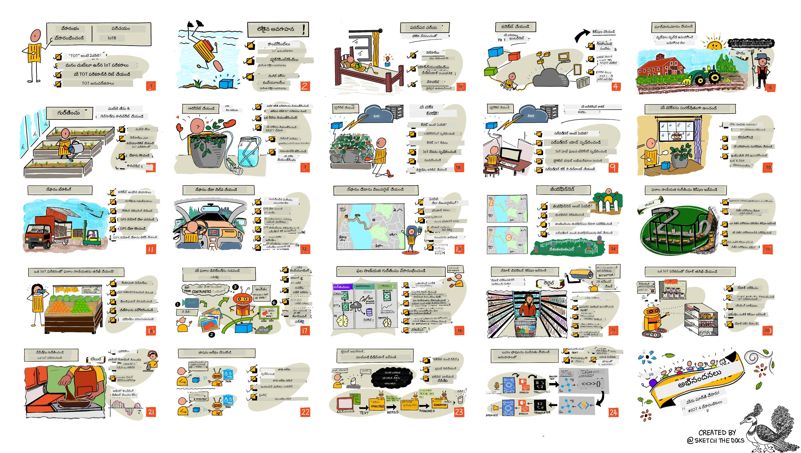

<!--
CO_OP_TRANSLATOR_METADATA:
{
  "original_hash": "6c354ec3487e4f6cfafbe44557996cd9",
  "translation_date": "2026-01-07T01:25:59+00:00",
  "source_file": "README.md",
  "language_code": "te"
}
-->
[](https://github.com/microsoft/IoT-For-Beginners/blob/master/LICENSE)
[](https://GitHub.com/microsoft/IoT-For-Beginners/graphs/contributors/)
[](https://GitHub.com/microsoft/IoT-For-Beginners/issues/)
[](https://GitHub.com/microsoft/IoT-For-Beginners/pulls/)
[](http://makeapullrequest.com)

[](https://GitHub.com/microsoft/IoT-For-Beginners/watchers/)
[](https://GitHub.com/microsoft/IoT-For-Beginners/network/)
[](https://GitHub.com/microsoft/IoT-For-Beginners/stargazers/)

### Azure AI Foundry కమ్యూనిటీతో చేరండి

మీరు అలమటపడి లేదా AI యాప్స్ నిర్మాణం గురించి ఏవైనా ప్రశ్నలు ఉన్నట్లయితే. MCP గురించి చర్చలలో సహచర విద్యార్థులు మరియు అనుభవజ్ఞులైన డెవలపర్స్ తో చేరండి. ఇది ప్రశ్నలు స్వాగతించే, జ్ఞానం ఉచితంగా పంచే మద్దతు ఉన్న కమ్యూనిటీ.

[](https://discord.gg/nTYy5BXMWG)

మీకు ఉత్పత్తి అభిప్రాయం లేదా నిర్మాణంలో లోపాలు ఉన్నట్లయితే సందర్శించండి:

[](https://aka.ms/foundry/forum)

ఈ వనరులను ఉపయోగించడం ప్రారంభించడానికి ఈ దశలను అనుసరించండి:
1. **రిపోజిటరీని Fork చేయండి**: క్లిక్ చేయండి [](https://GitHub.com/microsoft/IoT-For-Beginners/fork)
2. **రిపోజిటరీని Clone చేయండి**:   `git clone https://github.com/microsoft/IoT-For-Beginners.git`
3. [**Microsoft Foundry Discordలో చేరండి మరియు నిపుణులు మరియు సహచర డెవలపర్స్ ను కలవండి**](https://discord.com/invite/ByRwuEEgH4)


### 🌐 బహుభాషా మద్దతు

#### GitHub Action ద్వారా మద్దతు పొందినది (ఆటోమేటెడ్ & ఎప్పుడూ అప్డేట్ ఉంటుంది)

<!-- CO-OP TRANSLATOR LANGUAGES TABLE START -->
[Arabic](../ar/README.md) | [Bengali](../bn/README.md) | [Bulgarian](../bg/README.md) | [Burmese (Myanmar)](../my/README.md) | [Chinese (Simplified)](../zh/README.md) | [Chinese (Traditional, Hong Kong)](../hk/README.md) | [Chinese (Traditional, Macau)](../mo/README.md) | [Chinese (Traditional, Taiwan)](../tw/README.md) | [Croatian](../hr/README.md) | [Czech](../cs/README.md) | [Danish](../da/README.md) | [Dutch](../nl/README.md) | [Estonian](../et/README.md) | [Finnish](../fi/README.md) | [French](../fr/README.md) | [German](../de/README.md) | [Greek](../el/README.md) | [Hebrew](../he/README.md) | [Hindi](../hi/README.md) | [Hungarian](../hu/README.md) | [Indonesian](../id/README.md) | [Italian](../it/README.md) | [Japanese](../ja/README.md) | [Kannada](../kn/README.md) | [Korean](../ko/README.md) | [Lithuanian](../lt/README.md) | [Malay](../ms/README.md) | [Malayalam](../ml/README.md) | [Marathi](../mr/README.md) | [Nepali](../ne/README.md) | [Nigerian Pidgin](../pcm/README.md) | [Norwegian](../no/README.md) | [Persian (Farsi)](../fa/README.md) | [Polish](../pl/README.md) | [Portuguese (Brazil)](../br/README.md) | [Portuguese (Portugal)](../pt/README.md) | [Punjabi (Gurmukhi)](../pa/README.md) | [Romanian](../ro/README.md) | [Russian](../ru/README.md) | [Serbian (Cyrillic)](../sr/README.md) | [Slovak](../sk/README.md) | [Slovenian](../sl/README.md) | [Spanish](../es/README.md) | [Swahili](../sw/README.md) | [Swedish](../sv/README.md) | [Tagalog (Filipino)](../tl/README.md) | [Tamil](../ta/README.md) | [Telugu](./README.md) | [Thai](../th/README.md) | [Turkish](../tr/README.md) | [Ukrainian](../uk/README.md) | [Urdu](../ur/README.md) | [Vietnamese](../vi/README.md)

> **స్థానికంగా Clone చేయటం ఇష్టమా?**

> ఈ రిపోజిటరీ 50+ భాషా అనువాదాలను కలిగి ఉంది, ఇది డౌన్‌లోడ్ పరిమాణాన్ని గణనీయంగా పెంచుతుంది. అనువాదాలు లేకుండా క్లోన్ చేయడానికి, sparse checkout ఉపయోగించండి:
> ```bash
> git clone --filter=blob:none --sparse https://github.com/microsoft/IoT-For-Beginners.git
> cd IoT-For-Beginners
> git sparse-checkout set --no-cone '/*' '!translations' '!translated_images'
> ```
> ఇది మీరు కోర్సును పూర్తి చేయడానికి అవసరమైన ప్రతిదాన్ని చాలా వేగంగా డౌన్‌లోడ్ చేయడానికి ఇస్తుంది.
<!-- CO-OP TRANSLATOR LANGUAGES TABLE END -->

# ప్రారంభకుల కోసం IoT - ఒక పాఠ్యాంశం

మైక్రోసాఫ్ట్ లో ఆజూర్ క్లౌడ్ అడ్వొకేట్స్ IoT మూలాలు గురించి 12 వారాల, 24 పాఠాల పాఠ్యాంశాన్ని అందించేందుకు సంతోషిస్తున్నారు. ప్రతి పాఠంలో ముందుమాట మరియు తరువాతా ప్రశ్నలు, పాఠాన్ని పూర్తి చేయడానికి రాసిన సూచనలు, ఒక పరిష్కారం, ఒక అస్సైన్మెంట్ మరియు మరిన్ని ఉన్నాయి. మా ప్రాజెక్ట్-ఆధారిత పద్ధతి మీరు నిర్మిస్తూ నేర్చుకునేందుకు అనుమతిస్తుంది, ఇది కొత్త నైపుణ్యాలు 'స్థిరపడటానికి' సెట్ అయిన మార్గం.

ఈ ప్రాజెక్టులు ఆహారం ఫారం నుండి టేబుల్ వరకు ప్రయాణాన్ని కవర్ చేస్తాయి. ఇందులో వ్యవసాయం, రవాణా, తయారీ, రీటెయిల్ మరియు వినియోగదారు - ఇవి IoT పరికరాల కోసం ప్రముఖ పరిశ్రమ ప్రాంతాలు.



> స్కెచ్ నోటు [Nitya Narasimhan](https://github.com/nitya) చేత. పెద్ద వెర్షన్ కోసం చిత్రాన్ని క్లిక్ చేయండి.

**మా రచయితలు [Jen Fox](https://github.com/jenfoxbot), [Jen Looper](https://github.com/jlooper), [Jim Bennett](https://github.com/jimbobbennett) మరియు మా స్కెచ్ నోట్ ఆర్టిస్ట్ [Nitya Narasimhan](https://github.com/nitya) కు హృదయపూర్వక కృతజ్ఞతలు.**

**మరియు ఈ పాఠ్యాంశాన్ని సమీక్షించి, అనువదించిన మా [Microsoft Learn విద్యార్థి అంబాసిడర్స్](https://studentambassadors.microsoft.com?WT.mc_id=academic-17441-jabenn) బృందానికి కూడా ధన్యవాదాలు - [Aditya Garg](https://github.com/AdityaGarg00), [Anurag Sharma](https://github.com/Anurag-0-1-A), [Arpita Das](https://github.com/Arpiiitaaa), [Aryan Jain](https://www.linkedin.com/in/aryan-jain-47a4a1145/), [Bhavesh Suneja](https://github.com/EliteWarrior315), [Faith Hunja](https://faithhunja.github.io/), [Lateefah Bello](https://www.linkedin.com/in/lateefah-bello/), [Manvi Jha](https://github.com/Severus-Matthew), [Mireille Tan](https://www.linkedin.com/in/mireille-tan-a4834819a/), [Mohammad Iftekher (Iftu) Ebne Jalal](https://github.com/Iftu119), [Mohammad Zulfikar](https://github.com/mohzulfikar), [Priyanshu Srivastav](https://www.linkedin.com/in/priyanshu-srivastav-b067241ba), [Thanmai Gowducheruvu](https://github.com/innovation-platform), మరియు [Zina Kamel](https://www.linkedin.com/in/zina-kamel/).**

బృందాన్ని కలవండి!

[](https://youtu.be/-wippUJRi5k)

**జీఫ్ [Mohit Jaisal](https://linkedin.com/in/mohitjaisal) ద్వారా**

> 🎥 ప్రాజెక్ట్ గురించి వీడియో కొరకు పై చిత్రం క్లిక్ చేయండి!

> **ఉపాధ్యాయుల**, ఈ పాఠ్యాంశాన్ని ఎలా ఉపయోగించాలో కొన్ని సూచనలు మేము [సమగ్రంగా](for-teachers.md) ఇచ్చాము. మీరు మీ స్వంత పాఠాలు సృష్టించాలనుకుంటే, మేము [పాఠ్యాంశ టెంప్లేట్](lesson-template/README.md) కూడా ఉంచాము.

> **[విద్యార్థులు](https://aka.ms/student-page)**, ఈ పాఠ్యాంశాన్ని మీ స్వంతంగా ఉపయోగించడానికి, మొత్తం రిపోను fork చేసి వ్యాయామాలను స్వయంగా పూర్తి చేయండి, ముందుమాట ప్రశ్నతో మొదలుపెట్టి, ఉపన్యాసం చదివి మిగతా కార్యకలాపాలు పూర్తి చేయండి. పరిష్కార కోడ్ లను కాపీ చేయకుండా పాఠాలు అర్థం చేసుకుని ప్రాజెక్టులను సృష్టించడానికి ప్రయత్నించండి; ఆ కోడ్లు ప్రతి ప్రాజెక్టు దిశానిర్దేశ పాఠంలో /solutions ఫోల్డర్లలో అందుబాటులో ఉన్నాయి. మరొక ఆలోచన మిత్రులతో అధ్యయన సమూహం ఏర్పాటు చేసి కలసి తీసుకోవడం. ఇంకా అధ్యయనం కొరకు మేము [Microsoft Learn](https://docs.microsoft.com/users/jimbobbennett/collections/ke2ehd351jopwr?WT.mc_id=academic-17441-jabenn) ను సిఫార్సు చేస్తున్నాము.

ఈ కోర్సు యొక్క వీడియో అవలోకనం కోసం ఈ వీడియోను చూడండి:

[](https://youtube.com/watch?v=bccEMm8gRuc "Promo video")

> 🎥 ప్రాజెక్ట్ గురించి వీడియో కొరకు పై చిత్రం క్లిక్ చేయండి!

## పాఠ్య విధానం

ఈ పాఠ్యాంశం రూపొందించడంలో మేము రెండు పాఠ్య నియమాలను ఎంచుకున్నాము: ఇది ప్రాజెక్ట్-ఆధారితంగా ఉండడం మరియు తరచుగా ప్రశ్నలు ఉండటం. ఈ సిరీస్ ముగింపు వరకు, విద్యార్థులు ఒక మొక్కల పర్యవేక్షణ మరియు నీరు పరికరం, ఒక వాహనం ట్రాకర్, ఆహారాన్ని ట్రాక్ చేయడానికి మరియు తనిఖీ చేయడానికి స్మార్ట్ ఫ్యాక్టరీ వ్యవస్థ, ఓ గొంతు నియంత్రిత వంట సమయం గడియారం నిర్మించి ఉంటారు, మరియు ఇంటర్నెట్ ఆఫ్ థింగ్స్ ములాధారాల గురించి తెలుసుకుంటారు, అందులో పరికర కోడ్ రాయడం, క్లౌడ్ కు కనెక్ట్ కావడం, టెలిమేట్రీ విశ్లేషణ మరియు ఎడ్జ్ పై AI అమలు చేయడం ఉన్నాయి.

పాఠ్యాంశం ప్రాజెక్టులతో సరిపోల్చడం వల్ల, విద్యార్థులకు ప్రక్రియ మరింత ఆసక్తికరమై, భావనల నిలువ పెరుగుతుంది.

అలాగే, తరగతి ముందు తక్కువ-పhuman quiz విద్యార్థి ఉత్తేజాన్ని పెంపొందించగా, తరగతి తర్వాత రెండవ quiz మరింత నిలుపును నిర్ధారిస్తుంది. ఈ పాఠ్యాంశం సౌలభ్యమైనది మరియు వినోదాత్మకంగా రూపొందించబడింది మరియు మొత్తం లేదా భాగంగా తీసుకోవచ్చు. ప్రాజెక్టులు చిన్నదిగా ప్రారంభించి 12 వారాల చక్రం చివరికి క్లిష్టత పెరుగుతుంది.

ప్రతి ప్రాజెక్టు విద్యార్థులకు మరియు హాబీిస్టులకు అందుబాటులో ఉన్న వాస్తవ హార్డ్వేర్ చుట్టూ ఆధారపడి ఉంటుంది. ప్రతి ప్రాజెక్టు ఆ ప్రాజెక్ట్ డొమైన్ లోకి చూస్తుంది మన ప్రధాన నేపథ్య జ్ఞానం అందిస్తుంది. ఒక విజయవంతమైన డెవలపర్ కావాలంటే మీ సమస్యలు పరిష్కరించేది ఏ డొమైన్ లో ఉందో అర్థం చేసుకోవడం ఉపయోగకరం. ఈ నేపథ్య జ్ఞానం విద్యార్థులు తమ IoT పరిష్కారాలు మరియు నేర్చుకున్న విషయాలు వాస్తవ ప్రపంచ సమస్యల పరిధిలో ఆలోచించడానికి సహాయపడుతుంది. విద్యార్థులు తమ నిర్మిస్తున్న పరిష్కారాల 'ఎందుకు' తెలుసుకుంటారు, మరియు వినియోగదారు యొక్క అభిప్రాయాన్ని అర్థం చేసుకుంటారు.

## హార్డ్వేర్

వ్యక్తిగత ప్రాధాన్యం, ప్రోగ్రాంమింగ్ భాష జ్ఞానం లేదా ఇష్టాలు, నేర్చుకోవడంపై లక్ష్యాలు మరియు అందుబాటుని ఆధారంగా ప్రాజెక్టుల కోసం వాడనున్న రెండు IoT హార్డ్వేర్ ఎంపికలున్నాయి. హార్డ్వేర్ లభ్యం లేని వారికి లేదా కొనుగోలుకు ముందు ఎక్కువ తెలుసుకోవాలనుకునేవారికి 'వర్చువల్ హార్డ్వేర్' వెర్షన్ కూడా అందుబాటులో ఉంచాము. మీరు మరింత చదవవచ్చు మరియు మా స్నేహితులు Seeed Studio నుండి పూర్తి కిట్స్ కొనుగోలు చేయడానికి లింకులతో సహా 'షాపింగ్ లిస్ట్' [హార్డ్వేర్ పేజీలో](./hardware.md) పొందవచ్చు.
> 💁 మాకు మాకు మా [చట్టం నిబంధనలు](CODE_OF_CONDUCT.md), [కాన్ట్రిబ్యూటింగ్](CONTRIBUTING.md), మరియు [అనువాదం](TRANSLATIONS.md) మార్గదర్శకాలు చూడండి. మీ అవలోకనాత్మక అభిప్రాయాలను స్వాగతిస్తాము!
>
> 🔧 సమస్యలు ఉన్నారా? సాధారణ సమస్యలకు పరిష్కారాల కోసం మా [ట్రబుల్‌షూటింగ్ గైడ్](TROUBLESHOOTING.md)ని చూడండి.

## ప్రతి పాఠం లో:

- స్కెచ్ నోట్
- ఐచ్చిక సప్లిమెంటల్ వీడియో
- పూర్వ పాఠం వార్మప్ క్విజ్
- రాత పాఠం
- ప్రాజెక్ట్-ఆధారిత పాఠాల కోసం, ప్రాజెక్ట్‌ను నిర్మించే విధానంపై దశల వారీ గైడ్‌లు
- జ్ఞాన పరీక్షలు
- ఒక సవాలు
- సప్లిమెంటల్ చదవడం
- అసైన్మెంట్
- [పోస్ట్-పాఠం క్విజ్](https://ff-quizzes.netlify.app/en/)

> **క్విజ్‌ల గురించి ఒక గమనిక**: అన్ని క్విజ్‌లు quiz-app ఫోల్డర్‌లో ఉన్నాయి, మొత్తం 48 క్విజ్‌లు త్రిభాగ ప్రశ్నలతో. అవి పాఠాల నుండి లింక్ చేయబడ్డాయి కానీ క్విజ్ యాప్‌ను స్థానికంగా నడపవచ్చు లేదా Azure కి పంపవచ్చు; `quiz-app` ఫోల్డర్ లో ఉన్న సూచనలను అనుసరించండి. అవి క్రమంగా స్థానీకరించబడుతున్నాయి.

## పాఠాలు

|       |              ప్రాజెక్ట్ పేరు              |                       నేర్పబడిన భావనలు                       | అభ్యాస ఉద్దేశాలు                                                                                                                                                 |                                                        లింక్ చేసిన పాఠం                                                         |
| :---: | :------------------------------------: | :---------------------------------------------------------: | ------------------------------------------------------------------------------------------------------------------------------------------------------------------- | :--------------------------------------------------------------------------------------------------------------------------: |
|  01   | [ప్రారంభం](./1-getting-started/README.md) |                     IoT పరిచయం                     | మీ మొదటి IoT పరికరాన్ని సెటప్ చేస్తున్నప్పుడు IoT యొక్క ప్రాథమిక సూత్రాలు మరియు సెన్సార్లు, క్లౌడ్ సేవలు వంటి IoT పరిష్కారాల ప్రాథమిక నిర్మాణ ఖండాలు నేర్చుకోండి |                      [IoT పరిచయం](./1-getting-started/lessons/1-introduction-to-iot/README.md)                      |
|  02   | [ప్రారంభం](./1-getting-started/README.md) |                   IoT లో లోతైన అవగాహన                    | IoT వ్యవస్థ యొక్క భాగాలు, మైక్రోకంట్రోలర్లు మరియు సింగిల్-బోర్డు కంప్యూటర్ల గురించి ఎక్కువగా తెలుసుకోండి                                                            |                        [IoT లో లోతైన అవగాహన](./1-getting-started/lessons/2-deeper-dive/README.md)                         |
|  03   | [ప్రారంభం](./1-getting-started/README.md) | సెన్సార్లు మరియు యాక్చువేటర్లు తో భౌతిక ప్రపంచంతో చర్యలు | భౌతిక ప్రపంచం నుంచి డేటా సేకరించడానికి సెన్సార్ల గురించి మరియు స్పందన ఇవ్వడానికి యాక్చువేటర్ల గురించి నేర్చుకోండి, మీరు ఒక నైట్ లైట్ తయారు చేస్తూ                                           | [సెన్సార్లు మరియు యాక్చువేటర్లు తో భౌతిక ప్రపంచంతో చర్యలు](./1-getting-started/lessons/3-sensors-and-actuators/README.md) |
|  04   | [ప్రారంభం](./1-getting-started/README.md) |             మీ పరికరాన్ని ఇంటర్నెట్‌కు కనెక్ట్ చేయండి             | MQTT బ్రోకర్ కు మీ నైట్ లైట్ ని కనెక్ట్ చేసి సందేశాలు పంపడానికి, స్వీకరించడానికి IoT పరికరాన్ని ఇంటర్నెట్ తో ఎలా కనెక్ట్ చేయాలో తెలుసుకోండి                               |               [మీ పరికరాన్ని ఇంటర్నెట్‌కు కనెక్ట్ చేయండి](./1-getting-started/lessons/4-connect-internet/README.md)                |
|  05   |            [ఫార్మ్](./2-farm/README.md)            |                    మొక్కల వృద్ధిని ముందస్తు ఊహించడం                     | ఒక IoT పరికరం ద్వారా సేకరించిన ఉష్ణోగ్రత డేటా ఉపయోగించి మొక్కల వృద్ధిని ఎలా ఊహించాలో నేర్చుకోండి                                                                                  |                          [మొక్కల వృద్ధిని ముందస్తు ఊహించడం](./2-farm/lessons/1-predict-plant-growth/README.md)                           |
|  06   |            [ఫార్మ్](./2-farm/README.md)            |                    మట్టిలో ఆర్ద్రతను గుర్తించడం                     | మట్టిలో ఆర్ద్రతను ఎలా గుర్తించాలో మరియు మట్టి ఆర్ద్రత సెన్సార్ ని ఎలా క్యాలిబ్రేట్ చేయాలో నేర్చుకోండి                                                                                              |                          [మట్టిలో ఆర్ద్రతను గుర్తించడం](./2-farm/lessons/2-detect-soil-moisture/README.md)                           |
|  07   |            [ఫార్మ్](./2-farm/README.md)            |                  ఆటోమేటెడ్ మొక్కల నీటివ్వడం                   | రిలే మరియు MQTT ఉపయోగించి నీటివ్వడం ఆటోమేటింగ్ మరియు టైమ్ చేయడం ఎలా తెలుసుకోండి                                                                                                      |                      [ఆటోమేటెడ్ మొక్కల నీటివ్వడం](./2-farm/lessons/3-automated-plant-watering/README.md)                       |
|  08   |            [ఫార్మ్](./2-farm/README.md)            |               మీ మొక్కను క్లౌడ్‌కు మార్పిడి చేయండి               | క్లౌడ్ మరియు క్లౌడ్-హోస్టెడ్ IoT సేవల గురించి మరియు మీ మొక్కను ఒక పబ్లిక్ MQTT బ్రోకర్‌ తో కాకుండా వాటిలో ఒకటికి ఎలా కనెక్ట్ చేయాలో తెలుసుకోండి                                   |               [మీ మొక్కను క్లౌడ్‌కు మార్పిడి చేయండి](./2-farm/lessons/4-migrate-your-plant-to-the-cloud/README.md)                |
|  09   |            [ఫార్మ్](./2-farm/README.md)            |         మీ అప్లికేషన్ లాజిక్‌ను క్లౌడ్‌కు మార్చు         | IoT సందేశాలకు స్పందించే క్లౌడ్‌లో మీరు అప్లికేషన్ లాజిక్ ఎలా రాయగలరో తెలుసుకోండి                                                                          |         [మీ అప్లికేషన్ లాజిక్‌ను క్లౌడ్‌కు మార్చు](./2-farm/lessons/5-migrate-application-to-the-cloud/README.md)         |
|  10   |            [ఫార్మ్](./2-farm/README.md)            |                   మీ మొక్కని భద్రంగా ఉంచండి                    | IoT భద్రత మరియు కీలు, సర్టిఫికెట్లు ఉపయోగించి మీ మొక్కను ఎలా భద్రంగా ఉంచాలో తెలుసుకోండి                                                                          |                        [మీ మొక్కని భద్రంగా ఉంచండి](./2-farm/lessons/6-keep-your-plant-secure/README.md)                         |
|  11   |       [ట్రాన్స్‌పోర్ట్](./3-transport/README.md)       |                      స్థానాన్తర ట్రాకింగ్                      | IoT పరికరాలకు GPS స్థానాన్తర ట్రాకింగ్ గురించి తెలుసుకోండి                                                                                                                   |                           [స్థానాన్తర ట్రాకింగ్](./3-transport/lessons/1-location-tracking/README.md)                           |
|  12   |       [ట్రాన్స్‌పోర్ట్](./3-transport/README.md)       |                     స్థాన డేటా నిల్వ                     | తరువాత దృశ్యీకరించడానికి లేదా విశ్లేషించడానికి IoT డేటాను ఎలా నిల్వ చేయాలో తెలుసుకోండి                                                                                                      |                         [స్థాన డేటా నిల్వ](./3-transport/lessons/2-store-location-data/README.md)                         |
|  13   |       [ట్రాన్స్‌పోర్ట్](./3-transport/README.md)       |                   స్థాన డేటా విజువలైజ్ చేయడం                   | నకషా మీద స్థాన డేటాను ఎలా విజువలైజ్ చేయాలో మరియు నకషాలు నిజ ప్రపంచంలోని 3D ను 2D లో ఎలా ప్రదర్శిస్తాయో నేర్చుకోండి                                                            |                     [స్థాన డేటా విజువలైజ్ చేయడం](./3-transport/lessons/3-visualize-location-data/README.md)                     |
|  14   |       [ట్రాన్స్‌పోర్ట్](./3-transport/README.md)       |                          జియోఫెంసులు                          | జియోఫెంసులు గురించి, మరియు సరఫరా సంక్రాంతిలో వాహనాలు తమ గమ్యానికి దగ్గరగా ఉన్నప్పుడు అలర్ట్ చేయడానికి అవి ఎలా ఉపయోగించబడతాయో తెలుసుకోండి                                           |                                   [జియోఫెంసులు](./3-transport/lessons/4-geofences/README.md)                                   |
|  15   |   [ఉత్పత్తి](./4-manufacturing/README.md)   |               ఫలితోత్తమత గుర్తికరణ ఆడగాలి                | క్లౌడ్‌లో చిత్ర వర్గీకరణ సాధనం శిక్షణ గురించి తెలుసుకోండి, ఫలితోత్తమతను గుర్తించడానికి                                                                                       |                 [ఫలితోత్తమత గుర్తికరణ ఆడగాలి](./4-manufacturing/lessons/1-train-fruit-detector/README.md)                 |
|  16   |   [ఉత్పత్తి](./4-manufacturing/README.md)   |           IoT పరికరం ద్వారా ఫలితోత్తమత ఢిల్లివాణిజ్యం            | IoT పరికరం నుండి మీ ఫలితోత్తమత గుర్తింపును ఎలా ఉపయోగించాలో తెలుసుకోండి                                                                                                    |           [IoT పరికరం ద్వారా ఫలితోత్తమత ఢిల్లివాణిజ్యం](./4-manufacturing/lessons/2-check-fruit-from-device/README.md)            |
|  17   |   [ఉత్పత్తి](./4-manufacturing/README.md)   |             మీ ఫలితోత్తమత గుర్తికరణ యంత్రాన్ని ఎడ్జ్‌లో నడపండి             | ఎడ్జ్‌లో ఒక IoT పరికరం పై మీ ఫలితోత్తమత గుర్తించు యంత్రాన్ని ఎలా నడపాలో తెలుసుకోండి                                                                                                |             [మీ ఫలితోత్తమత గుర్తికరణ యంత్రాన్ని ఎడ్జ్‌లో నడపండి](./4-manufacturing/lessons/3-run-fruit-detector-edge/README.md)             |
|  18   |   [ఉత్పత్తి](./4-manufacturing/README.md)   |        సెన్సార్ నుంచి ఫలితోత్తమత గుర్తింపు ప్రారంభించండి        | ఒక సెన్సార్ నుంచి ఫలితోత్తమత గుర్తింపును ట్రిగ్గర్ చేయడం గురించి తెలుసుకోండి                                                                                                        |        [సెన్సార్ నుంచి ఫలితోత్తమత గుర్తింపు ప్రారంభించండి](./4-manufacturing/lessons/4-trigger-fruit-detector/README.md)         |
|  19   |          [చిట్టా](./5-retail/README.md)          |                   స్టాక్ గుర్తించే యంత్రాన్ని శిక్షణ              | ఒక షాప్ లో స్టాక్ లెక్కించడానికి వస్తువు గుర్తింపు ఉపయోగించి స్టాక్ గుర్తించే యంత్రాన్ని శిక్షణ ఇవ్వడం గురించి తెలుసుకోండి                                                                                |                        [స్టాక్ గుర్తించే యంత్రాన్ని శిక్షణ](./5-retail/lessons/1-train-stock-detector/README.md)                         |
|  20   |          [చిట్టా](./5-retail/README.md)          |               IoT పరికరం ద్వారా స్టాక్ పరిశీలన               | ఒక వస్తువు గుర్తింపు మోడల్ ఉపయోగించి IoT పరికరం నుండి స్టాక్ ఎలా సరిచూడాలో తెలుసుకోండి                                                                                         |                     [IoT పరికరం ద్వారా స్టాక్ పరిశీలన](./5-retail/lessons/2-check-stock-device/README.md)                      |
|  21   |        [కస్టమర్](./6-consumer/README.md)        |             IoT పరికరం తో మాట గుర్తింపు             | మాట గుర్తించడం ద్వారా ఒక IoT పరికరం తో స్మార్ట్ టైమర్ ని తయారు చేయడం ఎలా నేర్చుకోండి                                                                                             |                  [IoT పరికరం తో మాట గుర్తింపు](./6-consumer/lessons/1-speech-recognition/README.md)                  |
|  22   |        [కస్టమర్](./6-consumer/README.md)        |                     భాషను అర్థం చేసుకోండి                     | IoT పరికరానికి పలకబడిన వాక్యాలను ఎలా అర్థం చేసుకోవచ్చో నేర్చుకోండి                                                                                                           |                        [భాషను అర్థం చేసుకోండి](./6-consumer/lessons/2-language-understanding/README.md)                        |
|  23   |        [కస్టమర్](./6-consumer/README.md)        |           టైమర్ సెట్ చేసి మాటల ఫీడ్బ్యాక్ ఇవ్వండి           | IoT పరికరంలో టైమర్ ఎలా సెట్ చేయాలో మరియు టైమర్ సెటయ్యాక మరియు పూర్తయినప్పుడే మాటల ద్వారా ఎలా ఫీడ్బ్యాక్ ఇవ్వాలో నేర్చుకోండి                                                    |                 [టైమర్ సెట్ చేసి మాటల ఫీడ్బ్యాక్ ఇవ్వండి](./6-consumer/lessons/3-spoken-feedback/README.md)                  |
|  24   |        [కస్టమర్](./6-consumer/README.md)        |                 బహుముఖ భాషల మద్దతు                  | మీ స్మార్ట్ టైమర్‌కి పలువురు మాట్లాడటానికి మరియు ప్రతిస్పందనలు ఇవ్వటానికి బహుముఖ భాషలను ఎలా మద్దతు ఇవ్వాలో నేర్చుకోండి                                                               |                   [బహుముఖ భాషల మద్దతు](./6-consumer/lessons/4-multiple-language-support/README.md)                   |

## ఆఫ్లైన్ యాక్సెస్

ఈ డాక్యుమెంటేషన్‌ ను ఆఫ్‌లైన్‌లో నడపడానికి [Docsify](https://docsify.js.org/#/)ను ఉపయోగించవచ్చు. ఈ రిపోను ఫోర్క్ చేసి, మీ స్థానిక యంత్రంలో [Docsify ఇన్‌స్టాల్](https://docsify.js.org/#/quickstart) చేసుకోండి, ఆపై ఈ రిపో యొక్క రూట్ ఫోల్డర్‌లో `docsify serve` టైప్ చేయండి. ఈ వెబ్‌సైట్ మీ స్థానిక యంత్రంలో పోర్ట్ 3000పై అందుబాటులో ఉంటుంది: `localhost:3000`.

## క్విజ్

ప్రతి అధ్యాయం కోసం మీ జ్ఞానాన్ని పరీక్షించే ఇంటరాక్టివ్ క్విజ్‌ను నిర్వహించిన కమ్యూనిటీకి ధన్యవాదాలు. మీరు మీ జ్ఞానాన్ని [ఇక్కడ](https://ff-quizzes.netlify.app/en/) పరీక్షించవచ్చు

### PDF

ఆఫ్లైన్ యాక్సెస్ కోసం అవసరమైతే ఈ కంటెంట్ యొక్క PDF తీయవచ్చు. దీని కోసం, మీరు [npm ఇన్‌స్టాల్ చేయబడినదిగా](https://docs.npmjs.com/downloading-and-installing-node-js-and-npm) నిర్ధారించుకుని ఈ రిపో యొక్క రూట్ ఫోల్డర్‌లో క్రింది కమాండ్లు నడపండి:

```sh
npm i
npm run convert
```

### స్లయిడ్లు

కొన్ని పాఠాల కోసం స్లయిడ్ డెక్‌లు [slides](../../slides) ఫోల్డర్‌లో ఉన్నాయి.


## ఇతర పాఠ్యक्रमాలు

మా బృందం ఇతర పాఠ్యಕ್ರಮాలను తయారు చేస్తుంది! చూడండి:

<!-- CO-OP TRANSLATOR OTHER COURSES START -->
### లాంగ్‌చైన్
[](https://aka.ms/langchain4j-for-beginners)
[](https://aka.ms/langchainjs-for-beginners?WT.mc_id=m365-94501-dwahlin)

---

### Azure / Edge / MCP / ఏజెంట్లు
[](https://github.com/microsoft/AZD-for-beginners?WT.mc_id=academic-105485-koreyst)
[](https://github.com/microsoft/edgeai-for-beginners?WT.mc_id=academic-105485-koreyst)
[](https://github.com/microsoft/mcp-for-beginners?WT.mc_id=academic-105485-koreyst)
[](https://github.com/microsoft/ai-agents-for-beginners?WT.mc_id=academic-105485-koreyst)

---
 
### జనరేటివ్ AI సిరీస్
[](https://github.com/microsoft/generative-ai-for-beginners?WT.mc_id=academic-105485-koreyst)
[-9333EA?style=for-the-badge&labelColor=E5E7EB&color=9333EA)](https://github.com/microsoft/Generative-AI-for-beginners-dotnet?WT.mc_id=academic-105485-koreyst)
[-C084FC?style=for-the-badge&labelColor=E5E7EB&color=C084FC)](https://github.com/microsoft/generative-ai-for-beginners-java?WT.mc_id=academic-105485-koreyst)
[-E879F9?style=for-the-badge&labelColor=E5E7EB&color=E879F9)](https://github.com/microsoft/generative-ai-with-javascript?WT.mc_id=academic-105485-koreyst)

---
 
### ప్రధాన అధ్యయనం
[](https://aka.ms/ml-beginners?WT.mc_id=academic-105485-koreyst)
[](https://aka.ms/datascience-beginners?WT.mc_id=academic-105485-koreyst)
[](https://aka.ms/ai-beginners?WT.mc_id=academic-105485-koreyst)
[](https://github.com/microsoft/Security-101?WT.mc_id=academic-96948-sayoung)
[](https://aka.ms/webdev-beginners?WT.mc_id=academic-105485-koreyst)
[](https://aka.ms/iot-beginners?WT.mc_id=academic-105485-koreyst)
[](https://github.com/microsoft/xr-development-for-beginners?WT.mc_id=academic-105485-koreyst)

---
 
### కోపైలట్ సిరీస్
[](https://aka.ms/GitHubCopilotAI?WT.mc_id=academic-105485-koreyst)
[](https://github.com/microsoft/mastering-github-copilot-for-dotnet-csharp-developers?WT.mc_id=academic-105485-koreyst)
[](https://github.com/microsoft/CopilotAdventures?WT.mc_id=academic-105485-koreyst)
<!-- CO-OP TRANSLATOR OTHER COURSES END -->

## చిత్రం అనుమతులు

ఈ పాఠ్యक्रमంలో ఉపయోగించిన అన్ని చిత్రాలకు అనుమతులను మీరు అవసరంగా [Attributions](./attributions.md) లో పొందవచ్చు.

---

<!-- CO-OP TRANSLATOR DISCLAIMER START -->
**వివరణ**:
ఈ పత్రాన్ని AI అనువాద సేవ [Co-op Translator](https://github.com/Azure/co-op-translator) ఉపయోగించి అనువదించబడింది. మనం ఖచ్చితత్వం కోసం ప్రయత్నిస్తామని గమనించండి, అయితే ఆటోమేటెడ్ అనువాదాల్లో పొరపాట్లు లేదా లోపాలు ఉండవచ్చు. మూల పత్రం దాని స్వదేశీ భాషలో అధికారిక మూలంగా పరిగణించవలెను. ప్రాముఖ్యమైన సమాచారం కోసం, వృత్తిపరమైన మనవ అనువాదం సిఫార్సు చేయబడుతుంది. ఈ అనువాదం వాడకం వల్ల తలెత్తిన ఏవైనా అపవాదాలు లేదా తప్పుగా అర్థం చేసుకోవడంపై మేము బాధ్యత వహించము.
<!-- CO-OP TRANSLATOR DISCLAIMER END -->