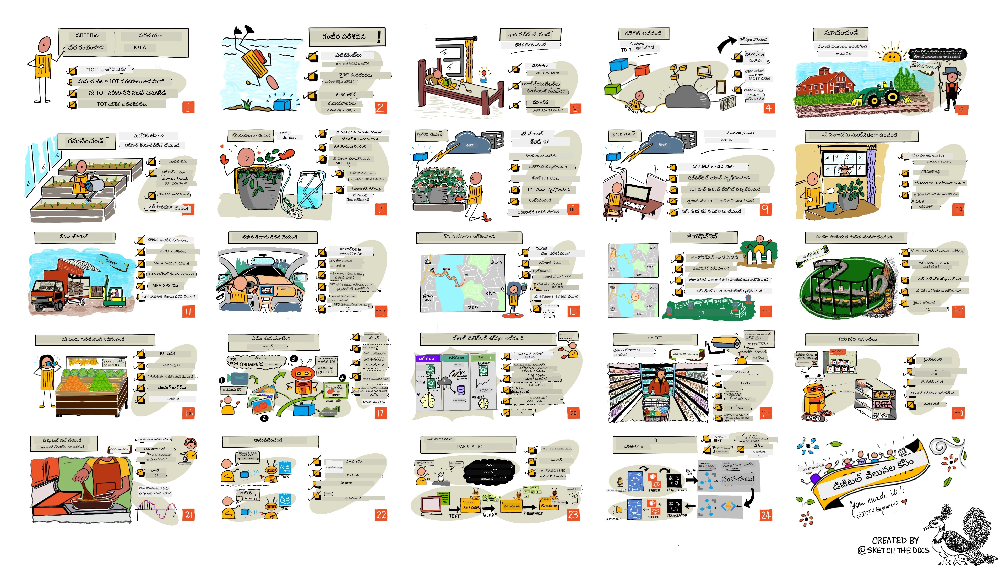

[](https://github.com/microsoft/IoT-For-Beginners/blob/master/LICENSE)
[](https://GitHub.com/microsoft/IoT-For-Beginners/graphs/contributors/)
[](https://GitHub.com/microsoft/IoT-For-Beginners/issues/)
[](https://GitHub.com/microsoft/IoT-For-Beginners/pulls/)
[](http://makeapullrequest.com)

[](https://GitHub.com/microsoft/IoT-For-Beginners/watchers/)
[](https://GitHub.com/microsoft/IoT-For-Beginners/network/)
[](https://GitHub.com/microsoft/IoT-For-Beginners/stargazers/)

### ఆజ్యూర్ AI ఫౌండ్రి కమ్యూనిటీ లో చేరండి

మీకు AI అప్లికేషన్లు నిర్మించడంలో ఎటువంటి సందేహాలు కలుగుతే, MCP గురించి fellow learners మరియు అనుభవజ్ఞులైన డెవలపర్లతో చర్చలో పాల్గొనండి. ఇది ప్రశ్నల కోసం సపోర్టివ్ కమ్యూనిటీ, ఇక్కడ జ్ఞానం స్వేచ్ఛగా పంచుకుంటారు.

[](https://discord.gg/nTYy5BXMWG)

మీకు పProduct feedback లేదా錯పరిష్కరణలో సమస్యలు ఉంటే సందర్శించండి:

[](https://aka.ms/foundry/forum)

ఈ వనరులను ఉపయోగించడం ప్రారంభించడానికి ఈ దశలను పాటించండి:
1. **రిపాజిటరీని Fork చేయండి**: క్లిక్ చేయండి [](https://GitHub.com/microsoft/IoT-For-Beginners/fork)
2. **రిపాజిటరీని Clone చేయండి**:   `git clone https://github.com/microsoft/IoT-For-Beginners.git`
3. [**మైక్రోసాఫ్ట్ ఫౌండ్రి డిస్కార్ట్ లో చేరి నిపుణులు మరియు fellow డెవలపర్లను కలవండి**](https://discord.com/invite/ByRwuEEgH4)


### 🌐 బహుబాషా మద్దతు

#### GitHub Action ద్వారా మద్దతు (స్వయంచాలకంగా మరియు ఎప్పుడు నవీకరణలతో)

<!-- CO-OP TRANSLATOR LANGUAGES TABLE START -->
[Arabic](../ar/README.md) | [Bengali](../bn/README.md) | [Bulgarian](../bg/README.md) | [Burmese (Myanmar)](../my/README.md) | [Chinese (Simplified)](../zh-CN/README.md) | [Chinese (Traditional, Hong Kong)](../zh-HK/README.md) | [Chinese (Traditional, Macau)](../zh-MO/README.md) | [Chinese (Traditional, Taiwan)](../zh-TW/README.md) | [Croatian](../hr/README.md) | [Czech](../cs/README.md) | [Danish](../da/README.md) | [Dutch](../nl/README.md) | [Estonian](../et/README.md) | [Finnish](../fi/README.md) | [French](../fr/README.md) | [German](../de/README.md) | [Greek](../el/README.md) | [Hebrew](../he/README.md) | [Hindi](../hi/README.md) | [Hungarian](../hu/README.md) | [Indonesian](../id/README.md) | [Italian](../it/README.md) | [Japanese](../ja/README.md) | [Kannada](../kn/README.md) | [Khmer](../km/README.md) | [Korean](../ko/README.md) | [Lithuanian](../lt/README.md) | [Malay](../ms/README.md) | [Malayalam](../ml/README.md) | [Marathi](../mr/README.md) | [Nepali](../ne/README.md) | [Nigerian Pidgin](../pcm/README.md) | [Norwegian](../no/README.md) | [Persian (Farsi)](../fa/README.md) | [Polish](../pl/README.md) | [Portuguese (Brazil)](../pt-BR/README.md) | [Portuguese (Portugal)](../pt-PT/README.md) | [Punjabi (Gurmukhi)](../pa/README.md) | [Romanian](../ro/README.md) | [Russian](../ru/README.md) | [Serbian (Cyrillic)](../sr/README.md) | [Slovak](../sk/README.md) | [Slovenian](../sl/README.md) | [Spanish](../es/README.md) | [Swahili](../sw/README.md) | [Swedish](../sv/README.md) | [Tagalog (Filipino)](../tl/README.md) | [Tamil](../ta/README.md) | [Telugu](./README.md) | [Thai](../th/README.md) | [Turkish](../tr/README.md) | [Ukrainian](../uk/README.md) | [Urdu](../ur/README.md) | [Vietnamese](../vi/README.md)

> **స్థానికంగా క్లోన్ చేయాలని భావిస్తున్నారా?**
>
> ఈ రిపాజిటరీలో 50+ భాషా అనువాదాలు ఉన్నందున డౌన్లోడ్ పరిమాణం పెరుగుతుంది. అనువాదాలు లేకుండా క్లోన్ చేయడానికి sparse checkout ఉపయోగించండి:
>
> **Bash / macOS / Linux:**
> ```bash
> git clone --filter=blob:none --sparse https://github.com/microsoft/IoT-For-Beginners.git
> cd IoT-For-Beginners
> git sparse-checkout set --no-cone '/*' '!translations' '!translated_images'
> ```
>
> **CMD (Windows):**
> ```cmd
> git clone --filter=blob:none --sparse https://github.com/microsoft/IoT-For-Beginners.git
> cd IoT-For-Beginners
> git sparse-checkout set --no-cone "/*" "!translations" "!translated_images"
> ```
>
> ఇది కోర్సును పూర్తి చేయడానికి అవసరమైన ప్రతి దాన్ని much వేగంగా డౌన్లోడ్ చేస్తుంది.
<!-- CO-OP TRANSLATOR LANGUAGES TABLE END -->

# మొదటి అడుగులు - IoT కోసం ఒక పాఠ్యక్రమం

మైక్రోసాఫ్ట్ లోని ఆజ్యూర్ క్లౌడ్ అడ్వకేట్లు IoT మౌలికాంశాల గురించి 12 వారాలు, 24 పాఠాలు కలిగిన పాఠ్యక్రమాన్ని అందిస్తున్నారు. ప్రతి పాఠంలో ముందుగాను మరియు శిక్షణ-తరువాత క్విజ్‌లు, పాఠాన్ని పూర్తిచేయడానికి వ్రాసిన సూచనలు, పరిష్కారం, అసైన్‌మెంట్ మరియు మరిన్ని ఉంటాయి. మా ప్రాజెక్ట్ ఆధారిత పాఠ్య విధానం మీరు నేర్పుకోగా నిర్మించగలరు - ఇది కొత్త నైపుణ్యాలు 'మిగిలిపోవడానికి' సుస్థిరమైన మార్గం.

ఈ ప్రాజెక్టులు ఫారం నుండి టేబుల్ వరకు ఆహారం ప్రయాణాన్ని కవర్ చేస్తాయి. ఇందులో వ్యవసాయం, రవాణా, ఉత్పత్తి, రీటెయిల్ మరియు వినియోగదారులు - IoT పరికరాల కోసం ప్రాచుర్యం పొందిన పరిశ్రమ రంగాలు ఉన్నాయి.



> [నిత్య నరసింహన్](https://github.com/nitya) చేత సృష్టించిన స్కేచ్‌నోట్. పెద్ద వెర్షన్ కోసం చిత్రాన్ని నొక్కండి.

**మా రచయితలు [జెన్ ఫాక్స్](https://github.com/jenfoxbot), [జెన్ లూపర్](https://github.com/jlooper), [జిం బెన్నెట్](https://github.com/jimbobbennett) మరియు మా స్కేచ్‌నోట్ కళాకారుడు [నిత్య నరసింహన్](https://github.com/nitya) కు హృదయపూర్వక ధన్యవాదాలు.**

**ఈ పాఠ్యక్రమాన్ని సమీక్షించడానికి మరియు అనువదించడానికి సహకరించిన మా [మైక్రోసాఫ్ట్ లెర్న్ స్టూడెంట్ అంబాసిడర్లు](https://studentambassadors.microsoft.com?WT.mc_id=academic-17441-jabenn) కు కూడా ధన్యవాదాలు - [ఆదిత్య కార్గ్](https://github.com/AdityaGarg00), [అనురাগ్ శర్మ](https://github.com/Anurag-0-1-A), [అర్పిత దాస్](https://github.com/Arpiiitaaa), [ఆర్యన్ జైన్](https://www.linkedin.com/in/aryan-jain-47a4a1145/), [భవేశ్ సునెజా](https://github.com/EliteWarrior315), [ఫెయిత్ హుజ్జా](https://faithhunja.github.io/), [లతీఫా బెల్లో](https://www.linkedin.com/in/lateefah-bello/), [మాన్వి ఝా](https://github.com/Severus-Matthew), [మిరైల్ టాన్](https://www.linkedin.com/in/mireille-tan-a4834819a/), [మోహమ్మద్ ఇఫ్తేహర్ (ఇఫ్తు) ఎబ్నె జలాల్](https://github.com/Iftu119), [మోహమ్మద్ జుల్ఫికార](https://github.com/mohzulfikar), [ప్రియంశు శ్రీవాస్తవ్](https://www.linkedin.com/in/priyanshu-srivastav-b067241ba), [తన్మయి గౌడుచెరువు](https://github.com/innovation-platform), మరియు [జీనా కామెల్](https://www.linkedin.com/in/zina-kamel/).**

టீమ్ ని కలవండి!

[](https://youtu.be/-wippUJRi5k)

**గిఫ్** [మోహిత్ జైసల్](https://linkedin.com/in/mohitjaisal) వద్దుండి

> 🎥 ప్రాజెక్ట్ గురించి ఒక వీడియో కోసం పైన ఉన్న చిత్రాన్ని నొక్కండి!

> **గురుత్వకారులు**, ఈ పాఠ్యక్రమాన్ని ఎలా ఉపయోగించాలో కొన్ని సూచనలు మేము [ఇక్కడ](for-teachers.md) చేర్చాము. మీ స్వంత పాఠాలు సృష్టించాలనుకుంటే, మేము [పాఠం కాపురం](lesson-template/README.md) కూడా అందిస్తున్నాము.

> **[విద్యార్థులు](https://aka.ms/student-page)**, ఈ పాఠ్యక్రమాన్ని స్వయంగా ఉపయోగించడానికి, మొత్తం రిపోను ఫోర్క్ చేసి, ముందుగాను క్విజ్, పాఠాన్ని చదవడం మరియు కార్యక్రమాల решించడానికి ప్రయత్నించండి. పరిష్కారం కోడ్ ని కాపీ చేయడం కాకుండా పాఠాలు అర్థం చేసుకొని ప్రాజెక్టులను సృష్టించండి; కోడ్ ప్రతి ప్రాజెక్టు ఆధారిత పాఠం లో /solutions ఫోల్డర్ లో ఉంది. లేదా మీ స్నేహితులతో అధ్యయన గుంపు ఉంచి కంటెంట్ ను కలిసి అధ్యయనం చేయండి. మరింతకు, మేము [Microsoft Learn](https://docs.microsoft.com/users/jimbobbennett/collections/ke2ehd351jopwr?WT.mc_id=academic-17441-jabenn) ని సూచిస్తాము.

ఈ కోర్సు వీడియో అవలోకనాన్ని ఇక్కడ చూడండి:

[](https://youtube.com/watch?v=bccEMm8gRuc "Promo video")

> 🎥 ప్రాజెక్ట్ గురించి ఒక వీడియో కోసం పైన ఉన్న చిత్రాన్ని నొక్కండి!

## పాఠ్య విధానం

మేము ఈ పాఠ్యక్రమాన్ని నిర్మించేటప్పుడు ఇద్దరు పాఠ్య విధాన నియమాలను ఎంచుకున్నాము: ప్రాజెక్ట్ ఆధారితంగా ఉండటం మరియు తరచూ క్విజ్‌లు ఇవ్వడం. ఈ సిరీస్ చివరన, విద్యార్థులు ఒక మొక్కలను పర్యవేక్షించే, నీరు ఇచ్చే వ్యవస్థ, ఒక వాహన ట్రాకర్, ఆహారాన్ని పర్యవేక్షించే స్మార్ట్ ఫ్యాక్టరీ సెట్ అప్, ఊహించదగిన వాయిస్ నియంత్రిత వంట టైమర్ నిర్మించును మరియు IoT మౌలికాలను నేరిస్తారు; డివైస్ కోడ్ రాయడం, క్లౌడ్ కి కనెక్ట్ కావడం, టెలిమెట్రీ విశ్లేషణ, మరియు ఎడ్జ్ లో AI నడపడం మొదలైనవి.

విషయాలు ప్రాజెక్టులతో సరిపోతూ ఉంటే విద్యార్థులకు మరింత ఆసక్తి కలిగి ఉంటుంది మరియు తత్వాలను మెరుగ్గా గ్రహిస్తారు.

అలాగే, తరగతి ముందు చిన్న క్విజ్ విద్యార్థులకు అవలోకనాన్ని ఇస్తుంది, తరగతి తర్వాత క్విజ్ వారి మెరుగైన గ్రహిష్టానికి ఉపయోగపడుతుంది. ఈ పాఠ్యక్రమం సరళమైనది, సరదాగా తీసుకోవచ్చు. ప్రాథమికంగా ప్రాజెక్టులు చిన్నదిగా మొదలై 12 వారాల చివరకు తీవ్రమయినదిగా ఉంటాయి.

ప్రతి ప్రాజెక్టు విద్యార్థులకు మరియు హాబీస్ర గల భౌతిక హార్డ్వేర్ ఆధారంగా ఉంటుంది. ప్రజెక్టు యొక్క ప్రత్యేక డొమైన్ ను అధ్యయనం చేయడం ద్వారా ప్రాతినిథ్యం చేసుకోబడుతుంది. ఒక విజయవంతమైన డెవలపర్ కావాలంటే సమస్యలను పరిష్కరించే డొమైన్ యొక్క అవగాహన అవసరం. ఈ నేపథ్య జ్ఞానం విద్యార్థులకి వారి IoT సొల్యూషన్స్ ని ఆలోచించడానికి సహాయపడుతుంది మరియు వారు పరిష్కరించబోవు చివరి వినియోగదారుని గూర్చి అవగాహన కలిగిస్తుంది.

## హార్డ్‌వేర్
మనం వ్యక్తిగత అభిరుచులు, ప్రోగ్రామింగ్ భాష జ్ఞానం లేదా అభిరుచులు, నేర్చుకోవడం లక్ష్యాలు మరియు అందుబాటును ఆధారంగా IoT హార్డ్వేర్‌ను రెండు ఎంపికలు చేసుకోవచ్చు. హార్డ్వేర్ అందుబాటులో లేనివారు లేదా కొనుగోలు చేయడానికి ముందే మరింత నేర్చుకోవడానికి కోరుకునేవారికి మేము 'వర్చువల్ హార్డ్వేర్' ఆవిర్భావం కూడా అందించాం. మా మిత్రులు Seeed Studio నుండి పూర్తి కిట్లను కొనుగోలు చేయడానికి లింకులు సహా [hardware page](./hardware.md)లో మీరు మరింత చదవవచ్చు మరియు 'షాపింగ్ లిస్ట్'ను పొందవచ్చు.

> 💁 మా [Code of Conduct](CODE_OF_CONDUCT.md),  [Contributing](CONTRIBUTING.md), మరియు  [Translations](..) మార్గదర్శకాలను చూడండి. మీ నిర్మాణాత్మక అభిప్రాయాన్ని స్వాగతించాము!
>
> 🔧 సమస్యలు ఎదురైతే? సాధారణ సమస్యల పరిష్కాంతులకు మా [Troubleshooting Guide](TROUBLESHOOTING.md)ను చూడండి.

## ప్రతి పాఠం లో భాగాలు:

- స్కెచ్నోట్
- ఐచ్ఛిక అదనపు వీడియో
- పాఠానికి ముందు వార్మప్ క్విజ్
- రాత పాఠం
- ప్రాజెక్టు ఆధారిత పాఠాలకు, ప్రాజెక్టును ఎలా నిర్మించాలో దశల వారీ మార్గదర్శకాలు
- జ్ఞాన తనిఖీలు
- ఒక సవాలు
- అదనపు పఠనం
- అసైన్‌మెంట్
- [పాఠానంతర క్విజ్](https://ff-quizzes.netlify.app/en/)

> **క్విజ్ గురించి ఒక నోట్**: అన్ని క్విజ్లు quiz-app ఫోల్డర్‌లో ఉన్నాయి, మొత్తం 48 క్విజ్లు, ఒక్కొక్కటిలో మూడు ప్రశ్నలు ఉన్నాయి. అవి పాఠాల నుండి లింక్ చేయబడ్డాయి కానీ quiz app ని స్థానికంగా నడిపించవచ్చు లేదా Azure కు డిప్లాయ్ చేయవచ్చు; quiz-app ఫోల్డర్ లోని సూచనలు అనుసరించండి. అవి క్రమంగా స్థానిక భాషలలోకి మారుతున్నారు.

## పాఠాలు

|       |              ప్రాజెక్టు పేరు              |                       నేర్పబడే భావనలు                       | నేర్చుకునే లక్ష్యాలు                                                                                                                                                 |                                                        లింక్ చేసిన పాఠం                                                         |
| :---: | :------------------------------------: | :---------------------------------------------------------: | ------------------------------------------------------------------------------------------------------------------------------------------------------------------- | :--------------------------------------------------------------------------------------------------------------------------: |
|  01   | [Getting started](./1-getting-started/README.md) |                     IoT పరిచయం                     | IoT అనుబంధ మౌలిక సూత్రాలు మరియు IoT పరిష్కారాల ప్రాథమిక నిర్మాణ భాగాలు గమనించండి, ఉదాహరణకు సెన్సార్లు మరియు క్లౌడ్ సర్వీసులు, మీ మొదటి IoT పరికరాన్ని సెట్ చేస్తున్నప్పుడు |                      [Introduction to IoT](./1-getting-started/lessons/1-introduction-to-iot/README.md)                      |
|  02   | [Getting started](./1-getting-started/README.md) |                   IoT లో లోతుగా అన్వేషణ                    | IoT వ్యవస్థ భాగాలు, మైక్రోకంట్రోలర్లు మరియు సింగిల్-బోర్డు కంప్యూటర్లు గురించి మరింత తెలుసుకోండి                                                            |                        [A deeper dive into IoT](./1-getting-started/lessons/2-deeper-dive/README.md)                         |
|  03   | [Getting started](./1-getting-started/README.md) | సెన్సార్లు మరియు యాక్చుఏటర్లతో భౌతిక ప్రపంచంతో సంభాషణ | భౌతిక ప్రపంచం నుండి డేటాను సేకరించడానికి సెన్సార్ల గురించి, మరియు ఫీడ్బ్యాక్ పంపడానికి యాక్చుఏటర్ల గురించి తెలుసుకోండి, రాత్రి దీపం నిర్మించేటప్పుడు                                           | [Interact with the physical world with sensors and actuators](./1-getting-started/lessons/3-sensors-and-actuators/README.md) |
|  04   | [Getting started](./1-getting-started/README.md) |             మీ పరికరాన్ని ఇంటర్నెట్ తో కనెక్ట్ చేయండి             | మీ రాత్రి దీపాన్ని MQTT బ్రోకర్‌తో కనెక్ట్ చేయడం ద్వారా సందేశాలు పంపగలిగే మరియు అందగలిగే విధంగా IoT పరికరాన్ని ఇంటర్నెట్ కు ఎలా కనెక్ట్ చేయాలి తెలుసుకోండి                               |               [Connect your device to the Internet](./1-getting-started/lessons/4-connect-internet/README.md)                |
|  05   |            [Farm](./2-farm/README.md)            |                    మొక్క వృద్ధిని అంచనా వేయండి                     | IoT పరికరం ద్వారా సేకరించిన ఉష్ణోగ్రత డేటా ఆధారంగా మొక్క వృద్ధిని ఎలా అంచనా వేయాలి                                                                                  |                          [Predict plant growth](./2-farm/lessons/1-predict-plant-growth/README.md)                           |
|  06   |            [Farm](./2-farm/README.md)            |                    మట్టితో తేమను గుర్తించండి                     | మట్టి తేమను గుర్తించడం మరియు మట్టి తేమ సెన్సార్‌ను కేలిబ్రేట్ చేయడం                                                                                              |                          [Detect soil moisture](./2-farm/lessons/2-detect-soil-moisture/README.md)                           |
|  07   |            [Farm](./2-farm/README.md)            |                  ఆటోమేటిక్ డుంపు నీటిపోసం                   | రెలే మరియు MQTT ఉపయోగించి నీటిపోసం ఆటోమేటెడ్ మరియు స‌మ‌య‌పాల‌న ఎలా చేయాలో తెలుసుకోండి                                                                                                      |                      [Automated plant watering](./2-farm/lessons/3-automated-plant-watering/README.md)                       |
|  08   |            [Farm](./2-farm/README.md)            |               మీ మొక్కను క్లౌడ్ కు తరలించండి               | క్లౌడ్ మరియు క్లౌడ్ హోస్టెడ్ IoT సర్వీసులు గురించి తెలుసుకోండి మరియు మీ మొక్కను పబ్లిక్ MQTT బ్రోకర్ బదులుగా వీటిలో ఒకదానితో ఎలా కనెక్ట్ చేయాలో తెలుసుకోండి                                   |               [Migrate your plant to the cloud](./2-farm/lessons/4-migrate-your-plant-to-the-cloud/README.md)                |
|  09   |            [Farm](./2-farm/README.md)            |         మీ అప్లికేషన్ లాజిక్ ను క్లౌడ్ కు తరలించండి         | IoT సందేశాలకు స్పందించే క్లౌడ్ లో అప్లికేషన్ లాజిక్ ఎలా వ్రాయాలో తెలుసుకోండి                                                                          |         [Migrate your application logic to the cloud](./2-farm/lessons/5-migrate-application-to-the-cloud/README.md)         |
|  10   |            [Farm](./2-farm/README.md)            |                   మీ మొక్కను సురక్షితం ఉంచండి                    | IoT భద్రత గురించి తెలుసుకోండి మరియు కీలు మరియు సర్టిఫికేట్లు సహాయంతో మీ మొక్కను ఎలా సురక్షితం ఉంచాలో నేర్చుకోండి                                                                          |                        [Keep your plant secure](./2-farm/lessons/6-keep-your-plant-secure/README.md)                         |
|  11   |       [Transport](./3-transport/README.md)       |                      భౌగోళిక స్థానం ట్రాకింగ్                      | IoT పరికరాల కోసం GPS స్థానం ట్రాకింగ్ గురించి తెలుసుకోండి                                                                                                                   |                           [Location tracking](./3-transport/lessons/1-location-tracking/README.md)                           |
|  12   |       [Transport](./3-transport/README.md)       |                     స్థానం డేటాను నిల్వచేయండి                     | తర్వాత విశ్లేషణ లేదా విజువలైజేషన్ కోసం IoT డేటాను నిల్వ చేయడం ఎలా చేసుకోవాలో తెలుసుకోండి                                                                                                      |                         [Store location data](./3-transport/lessons/2-store-location-data/README.md)                         |
|  13   |       [Transport](./3-transport/README.md)       |                   స్థానం డేటాను విజువలైజ్ చేయండి                   | మ్యాప్ పై స్థానం డేటాను ఎలా విజువలైజ్ చేయాలో మరియు మ్యాప్‌లు నిజమైన 3D ప్రపంచాన్ని 2 కొలమానాలలో ఎలా ప్రాతినిధ్యం వహిస్తాయో తెలుసుకోండి                                                            |                     [Visualize location data](./3-transport/lessons/3-visualize-location-data/README.md)                     |
|  14   |       [Transport](./3-transport/README.md)       |                          జియోఫెన్స్                          | జియోఫెన్సెస్ గురించి తెలుసుకోండి, మరియు సరఫరా గొలుసులో వాహనాలు వారి గమ్యస్థానానికి దగ్గరగా ఉన్నప్పుడు ఎలా తెలియజేస్తాయో తెలుసుకోండి                                           |                                   [Geofences](./3-transport/lessons/4-geofences/README.md)                                   |
|  15   |   [Manufacturing](./4-manufacturing/README.md)   |               పండు నాణ్యత గుర్తింపు శిక్షణ                | పండు నాణ్యతను గుర్తించే క్లౌడ్ లో ఇమేజ్ క్లాసిఫయర్ శిక్షణ గురించి తెలుసుకోండి                                                                                       |                 [Train a fruit quality detector](./4-manufacturing/lessons/1-train-fruit-detector/README.md)                 |
|  16   |   [Manufacturing](./4-manufacturing/README.md)   |           IoT పరికరం నుండి పండు నాణ్యత తనిఖీ            | IoT పరికరం నుండి మీ పండు నాణ్యత గుర్తింపుని ఉపయోగించడం గురించిన సమాచారం                                                                                                    |           [Check fruit quality from an IoT device](./4-manufacturing/lessons/2-check-fruit-from-device/README.md)            |
|  17   |   [Manufacturing](./4-manufacturing/README.md)   |             అంచున మీ పండు గుర్తింపుని నడిపించండి             | అంచు దగ్గర ఉన్న IoT పరికరం పై మీ పండు గుర్తింపుని నడపడం గురించి తెలుసుకోండి                                                                                                |             [Run your fruit detector on the edge](./4-manufacturing/lessons/3-run-fruit-detector-edge/README.md)             |
|  18   |   [Manufacturing](./4-manufacturing/README.md)   |        సెన్సార్ నుండి పండు నాణ్యత గుర్తింపుని ప్రేరేపించండి        | సెన్సార్ ద్వారా పండు నాణ్యత గుర్తింపుని ప్రారంభించడం గురించిన సమాచారం                                                                                                        |        [Trigger fruit quality detection from a sensor](./4-manufacturing/lessons/4-trigger-fruit-detector/README.md)         |
|  19   |          [Retail](./5-retail/README.md)          |                   స్టాక్ గుర్తింపుని శిక్షణ                    | వస్తువుల గుర్తింపు ఉపయోగించి షాపులో స్టాక్ లెక్కింపు కోసం స్టాక్ గుర్తింపుని శిక్షణ ఎలా చేయాలో తెలుసుకోండి                                                                                |                        [Train a stock detector](./5-retail/lessons/1-train-stock-detector/README.md)                         |
|  20   |          [Retail](./5-retail/README.md)          |               IoT పరికరం నుండి స్టాక్ తనిఖీ                | ఆబ్జెక్ట్ డిటక్షన్ మోడల్ ఉపయోగించి IoT పరికరం నుండి స్టాక్ తనిఖీ ఎలా చేయాలో తెలుసుకోండి                                                                                         |                     [Check stock from an IoT device](./5-retail/lessons/2-check-stock-device/README.md)                      |
|  21   |        [Consumer](./6-consumer/README.md)        |             IoT పరికరం తో వాగ్ధానం గుర్తింపు             | IoT పరికరం నుండి వాగ్ధానాన్ని గుర్తించి ఒక స్మార్ట్ టైమర్ తయారు చేయడం                                                                                             |                  [Recognize speech with an IoT device](./6-consumer/lessons/1-speech-recognition/README.md)                  |
|  22   |        [Consumer](./6-consumer/README.md)        |                     భాషను అర్థం చేసుకోవడం                     | IoT పరికరానికి మాట్లాడిన వాక్యాలను అర్థం చేసుకునే విధానం                                                                                                           |                        [Understand language](./6-consumer/lessons/2-language-understanding/README.md)                        |
|  23   |        [Consumer](./6-consumer/README.md)        |           టైమర్ సెట్ చేసి మాట్లాడే ఫీడ్బ్యాక్ ఇవ్వండి           | IoT పరికరంలో టైమర్‌ని ఎలా సెట్ చేయాలో మరియు టైమర్ ఎప్పుడు సెట్ అయింది, ఎప్పుడు ముగిసింది అనేదానిపై మాట్లాడే ఫీడ్బ్యాక్ ఎలా ఇవ్వాలో నేర్చుకోండి                                                    |                 [Set a timer and provide spoken feedback](./6-consumer/lessons/3-spoken-feedback/README.md)                  |
|  24   |        [Consumer](./6-consumer/README.md)        |                 అనేక భాషలను మద్దతు ఇవ్వండి                  | అనేక భాషలను మద్దతు ఇవ్వడం ఎలా చేయాలో తెలుసుకోండి, మాట్లాడుకున్నప్పుడు మరియు మీ స్మార్ట్ టైమర్ నుండి వచ్చే ప్రతిస్పందనల మాదిరిగురించి                                                               |                   [Support multiple languages](./6-consumer/lessons/4-multiple-language-support/README.md)                   |

## ఆఫ్‌లైన్ యాక్సెస్

మీరు ఈ డాక్యుమెంటేషన్‌ను ఆఫ్‌లైన్‌లో నడిపించడానికి [Docsify](https://docsify.js.org/#/) ఉపయోగించవచ్చు. ఈ రిపోని ఫోర్క్ చేయండి, మీ స్థానిక మెషీన్‌లో [Docsify ను ఇన్‌స్టాల్](https://docsify.js.org/#/quickstart) చేయండి, ఆపై ఈ రిపో రూట్ ఫోల్డర్‌లో `docsify serve` టైప్ చేయండి. వెబ్‌సైట్ మీ స్థానికహోస్ట్‌లో 3000 పోర్ట్‌లో సర్వ్ అవుతుంది: `localhost:3000`.

## క్విజ్

ప్రతి అధ్యాయం మీద మీ జ్ఞానాన్ని పరీక్షించే ఇంటరాక్టివ్ క్విజ్ ఆత్మీయులందించినందుకు కృతజ్ఞతలు. మీరు మీ జ్ఞానాన్ని [ఇక్కడ](https://ff-quizzes.netlify.app/en/) పరీక్షించవచ్చు

### PDF

ఈ విషయం యొక్క PDFని మీకు అవసరమైతే ఆఫ్‌లైన్ యాక్సెస్ కోసం తయారుచేసుకోవచ్చు. దీని కోసం, మీరు [npm ను ఇన్‌స్టాల్ చేయాలి](https://docs.npmjs.com/downloading-and-installing-node-js-and-npm) మరియు ఈ రిపో రూట్ ఫోల్డర్‌లో క్రింది కమాండ్లను నడిపించండి:

```sh
npm i
npm run convert
```

### స్లైడ్స్

కొన్ని పాఠాలకు స్లైడ్ డెక్స్ [slides](../../slides) ఫోల్డర్‌లో ఉన్నాయి.


## ఇతర పాఠ్యాంశాలు

మా టీమ్ ఇతర పాఠ్యాంశాలు కూడా ఉత్పత్తి చేస్తుంది! వీటిని చూడండి:

<!-- CO-OP TRANSLATOR OTHER COURSES START -->
### LangChain
[](https://aka.ms/langchain4j-for-beginners)
[](https://aka.ms/langchainjs-for-beginners?WT.mc_id=m365-94501-dwahlin)
[](https://github.com/microsoft/langchain-for-beginners?WT.mc_id=m365-94501-dwahlin)
---

### Azure / Edge / MCP / Agents
[](https://github.com/microsoft/AZD-for-beginners?WT.mc_id=academic-105485-koreyst)
[](https://github.com/microsoft/edgeai-for-beginners?WT.mc_id=academic-105485-koreyst)
[](https://github.com/microsoft/mcp-for-beginners?WT.mc_id=academic-105485-koreyst)
[](https://github.com/microsoft/ai-agents-for-beginners?WT.mc_id=academic-105485-koreyst)

---
 
### జనరేటివ్ AI సిరీస్
[](https://github.com/microsoft/generative-ai-for-beginners?WT.mc_id=academic-105485-koreyst)
[-9333EA?style=for-the-badge&labelColor=E5E7EB&color=9333EA)](https://github.com/microsoft/Generative-AI-for-beginners-dotnet?WT.mc_id=academic-105485-koreyst)
[-C084FC?style=for-the-badge&labelColor=E5E7EB&color=C084FC)](https://github.com/microsoft/generative-ai-for-beginners-java?WT.mc_id=academic-105485-koreyst)
[-E879F9?style=for-the-badge&labelColor=E5E7EB&color=E879F9)](https://github.com/microsoft/generative-ai-with-javascript?WT.mc_id=academic-105485-koreyst)

---
 
### కోర్ లెర్నింగ్
[](https://aka.ms/ml-beginners?WT.mc_id=academic-105485-koreyst)
[](https://aka.ms/datascience-beginners?WT.mc_id=academic-105485-koreyst)
[](https://aka.ms/ai-beginners?WT.mc_id=academic-105485-koreyst)
[](https://github.com/microsoft/Security-101?WT.mc_id=academic-96948-sayoung)
[](https://aka.ms/webdev-beginners?WT.mc_id=academic-105485-koreyst)
[](https://aka.ms/iot-beginners?WT.mc_id=academic-105485-koreyst)
[](https://github.com/microsoft/xr-development-for-beginners?WT.mc_id=academic-105485-koreyst)

---
 
### కోపైలట్ సిరీస్
[](https://aka.ms/GitHubCopilotAI?WT.mc_id=academic-105485-koreyst)
[](https://github.com/microsoft/mastering-github-copilot-for-dotnet-csharp-developers?WT.mc_id=academic-105485-koreyst)
[](https://github.com/microsoft/CopilotAdventures?WT.mc_id=academic-105485-koreyst)
<!-- CO-OP TRANSLATOR OTHER COURSES END -->

## చిత్ర హక్కులు

మీరు ఈ పాఠ్యক্রমంలో ఉపయోగించిన చిత్రాలకు సంబంధించిన అన్ని హక్కులను అవసరం ఉన్న చోట [Attributions](./attributions.md) లో కనుగొనవచ్చు.

---

<!-- CO-OP TRANSLATOR DISCLAIMER START -->
**డిస్క్లైమర్**:  
ఈ డాక్యుమెంట్‌ను AI అనువాద సేవ [Co-op Translator](https://github.com/Azure/co-op-translator) ఉపయోగించి అనువదించబడింది. మేము ఖచ్చితత్వం కోసం ప్రయత్నించినప్పటికీ, ఆటోమేటిక్ అనువాదాలలో తప్పులు లేదా అసత్యతలు ఉండవచ్చని దయచేసి గమనించండి. మౌలిక పత్రం స్వదేశీ భాషలో అందుబాటులో ఉన్నదే అధికారిక మూలం అని పరిగణించవలెను. ముఖ్య సమాచారం కోసం, నిపుణుల మానవ అనువాదాన్ని సిఫారసు చేస్తున్నాము. ఈ అనువాదం ఉపయోగంలో వచ్చే ఏవైనా అవగాహన లోపాలు లేదా తప్పు అర్థం చేసుకోవడాలకు మేము బాధ్యులం కంలాము.
<!-- CO-OP TRANSLATOR DISCLAIMER END -->