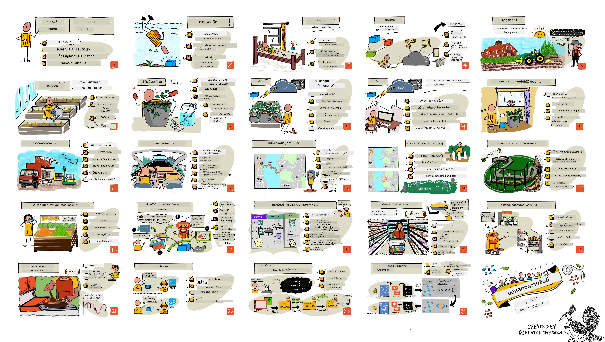

<!--
CO_OP_TRANSLATOR_METADATA:
{
  "original_hash": "6c354ec3487e4f6cfafbe44557996cd9",
  "translation_date": "2026-01-06T06:22:24+00:00",
  "source_file": "README.md",
  "language_code": "th"
}
-->
[](https://github.com/microsoft/IoT-For-Beginners/blob/master/LICENSE)
[](https://GitHub.com/microsoft/IoT-For-Beginners/graphs/contributors/)
[](https://GitHub.com/microsoft/IoT-For-Beginners/issues/)
[](https://GitHub.com/microsoft/IoT-For-Beginners/pulls/)
[](http://makeapullrequest.com)

[](https://GitHub.com/microsoft/IoT-For-Beginners/watchers/)
[](https://GitHub.com/microsoft/IoT-For-Beginners/network/)
[](https://GitHub.com/microsoft/IoT-For-Beginners/stargazers/)

### เข้าร่วมชุมชน Azure AI Foundry

ถ้าคุณติดขัดหรือต้องการคำถามเกี่ยวกับการสร้างแอป AI เข้าร่วมกับผู้เรียนและนักพัฒนาที่มีประสบการณ์ในการพูดคุยเกี่ยวกับ MCP นี่คือชุมชนที่สนับสนุนซึ่งยินดีต้อนรับคำถามและแบ่งปันความรู้กันอย่างเสรี

[](https://discord.gg/nTYy5BXMWG)

ถ้าคุณมีข้อเสนอแนะเกี่ยวกับผลิตภัณฑ์หรือข้อผิดพลาดขณะสร้าง โปรดเยี่ยมชม:

[](https://aka.ms/foundry/forum)

ทำตามขั้นตอนเหล่านี้เพื่อเริ่มใช้ทรัพยากรเหล่านี้:
1. **Fork Repository**: คลิก [](https://GitHub.com/microsoft/IoT-For-Beginners/fork)
2. **Clone Repository**:   `git clone https://github.com/microsoft/IoT-For-Beginners.git`
3. [**เข้าร่วม Microsot Foundry Discord และพบปะผู้เชี่ยวชาญและนักพัฒนาร่วมกัน**](https://discord.com/invite/ByRwuEEgH4)

### 🌐 รองรับหลายภาษา

#### รองรับผ่าน GitHub Action (อัตโนมัติ & อัปเดตตลอดเวลา)

<!-- CO-OP TRANSLATOR LANGUAGES TABLE START -->
[Arabic](../ar/README.md) | [Bengali](../bn/README.md) | [Bulgarian](../bg/README.md) | [Burmese (Myanmar)](../my/README.md) | [Chinese (Simplified)](../zh/README.md) | [Chinese (Traditional, Hong Kong)](../hk/README.md) | [Chinese (Traditional, Macau)](../mo/README.md) | [Chinese (Traditional, Taiwan)](../tw/README.md) | [Croatian](../hr/README.md) | [Czech](../cs/README.md) | [Danish](../da/README.md) | [Dutch](../nl/README.md) | [Estonian](../et/README.md) | [Finnish](../fi/README.md) | [French](../fr/README.md) | [German](../de/README.md) | [Greek](../el/README.md) | [Hebrew](../he/README.md) | [Hindi](../hi/README.md) | [Hungarian](../hu/README.md) | [Indonesian](../id/README.md) | [Italian](../it/README.md) | [Japanese](../ja/README.md) | [Kannada](../kn/README.md) | [Korean](../ko/README.md) | [Lithuanian](../lt/README.md) | [Malay](../ms/README.md) | [Malayalam](../ml/README.md) | [Marathi](../mr/README.md) | [Nepali](../ne/README.md) | [Nigerian Pidgin](../pcm/README.md) | [Norwegian](../no/README.md) | [Persian (Farsi)](../fa/README.md) | [Polish](../pl/README.md) | [Portuguese (Brazil)](../br/README.md) | [Portuguese (Portugal)](../pt/README.md) | [Punjabi (Gurmukhi)](../pa/README.md) | [Romanian](../ro/README.md) | [Russian](../ru/README.md) | [Serbian (Cyrillic)](../sr/README.md) | [Slovak](../sk/README.md) | [Slovenian](../sl/README.md) | [Spanish](../es/README.md) | [Swahili](../sw/README.md) | [Swedish](../sv/README.md) | [Tagalog (Filipino)](../tl/README.md) | [Tamil](../ta/README.md) | [Telugu](../te/README.md) | [Thai](./README.md) | [Turkish](../tr/README.md) | [Ukrainian](../uk/README.md) | [Urdu](../ur/README.md) | [Vietnamese](../vi/README.md)

> **ต้องการ Clone แบบท้องถิ่น?**

> Repository นี้มีการแปลเป็นมากกว่า 50 ภาษา ซึ่งเพิ่มขนาดการดาวน์โหลดอย่างมาก หากต้องการโคลนโดยไม่รวมการแปล ให้ใช้ sparse checkout:
> ```bash
> git clone --filter=blob:none --sparse https://github.com/microsoft/IoT-For-Beginners.git
> cd IoT-For-Beginners
> git sparse-checkout set --no-cone '/*' '!translations' '!translated_images'
> ```
> วิธีนี้จะให้ทุกสิ่งที่คุณต้องการเพื่อทำคอร์สให้เสร็จด้วยการดาวน์โหลดที่รวดเร็วขึ้นมาก
<!-- CO-OP TRANSLATOR LANGUAGES TABLE END -->

# IoT สำหรับผู้เริ่มต้น - หลักสูตร

ผู้สนับสนุน Azure Cloud ที่ Microsoft ยินดีที่จะเสนอหลักสูตร 12 สัปดาห์ 24 บทเรียน ที่กล่าวถึงพื้นฐานของ IoT ทุกบทเรียนมีแบบทดสอบก่อนและหลังการเรียน คำแนะนำเป็นลายลักษณ์อักษรเพื่อทำบทเรียนให้เสร็จสมบูรณ์ โซลูชัน งานมอบหมาย และอื่นๆ การเรียนรู้ผ่านโครงการทำให้คุณได้เรียนรู้ในขณะที่สร้างซึ่งเป็นวิธีที่ได้รับการพิสูจน์ว่าสามารถทำให้ทักษะใหม่ 'ติดตัว' ได้

โครงการต่างๆ ครอบคลุมเส้นทางของอาหารจากฟาร์มถึงโต๊ะอาหาร ซึ่งรวมถึงการเกษตร การขนส่ง การผลิต การค้าปลีก และผู้บริโภค — ทุกส่วนเป็นอุตสาหกรรมยอดนิยมสำหรับอุปกรณ์ IoT



> สเก็ตช์โน้ตโดย [Nitya Narasimhan](https://github.com/nitya) คลิกภาพเพื่อดูเวอร์ชันขยาย

**ขอขอบคุณอย่างจริงใจต่อผู้ประพันธ์ของเรา [Jen Fox](https://github.com/jenfoxbot), [Jen Looper](https://github.com/jlooper), [Jim Bennett](https://github.com/jimbobbennett) และศิลปินสเก็ตช์โน้ตของเรา [Nitya Narasimhan](https://github.com/nitya)**

**ขอบคุณทีม [Microsoft Learn Student Ambassadors](https://studentambassadors.microsoft.com?WT.mc_id=academic-17441-jabenn) ของเราที่ได้ช่วยตรวจทานและแปลหลักสูตรนี้ — [Aditya Garg](https://github.com/AdityaGarg00), [Anurag Sharma](https://github.com/Anurag-0-1-A), [Arpita Das](https://github.com/Arpiiitaaa), [Aryan Jain](https://www.linkedin.com/in/aryan-jain-47a4a1145/), [Bhavesh Suneja](https://github.com/EliteWarrior315), [Faith Hunja](https://faithhunja.github.io/), [Lateefah Bello](https://www.linkedin.com/in/lateefah-bello/), [Manvi Jha](https://github.com/Severus-Matthew), [Mireille Tan](https://www.linkedin.com/in/mireille-tan-a4834819a/), [Mohammad Iftekher (Iftu) Ebne Jalal](https://github.com/Iftu119), [Mohammad Zulfikar](https://github.com/mohzulfikar), [Priyanshu Srivastav](https://www.linkedin.com/in/priyanshu-srivastav-b067241ba), [Thanmai Gowducheruvu](https://github.com/innovation-platform) และ [Zina Kamel](https://www.linkedin.com/in/zina-kamel/)**

พบกับทีมงาน!

[](https://youtu.be/-wippUJRi5k)

**Gif โดย** [Mohit Jaisal](https://linkedin.com/in/mohitjaisal)

> 🎥 คลิกภาพด้านบนเพื่อชมวิดีโอเกี่ยวกับโครงการ!

> **ครูผู้สอน**, เราได้ [รวมคำแนะนำบางส่วน](for-teachers.md) เกี่ยวกับวิธีใช้หลักสูตรนี้ไว้แล้ว ถ้าคุณต้องการสร้างบทเรียนของตัวเอง เรามี [เทมเพลตบทเรียน](lesson-template/README.md) ให้ด้วย

> **[นักเรียน](https://aka.ms/student-page)** เพื่อใช้หลักสูตรนี้ด้วยตนเอง โปรด Fork รีโพทั้งหมดและทำแบบฝึกหัดด้วยตนเอง เริ่มจากแบบทดสอบก่อนบรรยาย อ่านบรรยาย และทำกิจกรรมต่อ ๆ ไป พยายามสร้างโครงการโดยเข้าใจบทเรียนแทนที่จะคัดลอกโค้ดโซลูชัน แต่โค้ดนั้นสามารถหาได้ในโฟลเดอร์ /solutions ในแต่ละบทเรียนที่เน้นโครงการ อีกแนวทางหนึ่งคือสร้างกลุ่มเรียนร่วมกับเพื่อนและศึกษาร่วมกัน เราขอแนะนำ [Microsoft Learn](https://docs.microsoft.com/users/jimbobbennett/collections/ke2ehd351jopwr?WT.mc_id=academic-17441-jabenn) สำหรับการศึกษาต่อ

สำหรับภาพรวมของหลักสูตรนี้ในรูปแบบวิดีโอ ดูวิดีโอนี้:

[](https://youtube.com/watch?v=bccEMm8gRuc "Promo video")

> 🎥 คลิกภาพด้านบนเพื่อชมวิดีโอเกี่ยวกับโครงการ!

## หลักการสอน

เราเลือกใช้หลักการสอนสองข้อในขณะที่สร้างหลักสูตรนี้: ให้มีรูปแบบการเรียนรู้ผ่านโครงการและมีแบบทดสอบบ่อยครั้ง ภายในช่วงตอนนี้ นักเรียนจะได้สร้างระบบตรวจสอบและรดน้ำต้นไม้ ติดตามยานพาหนะ ตั้งค่าโรงงานอัจฉริยะเพื่อติดตามและตรวจสอบอาหาร และตั้งเวลาทำอาหารที่ควบคุมด้วยเสียง พร้อมเรียนรู้พื้นฐานของอินเทอร์เน็ตของสรรพสิ่ง รวมถึงวิธีเขียนโค้ดอุปกรณ์ เชื่อมต่อกับคลาวด์ วิเคราะห์เทเลเมทรี และรัน AI ที่ขอบเครือข่าย

โดยให้เนื้อหาสอดคล้องกับโครงการ กระบวนการเรียนรู้จะน่าสนใจขึ้นสำหรับนักเรียนและส่งเสริมการจดจำแนวคิดให้ดีขึ้น

นอกจากนี้ แบบทดสอบที่มีความกดดันต่ำก่อนคลาสช่วยให้นักเรียนตั้งใจเรียนรู้หัวข้อ ขณะที่แบบทดสอบหลังคลาสช่วยเสริมการจดจำอีกครั้ง หลักสูตรนี้ออกแบบให้ยืดหยุ่นและสนุก สามารถเรียนครบทั้งหลักสูตรหรือบางส่วนได้ โครงการเริ่มง่ายและมีความซับซ้อนเพิ่มขึ้นเรื่อยๆ ในช่วง 12 สัปดาห์

แต่ละโครงการใช้ฮาร์ดแวร์จริงที่มีให้แก่นักเรียนและผู้สนใจศึกษา แต่ละโครงการเจาะลึกโดเมนที่เกี่ยวข้อง เพื่อให้มีความรู้พื้นฐานที่จำเป็น การเป็นนักพัฒนาที่ประสบความสำเร็จช่วยให้เข้าใจโดเมนที่แก้ปัญหา ความรู้พื้นฐานนี้ช่วยให้นักเรียนคิดถึงโซลูชัน IoT ของตนและการเรียนรู้ในบริบทของปัญหาในโลกจริงที่อาจเจอในฐานะนักพัฒนา IoT นักเรียนได้เรียนรู้เหตุผลเบื้องหลังโซลูชันที่สร้างขึ้นและได้ซาบซึ้งกับผู้ใช้ปลายทาง

## ฮาร์ดแวร์

เรามีฮาร์ดแวร์ IoT ให้เลือกใช้สองแบบสำหรับโครงการ ขึ้นอยู่กับความชอบส่วนบุคคล ความรู้หรือความชอบด้านภาษาโปรแกรม เป้าหมายการเรียนรู้ และความพร้อมใช้งาน เรายังมีเวอร์ชัน 'ฮาร์ดแวร์เสมือน' สำหรับผู้ที่ไม่มีฮาร์ดแวร์หรืออยากเรียนรู้เพิ่มเติมก่อนตัดสินใจซื้อ คุณสามารถอ่านเพิ่มเติมและดู 'รายการช็อปปิ้ง' ได้ใน [หน้าฮาร์ดแวร์](./hardware.md) รวมถึงลิงก์ไปยังการซื้อชุดอุปกรณ์ครบจากเพื่อนของเราที่ Seeed Studio ด้วย
> 💁 ค้นหา [จรรยาบรรณ](CODE_OF_CONDUCT.md), [การมีส่วนร่วม](CONTRIBUTING.md) และแนวทาง [การแปล](TRANSLATIONS.md) ของเรา เรายินดีรับฟังข้อเสนอแนะที่สร้างสรรค์ของคุณ!
>
> 🔧 ประสบปัญหาใช่ไหม? ตรวจสอบ [คู่มือแก้ไขปัญหา](TROUBLESHOOTING.md) ของเราสำหรับวิธีแก้ไขปัญหาที่พบบ่อย

## แต่ละบทเรียนประกอบด้วย:

- สเก็ตช์โน้ต
- วิดีโอเสริมที่เลือกได้
- แบบทดสอบวอร์มอัพก่อนบทเรียน
- บทเรียนเขียน
- สำหรับบทเรียนที่เน้นโครงการ มีคำแนะนำทีละขั้นตอนเกี่ยวกับการสร้างโครงการ
- การทดสอบความรู้
- ความท้าทาย
- การอ่านเพิ่มเติมเสริม
- การมอบหมายงาน
- [แบบทดสอบหลังบทเรียน](https://ff-quizzes.netlify.app/en/)

> **หมายเหตุเกี่ยวกับแบบทดสอบ**: แบบทดสอบทั้งหมดอยู่ในโฟลเดอร์ quiz-app รวมทั้งหมด 48 แบบทดสอบ แต่ละแบบประกอบด้วยสามคำถาม พวกเขาถูกลิงก์จากภายในบทเรียน แต่แอปแบบทดสอบสามารถรันได้ในเครื่องหรือดีพลอยไปยัง Azure; ปฏิบัติตามคำแนะนำในโฟลเดอร์ `quiz-app` โดยแบบทดสอบกำลังถูกแปลทีละน้อย

## บทเรียน

|       |              ชื่อโครงการ              |                       แนวคิดที่สอน                       | วัตถุประสงค์การเรียนรู้                                                                                                                                          |                                                        บทเรียนที่ลิงก์                                                         |
| :---: | :------------------------------------: | :---------------------------------------------------------: | ------------------------------------------------------------------------------------------------------------------------------------------------------------------- | :--------------------------------------------------------------------------------------------------------------------------: |
|  01   | [เริ่มต้น](./1-getting-started/README.md) |                     บทนำสู่ IoT                     | เรียนรู้หลักการพื้นฐานของ IoT และส่วนประกอบพื้นฐานของโซลูชัน IoT เช่น เซ็นเซอร์และบริการคลาวด์ ในขณะที่คุณตั้งค่าอุปกรณ์ IoT แรกของคุณ |                      [บทนำสู่ IoT](./1-getting-started/lessons/1-introduction-to-iot/README.md)                      |
|  02   | [เริ่มต้น](./1-getting-started/README.md) |                   เจาะลึก IoT                    | เรียนรู้เพิ่มเติมเกี่ยวกับส่วนประกอบของระบบ IoT รวมถึงไมโครคอนโทรลเลอร์และคอมพิวเตอร์บอร์ดเดียว                                                            |                        [เจาะลึก IoT](./1-getting-started/lessons/2-deeper-dive/README.md)                         |
|  03   | [เริ่มต้น](./1-getting-started/README.md) | โต้ตอบกับโลกทางกายภาพด้วยเซ็นเซอร์และแอคทูเอเตอร์ | เรียนรู้เกี่ยวกับเซ็นเซอร์สำหรับรวบรวมข้อมูลจากโลกทางกายภาพ และแอคทูเอเตอร์สำหรับส่งข้อมูลตอบกลับ ในขณะที่คุณสร้างโคมไฟกลางคืน                                           | [โต้ตอบกับโลกทางกายภาพด้วยเซ็นเซอร์และแอคทูเอเตอร์](./1-getting-started/lessons/3-sensors-and-actuators/README.md) |
|  04   | [เริ่มต้น](./1-getting-started/README.md) |             เชื่อมต่ออุปกรณ์ของคุณกับอินเทอร์เน็ต             | เรียนรู้เกี่ยวกับการเชื่อมต่ออุปกรณ์ IoT กับอินเทอร์เน็ตเพื่อส่งและรับข้อความโดยเชื่อมต่อโคมไฟกลางคืนของคุณกับโบรกเกอร์ MQTT                               |               [เชื่อมต่ออุปกรณ์ของคุณกับอินเทอร์เน็ต](./1-getting-started/lessons/4-connect-internet/README.md)                |
|  05   |            [ฟาร์ม](./2-farm/README.md)            |                    ทำนายการเจริญเติบโตของพืช                     | เรียนรู้วิธีทำนายการเจริญเติบโตของพืชโดยใช้ข้อมูลอุณหภูมิที่เก็บรวบรวมโดยอุปกรณ์ IoT                                                                                  |                          [ทำนายการเจริญเติบโตของพืช](./2-farm/lessons/1-predict-plant-growth/README.md)                           |
|  06   |            [ฟาร์ม](./2-farm/README.md)            |                    ตรวจจับความชื้นในดิน                     | เรียนรู้วิธีตรวจจับความชื้นในดินและปรับเทียบเซ็นเซอร์ความชื้นในดิน                                                                                              |                          [ตรวจจับความชื้นในดิน](./2-farm/lessons/2-detect-soil-moisture/README.md)                           |
|  07   |            [ฟาร์ม](./2-farm/README.md)            |                  การรดน้ำพืชอัตโนมัติ                   | เรียนรู้วิธีทำระบบรดน้ำพืชอัตโนมัติและตั้งเวลาการรดน้ำโดยใช้รีเลย์และ MQTT                                                                                                      |                      [การรดน้ำพืชอัตโนมัติ](./2-farm/lessons/3-automated-plant-watering/README.md)                       |
|  08   |            [ฟาร์ม](./2-farm/README.md)            |               ย้ายพืชของคุณไปยังคลาวด์               | เรียนรู้เกี่ยวกับคลาวด์และบริการ IoT ที่โฮสต์บนคลาวด์และวิธีเชื่อมต่อพืชของคุณกับบริการเหล่านี้แทนโบรกเกอร์ MQTT สาธารณะ                                   |               [ย้ายพืชของคุณไปยังคลาวด์](./2-farm/lessons/4-migrate-your-plant-to-the-cloud/README.md)                |
|  09   |            [ฟาร์ม](./2-farm/README.md)            |         ย้ายตรรกะแอปพลิเคชันของคุณไปยังคลาวด์         | เรียนรู้เกี่ยวกับวิธีเขียนตรรกะแอปพลิเคชันในคลาวด์ที่ตอบสนองต่อข้อความ IoT                                                                          |         [ย้ายตรรกะแอปพลิเคชันของคุณไปยังคลาวด์](./2-farm/lessons/5-migrate-application-to-the-cloud/README.md)         |
|  10   |            [ฟาร์ม](./2-farm/README.md)            |                   ทำให้พืชของคุณปลอดภัย                    | เรียนรู้เกี่ยวกับความปลอดภัยกับ IoT และวิธีรักษาความปลอดภัยพืชของคุณด้วยกุญแจและใบรับรอง                                                                          |                        [ทำให้พืชของคุณปลอดภัย](./2-farm/lessons/6-keep-your-plant-secure/README.md)                         |
|  11   |       [การขนส่ง](./3-transport/README.md)       |                      การติดตามตำแหน่ง                      | เรียนรู้เกี่ยวกับการติดตามตำแหน่ง GPS สำหรับอุปกรณ์ IoT                                                                                                                   |                           [การติดตามตำแหน่ง](./3-transport/lessons/1-location-tracking/README.md)                           |
|  12   |       [การขนส่ง](./3-transport/README.md)       |                     การจัดเก็บข้อมูลตำแหน่ง                     | เรียนรู้วิธีจัดเก็บข้อมูล IoT เพื่อให้สามารถแสดงผลหรือวิเคราะห์ในภายหลัง                                                                                                      |                         [การจัดเก็บข้อมูลตำแหน่ง](./3-transport/lessons/2-store-location-data/README.md)                         |
|  13   |       [การขนส่ง](./3-transport/README.md)       |                   การแสดงผลข้อมูลตำแหน่ง                   | เรียนรู้เกี่ยวกับการแสดงผลข้อมูลตำแหน่งบนแผนที่ และวิธีที่แผนที่แทนโลก 3 มิติจริงใน 2 มิติ                                                            |                     [การแสดงผลข้อมูลตำแหน่ง](./3-transport/lessons/3-visualize-location-data/README.md)                     |
|  14   |       [การขนส่ง](./3-transport/README.md)       |                          รั้วภูมิศาสตร์                          | เรียนรู้เกี่ยวกับรั้วภูมิศาสตร์ และวิธีใช้เพื่อแจ้งเตือนเมื่อยานพาหนะในห่วงโซ่อุปทานใกล้กับจุดหมายปลายทางของพวกเขา                                           |                                   [รั้วภูมิศาสตร์](./3-transport/lessons/4-geofences/README.md)                                   |
|  15   |   [การผลิต](./4-manufacturing/README.md)   |               ฝึกฝนตัวตรวจคุณภาพผลไม้                | เรียนรู้เกี่ยวกับการฝึกฝนตัวจำแนกรูปภาพในคลาวด์เพื่อวัดคุณภาพผลไม้                                                                                       |                 [ฝึกฝนตัวตรวจคุณภาพผลไม้](./4-manufacturing/lessons/1-train-fruit-detector/README.md)                 |
|  16   |   [การผลิต](./4-manufacturing/README.md)   |           ตรวจสอบคุณภาพผลไม้จากอุปกรณ์ IoT            | เรียนรู้เกี่ยวกับการใช้ตัวตรวจสอบคุณภาพผลไม้จากอุปกรณ์ IoT                                                                                                    |           [ตรวจสอบคุณภาพผลไม้จากอุปกรณ์ IoT](./4-manufacturing/lessons/2-check-fruit-from-device/README.md)            |
|  17   |   [การผลิต](./4-manufacturing/README.md)   |             รันตัวตรวจผลไม้ของคุณบน Edge             | เรียนรู้เกี่ยวกับการรันตัวตรวจผลไม้ของคุณบนอุปกรณ์ IoT ที่ Edge                                                                                                |             [รันตัวตรวจผลไม้ของคุณบน Edge](./4-manufacturing/lessons/3-run-fruit-detector-edge/README.md)             |
|  18   |   [การผลิต](./4-manufacturing/README.md)   |        กระตุ้นการตรวจจับคุณภาพผลไม้จากเซ็นเซอร์        | เรียนรู้เกี่ยวกับการกระตุ้นการตรวจจับคุณภาพผลไม้จากเซ็นเซอร์                                                                                                        |        [กระตุ้นการตรวจจับคุณภาพผลไม้จากเซ็นเซอร์](./4-manufacturing/lessons/4-trigger-fruit-detector/README.md)         |
|  19   |          [ค้าปลีก](./5-retail/README.md)          |                   ฝึกฝนตัวตรวจสต็อก                    | เรียนรู้วิธีใช้การตรวจจับวัตถุเพื่อฝึกฝนตัวตรวจสต็อกสำหรับนับสต็อกในร้าน                                                                                |                        [ฝึกฝนตัวตรวจสต็อก](./5-retail/lessons/1-train-stock-detector/README.md)                         |
|  20   |          [ค้าปลีก](./5-retail/README.md)          |               ตรวจสอบสต็อกจากอุปกรณ์ IoT                | เรียนรู้วิธีตรวจสอบสต็อกจากอุปกรณ์ IoT โดยใช้โมเดลตรวจจับวัตถุ                                                                                         |                     [ตรวจสอบสต็อกจากอุปกรณ์ IoT](./5-retail/lessons/2-check-stock-device/README.md)                      |
|  21   |        [ผู้บริโภค](./6-consumer/README.md)        |             จดจำเสียงพูดด้วยอุปกรณ์ IoT             | เรียนรู้วิธีจดจำเสียงพูดจากอุปกรณ์ IoT เพื่อสร้างตัวจับเวลาอัจฉริยะ                                                                                             |                  [จดจำเสียงพูดด้วยอุปกรณ์ IoT](./6-consumer/lessons/1-speech-recognition/README.md)                  |
|  22   |        [ผู้บริโภค](./6-consumer/README.md)        |                     เข้าใจภาษา                     | เรียนรู้วิธีเข้าใจประโยคที่พูดกับอุปกรณ์ IoT                                                                                                           |                        [เข้าใจภาษา](./6-consumer/lessons/2-language-understanding/README.md)                        |
|  23   |        [ผู้บริโภค](./6-consumer/README.md)        |           ตั้งตัวจับเวลาและให้ผลตอบรับด้วยเสียง           | เรียนรู้วิธีตั้งตัวจับเวลาบนอุปกรณ์ IoT และให้ผลตอบรับด้วยเสียงเมื่อเริ่มตั้งและเมื่อเสร็จสิ้น                                                    |                 [ตั้งตัวจับเวลาและให้ผลตอบรับด้วยเสียง](./6-consumer/lessons/3-spoken-feedback/README.md)                  |
|  24   |        [ผู้บริโภค](./6-consumer/README.md)        |                 รองรับหลายภาษา                  | เรียนรู้วิธีรองรับหลายภาษา ทั้งเมื่อถูกพูดคุยด้วยและการตอบกลับจากตัวจับเวลาอัจฉริยะ                                                               |                   [รองรับหลายภาษา](./6-consumer/lessons/4-multiple-language-support/README.md)                   |

## การเข้าถึงแบบออฟไลน์

คุณสามารถเรียกใช้เอกสารนี้แบบออฟไลน์โดยใช้ [Docsify](https://docsify.js.org/#/) ก๊อปรีโปนี้, [ติดตั้ง Docsify](https://docsify.js.org/#/quickstart) บนเครื่องของคุณ จากนั้นในโฟลเดอร์รากของรีโปนี้ พิมพ์ `docsify serve` เว็บไซต์จะให้บริการบนพอร์ต 3000 ที่ localhost ของคุณ: `localhost:3000`

## แบบทดสอบ

ขอบคุณชุมชนที่เป็นเจ้าภาพแบบทดสอบโต้ตอบซึ่งทดสอบความรู้ของคุณในแต่ละบท คุณสามารถทดสอบความรู้ของคุณได้ [ที่นี่](https://ff-quizzes.netlify.app/en/)

### PDF

คุณสามารถสร้าง PDF ของเนื้อหานี้เพื่อการเข้าถึงแบบออฟไลน์หากจำเป็น ในการทำเช่นนั้น ให้แน่ใจว่าคุณมี [ติดตั้ง npm](https://docs.npmjs.com/downloading-and-installing-node-js-and-npm) และรันคำสั่งต่อไปนี้ในโฟลเดอร์รากของรีโปนี้:

```sh
npm i
npm run convert
```

### สไลด์

มีสไลด์สำหรับบางบทเรียนในโฟลเดอร์ [slides](../../slides)


## หลักสูตรอื่น ๆ

ทีมงานของเราผลิตหลักสูตรอื่น ๆ! เช็คดูได้ที่:

<!-- CO-OP TRANSLATOR OTHER COURSES START -->
### LangChain
[](https://aka.ms/langchain4j-for-beginners)
[](https://aka.ms/langchainjs-for-beginners?WT.mc_id=m365-94501-dwahlin)

---

### Azure / Edge / MCP / Agents
[](https://github.com/microsoft/AZD-for-beginners?WT.mc_id=academic-105485-koreyst)
[](https://github.com/microsoft/edgeai-for-beginners?WT.mc_id=academic-105485-koreyst)
[](https://github.com/microsoft/mcp-for-beginners?WT.mc_id=academic-105485-koreyst)
[](https://github.com/microsoft/ai-agents-for-beginners?WT.mc_id=academic-105485-koreyst)

---
 
### ซีรีส์ AI สร้างสรรค์
[](https://github.com/microsoft/generative-ai-for-beginners?WT.mc_id=academic-105485-koreyst)
[-9333EA?style=for-the-badge&labelColor=E5E7EB&color=9333EA)](https://github.com/microsoft/Generative-AI-for-beginners-dotnet?WT.mc_id=academic-105485-koreyst)
[-C084FC?style=for-the-badge&labelColor=E5E7EB&color=C084FC)](https://github.com/microsoft/generative-ai-for-beginners-java?WT.mc_id=academic-105485-koreyst)
[-E879F9?style=for-the-badge&labelColor=E5E7EB&color=E879F9)](https://github.com/microsoft/generative-ai-with-javascript?WT.mc_id=academic-105485-koreyst)

---
 
### การเรียนรู้หลัก
[](https://aka.ms/ml-beginners?WT.mc_id=academic-105485-koreyst)
[](https://aka.ms/datascience-beginners?WT.mc_id=academic-105485-koreyst)
[](https://aka.ms/ai-beginners?WT.mc_id=academic-105485-koreyst)
[](https://github.com/microsoft/Security-101?WT.mc_id=academic-96948-sayoung)
[](https://aka.ms/webdev-beginners?WT.mc_id=academic-105485-koreyst)
[](https://aka.ms/iot-beginners?WT.mc_id=academic-105485-koreyst)
[](https://github.com/microsoft/xr-development-for-beginners?WT.mc_id=academic-105485-koreyst)

---
 
### ซีรีส์ Copilot
[](https://aka.ms/GitHubCopilotAI?WT.mc_id=academic-105485-koreyst)
[](https://github.com/microsoft/mastering-github-copilot-for-dotnet-csharp-developers?WT.mc_id=academic-105485-koreyst)
[](https://github.com/microsoft/CopilotAdventures?WT.mc_id=academic-105485-koreyst)
<!-- CO-OP TRANSLATOR OTHER COURSES END -->

## การให้เครดิตรูปภาพ

คุณสามารถดูการให้เครดิตทั้งหมดสำหรับรูปภาพที่ใช้ในหลักสูตรนี้ได้ตามที่จำเป็นในหน้า [Attributions](./attributions.md).

---

<!-- CO-OP TRANSLATOR DISCLAIMER START -->
**ข้อจำกัดความรับผิดชอบ**:  
เอกสารนี้ถูกแปลโดยใช้บริการแปลภาษาอัตโนมัติ [Co-op Translator](https://github.com/Azure/co-op-translator) แม้เราจะพยายามให้ความถูกต้องสูงสุด โปรดทราบว่าการแปลอัตโนมัติอาจมีข้อผิดพลาดหรือความคลาดเคลื่อนได้ เอกสารต้นฉบับในภาษาต้นฉบับควรถือเป็นแหล่งข้อมูลที่ถูกต้องและเชื่อถือได้ สำหรับข้อมูลที่สำคัญ ควรใช้บริการแปลโดยมนุษย์ผู้เชี่ยวชาญ เราไม่รับผิดชอบต่อความเข้าใจผิดหรือการตีความผิดพลาดที่อาจเกิดขึ้นจากการใช้การแปลนี้
<!-- CO-OP TRANSLATOR DISCLAIMER END -->