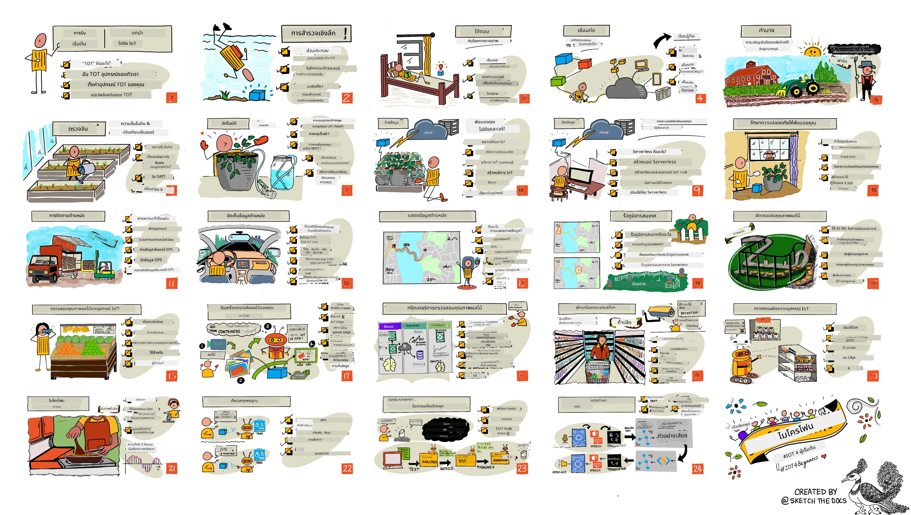

[](https://github.com/microsoft/IoT-For-Beginners/blob/master/LICENSE)
[](https://GitHub.com/microsoft/IoT-For-Beginners/graphs/contributors/)
[](https://GitHub.com/microsoft/IoT-For-Beginners/issues/)
[](https://GitHub.com/microsoft/IoT-For-Beginners/pulls/)
[](http://makeapullrequest.com)

[](https://GitHub.com/microsoft/IoT-For-Beginners/watchers/)
[](https://GitHub.com/microsoft/IoT-For-Beginners/network/)
[](https://GitHub.com/microsoft/IoT-For-Beginners/stargazers/)

### เข้าร่วมชุมชน Azure AI Foundry

หากคุณติดขัดหรือมีคำถามเกี่ยวกับการสร้างแอปพลิเคชัน AI เข้าร่วมกับผู้เรียนและนักพัฒนาที่มีประสบการณ์ในการอภิปรายเกี่ยวกับ MCP นี่คือชุมชนที่สนับสนุนซึ่งยินดีต้อนรับคำถามและแบ่งปันความรู้กันอย่างอิสระ

[](https://discord.gg/nTYy5BXMWG)

หากคุณมีคำติชมเกี่ยวกับผลิตภัณฑ์หรือต้องการรายงานข้อผิดพลาดขณะสร้างโปรดเข้าเยี่ยมชม:

[](https://aka.ms/foundry/forum)

ทำตามขั้นตอนเหล่านี้เพื่อเริ่มต้นใช้แหล่งข้อมูลเหล่านี้:
1. **Fork ที่เก็บข้อมูล**: คลิก [](https://GitHub.com/microsoft/IoT-For-Beginners/fork)
2. **โคลนที่เก็บข้อมูล**:   `git clone https://github.com/microsoft/IoT-For-Beginners.git`
3. [**เข้าร่วม Microsot Foundry Discord และพบปะผู้เชี่ยวชาญและนักพัฒนาร่วมกัน**](https://discord.com/invite/ByRwuEEgH4)


### 🌐 รองรับหลายภาษา

#### รองรับผ่าน GitHub Action (อัตโนมัติ & อัปเดตเสมอ)

<!-- CO-OP TRANSLATOR LANGUAGES TABLE START -->
[อาหรับ](../ar/README.md) | [เบงกาลี](../bn/README.md) | [บัลแกเรีย](../bg/README.md) | [พม่า (เมียนมา)](../my/README.md) | [จีน (ตัวย่อ)](../zh-CN/README.md) | [จีน (ดั้งเดิม, ฮ่องกง)](../zh-HK/README.md) | [จีน (ดั้งเดิม, มาเก๊า)](../zh-MO/README.md) | [จีน (ดั้งเดิม, ไต้หวัน)](../zh-TW/README.md) | [โครเอเชีย](../hr/README.md) | [เช็ก](../cs/README.md) | [เดนมาร์ก](../da/README.md) | [ดัตช์](../nl/README.md) | [เอสโตเนีย](../et/README.md) | [ฟินแลนด์](../fi/README.md) | [ฝรั่งเศส](../fr/README.md) | [เยอรมัน](../de/README.md) | [กรีก](../el/README.md) | [ฮิบรู](../he/README.md) | [ฮินดี](../hi/README.md) | [ฮังการี](../hu/README.md) | [อินโดนีเซีย](../id/README.md) | [อิตาลี](../it/README.md) | [ญี่ปุ่น](../ja/README.md) | [กันนาดา](../kn/README.md) | [เขมร](../km/README.md) | [เกาหลี](../ko/README.md) | [ลิทัวเนีย](../lt/README.md) | [มาเลย์](../ms/README.md) | [มาลายาลัม](../ml/README.md) | [มราธี](../mr/README.md) | [เนปาล](../ne/README.md) | [ไนจีเรีย พิดจิน](../pcm/README.md) | [นอร์เวย์](../no/README.md) | [เปอร์เซีย (ฟาร์ซี)](../fa/README.md) | [โปแลนด์](../pl/README.md) | [โปรตุเกส (บราซิล)](../pt-BR/README.md) | [โปรตุเกส (โปรตุเกส)](../pt-PT/README.md) | [ปัญจาบี (กุรมุขี)](../pa/README.md) | [โรมาเนีย](../ro/README.md) | [รัสเซีย](../ru/README.md) | [เซอร์เบีย (ซีริลลิค)](../sr/README.md) | [สโลวัก](../sk/README.md) | [สโลวีเนีย](../sl/README.md) | [สเปน](../es/README.md) | [สวาฮิลี](../sw/README.md) | [สวีเดน](../sv/README.md) | [ตากาล็อก (ฟิลิปปินส์)](../tl/README.md) | [ทมิฬ](../ta/README.md) | [เทลูกู](../te/README.md) | [ไทย](./README.md) | [ตุรกี](../tr/README.md) | [ยูเครน](../uk/README.md) | [อูรดู](../ur/README.md) | [เวียดนาม](../vi/README.md)

> **ต้องการโคลนแบบโลคอล?**
>
> ที่เก็บนี้รวมการแปลกว่า 50 ภาษา ซึ่งเพิ่มขนาดการดาวน์โหลดอย่างมาก หากต้องการโคลนโดยไม่รวมการแปล ให้ใช้ sparse checkout:
>
> **Bash / macOS / Linux:**
> ```bash
> git clone --filter=blob:none --sparse https://github.com/microsoft/IoT-For-Beginners.git
> cd IoT-For-Beginners
> git sparse-checkout set --no-cone '/*' '!translations' '!translated_images'
> ```
>
> **CMD (Windows):**
> ```cmd
> git clone --filter=blob:none --sparse https://github.com/microsoft/IoT-For-Beginners.git
> cd IoT-For-Beginners
> git sparse-checkout set --no-cone "/*" "!translations" "!translated_images"
> ```
>
> สิ่งนี้ช่วยให้คุณได้ทุกอย่างที่จำเป็นสำหรับเรียนจบหลักสูตรด้วยการดาวน์โหลดที่รวดเร็วขึ้นมาก
<!-- CO-OP TRANSLATOR LANGUAGES TABLE END -->

# IoT สำหรับผู้เริ่มต้น – หลักสูตร

Azure Cloud Advocates ที่ Microsoft ยินดีนำเสนอหลักสูตร 12 สัปดาห์ 24 บทเรียนเกี่ยวกับพื้นฐานของ IoT แต่ละบทเรียนมีแบบทดสอบก่อนและหลังเรียน คำแนะนำเป็นลายลักษณ์อักษรเพื่อทำบทเรียนให้เสร็จสมบูรณ์ โซลูชัน งานมอบหมาย และอื่น ๆ การเรียนรู้โดยเน้นโครงการช่วยให้คุณเรียนรู้ขณะสร้าง ซึ่งเป็นวิธีที่พิสูจน์แล้วว่าสามารถทำให้ทักษะใหม่ติดตัวได้

โครงการเหล่านี้ครอบคลุมเส้นทางของอาหารตั้งแต่ฟาร์มถึงโต๊ะอาหาร ซึ่งรวมถึงการทำฟาร์ม การขนส่ง การผลิต การค้าปลีก และผู้บริโภค — ทั้งหมดนี้เป็นอุตสาหกรรมยอดนิยมสำหรับอุปกรณ์ IoT



> ภาพสเกตช์โดย [Nitya Narasimhan](https://github.com/nitya) คลิกภาพเพื่อดูขนาดใหญ่ขึ้น

**ขอขอบคุณผู้เขียนของเราอย่างจริงใจ [Jen Fox](https://github.com/jenfoxbot), [Jen Looper](https://github.com/jlooper), [Jim Bennett](https://github.com/jimbobbennett) และศิลปินสเกตช์โน้ต [Nitya Narasimhan](https://github.com/nitya)**

**ขอขอบคุณทีม [Microsoft Learn Student Ambassadors](https://studentambassadors.microsoft.com?WT.mc_id=academic-17441-jabenn) ที่ช่วยตรวจทานและแปลหลักสูตรนี้ – [Aditya Garg](https://github.com/AdityaGarg00), [Anurag Sharma](https://github.com/Anurag-0-1-A), [Arpita Das](https://github.com/Arpiiitaaa), [Aryan Jain](https://www.linkedin.com/in/aryan-jain-47a4a1145/), [Bhavesh Suneja](https://github.com/EliteWarrior315), [Faith Hunja](https://faithhunja.github.io/), [Lateefah Bello](https://www.linkedin.com/in/lateefah-bello/), [Manvi Jha](https://github.com/Severus-Matthew), [Mireille Tan](https://www.linkedin.com/in/mireille-tan-a4834819a/), [Mohammad Iftekher (Iftu) Ebne Jalal](https://github.com/Iftu119), [Mohammad Zulfikar](https://github.com/mohzulfikar), [Priyanshu Srivastav](https://www.linkedin.com/in/priyanshu-srivastav-b067241ba), [Thanmai Gowducheruvu](https://github.com/innovation-platform), และ [Zina Kamel](https://www.linkedin.com/in/zina-kamel/)**

พบกับทีมงาน!

[](https://youtu.be/-wippUJRi5k)

**ภาพเคลื่อนไหวโดย** [Mohit Jaisal](https://linkedin.com/in/mohitjaisal)

> 🎥 คลิกภาพด้านบนเพื่อชมวิดีโอเกี่ยวกับโครงการนี้!

> **สำหรับครูผู้สอน** เราได้รวม [คำแนะนำบางส่วน](for-teachers.md) สำหรับการใช้หลักสูตรนี้ไว้ด้วยกัน หากคุณต้องการสร้างบทเรียนของตัวเอง เรายังมี [เทมเพลตบทเรียน](lesson-template/README.md) ให้ด้วย

> **[นักเรียน](https://aka.ms/student-page)** เพื่อใช้หลักสูตรนี้ด้วยตัวเอง ให้ทำการ fork รีโปทั้งหมดและทำแบบฝึกหัดด้วยตนเอง เริ่มต้นด้วยแบบทดสอบก่อนบรรยาย อ่านบรรยาย และทำกิจกรรมที่เหลือต่อ พยายามสร้างโครงการด้วยความเข้าใจบทเรียน แทนที่จะคัดลอกโค้ดโซลูชัน แต่โค้ดเหล่านั้นมีให้ในโฟลเดอร์ /solutions ในแต่ละบทเรียนที่มุ่งเน้นโครงการ อีกหนึ่งแนวคิดคือการตั้งกลุ่มเรียนกับเพื่อนและเรียนเนื้อหาร่วมกัน สำหรับศึกษาต่อ เราแนะนำ [Microsoft Learn](https://docs.microsoft.com/users/jimbobbennett/collections/ke2ehd351jopwr?WT.mc_id=academic-17441-jabenn)

สำหรับภาพรวมวิดีโอของหลักสูตรนี้ ดูวิดีโอนี้:

[](https://youtube.com/watch?v=bccEMm8gRuc "Promo video")

> 🎥 คลิกภาพด้านบนเพื่อชมวิดีโอเกี่ยวกับโครงการนี้!

## วิธีการสอน

เราเลือกแนวทางการสอนสองประการในการสร้างหลักสูตรนี้: การรับรองว่าหลักสูตรนี้มีลักษณะมุ่งเน้นโครงการ และมีแบบทดสอบบ่อยๆ เมื่อจบชุดนี้ นักเรียนจะได้สร้างระบบตรวจสอบและรดน้ำพืช ระบบติดตามยานพาหนะ ระบบสมาร์ทแฟกทอรีเพื่อติดตามและตรวจสอบอาหาร และตัวตั้งเวลาทำอาหารที่ควบคุมด้วยเสียง และเรียนรู้พื้นฐานของ Internet of Things รวมถึงวิธีเขียนโค้ดอุปกรณ์ การเชื่อมต่อกับคลาวด์ การวิเคราะห์เทเลเมทรี และการรัน AI ที่ขอบระบบ

โดยการแน่ใจว่าเนื้อหาสอดคล้องกับโครงการ กระบวนการจะน่าสนใจกว่าสำหรับนักเรียนและช่วยเพิ่มการจดจำแนวคิด

นอกจากนี้ แบบทดสอบแบบไม่มีความกดดันก่อนเรียนจะตั้งความตั้งใจของนักเรียนในการเรียนรู้หัวข้อ ขณะที่แบบทดสอบหลังเรียนจะช่วยให้การจดจำมากขึ้น หลักสูตรนี้ออกแบบมาให้ยืดหยุ่นและสนุกสนาน และสามารถเรียนได้ทั้งหลักสูตรหรือบางส่วน โครงการเริ่มต้นเล็กแล้วซับซ้อนขึ้นเรื่อยๆ จนจบใน 12 สัปดาห์

แต่ละโครงการตั้งอยู่บนฮาร์ดแวร์โลกจริงที่นักเรียนและผู้ชื่นชอบสามารถเข้าถึงได้ โครงการแต่ละชิ้นจะทำความเข้าใจโดเมนของโครงการนั้นโดยเฉพาะ ให้ความรู้พื้นฐานที่เกี่ยวข้อง การเป็นนักพัฒนาที่ประสบความสำเร็จช่วยให้เข้าใจโดเมนที่แก้ไขปัญหาอยู่ ความรู้พื้นฐานนี้ช่วยให้นักเรียนคิดเกี่ยวกับโซลูชันและการเรียนรู้ของเขาในบริบทของปัญหาในโลกจริงที่จะถูกถามในฐานะนักพัฒนา IoT นักเรียนจะเรียนรู้ 'เหตุผล' ของโซลูชันที่พวกเขาสร้าง และได้รับความเข้าใจผู้ใช้งานปลายทาง

## ฮาร์ดแวร์
เรามีตัวเลือกฮาร์ดแวร์ IoT สองแบบสำหรับใช้ในโครงการ ขึ้นอยู่กับความชอบส่วนบุคคล ความรู้หรือความชอบในภาษาโปรแกรม เป้าหมายการเรียนรู้ และความพร้อมใช้งาน เรายังมีเวอร์ชัน 'ฮาร์ดแวร์เสมือน' สำหรับผู้ที่ไม่มีฮาร์ดแวร์ หรืออยากเรียนรู้เพิ่มเติมก่อนตัดสินใจซื้อ คุณสามารถอ่านเพิ่มเติมและค้นหารายการ 'ช็อปปิงลิสต์' ได้ที่ [hardware page](./hardware.md) รวมถึงลิงก์สำหรับซื้อชุดคิทครบชุดจากเพื่อนของเราที่ Seeed Studio

> 💁 ค้นหาคู่มือ [Code of Conduct](CODE_OF_CONDUCT.md), [Contributing](CONTRIBUTING.md) และ [Translations](..) ของเรา เรายินดีรับฟังความคิดเห็นที่สร้างสรรค์จากคุณ!
>
> 🔧 มีปัญหาใช่ไหม? ตรวจสอบ [Troubleshooting Guide](TROUBLESHOOTING.md) ของเราเพื่อหาวิธีแก้ไขปัญหาทั่วไป

## แต่ละบทเรียนประกอบด้วย:

- บันทึกภาพร่าง
- วิดีโอเสริมแบบไม่บังคับ
- แบบทดสอบวอร์มอัพก่อนบทเรียน
- บทเรียนแบบเขียน
- สำหรับบทเรียนที่เน้นโครงการ มีคำแนะนำทีละขั้นตอนในการสร้างโครงการ
- การตรวจสอบความรู้
- ความท้าทาย
- การอ่านเสริม
- การบ้าน
- [แบบทดสอบหลังบทเรียน](https://ff-quizzes.netlify.app/en/)

> **หมายเหตุเกี่ยวกับแบบทดสอบ**: แบบทดสอบทั้งหมดบรรจุอยู่ในโฟลเดอร์ quiz-app มีทั้งหมด 48 แบบทดสอบ แต่ละแบบมีสามคำถาม ลิงก์จากภายในบทเรียน แต่แอปแบบทดสอบสามารถรันบนเครื่องท้องถิ่นหรือปรับใช้บน Azure ได้ ให้ทำตามคำแนะนำในโฟลเดอร์ `quiz-app` แบบทดสอบกำลังอยู่ในระหว่างการแปลภาษาทีละน้อย

## บทเรียน

|       |              ชื่อโครงการ              |                       แนวคิดที่สอน                       | วัตถุประสงค์การเรียนรู้                                                                                                                                                 |                                                        บทเรียนที่ลิงก์                                                         |
| :---: | :------------------------------------: | :---------------------------------------------------------: | ------------------------------------------------------------------------------------------------------------------------------------------------------------------- | :--------------------------------------------------------------------------------------------------------------------------: |
|  01   | [เริ่มต้น](./1-getting-started/README.md) |                     แนะนำ IoT                     | เรียนรู้หลักการพื้นฐานของ IoT และส่วนประกอบพื้นฐานของโซลูชัน IoT เช่น เซ็นเซอร์และบริการคลาวด์ ขณะตั้งค่าอุปกรณ์ IoT เครื่องแรกของคุณ |                      [แนะนำ IoT](./1-getting-started/lessons/1-introduction-to-iot/README.md)                      |
|  02   | [เริ่มต้น](./1-getting-started/README.md) |                   เจาะลึก IoT                     | เรียนรู้เพิ่มเติมเกี่ยวกับส่วนประกอบของระบบ IoT รวมถึงไมโครคอนโทรลเลอร์และคอมพิวเตอร์บอร์ดเดี่ยว                                                            |                        [เจาะลึก IoT](./1-getting-started/lessons/2-deeper-dive/README.md)                         |
|  03   | [เริ่มต้น](./1-getting-started/README.md) | โต้ตอบกับโลกทางกายภาพด้วยเซ็นเซอร์และแอคชูเอเตอร์ | เรียนรู้เกี่ยวกับเซ็นเซอร์เพื่อเก็บข้อมูลจากโลกทางกายภาพ และแอคชูเอเตอร์เพื่อส่งข้อมูลตอบกลับ ในขณะสร้างไฟคืน                                                     | [โต้ตอบกับโลกทางกายภาพด้วยเซ็นเซอร์และแอคชูเอเตอร์](./1-getting-started/lessons/3-sensors-and-actuators/README.md) |
|  04   | [เริ่มต้น](./1-getting-started/README.md) |             เชื่อมต่ออุปกรณ์กับอินเทอร์เน็ต           | เรียนรู้วิธีเชื่อมต่ออุปกรณ์ IoT เข้ากับอินเทอร์เน็ตเพื่อส่งและรับข้อความโดยเชื่อมต่อไฟคืนของคุณกับ MQTT broker                                               |               [เชื่อมต่ออุปกรณ์กับอินเทอร์เน็ต](./1-getting-started/lessons/4-connect-internet/README.md)                |
|  05   |            [ฟาร์ม](./2-farm/README.md)            |                    ทำนายการเจริญเติบโตของพืช         | เรียนรู้วิธีทำนายการเจริญเติบโตของพืชโดยใช้ข้อมูลอุณหภูมิที่เก็บรวบรวมโดยอุปกรณ์ IoT                                                                    |                          [ทำนายการเจริญเติบโตของพืช](./2-farm/lessons/1-predict-plant-growth/README.md)                           |
|  06   |            [ฟาร์ม](./2-farm/README.md)            |                   ตรวจจับความชื้นในดิน                 | เรียนรู้วิธีตรวจจับความชื้นในดินและปรับเทียบเซ็นเซอร์วัดความชื้นในดิน                                                                                         |                          [ตรวจจับความชื้นในดิน](./2-farm/lessons/2-detect-soil-moisture/README.md)                           |
|  07   |            [ฟาร์ม](./2-farm/README.md)            |                  การรดน้ำพืชอัตโนมัติ                   | เรียนรู้วิธีทำให้น้ำพืชและตั้งเวลาการรดน้ำโดยอัตโนมัติด้วยรีเลย์และ MQTT                                                                                          |                      [การรดน้ำพืชอัตโนมัติ](./2-farm/lessons/3-automated-plant-watering/README.md)                       |
|  08   |            [ฟาร์ม](./2-farm/README.md)            |               ย้ายพืชของคุณไปยังคลาวด์                 | เรียนรู้เกี่ยวกับคลาวด์และบริการ IoT ที่โฮสต์บนคลาวด์ และวิธีเชื่อมต่อพืชของคุณกับบริการเหล่านี้ แทนการใช้ MQTT public broker                                      |               [ย้ายพืชของคุณไปยังคลาวด์](./2-farm/lessons/4-migrate-your-plant-to-the-cloud/README.md)                |
|  09   |            [ฟาร์ม](./2-farm/README.md)            |         ย้ายตรรกะแอปพลิเคชันไปยังคลาวด์                | เรียนรู้วิธีเขียนตรรกะแอปพลิเคชันในคลาวด์ที่ตอบสนองต่อข้อความจาก IoT                                                                                       |         [ย้ายตรรกะแอปพลิเคชันไปยังคลาวด์](./2-farm/lessons/5-migrate-application-to-the-cloud/README.md)         |
|  10   |            [ฟาร์ม](./2-farm/README.md)            |                   รักษาความปลอดภัยให้พืชของคุณ         | เรียนรู้เกี่ยวกับความปลอดภัยใน IoT และวิธีรักษาความปลอดภัยให้พืชของคุณด้วยกุญแจและใบรับรอง                                                                     |                        [รักษาความปลอดภัยให้พืชของคุณ](./2-farm/lessons/6-keep-your-plant-secure/README.md)                         |
|  11   |       [การขนส่ง](./3-transport/README.md)       |                      การติดตามตำแหน่ง                      | เรียนรู้เกี่ยวกับการติดตามตำแหน่งด้วย GPS สำหรับอุปกรณ์ IoT                                                                                                    |                           [การติดตามตำแหน่ง](./3-transport/lessons/1-location-tracking/README.md)                           |
|  12   |       [การขนส่ง](./3-transport/README.md)       |                     จัดเก็บข้อมูลตำแหน่ง                   | เรียนรู้วิธีจัดเก็บข้อมูล IoT เพื่อใช้ในการแสดงผลหรือวิเคราะห์ในภายหลัง                                                                                        |                         [จัดเก็บข้อมูลตำแหน่ง](./3-transport/lessons/2-store-location-data/README.md)                         |
|  13   |       [การขนส่ง](./3-transport/README.md)       |                   แสดงผลข้อมูลตำแหน่ง                      | เรียนรู้เกี่ยวกับการแสดงข้อมูลตำแหน่งบนแผนที่ และวิธีที่แผนที่แทนโลก 3 มิติจริงในสองมิติ                                                                        |                     [แสดงผลข้อมูลตำแหน่ง](./3-transport/lessons/3-visualize-location-data/README.md)                     |
|  14   |       [การขนส่ง](./3-transport/README.md)       |                          เขตพื้นที่ทางภูมิศาสตร์            | เรียนรู้เกี่ยวกับเขตพื้นที่ทางภูมิศาสตร์ และวิธีใช้เขตเหล่านี้แจ้งเตือนเมื่อยานพาหนะในห่วงโซ่อุปทานเข้าใกล้จุดหมาย                                             |                                   [เขตพื้นที่ทางภูมิศาสตร์](./3-transport/lessons/4-geofences/README.md)                                   |
|  15   |   [การผลิต](./4-manufacturing/README.md)   |               ฝึกอบรมตัวตรวจจับคุณภาพผลไม้                 | เรียนรู้เกี่ยวกับการฝึกอบรมตัวจำแนกรูปภาพในคลาวด์เพื่อประเมินคุณภาพของผลไม้                                                                                   |                 [ฝึกอบรมตัวตรวจจับคุณภาพผลไม้](./4-manufacturing/lessons/1-train-fruit-detector/README.md)                 |
|  16   |   [การผลิต](./4-manufacturing/README.md)   |           ตรวจสอบคุณภาพผลไม้จากอุปกรณ์ IoT                | เรียนรู้เกี่ยวกับการใช้ตัวตรวจจับคุณภาพผลไม้จากอุปกรณ์ IoT                                                                                                     |           [ตรวจสอบคุณภาพผลไม้จากอุปกรณ์ IoT](./4-manufacturing/lessons/2-check-fruit-from-device/README.md)            |
|  17   |   [การผลิต](./4-manufacturing/README.md)   |             รันตัวตรวจจับผลไม้บน edge                       | เรียนรู้เกี่ยวกับการรันตัวตรวจจับผลไม้ของคุณบนอุปกรณ์ IoT ที่ edge                                                                                               |             [รันตัวตรวจจับผลไม้บน edge](./4-manufacturing/lessons/3-run-fruit-detector-edge/README.md)             |
|  18   |   [การผลิต](./4-manufacturing/README.md)   |        ทริกเกอร์การตรวจจับคุณภาพผลไม้จากเซ็นเซอร์          | เรียนรู้เกี่ยวกับการทริกเกอร์การตรวจจับคุณภาพผลไม้จากเซ็นเซอร์                                                                                                  |        [ทริกเกอร์การตรวจจับคุณภาพผลไม้จากเซ็นเซอร์](./4-manufacturing/lessons/4-trigger-fruit-detector/README.md)         |
|  19   |          [ค้าปลีก](./5-retail/README.md)          |                   ฝึกตัวตรวจจับสต็อก                        | เรียนรู้วิธีใช้การตรวจจับวัตถุเพื่อฝึกตัวตรวจจับสต็อกสำหรับนับสินค้าคงคลังในร้าน                                                                               |                        [ฝึกตัวตรวจจับสต็อก](./5-retail/lessons/1-train-stock-detector/README.md)                         |
|  20   |          [ค้าปลีก](./5-retail/README.md)          |               ตรวจสอบสต็อกจากอุปกรณ์ IoT                    | เรียนรู้วิธีตรวจสอบสต็อกจากอุปกรณ์ IoT โดยใช้โมเดลตรวจจับวัตถุ                                                                                                |                     [ตรวจสอบสต็อกจากอุปกรณ์ IoT](./5-retail/lessons/2-check-stock-device/README.md)                      |
|  21   |        [ผู้บริโภค](./6-consumer/README.md)        |             รับรู้เสียงพูดด้วยอุปกรณ์ IoT                   | เรียนรู้วิธีรับรู้เสียงพูดจากอุปกรณ์ IoT เพื่อสร้างตัวจับเวลาที่ชาญฉลาด                                                                                         |                  [รับรู้เสียงพูดด้วยอุปกรณ์ IoT](./6-consumer/lessons/1-speech-recognition/README.md)                  |
|  22   |        [ผู้บริโภค](./6-consumer/README.md)        |                     เข้าใจภาษา                               | เรียนรู้วิธีเข้าใจประโยคที่พูดกับอุปกรณ์ IoT                                                                                                                   |                        [เข้าใจภาษา](./6-consumer/lessons/2-language-understanding/README.md)                        |
|  23   |        [ผู้บริโภค](./6-consumer/README.md)        |           ตั้งตัวจับเวลาและให้ฟีดแบ็คลักษณะเสียง            | เรียนรู้วิธีตั้งตัวจับเวลาบนอุปกรณ์ IoT และให้ฟีดแบ็คด้วยเสียงเมื่อเริ่มต้นและเมื่อเวลาหมด                                                                    |                 [ตั้งตัวจับเวลาและให้ฟีดแบ็คลักษณะเสียง](./6-consumer/lessons/3-spoken-feedback/README.md)                  |
|  24   |        [ผู้บริโภค](./6-consumer/README.md)        |                 รองรับหลายภาษา                                | เรียนรู้วิธีรองรับหลายภาษา ทั้งการพูดกับอุปกรณ์และการตอบกลับจากตัวจับเวลาที่ชาญฉลาด                                                                           |                   [รองรับหลายภาษา](./6-consumer/lessons/4-multiple-language-support/README.md)                   |

## การเข้าถึงแบบออฟไลน์

คุณสามารถรันเอกสารนี้แบบออฟไลน์โดยใช้ [Docsify](https://docsify.js.org/#/) ทำการก๊อกรายการนี้ [ติดตั้ง Docsify](https://docsify.js.org/#/quickstart) บนเครื่องของคุณ จากนั้นไปที่โฟลเดอร์รากของรายการนี้ พิมพ์คำสั่ง `docsify serve` เว็บไซต์จะให้บริการบนพอร์ต 3000 ที่ localhost ของคุณ: `localhost:3000`

## แบบทดสอบ

ขอบคุณชุมชนที่เป็นเจ้าภาพจัดแบบทดสอบโต้ตอบซึ่งทดสอบความรู้ของคุณในแต่ละบท คุณสามารถทดสอบความรู้ได้ [ที่นี่](https://ff-quizzes.netlify.app/en/)

### PDF

คุณสามารถสร้าง PDF ของเนื้อหานี้เพื่อการเข้าถึงแบบออฟไลน์หากต้องการ ในการทำเช่นนี้ ตรวจสอบให้แน่ใจว่าคุณได้ [ติดตั้ง npm](https://docs.npmjs.com/downloading-and-installing-node-js-and-npm) แล้วรันคำสั่งต่อไปนี้ในโฟลเดอร์รากของรายการนี้:

```sh
npm i
npm run convert
```

### สไลด์

มีชุดสไลด์สำหรับบทเรียนบางบทในโฟลเดอร์ [slides](../../slides)


## หลักสูตรอื่นๆ

ทีมของเราผลิตหลักสูตรอื่นๆ! เช็คดูได้ที่:

<!-- CO-OP TRANSLATOR OTHER COURSES START -->
### LangChain
[](https://aka.ms/langchain4j-for-beginners)
[](https://aka.ms/langchainjs-for-beginners?WT.mc_id=m365-94501-dwahlin)
[](https://github.com/microsoft/langchain-for-beginners?WT.mc_id=m365-94501-dwahlin)
---

### Azure / Edge / MCP / Agents
[](https://github.com/microsoft/AZD-for-beginners?WT.mc_id=academic-105485-koreyst)
[](https://github.com/microsoft/edgeai-for-beginners?WT.mc_id=academic-105485-koreyst)
[](https://github.com/microsoft/mcp-for-beginners?WT.mc_id=academic-105485-koreyst)
[](https://github.com/microsoft/ai-agents-for-beginners?WT.mc_id=academic-105485-koreyst)

---
 
### ชุดการเรียนรู้ Generative AI
[](https://github.com/microsoft/generative-ai-for-beginners?WT.mc_id=academic-105485-koreyst)
[-9333EA?style=for-the-badge&labelColor=E5E7EB&color=9333EA)](https://github.com/microsoft/Generative-AI-for-beginners-dotnet?WT.mc_id=academic-105485-koreyst)
[-C084FC?style=for-the-badge&labelColor=E5E7EB&color=C084FC)](https://github.com/microsoft/generative-ai-for-beginners-java?WT.mc_id=academic-105485-koreyst)
[-E879F9?style=for-the-badge&labelColor=E5E7EB&color=E879F9)](https://github.com/microsoft/generative-ai-with-javascript?WT.mc_id=academic-105485-koreyst)

---
 
### การเรียนรู้หลัก
[](https://aka.ms/ml-beginners?WT.mc_id=academic-105485-koreyst)
[](https://aka.ms/datascience-beginners?WT.mc_id=academic-105485-koreyst)
[](https://aka.ms/ai-beginners?WT.mc_id=academic-105485-koreyst)
[](https://github.com/microsoft/Security-101?WT.mc_id=academic-96948-sayoung)
[](https://aka.ms/webdev-beginners?WT.mc_id=academic-105485-koreyst)
[](https://aka.ms/iot-beginners?WT.mc_id=academic-105485-koreyst)
[](https://github.com/microsoft/xr-development-for-beginners?WT.mc_id=academic-105485-koreyst)

---
 
### ชุด Copilot
[](https://aka.ms/GitHubCopilotAI?WT.mc_id=academic-105485-koreyst)
[](https://github.com/microsoft/mastering-github-copilot-for-dotnet-csharp-developers?WT.mc_id=academic-105485-koreyst)
[](https://github.com/microsoft/CopilotAdventures?WT.mc_id=academic-105485-koreyst)
<!-- CO-OP TRANSLATOR OTHER COURSES END -->

## การให้เครดิตภาพ

คุณสามารถดูเครดิตทั้งหมดของภาพที่ใช้ในหลักสูตรนี้ตามที่ต้องการได้ใน [การให้เครดิต](./attributions.md)

---

<!-- CO-OP TRANSLATOR DISCLAIMER START -->
**ข้อจำกัดความรับผิด**:  
เอกสารนี้ได้รับการแปลโดยใช้บริการแปลภาษาด้วย AI [Co-op Translator](https://github.com/Azure/co-op-translator) แม้ว่าเราจะพยายามให้ความถูกต้องสูงสุด แต่โปรดทราบว่าการแปลอัตโนมัติอาจมีข้อผิดพลาดหรือความไม่ถูกต้อง เอกสารต้นฉบับในภาษาดั้งเดิมถือเป็นแหล่งข้อมูลที่เชื่อถือได้ สำหรับข้อมูลที่สำคัญ ขอแนะนำให้ใช้การแปลโดยมืออาชีพที่เป็นมนุษย์ เราไม่รับผิดชอบต่อความเข้าใจผิดหรือการตีความผิดที่เกิดขึ้นจากการใช้การแปลนี้
<!-- CO-OP TRANSLATOR DISCLAIMER END -->