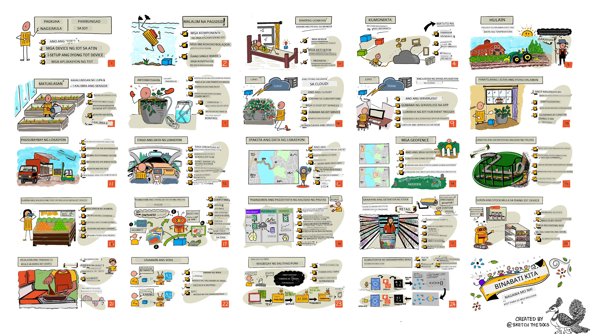

<!--
CO_OP_TRANSLATOR_METADATA:
{
  "original_hash": "6c354ec3487e4f6cfafbe44557996cd9",
  "translation_date": "2026-01-06T10:02:13+00:00",
  "source_file": "README.md",
  "language_code": "tl"
}
-->
[](https://github.com/microsoft/IoT-For-Beginners/blob/master/LICENSE)
[](https://GitHub.com/microsoft/IoT-For-Beginners/graphs/contributors/)
[](https://GitHub.com/microsoft/IoT-For-Beginners/issues/)
[](https://GitHub.com/microsoft/IoT-For-Beginners/pulls/)
[](http://makeapullrequest.com)

[](https://GitHub.com/microsoft/IoT-For-Beginners/watchers/)
[](https://GitHub.com/microsoft/IoT-For-Beginners/network/)
[](https://GitHub.com/microsoft/IoT-For-Beginners/stargazers/)

### Sumali sa Azure AI Foundry Community

Kung ikaw ay nahirapan o may mga katanungan tungkol sa paggawa ng AI apps. Sumali sa kapwa nag-aaral at mga batikang developer sa mga talakayan tungkol sa MCP. Ito ay isang suportadong komunidad kung saan ang mga tanong ay malugod na tinatanggap at ang kaalaman ay malayang naibabahagi.

[](https://discord.gg/nTYy5BXMWG)

Kung may feedback tungkol sa produkto o mga error habang bumubuo, bisitahin:

[](https://aka.ms/foundry/forum)

Sundin ang mga hakbang na ito upang masimulan ang paggamit ng mga resources na ito:
1. **I-Fork ang Repository**: Pindutin ang [](https://GitHub.com/microsoft/IoT-For-Beginners/fork)
2. **I-Clone ang Repository**:   `git clone https://github.com/microsoft/IoT-For-Beginners.git`
3. [**Sumali sa Microsoft Foundry Discord at makilala ang mga eksperto at kapwa developer**](https://discord.com/invite/ByRwuEEgH4)


### 🌐 Suporta sa Maramihang Wika

#### Suportado sa pamamagitan ng GitHub Action (Automatiko at Laging Napapanahon)

<!-- CO-OP TRANSLATOR LANGUAGES TABLE START -->
[Arabic](../ar/README.md) | [Bengali](../bn/README.md) | [Bulgarian](../bg/README.md) | [Burmese (Myanmar)](../my/README.md) | [Chinese (Simplified)](../zh/README.md) | [Chinese (Traditional, Hong Kong)](../hk/README.md) | [Chinese (Traditional, Macau)](../mo/README.md) | [Chinese (Traditional, Taiwan)](../tw/README.md) | [Croatian](../hr/README.md) | [Czech](../cs/README.md) | [Danish](../da/README.md) | [Dutch](../nl/README.md) | [Estonian](../et/README.md) | [Finnish](../fi/README.md) | [French](../fr/README.md) | [German](../de/README.md) | [Greek](../el/README.md) | [Hebrew](../he/README.md) | [Hindi](../hi/README.md) | [Hungarian](../hu/README.md) | [Indonesian](../id/README.md) | [Italian](../it/README.md) | [Japanese](../ja/README.md) | [Kannada](../kn/README.md) | [Korean](../ko/README.md) | [Lithuanian](../lt/README.md) | [Malay](../ms/README.md) | [Malayalam](../ml/README.md) | [Marathi](../mr/README.md) | [Nepali](../ne/README.md) | [Nigerian Pidgin](../pcm/README.md) | [Norwegian](../no/README.md) | [Persian (Farsi)](../fa/README.md) | [Polish](../pl/README.md) | [Portuguese (Brazil)](../br/README.md) | [Portuguese (Portugal)](../pt/README.md) | [Punjabi (Gurmukhi)](../pa/README.md) | [Romanian](../ro/README.md) | [Russian](../ru/README.md) | [Serbian (Cyrillic)](../sr/README.md) | [Slovak](../sk/README.md) | [Slovenian](../sl/README.md) | [Spanish](../es/README.md) | [Swahili](../sw/README.md) | [Swedish](../sv/README.md) | [Tagalog (Filipino)](./README.md) | [Tamil](../ta/README.md) | [Telugu](../te/README.md) | [Thai](../th/README.md) | [Turkish](../tr/README.md) | [Ukrainian](../uk/README.md) | [Urdu](../ur/README.md) | [Vietnamese](../vi/README.md)

> **Mas Gusto Mong Mag-Clone Lokaly?**

> Ang repositoryong ito ay may kasamang 50+ na pagsasalin ng wika na makabuluhang nagpapalaki ng laki ng pag-download. Para mag-clone nang walang mga pagsasalin, gamitin ang sparse checkout:
> ```bash
> git clone --filter=blob:none --sparse https://github.com/microsoft/IoT-For-Beginners.git
> cd IoT-For-Beginners
> git sparse-checkout set --no-cone '/*' '!translations' '!translated_images'
> ```
> Bibigyan ka nito ng lahat ng kailangan mo upang matapos ang kurso nang mas mabilis ang pag-download.
<!-- CO-OP TRANSLATOR LANGUAGES TABLE END -->

# IoT para sa mga Nagsisimula - Isang Kurikulum

Ang mga Azure Cloud Advocates sa Microsoft ay natutuwa na mag-alok ng isang 12-linggong, 24-lesson na kurikulum tungkol sa mga batayang IoT. Bawat leksyon ay may pre- at post-lesson quizzes, nakasulat na mga tagubiling upang matapos ang leksyon, isang solusyon, isang takdang-aralin at marami pa. Ang aming project-based na pagtuturo ay nagpapahintulot sa iyo na matuto habang gumagawa, isang napatunayang paraan para matatag ang mga bagong kasanayan.

Saklaw ng mga proyekto ang paglalakbay ng pagkain mula sa bukid hanggang sa mesa. Kabilang dito ang pagsasaka, logistics, pagmamanupaktura, retail at consumer - lahat ng mga tanyag na industriya para sa mga IoT device.



> Sketchnote ni [Nitya Narasimhan](https://github.com/nitya). I-click ang imahe para sa mas malaking bersyon.

**Taos-pusong pasasalamat sa aming mga may-akda na sina [Jen Fox](https://github.com/jenfoxbot), [Jen Looper](https://github.com/jlooper), [Jim Bennett](https://github.com/jimbobbennett), at sa aming sketchnote artist na si [Nitya Narasimhan](https://github.com/nitya).**

**Salamat din sa aming koponan ng mga [Microsoft Learn Student Ambassadors](https://studentambassadors.microsoft.com?WT.mc_id=academic-17441-jabenn) na nagreview at nagsalin ng kurikulum na ito - [Aditya Garg](https://github.com/AdityaGarg00), [Anurag Sharma](https://github.com/Anurag-0-1-A), [Arpita Das](https://github.com/Arpiiitaaa), [Aryan Jain](https://www.linkedin.com/in/aryan-jain-47a4a1145/), [Bhavesh Suneja](https://github.com/EliteWarrior315), [Faith Hunja](https://faithhunja.github.io/), [Lateefah Bello](https://www.linkedin.com/in/lateefah-bello/), [Manvi Jha](https://github.com/Severus-Matthew), [Mireille Tan](https://www.linkedin.com/in/mireille-tan-a4834819a/), [Mohammad Iftekher (Iftu) Ebne Jalal](https://github.com/Iftu119), [Mohammad Zulfikar](https://github.com/mohzulfikar), [Priyanshu Srivastav](https://www.linkedin.com/in/priyanshu-srivastav-b067241ba), [Thanmai Gowducheruvu](https://github.com/innovation-platform), at [Zina Kamel](https://www.linkedin.com/in/zina-kamel/).**

Kilalanin ang koponan!

[](https://youtu.be/-wippUJRi5k)

**Gif ni** [Mohit Jaisal](https://linkedin.com/in/mohitjaisal)

> 🎥 I-click ang imahe sa itaas para sa video tungkol sa proyekto!

> **Mga Guro**, may [kasamang ilang mungkahi](for-teachers.md) kung paano gamitin ang kurikulum na ito. Kung nais mong lumikha ng sarili mong mga leksyon, may kasama rin kaming [lesson template](lesson-template/README.md).

> **[Mga Mag-aaral](https://aka.ms/student-page)**, upang magamit ang kurikulum na ito nang mag-isa, i-fork ang buong repo at tapusin ang mga gawain nang mag-isa, simula sa pre-lecture quiz, pagkatapos ay basahin ang lektura at tapusin ang natitirang mga aktibidad. Subukang lumikha ng mga proyekto sa pamamagitan ng pag-unawa sa mga leksyon sa halip na pagkopya ng solusyon code; gayunpaman, ang code na iyon ay makukuha sa mga /solutions folder sa bawat leksyon na nakatuon sa proyekto. Isa pang ideya ay magbuo ng study group kasama ang mga kaibigan at pag-aralan ang mga nilalaman nang magkakasama. Para sa karagdagang pag-aaral, inirerekomenda namin ang [Microsoft Learn](https://docs.microsoft.com/users/jimbobbennett/collections/ke2ehd351jopwr?WT.mc_id=academic-17441-jabenn).

Para sa isang video overview ng kursong ito, tingnan ang video na ito:

[](https://youtube.com/watch?v=bccEMm8gRuc "Promo video")

> 🎥 I-click ang imahe sa itaas para sa video tungkol sa proyekto!

## Pedagohiya

Pinili namin ang dalawang prinsipyo ng pagtuturo habang ginagawa ang kurikulum na ito: tiyakin na ito ay project-based at may kasamang madalas na mga pagsusulit. Sa pagtatapos ng seryeng ito, makakagawa ang mga estudyante ng isang plant monitoring at watering system, isang vehicle tracker, isang smart factory setup para subaybayan at suriin ang pagkain, at isang voice-controlled cooking timer, at matututunan nila ang mga batayan ng Internet of Things kabilang ang kung paano magsulat ng device code, kumonekta sa cloud, suriin ang telemetry at patakbuhin ang AI sa edge.

Sa pamamagitan ng pagtiyak na ang nilalaman ay naka-align sa mga proyekto, ang proseso ay nagiging mas kawili-wili para sa mga estudyante at mas mapapalalim ang pag-alala sa mga konsepto.

Bukod dito, ang low-stakes quiz bago ang klase ay nagtatakda ng intensyon ng estudyante sa pag-aaral ng isang paksa, habang ang pangalawang quiz pagkatapos ng klase ay nagsisiguro ng karagdagang pag-alala. Ang kurikulum na ito ay dinisenyo upang maging flexible at masaya at maaaring kunin nang buo o bahagi lamang. Ang mga proyekto ay nagsisimula nang maliit at unti-unting lumalalim hanggang sa katapusan ng 12-linggong siklo.

Bawat proyekto ay nakabatay sa totoong hardware na available sa mga estudyante at hobbyists. Tuwing proyekto ay tumitingin sa tiyak na larangan ng proyekto, nagbibigay ng kaugnay na kaalaman sa background. Para maging matagumpay na developer, nakakatulong ang pag-unawa sa domain kung saan ka nagsosolusyon ng mga problema, ang pagbibigay ng ganitong kaalaman sa background ay nagpapahintulot sa mga estudyante na pag-isipan ang kanilang mga IoT solution at mga natutunan sa konteksto ng uri ng totoong problema na maaaring hingin sa kanila na lutasin bilang isang IoT developer. Natututuhan ng mga estudyante ang 'bakit' ng mga solusyon na kanilang binubuo, at nagkakaroon ng pagpapahalaga sa end user.

## Hardware

Mayroon kaming dalawang pagpipilian ng IoT hardware na gagamitin para sa mga proyekto depende sa personal na kagustuhan, kaalaman sa programming language o mga layunin sa pagkatuto at availability. Nagbigay din kami ng 'virtual hardware' na bersyon para sa mga walang access sa hardware, o nais matuto nang higit pa bago mag-commit sa pagbili. Maaari kang magbasa nang higit pa at makakita ng 'shopping list' sa [hardware page](./hardware.md), kabilang ang mga link upang bumili ng kumpletong kits mula sa aming mga kaibigan sa Seeed Studio.
> 💁 Hanapin ang aming [Code of Conduct](CODE_OF_CONDUCT.md), [Contributing](CONTRIBUTING.md), at [Translation](TRANSLATIONS.md) na mga gabay. Tinatanggap namin ang iyong nakabubuting puna!
>
> 🔧 May problema? Tingnan ang aming [Troubleshooting Guide](TROUBLESHOOTING.md) para sa mga solusyon sa mga karaniwang problema.

## Bawat aralin ay may kasamang:

- sketchnote
- opsyonal na karagdagang video
- pre-lesson warmup quiz
- nakasulat na aralin
- para sa mga aralin na proyekto, step-by-step na gabay kung paano itayo ang proyekto
- mga pagsubok sa kaalaman
- isang hamon
- karagdagang babasahin
- takdang-aralin
- [post-lesson quiz](https://ff-quizzes.netlify.app/en/)

> **Isang tala tungkol sa mga quiz**: Lahat ng mga quiz ay nasa quiz-app folder, para sa 48 kabuuang quiz na may tig-tatlong tanong bawat isa. Nakalinks sila mula sa loob ng mga aralin ngunit ang quiz app ay maaaring patakbuhin nang lokal o ideploy sa Azure; sundin ang instruksiyon sa `quiz-app` folder. Unti-unting nilalokalisa ang mga ito.

## Mga Aralin

|       |              Pangalan ng Proyekto              |                       Mga Konseptong Itinuturo                       | Mga Layunin sa Pag-aaral                                                                                                                                               |                                                        Nakalink na Aralin                                                         |
| :---: | :------------------------------------: | :---------------------------------------------------------: | ------------------------------------------------------------------------------------------------------------------------------------------------------------------- | :--------------------------------------------------------------------------------------------------------------------------: |
|  01   | [Getting started](./1-getting-started/README.md) |                     Panimula sa IoT                     | Alamin ang mga pangunahing prinsipyo ng IoT at mga pangunahing bahagi ng mga solusyon ng IoT tulad ng mga sensor at serbisyo sa cloud habang inaayos ang iyong unang IoT device |                      [Panimula sa IoT](./1-getting-started/lessons/1-introduction-to-iot/README.md)                      |
|  02   | [Getting started](./1-getting-started/README.md) |                   Mas malalim na pag-aaral sa IoT                    | Matuto pa tungkol sa mga bahagi ng isang sistema ng IoT, pati na rin ang mga microcontroller at mga single-board computer                                                            |                        [Mas malalim na pag-aaral sa IoT](./1-getting-started/lessons/2-deeper-dive/README.md)                         |
|  03   | [Getting started](./1-getting-started/README.md) | Makipag-ugnayan sa pisikal na mundo gamit ang mga sensor at actuator | Matuto tungkol sa mga sensor para mangalap ng datos mula sa pisikal na mundo, at mga actuator para magbigay ng feedback, habang bumubuo ka ng isang nightlight                                           | [Makipag-ugnayan sa pisikal na mundo gamit ang mga sensor at actuator](./1-getting-started/lessons/3-sensors-and-actuators/README.md) |
|  04   | [Getting started](./1-getting-started/README.md) |             I-konekta ang iyong device sa Internet             | Matuto kung paano i-konekta ang isang IoT device sa Internet para magpadala at tumanggap ng mga mensahe sa pamamagitan ng pagkonekta ng iyong nightlight sa isang MQTT broker                               |               [I-konekta ang iyong device sa Internet](./1-getting-started/lessons/4-connect-internet/README.md)                |
|  05   |            [Farm](./2-farm/README.md)            |                    Hulaan ang paglago ng halaman                     | Matutunan kung paano hulaan ang paglago ng halaman gamit ang data ng temperatura na nakukuha ng isang IoT device                                                                                  |                          [Hulaan ang paglago ng halaman](./2-farm/lessons/1-predict-plant-growth/README.md)                           |
|  06   |            [Farm](./2-farm/README.md)            |                    Tuklasin ang kahalumigmigan ng lupa                     | Matutunan kung paano tuklasin ang kahalumigmigan ng lupa at i-calibrate ang sensor ng kahalumigmigan ng lupa                                                                                              |                          [Tuklasin ang kahalumigmigan ng lupa](./2-farm/lessons/2-detect-soil-moisture/README.md)                           |
|  07   |            [Farm](./2-farm/README.md)            |                  Awtomatikong pagdidilig ng halaman                   | Matutunan kung paano i-automate at i-time ang pagdidilig gamit ang relay at MQTT                                                                                                      |                      [Awtomatikong pagdidilig ng halaman](./2-farm/lessons/3-automated-plant-watering/README.md)                       |
|  08   |            [Farm](./2-farm/README.md)            |               Ilipat ang iyong halaman sa cloud               | Matutunan tungkol sa cloud at mga serbisyo ng IoT na nakapaloob sa cloud at kung paano ikonekta ang iyong halaman sa isa sa mga ito sa halip na isang pampublikong MQTT broker                                   |               [Ilipat ang iyong halaman sa cloud](./2-farm/lessons/4-migrate-your-plant-to-the-cloud/README.md)                |
|  09   |            [Farm](./2-farm/README.md)            |         Ilipat ang iyong lohika ng aplikasyon sa cloud         | Matutunan kung paano sumulat ng lohika ng aplikasyon sa cloud na tumutugon sa mga mensahe ng IoT                                                                          |         [Ilipat ang iyong lohika ng aplikasyon sa cloud](./2-farm/lessons/5-migrate-application-to-the-cloud/README.md)         |
|  10   |            [Farm](./2-farm/README.md)            |                   Panatilihing ligtas ang iyong halaman                    | Matutunan ang tungkol sa seguridad sa IoT at kung paano panatilihing ligtas ang iyong halaman gamit ang mga susi at sertipiko                                                                          |                        [Panatilihing ligtas ang iyong halaman](./2-farm/lessons/6-keep-your-plant-secure/README.md)                         |
|  11   |       [Transport](./3-transport/README.md)       |                      Pagsubaybay ng lokasyon                      | Matutunan ang tungkol sa pagsubaybay ng lokasyon gamit ang GPS para sa mga IoT device                                                                                                                   |                           [Pagsubaybay ng lokasyon](./3-transport/lessons/1-location-tracking/README.md)                           |
|  12   |       [Transport](./3-transport/README.md)       |                     Itago ang datos ng lokasyon                     | Matutunan kung paano i-imbak ang datos ng IoT para ma-visualize o ma-analisa sa kalaunan                                                                                                      |                         [Itago ang datos ng lokasyon](./3-transport/lessons/2-store-location-data/README.md)                         |
|  13   |       [Transport](./3-transport/README.md)       |                   I-visualize ang datos ng lokasyon                   | Matutunan ang tungkol sa pag-visualize ng datos ng lokasyon sa isang mapa, at kung paano kinakatawan ng mga mapa ang totoong 3d mundo sa 2 dimensyon                                                            |                     [I-visualize ang datos ng lokasyon](./3-transport/lessons/3-visualize-location-data/README.md)                     |
|  14   |       [Transport](./3-transport/README.md)       |                          Mga geofence                          | Matutunan ang tungkol sa mga geofence, at kung paano sila magagamit upang mag-alerto kapag ang mga sasakyan sa supply chain ay malapit na sa kanilang destinasyon                                           |                                   [Mga geofence](./3-transport/lessons/4-geofences/README.md)                                   |
|  15   |   [Manufacturing](./4-manufacturing/README.md)   |               Sanayin ang isang taga-detect ng kalidad ng prutas                | Matutunan ang tungkol sa pagsasanay ng isang image classifier sa cloud upang matukoy ang kalidad ng prutas                                                                                       |                 [Sanayin ang isang taga-detect ng kalidad ng prutas](./4-manufacturing/lessons/1-train-fruit-detector/README.md)                 |
|  16   |   [Manufacturing](./4-manufacturing/README.md)   |           Suriin ang kalidad ng prutas mula sa isang IoT device            | Matutunan tungkol sa paggamit ng iyong taga-detect ng kalidad ng prutas mula sa isang IoT device                                                                                                    |           [Suriin ang kalidad ng prutas mula sa isang IoT device](./4-manufacturing/lessons/2-check-fruit-from-device/README.md)            |
|  17   |   [Manufacturing](./4-manufacturing/README.md)   |             Patakbuhin ang iyong taga-detect ng prutas sa edge             | Matutunan tungkol sa pagpapatakbo ng iyong taga-detect ng prutas sa isang IoT device na nasa edge                                                                                                |             [Patakbuhin ang iyong taga-detect ng prutas sa edge](./4-manufacturing/lessons/3-run-fruit-detector-edge/README.md)             |
|  18   |   [Manufacturing](./4-manufacturing/README.md)   |        I-trigger ang pagtuklas ng kalidad ng prutas mula sa isang sensor        | Matutunan tungkol sa pag-trigger ng pagtuklas ng kalidad ng prutas mula sa isang sensor                                                                                                        |        [I-trigger ang pagtuklas ng kalidad ng prutas mula sa isang sensor](./4-manufacturing/lessons/4-trigger-fruit-detector/README.md)         |
|  19   |          [Retail](./5-retail/README.md)          |                   Sanayin ang taga-detect ng stock                    | Matutunan kung paano gamitin ang pagtuklas ng object upang sanayin ang isang taga-detect ng stock para bilangin ang stock sa isang tindahan                                                                                |                        [Sanayin ang taga-detect ng stock](./5-retail/lessons/1-train-stock-detector/README.md)                         |
|  20   |          [Retail](./5-retail/README.md)          |               Suriin ang stock mula sa isang IoT device                | Matutunan kung paano suriin ang stock mula sa isang IoT device gamit ang isang modelo ng pagtuklas ng object                                                                                         |                     [Suriin ang stock mula sa isang IoT device](./5-retail/lessons/2-check-stock-device/README.md)                      |
|  21   |        [Consumer](./6-consumer/README.md)        |             Kilalanin ang pagsasalita gamit ang isang IoT device             | Matutunan kung paano kilalanin ang pagsasalita mula sa isang IoT device upang bumuo ng isang smart timer                                                                                             |                  [Kilalanin ang pagsasalita gamit ang isang IoT device](./6-consumer/lessons/1-speech-recognition/README.md)                  |
|  22   |        [Consumer](./6-consumer/README.md)        |                     Unawain ang wika                     | Matutunan kung paano unawain ang mga pangungusap na sinasalita sa isang IoT device                                                                                                           |                        [Unawain ang wika](./6-consumer/lessons/2-language-understanding/README.md)                        |
|  23   |        [Consumer](./6-consumer/README.md)        |           Magtakda ng timer at magbigay ng binigkas na feedback           | Matutunan kung paano magtakda ng timer sa isang IoT device at magbigay ng binigkas na feedback kung kailan itinakda ang timer at kung kailan ito natapos                                                    |                 [Magtakda ng timer at magbigay ng binigkas na feedback](./6-consumer/lessons/3-spoken-feedback/README.md)                  |
|  24   |        [Consumer](./6-consumer/README.md)        |                 Suportahan ang maraming wika                  | Matutunan kung paano suportahan ang maraming wika, kapwa sa pagsasalita sa iyo at sa mga tugon mula sa iyong smart timer                                                               |                   [Suportahan ang maraming wika](./6-consumer/lessons/4-multiple-language-support/README.md)                   |

## Offline access

Maaari mong patakbuhin ang dokumentasyong ito offline gamit ang [Docsify](https://docsify.js.org/#/). I-fork ang repo na ito, [i-install ang Docsify](https://docsify.js.org/#/quickstart) sa iyong lokal na makina, at pagkatapos sa root folder ng repo na ito, i-type ang `docsify serve`. Ang website ay mapapatakbo sa port 3000 sa iyong localhost: `localhost:3000`.

## Quiz

Salamat sa komunidad sa pagho-host ng interactive quiz na sumusubok sa iyong kaalaman sa bawat kabanata. Subukan ang iyong kaalaman [dito](https://ff-quizzes.netlify.app/en/) 

### PDF

Maaari kang gumawa ng PDF ng nilalamang ito para sa offline access kung kinakailangan. Para gawin ito, siguraduhing mayroon kang [npm na naka-install](https://docs.npmjs.com/downloading-and-installing-node-js-and-npm) at patakbuhin ang mga sumusunod na utos sa root folder ng repo na ito:

```sh
npm i
npm run convert
```

### Slides

May mga slide decks para sa ilang mga aralin sa [slides](../../slides) folder.


## Ibang Kurikulum

Ang aming koponan ay gumagawa ng iba pang mga kurikulum! Tingnan ang:

<!-- CO-OP TRANSLATOR OTHER COURSES START -->
### LangChain
[](https://aka.ms/langchain4j-for-beginners)
[](https://aka.ms/langchainjs-for-beginners?WT.mc_id=m365-94501-dwahlin)

---

### Azure / Edge / MCP / Agents
[](https://github.com/microsoft/AZD-for-beginners?WT.mc_id=academic-105485-koreyst)
[](https://github.com/microsoft/edgeai-for-beginners?WT.mc_id=academic-105485-koreyst)
[](https://github.com/microsoft/mcp-for-beginners?WT.mc_id=academic-105485-koreyst)
[](https://github.com/microsoft/ai-agents-for-beginners?WT.mc_id=academic-105485-koreyst)

---
 
### Serye ng Generative AI
[](https://github.com/microsoft/generative-ai-for-beginners?WT.mc_id=academic-105485-koreyst)
[-9333EA?style=for-the-badge&labelColor=E5E7EB&color=9333EA)](https://github.com/microsoft/Generative-AI-for-beginners-dotnet?WT.mc_id=academic-105485-koreyst)
[-C084FC?style=for-the-badge&labelColor=E5E7EB&color=C084FC)](https://github.com/microsoft/generative-ai-for-beginners-java?WT.mc_id=academic-105485-koreyst)
[-E879F9?style=for-the-badge&labelColor=E5E7EB&color=E879F9)](https://github.com/microsoft/generative-ai-with-javascript?WT.mc_id=academic-105485-koreyst)

---
 
### Pangunahing Pagkatuto
[](https://aka.ms/ml-beginners?WT.mc_id=academic-105485-koreyst)
[](https://aka.ms/datascience-beginners?WT.mc_id=academic-105485-koreyst)
[](https://aka.ms/ai-beginners?WT.mc_id=academic-105485-koreyst)
[](https://github.com/microsoft/Security-101?WT.mc_id=academic-96948-sayoung)
[](https://aka.ms/webdev-beginners?WT.mc_id=academic-105485-koreyst)
[](https://aka.ms/iot-beginners?WT.mc_id=academic-105485-koreyst)
[](https://github.com/microsoft/xr-development-for-beginners?WT.mc_id=academic-105485-koreyst)

---
 
### Serye ng Copilot
[](https://aka.ms/GitHubCopilotAI?WT.mc_id=academic-105485-koreyst)
[](https://github.com/microsoft/mastering-github-copilot-for-dotnet-csharp-developers?WT.mc_id=academic-105485-koreyst)
[](https://github.com/microsoft/CopilotAdventures?WT.mc_id=academic-105485-koreyst)
<!-- CO-OP TRANSLATOR OTHER COURSES END -->

## Mga pagkilala sa larawan

Maaari mong makita ang lahat ng mga pagkilala para sa mga larawang ginamit sa kurikulum na ito kung kinakailangan sa [Attributions](./attributions.md).

---

<!-- CO-OP TRANSLATOR DISCLAIMER START -->
**Paalala**:
Ang dokumentong ito ay isinalin gamit ang AI translation service na [Co-op Translator](https://github.com/Azure/co-op-translator). Bagamat pinagsisikapan naming maging tumpak ang pagsasalin, pakatandaan na maaaring may mga pagkakamali o di-tiyak na impormasyon sa awtomatikong pagsasalin. Ang orihinal na dokumento sa orihinal nitong wika ang dapat ituring na pamantayan. Para sa mahahalagang impormasyon, inirerekomenda ang propesyonal na pagsasalin ng tao. Hindi kami mananagot sa anumang hindi pagkakaunawaan o maling interpretasyon na maaaring magmula sa paggamit ng pagsasaling ito.
<!-- CO-OP TRANSLATOR DISCLAIMER END -->