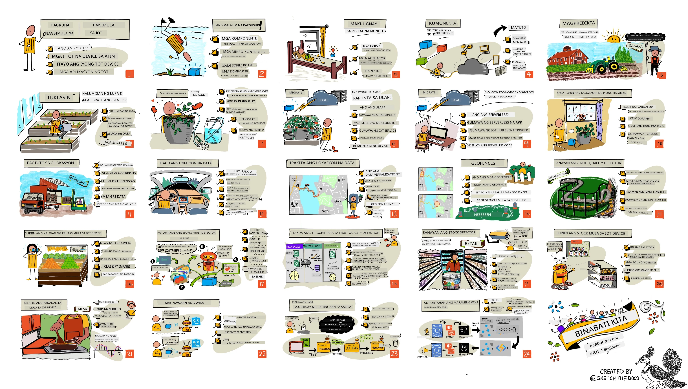

[](https://github.com/microsoft/IoT-For-Beginners/blob/master/LICENSE)
[](https://GitHub.com/microsoft/IoT-For-Beginners/graphs/contributors/)
[](https://GitHub.com/microsoft/IoT-For-Beginners/issues/)
[](https://GitHub.com/microsoft/IoT-For-Beginners/pulls/)
[](http://makeapullrequest.com)

[](https://GitHub.com/microsoft/IoT-For-Beginners/watchers/)
[](https://GitHub.com/microsoft/IoT-For-Beginners/network/)
[](https://GitHub.com/microsoft/IoT-For-Beginners/stargazers/)

### Sumali sa Azure AI Foundry Community

Kung kayo ay natigil o may mga tanong tungkol sa paggawa ng mga AI app, sumali sa kapwa mga nag-aaral at mga eksperyensadong developer sa mga diskusyon tungkol sa MCP. Ito ay isang sumusuportang komunidad kung saan malugod tinatanggap ang mga tanong at malayang naibabahagi ang kaalaman.

[](https://discord.gg/nTYy5BXMWG)

Kung mayroon kayong puna sa produkto o mga error habang bumubuo, bisitahin:

[](https://aka.ms/foundry/forum)

Sundin ang mga hakbang na ito upang magsimula gamit ang mga resources na ito:
1. **I-fork ang Repository**: I-click ang [](https://GitHub.com/microsoft/IoT-For-Beginners/fork)
2. **I-clone ang Repository**:   `git clone https://github.com/microsoft/IoT-For-Beginners.git`
3. [**Sumali sa Microsoft Foundry Discord at makipagkita sa mga eksperto at kapwa developer**](https://discord.com/invite/ByRwuEEgH4)


### 🌐 Suporta sa Maramihang Wika

#### Sinusuportahan sa pamamagitan ng GitHub Action (Automated at Palaging Napapanahon)

<!-- CO-OP TRANSLATOR LANGUAGES TABLE START -->
[Arabic](../ar/README.md) | [Bengali](../bn/README.md) | [Bulgarian](../bg/README.md) | [Burmese (Myanmar)](../my/README.md) | [Chinese (Simplified)](../zh-CN/README.md) | [Chinese (Traditional, Hong Kong)](../zh-HK/README.md) | [Chinese (Traditional, Macau)](../zh-MO/README.md) | [Chinese (Traditional, Taiwan)](../zh-TW/README.md) | [Croatian](../hr/README.md) | [Czech](../cs/README.md) | [Danish](../da/README.md) | [Dutch](../nl/README.md) | [Estonian](../et/README.md) | [Finnish](../fi/README.md) | [French](../fr/README.md) | [German](../de/README.md) | [Greek](../el/README.md) | [Hebrew](../he/README.md) | [Hindi](../hi/README.md) | [Hungarian](../hu/README.md) | [Indonesian](../id/README.md) | [Italian](../it/README.md) | [Japanese](../ja/README.md) | [Kannada](../kn/README.md) | [Khmer](../km/README.md) | [Korean](../ko/README.md) | [Lithuanian](../lt/README.md) | [Malay](../ms/README.md) | [Malayalam](../ml/README.md) | [Marathi](../mr/README.md) | [Nepali](../ne/README.md) | [Nigerian Pidgin](../pcm/README.md) | [Norwegian](../no/README.md) | [Persian (Farsi)](../fa/README.md) | [Polish](../pl/README.md) | [Portuguese (Brazil)](../pt-BR/README.md) | [Portuguese (Portugal)](../pt-PT/README.md) | [Punjabi (Gurmukhi)](../pa/README.md) | [Romanian](../ro/README.md) | [Russian](../ru/README.md) | [Serbian (Cyrillic)](../sr/README.md) | [Slovak](../sk/README.md) | [Slovenian](../sl/README.md) | [Spanish](../es/README.md) | [Swahili](../sw/README.md) | [Swedish](../sv/README.md) | [Tagalog (Filipino)](./README.md) | [Tamil](../ta/README.md) | [Telugu](../te/README.md) | [Thai](../th/README.md) | [Turkish](../tr/README.md) | [Ukrainian](../uk/README.md) | [Urdu](../ur/README.md) | [Vietnamese](../vi/README.md)

> **Mas gusto mo bang i-Clone Lokal?**
>
> Kasama sa repository na ito ang 50+ na mga pagsasalin ng wika na malaki ang pinapataas ng laki ng download. Para i-clone nang walang mga pagsasalin, gamitin ang sparse checkout:
>
> **Bash / macOS / Linux:**
> ```bash
> git clone --filter=blob:none --sparse https://github.com/microsoft/IoT-For-Beginners.git
> cd IoT-For-Beginners
> git sparse-checkout set --no-cone '/*' '!translations' '!translated_images'
> ```
>
> **CMD (Windows):**
> ```cmd
> git clone --filter=blob:none --sparse https://github.com/microsoft/IoT-For-Beginners.git
> cd IoT-For-Beginners
> git sparse-checkout set --no-cone "/*" "!translations" "!translated_images"
> ```
>
> Bibigyan ka nito ng lahat ng kailangan mo para matapos ang kurso nang mas mabilis ang pag-download.
<!-- CO-OP TRANSLATOR LANGUAGES TABLE END -->

# IoT para sa mga Nagsisimula - Isang Kurikulum

Ang mga Azure Cloud Advocates sa Microsoft ay natutuwa na mag-alok ng 12-linggong, 24-leksyon na kurikulum tungkol sa mga batayan ng IoT. Bawat leksyon ay may kasamang pre- at post-lesson quizzes, mga nakasulat na tagubilin para tapusin ang leksyon, solusyon, asignatura at iba pa. Ang aming pedagohiyang naka-project ay nagpapahintulot sa iyo na matuto habang bumubuo, isang patunay na paraan para ang mga bagong kasanayan ay manatag.

Sinasaklaw ng mga proyekto ang paglalakbay ng pagkain mula bukid hanggang mesa. Kasama dito ang pagsasaka, logistika, pagmamanupaktura, retail at consumer - lahat ay mga sikat na industriya para sa mga IoT device.



> Sketchnote ni [Nitya Narasimhan](https://github.com/nitya). I-click ang larawan para sa mas malaking bersyon.

**Taos-pusong pasasalamat sa aming mga may-akda na sina [Jen Fox](https://github.com/jenfoxbot), [Jen Looper](https://github.com/jlooper), [Jim Bennett](https://github.com/jimbobbennett), at sa aming sketchnote artist na si [Nitya Narasimhan](https://github.com/nitya).**

**Pasasalamat din sa aming grupo ng mga [Microsoft Learn Student Ambassadors](https://studentambassadors.microsoft.com?WT.mc_id=academic-17441-jabenn) na naging tagasuri at tagasalin ng kurikulum na ito - [Aditya Garg](https://github.com/AdityaGarg00), [Anurag Sharma](https://github.com/Anurag-0-1-A), [Arpita Das](https://github.com/Arpiiitaaa), [Aryan Jain](https://www.linkedin.com/in/aryan-jain-47a4a1145/), [Bhavesh Suneja](https://github.com/EliteWarrior315), [Faith Hunja](https://faithhunja.github.io/), [Lateefah Bello](https://www.linkedin.com/in/lateefah-bello/), [Manvi Jha](https://github.com/Severus-Matthew), [Mireille Tan](https://www.linkedin.com/in/mireille-tan-a4834819a/), [Mohammad Iftekher (Iftu) Ebne Jalal](https://github.com/Iftu119), [Mohammad Zulfikar](https://github.com/mohzulfikar), [Priyanshu Srivastav](https://www.linkedin.com/in/priyanshu-srivastav-b067241ba), [Thanmai Gowducheruvu](https://github.com/innovation-platform), at [Zina Kamel](https://www.linkedin.com/in/zina-kamel/).**

Kilalanin ang koponan!

[](https://youtu.be/-wippUJRi5k)

**Gif ni** [Mohit Jaisal](https://linkedin.com/in/mohitjaisal)

> 🎥 I-click ang larawan sa itaas para sa video tungkol sa proyekto!

> **Mga Guro**, naglagay kami ng [ilang mga mungkahi](for-teachers.md) kung paano gamitin ang kurikulum na ito. Kung nais mong gumawa ng sarili mong mga leksyon, mayroon din kaming [lesson template](lesson-template/README.md).

> **Mga Mag-aaral** [https://aka.ms/student-page](https://aka.ms/student-page), upang gamitin ang kurikulum na ito nang mag-isa, ifork ang buong repo at tapusin ang mga pagsasanay nang sarili mo, simula sa pre-lecture quiz, pagkatapos basahin ang lektyur at tapusin ang iba pang mga aktibidad. Subukang likhain ang mga proyekto habang nauunawaan ang mga leksyon sa halip na kopyahin ang solusyon sa code; gayunpaman ang code ay makukuha sa mga /solutions folder sa bawat proyekto na nakatuon sa leksyon. Isang ideya rin ay bumuo ng study group kasama ang mga kaibigan at pag-aralan ang nilalaman nang magkakasama. Para sa karagdagang pag-aaral, nirekomenda namin ang [Microsoft Learn](https://docs.microsoft.com/users/jimbobbennett/collections/ke2ehd351jopwr?WT.mc_id=academic-17441-jabenn).

Para sa video overview ng kursong ito, tingnan ang video:

[](https://youtube.com/watch?v=bccEMm8gRuc "Promo video")

> 🎥 I-click ang larawan sa itaas para sa video tungkol sa proyekto!

## Pedagohiya

Pinili namin ang dalawang prinsipyong pedagogical habang binubuo ang kurikulum na ito: tiyakin na ito ay naka-project at may mga madalas na quiz. Sa pagtatapos ng seryeng ito, magkakaroon ang mga mag-aaral ng monitoring at watering system para sa halaman, vehicle tracker, smart factory setup para subaybayan at suriin ang pagkain, at voice-controlled cooking timer, at matutunan ang mga batayan ng Internet of Things kabilang ang pagsulat ng code para sa device, pagkonekta sa cloud, pagsusuri ng telemetry at pagpapatakbo ng AI sa gilid.

Sa pamamagitan ng pagtiyak na ang nilalaman ay tumutugma sa mga proyekto, mas ginagawang kaakit-akit ang proseso para sa mga mag-aaral at pinapalawak ang retention ng mga konsepto.

Dagdag pa, ang mababang-panisik na quiz bago ang klase ay nagtatalaga ng layunin ng mag-aaral patungo sa pag-aaral ng isang paksa, habang ang pangalawang quiz pagkatapos ng klase ay nagtitiyak ng karagdagang retention. Ang kurikulum na ito ay dinisenyo upang maging flexible at masaya at maaaring kunin nang buo o bahagya. Nagsisimula ng maliit ang mga proyekto at nagiging mas kumplikado sa pagtatapos ng 12-linggong siklo.

Bawat proyekto ay nakabase sa totoong hardware na available sa mga estudyante at hobbyists. Tinitingnan ng bawat proyekto ang espesipikong domain ng proyekto, nagbibigay ng kaugnay na background na kaalaman. Para maging matagumpay na developer, nakatutulong na maunawaan ang domain kung saan nilulutas ang mga problema, ang pagbibigay ng background knowledge na ito ay nagpapahintulot sa mga mag-aaral na pag-isipan ang kanilang mga solusyon sa IoT at mga natutunan sa konteksto ng uri ng real-world na problema na maaaring hingin sa kanila bilang isang IoT developer. Natutunan ng mga mag-aaral ang 'bakit' ng solusyong kanilang binubuo, at nakakakuha ng pagpapahalaga sa end user.

## Hardware
Mayroon tayong dalawang pagpipilian ng IoT hardware na magagamit para sa mga proyekto depende sa personal na kagustuhan, kaalaman sa programming language o mga kagustuhan, mga layunin sa pag-aaral at availability. Nagbigay din kami ng 'virtual hardware' na bersyon para sa mga walang access sa hardware, o nais matuto nang higit pa bago magdesisyon sa pagbili. Maaari kang magbasa pa at makakita ng 'shopping list' sa [hardware page](./hardware.md), kasama ang mga link para bumili ng kumpletong kits mula sa aming mga kaibigan sa Seeed Studio.

> 💁 Hanapin ang aming [Code of Conduct](CODE_OF_CONDUCT.md), [Contributing](CONTRIBUTING.md), at mga patnubay sa [Translations](..). Malugod naming tinatanggap ang iyong konstruktibong puna!
>
> 🔧 May problema? Tingnan ang aming [Troubleshooting Guide](TROUBLESHOOTING.md) para sa mga solusyon sa karaniwang mga problema.

## Kasama sa bawat leksyon:

- sketchnote
- opsyonal na supplementary video
- pre-lesson warmup quiz
- nakasulat na leksyon
- para sa mga leksyong proyekto, mga gabay na sunud-sunod kung paano itayo ang proyekto
- mga pagsusuri ng kaalaman
- isang hamon
- dagdag na babasahin
- takdang-aralin
- [post-lesson quiz](https://ff-quizzes.netlify.app/en/)

> **Tandaan tungkol sa mga pagsusulit**: Lahat ng pagsusulit ay nasa loob ng quiz-app folder, para sa 48 na kabuuang pagsusulit na may tatlong tanong bawat isa. Naka-link ang mga ito mula sa loob ng mga leksiyon ngunit ang quiz app ay maaaring patakbuhin nang lokal o i-deploy sa Azure; sundin ang mga tagubilin sa `quiz-app` folder. Unti-unti itong nilalokalisa.

## Mga Leksiyon

|       |              Pangalan ng Proyekto              |                       Mga Konsepto na Itinuro                       | Mga Layunin sa Pagkatuto                                                                                                                                                 |                                                        Nakalink na Leksiyon                                                         |
| :---: | :------------------------------------------: | :----------------------------------------------------------------: | ----------------------------------------------------------------------------------------------------------------------------------------------------------------------- | :--------------------------------------------------------------------------------------------------------------------------: |
|  01   | [Getting started](./1-getting-started/README.md) |                     Panimula sa IoT                     | Matutunan ang mga pangunahing prinsipyo ng IoT at mga pangunahing bahagi ng IoT solutions tulad ng mga sensor at serbisyo sa cloud habang itinatayo ang iyong unang IoT device |                      [Introduction to IoT](./1-getting-started/lessons/1-introduction-to-iot/README.md)                      |
|  02   | [Getting started](./1-getting-started/README.md) |                   Mas malalim na pag-aaral sa IoT                    | Matuto nang higit pa tungkol sa mga bahagi ng isang IoT system, pati na rin ang mga microcontroller at single-board na computer                                                            |                        [A deeper dive into IoT](./1-getting-started/lessons/2-deeper-dive/README.md)                         |
|  03   | [Getting started](./1-getting-started/README.md) | Makipag-ugnayan sa pisikal na mundo gamit ang mga sensor at actuator | Matutunan tungkol sa mga sensor para mangalap ng datos mula sa pisikal na mundo, at mga actuator para magbigay ng feedback, habang ikaw ay nagtatayo ng nightlight                                           | [Interact with the physical world with sensors and actuators](./1-getting-started/lessons/3-sensors-and-actuators/README.md) |
|  04   | [Getting started](./1-getting-started/README.md) |             Ikonekta ang iyong device sa Internet             | Matutunan kung paano ikonekta ang isang IoT device sa Internet upang magpadala at makatanggap ng mga mensahe sa pamamagitan ng pagkonekta ng iyong nightlight sa isang MQTT broker                               |               [Connect your device to the Internet](./1-getting-started/lessons/4-connect-internet/README.md)                |
|  05   |            [Farm](./2-farm/README.md)            |                    Hulaan ang paglago ng halaman                     | Matutunan kung paano hulaan ang paglago ng halaman gamit ang temperatura na datos na nakuhang ng isang IoT device                                                                                  |                          [Predict plant growth](./2-farm/lessons/1-predict-plant-growth/README.md)                           |
|  06   |            [Farm](./2-farm/README.md)            |                    Alamin ang halumigmig ng lupa                     | Matutunan kung paano alamin ang halumigmig ng lupa at i-calibrate ang sensor ng halumigmig ng lupa                                                                                              |                          [Detect soil moisture](./2-farm/lessons/2-detect-soil-moisture/README.md)                           |
|  07   |            [Farm](./2-farm/README.md)            |                  Automated na pagpapakain ng halaman                   | Matutunan kung paano gawing automated at oras ang pagpapakain gamit ang relay at MQTT                                                                                                      |                      [Automated plant watering](./2-farm/lessons/3-automated-plant-watering/README.md)                       |
|  08   |            [Farm](./2-farm/README.md)            |               Ilipat ang iyong halaman sa cloud               | Matutunan tungkol sa cloud at mga cloud-hosted IoT service at kung paano ikonekta ang iyong halaman sa isa sa mga ito imbes na sa public MQTT broker                                   |               [Migrate your plant to the cloud](./2-farm/lessons/4-migrate-your-plant-to-the-cloud/README.md)                |
|  09   |            [Farm](./2-farm/README.md)            |         Ilipat ang iyong application logic sa cloud         | Matutunan kung paano ka makakagawa ng application logic sa cloud na tutugon sa IoT messages                                                                          |         [Migrate your application logic to the cloud](./2-farm/lessons/5-migrate-application-to-the-cloud/README.md)         |
|  10   |            [Farm](./2-farm/README.md)            |                   Panatilihing ligtas ang iyong halaman                    | Matutunan tungkol sa seguridad sa IoT at kung paano panatilihing ligtas ang iyong halaman gamit ang mga key at sertipiko                                                                          |                        [Keep your plant secure](./2-farm/lessons/6-keep-your-plant-secure/README.md)                         |
|  11   |       [Transport](./3-transport/README.md)       |                      Location tracking                      | Matutunan tungkol sa GPS location tracking para sa mga IoT device                                                                                                                   |                           [Location tracking](./3-transport/lessons/1-location-tracking/README.md)                           |
|  12   |       [Transport](./3-transport/README.md)       |                     Mag-imbak ng location data                     | Matutunan kung paano mag-imbak ng IoT data upang mabiswalisa o ma-analisa mamaya                                                                                                      |                         [Store location data](./3-transport/lessons/2-store-location-data/README.md)                         |
|  13   |       [Transport](./3-transport/README.md)       |                   I-visualize ang location data                   | Matutunan tungkol sa pag-visualize ng location data sa mapa, at kung paano kinakatawan ng mga mapa ang totoong 3d na mundo sa 2 dimension                                                            |                     [Visualize location data](./3-transport/lessons/3-visualize-location-data/README.md)                     |
|  14   |       [Transport](./3-transport/README.md)       |                          Geofences                          | Matutunan tungkol sa mga geofence, at kung paano ito ginagamit upang mag-alerto kapag ang mga sasakyan sa supply chain ay malapit sa kanilang destinasyon                                           |                                   [Geofences](./3-transport/lessons/4-geofences/README.md)                                   |
|  15   |   [Manufacturing](./4-manufacturing/README.md)   |               Sanayin ang fruit quality detector                | Matutunan tungkol sa pagsasanay ng image classifier sa cloud upang madetect ang kalidad ng prutas                                                                                       |                 [Train a fruit quality detector](./4-manufacturing/lessons/1-train-fruit-detector/README.md)                 |
|  16   |   [Manufacturing](./4-manufacturing/README.md)   |           Suriin ang kalidad ng prutas mula sa isang IoT device            | Matutunan ang paggamit ng iyong fruit quality detector mula sa isang IoT device                                                                                                    |           [Check fruit quality from an IoT device](./4-manufacturing/lessons/2-check-fruit-from-device/README.md)            |
|  17   |   [Manufacturing](./4-manufacturing/README.md)   |             Patakbuhin ang iyong fruit detector sa edge             | Matutunan tungkol sa pagpapatakbo ng iyong fruit detector sa isang IoT device sa edge                                                                                                |             [Run your fruit detector on the edge](./4-manufacturing/lessons/3-run-fruit-detector-edge/README.md)             |
|  18   |   [Manufacturing](./4-manufacturing/README.md)   |        Paandarin ang fruit quality detection mula sa isang sensor        | Matutunan tungkol sa pagpapa-trigger ng fruit quality detection mula sa isang sensor                                                                                                        |        [Trigger fruit quality detection from a sensor](./4-manufacturing/lessons/4-trigger-fruit-detector/README.md)         |
|  19   |          [Retail](./5-retail/README.md)          |                   Sanayin ang stock detector                    | Matutunan kung paano gamitin ang object detection upang sanayin ang stock detector para bilangin ang stock sa isang tindahan                                                                                |                        [Train a stock detector](./5-retail/lessons/1-train-stock-detector/README.md)                         |
|  20   |          [Retail](./5-retail/README.md)          |               Suriin ang stock mula sa isang IoT device                | Matutunan kung paano suriin ang stock mula sa isang IoT device gamit ang object detection model                                                                                         |                     [Check stock from an IoT device](./5-retail/lessons/2-check-stock-device/README.md)                      |
|  21   |        [Consumer](./6-consumer/README.md)        |             Kilalanin ang pagsasalita gamit ang isang IoT device             | Matutunan kung paano kilalanin ang pagsasalita mula sa isang IoT device upang bumuo ng smart timer                                                                                             |                  [Recognize speech with an IoT device](./6-consumer/lessons/1-speech-recognition/README.md)                  |
|  22   |        [Consumer](./6-consumer/README.md)        |                     Unawain ang wika                     | Matutunan kung paano unawain ang mga pangungusap na sinasalita sa isang IoT device                                                                                                           |                        [Understand language](./6-consumer/lessons/2-language-understanding/README.md)                        |
|  23   |        [Consumer](./6-consumer/README.md)        |           Mag-set ng timer at magbigay ng sinasalitang feedback           | Matutunan kung paano mag-set ng timer sa isang IoT device at magbigay ng sinasalitang feedback kung kailan na-set ang timer at kapag ito ay natapos                                                    |                 [Set a timer and provide spoken feedback](./6-consumer/lessons/3-spoken-feedback/README.md)                  |
|  24   |        [Consumer](./6-consumer/README.md)        |                 Suportahan ang maramihang wika                  | Matutunan kung paano suportahan ang maramihang wika, kapwa sa pagsasalita at sa mga sagot mula sa iyong smart timer                                                               |                   [Support multiple languages](./6-consumer/lessons/4-multiple-language-support/README.md)                   |

## Offline access

Maaari mong patakbuhin ang dokumentasyong ito offline gamit ang [Docsify](https://docsify.js.org/#/). I-fork ang repo na ito, [i-install ang Docsify](https://docsify.js.org/#/quickstart) sa iyong lokal na makina, at pagkatapos sa root folder ng repo na ito, i-type ang `docsify serve`. Ang website ay magiging available sa port 3000 sa iyong localhost: `localhost:3000`.

## Quiz

Salamat sa komunidad sa pag-host ng interactive quiz na sumusubok sa iyong kaalaman sa bawat kabanata. Maaari mong subukan ang iyong kaalaman [dito](https://ff-quizzes.netlify.app/en/)

### PDF

Maaari kang gumawa ng PDF ng nilalamang ito para sa offline na access kung kinakailangan. Upang gawin ito, siguraduhing mayroon kang [npm na naka-install](https://docs.npmjs.com/downloading-and-installing-node-js-and-npm) at patakbuhin ang mga sumusunod na command sa root folder ng repo na ito:

```sh
npm i
npm run convert
```

### Slides

May mga slide deck para sa ilan sa mga leksiyon sa [slides](../../slides) folder.

## Ibang Kurikulum

Ang aming koponan ay gumagawa ng iba pang kurikulum! Tingnan ang:

<!-- CO-OP TRANSLATOR OTHER COURSES START -->
### LangChain
[](https://aka.ms/langchain4j-for-beginners)
[](https://aka.ms/langchainjs-for-beginners?WT.mc_id=m365-94501-dwahlin)
[](https://github.com/microsoft/langchain-for-beginners?WT.mc_id=m365-94501-dwahlin)
---

### Azure / Edge / MCP / Agents
[](https://github.com/microsoft/AZD-for-beginners?WT.mc_id=academic-105485-koreyst)
[](https://github.com/microsoft/edgeai-for-beginners?WT.mc_id=academic-105485-koreyst)
[](https://github.com/microsoft/mcp-for-beginners?WT.mc_id=academic-105485-koreyst)
[](https://github.com/microsoft/ai-agents-for-beginners?WT.mc_id=academic-105485-koreyst)

---
 
### Generative AI Series
[](https://github.com/microsoft/generative-ai-for-beginners?WT.mc_id=academic-105485-koreyst)
[-9333EA?style=for-the-badge&labelColor=E5E7EB&color=9333EA)](https://github.com/microsoft/Generative-AI-for-beginners-dotnet?WT.mc_id=academic-105485-koreyst)
[-C084FC?style=for-the-badge&labelColor=E5E7EB&color=C084FC)](https://github.com/microsoft/generative-ai-for-beginners-java?WT.mc_id=academic-105485-koreyst)
[-E879F9?style=for-the-badge&labelColor=E5E7EB&color=E879F9)](https://github.com/microsoft/generative-ai-with-javascript?WT.mc_id=academic-105485-koreyst)

---
 
### Core Learning
[](https://aka.ms/ml-beginners?WT.mc_id=academic-105485-koreyst)
[](https://aka.ms/datascience-beginners?WT.mc_id=academic-105485-koreyst)
[](https://aka.ms/ai-beginners?WT.mc_id=academic-105485-koreyst)
[](https://github.com/microsoft/Security-101?WT.mc_id=academic-96948-sayoung)
[](https://aka.ms/webdev-beginners?WT.mc_id=academic-105485-koreyst)
[](https://aka.ms/iot-beginners?WT.mc_id=academic-105485-koreyst)
[](https://github.com/microsoft/xr-development-for-beginners?WT.mc_id=academic-105485-koreyst)

---
 
### Copilot Series
[](https://aka.ms/GitHubCopilotAI?WT.mc_id=academic-105485-koreyst)
[](https://github.com/microsoft/mastering-github-copilot-for-dotnet-csharp-developers?WT.mc_id=academic-105485-koreyst)
[](https://github.com/microsoft/CopilotAdventures?WT.mc_id=academic-105485-koreyst)
<!-- CO-OP TRANSLATOR OTHER COURSES END -->

## Image attributions

Maaari mong makita ang lahat ng mga atribusyon para sa mga larawang ginamit sa kurikulum na ito kung saan kinakailangan sa [Attributions](./attributions.md).

---

<!-- CO-OP TRANSLATOR DISCLAIMER START -->
**Paunawa**:  
Ang dokumentong ito ay isinalin gamit ang AI translation service na [Co-op Translator](https://github.com/Azure/co-op-translator). Bagamat nagsusumikap kaming maging tumpak, pakatandaan na ang mga awtomatikong pagsasalin ay maaaring maglaman ng mga pagkakamali o hindi pagkakatugma. Ang orihinal na dokumento sa orihinal nitong wika ang dapat ituring na opisyal na sanggunian. Para sa mahahalagang impormasyon, inirerekomenda ang propesyonal na pagsasalin ng tao. Hindi kami mananagot sa anumang hindi pagkakaunawaan o maling interpretasyon na maaaring magmula sa paggamit ng pagsasaling ito.
<!-- CO-OP TRANSLATOR DISCLAIMER END -->