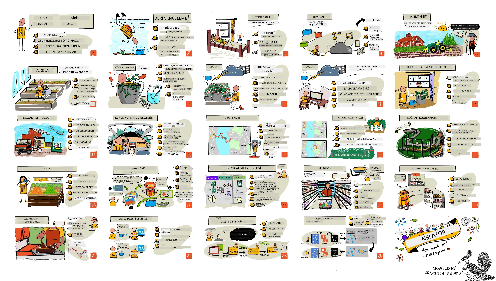

<!--
CO_OP_TRANSLATOR_METADATA:
{
  "original_hash": "6c354ec3487e4f6cfafbe44557996cd9",
  "translation_date": "2026-01-06T03:51:09+00:00",
  "source_file": "README.md",
  "language_code": "tr"
}
-->
[](https://github.com/microsoft/IoT-For-Beginners/blob/master/LICENSE)
[](https://GitHub.com/microsoft/IoT-For-Beginners/graphs/contributors/)
[](https://GitHub.com/microsoft/IoT-For-Beginners/issues/)
[](https://GitHub.com/microsoft/IoT-For-Beginners/pulls/)
[](http://makeapullrequest.com)

[](https://GitHub.com/microsoft/IoT-For-Beginners/watchers/)
[](https://GitHub.com/microsoft/IoT-For-Beginners/network/)
[](https://GitHub.com/microsoft/IoT-For-Beginners/stargazers/)

### Azure AI Foundry Topluluğuna Katılın

AI uygulamaları geliştirirken takılırsanız veya herhangi bir sorunuz olursa. MCP hakkında tartışmalara katılmak için diğer öğrenenler ve deneyimli geliştiricilerle bir araya gelin. Soruların memnuniyetle karşılandığı ve bilginin özgürce paylaşıldığı destekleyici bir topluluktur.

[](https://discord.gg/nTYy5BXMWG)

Ürün geri bildirimi veya geliştirme sırasında hatalarınız varsa ziyaret edin:

[](https://aka.ms/foundry/forum)

Bu kaynakları kullanmaya başlamak için şu adımları izleyin:
1. **Depoyu Forklayın**: Tıklayın [](https://GitHub.com/microsoft/IoT-For-Beginners/fork)
2. **Depoyu Klonlayın**:   `git clone https://github.com/microsoft/IoT-For-Beginners.git`
3. [**Microsoft Foundry Discord'a Katılın ve uzmanlar ile diğer geliştiricilerle tanışın**](https://discord.com/invite/ByRwuEEgH4)


### 🌐 Çok Dilli Destek

#### GitHub Action ile Desteklenmiştir (Otomatik & Her Zaman Güncel)

<!-- CO-OP TRANSLATOR LANGUAGES TABLE START -->
[Arabic](../ar/README.md) | [Bengali](../bn/README.md) | [Bulgarian](../bg/README.md) | [Burmese (Myanmar)](../my/README.md) | [Chinese (Simplified)](../zh/README.md) | [Chinese (Traditional, Hong Kong)](../hk/README.md) | [Chinese (Traditional, Macau)](../mo/README.md) | [Chinese (Traditional, Taiwan)](../tw/README.md) | [Croatian](../hr/README.md) | [Czech](../cs/README.md) | [Danish](../da/README.md) | [Dutch](../nl/README.md) | [Estonian](../et/README.md) | [Finnish](../fi/README.md) | [French](../fr/README.md) | [German](../de/README.md) | [Greek](../el/README.md) | [Hebrew](../he/README.md) | [Hindi](../hi/README.md) | [Hungarian](../hu/README.md) | [Indonesian](../id/README.md) | [Italian](../it/README.md) | [Japanese](../ja/README.md) | [Kannada](../kn/README.md) | [Korean](../ko/README.md) | [Lithuanian](../lt/README.md) | [Malay](../ms/README.md) | [Malayalam](../ml/README.md) | [Marathi](../mr/README.md) | [Nepali](../ne/README.md) | [Nigerian Pidgin](../pcm/README.md) | [Norwegian](../no/README.md) | [Persian (Farsi)](../fa/README.md) | [Polish](../pl/README.md) | [Portuguese (Brazil)](../br/README.md) | [Portuguese (Portugal)](../pt/README.md) | [Punjabi (Gurmukhi)](../pa/README.md) | [Romanian](../ro/README.md) | [Russian](../ru/README.md) | [Serbian (Cyrillic)](../sr/README.md) | [Slovak](../sk/README.md) | [Slovenian](../sl/README.md) | [Spanish](../es/README.md) | [Swahili](../sw/README.md) | [Swedish](../sv/README.md) | [Tagalog (Filipino)](../tl/README.md) | [Tamil](../ta/README.md) | [Telugu](../te/README.md) | [Thai](../th/README.md) | [Turkish](./README.md) | [Ukrainian](../uk/README.md) | [Urdu](../ur/README.md) | [Vietnamese](../vi/README.md)

> **Yerel Olarak Klonlamayı Tercih Ediyor musunuz?**

> Bu depo, indirilen boyutu önemli ölçüde artıran 50'den fazla dil çevirisini içerir. Çeviriler olmadan klonlamak için, spars checkout kullanın:
> ```bash
> git clone --filter=blob:none --sparse https://github.com/microsoft/IoT-For-Beginners.git
> cd IoT-For-Beginners
> git sparse-checkout set --no-cone '/*' '!translations' '!translated_images'
> ```
> Bu, kursu tamamlamak için ihtiyacınız olan her şeyi çok daha hızlı bir indirme ile size verir.
<!-- CO-OP TRANSLATOR LANGUAGES TABLE END -->

# Başlangıç için IoT - Bir Eğitim Programı

Microsoft'taki Azure Bulut Savunucuları olarak IoT temelleri hakkında 12 haftalık, 24 derslik bir eğitim programı sunmaktan mutluluk duyuyoruz. Her ders, ders öncesi ve sonrası quizleri, dersi tamamlamak için yazılı talimatlar, bir çözüm, bir ödev ve daha fazlasını içerir. Proje tabanlı öğretim yöntemimiz, yeni becerilerin kalıcı olmasını sağlayan, inşa ederek öğrenmenize olanak tanır.

Projeler, çiftlikten masaya olan yemek yolculuğunu kapsamaktadır. Bu, tarım, lojistik, üretim, perakende ve tüketici - IoT cihazları için popüler endüstri alanlarının tümünü içerir.



> Sketchnote: [Nitya Narasimhan](https://github.com/nitya). Daha büyük versiyonu için görsele tıklayın.

**Yazarlarımıza kalpten teşekkürlerimizle: [Jen Fox](https://github.com/jenfoxbot), [Jen Looper](https://github.com/jlooper), [Jim Bennett](https://github.com/jimbobbennett) ve sketchnote sanatçımız [Nitya Narasimhan](https://github.com/nitya).**

**Ayrıca bu müfredatı inceleyip çeviren [Microsoft Learn Öğrenci Elçileri](https://studentambassadors.microsoft.com?WT.mc_id=academic-17441-jabenn) ekibimize teşekkür ederiz - [Aditya Garg](https://github.com/AdityaGarg00), [Anurag Sharma](https://github.com/Anurag-0-1-A), [Arpita Das](https://github.com/Arpiiitaaa), [Aryan Jain](https://www.linkedin.com/in/aryan-jain-47a4a1145/), [Bhavesh Suneja](https://github.com/EliteWarrior315), [Faith Hunja](https://faithhunja.github.io/), [Lateefah Bello](https://www.linkedin.com/in/lateefah-bello/), [Manvi Jha](https://github.com/Severus-Matthew), [Mireille Tan](https://www.linkedin.com/in/mireille-tan-a4834819a/), [Mohammad Iftekher (Iftu) Ebne Jalal](https://github.com/Iftu119), [Mohammad Zulfikar](https://github.com/mohzulfikar), [Priyanshu Srivastav](https://www.linkedin.com/in/priyanshu-srivastav-b067241ba), [Thanmai Gowducheruvu](https://github.com/innovation-platform) ve [Zina Kamel](https://www.linkedin.com/in/zina-kamel/).**

Takımı tanıyın!

[](https://youtu.be/-wippUJRi5k)

**Gif by** [Mohit Jaisal](https://linkedin.com/in/mohitjaisal)

> 🎥 Proje hakkında bir video için yukarıdaki görsele tıklayın!

> **Öğretmenler**, bu müfredatı nasıl kullanacağınıza dair [bazı öneriler ekledik](for-teachers.md). Kendi derslerinizi oluşturmak isterseniz, bir [ders şablonu](lesson-template/README.md) da sağladık.

> **[Öğrenciler](https://aka.ms/student-page)**, bu müfredatı tek başınıza kullanmak için, tüm depoyu fork'layın ve ders öncesi quiz ile başlayarak dersi okuyup egzersizleri tamamlayarak ilerleyin. Proje tabanlı derslerdeki çözüm kodunu doğrudan kopyalamak yerine, projeleri anlayarak oluşturmayı deneyin; ancak bu kod her proje tabanlı dersin /solutions klasörlerinde mevcuttur. Diğer bir fikir ise arkadaşlarınızla bir çalışma grubu kurarak içeriği birlikte geçmek olur. Daha ileri çalışma için, [Microsoft Learn](https://docs.microsoft.com/users/jimbobbennett/collections/ke2ehd351jopwr?WT.mc_id=academic-17441-jabenn) öneriyoruz.

Bu kursun video genel görünümüne göz atın:

[](https://youtube.com/watch?v=bccEMm8gRuc "Tanıtım videosu")

> 🎥 Proje hakkında bir video için yukarıdaki görsele tıklayın!

## Pedagoji

Bu müfredatı oluştururken iki pedagoji ilkesini seçtik: proje tabanlı olması ve sık quizlerin bulunması. Bu serinin sonunda öğrenciler bir bitki izleme ve sulama sistemi, bir araç takip cihazı, gıda izleme ve kontrolü için akıllı fabrika kurulumu ve sesle kontrol edilen bir pişirme zamanlayıcısı oluşturacaklar ve Nesnelerin İnterneti temellerini, cihaz kodu yazmayı, buluta bağlanmayı, telemetri analizini ve uçta AI çalıştırmayı öğrenecekler.

İçeriğin projelere uyduğundan emin olarak, süreç öğrenciler için daha ilgi çekici hale gelir ve kavramların kalıcılığı artar.

Ayrıca, dersten önce yapılan düşük riskli bir quiz, öğrenciyi öğrenmeye hazırlar, ders sonrası ikinci quiz ise bilgilerin daha fazla akılda kalmasını sağlar. Bu müfredat esnek ve eğlenceli olacak şekilde tasarlanmıştır ve tamamı veya bir kısmı alınabilir. Projeler küçük başlayıp 12 haftalık döngünün sonunda giderek daha karmaşık hale gelir.

Her proje, öğrencilere ve hobi sahiplerine sunulan gerçek dünya donanımlarına dayanır. Her proje, ilgili proje alanını araştırır ve ilgili arka plan bilgisini sağlar. Başarılı bir geliştirici olmak için, sorun çözdüğünüz alanı anlamak faydalıdır; bu arka plan bilgisi, öğrencilerin IoT çözümlerini ve öğrenimlerini, IoT geliştiricisi olarak karşılaşabilecekleri gerçek dünya problemlerinin bağlamında düşünmelerine olanak tanır. Öğrenciler oluşturdukları çözümlerin 'neden'ini öğrenir ve son kullanıcıyı anlarlar.

## Donanım

Projeler için kişisel tercihe, programlama dili bilgisine veya tercihlerine, öğrenme hedeflerine ve mevcut donanıma bağlı olarak iki IoT donanımı seçeneğimiz var. Donanıma erişimi olmayanlar veya satın almadan önce daha fazla öğrenmek isteyenler için 'sanal donanım' versiyonunu da sağladık. Daha fazlasını okuyabilir ve [donanım sayfasında](./hardware.md) tam kitleri satın almak için Seeed Studio’daki arkadaşlarımızın bağlantılarını bulabilirsiniz.
> 💁 [Davranış Kurallarımızı](CODE_OF_CONDUCT.md), [Katkıda Bulunma](CONTRIBUTING.md) ve [Çeviri](TRANSLATIONS.md) yönergelerimizi bulun. Yapıcı geri bildirimlerinizi bekliyoruz!
>
> 🔧 Sorun mu yaşıyorsunuz? Yaygın sorunlar için çözümleri görmek üzere [Sorun Giderme Rehberimizi](TROUBLESHOOTING.md) inceleyin.

## Her ders şunları içerir:

- sketchnote
- isteğe bağlı destekleyici video
- ders öncesi ısınma sınavı
- yazılı ders
- proje tabanlı derslerde, projeyi oluşturmak için adım adım rehberler
- bilgi kontrolleri
- bir meydan okuma
- destekleyici okumalar
- ödev
- [ders sonrası sınav](https://ff-quizzes.netlify.app/en/)

> **Sınavlar hakkında bir not**: Tüm sınavlar quiz-app klasöründe bulunmaktadır, her biri üç sorudan oluşan toplam 48 sınav vardır. Bunlar dersler içerisinden bağlantı verilmiştir ancak quiz uygulaması yerel olarak çalıştırılabilir veya Azure'a dağıtılabilir; quiz-app klasöründeki talimatları izleyin. Kademeli olarak yerelleştirilmektedirler.

## Dersler

|       |              Proje Adı              |                       Öğretilen Kavramlar                       | Öğrenme Hedefleri                                                                                                                                                   |                                                        Bağlı Ders                                                         |
| :---: | :------------------------------------: | :---------------------------------------------------------: | ------------------------------------------------------------------------------------------------------------------------------------------------------------------- | :--------------------------------------------------------------------------------------------------------------------------: |
|  01   | [Başlarken](./1-getting-started/README.md) |                     IoT'ye Giriş                     | İlk IoT cihazınızı kurarken IoT'nun temel ilkelerini ve sensörler ile bulut servisleri gibi IoT çözümlerinin temel yapı taşlarını öğrenin. |                      [IoT'ye Giriş](./1-getting-started/lessons/1-introduction-to-iot/README.md)                      |
|  02   | [Başlarken](./1-getting-started/README.md) |                   IoT'de Derinlemesine İnceleme                    | Bir IoT sisteminin bileşenleri, mikrodenetleyiciler ve tek kartlı bilgisayarlar hakkında daha fazla bilgi edinin.                                                            |                        [IoT'de Derinlemesine İnceleme](./1-getting-started/lessons/2-deeper-dive/README.md)                         |
|  03   | [Başlarken](./1-getting-started/README.md) | Sensörler ve aktüatörlerle fiziksel dünya ile etkileşim | Gece lambası yaparken fiziksel dünyadan veri toplamak için sensörler ve geri bildirim göndermek için aktüatörler hakkında bilgi edinin.                                           | [Sensörler ve aktüatörlerle fiziksel dünya ile etkileşim](./1-getting-started/lessons/3-sensors-and-actuators/README.md) |
|  04   | [Başlarken](./1-getting-started/README.md) |             Cihazınızı İnternete bağlayın             | Gece lambanızı bir MQTT aracısına bağlayarak IoT cihazınızı İnternete bağlayıp mesaj gönderip alma yöntemlerini öğrenin.                               |               [Cihazınızı İnternete bağlayın](./1-getting-started/lessons/4-connect-internet/README.md)                |
|  05   |            [Çiftlik](./2-farm/README.md)            |                    Bitki büyümesini tahmin edin                     | IoT cihazı tarafından yakalanan sıcaklık verilerini kullanarak bitki büyümesini tahmin etmeyi öğrenin.                                                                                  |                          [Bitki büyümesini tahmin edin](./2-farm/lessons/1-predict-plant-growth/README.md)                           |
|  06   |            [Çiftlik](./2-farm/README.md)            |                    Toprak nemini algılayın                     | Toprak nemini nasıl algılayacağınızı ve bir toprak nemi sensörünü nasıl kalibre edeceğinizi öğrenin.                                                                                            |                          [Toprak nemini algılayın](./2-farm/lessons/2-detect-soil-moisture/README.md)                           |
|  07   |            [Çiftlik](./2-farm/README.md)            |                  Otomatik bitki sulama                   | Röle ve MQTT kullanarak sulamayı nasıl otomatikleştirip zamanlayacağınızı öğrenin.                                                                                                      |                      [Otomatik bitki sulama](./2-farm/lessons/3-automated-plant-watering/README.md)                       |
|  08   |            [Çiftlik](./2-farm/README.md)            |               Bitkinizi buluta taşıyın               | Bulut ve bulut barındırılan IoT servisleri hakkında bilgi edinin ve bitkinizi genel bir MQTT aracısı yerine bunlardan birine nasıl bağlayacağınızı öğrenin.                                   |               [Bitkinizi buluta taşıyın](./2-farm/lessons/4-migrate-your-plant-to-the-cloud/README.md)                |
|  09   |            [Çiftlik](./2-farm/README.md)            |         Uygulama mantığınızı buluta taşıyın         | IoT mesajlarına yanıt veren uygulama mantığını bulutta nasıl yazabileceğinizi öğrenin.                                                                          |         [Uygulama mantığınızı buluta taşıyın](./2-farm/lessons/5-migrate-application-to-the-cloud/README.md)         |
|  10   |            [Çiftlik](./2-farm/README.md)            |                   Bitkinizi güvende tutun                    | IoT güvenliği ve anahtarlar ile sertifikalar kullanarak bitkinizi nasıl güvende tutacağınızı öğrenin.                                                                          |                        [Bitkinizi güvende tutun](./2-farm/lessons/6-keep-your-plant-secure/README.md)                         |
|  11   |       [Taşıma](./3-transport/README.md)       |                      Konum takibi                      | IoT cihazları için GPS konum takibi hakkında bilgi edinin.                                                                                                                   |                           [Konum takibi](./3-transport/lessons/1-location-tracking/README.md)                           |
|  12   |       [Taşıma](./3-transport/README.md)       |                     Konum verisi depolama                     | Sonradan görselleştirmek veya analiz etmek için IoT verilerini nasıl depolayacağınızı öğrenin.                                                                                                      |                         [Konum verisi depolama](./3-transport/lessons/2-store-location-data/README.md)                         |
|  13   |       [Taşıma](./3-transport/README.md)       |                   Konum verisini görselleştirme                   | Harita üzerinde konum verilerini görselleştirme ve haritaların gerçek 3 boyutlu dünyayı 2 boyutta nasıl temsil ettiğini öğrenin.                                                            |                     [Konum verisini görselleştirme](./3-transport/lessons/3-visualize-location-data/README.md)                     |
|  14   |       [Taşıma](./3-transport/README.md)       |                          Geofence'ler                          | Geofence'ler hakkında ve tedarik zincirindeki araçların hedeflerine yaklaştığında nasıl uyarı verebileceği hakkında bilgi edinin.                                           |                                   [Geofence'ler](./3-transport/lessons/4-geofences/README.md)                                   |
|  15   |   [Üretim](./4-manufacturing/README.md)   |               Meyve kalite tespiti eğitimi                | Meyve kalitesini tespit etmek için bulutta bir görüntü sınıflandırıcı eğitimi hakkında bilgi edinin.                                                                                       |                 [Meyve kalite tespiti eğitimi](./4-manufacturing/lessons/1-train-fruit-detector/README.md)                 |
|  16   |   [Üretim](./4-manufacturing/README.md)   |           IoT cihazından meyve kalitesini kontrol etme            | IoT cihazınızdan meyve kalite tespit cihazınızı nasıl kullanacağınız hakkında bilgi edinin.                                                                                                    |           [IoT cihazından meyve kalitesini kontrol etme](./4-manufacturing/lessons/2-check-fruit-from-device/README.md)            |
|  17   |   [Üretim](./4-manufacturing/README.md)   |             Meyve tespit cihazınızı uçta çalıştırma             | Meyve tespit cihazınızı uçtaki bir IoT cihazı üzerinde çalıştırma hakkında bilgi edinin.                                                                                                |             [Meyve tespit cihazınızı uçta çalıştırma](./4-manufacturing/lessons/3-run-fruit-detector-edge/README.md)             |
|  18   |   [Üretim](./4-manufacturing/README.md)   |        Bir sensörden meyve kalite tespitini tetikleme        | Bir sensörden meyve kalite tespitini tetikleme hakkında bilgi edinin.                                                                                                        |        [Bir sensörden meyve kalite tespitini tetikleme](./4-manufacturing/lessons/4-trigger-fruit-detector/README.md)         |
|  19   |          [Perakende](./5-retail/README.md)          |                   Stok tespit cihazı eğitimi                    | Mağazadaki stoğu saymak için nesne tespiti kullanarak stok tespit cihazı eğitimi yapmayı öğrenin.                                                                                |                        [Stok tespit cihazı eğitimi](./5-retail/lessons/1-train-stock-detector/README.md)                         |
|  20   |          [Perakende](./5-retail/README.md)          |               IoT cihazından stok kontrolü                | Bir nesne tespit modeli kullanarak IoT cihazından stoğu nasıl kontrol edeceğinizi öğrenin.                                                                                         |                     [IoT cihazından stok kontrolü](./5-retail/lessons/2-check-stock-device/README.md)                      |
|  21   |        [Tüketici](./6-consumer/README.md)        |             IoT cihazıyla konuşmayı tanıma             | Akıllı zamanlayıcı oluşturmak için bir IoT cihazından gelen konuşmayı tanımayı öğrenin.                                                                                             |                  [IoT cihazıyla konuşmayı tanıma](./6-consumer/lessons/1-speech-recognition/README.md)                  |
|  22   |        [Tüketici](./6-consumer/README.md)        |                     Dili anlama                     | Bir IoT cihazına söylenen cümleleri nasıl anlayacağınızı öğrenin.                                                                                                           |                        [Dili anlama](./6-consumer/lessons/2-language-understanding/README.md)                        |
|  23   |        [Tüketici](./6-consumer/README.md)        |           Zamanlayıcı ayarlama ve sesli geri bildirim sağlama           | IoT cihazında nasıl zamanlayıcı ayarlanacağını ve zamanlayıcı ayarlandığında ve bitişinde sesli geri bildirim vermeyi öğrenin.                                                    |                 [Zamanlayıcı ayarlama ve sesli geri bildirim sağlama](./6-consumer/lessons/3-spoken-feedback/README.md)                  |
|  24   |        [Tüketici](./6-consumer/README.md)        |                 Birden çok dili destekleme                  | Hem söylenilenlerde hem de akıllı zamanlayıcınızın verdiği yanıtlarda birden fazla dili nasıl destekleyeceğinizi öğrenin.                                                               |                   [Birden çok dili destekleme](./6-consumer/lessons/4-multiple-language-support/README.md)                   |

## Çevrimdışı erişim

Bu dokümantasyonu [Docsify](https://docsify.js.org/#/) kullanarak çevrimdışı olarak çalıştırabilirsiniz. Bu havuzun bir kopyasını oluşturun, yerel makinenize [Docsify'i kurun](https://docsify.js.org/#/quickstart) ve ardından bu havuzun kök klasöründe `docsify serve` komutunu yazın. Web sitesi localhost üzerinde 3000 portunda çalışacaktır: `localhost:3000`.

## Sınav

Topluluğa, her bölümdeki bilginizi test eden interaktif sınavı barındırdığı için teşekkür ederiz. Bilginizi [buradan](https://ff-quizzes.netlify.app/en/) test edin.

### PDF

İsterseniz bu içeriğin bir PDF'sini oluşturarak çevrimdışı erişim sağlayabilirsiniz. Bunu yapmak için, [npm'nin yüklü olduğundan](https://docs.npmjs.com/downloading-and-installing-node-js-and-npm) emin olun ve bu havuzun kök klasöründe aşağıdaki komutları çalıştırın:

```sh
npm i
npm run convert
```

### Slaytlar

Bazı dersler için slayt desteleri [slides](../../slides) klasöründe bulunmaktadır.

## Diğer Müfredatlar

Ekibimiz başka müfredatlar da üretiyor! Şunları inceleyin:

<!-- CO-OP TRANSLATOR OTHER COURSES START -->
### LangChain
[](https://aka.ms/langchain4j-for-beginners)
[](https://aka.ms/langchainjs-for-beginners?WT.mc_id=m365-94501-dwahlin)

---

### Azure / Edge / MCP / Ajanlar
[](https://github.com/microsoft/AZD-for-beginners?WT.mc_id=academic-105485-koreyst)
[](https://github.com/microsoft/edgeai-for-beginners?WT.mc_id=academic-105485-koreyst)
[](https://github.com/microsoft/mcp-for-beginners?WT.mc_id=academic-105485-koreyst)
[](https://github.com/microsoft/ai-agents-for-beginners?WT.mc_id=academic-105485-koreyst)

---
 
### Üretken AI Serisi
[](https://github.com/microsoft/generative-ai-for-beginners?WT.mc_id=academic-105485-koreyst)
[-9333EA?style=for-the-badge&labelColor=E5E7EB&color=9333EA)](https://github.com/microsoft/Generative-AI-for-beginners-dotnet?WT.mc_id=academic-105485-koreyst)
[-C084FC?style=for-the-badge&labelColor=E5E7EB&color=C084FC)](https://github.com/microsoft/generative-ai-for-beginners-java?WT.mc_id=academic-105485-koreyst)
[-E879F9?style=for-the-badge&labelColor=E5E7EB&color=E879F9)](https://github.com/microsoft/generative-ai-with-javascript?WT.mc_id=academic-105485-koreyst)

---
 
### Temel Öğrenme
[](https://aka.ms/ml-beginners?WT.mc_id=academic-105485-koreyst)
[](https://aka.ms/datascience-beginners?WT.mc_id=academic-105485-koreyst)
[](https://aka.ms/ai-beginners?WT.mc_id=academic-105485-koreyst)
[](https://github.com/microsoft/Security-101?WT.mc_id=academic-96948-sayoung)
[](https://aka.ms/webdev-beginners?WT.mc_id=academic-105485-koreyst)
[](https://aka.ms/iot-beginners?WT.mc_id=academic-105485-koreyst)
[](https://github.com/microsoft/xr-development-for-beginners?WT.mc_id=academic-105485-koreyst)

---
 
### Copilot Serisi
[](https://aka.ms/GitHubCopilotAI?WT.mc_id=academic-105485-koreyst)
[](https://github.com/microsoft/mastering-github-copilot-for-dotnet-csharp-developers?WT.mc_id=academic-105485-koreyst)
[](https://github.com/microsoft/CopilotAdventures?WT.mc_id=academic-105485-koreyst)
<!-- CO-OP TRANSLATOR OTHER COURSES END -->

## Resim atıfları

Bu müfredatta kullanılan resimlere ait tüm atıfları gerektiği yerde [Attributions](./attributions.md) dosyasında bulabilirsiniz.

---

<!-- CO-OP TRANSLATOR DISCLAIMER START -->
**Feragatname**:  
Bu belge, AI çeviri hizmeti [Co-op Translator](https://github.com/Azure/co-op-translator) kullanılarak çevrilmiştir. Doğruluk için çaba göstermemize rağmen, otomatik çevirilerin hata veya yanlışlık içerebileceğini lütfen unutmayın. Orijinal belge, kendi ana dilinde yetkili kaynak olarak kabul edilmelidir. Kritik bilgiler için profesyonel insan çevirisi tavsiye edilir. Bu çevirinin kullanımı sonucu oluşabilecek yanlış anlamalar veya yanlış yorumlamalardan sorumlu değiliz.
<!-- CO-OP TRANSLATOR DISCLAIMER END -->