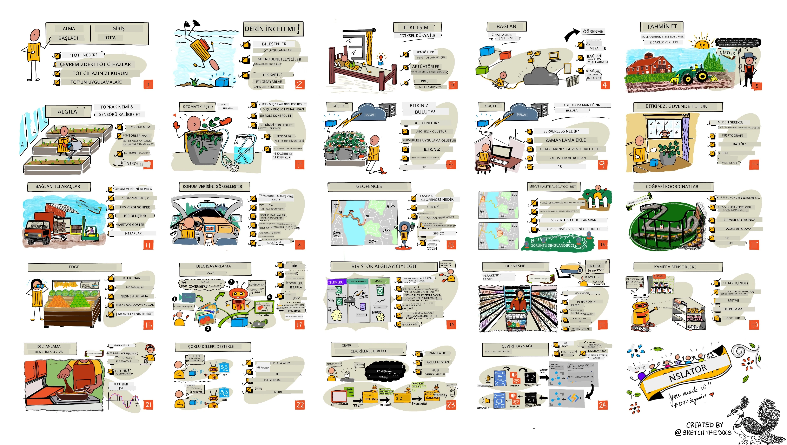

[](https://github.com/microsoft/IoT-For-Beginners/blob/master/LICENSE)
[](https://GitHub.com/microsoft/IoT-For-Beginners/graphs/contributors/)
[](https://GitHub.com/microsoft/IoT-For-Beginners/issues/)
[](https://GitHub.com/microsoft/IoT-For-Beginners/pulls/)
[](http://makeapullrequest.com)

[](https://GitHub.com/microsoft/IoT-For-Beginners/watchers/)
[](https://GitHub.com/microsoft/IoT-For-Beginners/network/)
[](https://GitHub.com/microsoft/IoT-For-Beginners/stargazers/)

### Azure AI Foundry Topluluğuna Katılın

Yapay zeka uygulamaları geliştirme konusunda takıldığınızda veya herhangi bir sorunuz olduğunda. MCP hakkında öğrenenler ve deneyimli geliştiricilerle tartışmalara katılın. Soruların memnuniyetle karşılandığı ve bilginin özgürce paylaşıldığı destekleyici bir topluluktur.

[](https://discord.gg/nTYy5BXMWG)

Ürün geri bildiriminiz veya geliştirme sırasında karşılaştığınız hatalar için:

[](https://aka.ms/foundry/forum)

Bu kaynakları kullanmaya başlamak için şu adımları izleyin:
1. **Depoyu Forklayın**: Tıklayın [](https://GitHub.com/microsoft/IoT-For-Beginners/fork)
2. **Depoyu Klonlayın**: `git clone https://github.com/microsoft/IoT-For-Beginners.git`
3. [**Microsoft Foundry Discord'una Katılın ve uzmanlar ile diğer geliştiricilerle tanışın**](https://discord.com/invite/ByRwuEEgH4)


### 🌐 Çoklu Dil Desteği

#### GitHub Action ile Desteklenmektedir (Otomatik & Her Zaman Güncel)

<!-- CO-OP TRANSLATOR LANGUAGES TABLE START -->
[Arabic](../ar/README.md) | [Bengali](../bn/README.md) | [Bulgarian](../bg/README.md) | [Burmese (Myanmar)](../my/README.md) | [Chinese (Simplified)](../zh-CN/README.md) | [Chinese (Traditional, Hong Kong)](../zh-HK/README.md) | [Chinese (Traditional, Macau)](../zh-MO/README.md) | [Chinese (Traditional, Taiwan)](../zh-TW/README.md) | [Croatian](../hr/README.md) | [Czech](../cs/README.md) | [Danish](../da/README.md) | [Dutch](../nl/README.md) | [Estonian](../et/README.md) | [Finnish](../fi/README.md) | [French](../fr/README.md) | [German](../de/README.md) | [Greek](../el/README.md) | [Hebrew](../he/README.md) | [Hindi](../hi/README.md) | [Hungarian](../hu/README.md) | [Indonesian](../id/README.md) | [Italian](../it/README.md) | [Japanese](../ja/README.md) | [Kannada](../kn/README.md) | [Khmer](../km/README.md) | [Korean](../ko/README.md) | [Lithuanian](../lt/README.md) | [Malay](../ms/README.md) | [Malayalam](../ml/README.md) | [Marathi](../mr/README.md) | [Nepali](../ne/README.md) | [Nigerian Pidgin](../pcm/README.md) | [Norwegian](../no/README.md) | [Persian (Farsi)](../fa/README.md) | [Polish](../pl/README.md) | [Portuguese (Brazil)](../pt-BR/README.md) | [Portuguese (Portugal)](../pt-PT/README.md) | [Punjabi (Gurmukhi)](../pa/README.md) | [Romanian](../ro/README.md) | [Russian](../ru/README.md) | [Serbian (Cyrillic)](../sr/README.md) | [Slovak](../sk/README.md) | [Slovenian](../sl/README.md) | [Spanish](../es/README.md) | [Swahili](../sw/README.md) | [Swedish](../sv/README.md) | [Tagalog (Filipino)](../tl/README.md) | [Tamil](../ta/README.md) | [Telugu](../te/README.md) | [Thai](../th/README.md) | [Turkish](./README.md) | [Ukrainian](../uk/README.md) | [Urdu](../ur/README.md) | [Vietnamese](../vi/README.md)

> **Yerelde Klonlamayı Tercih Ediyor musunuz?**
>
> Bu depo 50'den fazla dil çevirisini içerir, bu da indirme boyutunu önemli ölçüde artırır. Çeviriler olmadan klonlamak için seyrek kontrol kullanın:
>
> **Bash / macOS / Linux:**
> ```bash
> git clone --filter=blob:none --sparse https://github.com/microsoft/IoT-For-Beginners.git
> cd IoT-For-Beginners
> git sparse-checkout set --no-cone '/*' '!translations' '!translated_images'
> ```
>
> **CMD (Windows):**
> ```cmd
> git clone --filter=blob:none --sparse https://github.com/microsoft/IoT-For-Beginners.git
> cd IoT-For-Beginners
> git sparse-checkout set --no-cone "/*" "!translations" "!translated_images"
> ```
>
> Bu, kursu tamamlamak için ihtiyacınız olan her şeyi çok daha hızlı bir indirme ile sağlar.
<!-- CO-OP TRANSLATOR LANGUAGES TABLE END -->

# Başlangıç Seviyesi IoT - Bir Müfredat

Microsoft'taki Azure Bulut Savunucuları olarak, IoT temelleri hakkında 12 haftalık, 24 derslik bir müfredat sunmaktan memnuniyet duyuyoruz. Her ders öncesi ve sonrası quizler, dersi tamamlamak için yazılı talimatlar, çözümler, ödevler ve daha fazlasını içerir. Proje tabanlı eğitim yöntemimiz, yeni becerilerin 'kalıcı' olmasını sağlayan kanıtlanmış bir öğrenme yoludur.

Projeler, yiyeceğin çiftlikten sofraya olan yolculuğunu kapsamaktadır. Bu; çiftçilik, lojistik, üretim, perakende ve tüketici gibi IoT cihazları için popüler endüstri alanlarını içerir.



> Sketchnote [Nitya Narasimhan](https://github.com/nitya) tarafından çizilmiştir. Daha büyük bir versiyon için resme tıklayın.

**Yazarlarımız [Jen Fox](https://github.com/jenfoxbot), [Jen Looper](https://github.com/jlooper), [Jim Bennett](https://github.com/jimbobbennett) ve sketchnote sanatçımız [Nitya Narasimhan](https://github.com/nitya)'ya içten teşekkürlerimizle.**

**Ayrıca bu müfredatı inceleyip çeviren [Microsoft Learn Öğrenci Elçileri](https://studentambassadors.microsoft.com?WT.mc_id=academic-17441-jabenn) ekibimize; [Aditya Garg](https://github.com/AdityaGarg00), [Anurag Sharma](https://github.com/Anurag-0-1-A), [Arpita Das](https://github.com/Arpiiitaaa), [Aryan Jain](https://www.linkedin.com/in/aryan-jain-47a4a1145/), [Bhavesh Suneja](https://github.com/EliteWarrior315), [Faith Hunja](https://faithhunja.github.io/), [Lateefah Bello](https://www.linkedin.com/in/lateefah-bello/), [Manvi Jha](https://github.com/Severus-Matthew), [Mireille Tan](https://www.linkedin.com/in/mireille-tan-a4834819a/), [Mohammad Iftekher (Iftu) Ebne Jalal](https://github.com/Iftu119), [Mohammad Zulfikar](https://github.com/mohzulfikar), [Priyanshu Srivastav](https://www.linkedin.com/in/priyanshu-srivastav-b067241ba), [Thanmai Gowducheruvu](https://github.com/innovation-platform), ve [Zina Kamel](https://www.linkedin.com/in/zina-kamel/) teşekkür ederiz.**

Ekibi tanıyın!

[](https://youtu.be/-wippUJRi5k)

**Gif by** [Mohit Jaisal](https://linkedin.com/in/mohitjaisal)

> 🎥 Proje hakkında bir video için yukarıdaki görsele tıklayın!

> **Öğretmenler**, bu müfredatı nasıl kullanacağınızla ilgili [birkaç öneri](for-teachers.md) ekledik. Kendi derslerinizi oluşturmak istiyorsanız ayrıca bir [ders şablonu](lesson-template/README.md) da sağladık.

> **[Öğrenciler](https://aka.ms/student-page)**, bu müfredatı kendi başınıza kullanmak için, tüm depoyu fork'layın ve öncesinde quiz, dersin okunması ve diğer etkinliklerin tamamlanması ile devam edin. Çözümleri kopyalamak yerine dersleri anlayarak projeleri oluşturmayı deneyin; ancak çözüm kodları her proje odaklı dersin /solutions klasöründe mevcuttur. Bir diğer yöntem, arkadaşlarınızla bir çalışma grubu oluşturup birlikte içerikleri incelemek olabilir. Daha fazla çalışma için [Microsoft Learn](https://docs.microsoft.com/users/jimbobbennett/collections/ke2ehd351jopwr?WT.mc_id=academic-17441-jabenn) öneriyoruz.

Bu kursun video genel görünümünü izlemek için, bu videoya göz atın:

[](https://youtube.com/watch?v=bccEMm8gRuc "Tanıtım videosu")

> 🎥 Proje hakkında bir video için yukarıdaki görsele tıklayın!

## Pedagoji

Bu müfredatı oluştururken iki pedagojik ilke seçtik: proje tabanlı olması ve sık quizler içermesi. Serinin sonunda öğrenciler, bitki izleme ve sulama sistemi, araç izleyici, yiyecekleri izleyip kontrol eden akıllı fabrika kurulumu ve sesle kontrol edilen pişirme zamanlayıcısı gibi projeler yapacak ve IoT temellerini öğrenecekler; cihaz kodu yazmayı, buluta bağlanmayı, telemetri analizini ve uçta yapay zekanın çalıştırılmasını.

İçeriğin projelerle uyumlu olması, süreci öğrenciler için daha ilgi çekici hale getirir ve kavramların akılda kalma oranını artırır.

Ayrıca, ders öncesi düşük riskli bir quiz öğrencinin öğrenme niyetini belirlerken, ders sonrası ikinci bir quiz bilgilerin pekişmesini sağlar. Bu müfredat esnek ve eğlenceli olacak şekilde tasarlandı ve tümüyle veya parça parça alınabilir. Projeler ufak başlayıp 12 haftalık döngünün sonunda giderek karmaşıklaşır.

Her proje, öğrencilere ve hobiseverlere sunulan gerçek dünya donanımı etrafında şekillenir. Her proje, ilgili proje alanına bakarak gerekli arka plan bilgisini sağlar. Başarılı bir geliştirici olmak için, çözümlediğiniz problemin alanını anlamak yardımcı olur; bu arka plan bilgisi öğrencilere IoT çözümlerini ve öğrenimlerini, bir IoT geliştirici olarak karşılaşabilecekleri gerçek dünya problemlerinin bağlamında düşünme imkanı verir. Öğrenciler, inşa ettikleri çözümlerin 'neden'ini öğrenir ve nihai kullanıcıyı anlar.

## Donanım
Projelerde kullanılacak IoT donanımı için kişisel tercihe, programlama dili bilgisine veya tercihlerine, öğrenme hedeflerine ve kullanılabilirliğe bağlı olarak iki donanım seçeneğimiz var. Ayrıca, donanıma erişimi olmayanlar veya satın almadan önce daha fazla bilgi edinmek isteyenler için 'sanal donanım' sürümünü sağladık. Daha fazlasını okuyabilir ve Seeed Studio’daki arkadaşlarımızdan tam set satın alım bağlantılarını içeren 'alışveriş listesi'ni [donanım sayfasında](./hardware.md) bulabilirsiniz.

> 💁 [Davranış Kurallarımızı](CODE_OF_CONDUCT.md), [Katkıda Bulunma](CONTRIBUTING.md) ve [Çeviri](..) rehberlerimizi bulun. Yapıcı geri bildiriminizi memnuniyetle karşılıyoruz!
>
> 🔧 Sorun mu yaşıyorsunuz? Yaygın sorunların çözümleri için [Sorun Giderme Rehberi](TROUBLESHOOTING.md) sayfamıza göz atın.

## Her ders şunları içerir:

- çizim notu
- isteğe bağlı ek video
- ders öncesi ısınma testi
- yazılı ders
- proje tabanlı dersler için, projeyi nasıl yapacağınıza dair adım adım rehberler
- bilgi kontrolü
- bir meydan okuma
- ek okumalar
- görev
- [ders sonrası test](https://ff-quizzes.netlify.app/en/)

> **Testler hakkında not:** Tüm testler quiz-app klasöründe toplanmıştır, toplamda üç sorudan oluşan 48 test vardır. Derslerin içinde bağlantılar verilmiştir ancak quiz uygulamasını yerel olarak çalıştırabilir veya Azure’a dağıtabilirsiniz; quiz-app klasöründeki talimatları izleyin. Testler kademeli olarak yerelleştirilmektedir.

## Dersler

|       |                  Proje Adı                   |                        Öğretilen Kavramlar                         | Öğrenme Hedefleri                                                                                                                                                  |                                                      Bağlı Ders                                                      |
| :---: | :-------------------------------------------: | :-----------------------------------------------------------------: | ----------------------------------------------------------------------------------------------------------------------------------------------------------------- | :-----------------------------------------------------------------------------------------------------------------: |
|  01   | [Başlangıç](./1-getting-started/README.md)  |                          IoT'ye Giriş                             | İlk IoT cihazınızı kurarken IoT'nin temel prensiplerini ve sensörler ile bulut hizmetleri gibi IoT çözümlerinin temel yapı taşlarını öğrenin                         |                     [IoT'ye Giriş](./1-getting-started/lessons/1-introduction-to-iot/README.md)                     |
|  02   | [Başlangıç](./1-getting-started/README.md)  |                        IoT'ye Daha Derin Bakış                    | Bir IoT sisteminin bileşenleri, mikrodenetleyiciler ve tek kart bilgisayarlar hakkında daha fazla bilgi edinin                                                    |                       [IoT'ye Daha Derin Bakış](./1-getting-started/lessons/2-deeper-dive/README.md)                |
|  03   | [Başlangıç](./1-getting-started/README.md)  |            Sensörler ve aktüatörlerle fiziksel dünya ile etkileşim | Fiziksel dünyadan veri toplamak için sensörler ve geri bildirim göndermek için aktüatörler hakkında bilgi edinin ve bir gece lambası yaparken uygulayın          | [Sensörler ve aktüatörlerle fiziksel dünya ile etkileşim](./1-getting-started/lessons/3-sensors-and-actuators/README.md) |
|  04   | [Başlangıç](./1-getting-started/README.md)  |                     Cihazınızı İnternete Bağlayın                 | Gece lambanızı bir MQTT aracısına bağlayarak IoT cihazınızı İnternete mesaj gönderip alacak şekilde nasıl bağlayacağınızı öğrenin                                |               [Cihazınızı İnternete Bağlayın](./1-getting-started/lessons/4-connect-internet/README.md)             |
|  05   |           [Çiftlik](./2-farm/README.md)      |                        Bitki büyümesini tahmin etme               | IoT cihazınızla yakalanan sıcaklık verilerini kullanarak bitki büyümesini nasıl tahmin edeceğinizi öğrenin                                                        |                       [Bitki büyümesini tahmin etme](./2-farm/lessons/1-predict-plant-growth/README.md)             |
|  06   |           [Çiftlik](./2-farm/README.md)      |                         Toprak nemini algılama                    | Toprak nemini nasıl algılayacağınızı ve bir toprak nem sensörünü nasıl kalibre edeceğinizi öğrenin                                                                  |                          [Toprak nemini algılama](./2-farm/lessons/2-detect-soil-moisture/README.md)                |
|  07   |           [Çiftlik](./2-farm/README.md)      |                      Otomatik bitki sulama                        | Röle ve MQTT kullanarak sulamayı nasıl otomatikleştireceğinizi ve zamanlayacağınızı öğrenin                                                                        |                    [Otomatik bitki sulama](./2-farm/lessons/3-automated-plant-watering/README.md)                   |
|  08   |           [Çiftlik](./2-farm/README.md)      |                      Bitkinizi buluta taşıma                       | Bulut ve bulutta barındırılan IoT hizmetleri hakkında bilgi edinin ve bitkinizi bir genel MQTT aracısı yerine bunlardan birine nasıl bağlayacağınızı öğrenin        |               [Bitkinizi buluta taşıma](./2-farm/lessons/4-migrate-your-plant-to-the-cloud/README.md)                |
|  09   |           [Çiftlik](./2-farm/README.md)      |                  Uygulama mantığınızı buluta taşıma               | IoT mesajlarına yanıt veren uygulama mantığını bulutta nasıl yazabileceğinizi öğrenin                                                                              |            [Uygulama mantığınızı buluta taşıma](./2-farm/lessons/5-migrate-application-to-the-cloud/README.md)       |
|  10   |           [Çiftlik](./2-farm/README.md)      |                       Bitkinizi güvende tutma                     | IoT güvenliği ve anahtarlar ile sertifikalar kullanarak bitkinizi nasıl güvende tutabileceğinizi öğrenin                                                           |                      [Bitkinizi güvende tutma](./2-farm/lessons/6-keep-your-plant-secure/README.md)                 |
|  11   |       [Ulaşım](./3-transport/README.md)      |                        Konum takibi                               | IoT cihazları için GPS konum takibi hakkında bilgi edinin                                                                                                          |                        [Konum takibi](./3-transport/lessons/1-location-tracking/README.md)                            |
|  12   |       [Ulaşım](./3-transport/README.md)      |                         Konum verilerini saklama                   | Daha sonra görselleştirmek veya analiz etmek üzere IoT verilerini nasıl depolayacağınızı öğrenin                                                                    |                       [Konum verilerini saklama](./3-transport/lessons/2-store-location-data/README.md)              |
|  13   |       [Ulaşım](./3-transport/README.md)      |                       Konum verilerini görselleştirme             | Konum verilerini harita üzerinde nasıl görselleştireceğinizi ve haritaların gerçek 3B dünyayı 2 boyutlu olarak nasıl temsil ettiğini öğrenin                      |                    [Konum verilerini görselleştirme](./3-transport/lessons/3-visualize-location-data/README.md)       |
|  14   |       [Ulaşım](./3-transport/README.md)      |                            Coğrafi sınırlar                        | Coğrafi sınırlar (geofences) hakkında bilgi edinin ve tedarik zincirindeki araçların hedeflerine yaklaştığında nasıl uyarı verebileceğinizi öğrenin                |                                [Coğrafi sınırlar](./3-transport/lessons/4-geofences/README.md)                         |
|  15   |    [Üretim](./4-manufacturing/README.md)     |                    Meyve kalite detektörü eğitimi                 | Bulutta meyve kalitesini algılayan bir görüntü sınıflandırıcı eğitimi hakkında bilgi edinin                                                                        |                   [Meyve kalite detektörü eğitimi](./4-manufacturing/lessons/1-train-fruit-detector/README.md)          |
|  16   |    [Üretim](./4-manufacturing/README.md)     |                  IoT cihazından meyve kalitesini kontrol etme     | IoT cihazınız üzerinden meyve kalite detektörünüzü nasıl kullanacağınızı öğrenin                                                                                   |                  [IoT cihazından meyve kalitesini kontrol etme](./4-manufacturing/lessons/2-check-fruit-from-device/README.md) |
|  17   |    [Üretim](./4-manufacturing/README.md)     |                     Meyve detektörünüzü uçta çalıştırma           | Meyve detektörünüzü uçtaki IoT cihazında nasıl çalıştıracağınızı öğrenin                                                                                           |                  [Meyve detektörünüzü uçta çalıştırma](./4-manufacturing/lessons/3-run-fruit-detector-edge/README.md)    |
|  18   |    [Üretim](./4-manufacturing/README.md)     |                 Sensörden meyve kalitesi algılamasını tetikleme   | Sensörden meyve kalitesi algılamasını tetikleme hakkında bilgi edinin                                                                                              |                 [Sensörden meyve kalitesi algılamasını tetikleme](./4-manufacturing/lessons/4-trigger-fruit-detector/README.md) |
|  19   |           [Perakende](./5-retail/README.md)   |                       Stok detektörü eğitimi                      | Bir mağazadaki stok miktarını saymak için nesne algılama kullanarak stok detektörü eğitimi nasıl yapılır öğrenin                                                |                         [Stok detektörü eğitimi](./5-retail/lessons/1-train-stock-detector/README.md)                 |
|  20   |           [Perakende](./5-retail/README.md)   |                     IoT cihazından stok kontrolü                  | Nesne algılama modeli kullanarak IoT cihazı üzerinden stok kontrolü nasıl yapılır öğrenin                                                                          |                     [IoT cihazından stok kontrolü](./5-retail/lessons/2-check-stock-device/README.md)                  |
|  21   |         [Tüketici](./6-consumer/README.md)    |                   IoT cihazıyla konuşmayı tanıma                  | Bir IoT cihazından konuşmayı tanıyarak akıllı zamanlayıcı yapmayı öğrenin                                                                                         |                  [IoT cihazıyla konuşmayı tanıma](./6-consumer/lessons/1-speech-recognition/README.md)                 |
|  22   |         [Tüketici](./6-consumer/README.md)    |                          Dil anlama                               | Bir IoT cihazına söylenen cümleleri anlama hakkında bilgi edinin                                                                                                  |                       [Dil anlama](./6-consumer/lessons/2-language-understanding/README.md)                             |
|  23   |         [Tüketici](./6-consumer/README.md)    |              Zamanlayıcı kurma ve sözlü geri bildirim verme       | Bir IoT cihazında zamanlayıcı kurmayı ve zamanlayıcı ayarlandığında ve bittiğinde sözlü geri bildirim vermeyi öğrenin                                           |                [Zamanlayıcı kurma ve sözlü geri bildirim verme](./6-consumer/lessons/3-spoken-feedback/README.md)      |
|  24   |         [Tüketici](./6-consumer/README.md)    |                      Birden çok dili destekleme                   | Hem konuşulan hem de zamanlayıcınızın verdiği yanıtların birden fazla dili desteklemesini öğrenin                                                                 |                  [Birden çok dili destekleme](./6-consumer/lessons/4-multiple-language-support/README.md)               |

## Çevrimdışı erişim

Bu dokümantasyonu [Docsify](https://docsify.js.org/#/) kullanarak çevrimdışı çalıştırabilirsiniz. Bu depoyu çatallayın, yerel makinenize [Docsify'ı yükleyin](https://docsify.js.org/#/quickstart) ve ardından bu deponun kök klasöründe `docsify serve` yazın. Web sitesi localhost’ta 3000 portunda servis edilecektir: `localhost:3000`.

## Quiz

Her bölümdeki bilginizi test eden etkileşimli quiz’i barındıran topluluğa teşekkür ederiz. Bilginizi [buradan](https://ff-quizzes.netlify.app/en/) test edebilirsiniz.

### PDF

İsterseniz bu içeriğin çevrimdışı erişim için PDF’sini oluşturabilirsiniz. Bunu yapmak için [npm yüklü](https://docs.npmjs.com/downloading-and-installing-node-js-and-npm) olduğundan emin olun ve bu deponun kök klasöründe aşağıdaki komutları çalıştırın:

```sh
npm i
npm run convert
```

### Slaytlar

Bazı dersler için [slides](../../slides) klasöründe slayt sunumları bulunmaktadır.

## Diğer Müfredatlar

Ekibimiz başka müfredatlar da üretiyor! Bakınız:

<!-- CO-OP TRANSLATOR OTHER COURSES START -->
### LangChain
[](https://aka.ms/langchain4j-for-beginners)
[](https://aka.ms/langchainjs-for-beginners?WT.mc_id=m365-94501-dwahlin)
[](https://github.com/microsoft/langchain-for-beginners?WT.mc_id=m365-94501-dwahlin)
---

### Azure / Edge / MCP / Agents
[](https://github.com/microsoft/AZD-for-beginners?WT.mc_id=academic-105485-koreyst)
[](https://github.com/microsoft/edgeai-for-beginners?WT.mc_id=academic-105485-koreyst)
[](https://github.com/microsoft/mcp-for-beginners?WT.mc_id=academic-105485-koreyst)
[](https://github.com/microsoft/ai-agents-for-beginners?WT.mc_id=academic-105485-koreyst)

---
 
### Üretken AI Serisi
[](https://github.com/microsoft/generative-ai-for-beginners?WT.mc_id=academic-105485-koreyst)
[-9333EA?style=for-the-badge&labelColor=E5E7EB&color=9333EA)](https://github.com/microsoft/Generative-AI-for-beginners-dotnet?WT.mc_id=academic-105485-koreyst)
[-C084FC?style=for-the-badge&labelColor=E5E7EB&color=C084FC)](https://github.com/microsoft/generative-ai-for-beginners-java?WT.mc_id=academic-105485-koreyst)
[-E879F9?style=for-the-badge&labelColor=E5E7EB&color=E879F9)](https://github.com/microsoft/generative-ai-with-javascript?WT.mc_id=academic-105485-koreyst)

---
 
### Temel Öğrenme
[](https://aka.ms/ml-beginners?WT.mc_id=academic-105485-koreyst)
[](https://aka.ms/datascience-beginners?WT.mc_id=academic-105485-koreyst)
[](https://aka.ms/ai-beginners?WT.mc_id=academic-105485-koreyst)
[](https://github.com/microsoft/Security-101?WT.mc_id=academic-96948-sayoung)
[](https://aka.ms/webdev-beginners?WT.mc_id=academic-105485-koreyst)
[](https://aka.ms/iot-beginners?WT.mc_id=academic-105485-koreyst)
[](https://github.com/microsoft/xr-development-for-beginners?WT.mc_id=academic-105485-koreyst)

---
 
### Copilot Serisi
[](https://aka.ms/GitHubCopilotAI?WT.mc_id=academic-105485-koreyst)
[](https://github.com/microsoft/mastering-github-copilot-for-dotnet-csharp-developers?WT.mc_id=academic-105485-koreyst)
[](https://github.com/microsoft/CopilotAdventures?WT.mc_id=academic-105485-koreyst)
<!-- CO-OP TRANSLATOR OTHER COURSES END -->

## Görsel atıfları

Bu müfredatta kullanılan görseller için gereken atıfları [Atıflar](./attributions.md) dosyasında bulabilirsiniz.

---

<!-- CO-OP TRANSLATOR DISCLAIMER START -->
**Feragatname**:  
Bu belge, AI çeviri servisi [Co-op Translator](https://github.com/Azure/co-op-translator) kullanılarak çevrilmiştir. Doğruluk için çaba gösterilse de, otomatik çevirilerin hatalar veya yanlışlıklar içerebileceğini lütfen unutmayın. Orijinal belge, kendi ana dilinde, otoriter kaynak olarak kabul edilmelidir. Kritik bilgiler için profesyonel insan çevirisi önerilir. Bu çevirinin kullanımı nedeniyle oluşabilecek yanlış anlamalar veya yanlış yorumlamalardan sorumlu değiliz.
<!-- CO-OP TRANSLATOR DISCLAIMER END -->