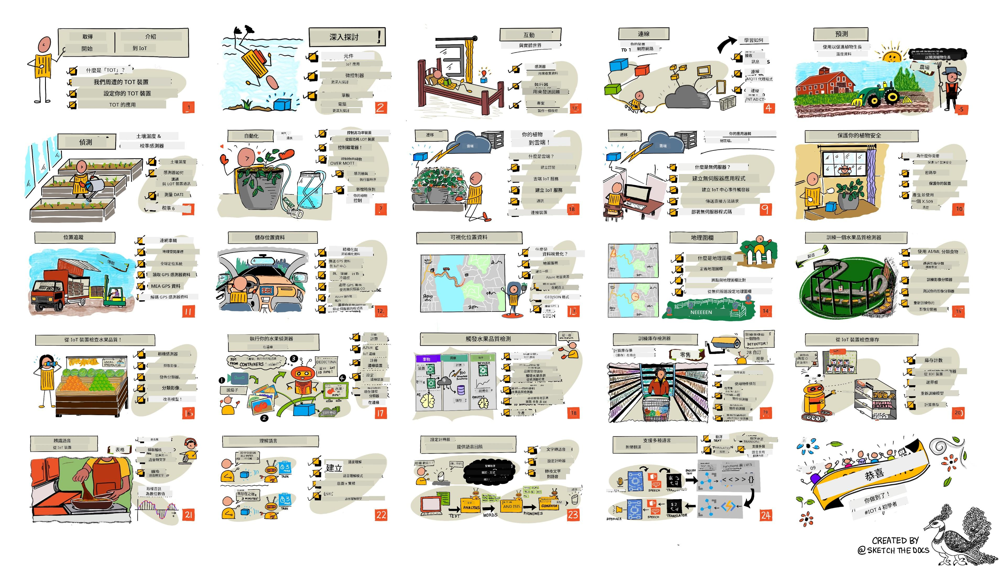

<!--
CO_OP_TRANSLATOR_METADATA:
{
  "original_hash": "6c354ec3487e4f6cfafbe44557996cd9",
  "translation_date": "2026-01-05T17:28:04+00:00",
  "source_file": "README.md",
  "language_code": "tw"
}
-->
[](https://github.com/microsoft/IoT-For-Beginners/blob/master/LICENSE)
[](https://GitHub.com/microsoft/IoT-For-Beginners/graphs/contributors/)
[](https://GitHub.com/microsoft/IoT-For-Beginners/issues/)
[](https://GitHub.com/microsoft/IoT-For-Beginners/pulls/)
[](http://makeapullrequest.com)

[](https://GitHub.com/microsoft/IoT-For-Beginners/watchers/)
[](https://GitHub.com/microsoft/IoT-For-Beginners/network/)
[](https://GitHub.com/microsoft/IoT-For-Beginners/stargazers/)

### 加入 Azure AI Foundry 社群

如果您在建立 AI 應用程式時遇到困難或有任何問題，歡迎加入學習者與經驗豐富開發者們的 MCP 討論社群。這是一個支持性的社群，歡迎提問並自由分享知識。

[](https://discord.gg/nTYy5BXMWG)

如果您在建置過程中有產品回饋或錯誤，請造訪：

[](https://aka.ms/foundry/forum)

請依照以下步驟開始使用這些資源：
1. **Fork 倉庫**：點擊 [](https://GitHub.com/microsoft/IoT-For-Beginners/fork)
2. **Clone 倉庫**：   `git clone https://github.com/microsoft/IoT-For-Beginners.git`
3. [**加入 Microsoft Foundry Discord，與專家和其他開發者交流**](https://discord.com/invite/ByRwuEEgH4)


### 🌐 多語系支援

#### 透過 GitHub Action 支援（自動且永遠保持最新）

<!-- CO-OP TRANSLATOR LANGUAGES TABLE START -->
[Arabic](../ar/README.md) | [Bengali](../bn/README.md) | [Bulgarian](../bg/README.md) | [Burmese (Myanmar)](../my/README.md) | [Chinese (Simplified)](../zh/README.md) | [Chinese (Traditional, Hong Kong)](../hk/README.md) | [Chinese (Traditional, Macau)](../mo/README.md) | [Chinese (Traditional, Taiwan)](./README.md) | [Croatian](../hr/README.md) | [Czech](../cs/README.md) | [Danish](../da/README.md) | [Dutch](../nl/README.md) | [Estonian](../et/README.md) | [Finnish](../fi/README.md) | [French](../fr/README.md) | [German](../de/README.md) | [Greek](../el/README.md) | [Hebrew](../he/README.md) | [Hindi](../hi/README.md) | [Hungarian](../hu/README.md) | [Indonesian](../id/README.md) | [Italian](../it/README.md) | [Japanese](../ja/README.md) | [Kannada](../kn/README.md) | [Korean](../ko/README.md) | [Lithuanian](../lt/README.md) | [Malay](../ms/README.md) | [Malayalam](../ml/README.md) | [Marathi](../mr/README.md) | [Nepali](../ne/README.md) | [Nigerian Pidgin](../pcm/README.md) | [Norwegian](../no/README.md) | [Persian (Farsi)](../fa/README.md) | [Polish](../pl/README.md) | [Portuguese (Brazil)](../br/README.md) | [Portuguese (Portugal)](../pt/README.md) | [Punjabi (Gurmukhi)](../pa/README.md) | [Romanian](../ro/README.md) | [Russian](../ru/README.md) | [Serbian (Cyrillic)](../sr/README.md) | [Slovak](../sk/README.md) | [Slovenian](../sl/README.md) | [Spanish](../es/README.md) | [Swahili](../sw/README.md) | [Swedish](../sv/README.md) | [Tagalog (Filipino)](../tl/README.md) | [Tamil](../ta/README.md) | [Telugu](../te/README.md) | [Thai](../th/README.md) | [Turkish](../tr/README.md) | [Ukrainian](../uk/README.md) | [Urdu](../ur/README.md) | [Vietnamese](../vi/README.md)

> **偏好本機 Clone？**

> 本倉庫包含 50 多種語言翻譯，會大幅增加下載大小。若想不下載翻譯檔，可以使用 sparse checkout：
> ```bash
> git clone --filter=blob:none --sparse https://github.com/microsoft/IoT-For-Beginners.git
> cd IoT-For-Beginners
> git sparse-checkout set --no-cone '/*' '!translations' '!translated_images'
> ```
> 這樣可以更快完成下載，並擁有完成課程所需的所有內容。
<!-- CO-OP TRANSLATOR LANGUAGES TABLE END -->

# 初學者的物聯網課程大綱

Microsoft 的 Azure Cloud Advocates 很高興提供一套為期 12 週、共 24 課的物聯網基礎課程。每堂課包含課前與課後小測驗、完整的書面教學步驟、解答、作業等。我們以專案導向教學，讓你邊學邊做，這是讓新技能穩固內化的有效方式。

這些專案涵蓋從農場到餐桌的完整過程。包含農業、生產製造、物流、零售和消費等領域——均為物聯網裝置應用的熱門產業。



> 筆記由 [Nitya Narasimhan](https://github.com/nitya) 繪製。點擊圖片可看大圖版本。

**特別感謝作者 [Jen Fox](https://github.com/jenfoxbot)、[Jen Looper](https://github.com/jlooper)、[Jim Bennett](https://github.com/jimbobbennett) 與我們的手繪藝術家 [Nitya Narasimhan](https://github.com/nitya) 的努力付出。**

**同時感謝 [Microsoft Learn 學生大使團隊](https://studentambassadors.microsoft.com?WT.mc_id=academic-17441-jabenn)，他們審閱與翻譯了這份課程，包括：[Aditya Garg](https://github.com/AdityaGarg00)、[Anurag Sharma](https://github.com/Anurag-0-1-A)、[Arpita Das](https://github.com/Arpiiitaaa)、[Aryan Jain](https://www.linkedin.com/in/aryan-jain-47a4a1145/)、[Bhavesh Suneja](https://github.com/EliteWarrior315)、[Faith Hunja](https://faithhunja.github.io/)、[Lateefah Bello](https://www.linkedin.com/in/lateefah-bello/)、[Manvi Jha](https://github.com/Severus-Matthew)、[Mireille Tan](https://www.linkedin.com/in/mireille-tan-a4834819a/)、[Mohammad Iftekher (Iftu) Ebne Jalal](https://github.com/Iftu119)、[Mohammad Zulfikar](https://github.com/mohzulfikar)、[Priyanshu Srivastav](https://www.linkedin.com/in/priyanshu-srivastav-b067241ba)、[Thanmai Gowducheruvu](https://github.com/innovation-platform)、和 [Zina Kamel](https://www.linkedin.com/in/zina-kamel/)。**

認識團隊！

[](https://youtu.be/-wippUJRi5k)

**動圖由** [Mohit Jaisal](https://linkedin.com/in/mohitjaisal) 製作

> 🎥 點擊上方圖片觀看專案介紹影片！

> **教師們**，我們[提供了一些建議](for-teachers.md)教你如何使用這份課程。如果你想自行建立課程，也有[課程模板](lesson-template/README.md)可供使用。

> **[學生](https://aka.ms/student-page)**，如果想自行使用這份課程，請 fork 整個倉庫並自行完成練習，先從課前小測驗開始，然後閱讀講義並完成後續活動。盡量透過理解課程來自行創作專案，而非直接複製解答程式碼；不過解答程式碼可在每個專案導向課程的 /solutions 資料夾找到。另一個選項是與朋友組成讀書會，一起學習內容。想更深入學習，我們推薦 [Microsoft Learn](https://docs.microsoft.com/users/jimbobbennett/collections/ke2ehd351jopwr?WT.mc_id=academic-17441-jabenn)。

想看本課程影片總覽：

[](https://youtube.com/watch?v=bccEMm8gRuc "Promo video")

> 🎥 點擊上方圖片觀看專案介紹影片！

## 教學理念

本課程設計遵循兩項教學原則：專案導向及頻繁的小測驗。完成系列課程後，學生將建立一套植物監控及灌溉系統、車輛追蹤系統、一個智慧工廠用於監測與檢查食品，還有一個語音控制的烹飪定時器，並學會物聯網基礎知識，包括撰寫裝置程式、連接雲端、分析遙測資料及在邊緣執行 AI。

藉由將內容與專案對齊，能提高學生的參與度並加深對概念的記憶。

此外，課前低壓的小測幫助學生建立學習目標，課後的測驗則促進知識鞏固。本課程靈活、有趣，可全程參與或就部分學習。專案從簡單開始，並在 12 週結束時逐步變得更有挑戰性。

每個專案均以學生與興趣者可取得的實體硬體為基礎。每個專案會介紹特定領域背景知識。若要成為成功的開發者，了解問題所在的領域非常重要，提供這些背景知識讓學生能從物聯網開發者視角思考方案與學習點。學生會學習到所建方案的「原因」，並認識終端使用者需求。

## 硬體設備

專案使用的物聯網硬體有兩種選擇，取決於個人喜好、程式語言背景、學習目標和硬體取得情況。我們也提供一個“虛擬硬體”版本，供無法取得實體硬體、或想先學習後再決定購買的人使用。您可以在[硬體頁面](./hardware.md)看到更多資訊，以及由我們的合作夥伴 Seeed Studio 提供的完整套件購買連結。
> 💁 找到我們的[行為準則](CODE_OF_CONDUCT.md)、[貢獻指南](CONTRIBUTING.md)和[翻譯指南](TRANSLATIONS.md)。歡迎您提供建設性的回饋！
>
> 🔧 遇到問題？查看我們的[故障排除指南](TROUBLESHOOTING.md)以獲得常見問題的解決方案。

## 每堂課包含：

- 手繪筆記
- 可選的補充影片
- 課前熱身測驗
- 書面課程內容
- 對於專案導向課程，逐步建置專案的指南
- 知識檢測
- 挑戰任務
- 補充閱讀
- 作業
- [課後測驗](https://ff-quizzes.netlify.app/en/)

> **關於測驗的說明**：所有測驗都包含在 quiz-app 資料夾中，共有 48 個測驗，每個測驗包含三題問題。測驗從課程內容中連結，但 quiz 應用程式可在本機執行或部署到 Azure；請遵循 `quiz-app` 資料夾中的指示。目前測驗逐步進行在地化。

## 課程

|       |              專案名稱               |                         教授概念                          | 學習目標                                                                                                                                                         |                                                        相關課程                                                         |
| :---: | :------------------------------: | :-----------------------------------------------------: | -------------------------------------------------------------------------------------------------------------------------------------------------------------- | :------------------------------------------------------------------------------------------------------------------------: |
|  01   | [入門指南](./1-getting-started/README.md) |                      物聯網簡介                      | 學習物聯網的基本原理及物聯網解決方案的基本組成，如感測器與雲端服務，同時設置第一個物聯網設備                                                                                            |                        [物聯網簡介](./1-getting-started/lessons/1-introduction-to-iot/README.md)                        |
|  02   | [入門指南](./1-getting-started/README.md) |                  更深入的物聯網介紹                  | 更了解物聯網系統的組件，以及微控制器與單板電腦                                                                                                                           |                      [更深入的物聯網介紹](./1-getting-started/lessons/2-deeper-dive/README.md)                       |
|  03   | [入門指南](./1-getting-started/README.md) | 使用感測器與執行器與物理世界互動 | 了解感測器收集物理世界資料與執行器回饋訊息，並建立一盞夜燈                                                                                                                    | [使用感測器與執行器與物理世界互動](./1-getting-started/lessons/3-sensors-and-actuators/README.md) |
|  04   | [入門指南](./1-getting-started/README.md) |             將你的裝置連接到網際網路              | 學習如何將物聯網裝置連接到網際網路，發送和接收訊息，將你的夜燈連接到 MQTT 仲介軟體                                                                                                  |               [將你的裝置連接到網際網路](./1-getting-started/lessons/4-connect-internet/README.md)                |
|  05   |           [農場](./2-farm/README.md)           |                   預測植物生長                    | 學習如何利用物聯網裝置擷取的溫度資料來預測植物生長                                                                                                          |                        [預測植物生長](./2-farm/lessons/1-predict-plant-growth/README.md)                          |
|  06   |           [農場](./2-farm/README.md)           |                   偵測土壤濕度                    | 學習如何偵測土壤濕度及校正土壤濕度感測器                                                                                                                        |                        [偵測土壤濕度](./2-farm/lessons/2-detect-soil-moisture/README.md)                          |
|  07   |           [農場](./2-farm/README.md)           |                  自動化植物澆水                     | 學習使用繼電器和 MQTT 來自動化與定時澆水                                                                                                                       |                    [自動化植物澆水](./2-farm/lessons/3-automated-plant-watering/README.md)                         |
|  08   |           [農場](./2-farm/README.md)           |               將植物遷移至雲端                     | 了解雲端及雲端主機物聯網服務，如何將植物連接至其一，替代公共 MQTT 仲介軟體                                                                                                         |                [將植物遷移至雲端](./2-farm/lessons/4-migrate-your-plant-to-the-cloud/README.md)                     |
|  09   |           [農場](./2-farm/README.md)           |              將應用程式邏輯遷移至雲端               | 學習如何在雲端撰寫回應物聯網訊息的應用程式邏輯                                                                                                               |           [將應用程式邏輯遷移至雲端](./2-farm/lessons/5-migrate-application-to-the-cloud/README.md)              |
|  10   |           [農場](./2-farm/README.md)           |                     保護植物安全                   | 了解物聯網安全，如何使用金鑰與憑證保護你的植物                                                                                                             |                    [保護植物安全](./2-farm/lessons/6-keep-your-plant-secure/README.md)                            |
|  11   |       [運輸](./3-transport/README.md)       |                    位置追蹤                       | 了解物聯網裝置的 GPS 位置追蹤                                                                                                                                |                       [位置追蹤](./3-transport/lessons/1-location-tracking/README.md)                             |
|  12   |       [運輸](./3-transport/README.md)       |                    儲存位置資料                    | 學習如何儲存物聯網資料以便後續視覺化或分析                                                                                                                  |                      [儲存位置資料](./3-transport/lessons/2-store-location-data/README.md)                         |
|  13   |       [運輸](./3-transport/README.md)       |                   視覺化位置資料                   | 了解如何在地圖上視覺化位置資料，及地圖如何將真實三維世界展現為二维                                                                                                   |                    [視覺化位置資料](./3-transport/lessons/3-visualize-location-data/README.md)                      |
|  14   |       [運輸](./3-transport/README.md)       |                      地理圍籬                      | 了解地理圍欄及其如何用於當供應鏈內車輛接近目的地時發出警示                                                                                                     |                               [地理圍籬](./3-transport/lessons/4-geofences/README.md)                              |
|  15   |  [製造](./4-manufacturing/README.md)  |                 訓練水果品質檢測器                 | 了解如何在雲端訓練影像分類器以偵測水果品質                                                                                                                    |               [訓練水果品質檢測器](./4-manufacturing/lessons/1-train-fruit-detector/README.md)                    |
|  16   |  [製造](./4-manufacturing/README.md)  |                 從物聯網裝置檢測水果品質            | 了解如何從物聯網裝置使用水果品質檢測器                                                                                                                      |             [從物聯網裝置檢測水果品質](./4-manufacturing/lessons/2-check-fruit-from-device/README.md)              |
|  17   |  [製造](./4-manufacturing/README.md)  |               在邊緣設備運行水果檢測器              | 了解如何在邊緣的物聯網裝置上運行水果檢測器                                                                                                                  |               [在邊緣設備運行水果檢測器](./4-manufacturing/lessons/3-run-fruit-detector-edge/README.md)            |
|  18   |  [製造](./4-manufacturing/README.md)  |             從感測器觸發水果品質檢測                | 了解如何從感測器觸發水果品質檢測                                                                                                                            |            [從感測器觸發水果品質檢測](./4-manufacturing/lessons/4-trigger-fruit-detector/README.md)                |
|  19   |         [零售](./5-retail/README.md)         |                   訓練庫存檢測器                   | 學習如何使用物件檢測訓練庫存檢測器，以統計商店中的庫存數量                                                                                                   |                      [訓練庫存檢測器](./5-retail/lessons/1-train-stock-detector/README.md)                        |
|  20   |         [零售](./5-retail/README.md)         |               從物聯網裝置檢查庫存                 | 了解如何透過物聯網裝置使用物件偵測模型檢查庫存                                                                                                             |                   [從物聯網裝置檢查庫存](./5-retail/lessons/2-check-stock-device/README.md)                       |
|  21   |       [消費者](./6-consumer/README.md)       |              從物聯網裝置識別語音                   | 學習如何從物聯網裝置識別語音來建立智慧計時器                                                                                                               |                [從物聯網裝置識別語音](./6-consumer/lessons/1-speech-recognition/README.md)                        |
|  22   |       [消費者](./6-consumer/README.md)       |                  理解語言                           | 學習如何理解對物聯網裝置講述的句子                                                                                                                        |                        [理解語言](./6-consumer/lessons/2-language-understanding/README.md)                          |
|  23   |       [消費者](./6-consumer/README.md)       |           設定計時器並提供語音反饋                  | 學習如何在物聯網裝置設定計時器，並在計時開始與結束時給予語音反饋                                                                                            |                  [設定計時器並提供語音反饋](./6-consumer/lessons/3-spoken-feedback/README.md)                      |
|  24   |       [消費者](./6-consumer/README.md)       |                 支援多種語言                        | 學習如何支援多語言，包含使用者講話以及智慧計時器的回應                                                                                                     |                    [支援多種語言](./6-consumer/less-consumer/lessons/4-multiple-language-support/README.md)          |

## 離線存取

您可以使用 [Docsify](https://docsify.js.org/#/) 離線執行本文件。複製此倉庫、在您的本機端[安裝 Docsify](https://docsify.js.org/#/quickstart)，然後在此倉庫根目錄輸入 `docsify serve`。網站會在本機端 3000 埠執行：`localhost:3000`。

## 測驗

感謝社群提供這個互動測驗，測驗您在每個章節的知識程度。您可以在[這裡](https://ff-quizzes.netlify.app/en/)測試您的知識。

### PDF

如有需要，您可以生成本文內容的 PDF 用於離線存取。為此，請確保您已[安裝 npm](https://docs.npmjs.com/downloading-and-installing-node-js-and-npm)，並在此倉庫根目錄執行以下命令：

```sh
npm i
npm run convert
```

### 投影片

部分課程擁有投影片檔案，位於 [slides](../../slides) 資料夾中。


## 其他課程

我們團隊也製作其他課程！歡迎參考：

<!-- CO-OP TRANSLATOR OTHER COURSES START -->
### LangChain
[](https://aka.ms/langchain4j-for-beginners)
[](https://aka.ms/langchainjs-for-beginners?WT.mc_id=m365-94501-dwahlin)

---

### Azure / Edge / MCP / Agents
[](https://github.com/microsoft/AZD-for-beginners?WT.mc_id=academic-105485-koreyst)
[](https://github.com/microsoft/edgeai-for-beginners?WT.mc_id=academic-105485-koreyst)
[](https://github.com/microsoft/mcp-for-beginners?WT.mc_id=academic-105485-koreyst)
[](https://github.com/microsoft/ai-agents-for-beginners?WT.mc_id=academic-105485-koreyst)

---
 
### 生成式 AI 系列
[](https://github.com/microsoft/generative-ai-for-beginners?WT.mc_id=academic-105485-koreyst)
[-9333EA?style=for-the-badge&labelColor=E5E7EB&color=9333EA)](https://github.com/microsoft/Generative-AI-for-beginners-dotnet?WT.mc_id=academic-105485-koreyst)
[-C084FC?style=for-the-badge&labelColor=E5E7EB&color=C084FC)](https://github.com/microsoft/generative-ai-for-beginners-java?WT.mc_id=academic-105485-koreyst)
[-E879F9?style=for-the-badge&labelColor=E5E7EB&color=E879F9)](https://github.com/microsoft/generative-ai-with-javascript?WT.mc_id=academic-105485-koreyst)

---
 
### 核心學習
[](https://aka.ms/ml-beginners?WT.mc_id=academic-105485-koreyst)
[](https://aka.ms/datascience-beginners?WT.mc_id=academic-105485-koreyst)
[](https://aka.ms/ai-beginners?WT.mc_id=academic-105485-koreyst)
[](https://github.com/microsoft/Security-101?WT.mc_id=academic-96948-sayoung)
[](https://aka.ms/webdev-beginners?WT.mc_id=academic-105485-koreyst)
[](https://aka.ms/iot-beginners?WT.mc_id=academic-105485-koreyst)
[](https://github.com/microsoft/xr-development-for-beginners?WT.mc_id=academic-105485-koreyst)

---
 
### Copilot 系列
[](https://aka.ms/GitHubCopilotAI?WT.mc_id=academic-105485-koreyst)
[](https://github.com/microsoft/mastering-github-copilot-for-dotnet-csharp-developers?WT.mc_id=academic-105485-koreyst)
[](https://github.com/microsoft/CopilotAdventures?WT.mc_id=academic-105485-koreyst)
<!-- CO-OP TRANSLATOR OTHER COURSES END -->

## 圖像歸屬

您可以在本課程所需處找到所有使用圖像的歸屬說明，請參考[歸屬說明](./attributions.md)。

---

<!-- CO-OP TRANSLATOR DISCLAIMER START -->
**免責聲明**：  
本文件係使用 AI 翻譯服務 [Co-op Translator](https://github.com/Azure/co-op-translator) 進行翻譯。儘管我們努力確保翻譯的準確性，但請注意，自動翻譯可能仍包含錯誤或不精確之處。原始文件的母語版本應視為權威來源。對於重要資訊，建議聘請專業人工翻譯。我們不對因使用本翻譯所導致的任何誤解或誤譯負責。
<!-- CO-OP TRANSLATOR DISCLAIMER END -->