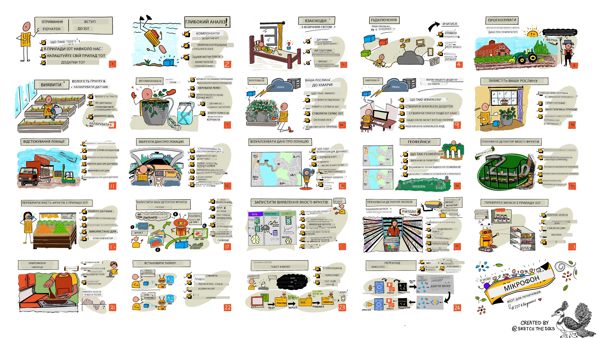

<!--
CO_OP_TRANSLATOR_METADATA:
{
  "original_hash": "6c354ec3487e4f6cfafbe44557996cd9",
  "translation_date": "2026-01-06T21:30:09+00:00",
  "source_file": "README.md",
  "language_code": "uk"
}
-->
[](https://github.com/microsoft/IoT-For-Beginners/blob/master/LICENSE)
[](https://GitHub.com/microsoft/IoT-For-Beginners/graphs/contributors/)
[](https://GitHub.com/microsoft/IoT-For-Beginners/issues/)
[](https://GitHub.com/microsoft/IoT-For-Beginners/pulls/)
[](http://makeapullrequest.com)

[](https://GitHub.com/microsoft/IoT-For-Beginners/watchers/)
[](https://GitHub.com/microsoft/IoT-For-Beginners/network/)
[](https://GitHub.com/microsoft/IoT-For-Beginners/stargazers/)

### Приєднуйтесь до спільноти Azure AI Foundry

Якщо у вас виникли труднощі або є запитання щодо створення AI-додатків, приєднуйтесь до інших учнів та досвідчених розробників у обговореннях щодо MCP. Це підтримуюча спільнота, де вітаються запитання та вільно ділиться знаннями.

[](https://discord.gg/nTYy5BXMWG)

Якщо у вас є відгуки щодо продукту або ви натрапили на помилки під час розробки, відвідайте:

[](https://aka.ms/foundry/forum)

Виконайте ці кроки, щоб почати роботу з цими ресурсами:
1. **Створіть форк репозиторію**: Клікніть [](https://GitHub.com/microsoft/IoT-For-Beginners/fork)
2. **Клонуйте репозиторій**:   `git clone https://github.com/microsoft/IoT-For-Beginners.git`
3. [**Приєднуйтесь до Microsoft Foundry Discord і зустрічайтеся з експертами та іншими розробниками**](https://discord.com/invite/ByRwuEEgH4)


### 🌐 Підтримка багатьох мов

#### Підтримується через GitHub Action (автоматизовано і завжди актуально)

<!-- CO-OP TRANSLATOR LANGUAGES TABLE START -->
[Arabic](../ar/README.md) | [Bengali](../bn/README.md) | [Bulgarian](../bg/README.md) | [Burmese (Myanmar)](../my/README.md) | [Chinese (Simplified)](../zh/README.md) | [Chinese (Traditional, Hong Kong)](../hk/README.md) | [Chinese (Traditional, Macau)](../mo/README.md) | [Chinese (Traditional, Taiwan)](../tw/README.md) | [Croatian](../hr/README.md) | [Czech](../cs/README.md) | [Danish](../da/README.md) | [Dutch](../nl/README.md) | [Estonian](../et/README.md) | [Finnish](../fi/README.md) | [French](../fr/README.md) | [German](../de/README.md) | [Greek](../el/README.md) | [Hebrew](../he/README.md) | [Hindi](../hi/README.md) | [Hungarian](../hu/README.md) | [Indonesian](../id/README.md) | [Italian](../it/README.md) | [Japanese](../ja/README.md) | [Kannada](../kn/README.md) | [Korean](../ko/README.md) | [Lithuanian](../lt/README.md) | [Malay](../ms/README.md) | [Malayalam](../ml/README.md) | [Marathi](../mr/README.md) | [Nepali](../ne/README.md) | [Nigerian Pidgin](../pcm/README.md) | [Norwegian](../no/README.md) | [Persian (Farsi)](../fa/README.md) | [Polish](../pl/README.md) | [Portuguese (Brazil)](../br/README.md) | [Portuguese (Portugal)](../pt/README.md) | [Punjabi (Gurmukhi)](../pa/README.md) | [Romanian](../ro/README.md) | [Russian](../ru/README.md) | [Serbian (Cyrillic)](../sr/README.md) | [Slovak](../sk/README.md) | [Slovenian](../sl/README.md) | [Spanish](../es/README.md) | [Swahili](../sw/README.md) | [Swedish](../sv/README.md) | [Tagalog (Filipino)](../tl/README.md) | [Tamil](../ta/README.md) | [Telugu](../te/README.md) | [Thai](../th/README.md) | [Turkish](../tr/README.md) | [Ukrainian](./README.md) | [Urdu](../ur/README.md) | [Vietnamese](../vi/README.md)

> **Віддаєте перевагу клонувати локально?**

> Цей репозиторій містить понад 50 мовних перекладів, що значно збільшує розмір завантаження. Щоб клонувати без перекладів, використовуйте sparse checkout:
> ```bash
> git clone --filter=blob:none --sparse https://github.com/microsoft/IoT-For-Beginners.git
> cd IoT-For-Beginners
> git sparse-checkout set --no-cone '/*' '!translations' '!translated_images'
> ```
> Це дасть вам усе необхідне для проходження курсу з набагато швидшим завантаженням.
<!-- CO-OP TRANSLATOR LANGUAGES TABLE END -->

# IoT для початківців - Курс

Azure Cloud Advocates у Microsoft раді запропонувати 12-тижневий курс з 24 уроків, повністю присвячений основам IoT. Кожен урок містить тести до та після занять, письмові інструкції для виконання уроку, розв’язок, завдання і багато іншого. Наша проектно-орієнтована педагогіка дозволяє навчатися, створюючи проекти — доведений спосіб краще засвоїти нові навички.

Проекти охоплюють шлях їжі від ферми до столу. Включно з фермерством, логістикою, виробництвом, роздрібною торгівлею та споживачем — усі популярні сфери застосування IoT-пристроїв.



> Скетчноут від [Nitya Narasimhan](https://github.com/nitya). Клацніть на зображення для збільшення.

**Велика подяка нашим авторам [Jen Fox](https://github.com/jenfoxbot), [Jen Looper](https://github.com/jlooper), [Jim Bennett](https://github.com/jimbobbennett) та нашому художнику скетчноута [Nitya Narasimhan](https://github.com/nitya).**

**Також дякуємо нашій команді [Microsoft Learn Student Ambassadors](https://studentambassadors.microsoft.com?WT.mc_id=academic-17441-jabenn), які переглядали та перекладали цей курс — [Aditya Garg](https://github.com/AdityaGarg00), [Anurag Sharma](https://github.com/Anurag-0-1-A), [Arpita Das](https://github.com/Arpiiitaaa), [Aryan Jain](https://www.linkedin.com/in/aryan-jain-47a4a1145/), [Bhavesh Suneja](https://github.com/EliteWarrior315), [Faith Hunja](https://faithhunja.github.io/), [Lateefah Bello](https://www.linkedin.com/in/lateefah-bello/), [Manvi Jha](https://github.com/Severus-Matthew), [Mireille Tan](https://www.linkedin.com/in/mireille-tan-a4834819a/), [Mohammad Iftekher (Iftu) Ebne Jalal](https://github.com/Iftu119), [Mohammad Zulfikar](https://github.com/mohzulfikar), [Priyanshu Srivastav](https://www.linkedin.com/in/priyanshu-srivastav-b067241ba), [Thanmai Gowducheruvu](https://github.com/innovation-platform) та [Zina Kamel](https://www.linkedin.com/in/zina-kamel/).**

Познайомтесь із командою!

[](https://youtu.be/-wippUJRi5k)

**Гіф від** [Mohit Jaisal](https://linkedin.com/in/mohitjaisal)

> 🎥 Клікніть на зображення вище, щоб переглянути відео про проект!

> **Вчителі**, ми [включили деякі поради](for-teachers.md) про те, як використовувати цей курс. Якщо ви хочете створити власні уроки, ми також надали [шаблон уроку](lesson-template/README.md).

> **[Студенти](https://aka.ms/student-page)**, щоб працювати з цим курсом самостійно, форкніть репозиторій та виконуйте вправи самостійно, починаючи з тесту перед лекцією, потім читайте лекцію і виконуйте інші активності. Намагайтеся створювати проекти, розуміючи уроки, а не просто копіюючи код рішень; однак код рішень доступний у папках /solutions у кожному уроці, орієнтованому на проект. Іншим варіантом є створити навчальну групу з друзями та проходити матеріал разом. Для подальшого навчання рекомендуємо [Microsoft Learn](https://docs.microsoft.com/users/jimbobbennett/collections/ke2ehd351jopwr?WT.mc_id=academic-17441-jabenn).

Для відео огляду курсу подивіться це відео:

[](https://youtube.com/watch?v=bccEMm8gRuc "Promo video")

> 🎥 Клікніть на зображення вище, щоб переглянути відео про проект!

## Педагогіка

Ми обрали два педагогічні принципи при створенні цього курсу: щоб він був проектно орієнтованим та містив часті тести. До кінця курсу студенти створять систему моніторингу та поливу рослин, трекер транспортного засобу, розумне виробництво для відстеження та перевірки їжі, а також таймер для приготування їжі з голосовим керуванням. Вони вивчать основи Інтернету речей, включно з написанням коду для пристроїв, підключенням до хмари, аналізом телеметрії та запуском штучного інтелекту на периферії.

Забезпечення відповідності контенту проектам робить процес навчання більш захопливим для студентів і підвищує запам’ятовування концепцій.

Крім того, тест з низькою ставкою перед заняттям формує у студента намір вивчати тему, а другий тест після уроку забезпечує подальше закріплення матеріалу. Цей курс спроектований гнучким і цікавим, його можна проходити повністю або по частинах. Проекти починаються з простих і стають дедалі складнішими до кінця 12-тижневого циклу.

Кожен проект базується на апаратному забезпеченні, доступному студентам і аматорам. Кожен проект розглядає конкретну доменну область, надаючи релевантні фоні знання. Щоб стати успішним розробником, важливо розуміти область, в якій ви розв’язуєте проблеми; надання таких фон радить студентам думати про свої IoT-рішення і навчання у контексті реальних проблем, які можуть поставити перед ними як IoT-розробниками. Студенти дізнаються, чому вони створюють ті чи інші рішення, і цінують кінцевого користувача.

## Апаратне забезпечення

У нас є два варіанти IoT-апаратного забезпечення для проектів залежно від особистих уподобань, знань мов програмування, навчальних цілей і наявності. Також ми надали «віртуальну апаратну» версію для тих, у кого немає доступу до апаратури або хто хоче дізнатися більше перед покупкою. Ви можете прочитати більше і знайти «список покупок» на [сторінці апаратного забезпечення](./hardware.md), з посиланнями на Complete Kits від наших друзів із Seeed Studio.
> 💁 Знайдіть наші вказівки щодо [Кодексу поведінки](CODE_OF_CONDUCT.md), [Співпраці](CONTRIBUTING.md) та [Перекладів](TRANSLATIONS.md). Ми раді вашим конструктивним відгукам!
>
> 🔧 Маєте проблеми? Перегляньте наш [Посібник з усунення несправностей](TROUBLESHOOTING.md) для вирішення поширених проблем.

## Кожен урок включає:

- конспект
- додаткове відео за вибором
- розминку перед уроком у форматі вікторини
- письмовий урок
- у проектах — покрокові інструкції зі створення проекту
- перевірки знань
- виклик
- додаткове читання
- завдання
- [вікторину після уроку](https://ff-quizzes.netlify.app/en/)

> **Примітка про вікторини**: Усі вікторини знаходяться в папці quiz-app, всього 48 вікторин по три запитання кожна. Вони пов'язані з уроками, але додаток вікторин можна запускати локально або розгортати в Azure; дотримуйтеся інструкцій у папці `quiz-app`. Вікторини поступово локалізуються.

## Уроки

|       |              Назва проекту              |                       Навчаємі концепції                       | Цілі навчання                                                                                                                                                      |                                                        Пов’язаний урок                                                         |
| :---: | :------------------------------------: | :-------------------------------------------------------------: | ----------------------------------------------------------------------------------------------------------------------------------------------------------------- | :-----------------------------------------------------------------------------------------------------------------------------: |
|  01   | [Початок роботи](./1-getting-started/README.md) |                     Вступ до IoT                                | Вивчити основні принципи IoT та базові складові рішень IoT, такі як сенсори та хмарні сервіси під час налаштування вашого першого IoT-пристрою                  |                      [Вступ до IoT](./1-getting-started/lessons/1-introduction-to-iot/README.md)                                   |
|  02   | [Початок роботи](./1-getting-started/README.md) |                   Поглиблене розуміння IoT                      | Дізнайтеся більше про компоненти системи IoT, а також про мікроконтролери та одноплатні комп’ютери                                                               |                        [Поглиблене розуміння IoT](./1-getting-started/lessons/2-deeper-dive/README.md)                          |
|  03   | [Початок роботи](./1-getting-started/README.md) | Взаємодія з фізичним світом за допомогою сенсорів і виконавчих механізмів | Дізнайтеся про сенсори для збору даних із фізичного світу і виконавчі механізми для відправки зворотного зв’язку, одночасно будуючи нічник                          | [Взаємодія з фізичним світом за допомогою сенсорів і виконавчих механізмів](./1-getting-started/lessons/3-sensors-and-actuators/README.md) |
|  04   | [Початок роботи](./1-getting-started/README.md) |             Підключіть ваш пристрій до Інтернету                | Дізнайтеся, як підключити IoT-пристрій до Інтернету для відправки та прийому повідомлень, підключаючи нічник до MQTT брокера                                      |               [Підключіть ваш пристрій до Інтернету](./1-getting-started/lessons/4-connect-internet/README.md)                   |
|  05   |            [Ферма](./2-farm/README.md)            |                    Прогнозування росту рослин                   | Навчіться прогнозувати ріст рослин за допомогою даних про температуру, зібраних IoT-пристроєм                                                                        |                          [Прогнозування росту рослин](./2-farm/lessons/1-predict-plant-growth/README.md)                        |
|  06   |            [Ферма](./2-farm/README.md)            |                    Виявлення вологості ґрунту                   | Навчіться виявляти вологість ґрунту та калібрувати сенсор вологості ґрунту                                                                                         |                          [Виявлення вологості ґрунту](./2-farm/lessons/2-detect-soil-moisture/README.md)                         |
|  07   |            [Ферма](./2-farm/README.md)            |                  Автоматизоване поливання рослин                | Навчіться автоматизувати та планувати полив із використанням реле та MQTT                                                                                        |                      [Автоматизоване поливання рослин](./2-farm/lessons/3-automated-plant-watering/README.md)                   |
|  08   |            [Ферма](./2-farm/README.md)            |               Міграція ваших рослин до хмари                     | Дізнайтеся про хмару та IoT-сервіси в хмарі й як підключити вашу рослину до одного з них замість публічного MQTT брокера                                          |               [Міграція ваших рослин до хмари](./2-farm/lessons/4-migrate-your-plant-to-the-cloud/README.md)                   |
|  09   |            [Ферма](./2-farm/README.md)            |         Міграція вашої логіки додатка до хмари                   | Дізнайтеся, як ви можете створювати логіку додатків у хмарі, що реагує на повідомлення IoT                                                                       |         [Міграція вашої логіки додатка до хмари](./2-farm/lessons/5-migrate-application-to-the-cloud/README.md)                |
|  10   |            [Ферма](./2-farm/README.md)            |                   Захистіть вашу рослину                         | Дізнайтеся про безпеку в IoT і як захистити вашу рослину за допомогою ключів і сертифікатів                                                                       |                        [Захистіть вашу рослину](./2-farm/lessons/6-keep-your-plant-secure/README.md)                            |
|  11   |       [Транспорт](./3-transport/README.md)        |                      Відстеження місцезнаходження                | Дізнайтеся про GPS-відстеження місцезнаходження для IoT-пристроїв                                                                                                |                           [Відстеження місцезнаходження](./3-transport/lessons/1-location-tracking/README.md)                  |
|  12   |       [Транспорт](./3-transport/README.md)        |                     Збереження даних про місцезнаходження       | Навчіться зберігати дані IoT для подальшої візуалізації або аналізу                                                                                               |                         [Збереження даних про місцезнаходження](./3-transport/lessons/2-store-location-data/README.md)          |
|  13   |       [Транспорт](./3-transport/README.md)        |                   Візуалізація даних про місцезнаходження       | Дізнайтеся про візуалізацію даних про місцезнаходження на мапі та як карти відображають реальний тривимірний світ у двох вимірах                                  |                     [Візуалізація даних про місцезнаходження](./3-transport/lessons/3-visualize-location-data/README.md)        |
|  14   |       [Транспорт](./3-transport/README.md)        |                          Геозони                                 | Дізнайтеся про геозони й як їх можна використовувати для оповіщення, коли транспортні засоби у ланцюгу поставок наближаються до пункту призначення               |                                   [Геозони](./3-transport/lessons/4-geofences/README.md)                                     |
|  15   |   [Виробництво](./4-manufacturing/README.md)       |               Навчання детектора якості фруктів                 | Дізнайтеся про навчання класифікатора зображень у хмарі для визначення якості фруктів                                                                             |                 [Навчання детектора якості фруктів](./4-manufacturing/lessons/1-train-fruit-detector/README.md)               |
|  16   |   [Виробництво](./4-manufacturing/README.md)       |           Перевірка якості фруктів за допомогою IoT-пристрою    | Дізнайтеся, як використовувати ваш детектор якості фруктів з IoT-пристрою                                                                                        |           [Перевірка якості фруктів за допомогою IoT-пристрою](./4-manufacturing/lessons/2-check-fruit-from-device/README.md) |
|  17   |   [Виробництво](./4-manufacturing/README.md)       |             Запуск детектора фруктів на периферії               | Дізнайтеся про запуск вашого детектора фруктів на IoT-пристрої на периферії                                                                                       |             [Запуск детектора фруктів на периферії](./4-manufacturing/lessons/3-run-fruit-detector-edge/README.md)             |
|  18   |   [Виробництво](./4-manufacturing/README.md)       |        Тригерна детекція якості фруктів зі сенсора              | Дізнайтеся про ініціювання детекції якості фруктів зі сенсора                                                                                                    |        [Ініціювання детекції якості фруктів зі сенсора](./4-manufacturing/lessons/4-trigger-fruit-detector/README.md)          |
|  19   |          [Роздріб](./5-retail/README.md)           |                   Навчання детектора запасів                     | Навчіться використовувати розпізнавання об’єктів для навчання детектора запасів для підрахунку запасів у магазині                                              |                        [Навчання детектора запасів](./5-retail/lessons/1-train-stock-detector/README.md)                       |
|  20   |          [Роздріб](./5-retail/README.md)           |               Перевірка запасів за допомогою IoT-пристрою       | Дізнайтеся, як перевіряти наявність запасів за допомогою IoT-пристрою, використовуючи модель розпізнавання об’єктів                                            |                     [Перевірка запасів за допомогою IoT-пристрою](./5-retail/lessons/2-check-stock-device/README.md)          |
|  21   |        [Споживач](./6-consumer/README.md)          |             Розпізнавання мови за допомогою IoT-пристрою       | Навчіться розпізнавати мову з IoT-пристрою для створення розумного таймера                                                                                       |                  [Розпізнавання мови за допомогою IoT-пристрою](./6-consumer/lessons/1-speech-recognition/README.md)           |
|  22   |        [Споживач](./6-consumer/README.md)          |                     Розуміння мови                               | Навчіться розуміти речення, сказані IoT-пристрою                                                                                                                |                        [Розуміння мови](./6-consumer/lessons/2-language-understanding/README.md)                               |
|  23   |        [Споживач](./6-consumer/README.md)          |           Встановлення таймера та голосовий зворотній зв’язок  | Навчіться встановлювати таймер на IoT-пристрої та давати голосовий зворотний зв’язок про час встановлення та завершення таймера                               |                 [Встановлення таймера та голосовий зворотний зв’язок](./6-consumer/lessons/3-spoken-feedback/README.md)         |
|  24   |        [Споживач](./6-consumer/README.md)          |                 Підтримка декількох мов                         | Навчіться підтримувати кілька мов — і коли до вас звертаються, і у відповідях вашого розумного таймера                                                            |                   [Підтримка декількох мов](./6-consumer/lessons/4-multiple-language-support/README.md)                       |

## Офлайн доступ

Ви можете запускати цю документацію офлайн за допомогою [Docsify](https://docsify.js.org/#/). Форкніть це репозиторій, [встановіть Docsify](https://docsify.js.org/#/quickstart) на вашу локальну машину, а потім у кореневій папці репозиторію введіть `docsify serve`. Вебсайт буде доступний на порту 3000 вашого локального хоста: `localhost:3000`.

## Вікторина

Дякуємо спільноті за проведення інтерактивної вікторини, яка перевіряє ваші знання з кожної глави. Ви можете перевірити свої знання [тут](https://ff-quizzes.netlify.app/en/)

### PDF

Ви можете згенерувати PDF цієї документації для офлайн-доступу за потреби. Для цього переконайтеся, що у вас встановлено [npm](https://docs.npmjs.com/downloading-and-installing-node-js-and-npm) і виконайте в кореневій папці репозиторію наступні команди:

```sh
npm i
npm run convert
```

### Слайди

Доступні презентації для деяких уроків у папці [slides](../../slides).


## Інші навчальні програми

Наша команда створює інші навчальні програми! Дивіться:

<!-- CO-OP TRANSLATOR OTHER COURSES START -->
### LangChain
[](https://aka.ms/langchain4j-for-beginners)
[](https://aka.ms/langchainjs-for-beginners?WT.mc_id=m365-94501-dwahlin)

---

### Azure / Edge / MCP / Агентство
[](https://github.com/microsoft/AZD-for-beginners?WT.mc_id=academic-105485-koreyst)
[](https://github.com/microsoft/edgeai-for-beginners?WT.mc_id=academic-105485-koreyst)
[](https://github.com/microsoft/mcp-for-beginners?WT.mc_id=academic-105485-koreyst)
[](https://github.com/microsoft/ai-agents-for-beginners?WT.mc_id=academic-105485-koreyst)

---
 
### Серія про генеративний ШІ
[](https://github.com/microsoft/generative-ai-for-beginners?WT.mc_id=academic-105485-koreyst)
[-9333EA?style=for-the-badge&labelColor=E5E7EB&color=9333EA)](https://github.com/microsoft/Generative-AI-for-beginners-dotnet?WT.mc_id=academic-105485-koreyst)
[-C084FC?style=for-the-badge&labelColor=E5E7EB&color=C084FC)](https://github.com/microsoft/generative-ai-for-beginners-java?WT.mc_id=academic-105485-koreyst)
[-E879F9?style=for-the-badge&labelColor=E5E7EB&color=E879F9)](https://github.com/microsoft/generative-ai-with-javascript?WT.mc_id=academic-105485-koreyst)

---
 
### Основне навчання
[](https://aka.ms/ml-beginners?WT.mc_id=academic-105485-koreyst)
[](https://aka.ms/datascience-beginners?WT.mc_id=academic-105485-koreyst)
[](https://aka.ms/ai-beginners?WT.mc_id=academic-105485-koreyst)
[](https://github.com/microsoft/Security-101?WT.mc_id=academic-96948-sayoung)
[](https://aka.ms/webdev-beginners?WT.mc_id=academic-105485-koreyst)
[](https://aka.ms/iot-beginners?WT.mc_id=academic-105485-koreyst)
[](https://github.com/microsoft/xr-development-for-beginners?WT.mc_id=academic-105485-koreyst)

---
 
### Серія Copilot
[](https://aka.ms/GitHubCopilotAI?WT.mc_id=academic-105485-koreyst)
[](https://github.com/microsoft/mastering-github-copilot-for-dotnet-csharp-developers?WT.mc_id=academic-105485-koreyst)
[](https://github.com/microsoft/CopilotAdventures?WT.mc_id=academic-105485-koreyst)
<!-- CO-OP TRANSLATOR OTHER COURSES END -->

## Авторські права на зображення

Ви можете знайти всі атрибуції для зображень, використаних у цій навчальній програмі, де це необхідно, у файлі [Attributions](./attributions.md).

---

<!-- CO-OP TRANSLATOR DISCLAIMER START -->
**Відмова від відповідальності**:  
Цей документ було перекладено за допомогою сервісу автоматичного перекладу [Co-op Translator](https://github.com/Azure/co-op-translator). Хоча ми прагнемо до точності, будь ласка, зверніть увагу, що автоматичні переклади можуть містити помилки або неточності. Оригінальний документ рідною мовою слід вважати авторитетним джерелом. Для важливої інформації рекомендується звертатися до професійного перекладу, виконаного людиною. Ми не несемо відповідальності за будь-які непорозуміння чи неправильні тлумачення, які можуть виникнути внаслідок використання цього перекладу.
<!-- CO-OP TRANSLATOR DISCLAIMER END -->