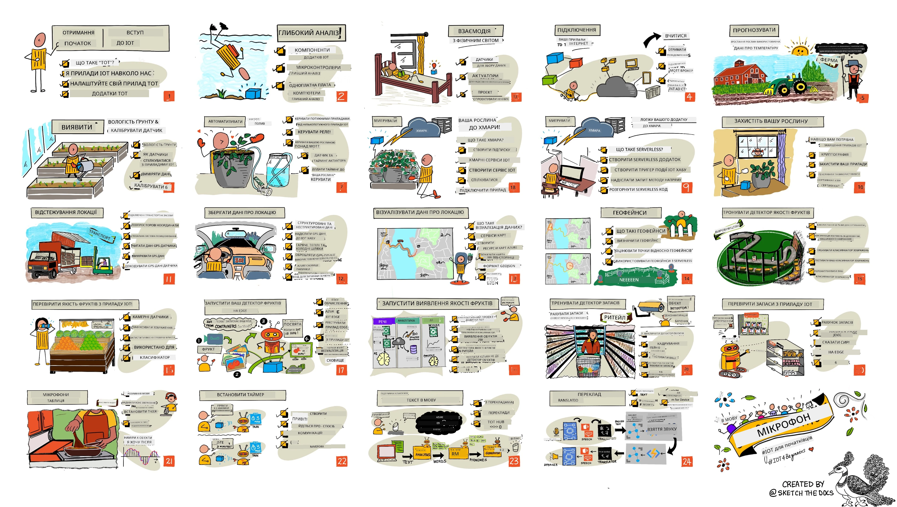

[](https://github.com/microsoft/IoT-For-Beginners/blob/master/LICENSE)
[](https://GitHub.com/microsoft/IoT-For-Beginners/graphs/contributors/)
[](https://GitHub.com/microsoft/IoT-For-Beginners/issues/)
[](https://GitHub.com/microsoft/IoT-For-Beginners/pulls/)
[](http://makeapullrequest.com)

[](https://GitHub.com/microsoft/IoT-For-Beginners/watchers/)
[](https://GitHub.com/microsoft/IoT-For-Beginners/network/)
[](https://GitHub.com/microsoft/IoT-For-Beginners/stargazers/)

### Приєднуйтесь до спільноти Azure AI Foundry

Якщо у вас виникнуть складнощі або питання щодо створення додатків зі штучним інтелектом, приєднуйтесь до інших учнів та досвідчених розробників у обговореннях MCP. Це дружня спільнота, де питання вітаються, а знання поширюються вільно.

[](https://discord.gg/nTYy5BXMWG)

Якщо у вас є відгуки про продукт або помилки під час створення, відвідайте:

[](https://aka.ms/foundry/forum)

Виконайте ці кроки, щоб почати користуватися цими ресурсами:
1. **Форкніть репозиторій**: Натисніть [](https://GitHub.com/microsoft/IoT-For-Beginners/fork)
2. **Клонуйте репозиторій**:   `git clone https://github.com/microsoft/IoT-For-Beginners.git`
3. [**Приєднуйтесь до Microsoft Foundry Discord і знайомтесь з експертами та колегами-розробниками**](https://discord.com/invite/ByRwuEEgH4)


### 🌐 Підтримка багатьох мов

#### Підтримується через GitHub Action (Автоматично та Завжди Оновлено)

<!-- CO-OP TRANSLATOR LANGUAGES TABLE START -->
[Arabic](../ar/README.md) | [Bengali](../bn/README.md) | [Bulgarian](../bg/README.md) | [Burmese (Myanmar)](../my/README.md) | [Chinese (Simplified)](../zh-CN/README.md) | [Chinese (Traditional, Hong Kong)](../zh-HK/README.md) | [Chinese (Traditional, Macau)](../zh-MO/README.md) | [Chinese (Traditional, Taiwan)](../zh-TW/README.md) | [Croatian](../hr/README.md) | [Czech](../cs/README.md) | [Danish](../da/README.md) | [Dutch](../nl/README.md) | [Estonian](../et/README.md) | [Finnish](../fi/README.md) | [French](../fr/README.md) | [German](../de/README.md) | [Greek](../el/README.md) | [Hebrew](../he/README.md) | [Hindi](../hi/README.md) | [Hungarian](../hu/README.md) | [Indonesian](../id/README.md) | [Italian](../it/README.md) | [Japanese](../ja/README.md) | [Kannada](../kn/README.md) | [Khmer](../km/README.md) | [Korean](../ko/README.md) | [Lithuanian](../lt/README.md) | [Malay](../ms/README.md) | [Malayalam](../ml/README.md) | [Marathi](../mr/README.md) | [Nepali](../ne/README.md) | [Nigerian Pidgin](../pcm/README.md) | [Norwegian](../no/README.md) | [Persian (Farsi)](../fa/README.md) | [Polish](../pl/README.md) | [Portuguese (Brazil)](../pt-BR/README.md) | [Portuguese (Portugal)](../pt-PT/README.md) | [Punjabi (Gurmukhi)](../pa/README.md) | [Romanian](../ro/README.md) | [Russian](../ru/README.md) | [Serbian (Cyrillic)](../sr/README.md) | [Slovak](../sk/README.md) | [Slovenian](../sl/README.md) | [Spanish](../es/README.md) | [Swahili](../sw/README.md) | [Swedish](../sv/README.md) | [Tagalog (Filipino)](../tl/README.md) | [Tamil](../ta/README.md) | [Telugu](../te/README.md) | [Thai](../th/README.md) | [Turkish](../tr/README.md) | [Ukrainian](./README.md) | [Urdu](../ur/README.md) | [Vietnamese](../vi/README.md)

> **Віддаєте перевагу клонувати локально?**
>
> Цей репозиторій включає понад 50 перекладів мовами, що значно збільшує розмір скачування. Щоб клонути без перекладів, скористайтеся sparse checkout:
>
> **Bash / macOS / Linux:**
> ```bash
> git clone --filter=blob:none --sparse https://github.com/microsoft/IoT-For-Beginners.git
> cd IoT-For-Beginners
> git sparse-checkout set --no-cone '/*' '!translations' '!translated_images'
> ```
>
> **CMD (Windows):**
> ```cmd
> git clone --filter=blob:none --sparse https://github.com/microsoft/IoT-For-Beginners.git
> cd IoT-For-Beginners
> git sparse-checkout set --no-cone "/*" "!translations" "!translated_images"
> ```
>
> Це дає вам усе необхідне для проходження курсу з набагато швидшим завантаженням.
<!-- CO-OP TRANSLATOR LANGUAGES TABLE END -->

# IoT для початківців - навчальна програма

Адвокати Azure Cloud у Microsoft раді запропонувати 12-тижневу програму з 24 уроків, присвячену основам IoT. Кожен урок включає попередні та підсумкові тести, покрокові інструкції для виконання уроку, розв’язання, завдання та інше. Наша проєктно-орієнтована педагогіка дозволяє вчитися під час створення, що є доведеним способом закріплення нових навичок.

Проєкти охоплюють шлях їжі від ферми до столу. Це включає сільське господарство, логістику, виробництво, роздрібну торгівлю та споживача — всі популярні галузі промисловості для пристроїв IoT.



> Скетчноут від [Nitya Narasimhan](https://github.com/nitya). Натисніть на зображення для збільшеного варіанту.

**Щирі подяки авторам [Jen Fox](https://github.com/jenfoxbot), [Jen Looper](https://github.com/jlooper), [Jim Bennett](https://github.com/jimbobbennett), а також нашому скетчноут-артисту [Nitya Narasimhan](https://github.com/nitya).**

**Також дякуємо нашій команді [Microsoft Learn Student Ambassadors](https://studentambassadors.microsoft.com?WT.mc_id=academic-17441-jabenn), яка перевіряла та перекладала цю навчальну програму — [Aditya Garg](https://github.com/AdityaGarg00), [Anurag Sharma](https://github.com/Anurag-0-1-A), [Arpita Das](https://github.com/Arpiiitaaa), [Aryan Jain](https://www.linkedin.com/in/aryan-jain-47a4a1145/), [Bhavesh Suneja](https://github.com/EliteWarrior315), [Faith Hunja](https://faithhunja.github.io/), [Lateefah Bello](https://www.linkedin.com/in/lateefah-bello/), [Manvi Jha](https://github.com/Severus-Matthew), [Mireille Tan](https://www.linkedin.com/in/mireille-tan-a4834819a/), [Mohammad Iftekher (Iftu) Ebne Jalal](https://github.com/Iftu119), [Mohammad Zulfikar](https://github.com/mohzulfikar), [Priyanshu Srivastav](https://www.linkedin.com/in/priyanshu-srivastav-b067241ba), [Thanmai Gowducheruvu](https://github.com/innovation-platform), та [Zina Kamel](https://www.linkedin.com/in/zina-kamel/).**

Знайомтесь з командою!

[](https://youtu.be/-wippUJRi5k)

**Гіфка від** [Mohit Jaisal](https://linkedin.com/in/mohitjaisal)

> 🎥 Натисніть на зображення вище, щоб подивитися відео про проєкт!

> **Вчителям**, ми включили деякі поради ([for-teachers.md]) щодо використання цієї навчальної програми. Якщо ви хочете створити власні уроки, ми також включили [шаблон уроку](lesson-template/README.md).

> **[Студенти](https://aka.ms/student-page)**, щоб використовувати цю навчальну програму самостійно, зробіть форк всього репозиторію та виконуйте вправи по черзі, починаючи з тесту перед лекцією, потім прочитайте лекцію та виконанняте решту завдань. Намагайтеся створювати проєкти, розуміючи уроки, а не просто копіюючи код розв’язку; цей код доступний у папках /solutions кожного проєктно-орієнтованого уроку. Ще одна ідея — створити навчальну групу з друзями та проходити матеріал разом. Для подальшого навчання рекомендуємо [Microsoft Learn](https://docs.microsoft.com/users/jimbobbennett/collections/ke2ehd351jopwr?WT.mc_id=academic-17441-jabenn).

Для відеоогляду цього курсу перегляньте це відео:

[](https://youtube.com/watch?v=bccEMm8gRuc "Promo video")

> 🎥 Натисніть на зображення вище, щоб подивитися відео про проєкт!

## Педагогіка

Ми обрали два педагогічні принципи під час створення цієї програми: забезпечення проєктно-орієнтованого підходу і включення частих тестів. Наприкінці цього циклу студенти створять систему моніторингу та поливу рослин, трекер транспортного засобу, розумний завод для відстеження і перевірки їжі, таймер для готування з голосовим керуванням, а також освоять основи Інтернету речей, зокрема написання коду для пристроїв, підключення до хмари, аналіз телеметрії та виконання штучного інтелекту безпосередньо на пристрої.

Забезпечуючи відповідність змісту проєктам, процес навчання стає більш захопливим для студентів, а засвоєння понять поліпшується.

Крім того, тест з низькою значущістю перед заняттям встановлює намір студента навчитися темі, тоді як другий тест після заняття сприяє подальшому закріпленню матеріалу. Ця навчальна програма розроблена бути гнучкою та цікавою і може бути пройдена цілком або частково. Проєкти починаються з малого і до кінця 12-тижневого циклу стають дедалі складнішими.

Кожен проєкт ґрунтується на реальному апаратному забезпеченні, доступному студентам і аматорам. Кожен проєкт розглядає специфіку відповідної сфери, надаючи релевантні фондові знання. Щоб стати успішним розробником, корисно розуміти контекст проблем, які ви розв’язуєте; надання таких знань дозволяє студентам мислити про свої IoT-рішення та набуті знання у контексті реальної проблеми, яку їм можуть доручити розробляти як IoT-розробникам. Студенти розуміють «чому» рішень, які вони створюють, і набувають поваги до кінцевого користувача.

## Апаратне забезпечення
Ми маємо два варіанти апаратного забезпечення IoT для використання у проектах, залежно від особистих уподобань, знань або вподобань мови програмування, цілей навчання та наявності. Ми також надали версію «віртуального апаратного забезпечення» для тих, хто не має доступу до обладнання або хоче дізнатися більше перед покупкою. Ви можете дізнатися більше та знайти «список покупок» на [сторінці з апаратним забезпеченням](./hardware.md), включно з посиланнями на покупку готових наборів від наших друзів із Seeed Studio.

> 💁 Знайдіть наші [Правила поведінки](CODE_OF_CONDUCT.md), [Як внести свій внесок](CONTRIBUTING.md) та керівництва з [перекладів](..). Ми радо приймаємо ваше конструктивне зворотне зв’язування!
>
> 🔧 Є проблеми? Перегляньте наш [Посібник з усунення несправностей](TROUBLESHOOTING.md) для рішень поширених проблем.

## Кожен урок містить:

- скетчнот
- додаткове відео за бажанням
- розминковий вікторина перед уроком
- письмовий урок
- для уроків на основі проектів — покрокові інструкції зі створення проекту
- перевірки знань
- виклик
- додаткове читання
- завдання
- [вікторина після уроку](https://ff-quizzes.netlify.app/en/)

> **Примітка про вікторини**: Всі вікторини знаходяться в папці quiz-app, всього 48 вікторин, кожна по три питання. Вони пов’язані у самих уроках, але додаток для вікторин можна запускати локально або розміщувати в Azure; дотримуйтесь інструкцій у папці `quiz-app`. Їх поступово локалізують.

## Уроки

|       |              Назва проекту              |                       Пояснені концепції                       | Навчальні цілі                                                                                                                                                 |                                                        Пов’язаний урок                                                         |
| :---: | :------------------------------------: | :-------------------------------------------------------------: | ------------------------------------------------------------------------------------------------------------------------------------------------------------------- | :------------------------------------------------------------------------------------------------------------------------------: |
|  01   | [Початок роботи](./1-getting-started/README.md) |                     Вступ до IoT                               | Вивчити основні принципи IoT та базові складові IoT-рішень, такі як датчики та хмарні сервіси, встановлюючи свій перший пристрій IoT                               |                        [Вступ до IoT](./1-getting-started/lessons/1-introduction-to-iot/README.md)                                |
|  02   | [Початок роботи](./1-getting-started/README.md) |                   Глибше про IoT                               | Дізнатися більше про компоненти системи IoT, а також про мікроконтролери та одноплатні комп’ютери                                                                   |                          [Глибше про IoT](./1-getting-started/lessons/2-deeper-dive/README.md)                                 |
|  03   | [Початок роботи](./1-getting-started/README.md) | Взаємодія з фізичним світом за допомогою датчиків та виконавчих механізмів | Дізнатись про датчики для збору даних із фізичного світу та виконавчі пристрої для надання зворотного зв’язку, створюючи нічник                                   | [Взаємодія з фізичним світом за допомогою датчиків та виконавчих механізмів](./1-getting-started/lessons/3-sensors-and-actuators/README.md) |
|  04   | [Початок роботи](./1-getting-started/README.md) |             Підключення вашого пристрою до Інтернету          | Дізнатися, як підключити пристрій IoT до Інтернету для надсилання та прийому повідомлень, підключаючи свій нічник до брокера MQTT                                 |                 [Підключення вашого пристрою до Інтернету](./1-getting-started/lessons/4-connect-internet/README.md)           |
|  05   |            [Ферма](./2-farm/README.md)            |                    Прогнозування росту рослин                  | Навчитися прогнозувати ріст рослин за допомогою температурних даних, зібраних пристроєм IoT                                                                        |                            [Прогнозування росту рослин](./2-farm/lessons/1-predict-plant-growth/README.md)                      |
|  06   |            [Ферма](./2-farm/README.md)            |                    Виявлення вологості ґрунту                 | Навчитися визначати вологість ґрунту і калібрувати датчик вологості ґрунту                                                                                         |                            [Виявлення вологості ґрунту](./2-farm/lessons/2-detect-soil-moisture/README.md)                      |
|  07   |            [Ферма](./2-farm/README.md)            |                  Автоматичний полив рослин                    | Навчитися автоматизувати і планувати полив за допомогою реле та MQTT                                                                                              |                      [Автоматичний полив рослин](./2-farm/lessons/3-automated-plant-watering/README.md)                      |
|  08   |            [Ферма](./2-farm/README.md)            |               Міграція вашої рослини в хмару                   | Дізнатися про хмарні сервіси та IoT-сервіси, розміщені в хмарі, і як підключити вашу рослину до одного з них замість публічного брокера MQTT                     |               [Міграція вашої рослини в хмару](./2-farm/lessons/4-migrate-your-plant-to-the-cloud/README.md)                   |
|  09   |            [Ферма](./2-farm/README.md)            |         Міграція логіки вашого додатку в хмару                | Дізнатися, як писати логіку додатків у хмарі, що реагує на повідомлення IoT                                                                                      |         [Міграція логіки вашого додатку в хмару](./2-farm/lessons/5-migrate-application-to-the-cloud/README.md)               |
|  10   |            [Ферма](./2-farm/README.md)            |                   Захист вашої рослини                         | Дізнатися про безпеку в IoT і як захистити вашу рослину за допомогою ключів та сертифікатів                                                                       |                        [Захист вашої рослини](./2-farm/lessons/6-keep-your-plant-secure/README.md)                           |
|  11   |       [Транспорт](./3-transport/README.md)       |                      Відстеження місцеположення                 | Дізнатися про GPS-відстеження місцеположення для IoT-пристроїв                                                                                                   |                           [Відстеження місцеположення](./3-transport/lessons/1-location-tracking/README.md)                    |
|  12   |       [Транспорт](./3-transport/README.md)       |                     Зберігання даних про місцезнаходження       | Навчитися зберігати дані IoT для візуалізації або подальшого аналізу                                                                                              |                         [Зберігання даних про місцезнаходження](./3-transport/lessons/2-store-location-data/README.md)          |
|  13   |       [Транспорт](./3-transport/README.md)       |                   Візуалізація даних про місцезнаходження       | Дізнатися про візуалізацію даних про місцезнаходження на карті і як карти представляють реальний 3D світ у 2 вимірах                                               |                     [Візуалізація даних про місцезнаходження](./3-transport/lessons/3-visualize-location-data/README.md)       |
|  14   |       [Транспорт](./3-transport/README.md)       |                          Геозони                               | Дізнатися про геозони та як їх можна використовувати для оповіщення, коли транспорт у ланцюжку постачання наближається до пункту призначення                      |                                   [Геозони](./3-transport/lessons/4-geofences/README.md)                                     |
|  15   |   [Виробництво](./4-manufacturing/README.md)   |               Навчання детектора якості фруктів                | Дізнатися про навчання класифікатора зображень у хмарі для визначення якості фруктів                                                                              |                 [Навчання детектора якості фруктів](./4-manufacturing/lessons/1-train-fruit-detector/README.md)                |
|  16   |   [Виробництво](./4-manufacturing/README.md)   |           Перевірка якості фруктів з пристрою IoT             | Дізнатися, як використовувати ваш детектор якості фруктів на IoT-пристрої                                                                                        |           [Перевірка якості фруктів з пристрою IoT](./4-manufacturing/lessons/2-check-fruit-from-device/README.md)            |
|  17   |   [Виробництво](./4-manufacturing/README.md)   |             Запуск детектора фруктів на краю мережі            | Дізнатися про запуск вашого детектора фруктів на IoT-пристрої на краю мережі                                                                                      |             [Запуск детектора фруктів на краю мережі](./4-manufacturing/lessons/3-run-fruit-detector-edge/README.md)          |
|  18   |   [Виробництво](./4-manufacturing/README.md)   |        Тригери виявлення якості фруктів з датчика             | Дізнатися про тригери для виявлення якості фруктів з датчика                                                                                                     |        [Тригери виявлення якості фруктів з датчика](./4-manufacturing/lessons/4-trigger-fruit-detector/README.md)             |
|  19   |          [Роздрібна торгівля](./5-retail/README.md)          |                   Навчання детектора запасів                     | Дізнатися, як використовувати виявлення об’єктів для навчання детектора запасів для підрахунку товарів у магазині                                              |                        [Навчання детектора запасів](./5-retail/lessons/1-train-stock-detector/README.md)                      |
|  20   |          [Роздрібна торгівля](./5-retail/README.md)          |               Перевірка запасів з IoT-пристрою                 | Дізнатися, як перевіряти запаси з IoT-пристрою, використовуючи модель виявлення об’єктів                                                                         |                     [Перевірка запасів з IoT-пристрою](./5-retail/lessons/2-check-stock-device/README.md)                     |
|  21   |        [Побутове](./6-consumer/README.md)        |             Розпізнавання мови з IoT-пристрою                  | Дізнатися, як розпізнавати мову з IoT-пристрою для створення розумного таймера                                                                                   |                  [Розпізнавання мови з IoT-пристрою](./6-consumer/lessons/1-speech-recognition/README.md)                    |
|  22   |        [Побутове](./6-consumer/README.md)        |                     Розуміння мови                             | Дізнатися, як розуміти речення, сказані IoT-пристрою                                                                                                            |                        [Розуміння мови](./6-consumer/lessons/2-language-understanding/README.md)                               |
|  23   |        [Побутове](./6-consumer/README.md)        |           Встановлення таймера та усна зворотна реакція        | Навчитися встановлювати таймер на IoT-пристрої та надавати усну зворотну реакцію про початок та закінчення таймера                                               |                 [Встановлення таймера та усна зворотна реакція](./6-consumer/lessons/3-spoken-feedback/README.md)             |
|  24   |        [Побутове](./6-consumer/README.md)        |                 Підтримка кількох мов                         | Дізнатися, як підтримувати кілька мов, як при спілкуванні з пристроєм, так і в його голосових відповідях                                                         |                   [Підтримка кількох мов](./6-consumer/lessons/4-multiple-language-support/README.md)                         |

## Офлайн-доступ

Ви можете запускати цю документацію офлайн, використовуючи [Docsify](https://docsify.js.org/#/). Форкніть цей репозиторій, [встановіть Docsify](https://docsify.js.org/#/quickstart) на свій локальний комп’ютер і у кореневій папці цього репозиторію введіть `docsify serve`. Вебсайт буде обслуговуватися на порту 3000 вашого localhost: `localhost:3000`.

## Вікторина

Дякуємо спільноті за розміщення інтерактивної вікторини, яка перевіряє ваші знання з кожного розділу. Перевірити свої знання можна [тут](https://ff-quizzes.netlify.app/en/)

### PDF

Якщо потрібно, ви можете згенерувати PDF-версію цього вмісту для офлайн-доступу. Для цього переконайтеся, що у вас встановлено [npm](https://docs.npmjs.com/downloading-and-installing-node-js-and-npm) і виконайте наступні команди у кореневій папці цього репозиторію:

```sh
npm i
npm run convert
```

### Слайди

Для деяких уроків є презентації у папці [slides](../../slides).


## Інші навчальні програми

Наша команда також створює інші навчальні програми! Ознайомтесь:

<!-- CO-OP TRANSLATOR OTHER COURSES START -->
### LangChain
[](https://aka.ms/langchain4j-for-beginners)
[](https://aka.ms/langchainjs-for-beginners?WT.mc_id=m365-94501-dwahlin)
[](https://github.com/microsoft/langchain-for-beginners?WT.mc_id=m365-94501-dwahlin)
---

### Azure / Edge / MCP / Agents
[](https://github.com/microsoft/AZD-for-beginners?WT.mc_id=academic-105485-koreyst)
[](https://github.com/microsoft/edgeai-for-beginners?WT.mc_id=academic-105485-koreyst)
[](https://github.com/microsoft/mcp-for-beginners?WT.mc_id=academic-105485-koreyst)
[](https://github.com/microsoft/ai-agents-for-beginners?WT.mc_id=academic-105485-koreyst)

---
 
### Серія Генеративного AI
[](https://github.com/microsoft/generative-ai-for-beginners?WT.mc_id=academic-105485-koreyst)
[-9333EA?style=for-the-badge&labelColor=E5E7EB&color=9333EA)](https://github.com/microsoft/Generative-AI-for-beginners-dotnet?WT.mc_id=academic-105485-koreyst)
[-C084FC?style=for-the-badge&labelColor=E5E7EB&color=C084FC)](https://github.com/microsoft/generative-ai-for-beginners-java?WT.mc_id=academic-105485-koreyst)
[-E879F9?style=for-the-badge&labelColor=E5E7EB&color=E879F9)](https://github.com/microsoft/generative-ai-with-javascript?WT.mc_id=academic-105485-koreyst)

---
 
### Основне Навчання
[](https://aka.ms/ml-beginners?WT.mc_id=academic-105485-koreyst)
[](https://aka.ms/datascience-beginners?WT.mc_id=academic-105485-koreyst)
[](https://aka.ms/ai-beginners?WT.mc_id=academic-105485-koreyst)
[](https://github.com/microsoft/Security-101?WT.mc_id=academic-96948-sayoung)
[](https://aka.ms/webdev-beginners?WT.mc_id=academic-105485-koreyst)
[](https://aka.ms/iot-beginners?WT.mc_id=academic-105485-koreyst)
[](https://github.com/microsoft/xr-development-for-beginners?WT.mc_id=academic-105485-koreyst)

---
 
### Серія Копілот
[](https://aka.ms/GitHubCopilotAI?WT.mc_id=academic-105485-koreyst)
[](https://github.com/microsoft/mastering-github-copilot-for-dotnet-csharp-developers?WT.mc_id=academic-105485-koreyst)
[](https://github.com/microsoft/CopilotAdventures?WT.mc_id=academic-105485-koreyst)
<!-- CO-OP TRANSLATOR OTHER COURSES END -->

## Власники зображень

Ви можете знайти всі атрибуції для зображень, використаних у цьому курсі, за потребою у [Attributions](./attributions.md).

---

<!-- CO-OP TRANSLATOR DISCLAIMER START -->
**Відмова від відповідальності**:
Цей документ було перекладено за допомогою сервісу машинного перекладу [Co-op Translator](https://github.com/Azure/co-op-translator). Хоча ми прагнемо до точності, будь ласка, майте на увазі, що автоматичні переклади можуть містити помилки або неточності. Оригінальний документ рідною мовою слід вважати авторитетним джерелом. Для критично важливої інформації рекомендується звертатися до професійного людського перекладу. Ми не несемо відповідальності за будь-які непорозуміння або неправильні тлумачення, що виникли внаслідок використання цього перекладу.
<!-- CO-OP TRANSLATOR DISCLAIMER END -->