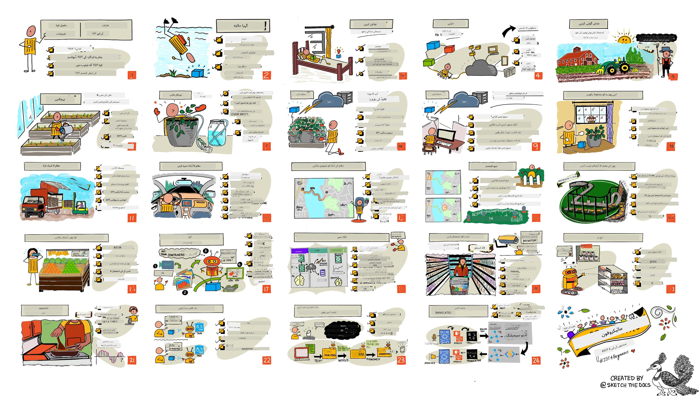

<!--
CO_OP_TRANSLATOR_METADATA:
{
  "original_hash": "6c354ec3487e4f6cfafbe44557996cd9",
  "translation_date": "2026-01-05T17:22:20+00:00",
  "source_file": "README.md",
  "language_code": "ur"
}
-->
[](https://github.com/microsoft/IoT-For-Beginners/blob/master/LICENSE)
[](https://GitHub.com/microsoft/IoT-For-Beginners/graphs/contributors/)
[](https://GitHub.com/microsoft/IoT-For-Beginners/issues/)
[](https://GitHub.com/microsoft/IoT-For-Beginners/pulls/)
[](http://makeapullrequest.com)

[](https://GitHub.com/microsoft/IoT-For-Beginners/watchers/)
[](https://GitHub.com/microsoft/IoT-For-Beginners/network/)
[](https://GitHub.com/microsoft/IoT-For-Beginners/stargazers/)

### Azure AI Foundry کمیونٹی میں شامل ہوں

اگر آپ پھنس جاتے ہیں یا AI ایپس بنانے کے بارے میں کوئی سوالات ہیں۔ MCP کے بارے میں مباحثوں میں شریک ہونے کے لیے ساتھ سیکھنے والوں اور تجربہ کار ڈویلپرز کے ساتھ شامل ہوں۔ یہ ایک مددگار کمیونٹی ہے جہاں سوالات کا خیرمقدم کیا جاتا ہے اور علم بلا معاوضہ شیئر کیا جاتا ہے۔

[](https://discord.gg/nTYy5BXMWG)

اگر آپ کے پاس پروڈکٹ فیڈبیک ہے یا تعمیر کے دوران کوئی غلطیاں ہیں تو یہاں وزٹ کریں:

[](https://aka.ms/foundry/forum)

ان وسائل کو استعمال شروع کرنے کے لیے یہ اقدامات کریں:
1. **ریپوزٹری کو فورک کریں**: کلک کریں [](https://GitHub.com/microsoft/IoT-For-Beginners/fork)
2. **ریپوزٹری کو کلون کریں**: `git clone https://github.com/microsoft/IoT-For-Beginners.git`
3. [**Microsoft Foundry Discord میں شامل ہوں اور ماہرین و دیگر ڈویلپرز سے ملیں**](https://discord.com/invite/ByRwuEEgH4)


### 🌐 کثیر زبان کی حمایت

#### GitHub ایکشن کے ذریعے سپورٹ شدہ (خودکار اور ہمیشہ تازہ ترین)

<!-- CO-OP TRANSLATOR LANGUAGES TABLE START -->
[Arabic](../ar/README.md) | [Bengali](../bn/README.md) | [Bulgarian](../bg/README.md) | [Burmese (Myanmar)](../my/README.md) | [Chinese (Simplified)](../zh/README.md) | [Chinese (Traditional, Hong Kong)](../hk/README.md) | [Chinese (Traditional, Macau)](../mo/README.md) | [Chinese (Traditional, Taiwan)](../tw/README.md) | [Croatian](../hr/README.md) | [Czech](../cs/README.md) | [Danish](../da/README.md) | [Dutch](../nl/README.md) | [Estonian](../et/README.md) | [Finnish](../fi/README.md) | [French](../fr/README.md) | [German](../de/README.md) | [Greek](../el/README.md) | [Hebrew](../he/README.md) | [Hindi](../hi/README.md) | [Hungarian](../hu/README.md) | [Indonesian](../id/README.md) | [Italian](../it/README.md) | [Japanese](../ja/README.md) | [Kannada](../kn/README.md) | [Korean](../ko/README.md) | [Lithuanian](../lt/README.md) | [Malay](../ms/README.md) | [Malayalam](../ml/README.md) | [Marathi](../mr/README.md) | [Nepali](../ne/README.md) | [Nigerian Pidgin](../pcm/README.md) | [Norwegian](../no/README.md) | [Persian (Farsi)](../fa/README.md) | [Polish](../pl/README.md) | [Portuguese (Brazil)](../br/README.md) | [Portuguese (Portugal)](../pt/README.md) | [Punjabi (Gurmukhi)](../pa/README.md) | [Romanian](../ro/README.md) | [Russian](../ru/README.md) | [Serbian (Cyrillic)](../sr/README.md) | [Slovak](../sk/README.md) | [Slovenian](../sl/README.md) | [Spanish](../es/README.md) | [Swahili](../sw/README.md) | [Swedish](../sv/README.md) | [Tagalog (Filipino)](../tl/README.md) | [Tamil](../ta/README.md) | [Telugu](../te/README.md) | [Thai](../th/README.md) | [Turkish](../tr/README.md) | [Ukrainian](../uk/README.md) | [Urdu](./README.md) | [Vietnamese](../vi/README.md)

> **مقامی طور پر کلون کرنا پسند کریں؟**

> اس ریپوزٹری میں 50+ زبانوں کے تراجم شامل ہیں جو ڈاؤن لوڈ کے سائز کو نمایاں طور پر بڑھاتے ہیں۔ بغیر تراجم کے کلون کرنے کے لیے، sparse checkout استعمال کریں:
> ```bash
> git clone --filter=blob:none --sparse https://github.com/microsoft/IoT-For-Beginners.git
> cd IoT-For-Beginners
> git sparse-checkout set --no-cone '/*' '!translations' '!translated_images'
> ```
> یہ آپ کو کورس مکمل کرنے کے لیے تمام ضروری چیزیں فراہم کرتا ہے جس سے ڈاؤن لوڈ بہت تیز ہو جاتا ہے۔
<!-- CO-OP TRANSLATOR LANGUAGES TABLE END -->

# IoT برائے ابتدائیہ - ایک نصاب

Microsoft کے Azure Cloud Advocates فخر سے ایک 12 ہفتوں پر محیط، 24 اسباق کا نصاب پیش کرتے ہیں جو IoT کی بنیادی باتوں کے بارے میں ہے۔ ہر سبق میں پری اور پوسٹ کوئزز، سبق مکمل کرنے کے لیے تحریری ہدایات، حل، اسائنمنٹ اور مزید شامل ہیں۔ ہمارا پروجیکٹ پر مبنی تعلیمی ماڈل آپ کو بناتے ہوئے سیکھنے کا موقع دیتا ہے، جو نئی مہارتیں سیکھنے کا ایک مؤثر طریقہ ہے۔

یہ پروجیکٹس کھانے کے سفر کو فارم سے دسترخوان تک ظاہر کرتے ہیں۔ اس میں کاشتکاری، لاجسٹکس، مینوفیکچرنگ، ریٹیل اور صارف شامل ہیں - IoT ڈیوائسز کے لیے یہ تمام شعبے مقبول ہیں۔



> اسکیچنوٹ [نیتیا نرسیہمن](https://github.com/nitya) کی طرف سے۔ تصویر کو بڑا دیکھنے کے لیے کلک کریں۔

**ہمارے مصنفین [Jen Fox](https://github.com/jenfoxbot)، [Jen Looper](https://github.com/jlooper)، [Jim Bennett](https://github.com/jimbobbennett)، اور اسکیچنوٹ آرٹسٹ [Nitya Narasimhan](https://github.com/nitya) کا دل کی گہرائیوں سے شکریہ۔**

**[Microsoft Learn Student Ambassadors](https://studentambassadors.microsoft.com?WT.mc_id=academic-17441-jabenn) کی ٹیم کا بھی شکریہ جنہوں نے اس نصاب کا جائزہ لیا اور ترجمہ کیا ہے - [Aditya Garg](https://github.com/AdityaGarg00)، [Anurag Sharma](https://github.com/Anurag-0-1-A)، [Arpita Das](https://github.com/Arpiiitaaa)، [Aryan Jain](https://www.linkedin.com/in/aryan-jain-47a4a1145/)، [Bhavesh Suneja](https://github.com/EliteWarrior315)، [Faith Hunja](https://faithhunja.github.io/)، [Lateefah Bello](https://www.linkedin.com/in/lateefah-bello/)، [Manvi Jha](https://github.com/Severus-Matthew)، [Mireille Tan](https://www.linkedin.com/in/mireille-tan-a4834819a/)، [Mohammad Iftekher (Iftu) Ebne Jalal](https://github.com/Iftu119)، [Mohammad Zulfikar](https://github.com/mohzulfikar)، [Priyanshu Srivastav](https://www.linkedin.com/in/priyanshu-srivastav-b067241ba)، [Thanmai Gowducheruvu](https://github.com/innovation-platform)، اور [Zina Kamel](https://www.linkedin.com/in/zina-kamel/).**

ٹیم سے ملاقات کریں!

[](https://youtu.be/-wippUJRi5k)

**گیف بذریعہ** [Mohit Jaisal](https://linkedin.com/in/mohitjaisal)

> 🎥 پروجیکٹ کے بارے میں ویڈیو کے لیے اوپر تصویر پر کلک کریں!

> **اساتذہ**، ہم نے اس نصاب کے استعمال کے لیے کچھ تجاویز [شامل کی ہیں](for-teachers.md)۔ اگر آپ اپنے سبق خود بنانے کے خواہاں ہیں تو ہم نے ایک [سبق ٹیمپلیٹ](lesson-template/README.md) بھی شامل کیا ہے۔

> **[طلباء](https://aka.ms/student-page)**، اس نصاب کو خود استعمال کرنے کے لیے، پوری ریپوزٹری کو فورک کریں اور مشقیں خود مکمل کریں، شروع کریں پری لیکچر کوئز سے، پھر لیکچر پڑھیں اور باقی سرگرمیاں مکمل کریں۔ کوشش کریں کہ پروجیکٹس بنانے کے لیے سبق کو سمجھ کر کوڈ کی نقول بنانے کے بجائے حل کوڈ استعمال کریں؛ اگرچہ یہ کوڈ ہر پروجیکٹ-مرکوز سبق کے /solutions فولڈرز میں دستیاب ہے۔ ایک اور خیال یہ ہو سکتا ہے کہ دوستوں کے ساتھ اسٹڈی گروپ بنائیں اور مواد کو ایک ساتھ دیکھیں۔ مزید مطالعہ کے لیے، ہم [Microsoft Learn](https://docs.microsoft.com/users/jimbobbennett/collections/ke2ehd351jopwr?WT.mc_id=academic-17441-jabenn) کی سفارش کرتے ہیں۔

اس کورس کا ویڈیو جائزہ دیکھنے کے لیے یہ ویڈیو دیکھیں:

[](https://youtube.com/watch?v=bccEMm8gRuc "Promo video")

> 🎥 پروجیکٹ کے بارے میں ویڈیو کے لیے اوپر تصویر پر کلک کریں!

## تعلیمی فلسفہ

ہم نے اس نصاب کو تیار کرتے ہوئے دو تعلیمی اصول منتخب کیے ہیں: یہ یقینی بنانا کہ یہ پروجیکٹ پر مبنی ہو اور اس میں کثرت سے کوئزز شامل ہوں۔ اس سلسلے کے اختتام تک، طلباء ایک پودے کی نگرانی اور پانی دینے کا نظام، ایک گاڑی ٹریکر، کھانے کی نگرانی اور جانچ کے لیے ایک سمارٹ فیکٹری سیٹ اپ، اور آواز سے کنٹرول ہونے والا کھانا پکانے کا ٹائمر بنائیں گے، اور انٹرنیٹ آف تھنگز کی بنیادی باتیں سیکھیں گے جن میں ڈیوائس کوڈ لکھنا، کلاؤڈ سے کنکشن، ٹیلیمیٹری کا تجزیہ اور ایج پر AI چلانا شامل ہے۔

مواد کو پروجیکٹس کے ساتھ ہم آہنگ کر کے، عمل طلباء کے لیے مزید دلچسپ بنایا جاتا ہے اور تصورات کے یاداشت کو بہتر بنایا جاتا ہے۔

مزید برآں، کلاس سے پہلے ایک کم دباؤ والا کوئز طلباء کے علم حاصل کرنے کے ارادے کو سیٹ کرتا ہے، جبکہ کلاس کے بعد دوسرا کوئز مزید یاداشت کو یقینی بناتا ہے۔ اس نصاب کو لچکدار اور دلچسپ بنایا گیا ہے اور اسے پورے یا جزوی طور پر لیا جا سکتا ہے۔ پروجیکٹس چھوٹے سے شروع ہوتے ہیں اور 12 ہفتے کے چکر کے اختتام تک پیچیدہ ہوتے جاتے ہیں۔

ہر پروجیکٹ حقیقی دنیا کے ہارڈویئر کے گرد مرکوز ہے جو طلباء اور شوقین افراد کے لیے دستیاب ہے۔ ہر پروجیکٹ مخصوص ڈومین کا جائزہ لیتا ہے، متعلقہ پس منظر کا علم فراہم کرتا ہے۔ ایک کامیاب ڈویلپر بننے کے لیے اس ڈومین کو سمجھنا مفید ہوتا ہے جہاں آپ مسائل حل کر رہے ہیں، یہ پس منظر کا علم طلباء کو موقع دیتا ہے کہ وہ اپنے IoT حل اور سیکھنے کو حقیقی دنیا کے مسئلے کے تناظر میں سوچیں جو انہیں ایک IoT ڈویلپر کے طور پر حل کرنے کو کہا جا سکتا ہے۔ طلباء جو حل بنا رہے ہیں ان کی 'وجہ' سمجھتے ہیں اور انجام دینے والے کا اندازہ لگاتے ہیں۔

## ہارڈویئر

ہمارے پاس پروجیکٹس کے لیے دو IoT ہارڈویئر کے انتخاب موجود ہیں، ذاتی ترجیح، پروگرامنگ زبان کی معلومات، سیکھنے کے مقصد اور دستیابی کے مطابق۔ ہم نے ایک 'ورچوئل ہارڈویئر' ورژن بھی فراہم کیا ہے ان لوگوں کے لیے جن کے پاس ہارڈویئر نہیں ہے، یا جو خریداری سے پہلے مزید سیکھنا چاہتے ہیں۔ مزید پڑھنے اور مکمل کٹس کی خریداری سے متعلق لنکس ہمارے دوست Seeed Studio کی جانب سے [ہارڈویئر صفحہ](./hardware.md) پر موجود ہیں۔
> 💁 ہمارے [Code of Conduct](CODE_OF_CONDUCT.md)، [Contributing](CONTRIBUTING.md)، اور [Translation](TRANSLATIONS.md) رہنما خطوط دیکھیں۔ ہم آپ کی تعمیری رائے کا خیرمقدم کرتے ہیں!
>
> 🔧 مسائل درپیش ہیں؟ عمومی مسائل کے حل کے لیے ہمارے [Troubleshooting Guide](TROUBLESHOOTING.md) کو دیکھیں۔

## ہر سبق میں شامل ہیں:

- سکیچ نوٹ
- اضافی ویڈیو (اختیاری)
- سبق سے پہلے گرمائش کوئز
- تحریری سبق
- پراجیکٹ بیسڈ اسباق کے لیے، پراجیکٹ بنانے کے طریقے پر مرحلہ وار رہنما
- علم کی جانچ
- ایک چیلنج
- اضافی مطالعہ
- اسائنمنٹ
- [سبق کے بعد کا کوئز](https://ff-quizzes.netlify.app/en/)

> **کوئزز کے بارے میں ایک نوٹ**: تمام کوئزز quiz-app فولڈر میں محفوظ ہیں، کل 48 کوئزز ہیں جن میں سے ہر ایک میں تین سوالات ہیں۔ یہ اسباق کے اندر لنک کیے گئے ہیں لیکن quiz app کو لوکلی چلایا جا سکتا ہے یا Azure پر ڈیپلائے کیا جا سکتا ہے؛ `quiz-app` فولڈر میں ہدایات پر عمل کریں۔ یہ بتدریج مقامی زبانوں میں منتقل کیے جا رہے ہیں۔

## اسباق

|       |              پراجیکٹ کا نام               |                       پڑھائے گئے تصورات                        | تعلیمی مقاصد                                                                                                                                                               |                                                        لنک شدہ سبق                                                         |
| :---: | :------------------------------------: | :-------------------------------------------------------------: | ---------------------------------------------------------------------------------------------------------------------------------------------------------------------------- | :--------------------------------------------------------------------------------------------------------------------------: |
|  01   | [Getting started](./1-getting-started/README.md) |                     IoT کا تعارف                                  | IoT کے بنیادی اصول اور IoT حل کے بنیادی اجزاء جیسے سینسرز اور کلاؤڈ سروسز سیکھیں جب آپ اپنا پہلا IoT ڈیوائس سیٹ کر رہے ہیں                                                    |                      [Introduction to IoT](./1-getting-started/lessons/1-introduction-to-iot/README.md)                      |
|  02   | [Getting started](./1-getting-started/README.md) |                   IoT کی گہری سمجھ                                 | IoT سسٹم کے اجزاء، مائیکروکنٹرولرز اور سنگل-بورڈ کمپیوٹرز کے بارے میں مزید جانیں                                                                                              |                        [A deeper dive into IoT](./1-getting-started/lessons/2-deeper-dive/README.md)                         |
|  03   | [Getting started](./1-getting-started/README.md) | سینسرز اور ایکچیویٹرز کے ذریعے فزیکل دنیا کے ساتھ تعامل           | فزیکل دنیا سے ڈیٹا جمع کرنے کے لیے سینسرز، اور فیڈبیک بھیجنے کے لیے ایکچیویٹرز کے بارے میں جانیں، جب آپ نائٹ لائٹ بنا رہے ہیں                                             | [Interact with the physical world with sensors and actuators](./1-getting-started/lessons/3-sensors-and-actuators/README.md) |
|  04   | [Getting started](./1-getting-started/README.md) |             اپنے ڈیوائس کو انٹرنیٹ سے جوڑیں                         | ایک IoT ڈیوائس کو انٹرنیٹ سے کیسے جوڑیں تاکہ پیغامات بھیجیں اور وصول کریں، جیسے اپنے نائٹ لائٹ کو MQTT بروکر سے جوڑنا                                                         |               [Connect your device to the Internet](./1-getting-started/lessons/4-connect-internet/README.md)                |
|  05   |            [Farm](./2-farm/README.md)            |                    پودے کی نشوونما کی پیش گوئی                      | ایک IoT ڈیوائس کے ذریعے حاصل کردہ درجہ حرارت کے ڈیٹا سے پودے کی نشوونما کی پیش گوئی کرنا سیکھیں                                                                                |                          [Predict plant growth](./2-farm/lessons/1-predict-plant-growth/README.md)                           |
|  06   |            [Farm](./2-farm/README.md)            |                    مٹی کی نمی کا پتہ لگانا                         | مٹی کی نمی کا پتہ لگانے اور مٹی کی نمی سینسر کو کیلیبریٹ کرنے کا طریقہ جانیں                                                                                                 |                          [Detect soil moisture](./2-farm/lessons/2-detect-soil-moisture/README.md)                           |
|  07   |            [Farm](./2-farm/README.md)            |                  خودکار پودوں کو پانی دینا                         | ریلے اور MQTT کا استعمال کرتے ہوئے پانی دینے کی خود کاری اور وقت بندی سیکھیں                                                                                                |                      [Automated plant watering](./2-farm/lessons/3-automated-plant-watering/README.md)                       |
|  08   |            [Farm](./2-farm/README.md)            |               اپنے پودے کو کلاؤڈ میں منتقل کریں                      | کلاؤڈ اور کلاؤڈ میزبان IoT سروسز کے بارے میں جانیں اور اپنے پودے کو ایک پبلک MQTT بروکر کی بجائے ان میں سے کسی سے جوڑنا سیکھیں                                              |               [Migrate your plant to the cloud](./2-farm/lessons/4-migrate-your-plant-to-the-cloud/README.md)                |
|  09   |            [Farm](./2-farm/README.md)            |         اپنی ایپلیکیشن لوجک کو کلاؤڈ میں منتقل کریں                   | یہ جانیں کہ IoT پیغامات کے جواب میں آپ کلاؤڈ میں ایپلیکیشن لوجک کیسے لکھ سکتے ہیں                                                                                             |         [Migrate your application logic to the cloud](./2-farm/lessons/5-migrate-application-to-the-cloud/README.md)         |
|  10   |            [Farm](./2-farm/README.md)            |                   اپنے پودے کو محفوظ بنائیں                         | IoT کے ذریعے سیکیورٹی کے بارے میں جانیں اور چابیوں اور سرٹیفکیٹس کے ذریعے اپنے پودے کو محفوظ رکھنے کا طریقہ سیکھیں                                                           |                        [Keep your plant secure](./2-farm/lessons/6-keep-your-plant-secure/README.md)                         |
|  11   |       [Transport](./3-transport/README.md)       |                      مقام کی ٹریکنگ                                  | IoT ڈیوائسز کے لیے GPS لوکیشن ٹریکنگ کے بارے میں جانیں                                                                                                                      |                           [Location tracking](./3-transport/lessons/1-location-tracking/README.md)                           |
|  12   |       [Transport](./3-transport/README.md)       |                     لوکیشن کا ڈیٹا محفوظ کرنا                        | جانیں کہ IoT ڈیٹا کو بعد میں دیکھنے یا تجزیہ کے لیے کیسے محفوظ کیا جائے                                                                                                      |                         [Store location data](./3-transport/lessons/2-store-location-data/README.md)                         |
|  13   |       [Transport](./3-transport/README.md)       |                   لوکیشن ڈیٹا کو منظر کشی کرنا                        | مقام کے ڈیٹا کو نقشے پر دکھانے اور نقشے کس طرح اصلی 3D دنیا کو دو جہتی میں ظاہر کرتے ہیں اس کے بارے میں جانیں                                                                |                     [Visualize location data](./3-transport/lessons/3-visualize-location-data/README.md)                     |
|  14   |       [Transport](./3-transport/README.md)       |                          جیو فینسز                                  | جیو فینسز کے بارے میں جانیں اور یہ کہ یہ سپلائی چین میں گاڑیوں کے اپنے منزل کے قریب آنے پر کیسے اطلاع دے سکتے ہیں                                                              |                                   [Geofences](./3-transport/lessons/4-geofences/README.md)                                   |
|  15   |   [Manufacturing](./4-manufacturing/README.md)   |               پھل کی معیار کا پتہ لگانے والا تربیت دینا             | کلاؤڈ میں تصویر کی شناخت کرنے والا classifier تیار کرنے کے بارے میں جانیں جو پھل کے معیار کا پتہ لگائے                                                                         |                 [Train a fruit quality detector](./4-manufacturing/lessons/1-train-fruit-detector/README.md)                 |
|  16   |   [Manufacturing](./4-manufacturing/README.md)   |           ایک IoT ڈیوائس سے پھل کا معیار چیک کرنا                      | جانیں کہ اپنے پھل کی معیار کی جانچ کے لیے اپنے IoT ڈیوائس سے اپنے detector کو کیسے استعمال کریں                                                                                  |           [Check fruit quality from an IoT device](./4-manufacturing/lessons/2-check-fruit-from-device/README.md)            |
|  17   |   [Manufacturing](./4-manufacturing/README.md)   |             اپنا پھل کا ڈیٹیکٹر ایج پر چلانا                         | جانیں کہ اپنے پھل کا detector IoT ڈیوائس پر ایج پر کیسے چلائیں                                                                                                              |             [Run your fruit detector on the edge](./4-manufacturing/lessons/3-run-fruit-detector-edge/README.md)             |
|  18   |   [Manufacturing](./4-manufacturing/README.md)   |        سینسر سے پھل کی معیار کی شناخت کا آغاز کرنا                    | جانیں کہ سینسر سے پھل کی معیار کی شناخت کو کیسے متحرک کریں                                                                                                                  |        [Trigger fruit quality detection from a sensor](./4-manufacturing/lessons/4-trigger-fruit-detector/README.md)         |
|  19   |          [Retail](./5-retail/README.md)          |                   اسٹاک ڈیٹیکٹر کو تربیت دینا                        | جانیں کہ شاپ میں اسٹاک گننے کے لیے object detection کا استعمال کرتے ہوئے اسٹاک ڈیٹیکٹر کو کیسے تربیت دیں                                                                        |                        [Train a stock detector](./5-retail/lessons/1-train-stock-detector/README.md)                         |
|  20   |          [Retail](./5-retail/README.md)          |               ایک IoT ڈیوائس سے اسٹاک چیک کرنا                        | جانیں کہ object detection ماڈل کا استعمال کرتے ہوئے ایک IoT ڈیوائس سے اسٹاک کیسے چیک کریں                                                                                   |                     [Check stock from an IoT device](./5-retail/lessons/2-check-stock-device/README.md)                      |
|  21   |        [Consumer](./6-consumer/README.md)        |             ایک IoT ڈیوائس کے ذریعے تقریر کو پہچاننا                  | جانیں کہ ایک IoT ڈیوائس سے تقریر کو پہچان کر ایک سمارٹ ٹائمر کیسے بنایا جائے                                                                                                  |                  [Recognize speech with an IoT device](./6-consumer/lessons/1-speech-recognition/README.md)                  |
|  22   |        [Consumer](./6-consumer/README.md)        |                     زبان کو سمجھنا                                   | جانیں کہ کسی IoT ڈیوائس کو بولی گئی جملوں کو سمجھنے کا طریقہ                                                                                                                |                        [Understand language](./6-consumer/lessons/2-language-understanding/README.md)                        |
|  23   |        [Consumer](./6-consumer/README.md)        |           ٹائمر سیٹ کرنا اور زبانی فیڈبیک دینا                         | جانیں کہ ایک IoT ڈیوائس پر ٹائمر کیسے سیٹ کیا جائے اور جب ٹائمر سیٹ ہو اور ختم ہو تو زبانی فیڈبیک کیسے دی جائے                                                                |                 [Set a timer and provide spoken feedback](./6-consumer/lessons/3-spoken-feedback/README.md)                  |
|  24   |        [Consumer](./6-consumer/README.md)        |                 متعدد زبانوں کی حمایت کرنا                             | جانیں کہ متعدد زبانوں کی حمایت کیسے کی جائے، دونوں بولی جانے والی اور آپ کے سمارٹ ٹائمر کی جانب سے دی گئی جوابات                                                                |                   [Support multiple languages](./6-consumer/lessons/4-multiple-language-support/README.md)                   |

## آف لائن رسائی

آپ اس دستاویزات کو آف لائن [Docsify](https://docsify.js.org/#/) استعمال کرتے ہوئے چلا سکتے ہیں۔ اس ریپو کو فورک کریں، اپنے مقامی کمپیوٹر پر [Docsify انسٹال کریں](https://docsify.js.org/#/quickstart) اور پھر اس ریپو کے روٹ فولڈر میں `docsify serve` لکھیں۔ ویب سائٹ آپ کے localhost پر پورٹ 3000 پر چلائی جائے گی: `localhost:3000`۔

## کوئز

کمیونٹی کا شکریہ جو ہر باب پر آپ کے علم کو جانچنے کے لیے انٹرایکٹو کوئز کی میزبانی کرتی ہے۔ آپ اپنا علم [یہاں](https://ff-quizzes.netlify.app/en/) پر جانچ سکتے ہیں۔

### پی ڈی ایف

اگر ضرورت ہو تو آپ اس مواد کا پی ڈی ایف آف لائن رسائی کے لیے بنا سکتے ہیں۔ ایسا کرنے کے لیے یقینی بنائیں کہ آپ کے پاس [npm انسٹال ہے](https://docs.npmjs.com/downloading-and-installing-node-js-and-npm) اور اس ریپو کے روٹ فولڈر میں درج ذیل کمانڈز چلائیں:

```sh
npm i
npm run convert
```

### سلائیڈز

کچھ اسباق کے لیے سلائیڈ ڈیکس [slides](../../slides) فولڈر میں موجود ہیں۔

## دیگر نصاب

ہماری ٹیم دیگر نصاب بھی تیار کرتی ہے! دیکھیں:

<!-- CO-OP TRANSLATOR OTHER COURSES START -->
### LangChain
[](https://aka.ms/langchain4j-for-beginners)
[](https://aka.ms/langchainjs-for-beginners?WT.mc_id=m365-94501-dwahlin)

---

### Azure / Edge / MCP / Agents
[](https://github.com/microsoft/AZD-for-beginners?WT.mc_id=academic-105485-koreyst)
[](https://github.com/microsoft/edgeai-for-beginners?WT.mc_id=academic-105485-koreyst)
[](https://github.com/microsoft/mcp-for-beginners?WT.mc_id=academic-105485-koreyst)
[](https://github.com/microsoft/ai-agents-for-beginners?WT.mc_id=academic-105485-koreyst)

---
 
### جنریٹو AI سیریز
[](https://github.com/microsoft/generative-ai-for-beginners?WT.mc_id=academic-105485-koreyst)
[-9333EA?style=for-the-badge&labelColor=E5E7EB&color=9333EA)](https://github.com/microsoft/Generative-AI-for-beginners-dotnet?WT.mc_id=academic-105485-koreyst)
[-C084FC?style=for-the-badge&labelColor=E5E7EB&color=C084FC)](https://github.com/microsoft/generative-ai-for-beginners-java?WT.mc_id=academic-105485-koreyst)
[-E879F9?style=for-the-badge&labelColor=E5E7EB&color=E879F9)](https://github.com/microsoft/generative-ai-with-javascript?WT.mc_id=academic-105485-koreyst)

---
 
### بنیادی تعلیم
[](https://aka.ms/ml-beginners?WT.mc_id=academic-105485-koreyst)
[](https://aka.ms/datascience-beginners?WT.mc_id=academic-105485-koreyst)
[](https://aka.ms/ai-beginners?WT.mc_id=academic-105485-koreyst)
[](https://github.com/microsoft/Security-101?WT.mc_id=academic-96948-sayoung)
[](https://aka.ms/webdev-beginners?WT.mc_id=academic-105485-koreyst)
[](https://aka.ms/iot-beginners?WT.mc_id=academic-105485-koreyst)
[](https://github.com/microsoft/xr-development-for-beginners?WT.mc_id=academic-105485-koreyst)

---
 
### کوپائلٹ سیریز
[](https://aka.ms/GitHubCopilotAI?WT.mc_id=academic-105485-koreyst)
[](https://github.com/microsoft/mastering-github-copilot-for-dotnet-csharp-developers?WT.mc_id=academic-105485-koreyst)
[](https://github.com/microsoft/CopilotAdventures?WT.mc_id=academic-105485-koreyst)
<!-- CO-OP TRANSLATOR OTHER COURSES END -->

## تصویر کے حقوق

آپ اس نصاب میں استعمال ہونے والی تمام تصاویر کے حقوق [Attributions](./attributions.md) میں جہاں ضرورت ہو دیکھ سکتے ہیں۔

---

<!-- CO-OP TRANSLATOR DISCLAIMER START -->
**دستخطی وضاحت**:
یہ دستاویز مصنوعی ذہانت کے ترجمہ سروس [Co-op Translator](https://github.com/Azure/co-op-translator) کے ذریعے ترجمہ کی گئی ہے۔ اگرچہ ہم درستگی کے لیے کوشاں ہیں، براہ کرم یاد رکھیں کہ خودکار ترجمے میں غلطیاں یا عدم صحت ہو سکتی ہے۔ اصل دستاویز اپنی مادری زبان میں ہی قابلِ اعتبار ماخذ سمجھی جانی چاہیے۔ اہم معلومات کے لیے پیشہ ور انسانی ترجمہ لینے کی سفارش کی جاتی ہے۔ ہم اس ترجمے کے استعمال سے پیدا ہونے والی کسی بھی غلط فہمی یا غلط تعبیر کے ذمہ دار نہیں ہیں۔
<!-- CO-OP TRANSLATOR DISCLAIMER END -->