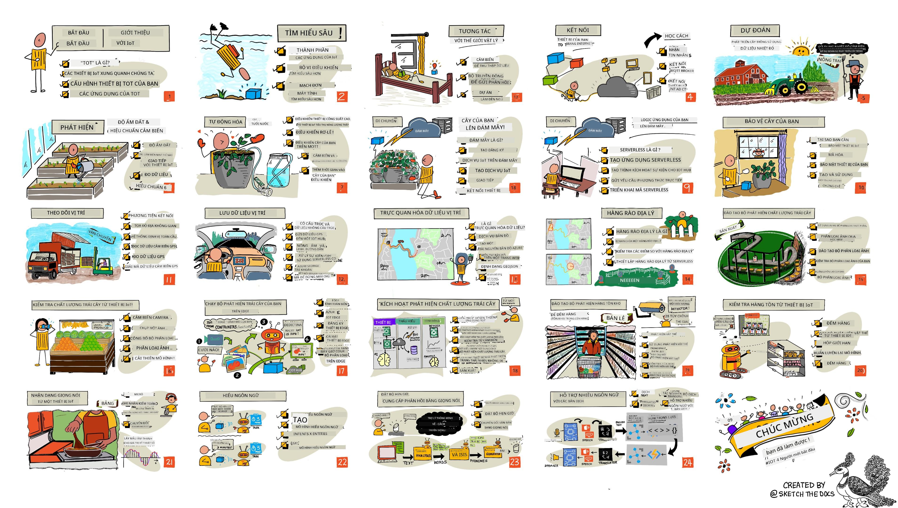

<!--
CO_OP_TRANSLATOR_METADATA:
{
  "original_hash": "6c354ec3487e4f6cfafbe44557996cd9",
  "translation_date": "2026-01-06T09:57:27+00:00",
  "source_file": "README.md",
  "language_code": "vi"
}
-->
[](https://github.com/microsoft/IoT-For-Beginners/blob/master/LICENSE)
[](https://GitHub.com/microsoft/IoT-For-Beginners/graphs/contributors/)
[](https://GitHub.com/microsoft/IoT-For-Beginners/issues/)
[](https://GitHub.com/microsoft/IoT-For-Beginners/pulls/)
[](http://makeapullrequest.com)

[](https://GitHub.com/microsoft/IoT-For-Beginners/watchers/)
[](https://GitHub.com/microsoft/IoT-For-Beginners/network/)
[](https://GitHub.com/microsoft/IoT-For-Beginners/stargazers/)

### Tham gia Cộng đồng Azure AI Foundry

Nếu bạn gặp khó khăn hoặc có bất kỳ câu hỏi nào về việc xây dựng ứng dụng AI. Hãy tham gia cùng những người học và các nhà phát triển có kinh nghiệm trong các cuộc thảo luận về MCP. Đây là một cộng đồng hỗ trợ, nơi các câu hỏi được chào đón và kiến thức được chia sẻ tự do.

[](https://discord.gg/nTYy5BXMWG)

Nếu bạn có phản hồi về sản phẩm hoặc lỗi trong quá trình xây dựng, vui lòng truy cập:

[](https://aka.ms/foundry/forum)

Thực hiện các bước sau để bắt đầu sử dụng các tài nguyên này:
1. **Fork Kho lưu trữ**: Nhấn vào [](https://GitHub.com/microsoft/IoT-For-Beginners/fork)
2. **Clone Kho lưu trữ**: `git clone https://github.com/microsoft/IoT-For-Beginners.git`
3. [**Tham gia Microsot Foundry Discord và gặp gỡ các chuyên gia và nhà phát triển khác**](https://discord.com/invite/ByRwuEEgH4)


### 🌐 Hỗ trợ đa ngôn ngữ

#### Hỗ trợ qua GitHub Action (Tự động & Luôn cập nhật)

<!-- CO-OP TRANSLATOR LANGUAGES TABLE START -->
[Tiếng Ả Rập](../ar/README.md) | [Tiếng Bengali](../bn/README.md) | [Tiếng Bulgaria](../bg/README.md) | [Tiếng Miến Điện (Myanmar)](../my/README.md) | [Tiếng Trung (Giản thể)](../zh/README.md) | [Tiếng Trung (Phồn thể, Hồng Kông)](../hk/README.md) | [Tiếng Trung (Phồn thể, Macau)](../mo/README.md) | [Tiếng Trung (Phồn thể, Đài Loan)](../tw/README.md) | [Tiếng Croatia](../hr/README.md) | [Tiếng Séc](../cs/README.md) | [Tiếng Đan Mạch](../da/README.md) | [Tiếng Hà Lan](../nl/README.md) | [Tiếng Estonia](../et/README.md) | [Tiếng Phần Lan](../fi/README.md) | [Tiếng Pháp](../fr/README.md) | [Tiếng Đức](../de/README.md) | [Tiếng Hy Lạp](../el/README.md) | [Tiếng Hebrew](../he/README.md) | [Tiếng Hindi](../hi/README.md) | [Tiếng Hungary](../hu/README.md) | [Tiếng Indonesia](../id/README.md) | [Tiếng Ý](../it/README.md) | [Tiếng Nhật](../ja/README.md) | [Tiếng Kannada](../kn/README.md) | [Tiếng Hàn](../ko/README.md) | [Tiếng Lithuania](../lt/README.md) | [Tiếng Malay](../ms/README.md) | [Tiếng Malayalam](../ml/README.md) | [Tiếng Marathi](../mr/README.md) | [Tiếng Nepal](../ne/README.md) | [Tiếng Pidgin Nigeria](../pcm/README.md) | [Tiếng Na Uy](../no/README.md) | [Tiếng Ba Tư (Farsi)](../fa/README.md) | [Tiếng Ba Lan](../pl/README.md) | [Tiếng Bồ Đào Nha (Brazil)](../br/README.md) | [Tiếng Bồ Đào Nha (Bồ Đào Nha)](../pt/README.md) | [Tiếng Punjabi (Gurmukhi)](../pa/README.md) | [Tiếng Romania](../ro/README.md) | [Tiếng Nga](../ru/README.md) | [Tiếng Serbia (Cyrillic)](../sr/README.md) | [Tiếng Slovak](../sk/README.md) | [Tiếng Slovenia](../sl/README.md) | [Tiếng Tây Ban Nha](../es/README.md) | [Tiếng Swahili](../sw/README.md) | [Tiếng Thụy Điển](../sv/README.md) | [Tiếng Tagalog (Philippines)](../tl/README.md) | [Tiếng Tamil](../ta/README.md) | [Tiếng Telugu](../te/README.md) | [Tiếng Thái](../th/README.md) | [Tiếng Thổ Nhĩ Kỳ](../tr/README.md) | [Tiếng Ukraina](../uk/README.md) | [Tiếng Urdu](../ur/README.md) | [Tiếng Việt](./README.md)

> **Ưu tiên Clone tại máy?**

> Kho lưu trữ này bao gồm hơn 50 bản dịch ngôn ngữ, làm tăng đáng kể kích thước tải xuống. Để clone không có bản dịch, hãy sử dụng sparse checkout:
> ```bash
> git clone --filter=blob:none --sparse https://github.com/microsoft/IoT-For-Beginners.git
> cd IoT-For-Beginners
> git sparse-checkout set --no-cone '/*' '!translations' '!translated_images'
> ```
> Điều này cung cấp cho bạn mọi thứ bạn cần để hoàn thành khóa học với tốc độ tải xuống nhanh hơn nhiều.
<!-- CO-OP TRANSLATOR LANGUAGES TABLE END -->

# IoT cho Người mới bắt đầu - Một Chương trình học

Những người ủng hộ Azure Cloud tại Microsoft vui mừng cung cấp một chương trình học 12 tuần, 24 bài học, tất cả về những kiến thức cơ bản của IoT. Mỗi bài học bao gồm các bài kiểm tra trước và sau bài học, hướng dẫn viết để hoàn thành bài học, một giải pháp, một bài tập và nhiều hơn nữa. Phương pháp học dựa trên dự án của chúng tôi cho phép bạn vừa học vừa xây dựng, một cách đã được chứng minh để kỹ năng mới 'được ghi nhớ'.

Các dự án bao gồm hành trình của thực phẩm từ trang trại đến bàn ăn. Điều này bao gồm nông nghiệp, hậu cần, sản xuất, bán lẻ và người tiêu dùng - tất cả là những lĩnh vực ngành phổ biến dành cho thiết bị IoT.



> Bản phác thảo bởi [Nitya Narasimhan](https://github.com/nitya). Nhấp vào hình ảnh để xem phiên bản lớn hơn.

**Cảm ơn chân thành tới các tác giả của chúng tôi [Jen Fox](https://github.com/jenfoxbot), [Jen Looper](https://github.com/jlooper), [Jim Bennett](https://github.com/jimbobbennett), và họa sĩ phác thảo [Nitya Narasimhan](https://github.com/nitya).**

**Cảm ơn cũng gửi tới nhóm [Đại sứ Sinh viên Microsoft Learn](https://studentambassadors.microsoft.com?WT.mc_id=academic-17441-jabenn) của chúng tôi, những người đã xem xét và dịch thuật chương trình này - [Aditya Garg](https://github.com/AdityaGarg00), [Anurag Sharma](https://github.com/Anurag-0-1-A), [Arpita Das](https://github.com/Arpiiitaaa), [Aryan Jain](https://www.linkedin.com/in/aryan-jain-47a4a1145/), [Bhavesh Suneja](https://github.com/EliteWarrior315), [Faith Hunja](https://faithhunja.github.io/), [Lateefah Bello](https://www.linkedin.com/in/lateefah-bello/), [Manvi Jha](https://github.com/Severus-Matthew), [Mireille Tan](https://www.linkedin.com/in/mireille-tan-a4834819a/), [Mohammad Iftekher (Iftu) Ebne Jalal](https://github.com/Iftu119), [Mohammad Zulfikar](https://github.com/mohzulfikar), [Priyanshu Srivastav](https://www.linkedin.com/in/priyanshu-srivastav-b067241ba), [Thanmai Gowducheruvu](https://github.com/innovation-platform), và [Zina Kamel](https://www.linkedin.com/in/zina-kamel/).**

Gặp gỡ đội ngũ!

[](https://youtu.be/-wippUJRi5k)

**Gif bởi** [Mohit Jaisal](https://linkedin.com/in/mohitjaisal)

> 🎥 Nhấp vào hình ảnh trên để xem video về dự án!

> **Giáo viên**, chúng tôi đã [bao gồm một số đề xuất](for-teachers.md) về cách sử dụng chương trình này. Nếu bạn muốn tạo bài học riêng của mình, chúng tôi cũng đã bao gồm một [mẫu bài học](lesson-template/README.md).

> **[Học sinh](https://aka.ms/student-page)**, để sử dụng chương trình này một mình, hãy fork toàn bộ repo và hoàn thành các bài tập một mình, bắt đầu với bài kiểm tra trước bài giảng, sau đó đọc bài giảng và hoàn thành các hoạt động còn lại. Cố gắng tạo dự án bằng cách hiểu bài học thay vì sao chép mã giải pháp; tuy nhiên mã đó có sẵn trong các thư mục /solutions ở mỗi bài học hướng dự án. Một ý tưởng khác là thành lập nhóm học cùng bạn bè và cùng nhau học nội dung. Để học thêm, chúng tôi khuyên dùng [Microsoft Learn](https://docs.microsoft.com/users/jimbobbennett/collections/ke2ehd351jopwr?WT.mc_id=academic-17441-jabenn).

Để có cái nhìn tổng quan về khóa học qua video, hãy xem video này:

[](https://youtube.com/watch?v=bccEMm8gRuc "Video giới thiệu")

> 🎥 Nhấp vào hình ảnh trên để xem video về dự án!

## Phương pháp giảng dạy

Chúng tôi đã chọn hai nguyên tắc sư phạm khi xây dựng chương trình này: đảm bảo rằng nó dựa trên dự án và bao gồm các bài kiểm tra thường xuyên. Vào cuối chuỗi này, học viên sẽ xây dựng một hệ thống giám sát và tưới cây, một bộ theo dõi phương tiện, một thiết lập nhà máy thông minh để theo dõi và kiểm tra thực phẩm, và một bộ hẹn giờ nấu ăn điều khiển bằng giọng nói, đồng thời học được các kiến thức cơ bản về Internet of Things bao gồm cách viết mã thiết bị, kết nối với đám mây, phân tích dữ liệu từ xa và chạy AI tại biên.

Bằng cách đảm bảo nội dung phù hợp với dự án, quá trình học trở nên hấp dẫn hơn đối với học sinh và tăng khả năng ghi nhớ các khái niệm.

Ngoài ra, một bài kiểm tra nhẹ trước lớp tạo động lực cho học sinh học một chủ đề, trong khi một bài kiểm tra thứ hai sau lớp giúp củng cố kiến thức. Chương trình này được thiết kế linh hoạt và vui nhộn, có thể học toàn bộ hoặc từng phần. Các dự án bắt đầu nhỏ và trở nên phức tạp hơn khi kết thúc chu kỳ 12 tuần.

Mỗi dự án dựa trên phần cứng thực tế có sẵn cho học sinh và những người đam mê. Mỗi dự án xem xét lĩnh vực dự án cụ thể, cung cấp kiến thức nền phù hợp. Để trở thành một nhà phát triển thành công, việc hiểu lĩnh vực bạn đang giải quyết vấn đề là rất hữu ích, cung cấp kiến thức nền này giúp học sinh suy nghĩ về các giải pháp IoT và bài học trong bối cảnh loại vấn đề thực tế mà họ có thể được yêu cầu giải quyết như một nhà phát triển IoT. Học sinh hiểu được 'tại sao' của các giải pháp họ xây dựng, và có sự trân trọng đối với người dùng cuối.

## Phần cứng

Chúng tôi có hai lựa chọn phần cứng IoT để sử dụng cho các dự án tùy thuộc vào sở thích cá nhân, kiến thức hoặc sở thích ngôn ngữ lập trình, mục tiêu học tập và khả năng có sẵn. Chúng tôi cũng cung cấp phiên bản 'phần cứng ảo' cho những ai không có quyền truy cập phần cứng, hoặc muốn học thêm trước khi quyết định mua. Bạn có thể đọc thêm và tìm danh sách 'mua sắm' trên [trang phần cứng](./hardware.md), bao gồm các liên kết mua bộ kit hoàn chỉnh từ bạn bè của chúng tôi tại Seeed Studio.
> 💁 Tìm [Quy tắc ứng xử](CODE_OF_CONDUCT.md), [Hướng dẫn đóng góp](CONTRIBUTING.md), và [Hướng dẫn dịch thuật](TRANSLATIONS.md) của chúng tôi. Chúng tôi hoan nghênh những phản hồi mang tính xây dựng từ bạn!
>
> 🔧 Gặp sự cố? Xem [Hướng dẫn khắc phục sự cố](TROUBLESHOOTING.md) của chúng tôi để tìm giải pháp cho các vấn đề phổ biến.

## Mỗi bài học bao gồm:

- bản phác thảo (sketchnote)
- video bổ trợ tùy chọn
- bài kiểm tra khởi động trước bài học
- bài học viết
- đối với các bài học dự án, hướng dẫn từng bước cách xây dựng dự án
- các bài kiểm tra kiến thức
- một thử thách
- đọc bổ sung
- bài tập
- [bài kiểm tra sau bài học](https://ff-quizzes.netlify.app/en/)

> **Lưu ý về các bài kiểm tra**: Tất cả các bài kiểm tra đều nằm trong thư mục quiz-app, với tổng cộng 48 bài kiểm tra, mỗi bài gồm ba câu hỏi. Chúng được liên kết từ bên trong các bài học nhưng ứng dụng kiểm tra có thể chạy cục bộ hoặc triển khai lên Azure; làm theo hướng dẫn trong thư mục `quiz-app`. Chúng đang dần được địa phương hóa.

## Các bài học

|       |              Tên dự án              |                       Khái niệm được dạy                       | Mục tiêu học tập                                                                                                                                                 |                                                        Bài học liên kết                                                         |
| :---: | :------------------------------------: | :---------------------------------------------------------: | ------------------------------------------------------------------------------------------------------------------------------------------------------------------- | :--------------------------------------------------------------------------------------------------------------------------: |
|  01   | [Bắt đầu](./1-getting-started/README.md) |                     Giới thiệu về IoT                     | Học các nguyên tắc cơ bản về IoT và các thành phần cơ bản của giải pháp IoT như cảm biến và dịch vụ đám mây trong khi bạn thiết lập thiết bị IoT đầu tiên |                      [Giới thiệu về IoT](./1-getting-started/lessons/1-introduction-to-iot/README.md)                      |
|  02   | [Bắt đầu](./1-getting-started/README.md) |                   Tìm hiểu sâu hơn về IoT                    | Tìm hiểu thêm về các thành phần của hệ thống IoT cũng như vi điều khiển và máy tính bảng đơn                                                                    |                        [Tìm hiểu sâu hơn về IoT](./1-getting-started/lessons/2-deeper-dive/README.md)                         |
|  03   | [Bắt đầu](./1-getting-started/README.md) | Tương tác với thế giới vật lý qua cảm biến và thiết bị kích hoạt | Tìm hiểu về cảm biến để thu thập dữ liệu từ thế giới vật lý và các thiết bị kích hoạt để gửi phản hồi, trong khi bạn xây dựng đèn ngủ                              | [Tương tác với thế giới vật lý qua cảm biến và thiết bị kích hoạt](./1-getting-started/lessons/3-sensors-and-actuators/README.md) |
|  04   | [Bắt đầu](./1-getting-started/README.md) |             Kết nối thiết bị của bạn với Internet             | Tìm hiểu cách kết nối thiết bị IoT với Internet để gửi và nhận tin nhắn bằng cách kết nối đèn ngủ của bạn với máy chủ MQTT                                        |               [Kết nối thiết bị của bạn với Internet](./1-getting-started/lessons/4-connect-internet/README.md)                |
|  05   |            [Nông trại](./2-farm/README.md)            |                    Dự đoán sự phát triển của cây                     | Học cách dự đoán sự phát triển của cây trồng sử dụng dữ liệu nhiệt độ thu thập qua thiết bị IoT                                                                 |                          [Dự đoán sự phát triển của cây](./2-farm/lessons/1-predict-plant-growth/README.md)                           |
|  06   |            [Nông trại](./2-farm/README.md)            |                    Phát hiện độ ẩm đất                     | Học cách phát hiện độ ẩm đất và hiệu chuẩn cảm biến độ ẩm đất                                                                                                  |                          [Phát hiện độ ẩm đất](./2-farm/lessons/2-detect-soil-moisture/README.md)                           |
|  07   |            [Nông trại](./2-farm/README.md)            |                  Tưới cây tự động                   | Học cách tự động hóa và hẹn giờ tưới cây bằng relay và MQTT                                                                                                     |                      [Tưới cây tự động](./2-farm/lessons/3-automated-plant-watering/README.md)                       |
|  08   |            [Nông trại](./2-farm/README.md)            |               Di chuyển cây của bạn lên đám mây               | Tìm hiểu về đám mây và các dịch vụ IoT lưu trữ trên đám mây cũng như cách kết nối cây của bạn với một trong số đó thay cho máy chủ MQTT công cộng                |               [Di chuyển cây của bạn lên đám mây](./2-farm/lessons/4-migrate-your-plant-to-the-cloud/README.md)                |
|  09   |            [Nông trại](./2-farm/README.md)            |         Di chuyển logic ứng dụng của bạn lên đám mây         | Học cách bạn có thể viết logic ứng dụng trên đám mây để phản hồi các tin nhắn IoT                                                                             |         [Di chuyển logic ứng dụng của bạn lên đám mây](./2-farm/lessons/5-migrate-application-to-the-cloud/README.md)         |
|  10   |            [Nông trại](./2-farm/README.md)            |                   Bảo vệ cây của bạn an toàn                    | Tìm hiểu về bảo mật cho IoT và cách giữ cây của bạn an toàn bằng khóa và chứng chỉ                                                                               |                        [Bảo vệ cây của bạn an toàn](./2-farm/lessons/6-keep-your-plant-secure/README.md)                         |
|  11   |       [Vận chuyển](./3-transport/README.md)       |                      Theo dõi vị trí                      | Tìm hiểu về theo dõi vị trí GPS cho thiết bị IoT                                                                                                                |                           [Theo dõi vị trí](./3-transport/lessons/1-location-tracking/README.md)                           |
|  12   |       [Vận chuyển](./3-transport/README.md)       |                     Lưu trữ dữ liệu vị trí                     | Học cách lưu trữ dữ liệu IoT để có thể trực quan hoá hoặc phân tích sau                                                                                          |                         [Lưu trữ dữ liệu vị trí](./3-transport/lessons/2-store-location-data/README.md)                         |
|  13   |       [Vận chuyển](./3-transport/README.md)       |                   Trực quan hóa dữ liệu vị trí                   | Tìm hiểu về trực quan hóa dữ liệu vị trí trên bản đồ, và cách bản đồ thể hiện thế giới 3D thực trong 2 chiều                                                      |                     [Trực quan hóa dữ liệu vị trí](./3-transport/lessons/3-visualize-location-data/README.md)                     |
|  14   |       [Vận chuyển](./3-transport/README.md)       |                          Vùng địa lý ảo (Geofences)                          | Tìm hiểu về các vùng địa lý ảo, và cách chúng có thể được sử dụng để cảnh báo khi các phương tiện trong chuỗi cung ứng gần đến điểm đến của chúng              |                                   [Vùng địa lý ảo](./3-transport/lessons/4-geofences/README.md)                                   |
|  15   |   [Sản xuất](./4-manufacturing/README.md)   |               Huấn luyện bộ phát hiện chất lượng trái cây                | Tìm hiểu về việc huấn luyện bộ phân loại hình ảnh trên đám mây để phát hiện chất lượng trái cây                                                                 |                 [Huấn luyện bộ phát hiện chất lượng trái cây](./4-manufacturing/lessons/1-train-fruit-detector/README.md)                 |
|  16   |   [Sản xuất](./4-manufacturing/README.md)   |           Kiểm tra chất lượng trái cây từ thiết bị IoT            | Tìm hiểu về việc sử dụng bộ phát hiện chất lượng trái cây trên thiết bị IoT                                                                                      |           [Kiểm tra chất lượng trái cây từ thiết bị IoT](./4-manufacturing/lessons/2-check-fruit-from-device/README.md)            |
|  17   |   [Sản xuất](./4-manufacturing/README.md)   |             Chạy bộ phát hiện trái cây trên thiết bị biên             | Tìm hiểu về việc chạy bộ phát hiện trái cây trên thiết bị IoT ở phần biên                                                                                       |             [Chạy bộ phát hiện trái cây trên thiết bị biên](./4-manufacturing/lessons/3-run-fruit-detector-edge/README.md)             |
|  18   |   [Sản xuất](./4-manufacturing/README.md)   |        Kích hoạt phát hiện chất lượng trái cây từ cảm biến        | Tìm hiểu về kích hoạt phát hiện chất lượng trái cây từ một cảm biến                                                                                            |        [Kích hoạt phát hiện chất lượng trái cây từ cảm biến](./4-manufacturing/lessons/4-trigger-fruit-detector/README.md)         |
|  19   |          [Bán lẻ](./5-retail/README.md)          |                   Huấn luyện bộ phát hiện tồn kho                    | Học cách sử dụng phát hiện đối tượng để huấn luyện bộ phát hiện tồn kho nhằm đếm số hàng tồn trong cửa hàng                                                  |                        [Huấn luyện bộ phát hiện tồn kho](./5-retail/lessons/1-train-stock-detector/README.md)                         |
|  20   |          [Bán lẻ](./5-retail/README.md)          |               Kiểm tra tồn kho từ thiết bị IoT                | Học cách kiểm tra tồn kho từ thiết bị IoT sử dụng mô hình phát hiện đối tượng                                                                                    |                     [Kiểm tra tồn kho từ thiết bị IoT](./5-retail/lessons/2-check-stock-device/README.md)                      |
|  21   |        [Người tiêu dùng](./6-consumer/README.md)        |             Nhận dạng giọng nói với thiết bị IoT             | Học cách nhận dạng giọng nói từ thiết bị IoT để xây dựng bộ đếm giờ thông minh                                                                                  |                  [Nhận dạng giọng nói với thiết bị IoT](./6-consumer/lessons/1-speech-recognition/README.md)                  |
|  22   |        [Người tiêu dùng](./6-consumer/README.md)        |                     Hiểu ngôn ngữ                     | Học cách hiểu các câu nói với thiết bị IoT                                                                                                                     |                        [Hiểu ngôn ngữ](./6-consumer/lessons/2-language-understanding/README.md)                        |
|  23   |        [Người tiêu dùng](./6-consumer/README.md)        |           Đặt hẹn giờ và cung cấp phản hồi bằng lời nói           | Học cách đặt hẹn giờ trên thiết bị IoT và cung cấp phản hồi bằng lời nói khi hẹn giờ được đặt và khi hẹn giờ kết thúc                                           |                 [Đặt hẹn giờ và cung cấp phản hồi bằng lời nói](./6-consumer/lessons/3-spoken-feedback/README.md)                  |
|  24   |        [Người tiêu dùng](./6-consumer/README.md)        |                 Hỗ trợ đa ngôn ngữ                  | Học cách hỗ trợ nhiều ngôn ngữ, cả khi được nói chuyện và trong các phản hồi từ bộ đếm giờ thông minh                                                           |                   [Hỗ trợ đa ngôn ngữ](./6-consumer/lessons/4-multiple-language-support/README.md)                   |

## Truy cập ngoại tuyến

Bạn có thể chạy tài liệu này khi không có kết nối bằng cách sử dụng [Docsify](https://docsify.js.org/#/). Fork repo này, [cài đặt Docsify](https://docsify.js.org/#/quickstart) trên máy tính của bạn và sau đó trong thư mục gốc của repo này, gõ `docsify serve`. Website sẽ được phục vụ trên cổng 3000 trên localhost của bạn: `localhost:3000`.

## Bài kiểm tra

Cảm ơn cộng đồng đã tổ chức bài kiểm tra tương tác giúp bạn kiểm tra kiến thức ở mỗi chương. Bạn có thể kiểm tra kiến thức [tại đây](https://ff-quizzes.netlify.app/en/) 

### PDF

Bạn có thể tạo PDF của nội dung này để truy cập ngoại tuyến nếu cần. Để làm điều này, hãy chắc chắn rằng bạn đã [cài npm](https://docs.npmjs.com/downloading-and-installing-node-js-and-npm) và chạy các lệnh sau trong thư mục gốc của repo này:

```sh
npm i
npm run convert
```

### Slide

Có các bộ slide cho một số bài học trong thư mục [slides](../../slides).


## Các chương trình học khác

Nhóm của chúng tôi còn sản xuất các chương trình học khác! Xem xét:

<!-- CO-OP TRANSLATOR OTHER COURSES START -->
### LangChain
[](https://aka.ms/langchain4j-for-beginners)
[](https://aka.ms/langchainjs-for-beginners?WT.mc_id=m365-94501-dwahlin)

---

### Azure / Edge / MCP / Agents
[](https://github.com/microsoft/AZD-for-beginners?WT.mc_id=academic-105485-koreyst)
[](https://github.com/microsoft/edgeai-for-beginners?WT.mc_id=academic-105485-koreyst)
[](https://github.com/microsoft/mcp-for-beginners?WT.mc_id=academic-105485-koreyst)
[](https://github.com/microsoft/ai-agents-for-beginners?WT.mc_id=academic-105485-koreyst)

---
 
### Chuỗi AI Tạo Sinh
[](https://github.com/microsoft/generative-ai-for-beginners?WT.mc_id=academic-105485-koreyst)
[-9333EA?style=for-the-badge&labelColor=E5E7EB&color=9333EA)](https://github.com/microsoft/Generative-AI-for-beginners-dotnet?WT.mc_id=academic-105485-koreyst)
[-C084FC?style=for-the-badge&labelColor=E5E7EB&color=C084FC)](https://github.com/microsoft/generative-ai-for-beginners-java?WT.mc_id=academic-105485-koreyst)
[-E879F9?style=for-the-badge&labelColor=E5E7EB&color=E879F9)](https://github.com/microsoft/generative-ai-with-javascript?WT.mc_id=academic-105485-koreyst)

---
 
### Học Tập Cốt Lõi
[](https://aka.ms/ml-beginners?WT.mc_id=academic-105485-koreyst)
[](https://aka.ms/datascience-beginners?WT.mc_id=academic-105485-koreyst)
[](https://aka.ms/ai-beginners?WT.mc_id=academic-105485-koreyst)
[](https://github.com/microsoft/Security-101?WT.mc_id=academic-96948-sayoung)
[](https://aka.ms/webdev-beginners?WT.mc_id=academic-105485-koreyst)
[](https://aka.ms/iot-beginners?WT.mc_id=academic-105485-koreyst)
[](https://github.com/microsoft/xr-development-for-beginners?WT.mc_id=academic-105485-koreyst)

---
 
### Chuỗi Copilot
[](https://aka.ms/GitHubCopilotAI?WT.mc_id=academic-105485-koreyst)
[](https://github.com/microsoft/mastering-github-copilot-for-dotnet-csharp-developers?WT.mc_id=academic-105485-koreyst)
[](https://github.com/microsoft/CopilotAdventures?WT.mc_id=academic-105485-koreyst)
<!-- CO-OP TRANSLATOR OTHER COURSES END -->

## Nguồn gốc hình ảnh

Bạn có thể tìm tất cả các nguồn gốc cho các hình ảnh được sử dụng trong chương trình học này khi cần thiết tại [Nguồn gốc](./attributions.md).

---

<!-- CO-OP TRANSLATOR DISCLAIMER START -->
**Tuyên bố từ chối trách nhiệm**:  
Tài liệu này đã được dịch bằng dịch vụ dịch thuật AI [Co-op Translator](https://github.com/Azure/co-op-translator). Mặc dù chúng tôi cố gắng đảm bảo tính chính xác, xin lưu ý rằng các bản dịch tự động có thể chứa lỗi hoặc sai sót. Tài liệu gốc bằng ngôn ngữ gốc nên được coi là nguồn thông tin chính thức. Đối với thông tin quan trọng, nên sử dụng dịch vụ dịch thuật chuyên nghiệp của con người. Chúng tôi không chịu trách nhiệm đối với bất kỳ sự hiểu nhầm hay diễn giải sai nào phát sinh từ việc sử dụng bản dịch này.
<!-- CO-OP TRANSLATOR DISCLAIMER END -->