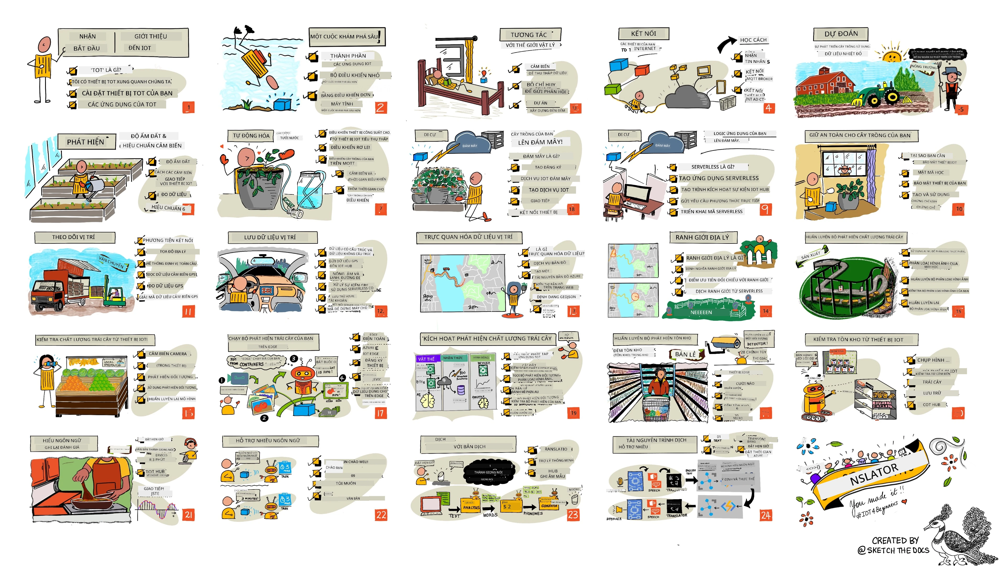

[](https://github.com/microsoft/IoT-For-Beginners/blob/master/LICENSE)
[](https://GitHub.com/microsoft/IoT-For-Beginners/graphs/contributors/)
[](https://GitHub.com/microsoft/IoT-For-Beginners/issues/)
[](https://GitHub.com/microsoft/IoT-For-Beginners/pulls/)
[](http://makeapullrequest.com)

[](https://GitHub.com/microsoft/IoT-For-Beginners/watchers/)
[](https://GitHub.com/microsoft/IoT-For-Beginners/network/)
[](https://GitHub.com/microsoft/IoT-For-Beginners/stargazers/)

### Tham gia Cộng đồng Azure AI Foundry

Nếu bạn gặp khó khăn hoặc có bất kỳ câu hỏi nào về xây dựng ứng dụng AI. Tham gia cùng những người học và nhà phát triển giàu kinh nghiệm trong các cuộc thảo luận về MCP. Đây là một cộng đồng hỗ trợ nơi các câu hỏi được hoan nghênh và kiến thức được chia sẻ một cách thoải mái.

[](https://discord.gg/nTYy5BXMWG)

Nếu bạn có phản hồi về sản phẩm hoặc lỗi khi xây dựng, hãy truy cập:

[](https://aka.ms/foundry/forum)

Thực hiện các bước sau để bắt đầu sử dụng các tài nguyên này:
1. **Tạo Fork Kho lưu trữ**: Nhấn [](https://GitHub.com/microsoft/IoT-For-Beginners/fork)
2. **Clone Kho lưu trữ**:   `git clone https://github.com/microsoft/IoT-For-Beginners.git`
3. [**Tham gia Microsot Foundry Discord và gặp gỡ các chuyên gia cũng như những nhà phát triển khác**](https://discord.com/invite/ByRwuEEgH4)


### 🌐 Hỗ trợ Đa Ngôn Ngữ

#### Hỗ trợ qua GitHub Action (Tự động & Luôn Cập nhật)

<!-- CO-OP TRANSLATOR LANGUAGES TABLE START -->
[Arabic](../ar/README.md) | [Bengali](../bn/README.md) | [Bulgarian](../bg/README.md) | [Burmese (Myanmar)](../my/README.md) | [Chinese (Simplified)](../zh-CN/README.md) | [Chinese (Traditional, Hong Kong)](../zh-HK/README.md) | [Chinese (Traditional, Macau)](../zh-MO/README.md) | [Chinese (Traditional, Taiwan)](../zh-TW/README.md) | [Croatian](../hr/README.md) | [Czech](../cs/README.md) | [Danish](../da/README.md) | [Dutch](../nl/README.md) | [Estonian](../et/README.md) | [Finnish](../fi/README.md) | [French](../fr/README.md) | [German](../de/README.md) | [Greek](../el/README.md) | [Hebrew](../he/README.md) | [Hindi](../hi/README.md) | [Hungarian](../hu/README.md) | [Indonesian](../id/README.md) | [Italian](../it/README.md) | [Japanese](../ja/README.md) | [Kannada](../kn/README.md) | [Khmer](../km/README.md) | [Korean](../ko/README.md) | [Lithuanian](../lt/README.md) | [Malay](../ms/README.md) | [Malayalam](../ml/README.md) | [Marathi](../mr/README.md) | [Nepali](../ne/README.md) | [Nigerian Pidgin](../pcm/README.md) | [Norwegian](../no/README.md) | [Persian (Farsi)](../fa/README.md) | [Polish](../pl/README.md) | [Portuguese (Brazil)](../pt-BR/README.md) | [Portuguese (Portugal)](../pt-PT/README.md) | [Punjabi (Gurmukhi)](../pa/README.md) | [Romanian](../ro/README.md) | [Russian](../ru/README.md) | [Serbian (Cyrillic)](../sr/README.md) | [Slovak](../sk/README.md) | [Slovenian](../sl/README.md) | [Spanish](../es/README.md) | [Swahili](../sw/README.md) | [Swedish](../sv/README.md) | [Tagalog (Filipino)](../tl/README.md) | [Tamil](../ta/README.md) | [Telugu](../te/README.md) | [Thai](../th/README.md) | [Turkish](../tr/README.md) | [Ukrainian](../uk/README.md) | [Urdu](../ur/README.md) | [Vietnamese](./README.md)

> **Ưu tiên Clone Cục bộ?**
>
> Kho lưu trữ này bao gồm hơn 50 bản dịch ngôn ngữ làm tăng đáng kể kích thước tải xuống. Để clone không bao gồm bản dịch, sử dụng sparse checkout:
>
> **Bash / macOS / Linux:**
> ```bash
> git clone --filter=blob:none --sparse https://github.com/microsoft/IoT-For-Beginners.git
> cd IoT-For-Beginners
> git sparse-checkout set --no-cone '/*' '!translations' '!translated_images'
> ```
>
> **CMD (Windows):**
> ```cmd
> git clone --filter=blob:none --sparse https://github.com/microsoft/IoT-For-Beginners.git
> cd IoT-For-Beginners
> git sparse-checkout set --no-cone "/*" "!translations" "!translated_images"
> ```
>
> Điều này cung cấp cho bạn mọi thứ cần thiết để hoàn thành khóa học với tốc độ tải xuống nhanh hơn nhiều.
<!-- CO-OP TRANSLATOR LANGUAGES TABLE END -->

# IoT cho Người mới bắt đầu - Một Chương trình Học

Các Chuyên gia Azure Cloud tại Microsoft vui mừng cung cấp một chương trình học 12 tuần, 24 bài học bao gồm tất cả về kiến thức cơ bản của IoT. Mỗi bài học bao gồm bài kiểm tra trước và sau bài học, hướng dẫn viết để hoàn thành bài học, giải pháp, bài tập và nhiều hơn nữa. Phương pháp giảng dạy dựa trên dự án cho phép bạn học trong khi xây dựng, là cách đã được chứng minh giúp kỹ năng mới 'bám chắc'.

Các dự án bao gồm hành trình của thực phẩm từ trang trại đến bàn ăn. Điều này bao gồm nông nghiệp, logistics, sản xuất, bán lẻ và người tiêu dùng - tất cả đều là những lĩnh vực phổ biến trong ngành dùng thiết bị IoT.



> Sketchnote của [Nitya Narasimhan](https://github.com/nitya). Nhấn vào hình để xem phiên bản lớn hơn.

**Xin chân thành cảm ơn các tác giả [Jen Fox](https://github.com/jenfoxbot), [Jen Looper](https://github.com/jlooper), [Jim Bennett](https://github.com/jimbobbennett), và nghệ sĩ sketchnote của chúng tôi [Nitya Narasimhan](https://github.com/nitya).**

**Cảm ơn cũng tới nhóm [Đại sứ Sinh viên Microsoft Learn](https://studentambassadors.microsoft.com?WT.mc_id=academic-17441-jabenn) đã xem xét và dịch chương trình học này - [Aditya Garg](https://github.com/AdityaGarg00), [Anurag Sharma](https://github.com/Anurag-0-1-A), [Arpita Das](https://github.com/Arpiiitaaa), [Aryan Jain](https://www.linkedin.com/in/aryan-jain-47a4a1145/), [Bhavesh Suneja](https://github.com/EliteWarrior315), [Faith Hunja](https://faithhunja.github.io/), [Lateefah Bello](https://www.linkedin.com/in/lateefah-bello/), [Manvi Jha](https://github.com/Severus-Matthew), [Mireille Tan](https://www.linkedin.com/in/mireille-tan-a4834819a/), [Mohammad Iftekher (Iftu) Ebne Jalal](https://github.com/Iftu119), [Mohammad Zulfikar](https://github.com/mohzulfikar), [Priyanshu Srivastav](https://www.linkedin.com/in/priyanshu-srivastav-b067241ba), [Thanmai Gowducheruvu](https://github.com/innovation-platform), và [Zina Kamel](https://www.linkedin.com/in/zina-kamel/).**

Gặp gỡ đội ngũ!

[](https://youtu.be/-wippUJRi5k)

**Gif bởi** [Mohit Jaisal](https://linkedin.com/in/mohitjaisal)

> 🎥 Nhấn vào hình trên để xem video về dự án!

> **Giáo viên**, chúng tôi đã [đưa ra một số gợi ý](for-teachers.md) về cách sử dụng chương trình học này. Nếu bạn muốn tạo bài học của riêng mình, chúng tôi cũng đã bao gồm một [mẫu bài học](lesson-template/README.md).

> **[Sinh viên](https://aka.ms/student-page)**, để sử dụng chương trình học này một cách độc lập, hãy fork toàn bộ repo và hoàn thành các bài tập một mình, bắt đầu với bài kiểm tra trước bài giảng, sau đó đọc bài giảng và hoàn thành các hoạt động còn lại. Cố gắng tạo các dự án bằng cách hiểu bài học thay vì sao chép mã giải pháp; tuy nhiên mã đó có sẵn trong thư mục /solutions trong mỗi bài học hướng dự án. Một ý tưởng khác là thành lập nhóm học với bạn bè và cùng nhau học nội dung. Để học sâu hơn, chúng tôi khuyến nghị [Microsoft Learn](https://docs.microsoft.com/users/jimbobbennett/collections/ke2ehd351jopwr?WT.mc_id=academic-17441-jabenn).

Để xem video tổng quan về khóa học này, xem video sau:

[](https://youtube.com/watch?v=bccEMm8gRuc "Promo video")

> 🎥 Nhấn vào hình trên để xem video về dự án!

## Phương pháp giảng dạy

Chúng tôi đã chọn hai nguyên tắc sư phạm khi xây dựng chương trình học này: đảm bảo nó dựa trên dự án và bao gồm các bài kiểm tra thường xuyên. Vào cuối chuỗi bài học, học viên sẽ xây dựng được hệ thống giám sát và tưới cây, bộ định vị phương tiện, thiết lập nhà máy thông minh để theo dõi và kiểm tra thực phẩm, đồng thời bộ hẹn giờ nấu ăn điều khiển bằng giọng nói, và sẽ học được những kiến thức cơ bản về Internet vạn vật bao gồm cách viết mã thiết bị, kết nối với đám mây, phân tích dữ liệu thu thập và chạy AI ở biên.

Bằng cách đảm bảo nội dung phù hợp với dự án, quá trình học trở nên hấp dẫn hơn với học viên và tăng cường việc ghi nhớ các khái niệm.

Ngoài ra, một bài kiểm tra nhẹ trước lớp thiết lập mục tiêu học tập cho học viên, trong khi bài kiểm tra thứ hai sau lớp giúp củng cố kiến thức. Chương trình học được thiết kế linh hoạt và thú vị, có thể thực hiện toàn bộ hoặc từng phần. Các dự án bắt đầu nhỏ và trở nên phức tạp hơn theo từng tuần trong chu kỳ 12 tuần.

Mỗi dự án dựa trên phần cứng thực tế có sẵn cho học viên và những người đam mê. Mỗi dự án cũng xem xét lĩnh vực chuyên môn, cung cấp kiến thức nền phù hợp. Để trở thành nhà phát triển thành công, cần hiểu lĩnh vực bạn đang giải quyết vấn đề, kiến thức nền này giúp học viên suy nghĩ về giải pháp IoT của họ trong bối cảnh các vấn đề thực tế mà họ có thể được yêu cầu giải quyết như một nhà phát triển IoT. Học viên học được 'tại sao' của các giải pháp họ xây dựng và hiểu rõ người dùng cuối.

## Phần cứng
Chúng tôi có hai lựa chọn phần cứng IoT để sử dụng cho các dự án tùy thuộc vào sở thích cá nhân, kiến thức hoặc sở thích về ngôn ngữ lập trình, mục tiêu học tập và tính khả dụng. Chúng tôi cũng đã cung cấp một phiên bản 'phần cứng ảo' dành cho những ai không có phần cứng, hoặc muốn tìm hiểu thêm trước khi cam kết mua. Bạn có thể đọc thêm và tìm danh sách 'mua sắm' trên [trang phần cứng](./hardware.md), bao gồm các liên kết để mua bộ dụng cụ hoàn chỉnh từ bạn bè của chúng tôi tại Seeed Studio.

> 💁 Tìm hiểu [Bộ Quy Tắc Ứng Xử](CODE_OF_CONDUCT.md), [Hướng dẫn Đóng góp](CONTRIBUTING.md), và [Dịch thuật](..) của chúng tôi. Chúng tôi hoan nghênh phản hồi xây dựng của bạn!
>
> 🔧 Gặp sự cố? Hãy xem [Hướng dẫn Khắc phục sự cố](TROUBLESHOOTING.md) để tìm giải pháp cho các vấn đề phổ biến.

## Mỗi bài học bao gồm:

- bản phác thảo
- video bổ sung tùy chọn
- bài kiểm tra khởi động trước bài học
- bài học viết
- đối với các bài học dựa trên dự án, hướng dẫn từng bước để xây dựng dự án
- kiểm tra kiến thức
- thử thách
- bài đọc bổ sung
- bài kiểm tra sau bài học [post-lesson quiz](https://ff-quizzes.netlify.app/en/)

> **Lưu ý về các bài kiểm tra**: Tất cả các bài kiểm tra đều nằm trong thư mục quiz-app, với tổng cộng 48 bài kiểm tra, mỗi bài gồm ba câu hỏi. Chúng được liên kết trong các bài học nhưng ứng dụng kiểm tra có thể chạy cục bộ hoặc được triển khai lên Azure; vui lòng theo hướng dẫn trong thư mục `quiz-app`. Chúng đang được địa phương hóa dần.

## Các bài học

|       |              Tên Dự Án               |                       Các Khái Niệm Được Dạy                       | Mục Tiêu Học Tập                                                                                                                                                    |                                                        Bài học liên kết                                                         |
| :---: | :---------------------------------: | :----------------------------------------------------------------: | ------------------------------------------------------------------------------------------------------------------------------------------------------------------ | :----------------------------------------------------------------------------------------------------------------------------: |
|  01   | [Bắt đầu](./1-getting-started/README.md) |                     Giới thiệu về IoT                              | Tìm hiểu các nguyên tắc cơ bản của IoT và các thành phần cơ bản của giải pháp IoT như cảm biến và dịch vụ đám mây trong khi bạn thiết lập thiết bị IoT đầu tiên |                      [Giới thiệu về IoT](./1-getting-started/lessons/1-introduction-to-iot/README.md)                      |
|  02   | [Bắt đầu](./1-getting-started/README.md) |                   Tìm hiểu sâu hơn về IoT                           | Tìm hiểu thêm về các thành phần của hệ thống IoT, cũng như vi điều khiển và máy tính bảng đơn                                                                    |                        [Tìm hiểu sâu hơn về IoT](./1-getting-started/lessons/2-deeper-dive/README.md)                         |
|  03   | [Bắt đầu](./1-getting-started/README.md) | Tương tác với thế giới vật lý bằng cảm biến và bộ truyền động       | Tìm hiểu về cảm biến để thu thập dữ liệu từ thế giới vật lý, và bộ truyền động để gửi phản hồi, trong khi bạn xây dựng đèn ngủ                                    | [Tương tác với thế giới vật lý bằng cảm biến và bộ truyền động](./1-getting-started/lessons/3-sensors-and-actuators/README.md) |
|  04   | [Bắt đầu](./1-getting-started/README.md) |             Kết nối thiết bị của bạn với Internet                   | Tìm hiểu cách kết nối một thiết bị IoT với Internet để gửi và nhận tin nhắn bằng cách kết nối đèn ngủ của bạn với máy chủ MQTT                                    |               [Kết nối thiết bị của bạn với Internet](./1-getting-started/lessons/4-connect-internet/README.md)                |
|  05   |            [Nông trại](./2-farm/README.md)            |                    Dự đoán sự phát triển của cây                     | Tìm hiểu cách dự đoán sự phát triển của cây sử dụng dữ liệu nhiệt độ được thu thập bởi thiết bị IoT                                                               |                          [Dự đoán sự phát triển của cây](./2-farm/lessons/1-predict-plant-growth/README.md)                           |
|  06   |            [Nông trại](./2-farm/README.md)            |                    Phát hiện độ ẩm đất                              | Tìm hiểu cách phát hiện độ ẩm đất và hiệu chuẩn cảm biến độ ẩm đất                                                                                               |                          [Phát hiện độ ẩm đất](./2-farm/lessons/2-detect-soil-moisture/README.md)                           |
|  07   |            [Nông trại](./2-farm/README.md)            |                  Tưới cây tự động                                 | Tìm hiểu cách tự động hóa và lập lịch tưới cây sử dụng rơ le và MQTT                                                                                              |                      [Tưới cây tự động](./2-farm/lessons/3-automated-plant-watering/README.md)                       |
|  08   |            [Nông trại](./2-farm/README.md)            |               Di chuyển cây của bạn lên đám mây                    | Tìm hiểu về đám mây và các dịch vụ IoT được lưu trữ trên đám mây và cách kết nối cây của bạn với một trong số đó thay vì máy chủ MQTT công cộng                    |               [Di chuyển cây của bạn lên đám mây](./2-farm/lessons/4-migrate-your-plant-to-the-cloud/README.md)                |
|  09   |            [Nông trại](./2-farm/README.md)            |         Di chuyển logic ứng dụng của bạn lên đám mây              | Tìm hiểu cách bạn có thể viết logic ứng dụng trên đám mây phản hồi các tin nhắn IoT                                                                              |         [Di chuyển logic ứng dụng của bạn lên đám mây](./2-farm/lessons/5-migrate-application-to-the-cloud/README.md)         |
|  10   |            [Nông trại](./2-farm/README.md)            |                   Giữ an toàn cho cây của bạn                      | Tìm hiểu về bảo mật trong IoT và cách giữ an toàn cho cây của bạn với các khóa và chứng chỉ                                                                       |                        [Giữ an toàn cho cây của bạn](./2-farm/lessons/6-keep-your-plant-secure/README.md)                         |
|  11   |       [Vận tải](./3-transport/README.md)       |                      Theo dõi vị trí                                | Tìm hiểu về theo dõi vị trí GPS cho các thiết bị IoT                                                                                                             |                           [Theo dõi vị trí](./3-transport/lessons/1-location-tracking/README.md)                           |
|  12   |       [Vận tải](./3-transport/README.md)       |                     Lưu trữ dữ liệu vị trí                         | Tìm hiểu cách lưu trữ dữ liệu IoT để trực quan hóa hoặc phân tích sau                                                                                             |                         [Lưu trữ dữ liệu vị trí](./3-transport/lessons/2-store-location-data/README.md)                         |
|  13   |       [Vận tải](./3-transport/README.md)       |                   Trực quan hóa dữ liệu vị trí                     | Tìm hiểu về trực quan hóa dữ liệu vị trí trên bản đồ, và cách bản đồ biểu diễn thế giới 3 chiều thực tế trong 2 chiều                                                |                     [Trực quan hóa dữ liệu vị trí](./3-transport/lessons/3-visualize-location-data/README.md)                     |
|  14   |       [Vận tải](./3-transport/README.md)       |                          Vùng hàng rào địa lý                      | Tìm hiểu về các vùng hàng rào địa lý (geofences), và cách chúng được sử dụng để cảnh báo khi các phương tiện trong chuỗi cung ứng gần điểm đến của chúng           |                                   [Vùng hàng rào địa lý](./3-transport/lessons/4-geofences/README.md)                                   |
|  15   |   [Sản xuất](./4-manufacturing/README.md)   |               Huấn luyện bộ phát hiện chất lượng trái cây           | Tìm hiểu cách huấn luyện bộ phân loại hình ảnh trên đám mây để phát hiện chất lượng trái cây                                                                      |                 [Huấn luyện bộ phát hiện chất lượng trái cây](./4-manufacturing/lessons/1-train-fruit-detector/README.md)                 |
|  16   |   [Sản xuất](./4-manufacturing/README.md)   |           Kiểm tra chất lượng trái cây từ thiết bị IoT            | Tìm hiểu cách sử dụng bộ phát hiện chất lượng trái cây của bạn từ một thiết bị IoT                                                                                |           [Kiểm tra chất lượng trái cây từ thiết bị IoT](./4-manufacturing/lessons/2-check-fruit-from-device/README.md)            |
|  17   |   [Sản xuất](./4-manufacturing/README.md)   |             Chạy bộ phát hiện trái cây trên edge                   | Tìm hiểu về việc chạy bộ phát hiện trái cây trên thiết bị IoT tại edge                                                                                            |             [Chạy bộ phát hiện trái cây trên edge](./4-manufacturing/lessons/3-run-fruit-detector-edge/README.md)             |
|  18   |   [Sản xuất](./4-manufacturing/README.md)   |        Kích hoạt phát hiện chất lượng trái cây từ cảm biến         | Tìm hiểu cách kích hoạt phát hiện chất lượng trái cây từ cảm biến                                                                                                |        [Kích hoạt phát hiện chất lượng trái cây từ cảm biến](./4-manufacturing/lessons/4-trigger-fruit-detector/README.md)         |
|  19   |          [Bán lẻ](./5-retail/README.md)          |                   Huấn luyện bộ phát hiện tồn kho                  | Tìm hiểu cách sử dụng phát hiện đối tượng để huấn luyện bộ phát hiện tồn kho đếm hàng trong cửa hàng                                                            |                        [Huấn luyện bộ phát hiện tồn kho](./5-retail/lessons/1-train-stock-detector/README.md)                         |
|  20   |          [Bán lẻ](./5-retail/README.md)          |               Kiểm tra tồn kho từ thiết bị IoT                      | Tìm hiểu cách kiểm tra tồn kho từ thiết bị IoT sử dụng mô hình phát hiện đối tượng                                                                                |                     [Kiểm tra tồn kho từ thiết bị IoT](./5-retail/lessons/2-check-stock-device/README.md)                      |
|  21   |        [Người tiêu dùng](./6-consumer/README.md)        |             Nhận dạng giọng nói với thiết bị IoT                   | Tìm hiểu cách nhận dạng giọng nói từ thiết bị IoT để xây dựng bộ hẹn giờ thông minh                                                                               |                  [Nhận dạng giọng nói với thiết bị IoT](./6-consumer/lessons/1-speech-recognition/README.md)                  |
|  22   |        [Người tiêu dùng](./6-consumer/README.md)        |                     Hiểu ngôn ngữ                                  | Tìm hiểu cách hiểu các câu nói với thiết bị IoT                                                                                                                   |                        [Hiểu ngôn ngữ](./6-consumer/lessons/2-language-understanding/README.md)                        |
|  23   |        [Người tiêu dùng](./6-consumer/README.md)        |           Đặt bộ hẹn giờ và cung cấp phản hồi bằng giọng nói       | Tìm hiểu cách đặt bộ hẹn giờ trên thiết bị IoT và cung cấp phản hồi bằng giọng nói khi bộ hẹn giờ được đặt và khi kết thúc                                      |                 [Đặt bộ hẹn giờ và cung cấp phản hồi bằng giọng nói](./6-consumer/lessons/3-spoken-feedback/README.md)                  |
|  24   |        [Người tiêu dùng](./6-consumer/README.md)        |                 Hỗ trợ đa ngôn ngữ                                 | Tìm hiểu cách hỗ trợ nhiều ngôn ngữ, cả khi nói chuyện với và những phản hồi từ bộ hẹn giờ thông minh của bạn                                                     |                   [Hỗ trợ đa ngôn ngữ](./6-consumer/lessons/4-multiple-language-support/README.md)                   |

## Truy cập ngoại tuyến

Bạn có thể chạy tài liệu này ngoại tuyến bằng cách sử dụng [Docsify](https://docsify.js.org/#/). Fork repo này, [cài đặt Docsify](https://docsify.js.org/#/quickstart) trên máy cục bộ của bạn, rồi trong thư mục gốc của repo này, gõ `docsify serve`. Website sẽ được phục vụ trên cổng 3000 trên máy localhost của bạn: `localhost:3000`.

## Bài kiểm tra

Cảm ơn cộng đồng đã tổ chức bài kiểm tra tương tác để kiểm tra kiến thức của bạn về mỗi chương. Bạn có thể kiểm tra kiến thức của mình [tại đây](https://ff-quizzes.netlify.app/en/)

### PDF

Bạn có thể tạo file PDF từ nội dung này để truy cập ngoại tuyến nếu cần. Để làm điều này, hãy chắc chắn bạn đã [cài đặt npm](https://docs.npmjs.com/downloading-and-installing-node-js-and-npm) và chạy các lệnh sau trong thư mục gốc của repo này:

```sh
npm i
npm run convert
```

### Slides

Có các bộ slide cho một số bài học trong thư mục [slides](../../slides).

## Các chương trình học khác

Đội ngũ chúng tôi còn sản xuất các chương trình học khác! Hãy xem:

<!-- CO-OP TRANSLATOR OTHER COURSES START -->
### LangChain
[](https://aka.ms/langchain4j-for-beginners)
[](https://aka.ms/langchainjs-for-beginners?WT.mc_id=m365-94501-dwahlin)
[](https://github.com/microsoft/langchain-for-beginners?WT.mc_id=m365-94501-dwahlin)
---

### Azure / Edge / MCP / Agents
[](https://github.com/microsoft/AZD-for-beginners?WT.mc_id=academic-105485-koreyst)
[](https://github.com/microsoft/edgeai-for-beginners?WT.mc_id=academic-105485-koreyst)
[](https://github.com/microsoft/mcp-for-beginners?WT.mc_id=academic-105485-koreyst)
[](https://github.com/microsoft/ai-agents-for-beginners?WT.mc_id=academic-105485-koreyst)

---
 
### Series AI Sinh tạo
[](https://github.com/microsoft/generative-ai-for-beginners?WT.mc_id=academic-105485-koreyst)
[-9333EA?style=for-the-badge&labelColor=E5E7EB&color=9333EA)](https://github.com/microsoft/Generative-AI-for-beginners-dotnet?WT.mc_id=academic-105485-koreyst)
[-C084FC?style=for-the-badge&labelColor=E5E7EB&color=C084FC)](https://github.com/microsoft/generative-ai-for-beginners-java?WT.mc_id=academic-105485-koreyst)
[-E879F9?style=for-the-badge&labelColor=E5E7EB&color=E879F9)](https://github.com/microsoft/generative-ai-with-javascript?WT.mc_id=academic-105485-koreyst)

---
 
### Học tập Cốt lõi
[](https://aka.ms/ml-beginners?WT.mc_id=academic-105485-koreyst)
[](https://aka.ms/datascience-beginners?WT.mc_id=academic-105485-koreyst)
[](https://aka.ms/ai-beginners?WT.mc_id=academic-105485-koreyst)
[](https://github.com/microsoft/Security-101?WT.mc_id=academic-96948-sayoung)
[](https://aka.ms/webdev-beginners?WT.mc_id=academic-105485-koreyst)
[](https://aka.ms/iot-beginners?WT.mc_id=academic-105485-koreyst)
[](https://github.com/microsoft/xr-development-for-beginners?WT.mc_id=academic-105485-koreyst)

---
 
### Series Copilot
[](https://aka.ms/GitHubCopilotAI?WT.mc_id=academic-105485-koreyst)
[](https://github.com/microsoft/mastering-github-copilot-for-dotnet-csharp-developers?WT.mc_id=academic-105485-koreyst)
[](https://github.com/microsoft/CopilotAdventures?WT.mc_id=academic-105485-koreyst)
<!-- CO-OP TRANSLATOR OTHER COURSES END -->

## Phân quyền hình ảnh

Bạn có thể tìm tất cả các phân quyền cho các hình ảnh được sử dụng trong chương trình học này khi cần trong [Phân quyền](./attributions.md).

---

<!-- CO-OP TRANSLATOR DISCLAIMER START -->
**Tuyên bố từ chối trách nhiệm**:  
Tài liệu này đã được dịch bằng dịch vụ dịch thuật AI [Co-op Translator](https://github.com/Azure/co-op-translator). Mặc dù chúng tôi cố gắng đảm bảo độ chính xác, xin lưu ý rằng các bản dịch tự động có thể chứa lỗi hoặc không chính xác. Tài liệu gốc bằng ngôn ngữ gốc của nó nên được coi là nguồn thông tin chính thức. Đối với những thông tin quan trọng, khuyến nghị sử dụng dịch vụ dịch thuật chuyên nghiệp. Chúng tôi không chịu trách nhiệm về bất kỳ sự hiểu nhầm hoặc giải thích sai nào phát sinh từ việc sử dụng bản dịch này.
<!-- CO-OP TRANSLATOR DISCLAIMER END -->