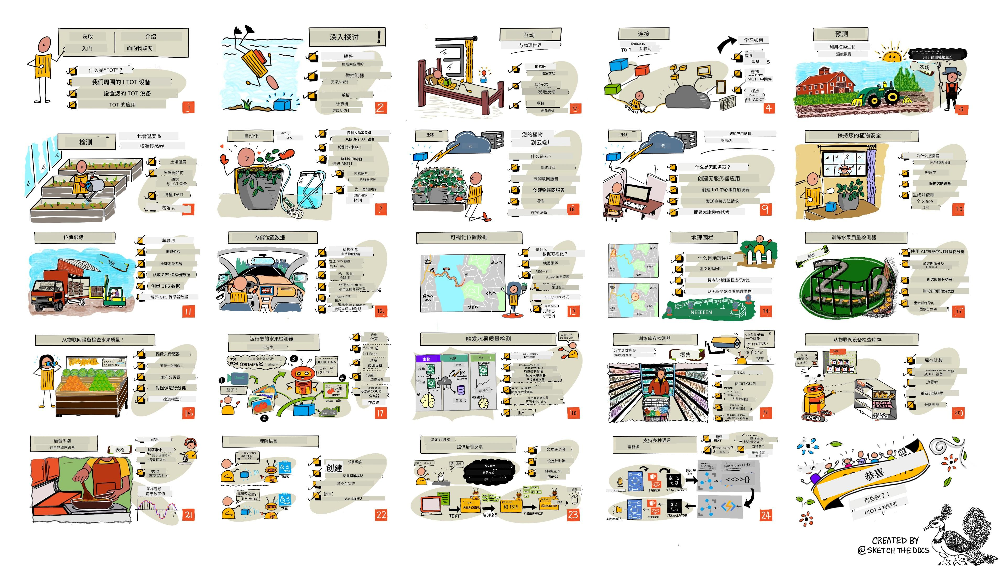

<!--
CO_OP_TRANSLATOR_METADATA:
{
  "original_hash": "6c354ec3487e4f6cfafbe44557996cd9",
  "translation_date": "2026-01-05T17:23:49+00:00",
  "source_file": "README.md",
  "language_code": "zh"
}
-->
[](https://github.com/microsoft/IoT-For-Beginners/blob/master/LICENSE)
[](https://GitHub.com/microsoft/IoT-For-Beginners/graphs/contributors/)
[](https://GitHub.com/microsoft/IoT-For-Beginners/issues/)
[](https://GitHub.com/microsoft/IoT-For-Beginners/pulls/)
[](http://makeapullrequest.com)

[](https://GitHub.com/microsoft/IoT-For-Beginners/watchers/)
[](https://GitHub.com/microsoft/IoT-For-Beginners/network/)
[](https://GitHub.com/microsoft/IoT-For-Beginners/stargazers/)

### 加入 Azure AI Foundry 社区

如果您遇到困难或对构建 AI 应用有任何疑问，请加入学习者和经验丰富的开发人员一起讨论 MCP 的社区。这是一个支持性强的社区，欢迎提问并自由分享知识。

[](https://discord.gg/nTYy5BXMWG)

如果您在构建过程中有产品反馈或错误，请访问：

[](https://aka.ms/foundry/forum)

开始使用这些资源，请按照以下步骤操作：
1. **Fork 仓库**：点击 [](https://GitHub.com/microsoft/IoT-For-Beginners/fork)
2. **克隆仓库**：   `git clone https://github.com/microsoft/IoT-For-Beginners.git`
3. [**加入 Microsot Foundry Discord，结识专家和开发者**](https://discord.com/invite/ByRwuEEgH4)


### 🌐 多语言支持

#### 通过 GitHub Action 支持（自动且始终保持最新）

<!-- CO-OP TRANSLATOR LANGUAGES TABLE START -->
[Arabic](../ar/README.md) | [Bengali](../bn/README.md) | [Bulgarian](../bg/README.md) | [Burmese (Myanmar)](../my/README.md) | [Chinese (Simplified)](./README.md) | [Chinese (Traditional, Hong Kong)](../hk/README.md) | [Chinese (Traditional, Macau)](../mo/README.md) | [Chinese (Traditional, Taiwan)](../tw/README.md) | [Croatian](../hr/README.md) | [Czech](../cs/README.md) | [Danish](../da/README.md) | [Dutch](../nl/README.md) | [Estonian](../et/README.md) | [Finnish](../fi/README.md) | [French](../fr/README.md) | [German](../de/README.md) | [Greek](../el/README.md) | [Hebrew](../he/README.md) | [Hindi](../hi/README.md) | [Hungarian](../hu/README.md) | [Indonesian](../id/README.md) | [Italian](../it/README.md) | [Japanese](../ja/README.md) | [Kannada](../kn/README.md) | [Korean](../ko/README.md) | [Lithuanian](../lt/README.md) | [Malay](../ms/README.md) | [Malayalam](../ml/README.md) | [Marathi](../mr/README.md) | [Nepali](../ne/README.md) | [Nigerian Pidgin](../pcm/README.md) | [Norwegian](../no/README.md) | [Persian (Farsi)](../fa/README.md) | [Polish](../pl/README.md) | [Portuguese (Brazil)](../br/README.md) | [Portuguese (Portugal)](../pt/README.md) | [Punjabi (Gurmukhi)](../pa/README.md) | [Romanian](../ro/README.md) | [Russian](../ru/README.md) | [Serbian (Cyrillic)](../sr/README.md) | [Slovak](../sk/README.md) | [Slovenian](../sl/README.md) | [Spanish](../es/README.md) | [Swahili](../sw/README.md) | [Swedish](../sv/README.md) | [Tagalog (Filipino)](../tl/README.md) | [Tamil](../ta/README.md) | [Telugu](../te/README.md) | [Thai](../th/README.md) | [Turkish](../tr/README.md) | [Ukrainian](../uk/README.md) | [Urdu](../ur/README.md) | [Vietnamese](../vi/README.md)

> **更喜欢本地克隆？**

> 本仓库包括超过50种语言的翻译版本，这会大大增加下载大小。若想不包含翻译克隆仓库，请使用稀疏检出：
> ```bash
> git clone --filter=blob:none --sparse https://github.com/microsoft/IoT-For-Beginners.git
> cd IoT-For-Beginners
> git sparse-checkout set --no-cone '/*' '!translations' '!translated_images'
> ```
> 这样可以用更快的速度下载完成课程所需的所有内容。
<!-- CO-OP TRANSLATOR LANGUAGES TABLE END -->

# IoT 初学者课程

微软 Azure 云倡导者团队很高兴推出一门为期 12 周、包含 24 节课的物联网基础课程。每节课都包括课前和课后测验、完成课程所需的书面指导、解决方案、作业等。我们的项目式教学法允许你在构建中学习，这是新技能更易掌握的验证方法。

项目涵盖食品从农场到餐桌的全过程，包括农业、物流、制造、零售及消费者——这些都是物联网设备常见的行业领域。



> 绘图由 [Nitya Narasimhan](https://github.com/nitya) 制作。点击图片查看大图。

**衷心感谢我们的作者 [Jen Fox](https://github.com/jenfoxbot)、[Jen Looper](https://github.com/jlooper)、[Jim Bennett](https://github.com/jimbobbennett) 以及我们的绘图艺术家 [Nitya Narasimhan](https://github.com/nitya)。**

**还感谢我们的 [Microsoft Learn 学生大使团队](https://studentambassadors.microsoft.com?WT.mc_id=academic-17441-jabenn) 对课程内容的审核和翻译——[Aditya Garg](https://github.com/AdityaGarg00)、[Anurag Sharma](https://github.com/Anurag-0-1-A)、[Arpita Das](https://github.com/Arpiiitaaa)、[Aryan Jain](https://www.linkedin.com/in/aryan-jain-47a4a1145/)、[Bhavesh Suneja](https://github.com/EliteWarrior315)、[Faith Hunja](https://faithhunja.github.io/)、[Lateefah Bello](https://www.linkedin.com/in/lateefah-bello/)、[Manvi Jha](https://github.com/Severus-Matthew)、[Mireille Tan](https://www.linkedin.com/in/mireille-tan-a4834819a/)、[Mohammad Iftekher (Iftu) Ebne Jalal](https://github.com/Iftu119)、[Mohammad Zulfikar](https://github.com/mohzulfikar)、[Priyanshu Srivastav](https://www.linkedin.com/in/priyanshu-srivastav-b067241ba)、[Thanmai Gowducheruvu](https://github.com/innovation-platform)、以及 [Zina Kamel](https://www.linkedin.com/in/zina-kamel/)。**

认识我们的团队！

[](https://youtu.be/-wippUJRi5k)

**动图由** [Mohit Jaisal](https://linkedin.com/in/mohitjaisal) 制作

> 🎥 点击上方图片观看该项目的视频介绍！

> **教师们**，我们提供了[一些使用课程的建议](for-teachers.md)。如果您想创建自己的课程，也提供了[课程模板](lesson-template/README.md)。

> **[学生](https://aka.ms/student-page)**，若想独立使用此课程，请 fork 整个仓库，并从课前测验开始，完成阅读讲座和其他所有活动。请尝试理解课程内容并创建项目，而不是直接复制解决方案代码；当然解决方案代码在每个面向项目的课程的 /solutions 文件夹中可用。另一种方式是与朋友组队一起学习。推荐进一步学习 [Microsoft Learn](https://docs.microsoft.com/users/jimbobbennett/collections/ke2ehd351jopwr?WT.mc_id=academic-17441-jabenn)。

查看本课程的视频概述：

[](https://youtube.com/watch?v=bccEMm8gRuc "宣传视频")

> 🎥 点击上方图片观看该项目的视频介绍！

## 教学法

我们构建本课程时采用了两个教学原则：确保其基于项目和包含频繁测验。完成本系列后，学生将构建一个植物监测与浇水系统、车辆追踪器、用于跟踪和检查食品的智能工厂设置以及一个语音控制的烹饪计时器，并将学习物联网的基础知识，包括如何编写设备代码、连接云端、分析遥测数据以及在边缘运行 AI。

通过确保内容与项目相关，学习过程更具吸引力，有助于增强概念的记忆。

此外，课前的低风险测验有助于学生确立学习目标，课后的第二次测验有助于巩固记忆。该课程设计灵活且有趣，可完整学习也可部分学习。项目从简单开始，到12周课程结束时逐步变得复杂。

每个项目基于学生和爱好者都能获得的真实硬件。每个项目都会介绍相关项目领域的背景知识。成为成功的开发者，理解所解决问题的领域非常重要，提供这些背景知识让学生能在实际物联网开发中思考解决方案和学习内容。学生不仅学会构建“为什么”，还会理解终端用户的需求。

## 硬件

针对项目，我们提供两种物联网硬件选择，取决于个人偏好、编程语言知识、学习目标和硬件可用性。我们也为没有硬件或想先了解更多的人提供了“虚拟硬件”版本。更多信息及“购物清单”可见[硬件页面](./hardware.md)，其中包括与 Seeed Studio 朋友们合作的完整套件购买链接。
> 💁 了解我们的[行为准则](CODE_OF_CONDUCT.md)、[贡献指南](CONTRIBUTING.md)和[翻译指南](TRANSLATIONS.md)。我们欢迎您的建设性反馈！
>
> 🔧 遇到问题？请查看我们的[故障排除指南](TROUBLESHOOTING.md)，了解常见问题的解决方案。

## 每节课包括：

- 草图笔记
- 可选补充视频
- 课前热身测验
- 书面课程
- 对于基于项目的课程，提供一步步的项目构建指南
- 知识检测
- 挑战
- 补充阅读
- 作业
- [课后测验](https://ff-quizzes.netlify.app/en/)

> **关于测验的说明**：所有测验均包含在quiz-app文件夹中，共48个测验，每个测验包含三个问题。它们在课程中链接，但测验应用可以本地运行或部署到Azure；请按照quiz-app文件夹中的说明操作。测验正逐步本地化。

## 课程列表

|       |              项目名称              |                       授课内容                       | 学习目标                                                                                                                                                          |                                                        关联课程                                                         |
| :---: | :------------------------------------: | :---------------------------------------------------------: | ------------------------------------------------------------------------------------------------------------------------------------------------------------------- | :--------------------------------------------------------------------------------------------------------------------------: |
|  01   | [入门](./1-getting-started/README.md) |                     物联网简介                     | 在设置您的第一个物联网设备时，了解物联网的基本原理和物联网解决方案的基本构建模块，如传感器和云服务                                                                 |                      [物联网简介](./1-getting-started/lessons/1-introduction-to-iot/README.md)                      |
|  02   | [入门](./1-getting-started/README.md) |                   物联网深度探索                    | 了解物联网系统的组件，以及微控制器和单片机                                                                                                                         |                        [物联网深度探索](./1-getting-started/lessons/2-deeper-dive/README.md)                         |
|  03   | [入门](./1-getting-started/README.md) | 使用传感器和执行器与物理世界交互 | 学习如何使用传感器从物理世界收集数据，使用执行器反馈信息，同时构建一个夜灯                                                                                         | [使用传感器和执行器与物理世界交互](./1-getting-started/lessons/3-sensors-and-actuators/README.md) |
|  04   | [入门](./1-getting-started/README.md) |             连接您的设备到互联网             | 了解如何将物联网设备连接到互联网，通过连接夜灯到MQTT代理发送和接收消息                                                                                            |               [连接您的设备到互联网](./1-getting-started/lessons/4-connect-internet/README.md)                |
|  05   |            [农场](./2-farm/README.md)            |                    预测植物生长                     | 学习如何利用物联网设备采集的温度数据预测植物生长                                                                                                                   |                          [预测植物生长](./2-farm/lessons/1-predict-plant-growth/README.md)                           |
|  06   |            [农场](./2-farm/README.md)            |                    探测土壤湿度                     | 学习如何探测土壤湿度并校准土壤湿度传感器                                                                                                                           |                          [探测土壤湿度](./2-farm/lessons/2-detect-soil-moisture/README.md)                           |
|  07   |            [农场](./2-farm/README.md)            |                  自动化植物浇水                   | 了解如何使用继电器和MQTT实现自动浇水和定时浇水                                                                                                                     |                      [自动化植物浇水](./2-farm/lessons/3-automated-plant-watering/README.md)                       |
|  08   |            [农场](./2-farm/README.md)            |               将您的植物迁移到云端               | 了解云及云托管物联网服务，以及如何将植物连接到云端服务，而非公共MQTT代理                                                                                           |               [将您的植物迁移到云端](./2-farm/lessons/4-migrate-your-plant-to-the-cloud/README.md)                |
|  09   |            [农场](./2-farm/README.md)            |         将应用逻辑迁移到云端         | 了解如何在云端编写响应物联网消息的应用逻辑                                                                                                                         |         [将应用逻辑迁移到云端](./2-farm/lessons/5-migrate-application-to-the-cloud/README.md)         |
|  10   |            [农场](./2-farm/README.md)            |                   保障您的植物安全                    | 了解物联网安全以及如何使用密钥和证书保护您的植物                                                                                                                   |                        [保障您的植物安全](./2-farm/lessons/6-keep-your-plant-secure/README.md)                         |
|  11   |       [运输](./3-transport/README.md)       |                      位置追踪                      | 了解物联网设备的GPS位置追踪                                                                                                                                       |                           [位置追踪](./3-transport/lessons/1-location-tracking/README.md)                           |
|  12   |       [运输](./3-transport/README.md)       |                     存储位置数据                     | 学习如何存储物联网数据以便可视化或后续分析                                                                                                                        |                         [存储位置数据](./3-transport/lessons/2-store-location-data/README.md)                         |
|  13   |       [运输](./3-transport/README.md)       |                   可视化位置数据                   | 了解如何在地图上可视化位置数据，以及地图如何以二维形式表示真实的三维世界                                                                                           |                     [可视化位置数据](./3-transport/lessons/3-visualize-location-data/README.md)                     |
|  14   |       [运输](./3-transport/README.md)       |                          地理围栏                          | 了解地理围栏，以及如何用它们在供应链车辆接近目的地时发送警报                                                                                                      |                                   [地理围栏](./3-transport/lessons/4-geofences/README.md)                                   |
|  15   |   [制造](./4-manufacturing/README.md)   |               训练水果质量检测器                | 了解如何在云端训练图像分类器以检测水果质量                                                                                                                        |                 [训练水果质量检测器](./4-manufacturing/lessons/1-train-fruit-detector/README.md)                 |
|  16   |   [制造](./4-manufacturing/README.md)   |           从物联网设备检查水果质量            | 了解如何使用物联网设备中的水果质量检测器                                                                                                                           |           [从物联网设备检查水果质量](./4-manufacturing/lessons/2-check-fruit-from-device/README.md)            |
|  17   |   [制造](./4-manufacturing/README.md)   |             在边缘运行您的水果检测器             | 了解如何在边缘的物联网设备上运行水果检测器                                                                                                                        |             [在边缘运行您的水果检测器](./4-manufacturing/lessons/3-run-fruit-detector-edge/README.md)             |
|  18   |   [制造](./4-manufacturing/README.md)   |        从传感器触发水果质量检测        | 了解如何通过传感器触发水果质量检测                                                                                                                                |        [从传感器触发水果质量检测](./4-manufacturing/lessons/4-trigger-fruit-detector/README.md)         |
|  19   |          [零售](./5-retail/README.md)          |                   训练库存检测器                    | 学习如何使用目标检测训练库存检测器以计算店内库存                                                                                                                  |                        [训练库存检测器](./5-retail/lessons/1-train-stock-detector/README.md)                         |
|  20   |          [零售](./5-retail/README.md)          |               使用物联网设备检查库存                | 学习如何使用物联网设备结合目标检测模型检查库存                                                                                                                    |                     [使用物联网设备检查库存](./5-retail/lessons/2-check-stock-device/README.md)                      |
|  21   |        [消费](./6-consumer/README.md)        |             使用物联网设备进行语音识别             | 学习如何从物联网设备识别语音以构建智能定时器                                                                                                                     |                  [使用物联网设备进行语音识别](./6-consumer/lessons/1-speech-recognition/README.md)                  |
|  22   |        [消费](./6-consumer/README.md)        |                     语言理解                     | 学习如何理解对物联网设备说出的句子                                                                                                                               |                        [语言理解](./6-consumer/lessons/2-language-understanding/README.md)                        |
|  23   |        [消费](./6-consumer/README.md)        |           设置定时器并提供语音反馈           | 学习如何在物联网设备上设置定时器，并在定时器开始和结束时提供语音反馈                                                                                              |                 [设置定时器并提供语音反馈](./6-consumer/lessons/3-spoken-feedback/README.md)                  |
|  24   |        [消费](./6-consumer/README.md)        |                 支持多种语言                  | 学习如何支持多种语言，包括设备对话语音输入和智能定时器的语音响应                                                                                                 |                   [支持多种语言](./6-consumer/lessons/4-multiple-language-support/README.md)                   |

## 离线访问

您可以使用[Docsify](https://docsify.js.org/#/)离线运行本教程。Fork本仓库，在您的本地机器上[安装Docsify](https://docsify.js.org/#/quickstart)，然后在本仓库根目录下运行 `docsify serve`。网站将通过本地的3000端口提供：`localhost:3000`。

## 测验

感谢社区提供的交互式测验平台，测试您对各章节内容的掌握。您可以[在这里](https://ff-quizzes.netlify.app/en/)测试您的知识水平。

### PDF

如有需要，您可生成本内容的PDF以离线阅读。确保您安装了[npm](https://docs.npmjs.com/downloading-and-installing-node-js-and-npm)，然后在本仓库根目录运行以下命令：

```sh
npm i
npm run convert
```

### 幻灯片

部分课程有幻灯片，存放于[slides](../../slides)文件夹。

## 其他课程

我们团队还制作了其他课程！请查看：

<!-- CO-OP TRANSLATOR OTHER COURSES START -->
### LangChain
[](https://aka.ms/langchain4j-for-beginners)
[](https://aka.ms/langchainjs-for-beginners?WT.mc_id=m365-94501-dwahlin)

---

### Azure / Edge / MCP / 代理
[](https://github.com/microsoft/AZD-for-beginners?WT.mc_id=academic-105485-koreyst)
[](https://github.com/microsoft/edgeai-for-beginners?WT.mc_id=academic-105485-koreyst)
[](https://github.com/microsoft/mcp-for-beginners?WT.mc_id=academic-105485-koreyst)
[](https://github.com/microsoft/ai-agents-for-beginners?WT.mc_id=academic-105485-koreyst)

---
 
### 生成式 AI 系列
[](https://github.com/microsoft/generative-ai-for-beginners?WT.mc_id=academic-105485-koreyst)
[-9333EA?style=for-the-badge&labelColor=E5E7EB&color=9333EA)](https://github.com/microsoft/Generative-AI-for-beginners-dotnet?WT.mc_id=academic-105485-koreyst)
[-C084FC?style=for-the-badge&labelColor=E5E7EB&color=C084FC)](https://github.com/microsoft/generative-ai-for-beginners-java?WT.mc_id=academic-105485-koreyst)
[-E879F9?style=for-the-badge&labelColor=E5E7EB&color=E879F9)](https://github.com/microsoft/generative-ai-with-javascript?WT.mc_id=academic-105485-koreyst)

---
 
### 核心学习
[](https://aka.ms/ml-beginners?WT.mc_id=academic-105485-koreyst)
[](https://aka.ms/datascience-beginners?WT.mc_id=academic-105485-koreyst)
[](https://aka.ms/ai-beginners?WT.mc_id=academic-105485-koreyst)
[](https://github.com/microsoft/Security-101?WT.mc_id=academic-96948-sayoung)
[](https://aka.ms/webdev-beginners?WT.mc_id=academic-105485-koreyst)
[](https://aka.ms/iot-beginners?WT.mc_id=academic-105485-koreyst)
[](https://github.com/microsoft/xr-development-for-beginners?WT.mc_id=academic-105485-koreyst)

---
 
### Copilot 系列
[](https://aka.ms/GitHubCopilotAI?WT.mc_id=academic-105485-koreyst)
[](https://github.com/microsoft/mastering-github-copilot-for-dotnet-csharp-developers?WT.mc_id=academic-105485-koreyst)
[](https://github.com/microsoft/CopilotAdventures?WT.mc_id=academic-105485-koreyst)
<!-- CO-OP TRANSLATOR OTHER COURSES END -->

## 图片归属

您可以在[归属](./attributions.md)页面找到本课程中使用的所有图片的必要归属信息。

---

<!-- CO-OP TRANSLATOR DISCLAIMER START -->
**免责声明**：
本文档由 AI 翻译服务 [Co-op Translator](https://github.com/Azure/co-op-translator) 翻译而成。尽管我们尽力保证准确性，但请注意自动翻译可能存在错误或不准确之处。原始语言的文档应视为权威来源。对于重要信息，建议采用专业人工翻译。我们对因使用本翻译而产生的任何误解或误释概不负责。
<!-- CO-OP TRANSLATOR DISCLAIMER END -->